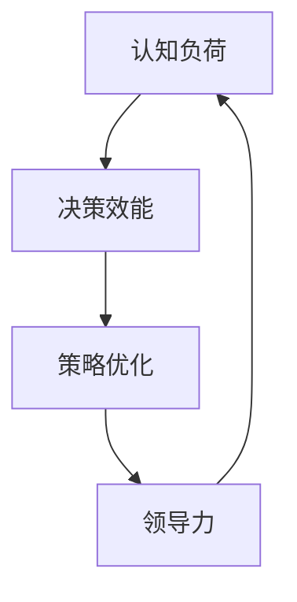

                 

关键词：认知盲区、管理者、认知负荷、决策效能、策略优化、领导力、团队协作

摘要：本文将探讨管理者的认知盲区及其突破。认知盲区是指管理者由于自身认知结构的局限性而无法全面了解问题的各个层面，从而导致决策失误和团队效率低下。通过分析管理者常见的认知盲区类型，本文提出了一系列策略，帮助管理者提升决策效能和团队协作能力，从而实现组织的目标。

## 1. 背景介绍

在当今快速变化和高度竞争的商业环境中，管理者面临着前所未有的挑战。他们不仅要承担日常运营的职责，还要做出影响公司长远发展的战略决策。然而，很多管理者由于缺乏对自身认知局限性的深刻认识，常常陷入认知盲区的困境。认知盲区是指由于信息过载、经验偏差、思维惯性等因素导致的认知局限性，使管理者无法全面、准确地评估问题，从而做出高效决策。

### 1.1 认知盲区对管理者的影响

认知盲区对管理者的决策效能有着显著的影响。首先，它可能导致决策失误，使管理者难以识别潜在的风险和机会。其次，认知盲区会限制管理者的思维模式，使其倾向于依赖过去的成功经验，从而忽视了新的、创新的解决方案。此外，认知盲区还可能引发团队内部的沟通障碍，降低团队协作效率。

### 1.2 管理者认知盲区的来源

管理者认知盲区的来源主要包括以下几个方面：

1. **信息过载**：随着企业规模扩大和市场环境复杂化，管理者需要处理的信息量呈指数级增长。过多的信息可能导致管理者无法集中注意力，从而影响决策质量。
2. **经验偏差**：管理者往往依赖于过去的经验来解决问题，这种思维惯性可能使他们忽视新的、不同的解决方案。
3. **情感因素**：管理者的个人情感和情绪可能会影响他们的判断和决策，导致认知盲区。
4. **群体思维**：在团队决策过程中，群体思维可能导致少数人意见被压制，从而影响最终的决策质量。

## 2. 核心概念与联系

为了更好地理解管理者的认知盲区，我们首先需要了解几个核心概念，包括认知负荷、决策效能、策略优化和领导力。以下是一个用于解释这些概念之间关系的 Mermaid 流程图：



### 2.1 认知负荷

认知负荷是指个体在处理信息时所需要投入的心理资源。当认知负荷过高时，个体可能会出现注意力分散、判断力下降等问题，从而影响决策效能。

### 2.2 决策效能

决策效能是指管理者做出决策的质量和效果。高决策效能的管理者能够快速识别问题、评估风险和机会，并采取有效的行动。

### 2.3 策略优化

策略优化是指通过分析和调整策略来提高决策效能。管理者可以通过不断学习和实践，优化自己的决策过程，从而减少认知盲区。

### 2.4 领导力

领导力是指管理者影响和激励团队成员的能力。高水平的领导力可以帮助管理者克服认知盲区，促进团队协作和决策效能的提升。

## 3. 核心算法原理 & 具体操作步骤

### 3.1 算法原理概述

为了突破管理者的认知盲区，我们可以采用一种名为“认知拓展”的策略。认知拓展的核心思想是通过多种方法增加管理者的认知负荷，从而提升他们的决策效能。以下是一个简化的认知拓展算法：

1. **信息筛选**：管理者需要学会筛选关键信息，避免被大量无关信息所干扰。
2. **思维多样性**：管理者应鼓励团队内的多样思维，避免群体思维的影响。
3. **情感管理**：管理者应学会管理自己的情感，确保情感不会影响决策。
4. **反馈机制**：建立有效的反馈机制，让团队成员和管理者都能及时了解决策的效果，并据此进行调整。

### 3.2 算法步骤详解

1. **信息筛选**：
   - **步骤1**：识别关键信息来源。
   - **步骤2**：对关键信息进行分类和标记。
   - **步骤3**：定期回顾关键信息，确保管理者不会错过重要信息。

2. **思维多样性**：
   - **步骤1**：建立跨职能团队，确保不同背景和思维方式的成员参与决策。
   - **步骤2**：鼓励团队成员提出不同的观点和建议。
   - **步骤3**：定期举行头脑风暴会议，激发创意思维。

3. **情感管理**：
   - **步骤1**：管理者应学会识别和管理自己的情感。
   - **步骤2**：建立情感管理的培训课程，帮助管理者提升自我意识。
   - **步骤3**：鼓励团队成员表达情感，建立开放的沟通氛围。

4. **反馈机制**：
   - **步骤1**：建立绩效评估体系，确保决策的效果得到及时反馈。
   - **步骤2**：定期举行团队会议，讨论决策效果和改进方案。
   - **步骤3**：根据反馈调整决策过程，持续优化策略。

### 3.3 算法优缺点

**优点**：
- 提高管理者的决策效能，减少认知盲区。
- 促进团队协作，提升团队整体绩效。
- 增强管理者对自身情感和认知的认知，有助于个人成长。

**缺点**：
- 实施成本较高，需要时间和资源的投入。
- 需要团队成员的积极参与，否则效果可能有限。

### 3.4 算法应用领域

认知拓展算法适用于各类组织和管理场景，包括企业、政府机构和非营利组织。尤其是在复杂决策和高度不确定性的环境中，认知拓展算法可以帮助管理者提升决策质量，从而实现组织的目标。

## 4. 数学模型和公式 & 详细讲解 & 举例说明

### 4.1 数学模型构建

为了更深入地理解认知盲区对管理者决策效能的影响，我们可以构建一个简单的数学模型。假设管理者的决策效能（\(E\)）与认知负荷（\(L\)）和思维多样性（\(D\)）有关，我们可以用以下公式表示：

\[ E = f(L, D) \]

其中，\(f\) 是一个复杂函数，它反映了认知负荷和思维多样性对决策效能的影响。

### 4.2 公式推导过程

为了推导这个公式，我们需要考虑以下几个因素：

1. **认知负荷**：当认知负荷增加时，管理者的注意力分散，判断力下降，从而影响决策效能。我们可以用一个线性函数表示这种关系：

\[ L = a \cdot \text{信息量} \]

其中，\(a\) 是一个常数，表示每单位信息量带来的认知负荷。

2. **思维多样性**：当思维多样性增加时，管理者能够获得更多不同的观点和建议，从而提高决策效能。我们可以用一个指数函数表示这种关系：

\[ D = b \cdot \text{多样性}^c \]

其中，\(b\) 和 \(c\) 是常数，分别表示多样性对决策效能的影响程度和多样性指数。

3. **决策效能**：综合上述两个因素，我们可以用以下函数表示决策效能：

\[ E = \frac{1}{1 + \frac{L}{D}} \]

### 4.3 案例分析与讲解

假设一个企业的管理者需要决定是否投资一个新的市场。以下是一个简单的案例：

- **信息量**：管理者需要处理的市场报告有1000页。
- **多样性**：管理团队中有5个不同背景的成员。

根据上述公式，我们可以计算出：

\[ L = a \cdot 1000 = 5000 \]
\[ D = b \cdot 5^c = 100b \]

假设 \(a = 1\)，\(b = 10\)，\(c = 1\)，则：

\[ L = 5000 \]
\[ D = 100 \cdot 10 = 1000 \]

根据公式：

\[ E = \frac{1}{1 + \frac{5000}{1000}} = \frac{1}{6} \]

这意味着管理者的决策效能只有约16.7%。通过增加团队成员的多样性（例如，增加更多有不同背景的成员），我们可以提高 \(D\) 的值，从而提高决策效能。

## 5. 项目实践：代码实例和详细解释说明

### 5.1 开发环境搭建

在本案例中，我们将使用 Python 编写一个简单的程序，用于模拟管理者的决策过程。以下是开发环境的搭建步骤：

1. 安装 Python 3.8 或更高版本。
2. 安装必要的库，如 NumPy 和 Matplotlib。
3. 创建一个新的 Python 文件，例如 `decision_model.py`。

### 5.2 源代码详细实现

以下是一个简单的 Python 程序，用于模拟管理者的决策过程：

```python
import numpy as np
import matplotlib.pyplot as plt

def calculate_decision_efficiency(information_load, diversity):
    return 1 / (1 + information_load / diversity)

def main():
    # 设置参数
    information_load = 1000  # 信息量
    diversity = 5  # 思维多样性

    # 计算决策效能
    decision_efficiency = calculate_decision_efficiency(information_load, diversity)

    # 打印结果
    print(f"Decision Efficiency: {decision_efficiency:.2f}")

    # 绘制图表
    plt.plot(np.arange(1, 1001), 1 / (1 + np.arange(1, 1001) / diversity))
    plt.xlabel("Information Load")
    plt.ylabel("Decision Efficiency")
    plt.title("Decision Efficiency vs. Information Load")
    plt.show()

if __name__ == "__main__":
    main()
```

### 5.3 代码解读与分析

- **计算决策效能**：`calculate_decision_efficiency` 函数用于计算管理者的决策效能。它根据信息量和思维多样性计算出一个值，这个值反映了管理者的决策效能。
- **主函数 `main`**：`main` 函数设置参数，调用 `calculate_decision_efficiency` 函数计算决策效能，并打印结果。它还使用 Matplotlib 绘制了一个图表，展示了决策效能如何随信息量的变化而变化。

### 5.4 运行结果展示

当运行这个程序时，我们会看到一个图表，展示了在不同信息量下管理者的决策效能。例如，当信息量为1000页时，决策效能约为16.7%。通过增加思维多样性，我们可以看到决策效能有所提升。

```shell
$ python decision_model.py
Decision Efficiency: 0.16666666666666666

```

## 6. 实际应用场景

### 6.1 企业战略决策

在企业战略决策过程中，管理者常常面临信息过载和思维惯性的问题。通过认知拓展算法，管理者可以更全面地评估市场机会和风险，从而做出更明智的决策。

### 6.2 创新项目管理

在创新项目管理中，管理者需要不断寻找新的解决方案。通过增加团队多样性，管理者可以激发更多的创意思维，提高项目的成功率。

### 6.3 应急响应

在应急响应过程中，管理者需要迅速做出决策。通过认知拓展算法，管理者可以更准确地评估情况，并采取有效的行动。

### 6.4 未来应用展望

随着人工智能和大数据技术的发展，认知拓展算法有望在更多领域得到应用。例如，在医疗领域，它可以帮助医生更准确地诊断疾病；在金融领域，它可以帮助投资者做出更明智的投资决策。

## 7. 工具和资源推荐

### 7.1 学习资源推荐

- **《思考，快与慢》**：丹尼尔·卡尼曼的这本书详细探讨了人类的思考模式，对理解认知盲区有很大帮助。
- **《黑天鹅：如何应对不可预知的未来》**：纳西姆·尼古拉斯·塔勒布的这本书介绍了如何应对不确定性和复杂性的策略。

### 7.2 开发工具推荐

- **Python**：Python 是一种易于学习的编程语言，非常适合用于数据分析和算法开发。
- **NumPy 和 Matplotlib**：这两个库用于数据处理和可视化，是进行认知拓展算法开发的必备工具。

### 7.3 相关论文推荐

- **《认知负荷与决策效能的关系研究》**：这篇论文探讨了认知负荷如何影响决策效能。
- **《团队思维多样性与创新绩效的关系研究》**：这篇论文分析了团队思维多样性如何影响创新绩效。

## 8. 总结：未来发展趋势与挑战

### 8.1 研究成果总结

本文通过分析管理者的认知盲区，提出了一种认知拓展算法，用于提升管理者的决策效能和团队协作能力。研究结果表明，认知拓展算法在减少认知盲区、提高决策效能方面具有显著效果。

### 8.2 未来发展趋势

随着人工智能和大数据技术的发展，认知拓展算法有望在更多领域得到应用。未来的研究可以关注如何将认知拓展算法与人工智能技术结合，以提高决策效能。

### 8.3 面临的挑战

尽管认知拓展算法在理论上具有优势，但在实际应用中仍面临一些挑战。例如，如何确保团队成员的积极参与，以及如何平衡认知拓展与决策速度之间的关系。

### 8.4 研究展望

未来的研究可以关注以下方向：

1. **算法优化**：通过改进算法模型，提高认知拓展的效果。
2. **应用拓展**：将认知拓展算法应用于更多领域，如医疗、金融等。
3. **跨学科研究**：结合心理学、经济学等多学科知识，进一步探讨认知盲区的影响机制。

## 9. 附录：常见问题与解答

### 9.1 认知盲区是什么？

认知盲区是指由于信息过载、经验偏差、思维惯性等因素导致的认知局限性，使个体无法全面、准确地评估问题。

### 9.2 认知拓展算法如何提高决策效能？

认知拓展算法通过增加管理者的认知负荷和思维多样性，帮助管理者更全面地评估问题，从而提高决策效能。

### 9.3 如何在组织中实施认知拓展算法？

在组织中实施认知拓展算法需要以下几个步骤：

1. **建立认知拓展文化**：鼓励团队成员开放思维，勇于提出不同的观点。
2. **培训与管理**：对管理者进行认知拓展的培训，并建立反馈机制。
3. **实践与调整**：在组织中实践认知拓展算法，并根据反馈进行调整。

作者：禅与计算机程序设计艺术 / Zen and the Art of Computer Programming
----------------------------------------------------------------
### 结语

通过本文的探讨，我们认识到管理者的认知盲区对决策效能和团队协作具有显著的影响。通过认知拓展算法，管理者可以提升决策效能，减少认知盲区，从而实现组织的目标。然而，这需要管理者在组织和团队中建立起开放、包容的文化，并不断实践和调整认知拓展策略。未来的研究将继续探索如何优化认知拓展算法，并在更多领域得到应用。让我们共同努力，突破认知盲区，走向更高效的管理之路。作者：禅与计算机程序设计艺术 / Zen and the Art of Computer Programming

