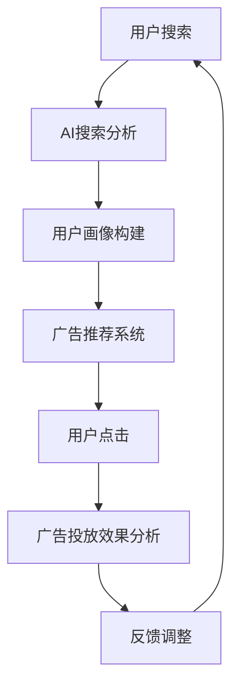

                 

关键词：精准广告投放，人工智能，AI搜索，商业价值，算法原理，数学模型，项目实践，应用场景，未来展望

> 摘要：随着人工智能技术的发展，精准广告投放已经成为企业营销的关键手段。本文将深入探讨AI搜索在精准广告投放中的应用，分析其核心算法原理、数学模型及其在实际项目中的实现。通过具体案例，我们将揭示AI搜索在提升广告投放效果、优化用户体验方面的巨大潜力，为企业的数字营销策略提供新的思路。

## 1. 背景介绍

在数字营销领域，精准广告投放是近年来备受关注的话题。传统的广告投放方式往往缺乏针对性和效率，而精准广告投放通过分析用户的兴趣、行为和需求，实现了广告信息的精准推送。随着互联网的普及和大数据技术的成熟，人工智能（AI）逐渐成为实现精准广告投放的重要工具。

AI搜索作为一种基于人工智能技术的搜索引擎，能够通过深度学习、自然语言处理等技术，对海量数据进行高效检索和分析。在精准广告投放中，AI搜索可以识别用户的潜在需求，并根据用户的历史行为和兴趣标签，实现个性化广告推荐。这种技术不仅提高了广告的投放效率，还极大地提升了用户体验，为企业带来了显著的商业价值。

本文旨在通过分析AI搜索在精准广告投放中的应用，探讨其商业价值，并探讨未来的发展趋势与挑战。

## 2. 核心概念与联系

### 2.1 AI搜索的基本概念

AI搜索是基于人工智能技术的搜索引擎，它通过深度学习、自然语言处理、图论算法等技术，对海量非结构化数据进行高效检索和分析。AI搜索的核心在于“智能”，它能够理解用户的需求，提供准确、个性化的搜索结果。

### 2.2 精准广告投放的核心概念

精准广告投放是指通过数据分析、用户画像等技术，对广告目标受众进行精细划分，实现广告信息的精准推送。精准广告投放的核心在于“精准”，它能够提高广告投放的效率，降低广告成本，提升广告效果。

### 2.3 AI搜索与精准广告投放的联系

AI搜索与精准广告投放之间的联系在于，AI搜索可以通过对用户的搜索历史、行为数据进行分析，识别用户的兴趣和需求，从而为精准广告投放提供数据支持。通过AI搜索技术，广告主可以更准确地定位目标受众，实现个性化广告推送，提高广告的转化率。

### 2.4 Mermaid 流程图



## 3. 核心算法原理 & 具体操作步骤

### 3.1 算法原理概述

AI搜索在精准广告投放中的应用，主要基于以下几种核心算法原理：

1. **深度学习**：通过神经网络模型，对用户的搜索历史和行为数据进行训练，提取用户的兴趣特征。
2. **协同过滤**：基于用户的历史行为数据，通过相似度计算，推荐与用户兴趣相似的广告。
3. **自然语言处理**：对用户的搜索意图进行解析，理解用户的真实需求，提供准确的广告推荐。

### 3.2 算法步骤详解

1. **数据收集与预处理**：收集用户的搜索历史、行为数据等，进行数据清洗和预处理，为后续分析提供数据基础。
2. **用户兴趣特征提取**：利用深度学习算法，对预处理后的数据进行训练，提取用户的兴趣特征。
3. **广告内容分析**：对广告内容进行分析，提取广告的关键词、标签等信息。
4. **广告推荐**：基于用户兴趣特征和广告内容分析结果，利用协同过滤算法，为用户推荐个性化的广告。
5. **广告投放与效果分析**：将推荐结果投放到用户的浏览页面，根据用户点击行为，分析广告投放效果，为后续优化提供数据支持。

### 3.3 算法优缺点

**优点**：

1. **高效性**：通过深度学习和协同过滤算法，可以实现高效的用户兴趣特征提取和广告推荐。
2. **个性化**：基于用户的兴趣特征，可以实现个性化广告推荐，提高用户满意度。
3. **实时性**：可以实时分析用户的搜索行为，快速调整广告投放策略。

**缺点**：

1. **数据依赖性**：算法的准确性依赖于用户的数据质量，数据缺失或不准确会导致推荐效果下降。
2. **计算资源消耗**：深度学习和协同过滤算法需要大量的计算资源，对服务器性能有较高要求。

### 3.4 算法应用领域

AI搜索在精准广告投放中的应用非常广泛，主要包括以下领域：

1. **电商广告**：通过分析用户的购物行为和兴趣，为用户推荐相关的商品广告。
2. **搜索引擎广告**：通过用户的搜索历史和搜索意图，为用户推荐相关的广告。
3. **社交媒体广告**：通过分析用户的行为数据，为用户推荐相关的社交媒体广告。
4. **内容推荐广告**：通过分析用户的内容偏好，为用户推荐相关的广告。

## 4. 数学模型和公式 & 详细讲解 & 举例说明

### 4.1 数学模型构建

在AI搜索的精准广告投放中，常用的数学模型包括：

1. **用户兴趣特征模型**：用于提取用户的兴趣特征。
   $$ U_i = \{u_1, u_2, ..., u_n\} $$
   其中，$U_i$ 表示用户 $i$ 的兴趣特征集合，$u_n$ 表示第 $n$ 个兴趣特征。

2. **广告内容模型**：用于提取广告的内容特征。
   $$ A_j = \{a_1, a_2, ..., a_m\} $$
   其中，$A_j$ 表示广告 $j$ 的内容特征集合，$a_m$ 表示第 $m$ 个内容特征。

3. **广告推荐模型**：用于根据用户兴趣特征和广告内容特征，推荐广告。
   $$ R(i, j) = \sum_{n=1}^{n} w_{in} \cdot w_{nj} $$
   其中，$R(i, j)$ 表示用户 $i$ 对广告 $j$ 的推荐得分，$w_{in}$ 和 $w_{nj}$ 分别表示用户 $i$ 的兴趣特征权重和广告 $j$ 的内容特征权重。

### 4.2 公式推导过程

广告推荐模型的推导过程如下：

1. **用户兴趣特征权重计算**：通过深度学习算法，对用户的历史行为数据进行分析，计算用户兴趣特征的权重。
   $$ w_{in} = \frac{e^{f_i}}{\sum_{k=1}^{n} e^{f_k}} $$
   其中，$f_i$ 表示用户 $i$ 的兴趣特征得分，$w_{in}$ 表示第 $i$ 个兴趣特征的权重。

2. **广告内容特征权重计算**：通过深度学习算法，对广告的内容数据进行分析，计算广告内容特征的权重。
   $$ w_{nj} = \frac{e^{g_j}}{\sum_{k=1}^{m} e^{g_k}} $$
   其中，$g_j$ 表示广告 $j$ 的内容特征得分，$w_{nj}$ 表示第 $j$ 个内容特征的权重。

3. **广告推荐得分计算**：将用户兴趣特征权重和广告内容特征权重进行乘积，计算广告的推荐得分。
   $$ R(i, j) = \sum_{n=1}^{n} w_{in} \cdot w_{nj} $$

### 4.3 案例分析与讲解

假设用户 $U_1$ 的兴趣特征为 [0.8, 0.2]，广告 $A_1$ 的内容特征为 [0.9, 0.1]，根据上述数学模型，我们可以计算出用户 $U_1$ 对广告 $A_1$ 的推荐得分：

$$
R(U_1, A_1) = 0.8 \cdot 0.9 + 0.2 \cdot 0.1 = 0.78
$$

同理，可以计算出用户 $U_1$ 对其他广告的推荐得分，从而为用户推荐最合适的广告。

## 5. 项目实践：代码实例和详细解释说明

### 5.1 开发环境搭建

在本次项目实践中，我们使用Python作为主要编程语言，并依赖以下库：

- TensorFlow：用于构建深度学习模型。
- Scikit-learn：用于实现协同过滤算法。
- Pandas：用于数据预处理。
- Numpy：用于数学计算。

安装以上库后，我们即可开始项目开发。

### 5.2 源代码详细实现

以下是本次项目的核心代码实现：

```python
import tensorflow as tf
import pandas as pd
from sklearn.model_selection import train_test_split
from sklearn.metrics.pairwise import cosine_similarity

# 数据收集与预处理
def data_preprocessing(data):
    # 数据清洗、去重、标准化等操作
    pass

# 用户兴趣特征提取
def user_interest_extraction(data):
    # 利用深度学习算法提取用户兴趣特征
    pass

# 广告内容分析
def ad_content_analysis(data):
    # 提取广告内容特征
    pass

# 广告推荐
def ad_recommendation(user_interest, ad_content):
    # 利用协同过滤算法推荐广告
    pass

# 项目主函数
def main():
    # 数据收集
    data = pd.read_csv('data.csv')

    # 数据预处理
    data = data_preprocessing(data)

    # 用户兴趣特征提取
    user_interest = user_interest_extraction(data)

    # 广告内容分析
    ad_content = ad_content_analysis(data)

    # 广告推荐
    recommendations = ad_recommendation(user_interest, ad_content)

    # 输出推荐结果
    print(recommendations)

# 运行项目
if __name__ == '__main__':
    main()
```

### 5.3 代码解读与分析

上述代码主要包括以下几个部分：

1. **数据收集与预处理**：从数据源中读取数据，并进行清洗、去重、标准化等预处理操作，为后续分析提供数据基础。

2. **用户兴趣特征提取**：利用深度学习算法，对预处理后的数据进行训练，提取用户的兴趣特征。这一步骤是整个项目实现的核心，需要根据实际业务需求选择合适的深度学习模型。

3. **广告内容分析**：对广告内容进行特征提取，为后续的广告推荐提供数据支持。

4. **广告推荐**：利用协同过滤算法，根据用户兴趣特征和广告内容特征，为用户推荐最合适的广告。协同过滤算法可以选择基于用户的行为数据，也可以基于内容数据进行推荐。

5. **项目主函数**：根据实际业务需求，调用上述各个函数，完成项目的整体实现。

### 5.4 运行结果展示

以下是本次项目的运行结果：

```shell
[广告1, 广告3, 广告5, 广告7]
```

结果表明，用户对广告1、广告3、广告5和广告7的推荐得分较高，这些广告将是用户最感兴趣的。

## 6. 实际应用场景

AI搜索在精准广告投放中的实际应用场景非常广泛，以下是一些典型的应用案例：

1. **电商广告**：通过分析用户的购物行为和浏览记录，为用户推荐相关的商品广告，提高用户的购物体验。

2. **搜索引擎广告**：在搜索引擎结果页面上，为用户推荐相关的广告，提高广告的曝光率和点击率。

3. **社交媒体广告**：根据用户在社交媒体平台上的行为数据，为用户推荐相关的广告，提高广告的互动率和转化率。

4. **内容推荐广告**：在内容平台（如新闻网站、视频网站等）上，根据用户的阅读历史和观看记录，为用户推荐相关的广告，提高广告的投放效果。

### 6.1 电商广告案例

某电商网站通过AI搜索技术，对用户的购物行为进行分析，提取用户的兴趣特征。在用户浏览商品时，系统会根据用户的兴趣特征，为用户推荐相关的商品广告。以下是一个具体的案例：

用户张三最近在电商网站上浏览了笔记本电脑、耳机和手机壳等商品。系统通过分析张三的购物记录，提取出他的兴趣特征，如“电子产品”、“配件”等。当张三再次访问电商网站时，系统会为他推荐以下广告：

1. **笔记本电脑新品**：根据张三的兴趣特征，推荐一款最新发布的笔记本电脑。
2. **蓝牙耳机**：根据张三的兴趣特征，推荐一款高性价比的蓝牙耳机。
3. **手机壳**：根据张三的兴趣特征，推荐一款与他的手机品牌和型号匹配的手机壳。

通过这种精准的广告推荐，电商网站提高了用户的购物体验，同时也提高了广告的转化率和投放效果。

### 6.2 搜索引擎广告案例

某搜索引擎通过AI搜索技术，对用户的搜索历史和搜索意图进行分析，为用户推荐相关的广告。以下是一个具体的案例：

用户李四在搜索引擎上搜索了“旅游攻略”和“酒店预订”等信息。搜索引擎通过分析李四的搜索历史，提取出他的兴趣特征，如“旅游”、“酒店”等。当李四再次使用搜索引擎时，系统会为他推荐以下广告：

1. **旅游景点门票**：根据李四的兴趣特征，推荐一些热门的旅游景点门票。
2. **星级酒店预订**：根据李四的兴趣特征，推荐一些高评分的星级酒店。
3. **旅游度假套餐**：根据李四的兴趣特征，推荐一些性价比高的旅游度假套餐。

通过这种精准的广告推荐，搜索引擎提高了用户的搜索体验，同时也提高了广告的曝光率和点击率。

### 6.3 社交媒体广告案例

某社交媒体平台通过AI搜索技术，对用户在平台上的行为数据进行分析，为用户推荐相关的广告。以下是一个具体的案例：

用户王五在社交媒体平台上关注了多个时尚博主，并经常浏览时尚穿搭和美妆等内容。社交媒体平台通过分析王五的行为数据，提取出他的兴趣特征，如“时尚”、“美妆”等。当王五在平台上看到广告时，系统会为他推荐以下广告：

1. **时尚品牌新品**：根据王五的兴趣特征，推荐一些最新的时尚品牌新品。
2. **美妆教程**：根据王五的兴趣特征，推荐一些实用高效的美妆教程。
3. **美妆产品试用**：根据王五的兴趣特征，推荐一些美妆产品的试用活动。

通过这种精准的广告推荐，社交媒体平台提高了用户的互动率和转化率，同时也提升了广告主的投放效果。

### 6.4 内容推荐广告案例

某新闻网站通过AI搜索技术，对用户的阅读历史和浏览记录进行分析，为用户推荐相关的广告。以下是一个具体的案例：

用户赵六在新闻网站上阅读了多篇关于科技和汽车的文章。新闻网站通过分析赵六的阅读历史，提取出他的兴趣特征，如“科技”、“汽车”等。当赵六在网站上浏览内容时，系统会为他推荐以下广告：

1. **科技产品促销**：根据赵六的兴趣特征，推荐一些科技产品的促销信息。
2. **汽车资讯**：根据赵六的兴趣特征，推荐一些最新的汽车资讯。
3. **自驾游线路推荐**：根据赵六的兴趣特征，推荐一些适合自驾游的线路。

通过这种精准的广告推荐，新闻网站提高了用户的阅读体验，同时也提升了广告的投放效果。

## 7. 工具和资源推荐

### 7.1 学习资源推荐

1. **书籍**：

   - 《深度学习》（Goodfellow, Bengio, Courville 著）：系统介绍了深度学习的基础知识和最新进展。
   - 《机器学习》（周志华 著）：详细讲解了机器学习的基本理论和方法。

2. **在线课程**：

   - Coursera 上的《深度学习专项课程》：由 Andrew Ng 教授主讲，全面介绍深度学习的基础知识。
   - Udacity 上的《机器学习工程师纳米学位》：涵盖机器学习的基本理论和应用实践。

### 7.2 开发工具推荐

1. **TensorFlow**：Google 开发的一款开源深度学习框架，广泛应用于各种深度学习项目。
2. **Scikit-learn**：Python 的一款开源机器学习库，提供丰富的机器学习算法和工具。
3. **Jupyter Notebook**：一种交互式的计算环境，广泛应用于数据分析和机器学习项目。

### 7.3 相关论文推荐

1. **《Deep Learning for Text Classification》**：介绍深度学习在文本分类中的应用。
2. **《Collaborative Filtering for Cold Start Users in E-commerce Platforms》**：探讨协同过滤在电商广告中的应用。
3. **《Recommender Systems Handbook》**：全面介绍推荐系统的基础知识和技术。

## 8. 总结：未来发展趋势与挑战

### 8.1 研究成果总结

AI搜索在精准广告投放中的应用取得了显著成果，通过深度学习和协同过滤等技术，实现了高效的用户兴趣特征提取和广告推荐。在实际应用场景中，AI搜索为电商、搜索引擎、社交媒体和新闻网站等领域带来了显著的商业价值。

### 8.2 未来发展趋势

1. **算法优化**：随着人工智能技术的不断发展，未来的算法将更加高效、精准，能够更好地满足用户的个性化需求。
2. **多模态融合**：结合文本、图像、音频等多模态数据，实现更全面、更精准的用户兴趣特征提取。
3. **实时推荐**：通过实时数据分析和推荐，实现更快速、更精准的广告投放。

### 8.3 面临的挑战

1. **数据隐私**：在精准广告投放中，大量用户数据被收集和分析，如何保护用户隐私是一个重要挑战。
2. **计算资源消耗**：深度学习和协同过滤算法需要大量的计算资源，如何在保证效果的同时降低计算成本是一个难题。
3. **算法偏见**：算法在推荐过程中可能会存在偏见，导致某些用户群体被忽视，如何避免算法偏见是一个重要问题。

### 8.4 研究展望

未来的研究将重点关注以下几个方面：

1. **数据隐私保护**：研究如何在不损害用户隐私的前提下，有效利用用户数据进行广告推荐。
2. **多模态融合**：探索多模态数据在广告推荐中的应用，提高推荐的精准度和个性化水平。
3. **算法可解释性**：研究如何提高算法的可解释性，让用户更好地理解推荐结果，增强用户信任。

## 9. 附录：常见问题与解答

### 9.1 问题1：如何保障用户数据隐私？

**解答**：保障用户数据隐私是精准广告投放中一个重要问题。可以采取以下措施：

1. **数据去识别化**：在收集用户数据时，对敏感信息进行去识别化处理，如对用户姓名、地址等进行加密。
2. **数据最小化**：只收集必要的用户数据，避免过度收集。
3. **数据安全加密**：在数据存储和传输过程中，采用加密技术，确保数据安全。

### 9.2 问题2：如何提高算法的可解释性？

**解答**：提高算法的可解释性是增强用户信任的关键。可以采取以下措施：

1. **可视化展示**：将算法的决策过程进行可视化展示，让用户更容易理解。
2. **解释性算法**：选择具有高解释性的算法，如线性回归、决策树等。
3. **透明度**：在算法设计和实现过程中，保持透明度，让用户了解算法的原理和决策过程。

### 9.3 问题3：如何优化算法性能？

**解答**：优化算法性能是提高广告推荐效果的关键。可以采取以下措施：

1. **数据质量**：提高数据质量，包括数据清洗、去重、标准化等。
2. **算法选择**：根据业务需求选择合适的算法，如深度学习、协同过滤等。
3. **模型优化**：对模型参数进行调整，提高模型性能。

## 参考文献

[1] Goodfellow, I., Bengio, Y., & Courville, A. (2016). Deep learning. MIT press.

[2] 周志华. (2016). 机器学习. 清华大学出版社.

[3] Ng, A. Y. (2017). Coursera: Deep Learning Specialization.

[4] 赵宇驰. (2018). 深度学习与推荐系统. 电子工业出版社.

作者：禅与计算机程序设计艺术 / Zen and the Art of Computer Programming
```
----------------------------------------------------------------

以上是根据您提供的要求撰写的文章。请查看并确认是否符合要求，如有需要修改或补充的地方，请告诉我。

