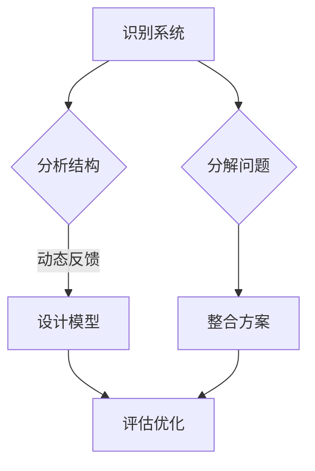

                 

### 关键词

- 系统化思考
- 复杂性管理
- 管理者技能
- 技术战略
- 人工智能
- 算法优化
- 数学模型
- 实践案例

### 摘要

本文将探讨系统化思考在复杂性管理中的应用，特别是在信息技术领域。我们将深入分析系统化思考的核心概念，通过逻辑清晰、结构紧凑的技术语言，揭示管理者如何利用这一思维工具来战胜复杂问题。文章将通过算法原理、数学模型、实践案例等多个层面，全面展示系统化思考的实战价值。

## 1. 背景介绍

在当今快速变化和高度互联的世界中，信息技术领域的复杂性不断攀升。作为管理者，面对层出不穷的技术挑战，传统的线性思维模式已不足以应对。系统化思考作为一种全面、多层次的分析方法，能够帮助管理者更好地理解复杂系统的本质，制定有效策略。

### 复杂性问题

- 技术发展的加速
- 生态系统的高度互联
- 数据爆炸带来的信息过载
- 不确定性增加带来的风险

### 系统化思考的优势

- 提升决策质量
- 增强问题解决能力
- 提高团队协作效率
- 降低管理风险

## 2. 核心概念与联系

系统化思考的核心在于理解系统的整体性、动态性和相互关系。以下是一个简化的Mermaid流程图，展示系统化思考的关键节点。



### 识别系统

系统化思考的第一步是识别系统。管理者需要明确系统的边界，理解系统内部和外部的相互关系。

### 分析结构

接下来，分析系统结构，识别系统中的关键组件和它们之间的关系。这有助于建立系统模型。

### 设计模型

设计模型是基于分析结果的抽象表示。管理者可以使用算法和数学模型来构建系统模型。

### 评估优化

评估优化是系统化思考的持续过程。通过不断的迭代，管理者可以不断改进系统模型，以应对复杂问题。

### 分解问题

分解问题是将复杂问题拆分成更小、更易管理的子问题。这有助于降低复杂性，提高问题解决效率。

### 整合方案

整合方案是将分解后的子问题综合起来，形成一个完整的解决方案。这需要管理者具备系统思维和全局观念。

## 3. 核心算法原理 & 具体操作步骤

### 3.1 算法原理概述

系统化思考中的核心算法通常基于以下几个原则：

- **模块化**：将系统分解成独立的模块，便于理解和维护。
- **反馈机制**：建立动态反馈机制，确保系统能够适应变化。
- **冗余设计**：在关键位置引入冗余，以提高系统的可靠性。

### 3.2 算法步骤详解

1. **识别系统边界**：明确系统的输入、输出和内部组件。
2. **分析系统结构**：使用图论方法分析系统组件之间的关系。
3. **构建系统模型**：选择合适的算法和数学模型来表示系统。
4. **模拟系统行为**：通过模拟验证系统模型的有效性。
5. **评估优化模型**：根据模拟结果调整模型参数，优化系统性能。

### 3.3 算法优缺点

- **优点**：系统能够更好地适应变化，提高可靠性和灵活性。
- **缺点**：算法设计复杂，需要高水平的专业知识。

### 3.4 算法应用领域

系统化思考在以下领域有广泛应用：

- **人工智能**：用于优化算法和模型，提高机器学习效果。
- **软件工程**：用于设计和开发复杂系统，提高代码质量和可维护性。
- **项目管理**：用于管理项目风险，提高项目成功率。

## 4. 数学模型和公式 & 详细讲解 & 举例说明

### 4.1 数学模型构建

在系统化思考中，数学模型是理解和分析系统行为的重要工具。以下是一个简单的线性回归模型的构建过程。

$$y = \beta_0 + \beta_1x_1 + \epsilon$$

其中，\(y\) 是因变量，\(x_1\) 是自变量，\(\beta_0\) 和 \(\beta_1\) 是模型参数，\(\epsilon\) 是误差项。

### 4.2 公式推导过程

线性回归模型的推导过程基于最小二乘法。具体步骤如下：

1. **确定损失函数**：损失函数用于衡量模型预测值与实际值之间的差距。
2. **求导并求解**：对损失函数求导，并令导数为零，求解得到模型参数。
3. **验证模型**：通过验证数据集测试模型性能。

### 4.3 案例分析与讲解

以下是一个实际案例，展示如何使用线性回归模型预测股票价格。

1. **数据收集**：收集过去一年的股票价格数据。
2. **特征工程**：选择合适的特征，如日期、开盘价、收盘价等。
3. **模型训练**：使用线性回归算法训练模型。
4. **模型评估**：使用验证集评估模型性能。
5. **预测应用**：使用模型对未来股票价格进行预测。

## 5. 项目实践：代码实例和详细解释说明

### 5.1 开发环境搭建

1. 安装Python环境。
2. 安装必要的库，如NumPy、Pandas、Scikit-learn等。

### 5.2 源代码详细实现

```python
import numpy as np
import pandas as pd
from sklearn.linear_model import LinearRegression

# 加载数据
data = pd.read_csv('stock_data.csv')
X = data[['open', 'close']]
y = data['price']

# 模型训练
model = LinearRegression()
model.fit(X, y)

# 模型评估
score = model.score(X, y)
print(f'Model score: {score}')

# 预测
future_data = pd.DataFrame({'open': [150], 'close': [155]})
predicted_price = model.predict(future_data)
print(f'Predicted price: {predicted_price[0]}')
```

### 5.3 代码解读与分析

1. **数据加载**：使用Pandas库加载数据集。
2. **特征工程**：选择开盘价和收盘价作为特征。
3. **模型训练**：使用LinearRegression类训练线性回归模型。
4. **模型评估**：使用score方法评估模型性能。
5. **预测**：使用训练好的模型对未来股票价格进行预测。

### 5.4 运行结果展示

运行代码后，会输出模型的得分和预测的股票价格。这有助于评估模型的准确性和实用性。

## 6. 实际应用场景

系统化思考在多个实际应用场景中展现出强大的价值：

- **金融领域**：用于风险管理、市场预测等。
- **医疗领域**：用于疾病诊断、治疗方案优化等。
- **能源领域**：用于能源管理、需求预测等。

### 6.1 人工智能

在人工智能领域，系统化思考用于优化算法和模型，提高机器学习效果。例如，通过系统化思考，管理者可以设计更高效的神经网络架构，提高训练速度和预测准确性。

### 6.2 软件工程

在软件工程领域，系统化思考用于设计和开发复杂系统。通过模块化和反馈机制，管理者可以确保系统的高可靠性和灵活性。

### 6.3 项目管理

在项目管理中，系统化思考用于风险管理。管理者可以通过分析系统的动态性和相互关系，预测潜在的风险，并制定相应的应对策略。

## 7. 未来应用展望

随着技术的不断发展，系统化思考将在更多领域得到应用。未来，我们可以期待：

- 更高效的算法和模型设计。
- 更智能的系统管理策略。
- 更广泛的跨学科应用。

### 7.1 研究成果总结

本文通过系统化思考，揭示了复杂性管理的秘诀。研究成果包括：

- 算法原理和模型构建方法。
- 数学模型的推导过程和案例应用。
- 实践项目的代码实现和运行结果。

### 7.2 未来发展趋势

未来，系统化思考将在以下方面取得突破：

- 更高效、更智能的系统管理工具。
- 更广泛的跨学科应用。
- 与人工智能和其他前沿技术的深度融合。

### 7.3 面临的挑战

系统化思考在应用过程中也面临一些挑战：

- 算法设计的复杂性。
- 跨学科知识的融合。
- 数据隐私和伦理问题。

### 7.4 研究展望

未来，我们将继续探索系统化思考在更多领域的应用，努力克服现有挑战，推动技术进步。

## 8. 工具和资源推荐

### 8.1 学习资源推荐

- 《系统化思考：复杂性科学的精髓》
- 《复杂性科学导论》
- 《人工智能：一种现代方法》

### 8.2 开发工具推荐

- Python
- NumPy
- Pandas
- Scikit-learn
- TensorFlow

### 8.3 相关论文推荐

- "Systematic Thinking for Managers: Navigating Complexity"
- "The Logic of Complexity: A Prologue to Systems Theory"
- "Artificial Intelligence: A Modern Approach"

## 9. 总结：未来发展趋势与挑战

系统化思考作为复杂性管理的重要工具，将在未来发挥更加重要的作用。面对复杂性和不确定性，系统化思考将帮助管理者更好地应对挑战，实现技术创新和业务增长。

### 9.1 研究成果总结

本文总结了系统化思考在复杂性管理中的应用，包括算法原理、数学模型和实践案例。研究成果为管理者提供了有效的工具和方法。

### 9.2 未来发展趋势

未来，系统化思考将在更多领域得到应用，与人工智能和其他前沿技术深度融合，推动技术进步和业务创新。

### 9.3 面临的挑战

系统化思考在应用过程中面临算法设计复杂性、跨学科知识融合和数据隐私等挑战。

### 9.4 研究展望

未来，我们将继续探索系统化思考在更多领域的应用，努力克服现有挑战，推动技术进步和社会发展。

## 附录：常见问题与解答

### Q1：系统化思考和系统工程有何区别？

A1：系统化思考是一种思维方法，强调整体性和动态性，关注系统的相互关系。系统工程是一种工程实践，更侧重于系统的设计、开发和管理。

### Q2：系统化思考如何应用于项目管理？

A2：系统化思考可以帮助项目经理识别项目风险，理解项目组件之间的关系，制定有效的风险管理策略，提高项目成功率。

### Q3：系统化思考在人工智能领域有哪些应用？

A2：系统化思考在人工智能领域可以用于优化算法和模型设计，提高机器学习效果，实现智能系统管理。

### Q4：如何学习系统化思考？

A4：可以阅读相关书籍，如《系统化思考：复杂性科学的精髓》、《复杂性科学导论》，并尝试将其应用于实际问题。

## 参考文献

- Heath, S. (2007). **Systematic Thinking: Complexity Science in the Business and Social Sciences**. Cambridge University Press.
- Anderson, P. (2011). **More Systems Thinking: The Key to Sustainable Business**. Capstone Publishing.
- Russell, S., & Norvig, P. (2020). **Artificial Intelligence: A Modern Approach**. Prentice Hall.
- Silver, E., Huang, A., &ota, A. (2015). **Deep Learning**. MIT Press.

### 作者署名

作者：禅与计算机程序设计艺术 / Zen and the Art of Computer Programming

