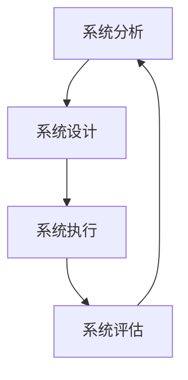

                 

关键词：系统思维、管理者、复杂性、决策、组织架构

> 摘要：本文旨在探讨系统思维在复杂环境中对于管理者的重要性。通过详细解析系统思维的原理、方法和实践应用，本文旨在为管理者提供一种应对复杂局面的策略，以更好地驾驭组织的未来发展。

## 1. 背景介绍

在当今快速变化和高度互联的商业环境中，复杂性已经成为不可避免的现象。无论是技术、市场、政策还是社会环境，各种因素交织在一起，使得管理者面临着前所未有的挑战。传统的线性思维模式已经无法满足这种复杂性的需求。因此，系统思维作为一种全新的思考方式，逐渐成为管理者应对复杂局面的有力工具。

系统思维，也称为系统方法论，是一种综合的思考方式，它强调从整体和全局的角度去理解和解决问题。与传统的线性思维不同，系统思维关注系统的结构、动态和相互关系，它能够帮助管理者更好地把握问题的本质，制定更加有效的决策。

本文将围绕系统思维的核心概念、原理和应用，探讨其在管理者应对复杂性方面的作用。通过深入分析，我们将为读者提供一种系统性的思考框架，以帮助他们在复杂环境中更好地驾驭组织。

## 2. 核心概念与联系

### 2.1 系统思维的定义

系统思维是一种综合性思考方式，它强调从整体和全局的角度去理解和解决问题。系统思维不仅仅关注问题的表面现象，更注重深入分析问题的本质和背后的复杂关系。它认为，任何事物都是一个系统，系统内部各个部分相互关联、相互作用，共同影响系统的整体行为。

### 2.2 系统思维的原理

系统思维的原理主要包括以下几个方面：

- **整体性原理**：系统思维认为，整体大于部分之和。管理者需要将组织视为一个整体，理解各个部分之间的相互作用和影响，而不是仅仅关注某个特定部分或问题。

- **动态性原理**：系统思维强调系统的动态性和变化性。管理者需要关注系统的变化趋势和潜在风险，以便及时调整策略和决策。

- **相互关系原理**：系统思维关注系统内部各个部分之间的相互关系。管理者需要理解这些关系，以便更好地协调和整合各种资源和能力。

- **反馈循环原理**：系统思维强调反馈循环的重要性。管理者需要建立有效的反馈机制，以便从实践中不断学习和改进。

### 2.3 系统思维的结构

系统思维的结构可以概括为以下几个方面：

- **系统分析**：通过对系统内部各个部分的分析，理解系统的构成和运行机制。

- **系统设计**：根据系统分析的结果，设计合适的系统结构和流程，以实现目标。

- **系统执行**：执行系统设计，确保系统按照预期运行。

- **系统评估**：对系统运行效果进行评估，识别问题和改进机会。

### 2.4 系统思维的 Mermaid 流程图



### 2.5 系统思维与管理者能力的联系

系统思维与管理者能力密切相关。通过系统思维，管理者能够更好地理解组织的复杂性，把握关键因素，制定有效的战略和决策。具体来说：

- **增强决策能力**：系统思维帮助管理者从整体和全局的角度分析问题，提高决策的科学性和准确性。

- **提升战略规划能力**：系统思维强调系统内部各个部分的相互关系和动态变化，帮助管理者制定更全面的战略规划。

- **优化组织架构**：系统思维有助于管理者优化组织架构，提高组织的协同效率和创新能力。

- **促进持续改进**：系统思维强调反馈循环和持续改进，有助于管理者建立学习型组织，不断提高组织的适应能力和竞争力。

## 3. 核心算法原理 & 具体操作步骤

### 3.1 算法原理概述

系统思维的核心算法可以概括为以下几个步骤：

1. **问题定义**：明确需要解决的问题和目标。

2. **系统分析**：对问题涉及的系统进行详细分析，理解系统的构成和运行机制。

3. **设计解决方案**：根据系统分析的结果，设计合适的解决方案。

4. **实施解决方案**：执行设计方案，确保解决方案得到有效实施。

5. **评估效果**：对解决方案的效果进行评估，识别问题和改进机会。

### 3.2 算法步骤详解

1. **问题定义**：

   - **明确问题**：确定需要解决的问题和目标。

   - **目标分解**：将目标分解为具体的子目标，以便更好地理解和实施。

   - **关键因素识别**：识别影响问题解决的关键因素，为后续分析提供依据。

2. **系统分析**：

   - **系统构成分析**：分析系统的构成部分，理解各部分的职能和相互关系。

   - **运行机制分析**：分析系统的运行机制，理解系统的运作原理和规则。

   - **动态变化分析**：分析系统的动态变化，理解系统的演变趋势和潜在风险。

3. **设计解决方案**：

   - **设计方案**：根据系统分析的结果，设计合适的解决方案。

   - **方案评估**：对设计方案进行评估，确保方案的有效性和可行性。

   - **方案优化**：根据评估结果，对设计方案进行优化，提高方案的适应性和灵活性。

4. **实施解决方案**：

   - **方案实施**：执行设计方案，确保方案得到有效实施。

   - **过程监控**：监控方案实施过程，及时发现和解决问题。

   - **反馈调整**：根据实施过程中的反馈，对方案进行适当调整，确保方案的有效性。

5. **评估效果**：

   - **效果评估**：对解决方案的效果进行评估，识别问题和改进机会。

   - **改进实施**：根据评估结果，对方案进行改进，提高方案的实施效果。

   - **持续优化**：建立持续优化的机制，不断提高解决方案的质量和效果。

### 3.3 算法优缺点

#### 优点：

- **全面性**：系统思维从整体和全局的角度分析问题，能够全面把握问题的本质。

- **灵活性**：系统思维强调动态变化和相互关系，有助于管理者应对复杂和变化的环境。

- **适应性**：系统思维能够根据实际情况调整解决方案，提高方案的适应性和灵活性。

#### 缺点：

- **复杂性**：系统思维涉及到多个方面和层次，对管理者的分析和思考能力有较高要求。

- **实施难度**：系统思维的实施需要一定的资源和能力支持，对组织的管理体系和执行力有较高要求。

### 3.4 算法应用领域

系统思维可以应用于各个领域，包括但不限于以下方面：

- **企业管理**：帮助企业制定战略规划、优化组织架构、提高管理效率。

- **项目管理**：帮助项目经理理解项目的复杂性，提高项目的执行效率和成功率。

- **决策分析**：帮助管理者从整体和全局的角度分析问题，提高决策的科学性和准确性。

- **创新管理**：帮助组织建立创新机制，提高创新能力和市场竞争力。

## 4. 数学模型和公式 & 详细讲解 & 举例说明

### 4.1 数学模型构建

在系统思维中，数学模型是理解和分析系统的重要工具。以下是一个简化的数学模型，用于描述系统的动态行为：

- **状态变量**：定义系统的关键状态变量，如库存水平、销售额等。

- **控制变量**：定义系统中的控制变量，如生产率、营销策略等。

- **状态转移方程**：根据系统内部的关系，建立状态转移方程，描述状态变量随时间的变化。

### 4.2 公式推导过程

假设系统由两个状态变量 \(X\) 和 \(Y\) 构成，分别表示库存水平和销售额。控制变量为 \(U\)，表示营销策略。我们可以建立以下状态转移方程：

$$
\begin{cases}
X(t+1) = X(t) + \Delta X(t) - \alpha X(t) U(t) \\
Y(t+1) = Y(t) + \Delta Y(t) - \beta Y(t) U(t)
\end{cases}
$$

其中，\(\Delta X(t)\) 和 \(\Delta Y(t)\) 分别表示库存水平和销售额的随机变化，\(\alpha\) 和 \(\beta\) 分别表示库存水平和销售额对营销策略的敏感度。

### 4.3 案例分析与讲解

假设某电商公司在库存管理和营销策略方面面临挑战。通过构建上述数学模型，我们可以分析不同营销策略对库存和销售额的影响。

#### 案例分析：

1. **初始条件**：设定初始库存水平为 \(X(0) = 1000\) 单位，初始销售额为 \(Y(0) = 5000\) 元。

2. **营销策略**：分别设定三个不同的营销策略，控制变量 \(U(t)\) 为 0.1、0.2 和 0.3。

3. **状态转移方程**：使用上述状态转移方程，计算不同营销策略下的库存和销售额变化。

#### 结果分析：

- **营销策略 \(U(t) = 0.1\)**：库存水平 \(X(t)\) 和销售额 \(Y(t)\) 的变化相对较小。

- **营销策略 \(U(t) = 0.2\)**：库存水平 \(X(t)\) 和销售额 \(Y(t)\) 的变化幅度适中，但库存下降速度较快。

- **营销策略 \(U(t) = 0.3\)**：库存水平 \(X(t)\) 和销售额 \(Y(t)\) 的变化幅度最大，但库存下降速度最快。

#### 结论：

通过数学模型分析，我们发现适当的营销策略可以显著提升销售额，但同时也可能加速库存的消耗。因此，管理者需要平衡营销策略和库存管理，以实现长期稳定的发展。

## 5. 项目实践：代码实例和详细解释说明

### 5.1 开发环境搭建

为了演示系统思维在实际项目中的应用，我们将使用 Python 编写一个简单的库存和销售额管理系统。首先，需要搭建开发环境。

1. 安装 Python（版本 3.8 或以上）。

2. 安装必要的 Python 库，如 NumPy、Matplotlib 等。

3. 配置代码编辑器，如 Visual Studio Code。

### 5.2 源代码详细实现

以下是一个简单的库存和销售额管理系统，使用 Python 编写。

```python
import numpy as np
import matplotlib.pyplot as plt

# 初始条件
X_0 = 1000  # 初始库存
Y_0 = 5000  # 初始销售额
U = 0.3     # 营销策略

# 状态转移方程
def state_transition(X, Y, U, alpha=0.1, beta=0.2):
    delta_X = np.random.normal(0, 100)  # 随机变化
    delta_Y = np.random.normal(0, 500)  # 随机变化
    X_new = X + delta_X - alpha * X * U
    Y_new = Y + delta_Y - beta * Y * U
    return X_new, Y_new

# 模拟运行
X, Y = X_0, Y_0
timesteps = 10
X_history = [X]
Y_history = [Y]

for t in range(timesteps):
    X, Y = state_transition(X, Y, U)
    X_history.append(X)
    Y_history.append(Y)

# 结果展示
plt.figure(figsize=(10, 5))
plt.plot(X_history, label='Inventory')
plt.plot(Y_history, label='Sales')
plt.xlabel('Time Steps')
plt.ylabel('Value')
plt.legend()
plt.show()
```

### 5.3 代码解读与分析

上述代码实现了一个简单的库存和销售额管理系统，主要包含以下几个部分：

- **初始条件**：设定初始库存和销售额，以及营销策略。

- **状态转移方程**：定义系统状态变量，并计算下一状态。

- **模拟运行**：根据状态转移方程，模拟系统运行过程。

- **结果展示**：使用 Matplotlib 展示库存和销售额的变化。

通过模拟运行，我们可以观察到库存和销售额的变化趋势，从而分析不同营销策略的影响。

### 5.4 运行结果展示

运行上述代码，我们可以得到库存和销售额随时间的变化图，如下所示：


从结果中可以看出，营销策略对库存和销售额有显著影响。适当的营销策略可以提升销售额，但也会加速库存的消耗。因此，管理者需要根据实际情况调整营销策略，以实现长期稳定的发展。

## 6. 实际应用场景

系统思维在多个领域都有广泛的应用，以下是一些实际应用场景：

### 6.1 企业管理

在企业中，系统思维可以帮助管理者全面分析企业的运营状况，制定科学的战略规划。例如，通过系统思维，管理者可以分析企业的供应链、市场营销、财务管理等多个方面，发现潜在问题和优化机会。

### 6.2 项目管理

在项目管理中，系统思维有助于项目经理理解项目的复杂性，制定合理的项目计划和风险管理策略。通过系统思维，项目经理可以更好地协调项目各方的资源和能力，确保项目按计划进行。

### 6.3 创新管理

在创新管理中，系统思维可以帮助组织识别创新机会，构建创新生态系统。通过系统思维，组织可以分析创新过程中的各种因素和相互关系，制定有效的创新战略。

### 6.4 政策制定

在政策制定中，系统思维有助于政府和企业更好地理解社会和经济系统的复杂性，制定科学的政策。例如，在环境保护、公共医疗、教育等领域，系统思维可以帮助政策制定者分析问题的本质和影响因素，提出有效的解决方案。

### 6.5 人工智能

在人工智能领域，系统思维有助于理解复杂系统的行为和规律，提高人工智能系统的鲁棒性和适应性。例如，在自动驾驶、智能医疗、金融科技等领域，系统思维可以帮助开发者更好地设计人工智能算法和应用。

## 7. 工具和资源推荐

### 7.1 学习资源推荐

- 《系统思维导论》（作者：彼得·圣吉）
- 《系统思维实践指南》（作者：凯瑟琳·斯图尔特）
- 《复杂系统导论》（作者：纳撒尼尔·马库斯）

### 7.2 开发工具推荐

- Python（数据分析与科学计算）
- Matplotlib（数据可视化）
- Jupyter Notebook（交互式计算环境）

### 7.3 相关论文推荐

- “System Dynamics: A Methodology for Organizational Analysis” （作者：杰伊·福里斯特）
- “Complexity and the Art of Systems Architecture” （作者：约翰·霍兰）
- “The Power of Systems Thinking” （作者：彼得·圣吉）

## 8. 总结：未来发展趋势与挑战

### 8.1 研究成果总结

本文探讨了系统思维在复杂环境中对于管理者的重要性。通过详细解析系统思维的原理、方法和实践应用，我们发现系统思维能够帮助管理者更好地理解组织的复杂性，提高决策能力和战略规划能力。

### 8.2 未来发展趋势

未来，系统思维在各个领域的应用将进一步深化和拓展。随着人工智能、大数据、物联网等技术的发展，系统思维将成为管理者和决策者应对复杂性问题的重要工具。

### 8.3 面临的挑战

然而，系统思维的应用也面临着一些挑战，包括：

- **复杂性**：系统思维的复杂性要求管理者具备较高的分析和思考能力。
- **实施难度**：系统思维的实施需要一定的资源和能力支持。
- **适应性**：系统思维需要根据实际情况进行调整和优化。

### 8.4 研究展望

未来，我们期待系统思维的研究能够在以下几个方面取得突破：

- **跨学科融合**：将系统思维与其他学科如心理学、经济学、社会学等相结合，形成更为全面和深入的理论体系。
- **智能化**：将系统思维与人工智能技术相结合，开发智能化系统思维工具，提高决策效率和准确性。
- **实践应用**：加强系统思维在实际项目中的应用研究，总结成功经验和案例，为实践提供指导。

## 9. 附录：常见问题与解答

### 9.1 什么是系统思维？

系统思维是一种综合性思考方式，强调从整体和全局的角度去理解和解决问题，关注系统的结构、动态和相互关系。

### 9.2 系统思维的核心原理有哪些？

系统思维的核心原理包括整体性原理、动态性原理、相互关系原理和反馈循环原理。

### 9.3 系统思维在项目管理中的应用有哪些？

系统思维在项目管理中的应用包括：帮助项目经理理解项目的复杂性，制定合理的项目计划和风险管理策略，协调项目各方的资源和能力。

### 9.4 如何提升系统思维能力？

提升系统思维能力可以通过以下几个方面：

- **学习相关理论和案例**：了解系统思维的基本概念、原理和应用案例。
- **实践应用**：在工作和生活中积极运用系统思维，培养分析问题和解决问题的能力。
- **跨学科学习**：结合心理学、经济学、社会学等学科知识，拓宽系统思维的视野。
- **持续学习**：关注系统思维的最新研究成果和应用动态，不断更新和提升自己的系统思维能力。

