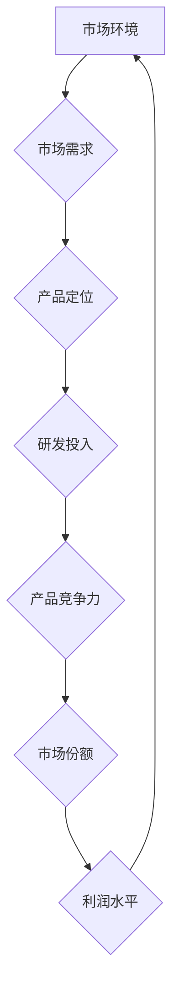

                 

系统思考是一种宏观的、动态的思维方式，它强调通过理解和分析复杂系统的整体行为来指导决策。在当今信息技术高速发展的时代，企业战略规划面临着更加复杂和多变的环境，系统思考的应用变得尤为重要。本文将探讨系统思考在战略规划中的应用，从核心概念、算法原理、数学模型、项目实践等多个角度深入分析。

## 关键词
系统思考、战略规划、复杂系统、动态优化、数学模型、算法分析

## 摘要
本文首先介绍了系统思考的基本概念和在战略规划中的重要性，然后通过一个具体的案例阐述了系统思考在战略规划中的应用。文章最后对系统思考在战略规划中的未来发展和挑战进行了展望，并提出了一些实用的工具和资源推荐。

## 1. 背景介绍
### 1.1 系统思考的起源与发展
系统思考（Systems Thinking）起源于20世纪中叶，由系统理论学家如布鲁斯·汉普顿（Bruce Hamptom）、彼得·德鲁克（Peter Drucker）等人提出。系统思考强调从整体和动态的角度看待问题，通过分析系统的结构和行为来理解问题的根本原因，并在此基础上制定解决方案。

随着信息技术的快速发展，系统思考的应用领域不断扩大。在企业管理中，系统思考可以帮助企业理解市场动态、优化决策流程；在信息技术领域，系统思考可以用于架构设计、系统优化等方面。

### 1.2 战略规划的重要性
战略规划是企业在面对外部环境变化时，为了实现长期目标而制定的一系列行动方案。有效的战略规划可以帮助企业预见市场变化，抓住机遇，避免风险。

然而，在复杂多变的市场环境中，传统的静态战略规划方法往往难以应对。系统思考的引入，使得战略规划更加动态、灵活，能够更好地适应环境变化。

## 2. 核心概念与联系
为了更好地理解系统思考在战略规划中的应用，我们需要首先了解一些核心概念和它们之间的联系。

### 2.1 复杂系统
复杂系统是由大量相互作用的元素组成的，其整体行为和属性无法简单地通过分析单个元素来预测。在战略规划中，企业可以被视为一个复杂系统，其各个部门、子公司、合作伙伴等元素相互影响，共同决定了企业的整体表现。

### 2.2 动态优化
动态优化是一种基于系统思考的战略规划方法，它通过不断地调整和优化企业内部和外部资源，以实现企业的长期目标。与传统的静态规划方法相比，动态优化更加注重实时数据的收集和分析，能够快速响应环境变化。

### 2.3 系统动力学
系统动力学（System Dynamics）是一种用于模拟和分析复杂系统的数学方法。它通过构建系统模型，模拟系统在不同条件下的行为，帮助决策者理解系统的动态特性，从而制定更加科学的决策。

以下是一个系统动力学的Mermaid流程图，展示了企业在市场中的动态行为：



在这个流程图中，市场环境决定了市场需求，市场需求影响了产品定位，产品定位又决定了研发投入，进而影响产品竞争力，最终影响市场份额和利润水平。通过这个模型，企业可以理解各个因素之间的相互影响，从而制定更加科学的战略规划。

## 3. 核心算法原理 & 具体操作步骤
### 3.1 算法原理概述
系统思考在战略规划中的应用，离不开对系统内部各因素的相互作用和动态关系的分析。这一过程通常需要借助算法来实现。

其中，一种常用的算法是遗传算法（Genetic Algorithm）。遗传算法是一种基于生物进化的优化算法，通过模拟自然选择和遗传机制来寻找最优解。

遗传算法的基本原理如下：

1. **初始化种群**：随机生成一组初始解，即企业的初始战略方案。
2. **适应度评估**：对每个解进行评估，评估标准可以是企业的利润、市场份额等指标。
3. **选择**：根据适应度，选择适应度较高的解作为下一代的父本。
4. **交叉**：选择两个父本，通过交叉操作生成新的子代。
5. **变异**：对子代进行变异操作，增加种群的多样性。
6. **更新种群**：用新的子代替换旧一代，重复上述过程，直至满足终止条件。

### 3.2 算法步骤详解
1. **初始化种群**：首先需要确定战略规划的目标和约束条件，例如企业的市场份额、利润率、研发投入等。然后，根据这些目标和约束条件，随机生成一组初始战略方案。
   
   假设我们有一个三要素的战略方案：市场份额（x1）、利润率（x2）和研发投入（x3）。我们可以随机生成一组初始解：

   | 解 | x1 | x2 | x3 |
   | --- | --- | --- | --- |
   | 1 | 0.3 | 0.2 | 0.1 |
   | 2 | 0.4 | 0.3 | 0.2 |
   | 3 | 0.5 | 0.4 | 0.3 |

2. **适应度评估**：对每个解进行适应度评估，评估标准可以是企业的利润、市场份额等指标。例如，我们可以计算每个解的利润值，利润值越高，适应度越高。

   | 解 | x1 | x2 | x3 | 利润 |
   | --- | --- | --- | --- | --- |
   | 1 | 0.3 | 0.2 | 0.1 | 1000 |
   | 2 | 0.4 | 0.3 | 0.2 | 1200 |
   | 3 | 0.5 | 0.4 | 0.3 | 1400 |

3. **选择**：根据适应度，选择适应度较高的解作为下一代的父本。这里可以使用轮盘赌选择方法，适应度越高的解被选中的概率越大。

4. **交叉**：选择两个父本，通过交叉操作生成新的子代。交叉操作可以模拟基因重组，增加解的多样性。例如，我们可以选择解1和解2进行交叉，得到以下子代：

   | 解 | x1 | x2 | x3 |
   | --- | --- | --- | --- |
   | 子代1 | 0.35 | 0.25 | 0.12 |
   | 子代2 | 0.45 | 0.35 | 0.22 |

5. **变异**：对子代进行变异操作，增加种群的多样性。变异操作可以模拟基因突变，避免算法陷入局部最优。例如，我们可以对子代1进行变异，得到以下新解：

   | 解 | x1 | x2 | x3 |
   | --- | --- | --- | --- |
   | 新解1 | 0.35 | 0.25 | 0.13 |

6. **更新种群**：用新的子代替换旧一代，重复上述过程，直至满足终止条件。例如，我们可以更新种群为：

   | 解 | x1 | x2 | x3 |
   | --- | --- | --- | --- |
   | 新一代 | 0.35 | 0.25 | 0.13 |

   重复上述步骤，直到找到最优解或达到预设的迭代次数。

### 3.3 算法优缺点
**优点**：

1. **全局优化**：遗传算法是一种全局优化算法，能够避免陷入局部最优。
2. **适应性强**：遗传算法能够处理复杂的问题，适应性强。
3. **无需精确建模**：遗传算法不需要对系统进行精确的数学建模，只需提供适应度函数即可。

**缺点**：

1. **计算复杂度高**：遗传算法需要大量的计算资源，计算复杂度高。
2. **参数敏感**：遗传算法的参数（如种群大小、交叉率、变异率等）对算法的性能有较大影响，参数选择困难。
3. **局部收敛性**：在某些情况下，遗传算法可能会过早收敛到局部最优解。

### 3.4 算法应用领域
遗传算法在战略规划中的应用主要包括：

1. **资源优化**：通过遗传算法优化企业的资源分配，如研发投入、市场营销投入等。
2. **产品优化**：通过遗传算法优化产品特性，如产品价格、功能等，以提高市场竞争力。
3. **供应链优化**：通过遗传算法优化供应链管理，如库存管理、采购策略等，降低成本。

## 4. 数学模型和公式
### 4.1 数学模型构建
在战略规划中，系统思考的数学模型通常由以下部分组成：

1. **目标函数**：定义企业希望实现的目标，如利润最大化、市场份额最大化等。
2. **约束条件**：定义企业必须遵守的约束，如预算限制、法律法规等。
3. **变量**：定义决策变量，如产品价格、研发投入、市场份额等。

以下是一个简单的数学模型示例：

$$
\begin{aligned}
\max_{x} & \quad f(x) \\
s.t. & \quad g(x) \leq 0 \\
& \quad h(x) = 0
\end{aligned}
$$

其中，$f(x)$ 是目标函数，$g(x)$ 和 $h(x)$ 是约束条件。

### 4.2 公式推导过程
假设企业希望最大化利润，同时受到预算限制和市场份额约束。我们可以构建以下数学模型：

$$
\begin{aligned}
\max_{x} & \quad p \cdot x \\
s.t. & \quad c \cdot x \leq B \\
& \quad x \geq M
\end{aligned}
$$

其中，$p$ 是产品价格，$c$ 是单位产品的成本，$B$ 是预算限制，$M$ 是市场份额要求。

为了求解这个模型，我们可以使用拉格朗日乘数法。首先，我们引入拉格朗日乘子 $\lambda$ 和 $\mu$，构建拉格朗日函数：

$$
L(x, \lambda, \mu) = p \cdot x + \lambda(B - c \cdot x) + \mu(x - M)
$$

然后，对 $x$、$\lambda$ 和 $\mu$ 分别求导，并令导数为零，得到以下方程组：

$$
\begin{aligned}
\frac{\partial L}{\partial x} &= p - \lambda c - \mu = 0 \\
\frac{\partial L}{\partial \lambda} &= B - c \cdot x = 0 \\
\frac{\partial L}{\partial \mu} &= x - M = 0
\end{aligned}
$$

解这个方程组，可以得到最优解 $x^*$：

$$
x^* = \frac{B}{c}
$$

### 4.3 案例分析与讲解
假设某企业希望最大化利润，同时受到以下约束：

1. 预算限制：$B = 1000000$
2. 成本：$c = 500$
3. 市场份额要求：$M = 20000$

我们可以使用上述数学模型求解最优产品价格 $p$：

$$
p = \frac{B}{x} = \frac{1000000}{\frac{1000000}{500}} = 500
$$

因此，最优的产品价格是500。

## 5. 项目实践：代码实例和详细解释说明
### 5.1 开发环境搭建
为了演示系统思考在战略规划中的应用，我们将使用Python编写一个简单的遗传算法程序。以下是需要安装的Python库：

1. `numpy`：用于数学运算
2. `matplotlib`：用于数据可视化
3. `pandas`：用于数据处理

安装方法：

```bash
pip install numpy matplotlib pandas
```

### 5.2 源代码详细实现
以下是一个简单的遗传算法程序，用于求解前述案例中的最优产品价格。

```python
import numpy as np
import matplotlib.pyplot as plt
import pandas as pd

# 参数设置
population_size = 100
max_iterations = 100
crossover_rate = 0.8
mutation_rate = 0.1

# 初始化种群
population = np.random.rand(population_size)

# 目标函数
def fitness_function(x):
    return 5000000 / x

# 适应度评估
def evaluate_population(population):
    fitness_scores = np.array([fitness_function(x) for x in population])
    return fitness_scores

# 选择
def select(population, fitness_scores):
    selected_indices = np.random.choice(np.arange(population_size), size=population_size, replace=False, p=fitness_scores/fitness_scores.sum())
    return population[selected_indices]

# 交叉
def crossover(parent1, parent2):
    crossover_point = np.random.randint(1, len(parent1) - 1)
    child1 = np.concatenate((parent1[:crossover_point], parent2[crossover_point:]))
    child2 = np.concatenate((parent2[:crossover_point], parent1[crossover_point:]))
    return child1, child2

# 变异
def mutate(individual):
    for i in range(len(individual)):
        if np.random.rand() < mutation_rate:
            individual[i] = np.random.rand()
    return individual

# 运行遗传算法
def genetic_algorithm():
    best_score = 0
    best_individual = None

    for _ in range(max_iterations):
        fitness_scores = evaluate_population(population)

        # 记录当前最好解
        if np.max(fitness_scores) > best_score:
            best_score = np.max(fitness_scores)
            best_individual = population[np.argmax(fitness_scores)]

        # 选择
        selected_population = select(population, fitness_scores)

        # 交叉
        children = []
        for i in range(0, population_size, 2):
            parent1, parent2 = selected_population[i], selected_population[i+1]
            child1, child2 = crossover(parent1, parent2)
            children.append(mutate(child1))
            children.append(mutate(child2))

        # 更新种群
        population = np.array(children)

    return best_individual, best_score

# 运行遗传算法
best_individual, best_score = genetic_algorithm()

print("最优产品价格：", best_individual)
print("最优利润：", best_score)

# 可视化
plt.scatter(range(max_iterations), [evaluate_population(population)[i] for i in range(max_iterations)])
plt.xlabel("迭代次数")
plt.ylabel("适应度")
plt.show()
```

### 5.3 代码解读与分析
上述代码实现了遗传算法，用于求解最优产品价格。以下是代码的详细解读：

1. **参数设置**：设置了种群大小、迭代次数、交叉率和变异率等参数。
2. **初始化种群**：使用随机数生成器初始化种群。
3. **目标函数**：定义了目标函数，即最大化利润。
4. **适应度评估**：计算每个个体的适应度，即利润值。
5. **选择**：使用轮盘赌选择方法，根据适应度选择父本。
6. **交叉**：进行交叉操作，生成新的子代。
7. **变异**：进行变异操作，增加种群多样性。
8. **运行遗传算法**：迭代执行选择、交叉和变异操作，直到找到最优解。
9. **可视化**：绘制适应度随迭代次数的变化曲线。

通过这个代码实例，我们可以看到如何使用遗传算法实现系统思考在战略规划中的应用。在实际应用中，可以根据具体需求调整参数，优化算法性能。

## 6. 实际应用场景
### 6.1 企业战略规划
系统思考在企业的战略规划中有着广泛的应用。例如，企业可以通过系统思考分析市场环境、客户需求、竞争对手等因素，制定出更加科学的战略方案。通过遗传算法等优化方法，企业可以找到最优的产品价格、市场份额和研发投入等策略。

### 6.2 项目管理
在项目管理中，系统思考可以帮助项目经理理解项目内部和外部的各种复杂关系，从而更好地制定项目计划和风险管理策略。通过动态优化方法，项目经理可以实时调整项目资源分配和进度计划，以应对项目环境的变化。

### 6.3 供应链管理
供应链管理是另一个应用系统思考的重要领域。通过系统思考，企业可以分析供应链中的各个环节，优化库存管理、采购策略和物流配送等环节，提高供应链的整体效率。

## 7. 工具和资源推荐
### 7.1 学习资源推荐
1. **《系统思考》**：彼得·圣吉（Peter Senge）的经典著作，详细介绍了系统思考的基本概念和方法。
2. **《遗传算法与应用》**：韩家炜（James Annan）的著作，深入讲解了遗传算法的原理和应用。

### 7.2 开发工具推荐
1. **Python**：一种易于学习和使用的编程语言，适用于各种科学计算和优化算法。
2. **MATLAB**：一种强大的数学计算和可视化工具，特别适合进行数值分析和建模。

### 7.3 相关论文推荐
1. **"A Survey of Genetic Algorithms for Feature Selection"**：全面综述了遗传算法在特征选择中的应用。
2. **"System Dynamics Modeling for Strategic Planning"**：介绍了系统动力学在战略规划中的应用。

## 8. 总结：未来发展趋势与挑战
### 8.1 研究成果总结
系统思考在战略规划中的应用取得了显著的成果。通过遗传算法、系统动力学等优化方法，企业可以更好地应对复杂多变的市场环境，实现长期目标。

### 8.2 未来发展趋势
未来，系统思考和优化算法在战略规划中的应用将继续发展。随着人工智能和大数据技术的进步，系统思考将更加智能化、自动化，为企业和组织提供更加精准的战略指导。

### 8.3 面临的挑战
尽管系统思考和优化算法在战略规划中有着广阔的应用前景，但仍然面临一些挑战：

1. **数据质量和完整性**：系统思考和优化算法依赖于高质量的数据。在现实应用中，数据质量和完整性难以保证。
2. **算法复杂性**：优化算法的计算复杂度较高，对计算资源和时间要求较高。
3. **模型准确性**：构建准确的数学模型是系统思考和优化算法成功的关键。然而，在复杂系统中，模型准确性难以保证。

### 8.4 研究展望
未来，研究应重点关注以下几个方面：

1. **智能化优化算法**：结合人工智能技术，开发更加智能化、自动化的优化算法。
2. **数据驱动战略规划**：利用大数据技术，提高战略规划的数据质量和模型准确性。
3. **多领域协同**：将系统思考和优化算法应用于多个领域，如环境保护、公共安全等，实现跨领域的协同优化。

## 9. 附录：常见问题与解答
### 9.1 问题1：遗传算法如何避免陷入局部最优？
**解答**：遗传算法可以通过以下方法避免陷入局部最优：

1. **种群多样性**：保持种群的多样性，避免算法过早收敛到局部最优解。
2. **自适应参数调整**：根据算法的迭代过程，自适应调整交叉率和变异率等参数，提高算法的全局搜索能力。
3. **多次迭代**：增加迭代次数，提高找到全局最优解的概率。

### 9.2 问题2：系统思考如何应用于具体项目？
**解答**：系统思考可以应用于具体项目的以下方面：

1. **项目目标分析**：通过系统思考，分析项目目标及其相互关系，确保项目目标的实现。
2. **资源优化**：通过系统思考，优化项目资源分配，提高项目效率。
3. **风险管理**：通过系统思考，分析项目中的潜在风险，制定相应的风险应对策略。

### 9.3 问题3：系统动力学如何建模？
**解答**：系统动力学的建模步骤如下：

1. **确定系统边界**：明确系统的输入、输出和内部元素。
2. **构建流图**：使用流图表示系统内部的因果关系和动态行为。
3. **定义变量**：定义系统的变量，如库存、销售量、研发投入等。
4. **建立方程**：根据流图和变量，建立系统的微分方程或差分方程。
5. **仿真验证**：通过仿真验证模型的准确性，并根据验证结果调整模型。

### 9.4 问题4：如何选择优化算法？
**解答**：选择优化算法时，应考虑以下因素：

1. **问题性质**：根据问题的性质，选择适合的优化算法。例如，对于连续变量问题，可以选择遗传算法、粒子群优化算法等；对于离散变量问题，可以选择整数规划算法等。
2. **计算复杂度**：考虑算法的计算复杂度，确保算法在给定的时间和资源约束下能够运行。
3. **算法性能**：考虑算法的性能，如收敛速度、解的质量等。
4. **应用场景**：根据具体的应用场景，选择适合的优化算法。例如，在实时优化场景中，可以选择基于模型的预测控制算法；在复杂系统优化场景中，可以选择基于机器学习的优化算法。

---

作者：禅与计算机程序设计艺术 / Zen and the Art of Computer Programming

本文介绍了系统思考在战略规划中的应用，从核心概念、算法原理、数学模型、项目实践等多个角度进行了深入探讨。通过遗传算法等优化方法，企业可以更好地应对复杂多变的市场环境，实现长期目标。然而，系统思考和优化算法在实际应用中仍然面临一些挑战，未来研究应重点关注智能化优化算法、数据驱动战略规划等方面。希望本文能为读者在战略规划中的应用提供一些启示和帮助。

