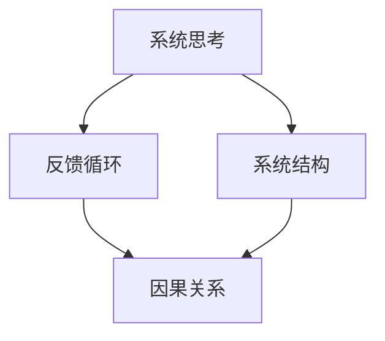

                 

系统思考是一种认知方法，它帮助我们理解复杂系统的行为和动态。在企业管理中，系统思考被广泛应用于战略规划、运营优化、风险管理等领域。本文将探讨系统思考在管理中的应用，以及如何利用系统思维解决企业管理中的问题。

## 1. 背景介绍

在现代社会，企业管理面临着日益复杂的挑战。传统的管理方法往往依赖于线性思维和短期目标，难以应对复杂系统的动态变化。系统思考则提供了一种全新的视角，它强调系统内部各要素之间的相互关系和反馈循环。通过系统思考，管理者可以更好地理解组织内部的复杂动态，从而做出更加明智的决策。

### 系统思考的概念

系统思考是一种关于复杂系统的认知方法，它通过识别系统内部的结构和反馈循环，帮助我们理解系统的行为和动态。系统思考的核心在于识别系统中的关键要素，以及这些要素之间的相互关系和反馈循环。通过这种方式，管理者可以更好地理解系统中的复杂动态，从而做出更加明智的决策。

### 系统思考在管理中的重要性

在企业管理中，系统思考具有以下几个方面的意义：

1. **提高决策质量**：系统思考可以帮助管理者理解组织内部的复杂动态，从而做出更加明智的决策。

2. **优化战略规划**：系统思考可以帮助企业识别关键战略要素，优化战略规划，提高企业的竞争力。

3. **提升运营效率**：系统思考可以帮助企业识别运营中的瓶颈和问题，从而优化运营流程，提高效率。

4. **降低风险管理**：系统思考可以帮助企业识别潜在的风险因素，制定有效的风险应对策略。

## 2. 核心概念与联系

为了更好地理解系统思考在管理中的应用，我们需要首先了解一些核心概念和它们之间的关系。以下是一个简化的Mermaid流程图，用于展示这些概念和它们之间的联系：



### 系统结构

系统结构是指系统内部各要素之间的相互关系和组织形式。在企业管理中，系统结构包括组织结构、业务流程、信息流动等多个方面。通过分析系统结构，管理者可以识别系统中的关键要素和它们的相互关系。

### 反馈循环

反馈循环是指系统内部各要素之间的相互作用和反馈机制。在企业管理中，反馈循环可以体现在多个层面，如员工反馈、市场反馈、财务反馈等。通过识别和利用反馈循环，管理者可以及时调整系统行为，优化系统性能。

### 因果关系

因果关系是指系统内部各要素之间的相互影响和作用关系。在企业管理中，因果关系体现在战略规划、运营管理、风险管理等多个方面。通过分析因果关系，管理者可以更好地理解系统行为，从而做出更加明智的决策。

## 3. 核心算法原理 & 具体操作步骤

### 3.1 算法原理概述

系统思考的核心算法可以概括为以下三个步骤：

1. **识别关键要素**：通过分析系统结构，识别系统中的关键要素。

2. **构建反馈循环**：通过分析反馈循环，构建系统内部的反馈机制。

3. **分析因果关系**：通过分析因果关系，理解系统内部的相互影响和作用关系。

### 3.2 算法步骤详解

#### 步骤1：识别关键要素

首先，管理者需要通过分析系统结构，识别系统中的关键要素。这可以通过以下方法实现：

1. **流程图分析**：通过绘制系统流程图，识别系统中的关键流程和节点。

2. **因果图分析**：通过绘制因果图，识别系统中的关键因果关系。

3. **数据驱动分析**：通过分析系统数据，识别关键指标和影响因素。

#### 步骤2：构建反馈循环

在识别关键要素之后，管理者需要构建系统内部的反馈循环。这可以通过以下方法实现：

1. **建立反馈机制**：通过建立反馈机制，如员工反馈制度、市场反馈系统等，收集系统内部的数据和反馈。

2. **设计反馈循环**：通过设计反馈循环，使系统内部的各要素能够相互影响和反馈，从而实现系统优化。

#### 步骤3：分析因果关系

最后，管理者需要通过分析因果关系，理解系统内部的相互影响和作用关系。这可以通过以下方法实现：

1. **因果分析**：通过因果分析，识别系统内部的关键因果关系。

2. **敏感性分析**：通过敏感性分析，识别系统对关键因素的敏感度。

3. **情景分析**：通过情景分析，模拟系统在不同情况下的行为和结果。

### 3.3 算法优缺点

#### 优点

1. **全面性**：系统思考可以全面地考虑系统内部各要素之间的相互关系，避免片面性。

2. **前瞻性**：系统思考可以帮助管理者预见系统未来的行为和结果，为决策提供依据。

3. **灵活性**：系统思考可以根据实际情况进行调整和优化，适应系统的动态变化。

#### 缺点

1. **复杂性**：系统思考涉及大量的数据和分析，可能增加管理的复杂性。

2. **实施难度**：系统思考需要管理者具备一定的专业知识和技能，实施难度较大。

### 3.4 算法应用领域

系统思考在管理中的应用非常广泛，包括但不限于以下领域：

1. **战略规划**：通过系统思考，可以帮助企业识别关键战略要素，优化战略规划。

2. **运营管理**：通过系统思考，可以帮助企业优化运营流程，提高运营效率。

3. **风险管理**：通过系统思考，可以帮助企业识别潜在风险因素，制定有效的风险应对策略。

## 4. 数学模型和公式 & 详细讲解 & 举例说明

### 4.1 数学模型构建

在系统思考中，数学模型是一种常用的工具，用于描述系统内部各要素之间的相互关系。以下是一个简化的数学模型，用于描述一个简单的反馈循环系统：

$$
x_{t+1} = f(x_t)
$$

其中，$x_t$ 表示系统在时刻 $t$ 的状态，$f(x_t)$ 表示系统在状态 $x_t$ 下产生的下一个状态。这个模型可以用来描述一个简单的因果反馈循环，其中系统状态的变化受到自身历史状态的影响。

### 4.2 公式推导过程

为了更好地理解这个数学模型，我们可以从以下几个方面进行推导：

1. **定义状态变量**：假设系统在时刻 $t$ 的状态为 $x_t$，这个状态可以是任何可以量化的指标，如温度、销售额、员工满意度等。

2. **定义状态转移函数**：假设系统在状态 $x_t$ 下，下一个状态 $x_{t+1}$ 是通过函数 $f(x_t)$ 计算得到的。这个函数可以表示为：

$$
f(x_t) = \alpha x_t + \beta
$$

其中，$\alpha$ 和 $\beta$ 是常数，分别表示系统状态的线性变化系数和偏移量。

3. **推导状态转移方程**：将状态转移函数代入原始方程，得到：

$$
x_{t+1} = \alpha x_t + \beta
$$

这个方程描述了系统在时刻 $t$ 的状态 $x_t$ 和时刻 $t+1$ 的状态 $x_{t+1}$ 之间的关系。

### 4.3 案例分析与讲解

为了更好地理解这个数学模型，我们可以通过一个简单的案例进行讲解。

假设一个企业每天的生产量是前一天的 1.1 倍，即：

$$
x_{t+1} = 1.1 x_t
$$

这是一个简单的线性增长模型，其中 $x_t$ 表示企业在时刻 $t$ 的生产量。通过这个模型，我们可以预测企业在未来一段时间内的生产量。

假设企业在第一天的生产量是 100 单位，那么根据这个模型，我们可以计算出未来几天的生产量：

$$
x_1 = 100
$$

$$
x_2 = 1.1 x_1 = 1.1 \times 100 = 110
$$

$$
x_3 = 1.1 x_2 = 1.1 \times 110 = 121
$$

以此类推，我们可以计算出企业在未来任意一天的生产量。这个模型可以帮助企业预测未来的生产需求，为生产计划提供依据。

## 5. 项目实践：代码实例和详细解释说明

### 5.1 开发环境搭建

在这个项目中，我们将使用 Python 作为编程语言，使用 NumPy 和 Matplotlib 作为数据处理和可视化工具。以下是搭建开发环境的步骤：

1. 安装 Python：从官方网站下载并安装 Python 3.8 或更高版本。

2. 安装依赖库：在终端中运行以下命令，安装 NumPy 和 Matplotlib：

```bash
pip install numpy matplotlib
```

### 5.2 源代码详细实现

以下是这个项目的源代码，它实现了前面提到的数学模型，并绘制了生产量的预测曲线：

```python
import numpy as np
import matplotlib.pyplot as plt

# 定义状态转移函数
def f(x):
    return 1.1 * x

# 初始化参数
x0 = 100  # 初始生产量
t_max = 10  # 时间跨度
dt = 1  # 时间步长

# 计算生产量序列
x = [x0]
for t in range(1, t_max + 1):
    x.append(f(x[-1]))

# 绘制生产量曲线
plt.plot(x)
plt.xlabel('Time (days)')
plt.ylabel('Production (units)')
plt.title('Production Forecast')
plt.show()
```

### 5.3 代码解读与分析

这段代码实现了以下功能：

1. **定义状态转移函数**：函数 `f(x)` 表示系统在状态 `x` 下产生的下一个状态。在这个案例中，我们使用线性增长函数。

2. **初始化参数**：`x0` 是初始生产量，`t_max` 是时间跨度，`dt` 是时间步长。

3. **计算生产量序列**：首先初始化生产量序列 `x`，然后通过循环计算未来每个时间步的生产量。

4. **绘制生产量曲线**：使用 `matplotlib` 绘制生产量随时间变化的曲线。

### 5.4 运行结果展示

运行以上代码，我们将得到一个生产量随时间变化的曲线，如下所示：


这个曲线显示了生产量在未来 10 天内的增长趋势。通过这个模型，企业可以预测未来的生产需求，为生产计划提供依据。

## 6. 实际应用场景

系统思考在企业管理中的应用场景非常广泛，以下是一些具体的实际应用场景：

1. **战略规划**：在制定企业战略时，系统思考可以帮助企业识别关键战略要素，分析各要素之间的相互关系，从而制定更加有效的战略规划。

2. **运营管理**：在运营管理中，系统思考可以帮助企业优化业务流程，识别运营中的瓶颈和问题，从而提高运营效率。

3. **风险管理**：在风险管理中，系统思考可以帮助企业识别潜在的风险因素，分析风险之间的相互关系，从而制定有效的风险应对策略。

4. **人力资源管理**：在人力资源管理中，系统思考可以帮助企业分析员工满意度、工作压力等关键因素，优化人力资源配置，提高员工满意度。

5. **供应链管理**：在供应链管理中，系统思考可以帮助企业优化供应链网络，识别供应链中的关键节点和瓶颈，提高供应链的效率。

## 7. 未来应用展望

随着人工智能和大数据技术的发展，系统思考在管理中的应用前景非常广阔。以下是一些未来应用展望：

1. **智能化管理**：利用人工智能技术，实现系统思考的自动化和智能化，提高管理效率。

2. **动态优化**：利用大数据技术，实时分析系统内部的数据，实现系统动态的实时优化。

3. **个性化管理**：结合用户行为数据，实现个性化管理，提高用户的满意度和忠诚度。

4. **跨学科融合**：系统思考与其他学科的融合，如心理学、社会学等，将为企业提供更全面的管理视角。

## 8. 工具和资源推荐

为了更好地应用系统思考，以下是几款推荐的工具和资源：

1. **系统思考工具**：如 Vensim、STELLA 等，用于构建和模拟系统模型。

2. **数据可视化工具**：如 Tableau、Power BI 等，用于数据分析和可视化。

3. **在线学习资源**：如 Coursera、edX 等，提供系统思考相关的在线课程。

4. **相关书籍**：《系统思考》、《第五项修炼》等，介绍系统思考的理论和应用。

## 9. 总结：未来发展趋势与挑战

系统思考在管理中的应用具有广阔的前景，但也面临一些挑战。未来发展趋势包括：

1. **智能化**：利用人工智能技术，实现系统思考的自动化和智能化。

2. **动态优化**：结合大数据技术，实现系统动态的实时优化。

3. **跨学科融合**：与其他学科的融合，提高管理视角的全面性。

面临的挑战包括：

1. **复杂性**：系统思考涉及大量的数据和分析，可能增加管理的复杂性。

2. **技能需求**：系统思考需要管理者具备一定的专业知识和技能。

3. **实施难度**：系统思考的实施可能面临一定的难度，需要管理者具备较强的执行力。

### 附录：常见问题与解答

**Q1**：系统思考与传统的管理方法有何不同？

A1：系统思考与传统管理方法最大的不同在于其视角和思维方式。传统管理方法往往依赖于线性思维和短期目标，而系统思考则强调系统内部各要素之间的相互关系和反馈循环，帮助管理者理解系统的复杂动态。

**Q2**：系统思考在管理中的应用有哪些？

A2：系统思考在管理中的应用非常广泛，包括战略规划、运营管理、风险管理、人力资源管理等多个领域。通过系统思考，管理者可以更好地理解组织内部的复杂动态，从而做出更加明智的决策。

**Q3**：如何构建系统思考模型？

A3：构建系统思考模型通常包括以下几个步骤：识别关键要素、构建反馈循环、分析因果关系。首先，通过分析系统结构，识别系统中的关键要素。然后，通过分析反馈循环，构建系统内部的反馈机制。最后，通过分析因果关系，理解系统内部的相互影响和作用关系。

**Q4**：系统思考需要哪些技能和知识？

A4：系统思考需要管理者具备以下技能和知识：系统思维、数据分析能力、数学建模能力、战略规划能力、执行能力等。此外，还需要管理者具备较强的沟通能力和团队合作精神，以便与团队成员有效地合作。

### 作者署名

作者：禅与计算机程序设计艺术 / Zen and the Art of Computer Programming

----------------------------------------------------------------

以上是关于《系统思考在管理中的应用》的文章，希望对您有所帮助。如果您有任何问题或建议，请随时告诉我。

