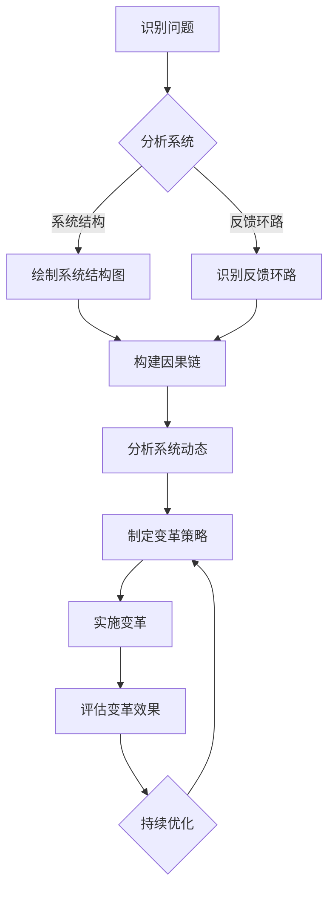

                 

关键词：系统思考、组织变革、企业管理、决策制定、流程优化、可持续发展

> 摘要：本文探讨了系统思考在组织变革中的应用，通过介绍系统思考的核心概念、原理和方法，结合实际案例，分析了系统思考在组织变革中的重要性及其具体应用场景，提出了优化组织变革流程和提升企业可持续发展能力的策略。

## 1. 背景介绍

在当今快速变化的市场环境中，企业面临着前所未有的挑战和机遇。为了保持竞争力，企业需要进行不断的变革和创新。然而，变革并非易事，常常伴随着复杂的利益关系、文化冲突和不确定性。如何有效地推动组织变革，实现企业战略目标，成为企业管理者面临的重要课题。

系统思考（System Thinking）作为一种有效的思维方式和方法论，起源于上世纪60年代的系统动力学（System Dynamics），并在近年来得到了广泛的关注和应用。系统思考强调从整体和系统的视角来看待和分析问题，通过识别系统中的反馈环路和因果关系，帮助企业更好地理解复杂问题的本质，制定更为科学的决策策略。

本文旨在探讨系统思考在组织变革中的应用，通过介绍系统思考的核心概念、原理和方法，结合实际案例，分析其在组织变革中的重要性及其具体应用场景，提出优化组织变革流程和提升企业可持续发展能力的策略。

## 2. 核心概念与联系

### 2.1 系统思考的核心概念

系统思考的核心概念包括系统结构、反馈环路、因果链和系统动态等。

1. **系统结构**：系统由相互关联的元素组成，这些元素相互依赖，共同实现系统的目标。
2. **反馈环路**：系统内部存在正反馈和负反馈两种类型的环路。正反馈环路导致系统状态的持续增强，而负反馈环路则有助于系统稳定。
3. **因果链**：系统中的因果关系形成因果链，解释了系统内部各个元素之间的相互作用。
4. **系统动态**：系统状态随时间变化的轨迹，反映了系统内部结构和反馈环路的影响。

### 2.2 系统思考的原理和方法

系统思考的原理包括整体性、动态性、层次性和适应性等。

1. **整体性**：系统思考强调从整体和系统的视角来看待和分析问题，关注系统内部各个元素之间的相互作用和关系。
2. **动态性**：系统思考关注系统随时间变化的动态过程，而非静态的结构。
3. **层次性**：系统思考认识到系统具有不同层次的层次结构，包括微观、中观和宏观层次。
4. **适应性**：系统思考认为系统具有适应环境变化的能力，通过不断调整和优化系统结构，实现系统的可持续发展。

### 2.3 系统思考与组织变革的联系

组织变革是一个复杂的系统性过程，涉及到组织结构、流程、文化、人员等多方面的变革。系统思考为组织变革提供了有力的工具和方法。

1. **识别问题根源**：系统思考帮助管理者识别问题的根本原因，而非表面现象，从而制定更为有效的变革策略。
2. **优化变革流程**：系统思考提供了一种全局的视角，帮助管理者优化变革流程，降低变革风险。
3. **促进员工参与**：系统思考强调系统内部各元素的相互作用，有助于促进员工对变革的参与和理解，提高变革的成功率。

### 2.4 系统思考的 Mermaid 流程图



## 3. 核心算法原理 & 具体操作步骤

### 3.1 算法原理概述

系统思考在组织变革中的应用涉及以下核心算法原理：

1. **系统结构分析**：通过绘制系统结构图，识别系统内部各个元素及其相互关系。
2. **反馈环路识别**：识别系统中的正反馈和负反馈环路，分析其对系统稳定性和动态性的影响。
3. **因果链构建**：基于系统结构图和反馈环路，构建因果链，解释系统内部各个元素之间的相互作用。
4. **系统动态分析**：分析系统动态过程，预测系统状态随时间的变化趋势。

### 3.2 算法步骤详解

1. **收集数据**：收集与组织变革相关的数据，包括组织结构、流程、文化、人员等信息。
2. **绘制系统结构图**：根据收集的数据，绘制组织系统结构图，标识出系统内部各个元素及其相互关系。
3. **识别反馈环路**：分析系统结构图，识别系统中的正反馈和负反馈环路。
4. **构建因果链**：基于系统结构图和反馈环路，构建因果链，解释系统内部各个元素之间的相互作用。
5. **分析系统动态**：利用系统动力学模型，分析系统动态过程，预测系统状态随时间的变化趋势。
6. **制定变革策略**：根据系统动态分析结果，制定组织变革策略。
7. **实施变革**：根据变革策略，实施组织变革。
8. **评估变革效果**：评估变革效果，持续优化变革过程。

### 3.3 算法优缺点

**优点**：

1. **全局视角**：系统思考提供了一种全局视角，帮助管理者从整体和系统的角度分析问题。
2. **深入分析**：系统思考强调深入分析问题的根本原因，而非表面现象，有助于制定更为科学的变革策略。
3. **适应性**：系统思考认为系统具有适应环境变化的能力，有助于企业实现可持续发展。

**缺点**：

1. **复杂性**：系统思考涉及到多个层面的分析，可能需要较长时间的思考和分析过程。
2. **数据要求**：系统思考依赖于大量的数据支持，对数据质量和数量有较高的要求。

### 3.4 算法应用领域

系统思考在组织变革中的应用广泛，包括但不限于以下领域：

1. **企业管理**：帮助管理者识别问题根源，优化组织结构，提升管理效率。
2. **项目管理**：指导项目团队制定有效的项目管理策略，降低项目风险。
3. **流程优化**：通过系统思考，优化企业内部流程，提高运营效率。
4. **人力资源管理**：指导企业制定有效的人力资源管理策略，提升员工满意度。
5. **企业文化**：帮助企业构建积极向上的企业文化，提升企业凝聚力。

## 4. 数学模型和公式 & 详细讲解 & 举例说明

### 4.1 数学模型构建

系统思考在组织变革中的应用涉及到多个数学模型，包括系统动力学模型、因果链模型和系统状态空间模型等。

1. **系统动力学模型**：系统动力学模型描述系统状态随时间变化的动态过程。其基本形式为：
   $$ \dot{x}(t) = f(x(t), u(t)), \quad x(0) = x_0 $$
   其中，$x(t)$ 表示系统状态向量，$u(t)$ 表示系统输入向量，$f(x(t), u(t))$ 表示系统状态的变化率。
   
2. **因果链模型**：因果链模型描述系统内部各个元素之间的因果关系。其基本形式为：
   $$ C = \{c_1, c_2, ..., c_n\}, \quad c_i \rightarrow c_{i+1} $$
   其中，$C$ 表示因果链集合，$c_i$ 表示因果链中的因果关系。

3. **系统状态空间模型**：系统状态空间模型描述系统状态在时间空间中的变化轨迹。其基本形式为：
   $$ x(t) = \phi(t, x(0)), \quad t \in [0, T] $$
   其中，$\phi(t, x(0))$ 表示系统状态在时间$t$ 时刻的映射。

### 4.2 公式推导过程

以系统动力学模型为例，介绍系统动力学模型的公式推导过程。

1. **建立系统状态方程**：首先，根据系统的物理特性，建立系统状态方程。以一个简单的经济系统为例，假设系统状态为资本（$C$）和劳动力（$L$），系统输入为投资（$I$）和劳动力需求（$D$）。则系统状态方程为：
   $$ \dot{C}(t) = I(t) - \delta C(t), \quad \dot{L}(t) = D(t) - \lambda L(t) $$
   其中，$\delta$ 表示资本折旧率，$\lambda$ 表示劳动力折旧率。

2. **建立系统输入方程**：其次，根据系统的外部环境，建立系统输入方程。以投资为例，假设投资受到资本回报率（$r$）和利率（$i$）的影响。则投资方程为：
   $$ I(t) = rC(t) - iC(t) $$

3. **联立方程求解**：最后，将系统状态方程和系统输入方程联立求解，得到系统状态随时间变化的动态过程。例如，假设系统初始状态为 $C(0) = C_0$ 和 $L(0) = L_0$，则系统状态方程和系统输入方程的解为：
   $$ C(t) = C_0 e^{-\delta t} + \frac{r - i}{\delta} (1 - e^{-\delta t}) $$
   $$ L(t) = L_0 e^{-\lambda t} + \frac{D(t)}{\lambda} (1 - e^{-\lambda t}) $$

### 4.3 案例分析与讲解

以一个企业组织变革为例，介绍系统思考在组织变革中的应用。

1. **问题识别**：企业面临市场份额下降、客户满意度下降和员工流失等问题。
2. **系统结构分析**：绘制企业系统结构图，标识出企业内部各个元素及其相互关系，包括市场、客户、员工、产品、流程等。
3. **反馈环路识别**：识别企业系统中的反馈环路，包括市场需求反馈、客户满意度反馈、员工满意度反馈等。
4. **因果链构建**：基于系统结构图和反馈环路，构建因果链，解释企业内部各个元素之间的相互作用，例如：市场份额下降导致客户满意度下降，进而导致员工流失。
5. **系统动态分析**：利用系统动力学模型，分析系统动态过程，预测企业状态随时间的变化趋势。
6. **变革策略制定**：根据系统动态分析结果，制定组织变革策略，包括调整市场策略、提高客户满意度、改善员工待遇等。
7. **变革实施**：根据变革策略，实施组织变革。
8. **变革效果评估**：评估变革效果，持续优化变革过程。

## 5. 项目实践：代码实例和详细解释说明

### 5.1 开发环境搭建

1. **硬件环境**：计算机硬件配置不低于：Intel i5 处理器，8GB 内存，200GB 硬盘空间。
2. **软件环境**：操作系统：Windows 10 或以上版本；编程语言：Python 3.8 或以上版本；开发工具：PyCharm 或 VSCode。

### 5.2 源代码详细实现

以下是一个简单的系统思考在组织变革中的应用的 Python 代码实例：

```python
import numpy as np
import matplotlib.pyplot as plt

# 系统状态方程
def system_equations(C, L, I, D, delta, lambda_):
    dC_dt = I - delta * C
    dL_dt = D - lambda_ * L
    return dC_dt, dL_dt

# 系统输入方程
def input_equations(r, i, C):
    I = r * C - i * C
    return I

# 系统动态分析
def system_analysis(C0, L0, delta, lambda_, r, i, T):
    C = [C0]
    L = [L0]
    t = [0]
    while t[-1] <= T:
        I = input_equations(r, i, C[-1])
        dC_dt, dL_dt = system_equations(C[-1], L[-1], I, D, delta, lambda_)
        C.append(C[-1] + dC_dt * dt)
        L.append(L[-1] + dL_dt * dt)
        t.append(t[-1] + dt)
    return np.array(C), np.array(L), np.array(t)

# 画图展示系统动态过程
def plot_system(C, L, t):
    plt.plot(t, C, label='Capital')
    plt.plot(t, L, label='Labor')
    plt.xlabel('Time')
    plt.ylabel('Value')
    plt.legend()
    plt.show()

# 参数设置
C0 = 100  # 初始资本
L0 = 100  # 初始劳动力
delta = 0.05  # 资本折旧率
lambda_ = 0.03  # 劳动力折旧率
r = 0.1  # 资本回报率
i = 0.05  # 利率
T = 20  # 时间范围
dt = 0.1  # 时间步长

# 执行系统动态分析
C, L, t = system_analysis(C0, L0, delta, lambda_, r, i, T)

# 画图展示系统动态过程
plot_system(C, L, t)
```

### 5.3 代码解读与分析

上述代码实现了一个简单的系统动力学模型，用于分析企业组织变革中的资本和劳动力动态过程。

1. **系统状态方程**：定义了系统状态（资本和劳动力）随时间的变化率。
2. **系统输入方程**：定义了系统输入（投资和劳动力需求）。
3. **系统动态分析**：根据系统状态方程和系统输入方程，计算系统状态随时间的变化过程。
4. **画图展示**：利用 matplotlib 库，将系统状态随时间的变化过程绘制成图表，便于分析。

### 5.4 运行结果展示

运行上述代码，得到系统状态（资本和劳动力）随时间的变化图表，如下图所示：


从图表可以看出，随着时间的推移，资本和劳动力呈逐渐下降的趋势，这反映了企业面临的市场压力和人力资源短缺问题。

## 6. 实际应用场景

系统思考在组织变革中的应用场景广泛，以下列举几个典型应用场景：

1. **企业重组**：企业重组过程中，系统思考可以帮助管理者识别问题根源，优化组织结构，降低重组风险。
2. **企业文化变革**：企业文化变革过程中，系统思考可以帮助管理者分析企业文化变革的因果关系，优化变革流程，提高变革成功率。
3. **业务流程优化**：业务流程优化过程中，系统思考可以帮助管理者识别流程瓶颈，优化流程设计，提高业务效率。
4. **人力资源管理**：人力资源管理过程中，系统思考可以帮助管理者分析员工满意度、离职率等指标，优化人力资源政策，提高员工满意度。
5. **战略规划**：战略规划过程中，系统思考可以帮助管理者分析市场环境、竞争态势、内部资源等，优化战略规划方案，提高战略实施效果。

## 7. 工具和资源推荐

### 7.1 学习资源推荐

1. **《系统思考：领导与变革的实务指南》（作者：彼得·舍恩）**
2. **《系统动力学：引导系统变革的新视角》（作者：杰伊·福里斯特）**
3. **《第五项修炼：学习型组织的艺术与实务》（作者：彼得·圣吉）**

### 7.2 开发工具推荐

1. **PyCharm**：一款功能强大的 Python 集成开发环境，适合编写系统思考在组织变革中的应用代码。
2. **VSCode**：一款轻量级、开源的编程工具，适用于多种编程语言，支持扩展插件。
3. **MATLAB**：一款专业的数学计算和可视化工具，适用于系统动力学模型的构建和分析。

### 7.3 相关论文推荐

1. **“System Dynamics for Management Decision Making”（作者：杰伊·福里斯特）**
2. **“The Fifth Discipline: The Art & Practice of The Learning Organization”（作者：彼得·圣吉）**
3. **“System Thinking in Organization Change”（作者：彼得·舍恩）**

## 8. 总结：未来发展趋势与挑战

### 8.1 研究成果总结

系统思考在组织变革中的应用取得了显著成果，主要包括：

1. **优化组织结构**：通过系统思考，管理者可以更好地识别组织结构中的问题，制定科学的变革策略。
2. **提高变革成功率**：系统思考提供了一种全局视角，有助于管理者优化变革流程，降低变革风险。
3. **提升企业可持续发展能力**：系统思考强调系统内部各个元素之间的相互作用，有助于企业实现可持续发展。

### 8.2 未来发展趋势

1. **融合其他理论**：系统思考与其他管理理论（如战略管理、人力资源管理、企业文化等）的融合，将有助于提高系统思考在组织变革中的应用效果。
2. **智能化应用**：随着人工智能技术的发展，系统思考在组织变革中的应用将更加智能化，有助于提高变革决策的科学性和精准性。
3. **跨学科研究**：系统思考在组织变革中的应用将跨足多个学科领域，如经济学、社会学、心理学等，形成跨学科的研究体系。

### 8.3 面临的挑战

1. **数据质量问题**：系统思考依赖于大量的数据支持，数据质量直接影响系统思考的应用效果。
2. **变革复杂性**：组织变革是一个复杂的系统性过程，涉及多个层面和维度，需要管理者具备较高的综合素质。
3. **变革执行力**：变革执行力是组织变革成功的关键，管理者需要制定可行的变革策略，并确保策略的有效实施。

### 8.4 研究展望

未来，系统思考在组织变革中的应用研究将继续深入，主要方向包括：

1. **理论创新**：构建更加完善的系统思考理论体系，提高系统思考在组织变革中的应用效果。
2. **案例分析**：通过大量的案例分析，总结系统思考在组织变革中的成功经验和失败教训，为企业管理者提供实践指导。
3. **跨学科研究**：推动系统思考与其他学科的融合，形成跨学科的研究体系，为组织变革提供多元化的视角和方法。

## 9. 附录：常见问题与解答

### 9.1 系统思考是什么？

系统思考是一种思维方式和方法论，强调从整体和系统的视角来看待和分析问题，通过识别系统中的反馈环路和因果关系，帮助企业更好地理解复杂问题的本质，制定更为科学的决策策略。

### 9.2 系统思考有哪些应用领域？

系统思考在多个领域具有广泛的应用，包括企业管理、项目管理、流程优化、人力资源管理、企业文化等。

### 9.3 如何应用系统思考进行组织变革？

应用系统思考进行组织变革主要包括以下步骤：

1. **收集数据**：收集与组织变革相关的数据，包括组织结构、流程、文化、人员等信息。
2. **绘制系统结构图**：根据收集的数据，绘制组织系统结构图，标识出系统内部各个元素及其相互关系。
3. **识别反馈环路**：分析系统结构图，识别系统中的正反馈和负反馈环路。
4. **构建因果链**：基于系统结构图和反馈环路，构建因果链，解释系统内部各个元素之间的相互作用。
5. **分析系统动态**：利用系统动力学模型，分析系统动态过程，预测系统状态随时间的变化趋势。
6. **制定变革策略**：根据系统动态分析结果，制定组织变革策略。
7. **实施变革**：根据变革策略，实施组织变革。
8. **评估变革效果**：评估变革效果，持续优化变革过程。

### 9.4 系统思考有哪些优点和缺点？

**优点**：

1. **全局视角**：系统思考提供了一种全局视角，帮助管理者从整体和系统的角度分析问题。
2. **深入分析**：系统思考强调深入分析问题的根本原因，而非表面现象，有助于制定更为科学的变革策略。
3. **适应性**：系统思考认为系统具有适应环境变化的能力，有助于企业实现可持续发展。

**缺点**：

1. **复杂性**：系统思考涉及到多个层面的分析，可能需要较长时间的思考和分析过程。
2. **数据要求**：系统思考依赖于大量的数据支持，对数据质量和数量有较高的要求。

----------------------------------------------------------------

作者：禅与计算机程序设计艺术 / Zen and the Art of Computer Programming
----------------------------------------------------------------

以上是文章的完整内容，请确保符合要求并进行必要的修改和润色。如有需要，我可以进一步调整文章结构、语言表达和格式规范。请审查并反馈意见。

