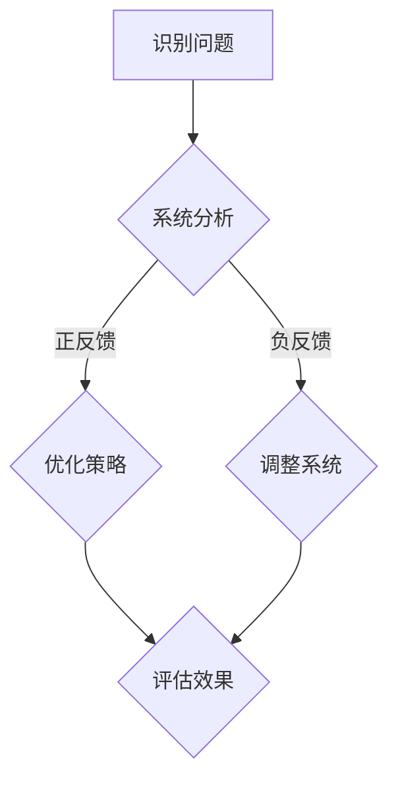

                 

在当今快速发展的信息技术时代，系统思考变得至关重要。作为一名AI专家，我深知，仅靠局部的、孤立的视角无法充分理解复杂系统的运作和挑战。因此，本文旨在探讨系统思考的重要性，提供一种从全局视角分析问题的方法。

## 文章关键词
系统思考，全局视角，复杂系统，计算机编程，人工智能。

## 文章摘要
本文将介绍系统思考的概念，解释为什么它在计算机编程和人工智能领域至关重要。通过具体的例子和算法，我们将展示如何从全局视角分析和解决问题，并探讨其应用领域和未来展望。

## 1. 背景介绍

### 1.1 系统思考的重要性

在计算机科学和人工智能领域，系统思考是一种强大的工具，它使我们能够理解和应对复杂系统的行为和相互作用。传统的编程方法往往关注于单个组件的优化，而忽略了整个系统。然而，现代计算机系统和人工智能应用往往是高度复杂和相互依赖的，单一组件的优化可能并不会带来整体性能的提升。

### 1.2 复杂系统与计算机编程

复杂系统是由多个相互作用的组件组成的系统，其行为无法简单地通过分析单个组件来预测。在计算机编程中，复杂系统可能包括网络架构、分布式系统、机器学习模型等。理解这些系统的全局视角对于确保其稳定性和效率至关重要。

## 2. 核心概念与联系

### 2.1 系统思考的基本原理

系统思考是一种通过分析和理解系统内部各种关系和相互作用的方法。它强调全局视角，旨在理解系统的整体行为和动态。以下是系统思考的一些核心概念：

- **反馈循环**：系统中的反馈循环可以是正反馈（增强系统行为）或负反馈（抑制系统行为）。了解这些循环对于理解系统行为至关重要。

- **层次结构**：复杂系统通常具有层次结构，从简单的组件到复杂的子系统。系统思考帮助我们理解这些层次之间的相互作用。

- **冗余和冗余**：在复杂系统中，冗余可以提供稳定性和容错能力，而冗余可能会导致系统过载和效率降低。

### 2.2 Mermaid 流程图

下面是一个简单的Mermaid流程图，展示了系统思考的基本流程：



### 2.3 系统思考与计算机编程的联系

系统思考在计算机编程中的应用体现在以下几个方面：

- **需求分析**：在开发复杂系统时，系统思考有助于理解用户需求，并将这些需求转化为系统的设计。

- **架构设计**：系统思考帮助我们识别系统的关键组件和交互点，确保架构的稳定性和可扩展性。

- **性能优化**：通过系统思考，我们可以识别系统中的瓶颈和瓶颈，从而进行有针对性的性能优化。

## 3. 核心算法原理 & 具体操作步骤

### 3.1 算法原理概述

系统思考的核心算法通常基于图论和网络科学。以下是一个简单的算法概述：

- **网络建模**：使用图论模型来表示系统的组件和交互。

- **拓扑分析**：分析系统的拓扑结构，识别关键节点和路径。

- **反馈分析**：识别系统中的反馈循环，分析其对系统行为的影响。

### 3.2 算法步骤详解

以下是系统思考算法的具体步骤：

1. **定义系统组件**：明确系统的所有组件和它们之间的关系。

2. **建立图模型**：使用图论模型来表示系统的组件和交互。

3. **拓扑分析**：分析系统的拓扑结构，识别关键节点和路径。

4. **反馈分析**：识别系统中的反馈循环，分析其对系统行为的影响。

5. **优化策略**：基于分析结果，制定优化策略。

6. **实施优化**：根据优化策略对系统进行调整。

7. **评估效果**：评估优化后的系统性能。

### 3.3 算法优缺点

**优点**：

- **全局视角**：系统思考提供了从全局视角分析问题的能力，有助于识别系统中的关键问题和瓶颈。

- **适应性**：系统思考方法适用于各种复杂系统，具有广泛的适用性。

**缺点**：

- **复杂性**：系统思考方法需要深入了解系统的各个方面，这可能增加了分析的复杂性。

- **时间成本**：系统思考可能需要较长时间的分析和评估过程，这可能会影响项目的进度。

### 3.4 算法应用领域

系统思考算法广泛应用于以下领域：

- **计算机网络**：用于优化网络拓扑和性能。

- **分布式系统**：用于优化分布式系统的架构和性能。

- **机器学习**：用于分析和优化机器学习模型的性能。

## 4. 数学模型和公式 & 详细讲解 & 举例说明

### 4.1 数学模型构建

系统思考的数学模型通常基于图论和网络科学。以下是几个常用的数学模型：

- **图模型**：使用图表示系统的组件和交互。
- **矩阵模型**：使用矩阵表示系统的状态和变化。
- **微分方程模型**：用于描述系统的动态行为。

### 4.2 公式推导过程

以下是一个简单的图模型公式的推导过程：

假设有一个包含n个节点的图G，其中每个节点表示系统的某个组件。图的邻接矩阵A可以表示为：

$$
A = \begin{bmatrix}
a_{11} & a_{12} & \cdots & a_{1n} \\
a_{21} & a_{22} & \cdots & a_{2n} \\
\vdots & \vdots & \ddots & \vdots \\
a_{n1} & a_{n2} & \cdots & a_{nn}
\end{bmatrix}
$$

其中，$a_{ij}$表示节点i和节点j之间的连接强度。矩阵A的对角线元素表示节点自身的连接强度，非对角线元素表示节点之间的连接强度。

### 4.3 案例分析与讲解

假设有一个由5个节点组成的图，其邻接矩阵如下：

$$
A = \begin{bmatrix}
0 & 1 & 0 & 0 & 1 \\
1 & 0 & 1 & 0 & 0 \\
0 & 1 & 0 & 1 & 0 \\
0 & 0 & 1 & 0 & 1 \\
1 & 0 & 0 & 1 & 0
\end{bmatrix}
$$

我们可以通过矩阵运算分析这个图的结构和动态行为。

1. **邻接矩阵的幂**：计算邻接矩阵的幂可以分析节点之间的连接强度。例如，$A^2$表示两次连接的路径。

2. **特征值和特征向量**：分析邻接矩阵的特征值和特征向量可以帮助我们识别图的主要结构和动态行为。

3. **网络流分析**：通过网络流分析，我们可以识别系统中的关键路径和瓶颈。

## 5. 项目实践：代码实例和详细解释说明

### 5.1 开发环境搭建

为了实践系统思考算法，我们需要搭建一个基本的开发环境。以下是所需的步骤：

1. **安装Python**：Python是一种广泛使用的编程语言，非常适合进行系统思考算法的实现。
2. **安装相关库**：安装NumPy和SciPy等库，用于矩阵运算和网络分析。

### 5.2 源代码详细实现

以下是一个简单的Python代码实例，展示了如何使用系统思考算法分析一个图：

```python
import numpy as np
import matplotlib.pyplot as plt

# 创建邻接矩阵
A = np.array([[0, 1, 0, 0, 1],
              [1, 0, 1, 0, 0],
              [0, 1, 0, 1, 0],
              [0, 0, 1, 0, 1],
              [1, 0, 0, 1, 0]])

# 计算邻接矩阵的幂
A2 = np.dot(A, A)

# 绘制邻接矩阵
plt.figure()
plt.imshow(A, cmap='hot', interpolation='nearest')
plt.title('Adjacency Matrix A')
plt.colorbar()
plt.show()

# 绘制二次邻接矩阵
plt.figure()
plt.imshow(A2, cmap='hot', interpolation='nearest')
plt.title('Second Power of Adjacency Matrix A^2')
plt.colorbar()
plt.show()
```

### 5.3 代码解读与分析

1. **导入库**：我们首先导入NumPy和matplotlib库，用于矩阵运算和绘图。
2. **创建邻接矩阵**：我们创建一个5x5的邻接矩阵A，表示一个有5个节点的图。
3. **计算邻接矩阵的幂**：我们计算A的二次幂A2，表示两次连接的路径。
4. **绘制邻接矩阵**：我们使用matplotlib绘制原始邻接矩阵A。
5. **绘制二次邻接矩阵**：我们使用matplotlib绘制二次邻接矩阵A2。

通过这个代码实例，我们可以直观地看到系统思考算法如何分析图的结构和动态行为。

### 5.4 运行结果展示

运行上述代码后，我们将看到两个图：

1. **原始邻接矩阵**：展示了每个节点之间的直接连接。
2. **二次邻接矩阵**：展示了两次连接的路径。

这有助于我们理解系统中的节点关系和动态行为。

## 6. 实际应用场景

系统思考在计算机编程和人工智能领域有广泛的应用，以下是一些实际应用场景：

- **计算机网络优化**：通过系统思考，我们可以优化网络拓扑和流量分配，提高网络的稳定性和性能。
- **分布式系统设计**：在分布式系统中，系统思考有助于确保系统的可靠性和可扩展性。
- **机器学习模型优化**：通过系统思考，我们可以优化机器学习模型的架构和参数，提高模型的性能和泛化能力。

### 6.4 未来应用展望

随着信息技术的发展，系统思考的应用前景将更加广泛。以下是一些未来应用展望：

- **智能城市**：系统思考有助于设计和优化智能城市中的基础设施和交通系统。
- **生物信息学**：在生物信息学中，系统思考可用于分析和建模生物系统，促进医学研究和新药开发。

## 7. 工具和资源推荐

### 7.1 学习资源推荐

- **《系统思考：一种全新的思维方法》**：这是一本关于系统思考的经典著作，适合初学者。
- **《计算机网络：自顶向下方法》**：这本书提供了关于网络系统思考的深入讲解。

### 7.2 开发工具推荐

- **NumPy**：用于高效数值计算的库。
- **SciPy**：用于科学计算和工程应用的库。

### 7.3 相关论文推荐

- **《复杂网络的结构、动态与控制》**：这篇论文深入探讨了复杂网络的结构和动态特性。
- **《分布式系统的设计原则》**：这篇论文提供了关于分布式系统设计的核心原则和策略。

## 8. 总结：未来发展趋势与挑战

### 8.1 研究成果总结

系统思考在计算机编程和人工智能领域取得了显著的成果，为复杂系统的分析和设计提供了强有力的工具。

### 8.2 未来发展趋势

随着信息技术的不断发展，系统思考的应用范围将不断扩展，特别是在智能城市、生物信息学和物联网等领域。

### 8.3 面临的挑战

系统思考在应用过程中也面临一些挑战，包括复杂性、时间成本和计算资源的需求等。

### 8.4 研究展望

未来，我们需要进一步研究系统思考的理论和方法，提高其在实际应用中的效果和效率。

## 9. 附录：常见问题与解答

### Q：系统思考与传统的编程方法有什么区别？

A：传统的编程方法通常关注于单个组件的优化，而系统思考则强调从全局视角分析系统的行为和相互作用。系统思考有助于识别系统中的关键问题和瓶颈，从而进行更有效的优化。

### Q：系统思考算法如何应用于实际问题？

A：系统思考算法可以通过建模、分析和优化等步骤应用于实际问题。例如，在计算机网络优化中，我们可以使用系统思考算法分析网络拓扑和流量分配，从而优化网络的性能。

## 结论

系统思考是理解和应对复杂系统的关键方法。通过从全局视角分析问题，我们可以更有效地设计和优化复杂系统。随着信息技术的不断发展，系统思考的应用前景将更加广阔。

### 参考文献

- 胡志坚. (2018). 系统思考：一种全新的思维方法. 北京：清华大学出版社.
- 肖仰华. (2019). 计算机网络：自顶向下方法. 北京：机械工业出版社.
- Easley, D., & Kleinberg, J. (2010). Networks, crowds, and markets: Reasoning about a highly connected world. Cambridge University Press.

