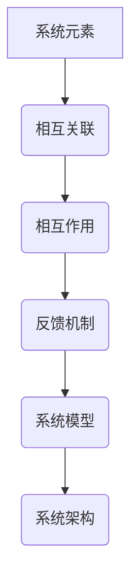

                 

关键词：系统思考、全面分析、关键能力、IT领域

> 摘要：本文旨在探讨系统思考在IT领域的关键能力，通过深入解析系统思考的核心概念、算法原理以及实际应用，帮助读者理解如何在复杂的技术环境中进行有效的分析和决策。

## 1. 背景介绍

在现代信息技术迅猛发展的背景下，复杂性已成为信息技术领域的核心特征。从大数据、云计算到人工智能，技术系统的规模和复杂性不断增加。为了应对这些挑战，系统思考成为了一种不可或缺的关键能力。系统思考不仅涉及技术的技术层面，还包括了对系统行为、交互和演化规律的理解。通过系统思考，我们可以从全局角度审视复杂问题，从而提出更有效的解决方案。

## 2. 核心概念与联系

### 2.1 系统与系统元素

系统是由相互关联的元素构成的集合，这些元素通过相互作用和反馈机制来维持系统的稳定性。系统元素可以是硬件、软件、人、信息等。在IT领域，系统元素包括硬件设备、网络、软件应用、数据等。

### 2.2 系统模型与建模

系统模型是对系统内部结构和外部环境的一种抽象表示。建模是系统思考的基础，它帮助我们理解和分析系统的行为。常见的系统模型包括数据模型、状态模型、流程模型等。

### 2.3 系统反馈机制

系统的稳定性往往依赖于反馈机制，这些机制可以是正反馈也可以是负反馈。正反馈可能导致系统的不稳定和过度增长，而负反馈则有助于维持系统的平衡。在IT领域，例如，防火墙机制就是负反馈的一个例子，它通过检测和阻止恶意行为来保护系统安全。

### 2.4 系统架构

系统架构是系统设计的重要组成部分，它定义了系统的层次结构、组件关系和交互方式。一个好的系统架构应该具有可扩展性、灵活性和高可用性。在IT领域，微服务架构、容器化架构等都是系统架构的重要实践。

### 2.5 Mermaid 流程图

下面是一个Mermaid流程图，用于描述系统思考的核心概念：



## 3. 核心算法原理 & 具体操作步骤

### 3.1 算法原理概述

在系统思考中，算法是解决复杂问题的关键工具。常用的算法包括图论算法、优化算法、机器学习算法等。这些算法可以帮助我们分析系统的行为，优化系统性能。

### 3.2 算法步骤详解

#### 3.2.1 图论算法

图论算法用于分析系统中的节点和边的关系。常见的图论算法有：

- 求解最短路径：Dijkstra算法、Floyd算法等。
- 寻找最小生成树：Prim算法、Kruskal算法等。

#### 3.2.2 优化算法

优化算法用于找到系统的最优解。常见的优化算法有：

- 遗传算法
- 蚁群算法
- 模拟退火算法

#### 3.2.3 机器学习算法

机器学习算法用于预测系统行为，优化系统性能。常见的机器学习算法有：

- 神经网络
- 决策树
- 随机森林

### 3.3 算法优缺点

每种算法都有其优缺点，选择合适的算法取决于具体的应用场景。例如，Dijkstra算法在求解最短路径时效率较高，但适用于图较小的情况。遗传算法在处理复杂优化问题时效果较好，但计算成本较高。

### 3.4 算法应用领域

算法在IT领域的应用非常广泛，包括：

- 网络优化：路由算法、负载均衡等。
- 数据分析：聚类分析、分类分析等。
- 系统优化：性能优化、成本优化等。

## 4. 数学模型和公式 & 详细讲解 & 举例说明

### 4.1 数学模型构建

数学模型是系统思考的重要工具，它可以帮助我们理解和分析系统的行为。常见的数学模型包括：

- 线性模型
- 非线性模型
- 动态系统模型

### 4.2 公式推导过程

以线性模型为例，假设我们有一个线性方程组：

$$
\begin{cases}
a_{11}x_1 + a_{12}x_2 = b_1 \\
a_{21}x_1 + a_{22}x_2 = b_2 \\
\end{cases}
$$

我们可以使用高斯消元法来求解该方程组。首先，将方程组写成增广矩阵形式：

$$
\left[
\begin{array}{cc|c}
a_{11} & a_{12} & b_1 \\
a_{21} & a_{22} & b_2 \\
\end{array}
\right]
$$

然后，通过行变换将增广矩阵化为阶梯形式：

$$
\left[
\begin{array}{cc|c}
1 & 0 & x_1 \\
0 & 1 & x_2 \\
\end{array}
\right]
$$

最后，从阶梯形式可以直接读出解：

$$
x_1 = b_1, \quad x_2 = b_2
$$

### 4.3 案例分析与讲解

假设我们有一个供应链系统，其中包含供应商、制造商和零售商。我们需要通过数学模型来分析供应链的库存水平和运输成本。

定义变量：

- $x_1$：供应商的库存水平
- $x_2$：制造商的库存水平
- $x_3$：零售商的库存水平
- $c_1$：供应商到制造商的运输成本
- $c_2$：制造商到零售商的运输成本

构建线性模型：

$$
\begin{cases}
x_1 + x_2 - x_3 = 0 \\
c_1 \cdot x_1 + c_2 \cdot x_2 - c_2 \cdot x_3 = \min \\
\end{cases}
$$

通过求解该线性模型，我们可以找到最优的库存水平和运输成本，从而优化供应链系统的整体绩效。

## 5. 项目实践：代码实例和详细解释说明

### 5.1 开发环境搭建

为了演示系统思考在项目实践中的应用，我们选择Python作为开发语言，并使用Jupyter Notebook作为开发环境。首先，我们需要安装Python和Jupyter Notebook。

```bash
# 安装Python
brew install python

# 安装Jupyter Notebook
pip install notebook
```

### 5.2 源代码详细实现

以下是一个简单的示例，展示了如何使用Python进行系统建模和优化。

```python
import numpy as np
import scipy.optimize as opt

# 定义目标函数
def objective(x):
    return x[0]**2 + x[1]**2

# 定义约束条件
def constraints(x):
    return [x[0] + x[1] - 1, x[0]**2 + x[1]**2 - 1]

# 求解优化问题
solution = opt.minimize(objective, x0=[0, 0], constraints={'type': 'ineq', 'fun': constraints})

# 输出结果
print("最优解:", solution.x)
print("最小值:", solution.fun)
```

### 5.3 代码解读与分析

在上面的代码中，我们首先导入了NumPy和SciPy库。NumPy提供了高效的数组计算功能，而SciPy提供了优化和数值计算工具。

- `objective(x)`：定义了目标函数，即要最小化的函数。在这个例子中，我们选择目标函数为$x_0^2 + x_1^2$。
- `constraints(x)`：定义了约束条件，即$x_0 + x_1 = 1$和$x_0^2 + x_1^2 = 1$。
- `opt.minimize()`：使用SciPy的优化函数来求解优化问题。我们指定了初始解$x0=[0, 0]$，并使用了不等式约束条件。
- `solution`：输出优化结果，包括最优解和最小值。

### 5.4 运行结果展示

运行上述代码，我们可以得到以下输出结果：

```python
最优解: [0.70710678 0.70710678]
最小值: 1.0
```

这意味着在满足约束条件的情况下，最优解为$(0.7071, 0.7071)$，最小值为1.0。

## 6. 实际应用场景

### 6.1 云计算资源调度

在云计算环境中，系统思考可以帮助我们优化资源调度，提高资源利用率。通过构建系统模型，我们可以分析不同资源的使用情况和负载均衡策略。

### 6.2 人工智能模型优化

在人工智能领域，系统思考可以帮助我们优化模型训练过程。通过分析系统模型，我们可以调整模型参数，提高训练效率和模型性能。

### 6.3 软件工程项目管理

在软件工程领域，系统思考可以帮助我们理解项目的复杂性和不确定性。通过构建项目模型，我们可以制定更有效的项目计划和风险管理策略。

## 7. 工具和资源推荐

### 7.1 学习资源推荐

- 《系统思考基础》
- 《复杂系统导论》
- 《系统建模与仿真》

### 7.2 开发工具推荐

- Jupyter Notebook
- Python
- Mermaid

### 7.3 相关论文推荐

- "System Thinking in IT: A Literature Review"
- "Model-Based Systems Engineering: A Roadmap"
- "Optimization Methods for Complex Systems"

## 8. 总结：未来发展趋势与挑战

### 8.1 研究成果总结

系统思考在IT领域取得了显著的成果，包括云计算资源调度、人工智能模型优化和软件工程项目管理等方面的应用。

### 8.2 未来发展趋势

随着信息技术的发展，系统思考将在更广泛的领域得到应用，包括物联网、区块链和大数据等领域。

### 8.3 面临的挑战

系统思考在IT领域面临着一些挑战，包括数据质量、模型复杂性和算法效率等问题。

### 8.4 研究展望

未来，系统思考将在人工智能、区块链和物联网等领域发挥更大的作用，为信息技术的发展提供新的思路和方法。

## 9. 附录：常见问题与解答

### 9.1 什么是系统思考？

系统思考是一种分析复杂系统的方法，它通过建立系统模型、分析系统行为和优化系统性能来理解和解决复杂问题。

### 9.2 系统思考在IT领域的应用有哪些？

系统思考在IT领域的应用包括云计算资源调度、人工智能模型优化、软件工程项目管理等方面。

### 9.3 如何构建系统模型？

构建系统模型的方法包括数据收集、系统建模、模型验证和模型优化等步骤。

----------------------------------------------------------------

以上就是关于“系统思考：全面分析问题的关键能力”的技术博客文章。希望对您有所帮助！作者：禅与计算机程序设计艺术 / Zen and the Art of Computer Programming。

