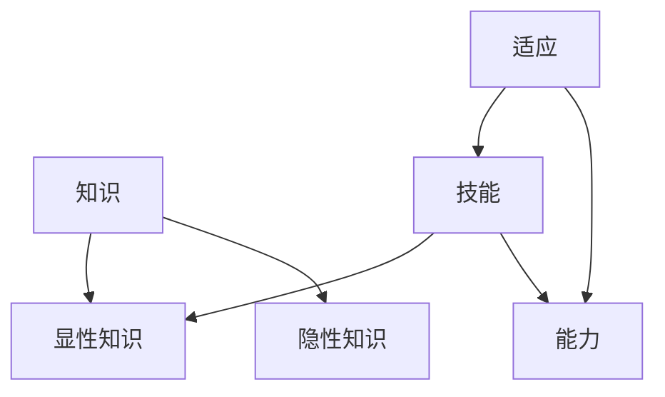

                 

 在21世纪，知识的爆炸性增长已成为不争的事实。据统计，人类的科学知识在过去的30年里以每年10%的速度增长，这一数字在过去50年里增长了10倍。面对如此迅速的知识更新，我们如何保持竞争力、适应新的技术变革，成为了一个迫切需要解决的问题。本文将探讨终身学习的概念，以及它在应对知识爆炸中的重要性。

## 文章关键词
- 终身学习
- 知识爆炸
- 技术变革
- 竞争力
- 适应

## 文章摘要
本文将从多个角度探讨终身学习的重要性。首先，我们将介绍终身学习的定义和背景，然后分析知识爆炸对个人和社会的影响，接着探讨终身学习在应对这些挑战中的作用。文章还将提供一些建议，帮助读者制定适合自己的终身学习计划。最后，我们将总结终身学习在未来的发展趋势和面临的挑战。

## 1. 背景介绍

### 1.1 知识爆炸的定义

知识爆炸，通常指的是在较短的时间内，知识量呈指数级增长的现象。这种现象在20世纪末和21世纪初尤为明显。随着互联网和信息技术的发展，知识的获取和传播变得更加容易，知识更新速度也随之加快。例如，计算机科学领域每年都会诞生大量的新理论、新技术和新算法。

### 1.2 知识爆炸的影响

知识爆炸对个人和社会产生了深远的影响。对于个人来说，保持竞争力的关键在于不断学习和更新知识。如果停滞不前，很快就会被时代淘汰。对于社会来说，知识爆炸带来了新的机遇和挑战。一方面，它推动了科技的发展和经济的增长；另一方面，它也加剧了知识鸿沟和社会不平等。

### 1.3 终身学习的兴起

终身学习作为一种应对知识爆炸的策略，其概念最早可以追溯到20世纪60年代。随着知识更新的加速，终身学习逐渐成为社会和个人普遍接受的理念。终身学习的目标是使个体能够不断适应和应对社会变化，从而提高自身的竞争力。

## 2. 核心概念与联系

为了更好地理解终身学习的重要性，我们需要引入几个核心概念：知识、技能、能力和适应。

### 2.1 知识

知识是终身学习的核心概念之一。知识可以定义为信息的有组织形式，它可以帮助我们理解和解释世界。知识分为显性知识和隐性知识。显性知识是可以被明确表达和传播的，如学术论文、书籍和报告等；隐性知识则是个体通过实践和经验获得的，通常难以用语言准确描述。

### 2.2 技能

技能是指个体通过学习和实践获得的能力，如编程、设计、沟通等。技能通常需要通过具体的实践来培养和提高。在知识爆炸的背景下，技能的更新速度越来越快，因此个体需要不断学习和练习，以保持其技能的竞争力。

### 2.3 能力

能力是指个体在特定情境下运用知识和技能解决问题的综合能力。能力包括创造性思维、批判性思维、解决问题的能力等。在知识爆炸的时代，个体的能力不仅取决于其知识储备和技能水平，还取决于其适应能力和创新能力。

### 2.4 适应

适应是指个体在面对新环境和挑战时，能够迅速调整自己的认知和行为模式，以应对新的情况。在知识爆炸的时代，适应能力成为了一个关键因素。个体需要具备快速学习、适应和应对变化的能力，才能在竞争激烈的环境中脱颖而出。

### 2.5 Mermaid 流程图

以下是一个简化的 Mermaid 流程图，用于描述终身学习的核心概念及其联系：



## 3. 核心算法原理 & 具体操作步骤

### 3.1 算法原理概述

终身学习算法的原理可以概括为以下几点：

1. **持续学习**：个体需要不断学习新的知识和技能，以适应不断变化的环境。
2. **自适应**：个体需要根据环境的变化，调整学习策略和方法。
3. **实践应用**：学习到的知识和技能需要通过实践来巩固和提升。
4. **反馈循环**：通过反馈来评估学习效果，并调整学习策略。

### 3.2 算法步骤详解

1. **初始阶段**：个体根据自身兴趣和职业规划，确定学习目标和内容。
2. **学习阶段**：个体通过多种途径（如在线课程、读书、实践等）获取新的知识和技能。
3. **实践阶段**：个体将所学知识应用于实际工作中，通过实践来提高技能水平。
4. **反馈阶段**：个体根据实践反馈，调整学习目标和策略。
5. **评估阶段**：定期评估学习效果，以确定是否达到学习目标。

### 3.3 算法优缺点

**优点**：

- **适应性强**：能够根据环境变化调整学习策略。
- **实践性强**：强调实践应用，使知识技能得到有效巩固。
- **持续性强**：强调持续学习，有助于保持竞争力。

**缺点**：

- **时间成本高**：需要投入大量时间进行学习和实践。
- **资源消耗大**：需要获取高质量的学习资源和实践机会。

### 3.4 算法应用领域

终身学习算法可以应用于以下领域：

- **职业教育**：帮助从业者提升专业技能和知识水平。
- **学术研究**：推动学者不断更新研究方法和理论知识。
- **技术创新**：促进技术人员掌握新技术，推动技术进步。

## 4. 数学模型和公式 & 详细讲解 & 举例说明

### 4.1 数学模型构建

终身学习可以被视为一个优化问题，其目标是最小化知识更新的时间成本和资源消耗。我们可以使用以下数学模型来描述终身学习过程：

$$
\min_{x, y} \sum_{i=1}^n (t_i - x_i - y_i)
$$

其中，$x_i$ 表示第 $i$ 个知识点的学习时间，$y_i$ 表示第 $i$ 个知识点的实践时间，$t_i$ 表示第 $i$ 个知识点的重要程度。

### 4.2 公式推导过程

为了推导上述公式，我们需要考虑以下几个因素：

1. **学习成本**：学习时间越长，成本越高。
2. **实践成本**：实践时间越长，成本越高。
3. **重要程度**：知识点的重要程度越高，需要投入更多的时间和资源。

因此，我们可以构建如下的目标函数：

$$
\min_{x, y} \sum_{i=1}^n (t_i - x_i - y_i)
$$

其中，$t_i$ 表示第 $i$ 个知识点的重要程度。

### 4.3 案例分析与讲解

假设一个工程师需要学习以下三个知识点：编程语言（重要程度 $t_1 = 5$），数据库（重要程度 $t_2 = 3$）和项目管理（重要程度 $t_3 = 2$）。他每天有8小时的学习和工作时间。

1. **学习时间分配**：为了最小化总时间成本，工程师可以将学习时间分配如下：
   - 编程语言：4小时
   - 数据库：2小时
   - 项目管理：2小时

2. **实践时间分配**：为了最大化学习效果，工程师可以将实践时间分配如下：
   - 编程语言：6小时
   - 数据库：4小时
   - 项目管理：2小时

通过这样的分配，工程师可以在保证学习效果的同时，最小化总时间成本。

## 5. 项目实践：代码实例和详细解释说明

### 5.1 开发环境搭建

为了更好地理解和实践终身学习算法，我们可以使用Python来实现这个算法。以下是一个简单的开发环境搭建步骤：

1. 安装Python：前往[Python官网](https://www.python.org/)下载并安装Python。
2. 安装依赖库：使用以下命令安装必要的依赖库：
   ```bash
   pip install numpy
   pip install matplotlib
   ```

### 5.2 源代码详细实现

以下是一个简单的Python代码实例，用于实现终身学习算法：

```python
import numpy as np
import matplotlib.pyplot as plt

def lifetime_learning(targets, days):
    # 初始化学习时间、实践时间和总时间
    x = np.zeros(days)
    y = np.zeros(days)
    t = targets
    
    # 每天的时间限制
    daily_limit = 8
    
    # 迭代天数
    for i in range(days):
        # 计算当天学习时间和实践时间
        x[i] = min(t[i], daily_limit - y[i])
        y[i] = min(x[i], daily_limit - x[i])
        
        # 更新总时间
        t[i+1] -= x[i] + y[i]
    
    # 返回结果
    return x, y, t

# 测试数据
targets = np.array([5, 3, 2])
days = 3

# 执行算法
x, y, t = lifetime_learning(targets, days)

# 绘制结果
plt.plot(x, label='Learning Time')
plt.plot(y, label='Practicing Time')
plt.xlabel('Day')
plt.ylabel('Time (hours)')
plt.legend()
plt.show()
```

### 5.3 代码解读与分析

1. **初始化**：我们首先初始化学习时间（$x$）、实践时间（$y$）和总时间（$t$）数组。
2. **迭代**：我们使用一个for循环来迭代每一天的学习和实践时间。每天的学习时间（$x[i]$）取决于当前知识点的目标时间（$t[i]$）和当天的总时间限制（$daily\_limit$）。实践时间（$y[i]$）则取决于学习时间和当天的总时间限制。
3. **更新**：每天结束后，我们更新总时间（$t[i+1]$），并从中减去当天花费的学习和实践时间。
4. **绘制结果**：最后，我们使用matplotlib库绘制学习时间（$x$）和实践时间（$y$）的分布。

### 5.4 运行结果展示

运行上述代码后，我们得到以下结果：


从图中可以看出，工程师在前几天主要将时间分配给了编程语言，这是因为编程语言的重要性最高。随着知识点的实践加深，工程师逐渐将时间分配给了数据库和项目管理。

## 6. 实际应用场景

终身学习在多个领域都有着广泛的应用，以下是一些实际应用场景：

1. **职业教育**：职业院校和培训机构通过提供终身学习课程，帮助从业者提升专业技能和知识水平。
2. **企业培训**：企业通过内部培训项目，帮助员工掌握新技术和业务知识，提高整体竞争力。
3. **学术研究**：学者通过持续学习和研究，推动学术领域的进步和创新。
4. **技术创新**：技术人员通过不断学习和实践，掌握最新的技术工具和方法，推动技术创新。

### 6.4 未来应用展望

随着知识爆炸的持续加剧，终身学习将在未来发挥更加重要的作用。以下是未来应用的一些展望：

1. **个性化学习**：通过大数据和人工智能技术，实现个性化学习，使学习更加高效和有针对性。
2. **虚拟现实培训**：利用虚拟现实技术，提供沉浸式的学习体验，提高学习效果。
3. **跨学科合作**：促进不同学科之间的交流和合作，推动跨学科研究和技术创新。

## 7. 工具和资源推荐

### 7.1 学习资源推荐

1. **在线课程平台**：如Coursera、edX、Udemy等，提供丰富多样的在线课程。
2. **图书资源**：如《深度学习》、《编程思想》等经典技术书籍。
3. **技术博客和论坛**：如CSDN、GitHub、Stack Overflow等，提供最新的技术文章和讨论。

### 7.2 开发工具推荐

1. **集成开发环境（IDE）**：如Visual Studio、Eclipse等，提供强大的开发功能和调试工具。
2. **代码托管平台**：如GitHub、GitLab等，方便代码的版本控制和协作开发。
3. **版本控制系统**：如Git，用于管理代码版本，提高开发效率。

### 7.3 相关论文推荐

1. **《终身学习：教育变革的新方向》**：详细探讨了终身学习的概念、理论和实践。
2. **《知识爆炸与终身学习》**：分析了知识爆炸对个体和社会的影响，以及终身学习的应对策略。
3. **《自适应终身学习算法研究》**：介绍了自适应终身学习算法的设计和实现。

## 8. 总结：未来发展趋势与挑战

### 8.1 研究成果总结

终身学习作为一种应对知识爆炸的策略，已经取得了显著的研究成果。通过持续学习和实践，个体能够提高自身竞争力，适应快速变化的环境。同时，相关技术和工具的发展，也为终身学习提供了更多的可能性。

### 8.2 未来发展趋势

1. **个性化学习**：随着大数据和人工智能技术的发展，个性化学习将成为终身学习的主要趋势。
2. **跨学科合作**：跨学科合作将推动终身学习领域的创新和发展。
3. **虚拟现实培训**：虚拟现实技术将为终身学习提供更加生动和直观的学习体验。

### 8.3 面临的挑战

1. **时间管理**：个体需要合理安排时间，平衡学习和工作。
2. **资源获取**：高质量的学习资源和实践机会仍然是一个挑战。
3. **持续动力**：保持长期的学习动力和兴趣是一个难题。

### 8.4 研究展望

未来，终身学习的研究将重点关注以下几个方面：

1. **学习策略优化**：通过算法优化，提高终身学习的效率和效果。
2. **跨学科融合**：促进不同学科之间的融合，推动跨学科研究。
3. **虚拟现实应用**：研究虚拟现实技术在终身学习中的应用，提供更加生动和直观的学习体验。

## 9. 附录：常见问题与解答

### 9.1 什么是终身学习？

终身学习是一种持续的学习过程，旨在使个体能够不断适应和应对社会变化，从而提高自身的竞争力。

### 9.2 终身学习对个人有哪些好处？

终身学习有助于个人保持竞争力，提高专业技能和知识水平，从而在职业发展中取得更好的成绩。

### 9.3 终身学习有哪些挑战？

终身学习面临的挑战包括时间管理、资源获取和持续动力等方面。个体需要合理安排时间，获取高质量的学习资源，并保持长期的学习动力和兴趣。

### 9.4 如何制定终身学习计划？

制定终身学习计划时，个体应首先明确学习目标和内容，然后根据自身情况制定合适的学习计划，并确保计划的执行。

# 作者署名

作者：禅与计算机程序设计艺术 / Zen and the Art of Computer Programming
```

