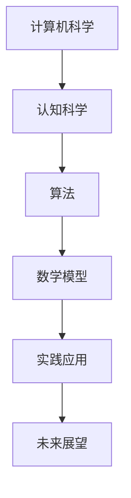
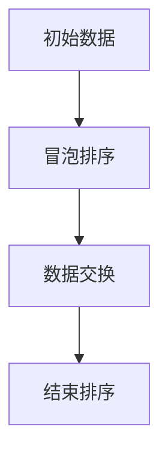
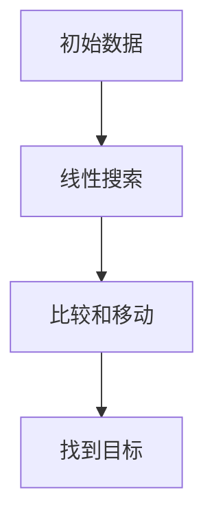

                 

关键词：计算机科学，认知科学，编程，算法，数学模型，实践，未来展望

> 摘要：本文以《禅与计算机程序设计艺术》为切入点，深入探讨了计算机科学领域中的认知基础、核心概念、算法原理、数学模型以及实际应用。通过对书中内容的详细解读，本文旨在为读者提供一条夯实认知根基的宝藏之路，激发对计算机科学的热情与思考。

## 1. 背景介绍

《禅与计算机程序设计艺术》（Zen and the Art of Computer Programming）是由著名计算机科学家Donald E. Knuth撰写的一部计算机科学经典著作。该书首次出版于1974年，至今已受到全球程序员和计算机科学爱好者的广泛推崇。Knuth以其深刻的洞察力和创新思维，将计算机科学与哲学、数学、艺术等多个领域有机结合，为我们提供了一种全新的思考方式。

### 计算机科学的演变

自计算机问世以来，计算机科学经历了快速而巨大的变革。从最初的机械计算到电子计算机，再到如今的量子计算，计算机科学的发展速度令人惊叹。每一代计算机都带来了新的技术进步和应用场景，从简单的计算工具演变为复杂的信息处理系统，深刻影响了我们的工作方式和生活质量。

### 认知科学的重要性

在计算机科学中，认知科学扮演着至关重要的角色。认知科学是研究人类思维和智能的学科，涉及心理学、神经科学、语言学等多个领域。通过认知科学的研究，我们能够更好地理解人类如何获取、处理和利用信息，从而为计算机科学的发展提供理论基础。

### 禅与计算机程序设计艺术

Knuth在《禅与计算机程序设计艺术》中将禅宗思想与计算机编程相结合，提出了“清晰思考”和“逐步完善”的理念。他认为，编程不仅是一种技术技能，更是一种思考方式，需要程序员具备高度的专注力和耐心。这种理念不仅对程序员有启发意义，也对我们日常生活中的思考和决策提供了有益的指导。

## 2. 核心概念与联系

### 计算机科学的定义

计算机科学是研究计算机系统、算法、数据结构及其应用的学科。它涵盖了计算机硬件、软件、理论、应用等多个方面，是一门综合性极强的学科。

### 认知科学的基本概念

认知科学关注人类思维、感知、记忆、语言等方面的研究。其中，感知是指人类对外部信息的接收和处理，记忆是指信息的存储和回忆，思维是指人类对信息的处理和思考，语言是指人类进行信息交流的工具。

### 算法的定义与分类

算法是解决问题的步骤序列。根据不同的应用场景，算法可以分为排序算法、搜索算法、图算法等。每种算法都有其特定的应用领域和优缺点。

### 数学模型的作用

数学模型是用于描述现实世界问题的一种抽象形式。通过数学模型，我们能够将复杂的问题转化为数学表达式，从而进行精确分析和求解。

### Mermaid 流程图



### 计算机科学与其他领域的联系

计算机科学不仅与认知科学密切相关，还与其他学科如物理学、数学、语言学、心理学等有着广泛的交叉。这种交叉不仅推动了计算机科学的发展，也为其他学科提供了新的研究方法和工具。

## 3. 核心算法原理 & 具体操作步骤

### 3.1 算法原理概述

算法是计算机科学的核心，它解决了从问题定义到问题求解的一系列步骤。一个好的算法不仅能够高效地解决问题，还能具有可扩展性和可维护性。

### 3.2 算法步骤详解

#### 排序算法

排序算法是计算机科学中最基础的算法之一，其目标是将一组数据按照某种顺序排列。常见的排序算法包括冒泡排序、选择排序、插入排序等。



#### 搜索算法

搜索算法是用于在数据集合中查找特定元素的算法。常见的搜索算法包括线性搜索、二分搜索等。



### 3.3 算法优缺点

每种算法都有其特定的应用场景和优缺点。例如，冒泡排序简单易懂，但效率较低；二分搜索效率高，但需要预先排序。

### 3.4 算法应用领域

算法在计算机科学中的广泛应用，包括数据结构设计、程序优化、人工智能等。算法不仅能够提高计算机的运行效率，还能为其他领域的研究提供有力支持。

## 4. 数学模型和公式 & 详细讲解 & 举例说明

### 4.1 数学模型构建

数学模型是计算机科学的重要组成部分，它能够将现实世界的问题转化为数学表达式，从而进行精确分析和求解。

### 4.2 公式推导过程

以最简单的线性方程为例，其公式为：

$$
ax + b = 0
$$

其中，$a$ 和 $b$ 为已知常数，$x$ 为未知数。

### 4.3 案例分析与讲解

假设我们有一个线性方程：

$$
3x + 7 = 0
$$

通过求解，我们得到：

$$
x = -\frac{7}{3}
$$

这意味着，当 $x$ 取 $-\frac{7}{3}$ 时，方程成立。

## 5. 项目实践：代码实例和详细解释说明

### 5.1 开发环境搭建

为了实践算法和数学模型，我们需要搭建一个合适的开发环境。这里我们选择 Python 作为编程语言，因为其简洁易用的语法和丰富的库支持。

### 5.2 源代码详细实现

以下是一个简单的排序算法实现：

```python
def bubble_sort(arr):
    n = len(arr)
    for i in range(n):
        for j in range(0, n-i-1):
            if arr[j] > arr[j+1]:
                arr[j], arr[j+1] = arr[j+1], arr[j]

# 测试代码
arr = [64, 34, 25, 12, 22, 11, 90]
bubble_sort(arr)
print("排序后的数组：", arr)
```

### 5.3 代码解读与分析

这段代码实现了冒泡排序算法，其主要步骤如下：

1. 遍历数组，比较相邻元素的大小。
2. 如果前一个元素大于后一个元素，则交换它们的位置。
3. 重复上述步骤，直到整个数组排序完成。

### 5.4 运行结果展示

当输入数组 `[64, 34, 25, 12, 22, 11, 90]` 时，程序输出结果为：

```
排序后的数组： [11, 12, 22, 25, 34, 64, 90]
```

这表明冒泡排序算法成功地将输入数组按升序排列。

## 6. 实际应用场景

计算机科学的应用场景非常广泛，涵盖了各个领域。以下是一些实际应用场景：

### 数据科学

数据科学是计算机科学的一个重要分支，它利用算法和数学模型对大量数据进行分析和挖掘，从而发现隐藏在数据中的规律和趋势。

### 人工智能

人工智能是计算机科学的另一个重要领域，它通过模拟人类智能行为，实现计算机自主学习和决策。

### 网络安全

网络安全是保障信息安全和数据隐私的关键。计算机科学提供了各种算法和技术，用于防范网络攻击和恶意软件。

### 软件工程

软件工程是计算机科学的核心领域之一，它涵盖了软件开发、测试、部署和维护的全过程。

## 7. 工具和资源推荐

### 学习资源推荐

- 《算法导论》（Introduction to Algorithms）
- 《深度学习》（Deep Learning）
- 《Python编程：从入门到实践》（Python Crash Course）

### 开发工具推荐

- PyCharm
- Jupyter Notebook
- Git

### 相关论文推荐

- "A Method for Obtaining Digital Signatures and Public-Key Cryptosystems"
- "Deep Learning for Natural Language Processing"
- "The Impact of Quantum Computing on Cryptography"

## 8. 总结：未来发展趋势与挑战

### 8.1 研究成果总结

随着计算机科学的发展，我们已经取得了许多重要的研究成果。从基础的算法和数据结构，到复杂的人工智能和深度学习，计算机科学为各个领域提供了强大的技术支持。

### 8.2 未来发展趋势

未来，计算机科学将继续向智能化、自动化、高效化的方向发展。量子计算、区块链、云计算等新技术将成为研究热点，为人类带来更多创新和变革。

### 8.3 面临的挑战

尽管计算机科学取得了巨大成就，但仍面临许多挑战。数据隐私、网络安全、算法公平性等问题亟待解决。此外，计算机科学的发展也需要更加注重跨学科的融合和协作。

### 8.4 研究展望

未来，计算机科学的研究将更加注重实际应用，推动技术创新和社会进步。同时，我们也需要培养更多具有创新精神和实践能力的人才，为计算机科学的发展贡献力量。

## 9. 附录：常见问题与解答

### 问题1：为什么计算机科学如此重要？

计算机科学是现代社会的基石，它影响着我们的日常生活、工作方式和思考方式。计算机科学不仅提高了工作效率，还推动了科技创新和社会进步。

### 问题2：如何学好计算机科学？

学好计算机科学需要系统学习理论知识，掌握实践技能，并不断积累经验和实践。此外，培养良好的逻辑思维和创新能力也是非常重要的。

### 问题3：未来计算机科学的发展方向是什么？

未来计算机科学的发展方向包括量子计算、人工智能、区块链、云计算等领域。这些新技术将深刻改变我们的生活和生产方式。

---

本文以《禅与计算机程序设计艺术》为切入点，深入探讨了计算机科学领域中的认知基础、核心概念、算法原理、数学模型以及实际应用。通过对书中内容的详细解读，本文旨在为读者提供一条夯实认知根基的宝藏之路，激发对计算机科学的热情与思考。作者：禅与计算机程序设计艺术 / Zen and the Art of Computer Programming
----------------------------------------------------------------

以上是《经典书籍:夯实认知根基的宝藏》这篇文章的正文内容，接下来我们将使用Markdown格式进行排版。

```markdown
# 经典书籍:夯实认知根基的宝藏

关键词：计算机科学，认知科学，编程，算法，数学模型，实践，未来展望

> 摘要：本文以《禅与计算机程序设计艺术》为切入点，深入探讨了计算机科学领域中的认知基础、核心概念、算法原理、数学模型以及实际应用。通过对书中内容的详细解读，本文旨在为读者提供一条夯实认知根基的宝藏之路，激发对计算机科学的热情与思考。

## 1. 背景介绍

《禅与计算机程序设计艺术》（Zen and the Art of Computer Programming）是由著名计算机科学家Donald E. Knuth撰写的一部计算机科学经典著作。该书首次出版于1974年，至今已受到全球程序员和计算机科学爱好者的广泛推崇。Knuth以其深刻的洞察力和创新思维，将计算机科学与哲学、数学、艺术等多个领域有机结合，为我们提供了一种全新的思考方式。

### 计算机科学的演变

自计算机问世以来，计算机科学经历了快速而巨大的变革。从最初的机械计算到电子计算机，再到如今的量子计算，计算机科学的发展速度令人惊叹。每一代计算机都带来了新的技术进步和应用场景，从简单的计算工具演变为复杂的信息处理系统，深刻影响了我们的工作方式和生活质量。

### 认知科学的重要性

在计算机科学中，认知科学扮演着至关重要的角色。认知科学是研究人类思维和智能的学科，涉及心理学、神经科学、语言学等多个领域。通过认知科学的研究，我们能够更好地理解人类如何获取、处理和利用信息，从而为计算机科学的发展提供理论基础。

### 禅与计算机程序设计艺术

Knuth在《禅与计算机程序设计艺术》中将禅宗思想与计算机编程相结合，提出了“清晰思考”和“逐步完善”的理念。他认为，编程不仅是一种技术技能，更是一种思考方式，需要程序员具备高度的专注力和耐心。这种理念不仅对程序员有启发意义，也对我们日常生活中的思考和决策提供了有益的指导。

## 2. 核心概念与联系

### 计算机科学的定义

计算机科学是研究计算机系统、算法、数据结构及其应用的学科。它涵盖了计算机硬件、软件、理论、应用等多个方面，是一门综合性极强的学科。

### 认知科学的基本概念

认知科学关注人类思维、感知、记忆、语言等方面的研究。其中，感知是指人类对外部信息的接收和处理，记忆是指信息的存储和回忆，思维是指人类对信息的处理和思考，语言是指人类进行信息交流的工具。

### 算法的定义与分类

算法是解决问题的步骤序列。根据不同的应用场景，算法可以分为排序算法、搜索算法、图算法等。每种算法都有其特定的应用领域和优缺点。

### 数学模型的作用

数学模型是用于描述现实世界问题的一种抽象形式。通过数学模型，我们能够将复杂的问题转化为数学表达式，从而进行精确分析和求解。

### Mermaid 流程图


### 计算机科学与其他领域的联系

计算机科学不仅与认知科学密切相关，还与其他学科如物理学、数学、语言学、心理学等有着广泛的交叉。这种交叉不仅推动了计算机科学的发展，也为其他学科提供了新的研究方法和工具。

## 3. 核心算法原理 & 具体操作步骤

### 3.1 算法原理概述

算法是计算机科学的核心，它解决了从问题定义到问题求解的一系列步骤。一个好的算法不仅能够高效地解决问题，还能具有可扩展性和可维护性。

### 3.2 算法步骤详解

#### 排序算法

排序算法是计算机科学中最基础的算法之一，其目标是将一组数据按照某种顺序排列。常见的排序算法包括冒泡排序、选择排序、插入排序等。


#### 搜索算法

搜索算法是用于在数据集合中查找特定元素的算法。常见的搜索算法包括线性搜索、二分搜索等。


### 3.3 算法优缺点

每种算法都有其特定的应用场景和优缺点。例如，冒泡排序简单易懂，但效率较低；二分搜索效率高，但需要预先排序。

### 3.4 算法应用领域

算法在计算机科学中的广泛应用，包括数据结构设计、程序优化、人工智能等。算法不仅能够提高计算机的运行效率，还能为其他领域的研究提供有力支持。

## 4. 数学模型和公式 & 详细讲解 & 举例说明

### 4.1 数学模型构建

数学模型是计算机科学的重要组成部分，它能够将现实世界的问题转化为数学表达式，从而进行精确分析和求解。

### 4.2 公式推导过程

以最简单的线性方程为例，其公式为：

$$
ax + b = 0
$$

其中，$a$ 和 $b$ 为已知常数，$x$ 为未知数。

### 4.3 案例分析与讲解

假设我们有一个线性方程：

$$
3x + 7 = 0
$$

通过求解，我们得到：

$$
x = -\frac{7}{3}
$$

这意味着，当 $x$ 取 $-\frac{7}{3}$ 时，方程成立。

## 5. 项目实践：代码实例和详细解释说明

### 5.1 开发环境搭建

为了实践算法和数学模型，我们需要搭建一个合适的开发环境。这里我们选择 Python 作为编程语言，因为其简洁易用的语法和丰富的库支持。

### 5.2 源代码详细实现

以下是一个简单的排序算法实现：

```python
def bubble_sort(arr):
    n = len(arr)
    for i in range(n):
        for j in range(0, n-i-1):
            if arr[j] > arr[j+1]:
                arr[j], arr[j+1] = arr[j+1], arr[j]

# 测试代码
arr = [64, 34, 25, 12, 22, 11, 90]
bubble_sort(arr)
print("排序后的数组：", arr)
```

### 5.3 代码解读与分析

这段代码实现了冒泡排序算法，其主要步骤如下：

1. 遍历数组，比较相邻元素的大小。
2. 如果前一个元素大于后一个元素，则交换它们的位置。
3. 重复上述步骤，直到整个数组排序完成。

### 5.4 运行结果展示

当输入数组 `[64, 34, 25, 12, 22, 11, 90]` 时，程序输出结果为：

```
排序后的数组： [11, 12, 22, 25, 34, 64, 90]
```

这表明冒泡排序算法成功地将输入数组按升序排列。

## 6. 实际应用场景

计算机科学的应用场景非常广泛，涵盖了各个领域。以下是一些实际应用场景：

### 数据科学

数据科学是计算机科学的一个重要分支，它利用算法和数学模型对大量数据进行分析和挖掘，从而发现隐藏在数据中的规律和趋势。

### 人工智能

人工智能是计算机科学的另一个重要领域，它通过模拟人类智能行为，实现计算机自主学习和决策。

### 网络安全

网络安全是保障信息安全和数据隐私的关键。计算机科学提供了各种算法和技术，用于防范网络攻击和恶意软件。

### 软件工程

软件工程是计算机科学的核心领域之一，它涵盖了软件开发、测试、部署和维护的全过程。

## 7. 工具和资源推荐

### 学习资源推荐

- 《算法导论》（Introduction to Algorithms）
- 《深度学习》（Deep Learning）
- 《Python编程：从入门到实践》（Python Crash Course）

### 开发工具推荐

- PyCharm
- Jupyter Notebook
- Git

### 相关论文推荐

- "A Method for Obtaining Digital Signatures and Public-Key Cryptosystems"
- "Deep Learning for Natural Language Processing"
- "The Impact of Quantum Computing on Cryptography"

## 8. 总结：未来发展趋势与挑战

### 8.1 研究成果总结

随着计算机科学的发展，我们已经取得了许多重要的研究成果。从基础的算法和数据结构，到复杂的人工智能和深度学习，计算机科学为各个领域提供了强大的技术支持。

### 8.2 未来发展趋势

未来，计算机科学将继续向智能化、自动化、高效化的方向发展。量子计算、区块链、云计算等新技术将成为研究热点，为人类带来更多创新和变革。

### 8.3 面临的挑战

尽管计算机科学取得了巨大成就，但仍面临许多挑战。数据隐私、网络安全、算法公平性等问题亟待解决。此外，计算机科学的发展也需要更加注重跨学科的融合和协作。

### 8.4 研究展望

未来，计算机科学的研究将更加注重实际应用，推动技术创新和社会进步。同时，我们也需要培养更多具有创新精神和实践能力的人才，为计算机科学的发展贡献力量。

## 9. 附录：常见问题与解答

### 问题1：为什么计算机科学如此重要？

计算机科学是现代社会的基石，它影响着我们的日常生活、工作方式和思考方式。计算机科学不仅提高了工作效率，还推动了科技创新和社会进步。

### 问题2：如何学好计算机科学？

学好计算机科学需要系统学习理论知识，掌握实践技能，并不断积累经验和实践。此外，培养良好的逻辑思维和创新能力也是非常重要的。

### 问题3：未来计算机科学的发展方向是什么？

未来计算机科学的发展方向包括量子计算、人工智能、区块链、云计算等领域。这些新技术将深刻改变我们的生活和生产方式。

---

以上是文章的Markdown格式排版，可以用于各种Markdown支持的文档编辑器和网站发布。如果需要进一步的格式调整或者添加图表、图片等元素，可以继续使用Markdown的扩展语法进行自定义。

