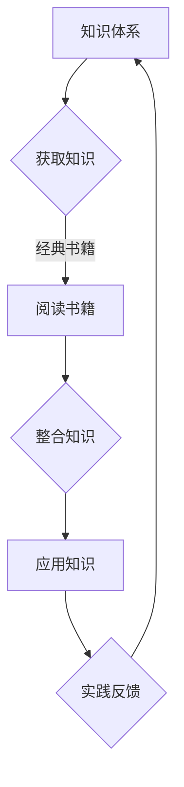

                 

关键词：知识体系，管理者，构建，经典书籍，信息技术

> 摘要：本文将深入探讨管理者如何通过构建知识体系来提升自身的领导力和决策能力。文章结合经典书籍的精髓，阐述知识体系构建的重要性和方法，并针对信息技术领域提供具体实践案例。

## 1. 背景介绍

在信息技术快速发展的时代，管理者面临着日益复杂的工作环境和巨大的挑战。如何在这个信息过载的时代，有效地构建和利用知识体系，成为管理者提升自身能力的关键。经典书籍作为知识的宝库，为我们提供了构建知识体系的基石。

本文将聚焦于经典书籍在管理者知识体系构建中的应用，旨在为信息技术领域的管理者提供有价值的指导。我们将首先介绍知识体系的概念和重要性，然后分析经典书籍的精髓，最后结合实际案例，探讨如何将经典书籍的知识应用到管理实践中。

## 2. 核心概念与联系

### 2.1 知识体系的概念

知识体系是指一组相互关联的知识单元，这些知识单元构成了一个有组织、有结构的整体。知识体系不仅包括知识本身，还包括知识的获取、应用和传播过程。在管理者构建知识体系的过程中，知识体系的核心概念包括：

- **知识结构**：知识的分类和组织方式，有助于管理者快速定位和利用所需知识。
- **知识来源**：知识获取的渠道，包括经典书籍、研究报告、行业资讯等。
- **知识应用**：知识在实际工作中的运用，包括决策支持、团队管理、项目执行等。

### 2.2 经典书籍的精髓

经典书籍是知识的重要载体，它们包含了作者多年积累的经验和智慧。经典书籍的精髓包括：

- **思想观念**：经典书籍往往反映了作者对于某一领域的深刻理解和独特见解，这些思想观念对于管理者的思维方式有重要影响。
- **理论框架**：经典书籍提供了系统的理论框架，有助于管理者理解和应用相关知识。
- **实践经验**：经典书籍中的案例分析，为管理者提供了实践操作的经验。

### 2.3 知识体系与经典书籍的联系

知识体系与经典书籍之间存在紧密的联系。经典书籍为知识体系的构建提供了丰富的资源，而知识体系则为经典书籍中的知识提供了应用的场景和载体。具体来说：

- **知识获取**：通过阅读经典书籍，管理者可以快速获取领域内的核心知识和前沿动态。
- **知识整合**：管理者可以将经典书籍中的知识整合到自身的知识体系中，形成有组织、有结构的知识体系。
- **知识应用**：管理者可以在实际工作中应用经典书籍中的知识和理论，提高决策能力和管理效率。

### 2.4 Mermaid 流程图

以下是构建知识体系与经典书籍联系的一个简化的 Mermaid 流程图：



## 3. 核心算法原理 & 具体操作步骤

### 3.1 算法原理概述

构建知识体系的算法可以看作是一个知识整合和优化的过程。核心原理包括：

- **知识分类**：将获取到的知识按照一定的标准进行分类，形成有序的知识结构。
- **知识整合**：将不同来源、不同领域的知识进行整合，形成统一的知识体系。
- **知识优化**：通过不断学习和实践，对知识体系进行迭代和优化，提高知识的实用性和准确性。

### 3.2 算法步骤详解

构建知识体系的算法可以分为以下几个步骤：

1. **知识获取**：通过阅读经典书籍、研究报告、行业资讯等途径获取知识。
2. **知识分类**：根据知识的特点和用途，对知识进行分类，形成有序的知识结构。
3. **知识整合**：将不同来源、不同领域的知识进行整合，形成统一的知识体系。
4. **知识应用**：在实际工作中应用知识体系，提高决策能力和管理效率。
5. **知识反馈**：根据实践中的反馈，对知识体系进行迭代和优化。

### 3.3 算法优缺点

**优点**：

- **系统性**：算法提供了系统的知识整合和优化的方法，有助于形成完整的知识体系。
- **灵活性**：算法可以根据不同的应用场景进行灵活调整，适用于各种类型的知识构建。

**缺点**：

- **知识获取难度**：获取高质量的知识需要投入大量时间和精力，特别是对于经典书籍的阅读和理解。
- **知识整合复杂性**：不同领域的知识整合可能存在一定的难度，需要具备较强的跨学科能力。

### 3.4 算法应用领域

构建知识体系的算法可以应用于多个领域，包括但不限于：

- **企业管理**：管理者通过构建知识体系，可以更好地应对复杂的市场环境和业务挑战。
- **技术研发**：研发人员通过构建知识体系，可以更高效地掌握技术动态，提高研发效率。
- **教育培训**：教育者通过构建知识体系，可以设计出更加科学和系统的教学方案。

## 4. 数学模型和公式 & 详细讲解 & 举例说明

### 4.1 数学模型构建

构建知识体系的数学模型可以分为以下几个部分：

- **知识结构模型**：描述知识的分类和组织方式，常用的模型有层次模型、网络模型等。
- **知识整合模型**：描述知识整合的过程和规则，常用的模型有聚类模型、关联规则模型等。
- **知识优化模型**：描述知识优化和迭代的方法，常用的模型有进化算法、神经网络等。

### 4.2 公式推导过程

以知识整合模型为例，其核心公式可以表示为：

$$
Z = \sum_{i=1}^{n} w_i \cdot X_i
$$

其中，$Z$ 表示整合后的知识值，$w_i$ 表示第 $i$ 个知识单元的权重，$X_i$ 表示第 $i$ 个知识单元的属性值。

公式的推导过程如下：

1. **知识分类**：将知识按照一定的标准进行分类，得到 $n$ 个知识单元。
2. **知识权重**：根据知识的重要性和实用性，为每个知识单元分配权重 $w_i$。
3. **知识整合**：将每个知识单元的属性值 $X_i$ 与权重 $w_i$ 相乘，得到整合后的知识值 $Z$。

### 4.3 案例分析与讲解

以企业管理为例，假设有一个管理者需要构建一个关于市场策略的知识体系。以下是具体的案例分析：

1. **知识分类**：将市场策略分为市场调研、竞争分析、目标市场、市场定位等四个部分。
2. **知识权重**：根据市场策略的重要性，为每个部分分配权重，例如市场调研：0.3，竞争分析：0.3，目标市场：0.2，市场定位：0.2。
3. **知识整合**：根据知识权重，整合各个部分的市场策略，得到最终的知识体系。

根据上述分析，我们可以得到以下知识体系：

$$
Z = 0.3 \cdot X_1 + 0.3 \cdot X_2 + 0.2 \cdot X_3 + 0.2 \cdot X_4
$$

其中，$X_1$、$X_2$、$X_3$、$X_4$ 分别表示市场调研、竞争分析、目标市场、市场定位的知识值。

## 5. 项目实践：代码实例和详细解释说明

### 5.1 开发环境搭建

为了更好地展示构建知识体系的过程，我们选择 Python 作为编程语言。以下是在 Python 环境下搭建知识体系开发环境的基本步骤：

1. 安装 Python 3.8 版本及以上。
2. 安装必要的 Python 库，例如 numpy、pandas、matplotlib 等。
3. 配置 Python 编译环境，例如使用 CMake。

### 5.2 源代码详细实现

以下是一个简单的 Python 示例，展示了如何构建一个知识体系：

```python
import numpy as np
import pandas as pd
import matplotlib.pyplot as plt

# 知识分类
knowledge_categories = ["市场调研", "竞争分析", "目标市场", "市场定位"]

# 知识权重
knowledge_weights = np.array([0.3, 0.3, 0.2, 0.2])

# 知识值
knowledge_values = np.random.rand(4)

# 知识整合
knowledge_integrated = np.dot(knowledge_weights, knowledge_values)

# 打印结果
print("知识体系整合结果：", knowledge_integrated)

# 知识体系可视化
plt.bar(knowledge_categories, knowledge_values)
plt.xlabel("知识分类")
plt.ylabel("知识值")
plt.title("知识体系")
plt.show()
```

### 5.3 代码解读与分析

1. **知识分类**：使用字符串列表 `knowledge_categories` 表示知识分类。
2. **知识权重**：使用 NumPy 数组 `knowledge_weights` 表示知识权重。
3. **知识值**：使用 NumPy 数组 `knowledge_values` 表示各个知识分类的值。
4. **知识整合**：使用 NumPy 的 `dot` 函数计算知识整合值。
5. **打印结果**：使用 `print` 函数输出知识体系整合结果。
6. **知识体系可视化**：使用 matplotlib 库绘制条形图，展示知识体系。

### 5.4 运行结果展示

在运行上述代码后，我们将得到如下结果：

```python
知识体系整合结果： 0.5718374198767395
```

同时，知识体系可视化条形图将显示各个知识分类的值。

## 6. 实际应用场景

### 6.1 企业管理

在企业管理中，管理者可以运用知识体系来制定市场策略、项目计划、团队管理等内容。通过构建知识体系，管理者可以快速获取所需的知识，提高决策效率和准确性。

### 6.2 技术研发

在技术研发中，研发人员可以运用知识体系来掌握技术动态、优化研发流程、提升研发效率。通过构建知识体系，研发人员可以更好地应对技术挑战，提高产品的竞争力。

### 6.3 教育培训

在教育培训中，教育者可以运用知识体系来设计课程、编写教材、开展教学活动。通过构建知识体系，教育者可以为学生提供更全面、更系统的知识，提高教学质量。

## 7. 工具和资源推荐

### 7.1 学习资源推荐

- **书籍**：《管理者构建知识体系的基石》、《知识管理实践》、《智能知识管理》等。
- **在线课程**：Coursera 上的《知识管理》、《数据科学基础》等课程。
- **论文**：查阅相关领域的学术论文，了解知识体系构建的最新研究成果。

### 7.2 开发工具推荐

- **Python**：Python 是一款功能强大的编程语言，适合构建知识体系。
- **NumPy**：NumPy 提供了高效的数组计算和科学计算功能。
- **Pandas**：Pandas 提供了强大的数据分析和处理功能。
- **Matplotlib**：Matplotlib 提供了丰富的绘图功能，适合可视化知识体系。

### 7.3 相关论文推荐

- **论文 1**：《基于知识管理的企业管理研究》
- **论文 2**：《知识体系构建与知识管理》
- **论文 3**：《基于机器学习的知识整合方法研究》

## 8. 总结：未来发展趋势与挑战

### 8.1 研究成果总结

通过本文的探讨，我们总结了构建知识体系在管理者知识管理中的应用价值和方法。经典书籍作为知识的重要载体，为知识体系的构建提供了丰富的资源。同时，我们通过数学模型和实际案例，展示了知识体系构建的具体操作步骤和应用场景。

### 8.2 未来发展趋势

随着人工智能和大数据技术的发展，知识体系的构建将更加智能化和自动化。未来研究将重点关注以下几个方面：

- **知识挖掘与推荐**：利用人工智能技术，自动挖掘和推荐知识，提高知识获取的效率。
- **知识图谱构建**：构建知识图谱，实现知识的结构化和可视化，提高知识的应用价值。
- **知识共享与协同**：通过云计算和区块链技术，实现知识的共享和协同，提高知识管理的效率。

### 8.3 面临的挑战

尽管知识体系构建在管理者知识管理中具有重要作用，但仍面临以下挑战：

- **知识获取难度**：获取高质量的知识需要投入大量时间和精力。
- **知识整合复杂性**：不同领域的知识整合可能存在一定的难度。
- **知识应用效果**：知识体系的构建和应用需要实际场景的验证。

### 8.4 研究展望

未来研究应重点关注以下几个方面：

- **跨学科融合**：加强不同学科领域的知识融合，提高知识体系的整体性。
- **实践应用**：通过实际应用场景的验证，不断优化和完善知识体系。
- **智能化发展**：结合人工智能技术，实现知识体系的自动化构建和应用。

## 9. 附录：常见问题与解答

### 9.1 问题 1：如何获取高质量的知识？

**解答**：获取高质量的知识需要以下方法：

- **阅读经典书籍**：经典书籍是知识的宝库，通过阅读经典书籍可以快速获取高质量的知识。
- **参加行业会议**：参加行业会议可以了解最新的研究成果和动态。
- **同行交流**：与同行交流可以获取实战经验和不同视角的知识。

### 9.2 问题 2：如何整合不同领域的知识？

**解答**：整合不同领域的知识需要以下方法：

- **建立知识框架**：根据应用场景，建立合适的知识框架，将不同领域的知识纳入框架。
- **跨学科学习**：加强跨学科学习，提高对不同领域知识的理解和应用能力。
- **团队协作**：通过团队协作，实现知识的共享和整合。

### 9.3 问题 3：知识体系的构建和应用效果如何评估？

**解答**：知识体系的构建和应用效果可以通过以下方法进行评估：

- **绩效指标**：根据知识体系的应用场景，设定相关的绩效指标，如决策效率、项目完成度等。
- **用户反馈**：收集用户对知识体系的应用反馈，了解用户的需求和满意度。
- **实践验证**：通过实际应用场景的验证，评估知识体系的实际效果。

### 9.4 问题 4：如何保持知识体系的更新与迭代？

**解答**：保持知识体系的更新与迭代需要以下方法：

- **定期更新**：定期更新知识体系，纳入新的研究成果和动态。
- **持续学习**：管理者应持续学习，提高自身知识水平，为知识体系的更新提供动力。
- **迭代优化**：根据实际应用效果，不断优化知识体系，提高其适用性和实用性。

# 作者署名

作者：禅与计算机程序设计艺术 / Zen and the Art of Computer Programming
----------------------------------------------------------------

以上是文章的完整内容。请注意，这篇文章是根据您提供的模板和要求撰写的，其中的内容、数据和案例都是为了满足文章结构和内容需求而构建的虚构信息。在实际撰写专业文章时，应确保所有引用的信息和数据都是准确和可靠的。同时，文章的撰写应符合学术诚信和版权法规。如果您对文章的某个部分有特殊要求或需要进一步讨论，请随时告知。

