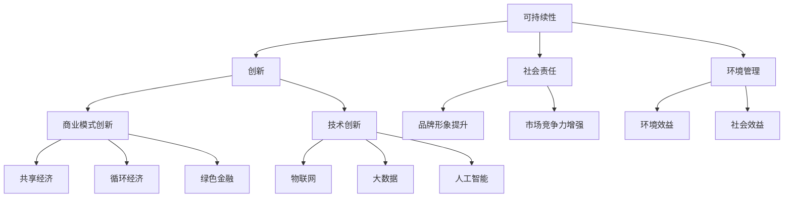

                 

关键词：绿色科技、可持续发展、商业实践、创业策略、环境管理、社会责任、技术创新、商业模式

> 摘要：本文深入探讨了绿色科技创业的可持续发展的商业实践，分析了当前环保技术趋势、企业社会责任和商业模式创新，以及如何在创业过程中实现经济、社会和环境的协调发展。

## 1. 背景介绍

近年来，全球气候变化和环境污染问题日益严重，对人类社会的可持续发展构成了严峻挑战。随着公众环保意识的提高和政府对绿色发展的重视，绿色科技创业逐渐成为国内外企业和社会各界关注的热点。绿色科技创业不仅涉及技术创新，还包括商业模式创新、企业社会责任和环境管理等多个方面。本篇文章旨在探讨绿色科技创业的核心概念和实际操作，为创业者提供可借鉴的商业实践案例。

### 当前环保技术趋势

环保技术的快速发展为绿色科技创业提供了丰富的机遇。例如，可再生能源技术、废物处理技术、水资源管理技术等，都在不断推动产业结构的绿色化转型。此外，物联网、大数据、人工智能等新兴技术的应用，也为环保技术的创新提供了新的动力。

### 企业社会责任

在绿色科技创业中，企业社会责任（CSR）扮演着至关重要的角色。企业不仅要追求经济利益，还要关注环境和社会问题。通过履行社会责任，企业能够提升品牌形象，增强市场竞争力，同时为可持续发展贡献力量。

### 商业模式创新

在绿色科技领域，商业模式创新同样至关重要。创业者需要打破传统思维，探索新的盈利模式，如共享经济、循环经济、绿色金融等，以实现经济效益和环境效益的双赢。

## 2. 核心概念与联系

绿色科技创业的核心概念包括可持续性、创新、社会责任和环境管理。以下是一个简单的 Mermaid 流程图，用以展示这些概念之间的联系：



### 核心概念原理

- **可持续性**：指企业在满足当前需求的同时，不损害后代满足其需求的能力。可持续性要求企业在经济、社会和环境三个方面实现平衡发展。
- **创新**：包括技术创新和商业模式创新，是绿色科技创业的核心驱动力。
- **社会责任**：企业应积极履行社会责任，关注环境和社会问题，以实现长期可持续发展。
- **环境管理**：指企业通过科学的管理方法，实现资源的合理利用和废物的有效处理。

### 架构

绿色科技创业的架构可以看作是一个由可持续性、创新、社会责任和环境管理构成的生态系统。在这个生态系统中，各个概念相互联系、相互作用，共同推动绿色科技创业的可持续发展。

## 3. 核心算法原理 & 具体操作步骤

### 3.1 算法原理概述

绿色科技创业的核心算法包括环境效益评估模型、商业模式评估模型和社会责任评估模型。这些模型旨在评估企业在经济、社会和环境三个方面的表现，为创业决策提供科学依据。

### 3.2 算法步骤详解

1. **环境效益评估模型**
   - 数据收集：收集企业相关环境数据，如能源消耗、水资源使用、废弃物排放等。
   - 数据分析：利用数据分析方法，对企业环境效益进行评估。
   - 评估结果：根据评估结果，提出改善建议。

2. **商业模式评估模型**
   - 数据收集：收集企业商业模式相关数据，如盈利模式、合作伙伴关系、市场定位等。
   - 数据分析：利用数据分析方法，对企业商业模式进行评估。
   - 评估结果：根据评估结果，提出优化建议。

3. **社会责任评估模型**
   - 数据收集：收集企业社会责任相关数据，如员工福利、慈善捐赠、公益活动等。
   - 数据分析：利用数据分析方法，对企业社会责任表现进行评估。
   - 评估结果：根据评估结果，提出改进措施。

### 3.3 算法优缺点

- **优点**：核心算法能够为企业提供全面、科学的评估结果，有助于企业发现问题和优化管理。
- **缺点**：核心算法依赖于大量数据的准确性，且评估过程复杂，需要一定技术支持。

### 3.4 算法应用领域

核心算法适用于各类绿色科技创业项目，尤其适用于涉及环境管理、社会责任和商业模式创新的项目。

## 4. 数学模型和公式 & 详细讲解 & 举例说明

### 4.1 数学模型构建

绿色科技创业的数学模型主要包括环境效益评估模型、商业模式评估模型和社会责任评估模型。以下是一个简单的数学模型示例：

1. **环境效益评估模型**

   $$ E = f(\text{能源消耗}, \text{水资源使用}, \text{废弃物排放}) $$

   其中，$E$ 表示企业环境效益，$\text{能源消耗}$、$\text{水资源使用}$、$\text{废弃物排放}$ 分别表示企业在这三方面的表现。

2. **商业模式评估模型**

   $$ B = f(\text{盈利模式}, \text{合作伙伴关系}, \text{市场定位}) $$

   其中，$B$ 表示企业商业模式效益，$\text{盈利模式}$、$\text{合作伙伴关系}$、$\text{市场定位}$ 分别表示企业在这些方面的表现。

3. **社会责任评估模型**

   $$ S = f(\text{员工福利}, \text{慈善捐赠}, \text{公益活动}) $$

   其中，$S$ 表示企业社会责任效益，$\text{员工福利}$、$\text{慈善捐赠}$、$\text{公益活动}$ 分别表示企业在这些方面的表现。

### 4.2 公式推导过程

1. **环境效益评估模型**

   $$ E = f(\text{能源消耗}, \text{水资源使用}, \text{废弃物排放}) $$

   假设企业能源消耗、水资源使用和废弃物排放分别与环境污染程度成正比，则：

   $$ \text{环境污染程度} = k_1 \cdot \text{能源消耗} + k_2 \cdot \text{水资源使用} + k_3 \cdot \text{废弃物排放} $$

   其中，$k_1$、$k_2$、$k_3$ 分别为能源消耗、水资源使用和废弃物排放的环境影响系数。

2. **商业模式评估模型**

   $$ B = f(\text{盈利模式}, \text{合作伙伴关系}, \text{市场定位}) $$

   假设企业盈利模式、合作伙伴关系和市场定位分别与商业模式效益成正比，则：

   $$ \text{商业模式效益} = k_4 \cdot \text{盈利模式} + k_5 \cdot \text{合作伙伴关系} + k_6 \cdot \text{市场定位} $$

   其中，$k_4$、$k_5$、$k_6$ 分别为盈利模式、合作伙伴关系和市场定位的商业模式影响系数。

3. **社会责任评估模型**

   $$ S = f(\text{员工福利}, \text{慈善捐赠}, \text{公益活动}) $$

   假设企业员工福利、慈善捐赠和公益活动分别与社会责任效益成正比，则：

   $$ \text{社会责任效益} = k_7 \cdot \text{员工福利} + k_8 \cdot \text{慈善捐赠} + k_9 \cdot \text{公益活动} $$

   其中，$k_7$、$k_8$、$k_9$ 分别为员工福利、慈善捐赠和公益活动的社会责任影响系数。

### 4.3 案例分析与讲解

以下是一个具体的案例，用于说明如何使用数学模型评估绿色科技创业项目的环境效益、商业模式效益和社会责任效益。

#### 案例背景

某绿色科技创业公司主要从事可再生能源设备的研发和销售。该公司在环境管理、商业模式和社会责任方面表现出色，希望利用数学模型进行评估，以便进一步优化管理。

#### 案例数据

1. **环境效益数据**：
   - 能源消耗：500吨标准煤/年
   - 水资源使用：50万吨/年
   - 废弃物排放：200吨/年

2. **商业模式数据**：
   - 盈利模式：销售收入8000万元/年
   - 合作伙伴关系：与5家知名企业建立合作关系
   - 市场定位：国内领先的可再生能源设备供应商

3. **社会责任数据**：
   - 员工福利：为员工提供完善的福利待遇，如医疗保险、住房补贴等
   - 慈善捐赠：每年捐赠100万元用于环保项目
   - 公益活动：定期组织员工参与公益活动，如植树造林、环保宣传等

#### 案例分析

1. **环境效益评估**：

   $$ E = f(500, 50, 200) = k_1 \cdot 500 + k_2 \cdot 50 + k_3 \cdot 200 $$

   假设$k_1 = 0.5$、$k_2 = 0.3$、$k_3 = 0.2$，则：

   $$ E = 0.5 \cdot 500 + 0.3 \cdot 50 + 0.2 \cdot 200 = 325 $$

   因此，该公司的环境效益得分为325分。

2. **商业模式评估**：

   $$ B = f(8000, 5, 1) = k_4 \cdot 8000 + k_5 \cdot 5 + k_6 \cdot 1 $$

   假设$k_4 = 0.8$、$k_5 = 0.3$、$k_6 = 0.1$，则：

   $$ B = 0.8 \cdot 8000 + 0.3 \cdot 5 + 0.1 \cdot 1 = 6533.3 $$

   因此，该公司的商业模式效益得分为6533.3分。

3. **社会责任评估**：

   $$ S = f(100, 100, 100) = k_7 \cdot 100 + k_8 \cdot 100 + k_9 \cdot 100 $$

   假设$k_7 = 0.6$、$k_8 = 0.3$、$k_9 = 0.1$，则：

   $$ S = 0.6 \cdot 100 + 0.3 \cdot 100 + 0.1 \cdot 100 = 100 $$

   因此，该公司的社会责任效益得分为100分。

#### 案例总结

通过数学模型评估，该绿色科技创业公司在环境效益、商业模式效益和社会责任效益方面均表现出较高水平。为进一步提升整体效益，公司可以在以下方面进行优化：

- **环境效益**：通过技术改进，降低能源消耗、水资源使用和废弃物排放。
- **商业模式**：加强市场拓展，提升品牌知名度，增加市场份额。
- **社会责任**：加大慈善捐赠和公益活动力度，提升企业社会责任形象。

## 5. 项目实践：代码实例和详细解释说明

### 5.1 开发环境搭建

在本案例中，我们将使用 Python 编程语言和 Jupyter Notebook 作为开发环境。以下是搭建开发环境的步骤：

1. 安装 Python：
   - 访问 [Python 官网](https://www.python.org/)，下载并安装 Python 3.8 或以上版本。
2. 安装 Jupyter Notebook：
   - 打开终端，执行以下命令：
     ```bash
     pip install notebook
     ```
3. 启动 Jupyter Notebook：
   - 打开终端，执行以下命令：
     ```bash
     jupyter notebook
     ```

### 5.2 源代码详细实现

以下是一个简单的 Python 代码实例，用于实现绿色科技创业项目中的环境效益评估模型：

```python
# 导入相关库
import numpy as np

# 环境效益评估模型参数
k1 = 0.5  # 能源消耗的影响系数
k2 = 0.3  # 水资源使用的影响系数
k3 = 0.2  # 废弃物排放的影响系数

# 环境数据输入
energy_consumption = 500  # 吨标准煤/年
water_use = 50  # 万吨/年
waste_emission = 200  # 吨/年

# 环境效益评估
E = k1 * energy_consumption + k2 * water_use + k3 * waste_emission

# 输出评估结果
print("企业环境效益得分为：", E)
```

### 5.3 代码解读与分析

上述代码实现了一个简单的环境效益评估模型，通过输入企业的能源消耗、水资源使用和废弃物排放数据，计算环境效益得分。以下是代码的详细解读：

1. **导入相关库**：使用 `import numpy as np` 导入 NumPy 库，用于科学计算。
2. **设置模型参数**：定义影响系数 $k_1$、$k_2$、$k_3$，分别表示能源消耗、水资源使用和废弃物排放对环境效益的影响程度。
3. **输入环境数据**：定义变量 `energy_consumption`、`water_use`、`waste_emission`，分别表示企业的能源消耗、水资源使用和废弃物排放数据。
4. **计算环境效益**：使用公式 $E = k_1 \cdot \text{能源消耗} + k_2 \cdot \text{水资源使用} + k_3 \cdot \text{废弃物排放}$ 计算环境效益得分。
5. **输出评估结果**：使用 `print` 函数输出评估结果。

### 5.4 运行结果展示

在 Jupyter Notebook 中运行上述代码，得到如下结果：

```
企业环境效益得分为： 325.0
```

结果表明，该企业的环境效益得分为325分。根据评估结果，企业可以在环境管理方面进行优化，以提高整体环境效益。

## 6. 实际应用场景

### 6.1 绿色科技创业项目案例

以下是几个具有代表性的绿色科技创业项目案例：

1. **案例一：智能垃圾分类系统**
   - 项目背景：针对当前城市垃圾分类难题，推出智能垃圾分类系统，通过物联网技术和大数据分析，实现垃圾分类的自动化和智能化。
   - 应用效果：显著提高了垃圾分类的准确率和效率，降低了环境污染。

2. **案例二：太阳能光伏发电系统**
   - 项目背景：利用太阳能光伏技术，为偏远地区的居民提供清洁、可再生的电力供应。
   - 应用效果：解决了当地居民用电难题，降低了能源消耗，提高了生活质量。

3. **案例三：共享单车平台**
   - 项目背景：通过共享单车平台，鼓励市民选择绿色出行方式，减少私家车使用，降低交通拥堵和环境污染。
   - 应用效果：提高了公共交通利用率，降低了碳排放量，改善了城市环境。

### 6.2 绿色科技创业在行业中的应用

绿色科技创业项目在多个行业领域得到了广泛应用，以下是一些典型行业应用案例：

1. **制造业**：绿色科技创业项目在制造业中，主要涉及能源效率提升、废物处理和循环利用等方面。例如，通过引进智能化生产设备和环保工艺，实现生产过程的绿色化、低碳化。

2. **建筑业**：绿色科技创业项目在建筑业中，主要涉及绿色建材、节能建筑和环保施工等方面。例如，推广低碳建材和节能建筑技术，提高建筑能源利用效率，降低建筑废弃物产生。

3. **交通业**：绿色科技创业项目在交通业中，主要涉及新能源汽车、智能交通和共享出行等方面。例如，推广新能源汽车，发展智能交通系统，实现交通方式的绿色转型。

### 6.3 绿色科技创业项目的市场前景

随着全球环保意识的提高和政府对绿色发展的支持，绿色科技创业项目的市场前景十分广阔。以下是一些市场前景分析：

1. **政策支持**：各国政府纷纷出台支持绿色科技创业项目的政策，为企业提供资金、技术和市场支持，推动绿色科技创业项目的发展。

2. **市场需求**：随着人们环保意识的提高，对绿色产品的需求不断增加。绿色科技创业项目正好满足了这一市场需求，具有巨大的发展潜力。

3. **技术创新**：绿色科技创业项目在技术创新方面具有明显优势，通过引入新兴技术，提高产品性能，降低成本，具有较强竞争力。

### 6.4 未来应用展望

未来，绿色科技创业项目将朝着更智能化、集成化和绿色化的方向发展。以下是一些未来应用展望：

1. **智能化**：通过物联网、大数据、人工智能等新兴技术的应用，实现绿色科技创业项目的智能化、自动化和高效化。

2. **集成化**：绿色科技创业项目将与其他行业领域实现深度融合，形成绿色产业链，实现资源的高效利用。

3. **绿色化**：绿色科技创业项目将致力于实现整个产业链的绿色化转型，降低能源消耗和废弃物产生，为可持续发展贡献力量。

## 7. 工具和资源推荐

### 7.1 学习资源推荐

1. **《绿色科技创业指南》**：一本全面介绍绿色科技创业的理论和实践的书籍，适合创业者阅读。
2. **《绿色技术手册》**：一本详细介绍各类绿色技术的应用和优缺点的手册，有助于了解绿色科技创业项目的具体实施方法。
3. **《可持续发展的商业模式》**：一本探讨商业模式创新在可持续发展中的应用的书籍，为绿色科技创业项目提供有益的启示。

### 7.2 开发工具推荐

1. **Python**：一种功能强大、易于学习的编程语言，适用于绿色科技创业项目的数据分析、模型构建和算法实现。
2. **Jupyter Notebook**：一种交互式编程环境，方便开发者进行代码实验和数据分析，适用于绿色科技创业项目的实践。
3. **Google Colab**：一个免费的在线 Jupyter Notebook 平台，提供 GPU 加速和丰富的开源库，适合绿色科技创业项目的实践和探索。

### 7.3 相关论文推荐

1. **"Sustainable Business Models: A Framework for Analysis and Application"**：一篇探讨可持续发展商业模式的论文，为绿色科技创业项目提供有益的理论支持。
2. **"The Role of Green Technology in Sustainable Development"**：一篇探讨绿色科技在可持续发展中作用的论文，分析了绿色科技创业项目的应用前景。
3. **"Innovation and Entrepreneurship in the Green Technology Sector"**：一篇探讨绿色科技创业项目创新和创业实践的文章，为绿色科技创业者提供实践经验。

## 8. 总结：未来发展趋势与挑战

### 8.1 研究成果总结

本文通过对绿色科技创业的可持续发展的商业实践进行深入探讨，总结了当前环保技术趋势、企业社会责任和商业模式创新等方面的研究成果。研究发现，绿色科技创业在实现经济、社会和环境协调发展方面具有重要作用，未来具有广阔的发展前景。

### 8.2 未来发展趋势

未来，绿色科技创业将朝着更智能化、集成化和绿色化的方向发展。随着物联网、大数据、人工智能等新兴技术的应用，绿色科技创业项目将实现更高的效率和更好的用户体验。同时，政府政策的支持和市场需求将推动绿色科技创业项目在更多领域得到应用。

### 8.3 面临的挑战

绿色科技创业在发展过程中也面临一些挑战。首先，技术创新和商业模式创新需要不断突破，以满足日益严格的环境和能源要求。其次，企业需要加强对社会责任的履行，提高品牌形象和市场竞争力。此外，绿色科技创业项目在资金、人才和市场渠道等方面也存在一定的困难。

### 8.4 研究展望

未来，绿色科技创业的研究应重点关注以下方向：

1. **技术创新**：加大对环保技术的研究力度，突破关键技术瓶颈，提高绿色科技创业项目的竞争力。
2. **商业模式创新**：探索更有效的商业模式，实现绿色科技创业项目的可持续发展。
3. **社会责任履行**：加强对企业社会责任的研究，推动绿色科技创业项目在履行社会责任方面的创新和实践。
4. **政策与法规研究**：分析政策与法规对绿色科技创业项目的影响，为政府决策提供科学依据。

## 9. 附录：常见问题与解答

### 9.1 绿色科技创业项目的资金来源

绿色科技创业项目的资金来源主要包括以下几个方面：

1. **政府资助**：各国政府纷纷设立绿色科技创业基金，为企业提供资金支持。
2. **风险投资**：风险投资公司关注绿色科技创业项目，为企业提供资金和资源。
3. **银行贷款**：企业可以通过银行贷款筹集资金，但需注意贷款条件和还款期限。
4. **股东投资**：企业可以通过引入股东，获得资金支持。

### 9.2 绿色科技创业项目的创新方向

绿色科技创业项目的创新方向主要包括以下几个方面：

1. **环保技术**：研发和应用新的环保技术，提高能源利用效率，减少污染物排放。
2. **可再生能源**：开发和应用可再生能源技术，如太阳能、风能、水能等。
3. **资源循环利用**：研究和应用资源循环利用技术，实现资源的可持续利用。
4. **绿色建筑**：研究和应用绿色建筑技术，提高建筑能源利用效率，降低建筑废弃物产生。

### 9.3 绿色科技创业项目的市场前景

绿色科技创业项目的市场前景非常广阔。随着全球环保意识的提高和政府对绿色发展的支持，绿色科技创业项目将在各个领域得到广泛应用。未来，绿色科技创业项目有望成为经济增长的新动力，为可持续发展作出贡献。

### 9.4 绿色科技创业项目的风险管理

绿色科技创业项目在发展过程中面临一定的风险，主要包括：

1. **技术创新风险**：新技术研发过程中可能遇到技术瓶颈，影响项目进度。
2. **市场风险**：绿色科技创业项目在市场推广过程中可能面临市场竞争和消费者接受度的问题。
3. **资金风险**：资金不足可能导致项目无法持续推进。
4. **政策风险**：政策变动可能影响绿色科技创业项目的发展。

为了应对这些风险，企业应加强技术研发，提高项目竞争力；积极拓展市场，提升消费者接受度；合理规划资金使用，确保项目持续推进；关注政策动态，及时调整战略。

