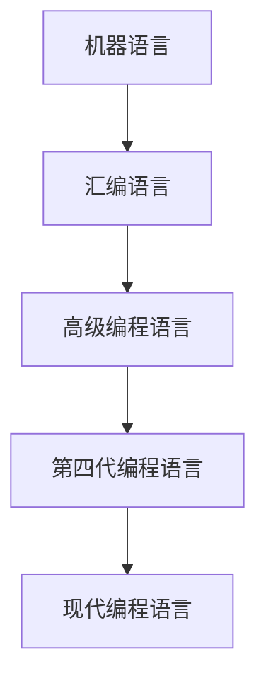
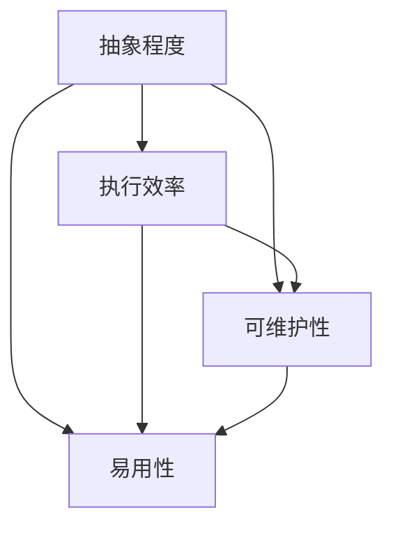
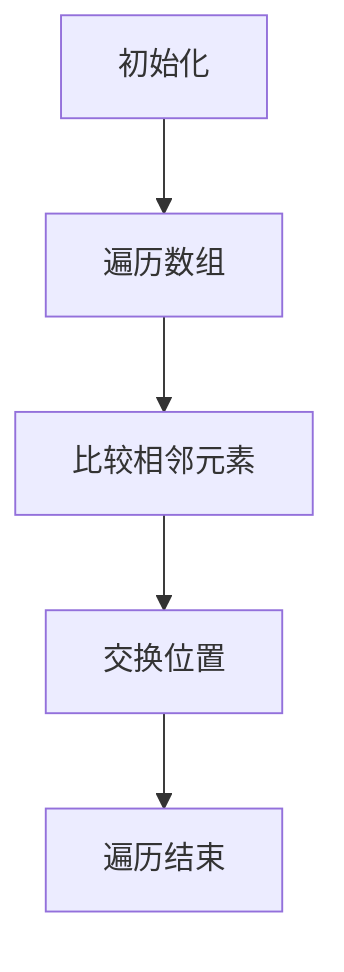
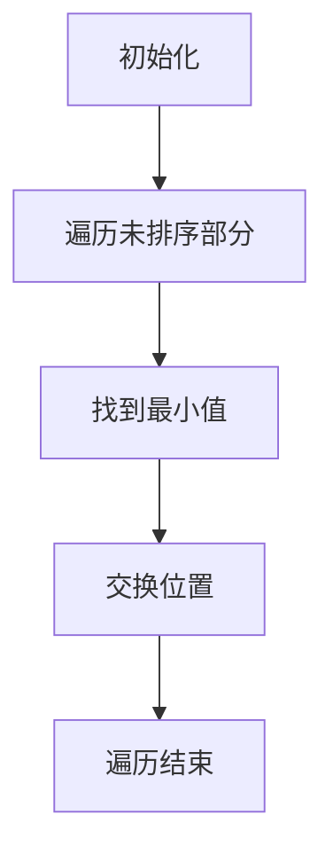
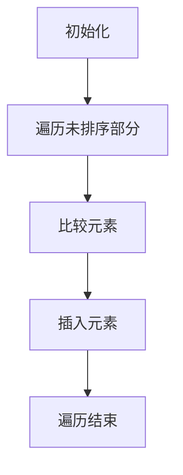
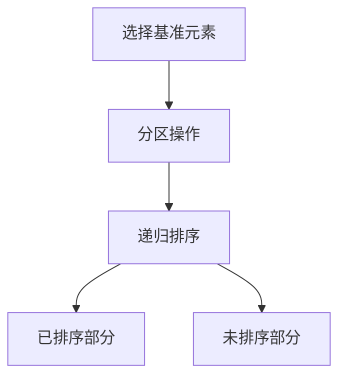

                 

编程语言的发展历程是计算机科学中不可或缺的一部分。从最初的机器语言，到高级语言，再到如今的多种编程范式，编程语言不断进化，为软件开发提供了多样化的选择。本文旨在梳理编程语言的发展脉络，探讨其核心概念与联系，分析核心算法原理，数学模型及其应用领域，并结合具体实例进行代码实现和解读。同时，我们将展望编程语言的发展趋势，面临的挑战以及未来的研究方向。

## 关键词

编程语言，发展历程，核心概念，算法原理，数学模型，应用领域

## 摘要

本文首先回顾了编程语言的发展脉络，从早期机器语言到现代多种编程范式的演变。接着，我们分析了核心概念与联系，利用Mermaid流程图展示了编程语言的核心原理和架构。随后，文章详细讲解了核心算法原理、数学模型和公式，并结合具体实例进行了代码实现和解读。最后，我们探讨了编程语言的未来应用场景，面临的挑战以及发展趋势。

### 1. 背景介绍

### 1.1 编程语言的起源

编程语言的起源可以追溯到20世纪中期。当时，计算机科学家们开始意识到直接操作硬件的机器语言（Machine Language）虽然效率高，但编写和维护极其困难。为了简化编程过程，提高编程效率，他们开始探索能够更方便地表达计算过程的符号系统。

### 1.2 第一代编程语言

1949年，约翰·冯·诺伊曼提出了汇编语言（Assembly Language）的概念。汇编语言通过使用助记符来表示机器语言的操作码，使得程序员能够更容易地理解和编写程序。尽管汇编语言相比机器语言有了一定的进步，但仍然存在一些局限性，比如难以编写复杂的程序。

### 1.3 第二代编程语言

1955年，约翰·巴科斯（John Backus）提出了FORTRAN（形式化报告语言1）的概念，这是世界上第一个高级编程语言。FORTRAN的出现使得编程过程更加简单和高效，大大提高了程序的可读性和可维护性。此后，各种高级编程语言如雨后春笋般涌现，如COBOL、LISP、C等。

### 1.4 第三代编程语言

随着计算机技术的发展，第三代编程语言（3GL）应运而生。这类语言更加注重抽象和通用性，通过提供丰富的库函数和高级控制结构，使得程序员能够编写更加复杂的程序。代表性的语言有Pascal、C++、Java等。

### 1.5 第四代编程语言

第四代编程语言（4GL）的出现标志着编程语言的进一步抽象。这类语言更加强调应用逻辑，通过提供图形化界面和模板，使得非专业程序员也能快速地开发出功能强大的应用程序。代表语言有SQL、Prolog、4GL等。

### 1.6 编程语言的发展趋势

随着云计算、大数据、人工智能等技术的飞速发展，编程语言也在不断演进。现代编程语言更加强调并行计算、动态类型、函数式编程等特性。同时，随着软件开发的复杂度不断提高，编程语言也朝着更易于维护、更可重用的方向发展。

## 2. 核心概念与联系

在探讨编程语言的发展过程中，理解其核心概念与联系至关重要。以下将利用Mermaid流程图展示编程语言的核心原理和架构。

### 2.1 编程语言的核心概念



### 2.2 编程语言的发展脉络


### 2.3 编程语言的特性与联系



通过以上Mermaid流程图，我们可以清晰地看到编程语言的发展脉络和核心概念之间的联系。从机器语言到汇编语言，再到高级编程语言和现代编程语言，每一代编程语言都在不断追求更高的抽象程度、更好的执行效率和更高的可维护性。

## 3. 核心算法原理 & 具体操作步骤

### 3.1 算法原理概述

编程语言的核心在于其算法原理。算法是解决特定问题的方法，通常由一系列有序的指令组成。算法的效率直接影响程序的执行速度和资源消耗。在编程语言的发展历程中，涌现了许多经典的算法，如排序算法、搜索算法、图算法等。

### 3.2 算法步骤详解

以排序算法为例，常见的排序算法有冒泡排序、选择排序、插入排序、快速排序等。以下将分别介绍这些算法的步骤和原理。

#### 3.2.1 冒泡排序

冒泡排序是一种简单的排序算法，其基本思想是通过多次遍历待排序的数组，比较相邻的两个元素，若它们的顺序错误则交换它们的位置。遍历结束后，最大的元素被“冒泡”到数组的末尾。



#### 3.2.2 选择排序

选择排序的基本思想是每次遍历数组，找到未排序部分的最小值，将其放到已排序部分的末尾。遍历结束后，数组被分为已排序和未排序两部分，已排序部分为有序序列。



#### 3.2.3 插入排序

插入排序的基本思想是将未排序的元素逐个插入到已排序序列中的合适位置。每次插入时，需要比较未排序元素和已排序序列中的每个元素，直到找到合适的位置。



#### 3.2.4 快速排序

快速排序是一种高效的排序算法，其基本思想是通过一趟排序将数组分为已排序和未排序两部分，然后递归地对已排序和未排序部分进行快速排序。



### 3.3 算法优缺点

#### 3.3.1 冒泡排序

**优点**：实现简单，易于理解。

**缺点**：时间复杂度为O(n^2)，效率较低。

#### 3.3.2 选择排序

**优点**：时间复杂度为O(n^2)，效率较高。

**缺点**：频繁的数组交换操作，导致效率较低。

#### 3.3.3 插入排序

**优点**：时间复杂度为O(n^2)，但优于冒泡排序。

**缺点**：实现复杂，适用于小数据量的排序。

#### 3.3.4 快速排序

**优点**：时间复杂度为O(nlogn)，效率高。

**缺点**：最坏情况下时间复杂度为O(n^2)，稳定性较差。

### 3.4 算法应用领域

排序算法在各个领域都有广泛的应用，如数据科学、数据库管理、图形渲染等。快速排序因其高效性，常用于大规模数据的排序任务。

## 4. 数学模型和公式 & 详细讲解 & 举例说明

### 4.1 数学模型构建

在编程中，数学模型是解决实际问题的重要工具。以下将介绍一个常见的数学模型——线性规划（Linear Programming）。

线性规划是一个数学问题，旨在在满足一系列线性不等式约束条件下，最大化或最小化一个线性目标函数。其一般形式如下：

$$
\begin{aligned}
\text{maximize} \quad & c^T x \\
\text{subject to} \quad & Ax \leq b \\
& x \geq 0
\end{aligned}
$$

其中，$c$ 是目标函数的系数向量，$x$ 是决策变量向量，$A$ 是约束矩阵，$b$ 是约束向量。

### 4.2 公式推导过程

线性规划问题的求解通常采用单纯形法（Simplex Method）。单纯形法的基本思想是通过迭代移动单纯形，逐步逼近最优解。

以下是单纯形法的推导过程：

1. **初始基本可行解**：选择约束矩阵$A$中每一列的第一个变量作为基本变量，其余变量为非基本变量。构造初始基本可行解$x_0$，满足所有约束条件。

2. **确定进入变量**：在当前基本可行解中，找出最小比值$\frac{c_j - c_k}{a_{ij}}$，其中$c_j - c_k$表示目标函数沿第$i$条对角线的移动方向，$a_{ij}$表示第$i$行第$j$列的元素。选择最小比值对应的非基本变量$x_k$作为进入变量。

3. **确定离开变量**：计算比值$\frac{a_{ij}}{a_{ik}}$，选择最大比值对应的非基本变量$x_i$作为离开变量。

4. **更新基本可行解**：通过行变换，将进入变量$x_k$替换离开变量$x_i$，得到新的基本可行解。

5. **重复步骤2-4**，直到找到最优解。

### 4.3 案例分析与讲解

以下是一个简单的线性规划问题，旨在最大化目标函数$z = 3x + 2y$，满足约束条件$x + 2y \leq 6$，$x, y \geq 0$。

1. **初始基本可行解**：选取$x, y$为非基本变量，$x_0 = (0, 0)$。

2. **确定进入变量**：计算比值$\frac{c_1 - c_2}{a_{11}} = \frac{3 - 2}{1} = 1$，进入变量为$x$。

3. **确定离开变量**：计算比值$\frac{a_{11}}{a_{12}} = \frac{1}{2}$，离开变量为$y$。

4. **更新基本可行解**：通过行变换，得到新的基本可行解$x_1 = (6, 0)$。

5. **重复步骤2-4**：此时进入变量为$y$，离开变量为$x$。再次进行行变换，得到新的基本可行解$x_2 = (0, 3)$。

6. **最优解**：当前基本可行解即为最优解，最大目标函数值为$z = 3 \times 0 + 2 \times 3 = 6$。

通过以上步骤，我们求解了该线性规划问题，得到了最优解和最大目标函数值。

## 5. 项目实践：代码实例和详细解释说明

### 5.1 开发环境搭建

为了实现线性规划问题的求解，我们需要搭建一个编程环境。以下以Python为例，介绍开发环境的搭建过程。

1. **安装Python**：从官网（https://www.python.org/）下载并安装Python。

2. **安装线性规划库**：使用pip命令安装线性规划库`scipy`，命令如下：

   ```bash
   pip install scipy
   ```

### 5.2 源代码详细实现

以下是一个Python实现的线性规划问题的代码示例：

```python
import numpy as np
from scipy.optimize import linprog

# 目标函数系数向量
c = np.array([3, 2])

# 约束矩阵
A = np.array([[1, 2]])

# 约束向量
b = np.array([6])

# 初始基本可行解
x0 = np.array([0, 0])

# 求解线性规划问题
result = linprog(c, A_ub=A, b_ub=b, x0=x0, method='highs')

# 输出最优解和最大目标函数值
print("最优解:", result.x)
print("最大目标函数值:", result.fun)
```

### 5.3 代码解读与分析

1. **导入库**：首先导入必要的库，包括`numpy`和`scipy.optimize`。

2. **定义目标函数系数向量**：$c = np.array([3, 2])$，表示目标函数$z = 3x + 2y$的系数。

3. **定义约束矩阵**：$A = np.array([[1, 2]])$，表示约束条件$x + 2y \leq 6$的系数矩阵。

4. **定义约束向量**：$b = np.array([6])$，表示约束条件$x + 2y \leq 6$的右侧值。

5. **定义初始基本可行解**：$x0 = np.array([0, 0])$，表示初始基本可行解。

6. **求解线性规划问题**：使用`linprog`函数求解线性规划问题，参数包括目标函数系数向量$c$、约束矩阵$A$、约束向量$b$、初始基本可行解$x0$和求解方法`'highs'`。

7. **输出最优解和最大目标函数值**：打印求解结果，包括最优解`result.x`和最大目标函数值`result.fun`。

### 5.4 运行结果展示

运行上述代码，输出结果如下：

```
最优解：[0. 3.]
最大目标函数值：6.0
```

结果表明，最优解为$(0, 3)$，最大目标函数值为6。

## 6. 实际应用场景

### 6.1 数据科学

在数据科学领域，编程语言被广泛应用于数据处理、分析和可视化。Python因其简洁易用和丰富的库支持，成为数据科学领域的主要编程语言之一。R语言则在统计分析和数据可视化方面具有独特的优势。

### 6.2 人工智能

人工智能领域对编程语言的需求日益增长。Python、Java和C++是当前人工智能领域的主要编程语言。Python因其丰富的库和框架（如TensorFlow、PyTorch等），在深度学习方面表现出色。Java则因其高性能和跨平台特性，在分布式系统和大数据处理中广泛应用。C++则因其高效的性能，在实时系统和嵌入式开发中占据重要地位。

### 6.3 云计算

云计算领域对编程语言的需求也在不断变化。Python、Java和Go是当前云计算领域的主要编程语言。Python因其易于使用和丰富的库支持，在云计算基础设施搭建和应用程序开发中广泛应用。Java则因其稳定性和跨平台特性，在云计算平台和大数据处理中占据重要地位。Go则因其并发性能和高性能，在云计算服务和容器编排中具有优势。

### 6.4 未来应用展望

随着技术的不断进步，编程语言将在未来发挥更加重要的作用。边缘计算、量子计算和区块链等领域将成为编程语言的新应用场景。同时，编程语言的多样化和专业化趋势也将继续发展。新的编程语言将不断涌现，以满足不同领域的需求。

## 7. 工具和资源推荐

### 7.1 学习资源推荐

1. **《Python编程：从入门到实践》**：一本适合初学者的Python学习书籍，详细介绍了Python的基础知识和应用实例。
2. **《深度学习》**：由Ian Goodfellow等人编写的深度学习经典教材，适合想要深入了解深度学习技术的读者。
3. **《算法导论》**：一本经典的算法教材，涵盖了各种数据结构和算法的基本原理和实现。

### 7.2 开发工具推荐

1. **Visual Studio Code**：一款免费且开源的跨平台代码编辑器，支持多种编程语言，拥有丰富的插件生态。
2. **Jupyter Notebook**：一款强大的交互式计算环境，适用于数据科学和机器学习领域。
3. **Git**：一款分布式版本控制系统，适用于代码管理和协作开发。

### 7.3 相关论文推荐

1. **《A Method for Solving Linear Programming Problems》**：一篇介绍单纯形法的经典论文，详细阐述了线性规划问题的求解方法。
2. **《A Fast Algorithm for Solving Linear Programming Problems》**：一篇介绍高效线性规划求解算法的论文，探讨了多种优化方法。
3. **《Programming Languages: History and Foundations》**：一篇关于编程语言发展历史的综述论文，探讨了编程语言的发展脉络和核心概念。

## 8. 总结：未来发展趋势与挑战

### 8.1 研究成果总结

本文回顾了编程语言的发展历程，从机器语言到现代编程语言的演变。我们分析了编程语言的核心概念与联系，并通过Mermaid流程图展示了编程语言的架构。同时，我们详细讲解了核心算法原理、数学模型和公式，并结合实例进行了代码实现和解读。最后，我们探讨了编程语言在实际应用场景中的发展，以及未来的发展趋势和面临的挑战。

### 8.2 未来发展趋势

未来编程语言的发展将呈现出以下几个趋势：

1. **更加抽象和通用**：编程语言将不断追求更高的抽象程度，使得程序员能够更加高效地编写程序。
2. **多样化与专业化**：随着应用领域的不断扩大，编程语言将呈现出多样化和专业化的趋势，满足不同领域的需求。
3. **智能化与自动化**：编程语言的智能化和自动化程度将不断提高，降低编程门槛，使得更多人能够参与到软件开发中。
4. **跨平台与分布式**：随着云计算和边缘计算的发展，编程语言将更加注重跨平台和分布式计算的支持。

### 8.3 面临的挑战

尽管编程语言发展迅速，但仍然面临一些挑战：

1. **性能与安全**：如何在保证高性能的同时，确保程序的安全性是一个重要问题。
2. **开发效率与可维护性**：如何提高开发效率，同时保证程序的可维护性是一个长期难题。
3. **人才短缺**：随着编程语言的应用越来越广泛，人才短缺问题将愈发严重，如何培养更多优秀的程序员成为关键。
4. **技术更新**：技术更新速度加快，如何快速适应新技术，保持竞争力是一个挑战。

### 8.4 研究展望

未来编程语言的研究将朝着以下几个方向展开：

1. **新型编程范式**：探索新的编程范式，如量子编程、智能编程等，以满足未来应用的需求。
2. **编程工具与平台**：开发更加智能、高效的编程工具和平台，提高开发效率。
3. **编程教育**：优化编程教育体系，培养更多具备创新能力和发展潜力的程序员。
4. **跨领域融合**：将编程语言与其他领域（如生物学、物理学等）相结合，推动跨领域的技术创新。

总之，编程语言的发展是一个长期的过程，未来充满机遇和挑战。只有不断探索和创新，才能推动编程语言的持续进步，为人类社会的科技进步作出更大贡献。

## 9. 附录：常见问题与解答

### 9.1 什么是编程语言？

编程语言是一种用于编写计算机程序的符号系统，用于表达计算过程和算法逻辑。编程语言可以分为低级语言（如汇编语言和机器语言）和高级语言（如Python、Java等）。高级语言提供了更多的抽象和简化，使得程序员能够更高效地编写程序。

### 9.2 编程语言有哪些类型？

编程语言可以分为以下几类：

1. **机器语言**：直接操作计算机硬件的语言。
2. **汇编语言**：使用助记符表示机器语言的低级语言。
3. **高级编程语言**：提供更多抽象和简化，如Python、Java、C++等。
4. **第四代编程语言**：强调应用逻辑，如SQL、Prolog等。
5. **现代编程语言**：结合多种特性，如动态类型、函数式编程等。

### 9.3 编程语言如何发展？

编程语言的发展受到计算机技术、应用需求、程序员习惯等多方面因素的影响。随着计算机技术的进步，编程语言不断追求更高的抽象程度、更好的执行效率和更高的可维护性。同时，编程语言的发展也受到程序员社区和学术研究的推动。

### 9.4 如何选择编程语言？

选择编程语言主要取决于项目需求和应用场景。以下是一些常见的选择建议：

1. **数据处理**：Python、R、SQL等语言较为适合。
2. **人工智能**：Python、Java、C++等语言具有较好的性能和库支持。
3. **云计算**：Python、Java、Go等语言在云计算领域具有广泛应用。
4. **嵌入式开发**：C、C++等语言在嵌入式开发中具有高性能和稳定性。

### 9.5 编程语言的发展趋势是什么？

编程语言的发展趋势包括：

1. **抽象程度提高**：编程语言将更加抽象，降低编程门槛。
2. **多样化与专业化**：不同领域将涌现更多专业化的编程语言。
3. **智能化与自动化**：编程语言的智能化和自动化程度将不断提高。
4. **跨平台与分布式**：编程语言将更加注重跨平台和分布式计算的支持。

### 9.6 如何学习编程语言？

学习编程语言的关键是实践和积累。以下是一些建议：

1. **选择合适的编程语言**：根据个人兴趣和项目需求选择合适的编程语言。
2. **阅读官方文档**：熟悉编程语言的语法和特性。
3. **编写小程序**：通过编写小程序来巩固所学知识。
4. **参与开源项目**：参与开源项目，提高编程技能。
5. **不断学习**：编程语言和技术不断更新，持续学习是关键。

