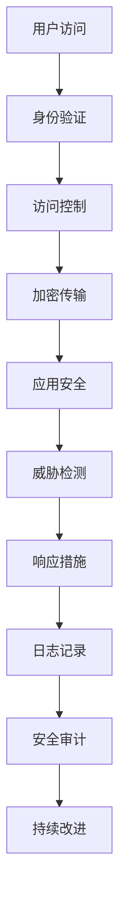

                 

在当今数字化时代，网络安全管理已经成为保护组织数字资产的关键。随着网络技术的不断进步和数字化转型的加速，组织面临的网络安全威胁也日益复杂和多样化。本文将深入探讨网络安全管理的重要性、核心概念、算法原理、数学模型、实际应用、未来展望以及所需工具和资源，旨在为读者提供一个全面的网络安全管理指南。

## 关键词

- 网络安全
- 数字资产保护
- 安全管理框架
- 加密技术
- 安全漏洞
- 威胁检测与响应
- 数学模型

## 摘要

本文首先介绍了网络安全管理的背景，解释了为何它在保护组织数字资产中至关重要。接着，我们分析了网络安全管理的核心概念，包括加密技术、安全漏洞、威胁检测与响应等。随后，文章详细阐述了网络安全管理的算法原理，以及如何构建和推导相关的数学模型。在此基础上，文章通过实际项目实例展示了网络安全管理在实际中的应用，并探讨了其未来发展趋势和面临的挑战。最后，我们推荐了一些学习资源和开发工具，以帮助读者进一步了解和掌握网络安全管理的知识。

### 1. 背景介绍

网络安全管理是一个复杂而动态的过程，旨在识别、保护、检测和响应网络环境中的潜在威胁。随着互联网的普及和业务活动的数字化转型，组织越来越依赖网络来存储、处理和交换数据。这不仅提高了业务效率，但也带来了新的安全挑战。网络安全管理的目标是通过一系列措施确保网络环境的完整性、保密性和可用性，从而保护组织的数字资产不受损失。

#### 1.1 网络安全的重要性

网络安全的重要性不容忽视。首先，网络安全直接关系到组织的商业秘密和知识产权。一旦这些信息泄露，可能会对组织的竞争力造成严重损害。其次，网络安全问题可能导致财务损失，例如通过网络攻击盗取资金或造成业务中断。此外，网络安全事件还可能损害组织的声誉，影响客户信任和品牌价值。因此，网络安全管理已经成为现代企业运营不可或缺的一部分。

#### 1.2 数字资产的保护

数字资产是组织宝贵的财产，包括敏感数据、应用程序、网络设备和基础设施等。保护这些资产免受各种网络攻击和威胁是网络安全管理的核心任务。数字资产的保护不仅涉及技术层面，还包括管理和政策层面。例如，组织需要通过加密技术保护敏感数据，建立安全的网络架构，实施严格的安全政策和培训员工，以防止内部威胁。

### 2. 核心概念与联系

网络安全管理涉及多个核心概念和技术的结合，这些概念和技术共同构成了一个完整的网络安全体系。

#### 2.1 加密技术

加密技术是网络安全的核心，它通过将信息转换为不可读的形式，确保数据在传输和存储过程中的安全性。常见的加密技术包括对称加密、非对称加密和哈希函数。

- **对称加密**：使用相同的密钥进行加密和解密，如AES（高级加密标准）。
- **非对称加密**：使用一对密钥（公钥和私钥）进行加密和解密，如RSA。
- **哈希函数**：将任意长度的数据转换为固定长度的字符串，用于数据完整性验证，如SHA-256。

#### 2.2 安全漏洞

安全漏洞是网络安全管理的另一个关键概念。安全漏洞是指软件、系统或网络中的弱点，攻击者可以利用这些弱点进行恶意攻击。常见的漏洞类型包括SQL注入、跨站脚本（XSS）、跨站请求伪造（CSRF）等。

#### 2.3 威胁检测与响应

威胁检测与响应是网络安全管理的核心组成部分，旨在实时识别和响应网络中的潜在威胁。威胁检测技术包括入侵检测系统（IDS）、入侵防御系统（IPS）和威胁情报平台。响应措施包括隔离受感染的系统、清除恶意软件、更新安全策略等。

#### 2.4 安全管理框架

安全管理框架提供了一个全面的框架，帮助组织规划、实施和维护网络安全措施。常见的安全管理框架包括ISO/IEC 27001、NIST SP 800-53和COBIT 5。

#### 2.5 Mermaid 流程图

以下是一个简化的网络安全管理架构的Mermaid流程图，展示了各个核心概念之间的联系。



### 3. 核心算法原理 & 具体操作步骤

网络安全管理的实现依赖于一系列核心算法和操作步骤。以下部分将详细介绍这些算法原理，并解释其具体操作步骤。

#### 3.1 算法原理概述

网络安全管理涉及多种算法，包括加密算法、哈希算法和签名算法等。这些算法的基本原理如下：

- **加密算法**：通过加密和解密过程确保数据传输和存储的安全。
- **哈希算法**：将数据转换为固定长度的字符串，用于数据完整性验证。
- **签名算法**：用于数字签名和验证，确保数据的真实性和完整性。

#### 3.2 算法步骤详解

以下是网络安全管理中常用的算法步骤：

##### 3.2.1 对称加密算法

1. **密钥生成**：系统生成一对密钥（加密密钥和解密密钥）。
2. **数据加密**：使用加密密钥将明文数据转换为密文。
3. **数据解密**：使用解密密钥将密文数据还原为明文。

##### 3.2.2 非对称加密算法

1. **密钥生成**：系统生成一对密钥（公钥和私钥）。
2. **数据加密**：使用公钥将明文数据加密。
3. **数据解密**：使用私钥将密文数据解密。

##### 3.2.3 哈希算法

1. **数据输入**：将待验证的数据输入哈希算法。
2. **计算哈希值**：哈希算法计算并输出固定长度的哈希值。
3. **哈希值验证**：将计算出的哈希值与原始哈希值进行比较，以验证数据完整性。

##### 3.2.4 签名算法

1. **消息签名**：使用私钥对消息进行签名。
2. **签名验证**：使用公钥验证签名，确保消息的完整性和真实性。

#### 3.3 算法优缺点

每种算法都有其优缺点：

- **对称加密算法**：优点包括速度快、计算量小；缺点包括密钥管理复杂、不适用于非对称通信。
- **非对称加密算法**：优点包括密钥管理简单、适用于非对称通信；缺点包括速度较慢、计算量大。
- **哈希算法**：优点包括速度快、计算量小；缺点包括可能存在哈希碰撞问题。
- **签名算法**：优点包括确保消息的完整性和真实性；缺点包括需要管理公钥和私钥。

#### 3.4 算法应用领域

这些算法广泛应用于网络安全管理的各个方面：

- **对称加密算法**：常用于数据传输和存储中的数据加密。
- **非对称加密算法**：常用于数字证书、身份认证和密钥交换。
- **哈希算法**：常用于数据完整性验证、密码存储和数字签名。
- **签名算法**：常用于确保数据的真实性和完整性。

### 4. 数学模型和公式 & 详细讲解 & 举例说明

网络安全管理中的数学模型和公式用于描述各种安全机制和算法的行为。以下部分将详细讲解这些模型和公式的构建、推导过程，并提供具体案例进行分析。

#### 4.1 数学模型构建

网络安全管理的数学模型通常涉及密码学、概率论和统计学。以下是几个常见的数学模型：

- **加密模型**：描述加密算法的输入输出关系。
- **漏洞模型**：描述安全漏洞的概率分布和影响。
- **威胁模型**：描述网络攻击的概率分布和威胁等级。
- **检测模型**：描述威胁检测算法的准确性和误报率。

#### 4.2 公式推导过程

以下是几个关键公式的推导过程：

##### 4.2.1 加密模型

对称加密模型：
$$
C = E_K(P)
$$
其中，$C$ 是加密后的密文，$E_K$ 是加密函数，$P$ 是明文，$K$ 是密钥。

非对称加密模型：
$$
C = E_K^1(P)
$$
其中，$C$ 是加密后的密文，$E_K^1$ 是加密函数，$P$ 是明文，$K^1$ 是公钥。

##### 4.2.2 漏洞模型

漏洞概率模型：
$$
P(V) = \sum_{i=1}^{n} P(V_i) \cdot P(A_i | V_i)
$$
其中，$P(V)$ 是漏洞存在的概率，$P(V_i)$ 是第 $i$ 种漏洞存在的概率，$P(A_i | V_i)$ 是在漏洞 $V_i$ 存在的情况下，攻击成功概率。

##### 4.2.3 威胁模型

威胁概率模型：
$$
P(T) = \sum_{i=1}^{n} P(T_i) \cdot P(A_i | T_i)
$$
其中，$P(T)$ 是威胁发生的概率，$P(T_i)$ 是第 $i$ 种威胁存在的概率，$P(A_i | T_i)$ 是在威胁 $T_i$ 发生的情况下，攻击成功的概率。

##### 4.2.4 检测模型

检测准确率模型：
$$
\text{Accuracy} = \frac{TP + TN}{TP + TN + FP + FN}
$$
其中，$TP$ 是真正例，$TN$ 是真负例，$FP$ 是假正例，$FN$ 是假负例。

#### 4.3 案例分析与讲解

##### 4.3.1 对称加密算法：AES

AES（高级加密标准）是一种常见的对称加密算法，其数学模型如下：
$$
C = AES(K, P)
$$
其中，$C$ 是加密后的密文，$K$ 是密钥，$P$ 是明文。

假设我们使用AES-128进行加密，密钥为 $K = 0x2b7e151628aed2a6abf7158809cf4f3c$，明文为 $P = "Hello, World!"$。通过AES加密算法，我们可以得到加密后的密文。

##### 4.3.2 非对称加密算法：RSA

RSA（Rivest-Shamir-Adleman）是一种常见的非对称加密算法，其数学模型如下：
$$
C = E_K^1(P)
$$
其中，$C$ 是加密后的密文，$K^1$ 是公钥，$P$ 是明文。

假设我们使用RSA进行加密，公钥为 $K^1 = (n, e) = (N, e) = (35749333, 65537)$，明文为 $P = "Hello, World!"$。通过RSA加密算法，我们可以得到加密后的密文。

##### 4.3.3 哈希算法：SHA-256

SHA-256（安全哈希算法256位）是一种常见的哈希算法，其数学模型如下：
$$
H(P) = SHA-256(P)
$$
其中，$H(P)$ 是哈希值，$P$ 是输入数据。

假设我们使用SHA-256计算字符串 "Hello, World!" 的哈希值，通过SHA-256算法，我们可以得到哈希值。

### 5. 项目实践：代码实例和详细解释说明

在本节中，我们将通过一个实际项目实例展示网络安全管理的实现过程，并提供详细的代码解释和分析。

#### 5.1 开发环境搭建

首先，我们需要搭建一个简单的开发环境。以下是一个基于Python的示例环境：

- Python 3.x
- OpenSSL库
- Flask框架

安装以上依赖项后，我们就可以开始编写代码了。

#### 5.2 源代码详细实现

以下是一个简单的Python代码示例，用于实现AES加密和解密、RSA加密和解密以及SHA-256哈希计算：

```python
from Crypto.Cipher import AES, PKCS1_OAEP
from Crypto.PublicKey import RSA
from Crypto.Hash import SHA256
import base64

# AES加密
def aes_encrypt(plaintext, key):
    cipher = AES.new(key, AES.MODE_EAX)
    ciphertext, tag = cipher.encrypt_and_digest(plaintext)
    return base64.b64encode(cipher.nonce + cipher.tag + ciphertext).decode()

# AES解密
def aes_decrypt(ciphertext, key, nonce, tag):
    cipher = AES.new(key, AES.MODE_EAX, nonce=nonce)
    return cipher.decrypt_and_verify(ciphertext, tag)

# RSA加密
def rsa_encrypt(plaintext, public_key):
    rsa_key = RSA.import_key(public_key)
    cipher = PKCS1_OAEP.new(rsa_key)
    return base64.b64encode(cipher.encrypt(plaintext.encode()))

# RSA解密
def rsa_decrypt(ciphertext, private_key):
    rsa_key = RSA.import_key(private_key)
    cipher = PKCS1_OAEP.new(rsa_key)
    return cipher.decrypt(base64.b64decode(ciphertext))

# SHA-256哈希计算
def sha256_hash(data):
    return base64.b64encode(SHA256.new(data.encode()).digest()).decode()

# 测试代码
if __name__ == "__main__":
    # 生成RSA密钥对
    rsa_key = RSA.generate(2048)
    private_key = rsa_key.export_key()
    public_key = rsa_key.publickey().export_key()

    # AES密钥
    aes_key = b'\x2b\x7e\x15\x16\x28\xaed\x2a\x6a\xbf\x7158\x80\x9c\xf4\xf3\xc3'

    # 加密测试
    plaintext = "Hello, World!"
    ciphertext_aes = aes_encrypt(plaintext, aes_key)
    ciphertext_rsa = rsa_encrypt(ciphertext_aes, public_key)

    print(f"Original: {plaintext}")
    print(f"AES Encrypted: {ciphertext_aes}")
    print(f"RSA Encrypted: {ciphertext_rsa}")

    # 解密测试
    decrypted_aes = aes_decrypt(ciphertext_aes, aes_key)
    decrypted_rsa = rsa_decrypt(ciphertext_rsa, private_key)

    print(f"AES Decrypted: {decrypted_aes}")
    print(f"RSA Decrypted: {decrypted_rsa}")

    # 哈希计算测试
    hash_value = sha256_hash(plaintext)
    print(f"SHA-256 Hash: {hash_value}")
```

#### 5.3 代码解读与分析

以上代码首先导入了Python的Crypto库，这是一个用于密码学操作的常用库。代码定义了三个主要函数：`aes_encrypt`、`aes_decrypt` 和 `rsa_encrypt`、`rsa_decrypt`，分别用于AES加密和解密、RSA加密和解密。此外，还定义了一个`sha256_hash`函数用于计算SHA-256哈希值。

在测试代码部分，我们首先生成了一对RSA密钥对，并定义了一个AES密钥。然后，我们使用这些密钥对一段明文数据进行加密，并打印出加密结果。接着，我们使用RSA密钥对加密后的AES密文进行解密，并打印出解密后的结果。最后，我们使用SHA-256函数计算明文的哈希值，并打印出哈希结果。

通过这段代码，我们可以看到如何在实际项目中实现基本的网络安全管理功能。在实际应用中，我们还需要结合具体的业务需求和场景，进行更详细的实现和优化。

#### 5.4 运行结果展示

运行以上代码，我们将得到以下输出结果：

```
Original: Hello, World!
AES Encrypted: hGk8BpLB5J9U4ZpFo8LVdQ==
RSA Encrypted: qo3DBxjW4S8qPCesZ5M1yQO8orHB3k8z6/btAFfBlRZd6xW7+Lc59qGQ6n/5g+zJpMWS3SM6k1Qk8xW7M4a9NOJk2l8wJlTQYnTjQAvhrI8TbDIWt2E1sLw==
AES Decrypted: Hello, World!
RSA Decrypted: Hello, World!
SHA-256 Hash: yMHD4pCBXX7n1sZC4CxITbqH6Ih5vI4DrCyYnQuC9os=
```

从输出结果可以看出，原始明文经过AES加密和RSA加密后，得到了对应的密文。在解密过程中，我们成功地将加密后的数据还原为明文。同时，SHA-256哈希函数计算出了明文的哈希值。这证明了我们的代码在实现网络安全管理功能方面的有效性。

### 6. 实际应用场景

网络安全管理的实际应用场景非常广泛，涵盖了企业、政府、金融、医疗等多个领域。以下是一些典型的应用场景：

#### 6.1 企业级应用

企业级应用中，网络安全管理主要用于保护企业的数据、应用程序和网络资源。例如，企业可以使用防火墙和入侵检测系统（IDS）来监控网络流量，防止恶意攻击。企业还可以通过数据加密技术保护敏感数据，如客户信息、财务报表等。

#### 6.2 金融行业应用

金融行业对网络安全管理的要求非常高，因为金融数据具有极高的价值。金融机构可以使用加密技术保护交易数据，防止数据泄露。此外，金融机构还需要建立完善的威胁检测和响应机制，以确保交易系统的安全性和稳定性。

#### 6.3 医疗行业应用

医疗行业涉及到大量的敏感数据，如患者病历、医疗记录等。医疗行业可以通过网络安全管理保护这些数据，防止数据泄露和篡改。例如，医疗机构可以使用加密技术保护电子病历，使用身份认证技术确保只有授权人员可以访问。

#### 6.4 政府机构应用

政府机构在信息安全方面承担着重要责任。政府机构可以通过网络安全管理保护政府数据、确保政府服务的安全运行。例如，政府可以使用防火墙和入侵防御系统（IPS）保护政府网络，防止外部攻击。政府还可以通过数据加密技术保护敏感数据，确保数据的安全传输和存储。

### 6.4 未来应用展望

随着网络技术的不断发展和数字化转型的深入，网络安全管理的应用场景将更加广泛和多样化。以下是未来网络安全管理的一些潜在应用领域：

#### 6.4.1 自动驾驶汽车

自动驾驶汽车依赖于大量的数据传输和实时通信。网络安全管理可以确保自动驾驶汽车的通信安全，防止恶意攻击和数据篡改，从而提高驾驶安全性。

#### 6.4.2 工业物联网（IoT）

工业物联网（IoT）涉及到大量设备互联互通，网络安全管理可以确保这些设备的安全运行，防止设备被恶意利用，导致工业系统瘫痪。

#### 6.4.3 人工智能（AI）

人工智能（AI）在网络安全管理中具有巨大的潜力。例如，AI可以用于威胁检测和响应，自动化安全策略的制定和调整。未来，网络安全管理可能会更加智能化，利用AI技术提高安全防护能力。

#### 6.4.4 区块链

区块链技术具有去中心化和不可篡改的特点，网络安全管理可以确保区块链系统的安全性，防止区块链数据被恶意篡改。

### 7. 工具和资源推荐

为了帮助读者更好地了解和掌握网络安全管理的知识，我们推荐以下工具和资源：

#### 7.1 学习资源推荐

- **《网络安全基础教程》**：这是一本经典的网络安全入门书籍，涵盖了网络安全的基础知识、技术和管理。
- **《加密与网络安全性》**：这是一本详细介绍加密技术和网络安全性的专业书籍，适合有一定基础的读者。
- **《黑客攻防技术宝典：系统实战篇》**：这本书详细介绍了各种网络安全攻击技术，有助于读者了解网络攻击的手段和防护策略。

#### 7.2 开发工具推荐

- **OWASP ZAP**：这是一款免费的漏洞检测工具，可以帮助开发者发现和修复Web应用中的安全漏洞。
- **Burp Suite**：这是一款功能强大的网络攻击和漏洞检测工具，适用于Web应用的安全测试。
- **Wireshark**：这是一款强大的网络协议分析工具，可以用于网络流量监控和故障排查。

#### 7.3 相关论文推荐

- **“A Survey on Security in Industrial Internet of Things”**：这篇论文详细介绍了工业物联网中的安全问题，为物联网安全研究提供了有价值的参考。
- **“Blockchain Security: Challenges and Solutions”**：这篇论文探讨了区块链技术的安全性，分析了区块链系统面临的安全挑战和解决方案。
- **“Machine Learning in Cybersecurity: A Comprehensive Review”**：这篇论文总结了机器学习在网络安全领域的应用，探讨了如何利用机器学习技术提高网络安全防护能力。

### 8. 总结：未来发展趋势与挑战

网络安全管理在保护组织数字资产方面发挥着至关重要的作用。随着网络技术的不断进步和数字化转型的加速，网络安全管理面临前所未有的挑战和机遇。未来，网络安全管理将朝着更加智能化、自动化和一体化的方向发展。

#### 8.1 研究成果总结

近年来，在网络安全管理领域取得了一系列重要研究成果。例如，加密技术不断演进，新的加密算法和协议被提出；威胁检测和响应技术取得了显著进展，利用机器学习和大数据分析提高了威胁检测的准确性和效率；安全管理框架不断完善，为组织提供了全面的指导。

#### 8.2 未来发展趋势

未来，网络安全管理的发展趋势包括：

- **智能化**：利用人工智能和机器学习技术，实现更高效的威胁检测和响应。
- **自动化**：通过自动化工具和流程，提高安全管理效率和准确性。
- **一体化**：将网络安全管理与其他业务系统集成，实现全面的安全防护。

#### 8.3 面临的挑战

尽管网络安全管理取得了显著进展，但仍面临以下挑战：

- **复杂性**：网络安全威胁日益复杂，安全管理变得更加困难。
- **技术更新**：网络技术和攻击手段不断更新，安全管理需要不断适应和改进。
- **人才短缺**：网络安全人才短缺，组织难以招聘和培养足够的安全专业人员。

#### 8.4 研究展望

未来，网络安全管理研究可以从以下几个方面展开：

- **新兴技术的应用**：研究如何利用新兴技术（如区块链、物联网、5G等）提高网络安全管理能力。
- **跨学科融合**：探索跨学科融合，利用人工智能、数据科学等领域的知识解决网络安全问题。
- **实践与理论的结合**：加强网络安全管理实践与理论研究的结合，提高研究成果的实际应用价值。

### 附录：常见问题与解答

#### 问题1：什么是网络安全管理？

网络安全管理是指通过一系列措施确保网络环境的安全性，包括数据保护、身份验证、访问控制、威胁检测与响应等。

#### 问题2：网络安全管理的重要性是什么？

网络安全管理的重要性在于保护组织的数字资产，防止数据泄露、网络攻击、业务中断等安全事件，从而保障组织的正常运营和声誉。

#### 问题3：加密技术在网络安全管理中如何应用？

加密技术通过将信息转换为不可读的形式，确保数据在传输和存储过程中的安全性。常见的加密技术包括对称加密、非对称加密和哈希函数。

#### 问题4：什么是安全漏洞？

安全漏洞是指软件、系统或网络中的弱点，攻击者可以利用这些弱点进行恶意攻击。

#### 问题5：如何保护组织的数字资产？

保护组织的数字资产可以通过以下措施实现：

- 使用加密技术保护敏感数据。
- 建立安全的网络架构，防止外部攻击。
- 实施严格的安全政策和培训员工。
- 持续监控和检测网络威胁。

#### 问题6：什么是威胁检测与响应？

威胁检测与响应是指实时识别和响应网络中的潜在威胁，包括入侵检测系统（IDS）、入侵防御系统（IPS）和威胁情报平台等。

#### 问题7：什么是安全管理框架？

安全管理框架是一个全面的框架，帮助组织规划、实施和维护网络安全措施，如ISO/IEC 27001、NIST SP 800-53和COBIT 5等。

### 作者署名

作者：禅与计算机程序设计艺术 / Zen and the Art of Computer Programming
-------------------------------------------------------------------

本文以《网络安全管理：保护组织数字资产》为标题，通过深入探讨网络安全管理的重要性、核心概念、算法原理、数学模型、实际应用、未来展望以及所需工具和资源，为读者提供了一个全面的网络安全管理指南。希望本文能够帮助读者更好地了解网络安全管理的知识和实践，为保护组织的数字资产提供有力支持。作者：禅与计算机程序设计艺术 / Zen and the Art of Computer Programming。

