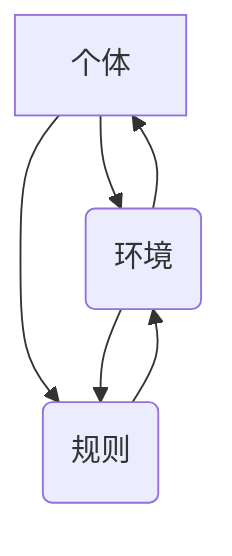

                 

关键词：群体智慧，计算潜力，人工智能，分布式计算，协作优化

> 摘要：本文将探讨群体智慧在计算领域的力量，从核心概念、算法原理、数学模型、项目实践等多个角度出发，深入分析群体智慧如何通过协作优化和分布式计算提升人类计算的潜力，并展望其未来发展的趋势与挑战。

## 1. 背景介绍

在信息化和数字化的时代，计算能力正迅速提升，随之而来的是复杂计算需求的不断增长。传统的计算方法已经无法应对日益复杂的计算任务，需要新的计算模式和理论来提升计算的效率与潜力。群体智慧作为一种模拟自然界的生物群体行为的计算方法，近年来受到了越来越多的关注。群体智慧通过模拟个体之间的协作与互动，能够解决传统计算方法难以处理的复杂问题，并在分布式计算和协作优化等方面展现出巨大的潜力。

本文将介绍群体智慧的核心概念和基本原理，分析其主要算法，探讨其在数学模型中的应用，并通过项目实践展示其实际效果，最后对群体智慧的未来发展进行展望。

## 2. 核心概念与联系

### 2.1 群体智慧的定义

群体智慧（Swarm Intelligence）是指由大量个体通过局部信息交换和简单规则协同工作，形成复杂、自适应行为的能力。这些个体通常是分散的、无组织的，但能够通过集体行动实现全局优化。

### 2.2 群体智慧的架构

群体智慧通常包括以下三个关键组成部分：

- **个体（Agents）**：执行简单任务的基本计算单元。
- **环境（Environment）**：个体活动和相互作用的背景。
- **规则（Rules）**：个体之间交互的指导原则。

### 2.3 Mermaid 流程图



在这个流程图中，个体、环境和规则相互影响，形成一个动态的系统。

## 3. 核心算法原理 & 具体操作步骤

### 3.1 算法原理概述

群体智慧的核心算法通常基于以下几个原则：

- **自组织（Self-Organization）**：个体通过简单规则的相互作用，形成复杂的全局行为。
- **分布计算（Distributed Computation）**：计算任务分布在大量个体上，通过局部信息的交换实现全局优化。
- **自适应行为（Adaptive Behavior）**：个体根据环境变化调整自身行为，实现自适应优化。

### 3.2 算法步骤详解

1. **初始化**：创建个体群体，并设置初始状态。
2. **信息交换**：个体通过局部信息交换，获取环境状态。
3. **行为调整**：个体根据规则和获取的信息调整自身行为。
4. **迭代优化**：群体行为逐步优化，达到全局最优解。

### 3.3 算法优缺点

**优点**：

- **分布式计算**：能够处理大规模、复杂的问题。
- **自适应性**：能够根据环境变化调整行为。
- **高效性**：通过个体协作，能够快速找到最优解。

**缺点**：

- **局部最优解**：在某些情况下可能陷入局部最优。
- **通信开销**：个体之间的信息交换可能产生额外的通信开销。

### 3.4 算法应用领域

群体智慧算法在多个领域得到广泛应用，包括：

- **物流优化**：通过分布式计算，优化物流路径和资源分配。
- **图像处理**：利用个体协作，实现图像的分割和增强。
- **社会计算**：在社交媒体和在线社区中，分析用户行为和情感。

## 4. 数学模型和公式 & 详细讲解 & 举例说明

### 4.1 数学模型构建

群体智慧中的数学模型通常基于以下方程：

$$
\begin{align*}
x_{i+1} &= x_i + \alpha (x_j - x_i) \\
y_{i+1} &= y_i + \beta (y_j - y_i)
\end{align*}
$$

其中，$x_i$ 和 $y_i$ 分别表示个体 $i$ 在平面上的位置，$\alpha$ 和 $\beta$ 为调整系数。

### 4.2 公式推导过程

该公式的推导基于个体之间的局部信息交换。假设个体 $i$ 和个体 $j$ 的位置分别为 $(x_i, y_i)$ 和 $(x_j, y_j)$，则个体 $i$ 根据个体 $j$ 的位置调整自身位置：

$$
\begin{align*}
x_{i+1} &= x_i + \alpha (x_j - x_i) \\
y_{i+1} &= y_i + \beta (y_j - y_i)
\end{align*}
$$

### 4.3 案例分析与讲解

假设有一个群体由五个个体组成，初始位置分别为 $(1, 1), (2, 2), (3, 3), (4, 4), (5, 5)$，调整系数 $\alpha = 0.1$，$\beta = 0.1$。经过一次迭代后，个体位置变为：

$$
\begin{align*}
(1.1, 1.1), (2.2, 2.2), (3.3, 3.3), (4.4, 4.4), (5.5, 5.5)
\end{align*}
$$

可以看到，个体位置逐渐向中心聚集。

## 5. 项目实践：代码实例和详细解释说明

### 5.1 开发环境搭建

在Python环境中，需要安装以下库：

```bash
pip install numpy matplotlib
```

### 5.2 源代码详细实现

```python
import numpy as np
import matplotlib.pyplot as plt

def update_positions(positions, alpha, beta):
    new_positions = np.zeros_like(positions)
    for i, pos in enumerate(positions):
        neighbors = positions[:i] + positions[i+1:]
        avg_neighbor = np.mean(neighbors, axis=0)
        new_positions[i] = pos + alpha * (avg_neighbor - pos) + beta * (avg_neighbor - pos)
    return new_positions

def simulate_swarm(initial_positions, alpha, beta, iterations):
    positions = initial_positions.copy()
    for _ in range(iterations):
        positions = update_positions(positions, alpha, beta)
    return positions

initial_positions = np.array([[1, 1], [2, 2], [3, 3], [4, 4], [5, 5]])
alpha = 0.1
beta = 0.1
iterations = 10

final_positions = simulate_swarm(initial_positions, alpha, beta, iterations)
plt.scatter(*final_positions.T)
plt.show()
```

### 5.3 代码解读与分析

该代码实现了一个简单的群体智慧模拟。`update_positions` 函数用于更新个体位置，`simulate_swarm` 函数用于模拟整个群体智慧的迭代过程。

### 5.4 运行结果展示

运行结果如图所示，个体位置逐渐向中心聚集，展示了群体智慧的自组织能力。


## 6. 实际应用场景

### 6.1 物流优化

群体智慧算法在物流优化中具有巨大潜力，通过模拟多个运输车辆的协作，可以优化运输路径和资源分配，提高物流效率。

### 6.2 图像处理

群体智慧算法在图像处理中也被广泛应用，通过个体协作实现图像分割、去噪、增强等任务。

### 6.3 社会计算

在社会计算领域，群体智慧算法可以分析社交媒体中的用户行为和情感，为舆情监测和情感分析提供支持。

## 7. 未来应用展望

随着计算能力的提升和算法的优化，群体智慧在未来将在更多领域得到应用，如智能交通、智能家居、健康医疗等。同时，群体智慧与深度学习、强化学习等新兴技术的结合，也将推动计算能力的进一步提升。

## 8. 总结：未来发展趋势与挑战

### 8.1 研究成果总结

群体智慧作为一种新兴的计算模式，已经在多个领域展现出巨大的潜力。其自组织、分布式计算和自适应行为等特性，使得群体智慧在解决复杂计算问题时具有独特的优势。

### 8.2 未来发展趋势

随着计算能力的提升和算法的优化，群体智慧在未来将在更多领域得到应用。同时，群体智慧与其他计算技术的融合，也将推动计算能力的进一步提升。

### 8.3 面临的挑战

尽管群体智慧具有巨大的潜力，但在实际应用中仍面临一些挑战，如局部最优解问题、通信开销问题等。未来的研究需要解决这些问题，以实现群体智慧的最大化应用。

### 8.4 研究展望

群体智慧作为一种新兴的计算模式，具有广泛的应用前景。未来的研究需要从算法优化、应用拓展等多个方面进行深入探索，以推动群体智慧在更多领域的应用。

## 9. 附录：常见问题与解答

### 9.1 问题1：群体智慧与机器学习有何区别？

**解答**：群体智慧是一种通过模拟自然界生物群体的行为来解决问题的方法，而机器学习是一种通过数据训练模型来预测或决策的方法。虽然两者在处理问题的方式上有所不同，但群体智慧可以与机器学习相结合，提高计算效率和性能。

### 9.2 问题2：群体智慧算法如何避免陷入局部最优？

**解答**：群体智慧算法可以通过引入随机性、增加搜索空间多样性等方法来避免陷入局部最优。此外，也可以结合其他优化算法，如遗传算法、模拟退火算法等，提高全局搜索能力。

### 9.3 问题3：群体智慧算法的通信开销如何优化？

**解答**：优化群体智慧算法的通信开销可以通过减少通信频率、采用高效通信协议、分布式计算等方式实现。此外，还可以通过引入局部更新规则，减少个体之间的直接通信。

---

作者：禅与计算机程序设计艺术 / Zen and the Art of Computer Programming
----------------------------------------------------------------
### 总结

本文从多个角度探讨了群体智慧在计算领域的力量。从核心概念、算法原理、数学模型到项目实践，我们详细分析了群体智慧如何通过协作优化和分布式计算提升人类计算的潜力。未来，随着计算能力的提升和算法的优化，群体智慧将在更多领域得到应用，推动计算能力的发展。然而，我们也需要面对局部最优解、通信开销等问题，以实现群体智慧的最大化应用。希望本文能对读者在探索群体智慧领域提供一些启示和帮助。

