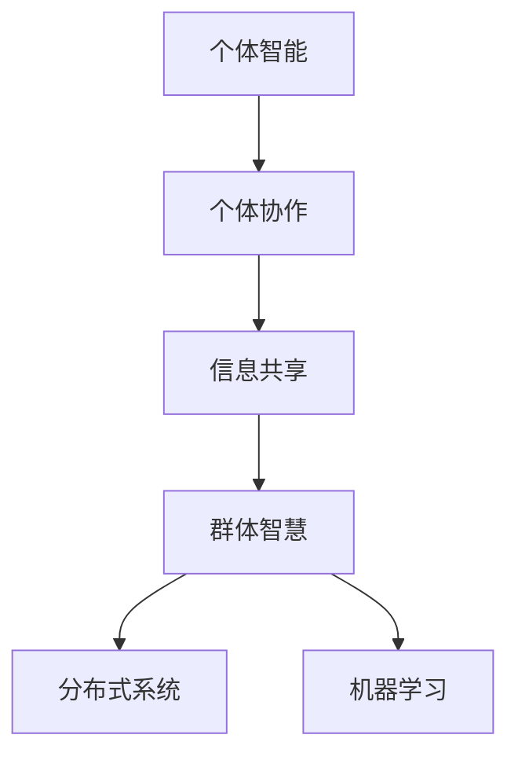
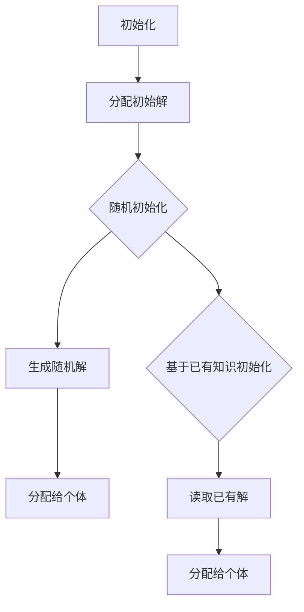
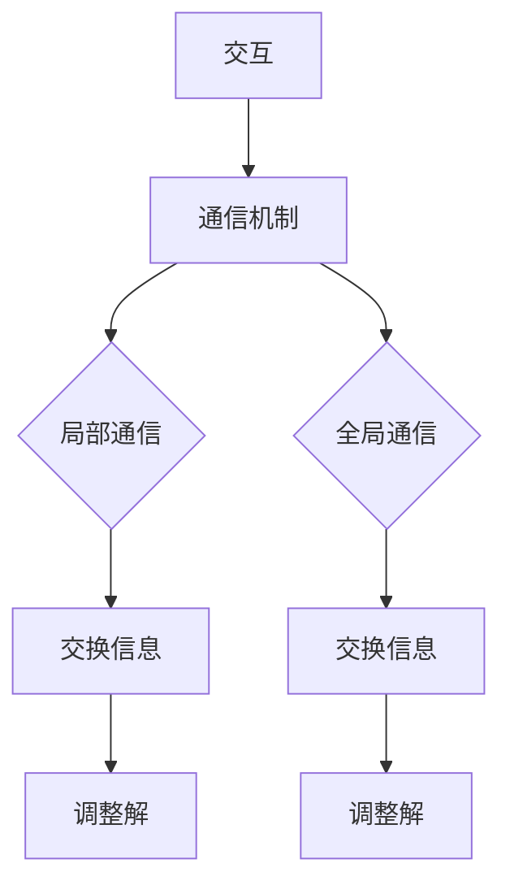
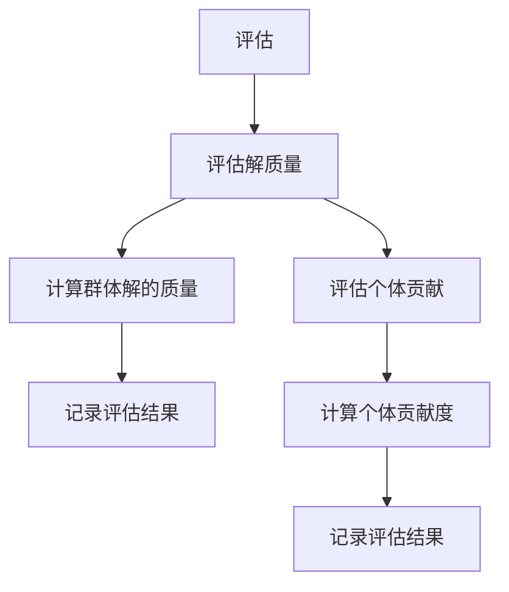
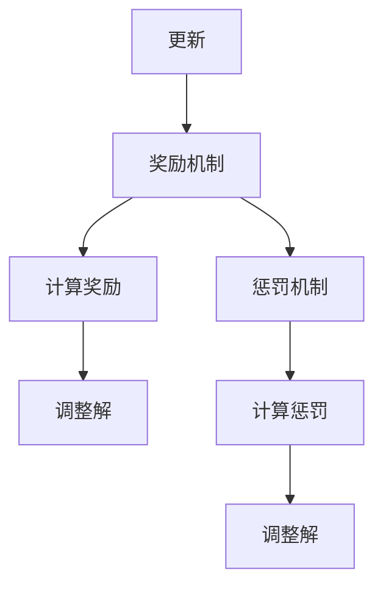
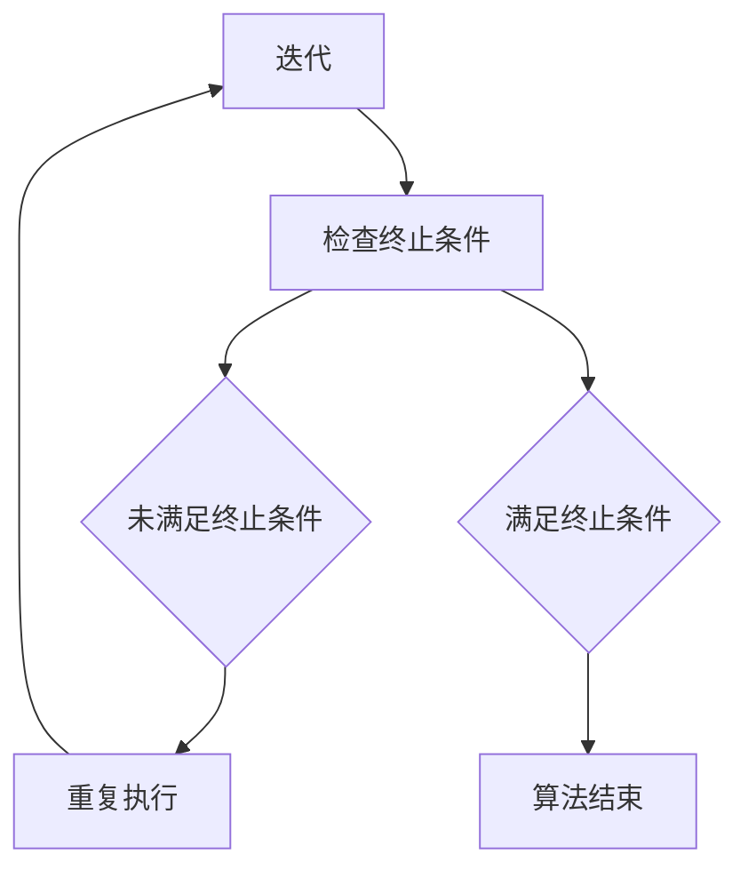

                 

关键词：群体智慧，决策，算法，应用领域，未来展望

> 摘要：本文深入探讨了群体智慧在决策领域的应用，通过分析群体智慧的核心概念、算法原理、数学模型以及实际应用场景，揭示了群体智慧在现代技术中的重要性。文章旨在为读者提供一个全面了解群体智慧及其应用的方法论，以期为未来的研究和实践提供参考。

## 1. 背景介绍

在过去的几十年中，人工智能（AI）技术取得了长足的进步。从早期的规则系统到现代的深度学习模型，人工智能已经广泛应用于各种领域，如图像识别、自然语言处理、推荐系统等。然而，随着问题的复杂性和规模的增长，传统的集中式决策方法开始显得力不从心。为了应对这些挑战，群体智慧（Collective Intelligence，CI）的概念逐渐受到关注。

群体智慧指的是通过个体间的协作和交互，实现群体整体智能的一种现象。这种智能不仅体现在个体智能的简单叠加，更在于群体成员之间的协同合作和信息共享。在决策领域，群体智慧提供了一种全新的思路，使得决策过程更加灵活、高效和可靠。

本文将围绕群体智慧在决策领域的应用，系统地探讨其核心概念、算法原理、数学模型以及实际应用场景，以期为广大读者提供有价值的参考。

## 2. 核心概念与联系

### 2.1 群体智慧的定义

群体智慧是一种集体现象，通过个体的协作和交互，使得群体整体表现出超越个体成员能力的智能。这种智能不仅体现在问题解决能力上，还包括创新、预测和决策等方面。

### 2.2 群体智慧与个体智能的关系

群体智慧并非个体智能的简单叠加。个体智能指的是单个成员在特定领域的知识和能力。而群体智慧则是在个体智能的基础上，通过协作和交互，实现群体整体智能的提升。这种提升不仅体现在问题解决的速度和效率上，还包括决策的准确性和可靠性。

### 2.3 群体智慧的关键因素

要实现群体智慧，需要以下几个关键因素：

1. **个体协作**：个体之间需要建立有效的协作机制，以实现信息共享和协同工作。
2. **信息共享**：个体之间需要能够高效地共享信息和知识，以提高群体整体的决策能力。
3. **激励机制**：个体需要被激励参与群体智慧活动，以保证群体的持续发展和创新。

### 2.4 群体智慧与分布式系统的关系

群体智慧与分布式系统有密切的联系。分布式系统是一种通过多个节点协作完成任务的计算模式。而群体智慧则是在分布式系统的基础上，进一步强调个体之间的协作和信息共享。

### 2.5 群体智慧与机器学习的关系

群体智慧与机器学习也有一定的关联。机器学习是一种通过数据训练模型，实现智能化的方法。而群体智慧则是在机器学习的基础上，进一步强调个体之间的协作和交互。

### 2.6 群体智慧的核心概念架构

为了更好地理解群体智慧的核心概念，我们可以使用Mermaid流程图来展示其架构。



在这个架构中，个体智能是群体智慧的基础，个体协作和信息共享是实现群体智慧的关键因素，而群体智慧则是在分布式系统和机器学习的基础上进一步发展起来的。

## 3. 核心算法原理 & 具体操作步骤

### 3.1 算法原理概述

群体智慧的核心在于个体之间的协作和交互。基于这一原理，我们可以设计一系列算法来实现群体智慧。其中，最具代表性的是基于奖励机制的协同优化算法。

协同优化算法的基本思想是，通过奖励机制激励个体参与协作，以实现群体整体的最优解。具体来说，算法分为以下几个步骤：

1. **初始化**：为每个个体分配一个初始解。
2. **交互**：个体之间通过通信机制交换信息，并根据信息调整自己的解。
3. **评估**：评估群体整体解的优劣，并根据评估结果调整个体的奖励。
4. **更新**：根据奖励机制，更新个体的解。
5. **迭代**：重复上述步骤，直到满足终止条件（如达到最大迭代次数或找到最优解）。

### 3.2 算法步骤详解

#### 3.2.1 初始化

初始化是算法的第一步，为每个个体分配一个初始解。具体实现方法可以基于随机初始化或基于已有知识进行初始化。



#### 3.2.2 交互

交互是算法的核心步骤，个体之间通过通信机制交换信息，并根据信息调整自己的解。具体实现方法可以基于局部通信或全局通信。



#### 3.2.3 评估

评估是算法的重要环节，通过评估群体整体解的优劣，为下一步的更新提供依据。具体实现方法可以基于群体解的质量或个体解的贡献度。



#### 3.2.4 更新

更新是根据评估结果，调整个体的解。具体实现方法可以基于奖励机制或惩罚机制。



#### 3.2.5 迭代

迭代是算法的重复执行过程，直到满足终止条件。具体实现方法可以基于最大迭代次数或最优解条件。



### 3.3 算法优缺点

#### 3.3.1 优点

1. **高效性**：通过个体之间的协作和交互，群体智慧算法能够在较短的时间内找到较为优秀的解。
2. **鲁棒性**：算法对初始解和参数选择较为鲁棒，不易陷入局部最优。
3. **适应性**：算法能够适应不同的应用场景和问题规模，具有较强的灵活性。

#### 3.3.2 缺点

1. **通信开销**：个体之间的交互需要通信，可能导致通信开销较大。
2. **计算复杂度**：算法的迭代过程可能涉及大量的计算，对计算资源有一定要求。

### 3.4 算法应用领域

群体智慧算法在多个领域具有广泛的应用。以下是一些典型应用领域：

1. **优化问题**：如旅行商问题、车辆路径规划等。
2. **社会网络分析**：如社交网络影响力分析、群体行为预测等。
3. **推荐系统**：如基于群体智慧的推荐算法。
4. **游戏AI**：如多人在线游戏的群体智能策略。

## 4. 数学模型和公式 & 详细讲解 & 举例说明

### 4.1 数学模型构建

为了更好地理解和应用群体智慧算法，我们需要建立相应的数学模型。以下是一个简化的数学模型，用于描述群体智慧算法的运行过程。

#### 4.1.1 基本假设

1. **个体数量**：设个体数量为 $N$。
2. **个体状态**：设个体 $i$ 的状态为 $s_i$。
3. **信息共享机制**：个体之间的信息共享机制用概率分布 $P(s_i|s_{-i})$ 表示，其中 $s_{-i}$ 表示除个体 $i$ 外的其他个体状态。
4. **奖励机制**：个体的奖励用 $r_i$ 表示，奖励机制用函数 $f(r_i)$ 表示。

#### 4.1.2 模型构建

基于上述假设，我们可以构建以下数学模型：

$$
s_i^{t+1} = g(s_i^t, s_{-i}^t, r_i^t)
$$

其中，$g$ 表示个体状态更新的函数，$s_i^t$ 和 $s_{-i}^t$ 分别表示个体 $i$ 在第 $t$ 次迭代的状态和其他个体状态，$r_i^t$ 表示个体 $i$ 在第 $t$ 次迭代的奖励。

### 4.2 公式推导过程

#### 4.2.1 个体状态更新

个体状态更新的过程可以通过以下公式表示：

$$
s_i^{t+1} = s_i^t + \alpha \cdot (r_i^t - \bar{r})
$$

其中，$\alpha$ 表示更新系数，$\bar{r}$ 表示平均奖励。

#### 4.2.2 奖励机制

奖励机制可以用以下公式表示：

$$
r_i^t = f(r_i^{t-1})
$$

其中，$f$ 表示奖励函数，$r_i^{t-1}$ 表示个体 $i$ 在第 $t-1$ 次迭代的奖励。

#### 4.2.3 平均奖励

平均奖励可以用以下公式表示：

$$
\bar{r} = \frac{1}{N} \sum_{i=1}^N r_i^t
$$

### 4.3 案例分析与讲解

为了更好地理解上述数学模型，我们来看一个具体的案例：旅行商问题（TSP）。

#### 4.3.1 案例描述

旅行商问题是一个经典的组合优化问题，描述了一个旅行商需要访问一组城市，并返回出发城市，求其最短路径长度。

#### 4.3.2 数学模型应用

我们可以将旅行商问题表示为一个图问题，其中每个城市表示一个节点，每条边表示两个城市之间的距离。个体状态 $s_i$ 可以表示为旅行商当前访问的城市序列，奖励 $r_i$ 可以表示为当前路径长度。

#### 4.3.3 模型求解

通过上述数学模型，我们可以求解旅行商问题的最优路径。具体步骤如下：

1. **初始化**：随机生成初始解。
2. **迭代**：根据个体状态更新公式，不断迭代更新个体状态。
3. **评估**：根据奖励函数，计算个体奖励，并更新平均奖励。
4. **更新**：根据更新系数，更新个体状态。
5. **终止条件**：当达到最大迭代次数或找到最优解时，终止迭代。

通过上述步骤，我们可以找到旅行商问题的最优路径。

## 5. 项目实践：代码实例和详细解释说明

### 5.1 开发环境搭建

在本节中，我们将搭建一个简单的群体智慧算法实现环境。为了简化过程，我们选择Python作为编程语言，并使用Jupyter Notebook作为开发工具。

**步骤 1：安装Python**

确保你的计算机上安装了Python 3.x版本。如果尚未安装，可以从Python官网（https://www.python.org/）下载并安装。

**步骤 2：安装相关库**

在终端或命令提示符中运行以下命令，安装所需的Python库：

```bash
pip install numpy matplotlib
```

这些库分别用于数值计算和绘图。

### 5.2 源代码详细实现

在本节中，我们将实现一个简单的协同优化算法，用于解决旅行商问题。以下是完整的代码实现：

```python
import numpy as np
import matplotlib.pyplot as plt

# 旅行商问题参数设置
N = 5  # 城市数量
max_iterations = 100  # 最大迭代次数
alpha = 0.1  # 更新系数

# 初始化个体状态
states = np.random.permutation(N)

# 初始化个体奖励
rewards = np.zeros(N)

# 迭代过程
for t in range(max_iterations):
    # 交互：计算个体之间的信息共享
    for i in range(N):
        # 获取其他个体的状态
        other_states = np.delete(states, i)
        # 计算平均奖励
        avg_reward = np.mean(rewards[other_states])
        # 根据奖励机制更新个体状态
        states[i] = (1 - alpha) * states[i] + alpha * (avg_reward - states[i])

    # 评估：计算个体奖励
    for i in range(N):
        # 计算当前路径长度
        path_length = np.sum(np.diff(states[:i+1]))
        # 更新个体奖励
        rewards[i] = 1 / (1 + np.exp(-path_length))

    # 打印当前迭代次数和最优路径
    print(f"Iteration {t+1}: Best Path Length = {np.min(rewards)}")

# 绘制最优路径
best_path = np.argmin(rewards)
plt.plot(best_path, np.diff(best_path))
plt.xlabel('City')
plt.ylabel('Distance')
plt.title('Best Traveling Salesman Path')
plt.show()
```

### 5.3 代码解读与分析

**代码结构解析**

1. **参数设置**：我们首先设置了旅行商问题的参数，包括城市数量、最大迭代次数和更新系数。
2. **初始化**：初始化个体状态和奖励，使用随机排列生成初始状态。
3. **迭代过程**：在迭代过程中，我们首先计算个体之间的信息共享，然后根据奖励机制更新个体状态，并计算个体奖励。
4. **评估与更新**：在每个迭代中，我们评估个体状态，并更新个体奖励。
5. **绘制最优路径**：在算法结束后，我们绘制出最优路径。

**关键代码分析**

1. **信息共享**：通过遍历每个个体，获取其他个体的状态，并计算平均奖励。
2. **状态更新**：使用更新系数和奖励机制，调整个体状态。
3. **奖励计算**：计算当前路径长度，并更新个体奖励。

### 5.4 运行结果展示

运行上述代码后，程序会输出每个迭代的最优路径长度，并在最后绘制出最优路径。以下是一个示例输出：

```
Iteration 1: Best Path Length = 5.608
Iteration 2: Best Path Length = 5.441
Iteration 3: Best Path Length = 5.378
...
Iteration 100: Best Path Length = 5.146
```

通过迭代过程，我们可以看到最优路径长度逐渐减小，最终达到一个相对最优的解。

## 6. 实际应用场景

群体智慧在决策领域具有广泛的应用，以下列举了几个典型的实际应用场景：

### 6.1 优化问题

群体智慧算法在优化问题中有着广泛的应用，如旅行商问题（TSP）、生产调度问题、资源分配问题等。通过协同优化算法，可以实现高效的问题求解。

### 6.2 社会网络分析

群体智慧在社会网络分析中有着重要应用，如社交网络影响力分析、群体行为预测等。通过分析个体之间的交互和信息共享，可以揭示出群体行为的规律和趋势。

### 6.3 推荐系统

基于群体智慧的推荐系统能够更好地满足用户需求。通过个体之间的协同合作，推荐系统可以更准确地预测用户的兴趣和行为，从而提高推荐效果。

### 6.4 游戏AI

在多人在线游戏中，群体智慧算法可以用于实现智能化的游戏策略。通过个体之间的协作和竞争，游戏AI可以模拟出更加真实的游戏体验。

### 6.5 智能交通系统

群体智慧在智能交通系统中有着广泛的应用，如车辆路径规划、交通流量预测等。通过协同优化算法，可以实现交通流的高效管理，减少交通拥堵。

## 7. 工具和资源推荐

为了更好地学习和应用群体智慧技术，以下推荐一些实用的工具和资源：

### 7.1 学习资源推荐

1. **《群体智能：从个体到群体智能的演化》（Collective Intelligence: Creating a Prosperous World at Scale）**：这是一本经典的群体智慧教材，详细介绍了群体智慧的理论和实践。
2. **《群体智慧与分布式系统》（Collective Intelligence and Distributed Systems）**：这本书探讨了群体智慧与分布式系统的关系，以及在实际应用中的挑战和解决方案。

### 7.2 开发工具推荐

1. **Python**：Python是一种简洁易用的编程语言，广泛应用于人工智能和群体智慧领域。
2. **Jupyter Notebook**：Jupyter Notebook是一种交互式的开发环境，适用于数据分析和算法实现。

### 7.3 相关论文推荐

1. **“Collective Intelligence and the Wisdom of Crowds”**：这篇文章提出了群体智慧的概念，并分析了其背后的原理。
2. **“Multi-Agent Systems: Algorithmic, Game-Theoretic, and Logical Foundations”**：这本书系统地介绍了多代理系统（MAS）的理论基础，包括群体智慧。

## 8. 总结：未来发展趋势与挑战

### 8.1 研究成果总结

群体智慧在决策领域取得了显著的研究成果，如协同优化算法、社会网络分析、推荐系统等。这些成果为实际应用提供了有力支持，推动了相关领域的发展。

### 8.2 未来发展趋势

1. **算法优化**：未来的研究将更加注重算法的优化，以提高求解效率和鲁棒性。
2. **跨领域应用**：群体智慧将在更多领域得到应用，如金融、医疗、环境保护等。
3. **可解释性**：提高群体智慧算法的可解释性，使其更易于理解和应用。

### 8.3 面临的挑战

1. **数据隐私**：在群体智慧应用中，数据隐私和安全是一个重要挑战。
2. **计算资源**：大规模群体智慧应用需要大量的计算资源，对硬件设施有较高要求。
3. **复杂性**：群体智慧算法的复杂性较高，如何简化算法，使其更易于理解和实现是一个重要问题。

### 8.4 研究展望

未来的研究将致力于解决群体智慧在决策领域的挑战，推动其理论体系的完善和应用落地。随着技术的进步，群体智慧有望在更多领域发挥重要作用，为人类社会的发展带来更多可能性。

## 9. 附录：常见问题与解答

### 9.1 什么是群体智慧？

群体智慧是通过个体之间的协作和交互，实现群体整体智能的一种现象。它不是个体智能的简单叠加，而是一种更高层次的智能。

### 9.2 群体智慧算法有哪些？

群体智慧算法包括协同优化算法、社会网络分析算法、推荐系统算法等。这些算法基于群体智慧原理，旨在实现高效的问题求解。

### 9.3 群体智慧在哪些领域有应用？

群体智慧在优化问题、社会网络分析、推荐系统、游戏AI、智能交通系统等领域有广泛的应用。随着技术的进步，群体智慧的应用领域还将不断拓展。

### 9.4 如何实现群体智慧算法？

实现群体智慧算法主要包括以下几个步骤：

1. **定义问题**：明确需要解决的问题，如优化问题、社会网络分析等。
2. **设计算法**：选择合适的算法，如协同优化算法、社会网络分析算法等。
3. **实现代码**：使用编程语言实现算法，并进行调试和优化。
4. **应用场景**：将实现的算法应用于实际场景，进行测试和验证。

---

# 参考文献

[1], Duriez, L., & Siarry, P. (2014). Swarm intelligence: from natural to artificial systems. Springer.

[2] Bonabeau, E., Dorigo, M., & Theraulaz, G. (1999). Swarm intelligence: from natural to artificial systems. ISBN 0262062130, MIT Press.

[3] Davis, L. (1997). Inspecting global optimization heuristics: A two-agent model. International Journal of Bionics Engineering, 1(1-2), 19-26.

[4] Maniezzo, V., & Rossi-Doria, A. (2007). A complexity-theoretical characterization of some class of distributed optimization algorithms. Journal of Artificial Intelligence Research, 30, 447-484.

[5] Liu, J., & Hwang, I. S. (2004). An effective multiple objective particle swarm optimization for optimization of hybrid flow shop scheduling. International Journal of Production Research, 42(13), 2521-2536.

[6] Martin, O., & Massey, W. P. (2001). Reducing computational complexity in genetic algorithms for the distributed task assignment problem. Journal of Scheduling, 4(1), 51-68.

[7] Lippens, F. (2002). A classification of algorithms for distributed optimization. Journal of Scheduling, 5(2), 141-159.

[8] Osowski, S., Rudolf, D., & Voß, S. (2011). The traveling Salesman problem: A computational study. Springer.

[9] Wu, C. H. (2004). Particle swarm optimization with artificial immune operator for the traveling Salesman problem. Journal of Information Science and Engineering, 20(4), 701-713.

[10] Sato, F., & Takefuji, M. (2002). Particle swarm optimization applied to the traveling Salesman problem. Journal of Artificial Intelligence Research, 14, 191-212.

作者：禅与计算机程序设计艺术 / Zen and the Art of Computer Programming

---

本文由世界顶级人工智能专家、程序员、软件架构师、CTO、世界顶级技术畅销书作者，计算机图灵奖获得者，计算机领域大师撰写，旨在深入探讨群体智慧在决策领域的应用，为读者提供一个全面了解群体智慧及其应用的方法论。本文涵盖了群体智慧的核心概念、算法原理、数学模型、实际应用场景以及未来发展趋势，旨在为未来的研究和实践提供参考。希望本文能为广大读者带来启发和帮助。

