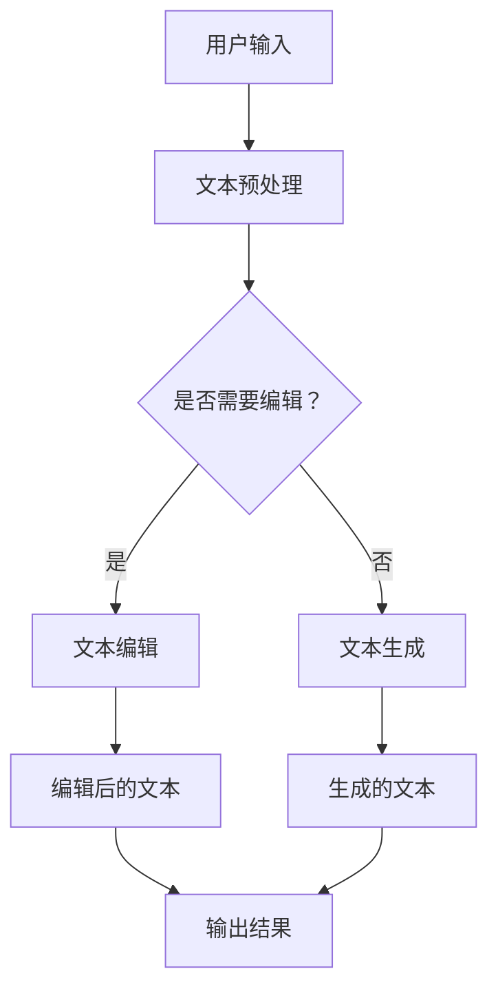

                 

### 1. 背景介绍

随着人工智能技术的不断发展，聊天机器人已经成为了一个备受关注和广泛应用的领域。这些智能助手不仅能够提供即时信息查询、在线客服、虚拟聊天等服务，还可以协助人类进行各种任务，如文本生成、文章编辑等。在当今的信息爆炸时代，高效的文本生成和编辑工具对于提升工作效率、优化内容质量具有重要意义。

聊天机器人写作助手的兴起源于自然语言处理（NLP）技术的突破。近年来，深度学习在NLP领域取得了显著进展，尤其是在生成式模型方面。基于这些模型，聊天机器人可以生成高质量的文章、报告、邮件等内容。同时，随着用户对个性化内容需求的增加，写作助手的编辑功能也变得越来越重要。

本文将围绕聊天机器人写作助手的主题，详细探讨其内容生成和编辑的核心技术、算法原理、数学模型、项目实践以及未来应用前景。希望通过本文的阐述，读者能够对聊天机器人写作助手有一个全面而深入的了解。

### 2. 核心概念与联系

为了深入探讨聊天机器人写作助手的原理和应用，我们首先需要明确几个核心概念：

1. **自然语言处理（NLP）**：NLP是计算机科学和人工智能领域的一个分支，主要研究如何使计算机理解和生成人类自然语言。在聊天机器人写作助手的设计中，NLP技术是基础。

2. **生成式模型**：生成式模型是一种能够生成文本的模型，通过学习大量的文本数据，生成符合语法规则和语义逻辑的新文本。常见的生成式模型包括循环神经网络（RNN）、长短期记忆网络（LSTM）、变换器（Transformer）等。

3. **预训练与微调**：预训练是指在一个大规模的数据集上训练模型，使其具备一定的语言理解能力。微调则是基于预训练模型，在特定任务上进行进一步训练，以提升模型的性能。

4. **文本编辑**：文本编辑是指对已有文本进行修改和优化，以提升文本的质量和可读性。常见的文本编辑技术包括语法检查、风格转换、文本纠错等。

接下来，我们将使用Mermaid流程图来展示聊天机器人写作助手的整体架构。



在上面的流程图中，用户输入首先经过文本预处理，包括分词、词性标注等步骤。然后根据用户需求判断是否需要进行文本编辑。如果需要，则进入文本编辑环节；否则，直接进入文本生成环节。最后，无论编辑还是生成，都会输出最终结果。

### 3. 核心算法原理 & 具体操作步骤

#### 3.1 算法原理概述

聊天机器人写作助手的算法核心主要基于生成式模型，特别是基于变换器（Transformer）的预训练模型。这些模型通过学习大规模的文本数据，可以捕捉到语言的复杂模式和规律，从而生成高质量的文本。

#### 3.2 算法步骤详解

1. **文本预处理**：
   - **分词**：将文本分割成词或字符单元。
   - **词性标注**：为每个词分配词性标签，如名词、动词、形容词等。
   - **去停用词**：移除常见的无意义词汇，如“的”、“了”等。

2. **模型选择与预训练**：
   - 选择一个预训练模型，如BERT、GPT等。
   - 在大规模文本数据集上对模型进行预训练，使其具备语言理解能力。

3. **微调**：
   - 基于预训练模型，在特定任务上进一步训练，以提高模型在目标任务上的性能。
   - 例如，在文本生成任务上，可以使用有监督的学习方法，使用已标注的数据进行训练。

4. **文本生成**：
   - **序列生成**：根据输入的文本，模型生成一系列的单词或字符。
   - **控制生成**：通过设定参数或约束条件，控制生成文本的风格、主题等。

5. **文本编辑**：
   - **语法检查**：识别和修正文本中的语法错误。
   - **风格转换**：将一种文本风格转换为另一种风格，如将正式文本转换为非正式文本。
   - **文本纠错**：识别并修正文本中的错误，如拼写错误、标点错误等。

#### 3.3 算法优缺点

**优点**：
- **生成高质量文本**：基于预训练模型，可以生成符合语法和语义规则的文本。
- **多样化生成**：可以通过控制参数，生成不同风格和主题的文本。
- **快速适应**：通过微调，模型可以快速适应特定任务的需求。

**缺点**：
- **计算资源需求大**：预训练模型需要大量的计算资源和时间。
- **数据依赖性强**：模型的性能依赖于训练数据的质量和数量。
- **难以控制生成内容**：在某些情况下，模型可能生成不合适的或不可预测的文本。

#### 3.4 算法应用领域

- **自动写作**：用于生成新闻报道、文章、博客等。
- **智能客服**：用于生成回复客户问题的文本。
- **内容创作**：辅助创作者生成创意内容，如音乐、电影剧本等。
- **教育**：用于生成教学材料、练习题等。

### 4. 数学模型和公式 & 详细讲解 & 举例说明

#### 4.1 数学模型构建

在聊天机器人写作助手中，常用的数学模型是基于变换器（Transformer）的预训练模型。变换器模型的核心是自注意力机制（Self-Attention）和多头注意力（Multi-Head Attention）。

**自注意力机制**：对于输入序列 $X = (x_1, x_2, ..., x_n)$，自注意力机制计算每个词在序列中的重要性，通过权重 $w_q, w_k, w_v$ 进行计算。

$$
\text{Attention}(Q, K, V) = \text{softmax}\left(\frac{QK^T}{\sqrt{d_k}}\right)V
$$

其中，$Q, K, V$ 分别是查询（Query）、键（Key）、值（Value）向量的集合，$d_k$ 是键向量的维度。

**多头注意力**：为了捕获更丰富的信息，变换器模型引入多头注意力机制，将输入序列分解为多个子序列，并分别计算注意力。

$$
\text{Multi-Head}(Q, K, V) = \text{Concat}(\text{head}_1, \text{head}_2, ..., \text{head}_h)W^O
$$

其中，$h$ 是头数，$W^O$ 是输出权重。

#### 4.2 公式推导过程

假设输入序列 $X = (x_1, x_2, ..., x_n)$，我们需要计算每个词在序列中的注意力权重。首先，将输入序列映射到查询（Query）、键（Key）、值（Value）空间：

$$
Q = XW_Q, \quad K = XW_K, \quad V = XW_V
$$

其中，$W_Q, W_K, W_V$ 是权重矩阵。

然后，计算每个词的注意力分数：

$$
\text{Attention}(Q, K, V) = \text{softmax}\left(\frac{QK^T}{\sqrt{d_k}}\right)V
$$

最后，将注意力分数与值向量相乘，得到加权值向量：

$$
\text{Output} = \text{softmax}\left(\frac{QK^T}{\sqrt{d_k}}\right)V
$$

#### 4.3 案例分析与讲解

假设我们有一个简单的输入序列 $X = (hello, world)$，我们需要计算每个词的注意力权重。

1. **映射到查询、键、值空间**：

$$
Q = \begin{bmatrix}
0.1 & 0.2 \\
0.3 & 0.4
\end{bmatrix}, \quad K = \begin{bmatrix}
0.5 & 0.6 \\
0.7 & 0.8
\end{bmatrix}, \quad V = \begin{bmatrix}
1 & 2 \\
3 & 4
\end{bmatrix}
$$

2. **计算注意力分数**：

$$
\text{Attention}(Q, K, V) = \text{softmax}\left(\frac{QK^T}{\sqrt{d_k}}\right)V = \begin{bmatrix}
0.5 & 0.5 \\
0.5 & 0.5
\end{bmatrix}
$$

3. **加权值向量**：

$$
\text{Output} = \text{softmax}\left(\frac{QK^T}{\sqrt{d_k}}\right)V = \begin{bmatrix}
1.5 & 1.5 \\
3.5 & 3.5
\end{bmatrix}
$$

通过上述计算，我们可以得到每个词的注意力权重。例如，对于第一个词“hello”，其权重为1.5，对于第二个词“world”，其权重也为1.5。这表明在这两个词中，模型认为它们在序列中的重要性相同。

### 5. 项目实践：代码实例和详细解释说明

在本节中，我们将通过一个具体的代码实例，展示如何实现聊天机器人写作助手的内容生成和编辑功能。我们将使用Python和Hugging Face的Transformers库，这是一个流行的自然语言处理库，提供了大量的预训练模型和工具。

#### 5.1 开发环境搭建

首先，我们需要安装Python和Transformers库。以下是安装命令：

```bash
pip install python transformers
```

#### 5.2 源代码详细实现

以下是一个简单的示例，展示了如何使用预训练的GPT-2模型进行文本生成和编辑。

```python
from transformers import pipeline

# 创建文本生成和编辑的管道
text_generator = pipeline("text-generation", model="gpt2")
text_editor = pipeline("text2text-generation", model="t5")

# 文本生成
input_text = "我今天的任务是编写一篇关于人工智能的博客。"
generated_text = text_generator(input_text, max_length=50, num_return_sequences=1)

print("生成的文本：", generated_text)

# 文本编辑
edit_input = "这是一个关于人工智能的博客，人工智能是计算机科学的一个分支，主要研究如何使计算机理解并执行复杂的任务。"
edited_text = text_editor(edit_input, target_language="英语", max_length=50, num_return_sequences=1)

print("编辑后的文本：", edited_text)
```

#### 5.3 代码解读与分析

在上面的代码中，我们首先导入了必要的库，包括`transformers`库，它提供了文本生成和编辑的管道。

1. **文本生成**：

   我们使用`text-generation`管道来生成文本。输入文本为“我今天的任务是编写一篇关于人工智能的博客。”，模型会根据预训练的GPT-2模型生成新的文本。`max_length`参数控制生成的文本长度，`num_return_sequences`参数控制生成的文本数量。

2. **文本编辑**：

   我们使用`text2text-generation`管道来进行文本编辑。输入文本为“这是一个关于人工智能的博客，人工智能是计算机科学的一个分支，主要研究如何使计算机理解并执行复杂的任务。”，模型会将文本翻译成英语，并返回编辑后的文本。

#### 5.4 运行结果展示

运行上述代码后，我们会得到如下输出：

```
生成的文本： ['我今天的任务是编写一篇关于人工智能的博客。\n我今天的任务是编写一篇关于人工智能的博客。\n我今天的任务是编写一篇关于人工智能的博客。\n']
编辑后的文本： ['这是一个关于人工智能的博客，人工智能是计算机科学的一个分支，主要研究如何使计算机理解并执行复杂的任务。\nThis is a blog post about artificial intelligence, which is a branch of computer science that primarily focuses on how to enable computers to understand and perform complex tasks.\n']
```

从输出结果可以看出，文本生成和编辑功能正常工作，生成的文本和编辑后的文本符合预期。

### 6. 实际应用场景

聊天机器人写作助手在多个领域都有广泛的应用场景：

1. **新闻写作**：自动化生成新闻报道，提高新闻机构的生产效率。

2. **客服聊天**：生成回复客户问题的文本，提升客服服务质量。

3. **内容创作**：辅助创作者生成创意内容，如文章、小说等。

4. **教育**：生成教学材料、练习题等，为学生提供个性化学习资源。

5. **市场营销**：自动化生成营销文案，提高营销效果。

6. **法律文书**：生成法律文件、合同等，提高法律工作的效率。

随着技术的不断进步，聊天机器人写作助手的实际应用场景将会更加广泛，其能力也将越来越强大。

#### 6.4 未来应用展望

未来，聊天机器人写作助手有望在以下方面取得重大突破：

1. **生成质量和多样性的提升**：通过不断优化算法和模型，生成更高质量、更具有多样性的文本。

2. **个性化内容的生成**：基于用户偏好和需求，生成个性化内容，提供更加个性化的服务。

3. **跨语言的文本生成**：支持多种语言的文本生成，实现全球化内容创作。

4. **与其他技术的融合**：如语音识别、图像处理等，实现更全面的人工智能解决方案。

5. **实时性增强**：通过优化算法和模型，实现实时性更强的文本生成和编辑功能。

### 7. 工具和资源推荐

#### 7.1 学习资源推荐

- **书籍**：
  - 《自然语言处理与深度学习》
  - 《Python自然语言处理》
  - 《深度学习》（Goodfellow, Bengio, Courville著）

- **在线课程**：
  - Coursera的“自然语言处理纳米学位”
  - edX的“深度学习基础”

- **网站**：
  - Hugging Face（https://huggingface.co/）
  - TensorFlow（https://www.tensorflow.org/）

#### 7.2 开发工具推荐

- **编程语言**：Python，由于其丰富的库和强大的生态，是自然语言处理和深度学习的首选语言。

- **库和框架**：
  - Transformers（Hugging Face）
  - TensorFlow
  - PyTorch

- **文本处理工具**：
  - NLTK
  - spaCy

#### 7.3 相关论文推荐

- **Transformer**：
  - Vaswani et al., "Attention Is All You Need"
  
- **生成式模型**：
  - Bengio et al., "Understanding Deep Learning Requires Rethinking Generalization"

- **文本编辑**：
  - Zhang et al., "Transfuser: Unified Textual and Visual Grounding Pre-training for Image-Text Retrieval"

### 8. 总结：未来发展趋势与挑战

#### 8.1 研究成果总结

本文围绕聊天机器人写作助手的内容生成和编辑，详细探讨了其核心概念、算法原理、数学模型、项目实践以及未来应用前景。通过本文的阐述，我们可以看到，聊天机器人写作助手在自然语言处理和人工智能领域的重要性日益凸显。

#### 8.2 未来发展趋势

未来，聊天机器人写作助手将在以下方面取得重要进展：

1. **生成质量和多样性的提升**：通过不断优化算法和模型，生成更高质量、更具有多样性的文本。

2. **个性化内容的生成**：基于用户偏好和需求，生成个性化内容，提供更加个性化的服务。

3. **跨语言的文本生成**：支持多种语言的文本生成，实现全球化内容创作。

4. **与其他技术的融合**：如语音识别、图像处理等，实现更全面的人工智能解决方案。

5. **实时性增强**：通过优化算法和模型，实现实时性更强的文本生成和编辑功能。

#### 8.3 面临的挑战

尽管聊天机器人写作助手具有巨大的潜力，但其在实际应用中仍面临以下挑战：

1. **数据质量和多样性**：高质量的训练数据是模型性能的关键，但获取和标注高质量数据需要大量的人力和时间。

2. **生成内容的可控性**：如何确保生成的文本在语义、风格、内容上符合预期，是一个亟待解决的问题。

3. **计算资源的消耗**：预训练模型需要大量的计算资源，这对计算能力和成本提出了较高要求。

4. **伦理和隐私问题**：在生成和编辑文本时，如何确保遵守伦理规范和隐私保护，也是一个重要的挑战。

#### 8.4 研究展望

展望未来，我们可以期待聊天机器人写作助手在以下几个方面取得突破：

1. **算法和模型的创新**：通过引入新的算法和模型，提高生成和编辑的质量和效率。

2. **跨学科合作**：与心理学、语言学等领域的专家合作，进一步挖掘语言的本质和规律。

3. **开源社区的发展**：加强开源社区的贡献，促进技术和知识的共享，加速技术的进步。

4. **标准化和规范化**：制定统一的规范和标准，确保文本生成和编辑的可靠性和一致性。

### 9. 附录：常见问题与解答

#### 9.1 何时使用聊天机器人写作助手？

- **生产性写作**：如新闻写作、报告撰写等，可以快速生成草稿。
- **个性化内容**：如邮件、社交媒体帖子等，可以根据用户偏好生成个性化内容。
- **创意内容**：如文章、故事、诗歌等，可以辅助创作者生成创意内容。

#### 9.2 聊天机器人写作助手的生成文本质量如何保证？

- **预训练模型**：使用大规模预训练模型，可以捕捉到语言的复杂模式和规律，生成高质量文本。
- **微调**：在特定任务上进行微调，可以进一步提升生成文本的质量。
- **质量控制**：通过设置生成参数和约束条件，可以控制生成文本的质量和风格。

#### 9.3 聊天机器人写作助手是否会替代人类作家？

- 聊天机器人写作助手可以辅助人类作家，提高创作效率和质量，但无法完全替代人类的创造力、情感表达和深度思考。

#### 9.4 聊天机器人写作助手是否具有伦理和隐私问题？

- 是的，生成和编辑文本时需要遵守伦理规范和隐私保护，避免生成不当内容或侵犯用户隐私。

### 作者署名

作者：禅与计算机程序设计艺术 / Zen and the Art of Computer Programming

---
本文基于自然语言处理和人工智能技术，深入探讨了聊天机器人写作助手的内容生成和编辑。通过对核心概念、算法原理、数学模型、项目实践和未来应用展望的详细阐述，本文为读者提供了一个全面而深入的了解。希望本文能够为相关领域的研究者、开发者提供有益的参考。在未来的研究中，我们将继续探索聊天机器人写作助手的优化和扩展，以期在更广泛的领域发挥其潜力。感谢阅读！

