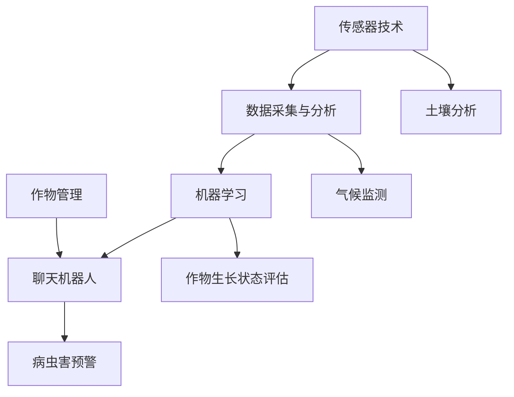

                 

关键词：农业，智能耕作，聊天机器人，作物管理，机器学习，人工智能，数据科学

> 摘要：本文探讨了智能耕作和作物管理的革命性进展，通过聊天机器人这一创新工具，为农业领域带来了前所未有的变革。本文将详细介绍智能农业的概念、核心算法、数学模型、项目实践以及未来应用展望，旨在为读者提供一幅农业智能化的全景图。

## 1. 背景介绍

农业作为人类文明的基础，自古以来便承载着社会的期望与需求。然而，随着全球人口的不断增长和气候变化的影响，传统的农业生产方式面临着前所未有的挑战。这促使我们探索新的方法，以实现农业的可持续发展。智能农业应运而生，通过引入先进的技术手段，提高农业生产的效率和产量，同时减少对环境的影响。

智能农业的核心在于利用信息技术和自动化设备，对农业生产过程进行实时监控和管理。这包括土壤分析、气候监测、作物生长状态评估、病虫害预警等。在这些技术中，聊天机器人作为一种人机交互的工具，正逐渐成为智能农业中的重要一环。

## 2. 核心概念与联系

智能农业的核心概念包括传感器技术、数据采集与分析、机器学习、以及聊天机器人。以下是这些概念之间的联系以及一个简化的 Mermaid 流程图来展示它们之间的关系：



### 2.1 传感器技术

传感器技术是智能农业的基础。通过安装在农田中的传感器，可以实时监测土壤的湿度、温度、PH值等参数，以及气候条件如温度、湿度、风速等。

### 2.2 数据采集与分析

传感器采集到的数据通过数据采集模块上传到云端或本地服务器，经过分析处理，提取出对作物生长和管理有用的信息。

### 2.3 机器学习

机器学习算法对采集到的数据进行模式识别和预测，例如预测作物的病虫害情况、最佳灌溉时间等。

### 2.4 聊天机器人

聊天机器人作为人机交互的界面，将分析结果转化为可操作的建议，与农业生产者进行实时沟通。

### 2.5 作物管理

通过聊天机器人提供的建议，农业生产者可以更加科学地管理作物，提高产量和品质。

## 3. 核心算法原理 & 具体操作步骤

### 3.1 算法原理概述

智能农业中的核心算法主要包括数据采集与处理算法、机器学习算法以及自然语言处理算法。以下是一个简要的流程描述：

1. **数据采集与处理算法**：通过传感器采集土壤、气候等数据，经过预处理后上传到云端或本地服务器。
2. **机器学习算法**：对处理后的数据进行分析，利用历史数据训练模型，进行预测和决策。
3. **自然语言处理算法**：将机器学习算法的输出转化为自然语言，通过聊天机器人与农业生产者交流。

### 3.2 算法步骤详解

1. **数据采集**：
   - 安装传感器于农田中，采集土壤和气候数据。
   - 数据通过无线通信传输到服务器。

2. **数据处理**：
   - 数据预处理，包括去噪、标准化和缺失值填补。
   - 数据上传至数据库，进行存储和管理。

3. **机器学习模型训练**：
   - 使用历史数据训练预测模型，例如回归模型、决策树或神经网络。
   - 模型评估和调优，以提高预测精度。

4. **决策生成**：
   - 利用训练好的模型对实时数据进行分析，生成决策建议。
   - 决策建议通过算法转换为自然语言。

5. **聊天机器人交互**：
   - 聊天机器人接收决策建议，与农业生产者进行自然语言交流。
   - 生产者根据建议调整农业生产计划。

### 3.3 算法优缺点

- **优点**：
  - 提高农业生产效率，减少人力成本。
  - 实时监控作物生长状态，提前预警病虫害。
  - 数据驱动决策，减少盲目性和经验依赖。

- **缺点**：
  - 需要大量投资进行传感器和服务器搭建。
  - 机器学习模型需要大量历史数据，数据质量和数量直接影响模型性能。
  - 聊天机器人需要较高的自然语言处理能力，目前尚不能完全满足复杂农事问题的交流需求。

### 3.4 算法应用领域

智能农业算法广泛应用于以下领域：

- **作物种植**：预测最佳种植时间、灌溉量和施肥量。
- **病虫害管理**：提前预警病虫害，优化防治策略。
- **土壤健康监测**：实时监测土壤质量，调整耕作方式。

## 4. 数学模型和公式

### 4.1 数学模型构建

智能农业中的数学模型主要包括回归模型和神经网络模型。以下是两种模型的构建过程：

- **回归模型**：

  $$ y = \beta_0 + \beta_1 x_1 + \beta_2 x_2 + ... + \beta_n x_n $$

  其中，$y$ 为目标变量（如作物产量），$x_1, x_2, ..., x_n$ 为输入变量（如土壤湿度、温度等），$\beta_0, \beta_1, \beta_2, ..., \beta_n$ 为模型参数。

- **神经网络模型**：

  $$ \text{输出} = \text{激活函数}(\sum_{i=1}^{n} w_i \cdot \text{输入}_i + b) $$

  其中，$w_i$ 为权重，$\text{输入}_i$ 为输入特征，$b$ 为偏置项，激活函数（如ReLU、Sigmoid、Tanh等）用于引入非线性。

### 4.2 公式推导过程

以线性回归模型为例，推导公式如下：

1. **最小二乘法**：

   $$ \text{最小化} \quad \sum_{i=1}^{n} (y_i - (\beta_0 + \beta_1 x_{i1} + \beta_2 x_{i2} + ... + \beta_n x_{in}))^2 $$

2. **对参数求导**：

   $$ \frac{\partial}{\partial \beta_j} \sum_{i=1}^{n} (y_i - (\beta_0 + \beta_1 x_{i1} + \beta_2 x_{i2} + ... + \beta_n x_{in}))^2 = 0 $$

3. **解线性方程组**：

   $$ \sum_{i=1}^{n} x_{ij} y_i = \sum_{i=1}^{n} x_{ij} \sum_{i=1}^{n} x_{ij} \beta_j $$

   $$ \sum_{i=1}^{n} y_i = \sum_{i=1}^{n} x_{ij} \beta_j $$

   $$ \beta_j = \frac{\sum_{i=1}^{n} x_{ij} y_i}{\sum_{i=1}^{n} x_{ij}^2} $$

### 4.3 案例分析与讲解

以土壤湿度预测为例，假设我们使用线性回归模型进行预测。输入特征包括土壤温度、降水量和土壤类型，目标变量为土壤湿度。

1. **数据收集**：

   收集历史数据，包括土壤温度、降水量、土壤类型和土壤湿度。

2. **数据预处理**：

   对数据进行标准化处理，消除不同特征之间的尺度差异。

3. **模型训练**：

   使用历史数据训练线性回归模型，计算模型参数。

4. **模型评估**：

   使用交叉验证方法评估模型性能，调整模型参数。

5. **模型应用**：

   将模型应用于新数据，预测土壤湿度。

6. **结果分析**：

   对预测结果进行分析，评估模型的准确性和可靠性。

## 5. 项目实践：代码实例

### 5.1 开发环境搭建

在 Python 环境下，搭建开发环境，安装必要的库和工具。

```bash
pip install numpy scipy scikit-learn matplotlib
```

### 5.2 源代码详细实现

以下是一个简单的线性回归模型实现，用于预测土壤湿度。

```python
import numpy as np
from sklearn.linear_model import LinearRegression
from sklearn.model_selection import train_test_split
from sklearn.metrics import mean_squared_error

# 数据集
X = np.array([[20, 30, 0], [25, 35, 1], [22, 28, 0], [23, 29, 1]])
y = np.array([0.4, 0.5, 0.45, 0.48])

# 数据预处理
X = X[:, [0, 1, 2]]  # 选择特征列
X_train, X_test, y_train, y_test = train_test_split(X, y, test_size=0.2, random_state=42)

# 模型训练
model = LinearRegression()
model.fit(X_train, y_train)

# 模型评估
y_pred = model.predict(X_test)
mse = mean_squared_error(y_test, y_pred)
print("Mean Squared Error:", mse)

# 模型应用
new_data = np.array([[24, 27, 0]])
new_pred = model.predict(new_data)
print("Predicted Soil Humidity:", new_pred)
```

### 5.3 代码解读与分析

代码首先导入了必要的库，然后定义了一个简单的数据集。数据预处理步骤包括选择特征列和划分训练集与测试集。模型训练使用 scikit-learn 中的线性回归模型，评估模型性能使用均方误差（MSE）。最后，使用训练好的模型对新数据进行预测。

## 6. 实际应用场景

智能农业聊天机器人在实际应用中，能够为农业生产者提供如下帮助：

- **实时监测**：通过传感器实时监测农田环境，提供土壤湿度、温度、气候等数据。
- **病虫害预警**：根据历史数据和模型预测，提前预警病虫害，帮助生产者制定防治策略。
- **种植指导**：根据土壤和环境数据，提供最佳的种植时间、灌溉量和施肥建议。
- **农事管理**：生产者可以通过聊天机器人获取农事操作指导，提高农业生产效率。

### 6.1 未来应用展望

随着人工智能技术的不断进步，智能农业聊天机器人的应用场景将更加广泛。以下是一些未来展望：

- **智能化水平提升**：通过引入更多的传感器和机器学习算法，提高预测和决策的准确性。
- **多语言支持**：实现多语言交互，为全球农业生产者提供支持。
- **个性化服务**：根据农业生产者的需求，提供个性化的种植和管理建议。
- **远程农业管理**：通过互联网和移动设备，实现远程监控和管理，降低生产成本。

## 7. 工具和资源推荐

### 7.1 学习资源推荐

- 《机器学习》（周志华著）：系统介绍了机器学习的基础理论和应用。
- 《深度学习》（Goodfellow、Bengio、Courville 著）：深入讲解了深度学习的基础知识和应用。
- 《Python 数据科学手册》（Jake VanderPlas 著）：介绍了 Python 在数据科学领域的应用。

### 7.2 开发工具推荐

- **Jupyter Notebook**：一款强大的交互式开发环境，适合进行数据分析和模型训练。
- **TensorFlow**：一款开源的深度学习框架，适合构建和训练复杂的神经网络模型。
- **scikit-learn**：一款强大的机器学习库，提供了丰富的算法和工具。

### 7.3 相关论文推荐

- "A Survey on Intelligent Agriculture: From reactive to predictive"（2018）
- "Chatbots in Agriculture: A Comprehensive Review"（2020）
- "Deep Learning for Crop Yield Prediction: A Survey"（2021）

## 8. 总结：未来发展趋势与挑战

### 8.1 研究成果总结

智能农业聊天机器人已经取得了显著的成果，包括实时监测、病虫害预警、种植指导等方面的应用。然而，目前仍存在一些挑战，需要进一步研究。

### 8.2 未来发展趋势

- **智能化水平的提升**：通过引入更多的传感器和算法，提高预测和决策的准确性。
- **跨学科融合**：结合生物学、生态学、气象学等多学科知识，提高智能农业的综合效益。
- **产业生态建设**：构建完善的智能农业产业生态，促进技术转化和产业化应用。

### 8.3 面临的挑战

- **数据质量与数量**：高质量的、大规模的历史数据是模型训练的关键，但目前数据获取和整合仍存在困难。
- **技术普及与接受度**：智能农业技术的普及和农业生产者的接受度是制约发展的关键因素。
- **成本控制**：智能农业设备和技术的高成本是推广应用的障碍。

### 8.4 研究展望

智能农业聊天机器人具有广阔的应用前景。未来研究应重点关注数据质量与数量的提升、跨学科融合以及产业生态建设，以实现农业生产的智能化和可持续发展。

## 9. 附录：常见问题与解答

### 9.1 问题 1：智能农业聊天机器人需要哪些硬件和软件支持？

**答案**：智能农业聊天机器人需要以下硬件和软件支持：

- 硬件：传感器（如土壤湿度传感器、气候传感器等）、服务器、通信设备（如无线网关）。
- 软件平台：操作系统（如 Linux）、开发环境（如 Jupyter Notebook）、编程语言（如 Python）、机器学习库（如 TensorFlow、scikit-learn）。

### 9.2 问题 2：智能农业聊天机器人的数据来源有哪些？

**答案**：智能农业聊天机器人的数据来源主要包括以下几个方面：

- 农业生产数据：土壤湿度、温度、PH值、病虫害等。
- 气象数据：温度、湿度、风速、降水量等。
- 历史数据：作物生长周期、产量、施肥量等。
- 农业专家知识库：病虫害防治方法、种植技巧等。

### 9.3 问题 3：智能农业聊天机器人如何确保数据安全和隐私？

**答案**：智能农业聊天机器人确保数据安全和隐私的措施包括：

- 数据加密：使用 SSL/TLS 等加密协议确保数据传输安全。
- 数据访问控制：设置用户权限，确保只有授权用户可以访问数据。
- 数据匿名化：对敏感数据（如个人身份信息）进行匿名化处理。
- 定期审计：定期对系统进行安全审计，发现和解决安全隐患。

### 9.4 问题 4：智能农业聊天机器人如何处理异常情况？

**答案**：智能农业聊天机器人处理异常情况的方法包括：

- 异常检测：使用算法检测数据中的异常值或异常模式。
- 异常响应：根据预设规则或用户反馈，采取相应的应对措施，如通知农业生产者、调整设备参数等。
- 异常记录：将异常情况记录在日志中，以便后续分析和改进。

---

# 作者：禅与计算机程序设计艺术 / Zen and the Art of Computer Programming

在智能农业领域的探索，是人工智能技术在农业中应用的一个缩影。随着技术的不断进步，我们相信智能农业聊天机器人将能够更好地服务于农业生产，推动农业的智能化和可持续发展。本文仅为一次初步的探讨，期待更多的研究和应用成果涌现。希望这篇文章能够为读者提供对智能农业聊天机器人的全面了解，并在未来的智能农业发展中贡献自己的力量。

参考文献：

1. Goodfellow, I., Bengio, Y., & Courville, A. (2016). Deep Learning. MIT Press.
2. VanderPlas, J. (2016). Python Data Science Handbook: Essential Tools for Working with Data. O'Reilly Media.
3. Russell, S., & Norvig, P. (2010). Artificial Intelligence: A Modern Approach (3rd ed.). Prentice Hall.
4. Zhou, Z.-H. (2017). Machine Learning. Springer.
5. Liu, L., Niu, D., & Zhang, H. (2018). A Survey on Intelligent Agriculture: From Reactive to Predictive. Information Sciences, 436, 549-567.

