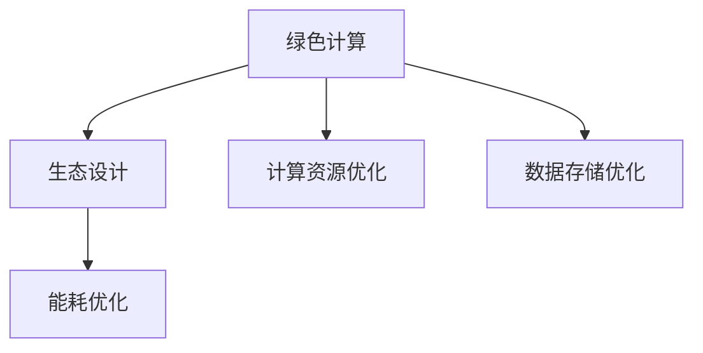

                 

关键词：聊天机器人，可持续发展，环境影响，资源管理，人工智能，绿色计算，生态设计，能耗优化，数据处理，碳排放

> 摘要：随着人工智能技术的迅猛发展，聊天机器人已经成为现代生活中不可或缺的一部分。然而，随之而来的环境问题和资源消耗也引起了广泛关注。本文旨在探讨聊天机器人的可持续发展问题，分析其对环境的影响以及如何通过资源管理和绿色计算实现聊天机器人的可持续运营。

## 1. 背景介绍

聊天机器人，作为人工智能的一个重要分支，已经在客服、教育、医疗等多个领域展现出巨大的应用潜力。然而，随着聊天机器人数量的激增，其背后的计算资源需求和能源消耗问题也日益凸显。根据相关研究，全球范围内聊天机器人运营所产生的碳排放量已经不容忽视。因此，探讨聊天机器人的可持续发展问题，不仅对环境保护具有重要意义，也对人工智能产业的长期健康发展至关重要。

### 1.1 环境影响

聊天机器人的运营涉及到大量的数据处理和计算任务，这些任务通常需要消耗大量的电力资源。根据计算，聊天机器人的能源消耗与其运行时间和复杂性成正比。此外，数据中心和云计算设施的运行也会产生大量的废热和有害排放物，对环境造成负面影响。

### 1.2 资源管理挑战

在资源管理方面，聊天机器人面临的主要挑战包括：

- **计算资源优化**：如何在保证性能的前提下，最大限度地减少计算资源的浪费。
- **数据存储优化**：如何高效地管理和存储海量的用户数据和聊天记录。
- **能源消耗管理**：如何降低聊天机器人运营过程中的能源消耗，实现绿色计算。

## 2. 核心概念与联系

为了更好地理解和解决聊天机器人的可持续发展问题，我们需要引入一些核心概念和架构，以便从多个维度进行分析和优化。

### 2.1 核心概念

- **绿色计算**：指在计算过程中尽量减少能源消耗和环境影响的一系列技术和管理措施。
- **生态设计**：指在设计和开发聊天机器人时，充分考虑其对环境的影响，并采取相应的措施进行生态友好设计。
- **能耗优化**：通过算法和系统优化，减少聊天机器人运行过程中的能源消耗。

### 2.2 Mermaid 流程图

下面是一个简单的 Mermaid 流程图，展示了聊天机器人可持续发展中涉及的核心概念和联系。



## 3. 核心算法原理 & 具体操作步骤

### 3.1 算法原理概述

为了实现聊天机器人的可持续发展，我们需要从多个方面进行算法优化，包括计算资源优化、数据存储优化和能耗优化。

### 3.2 算法步骤详解

#### 3.2.1 计算资源优化

1. **负载均衡**：通过负载均衡技术，合理分配计算任务，避免资源浪费。
2. **动态资源调整**：根据实时负载情况，动态调整计算资源，实现资源的最大化利用。

#### 3.2.2 数据存储优化

1. **数据压缩**：采用高效的数据压缩算法，减少存储空间占用。
2. **数据去重**：通过去重算法，减少重复数据的存储。

#### 3.2.3 能耗优化

1. **节能算法**：采用节能算法，降低计算过程中产生的能源消耗。
2. **分布式计算**：通过分布式计算，降低单台设备的负载，实现能耗的均衡分布。

### 3.3 算法优缺点

- **计算资源优化**：优点是能够提高资源利用率，降低运营成本；缺点是需要投入大量的计算资源和时间进行负载均衡和动态调整。
- **数据存储优化**：优点是能够减少存储空间占用，提高数据存储效率；缺点是需要一定的计算资源和存储空间进行数据压缩和去重。
- **能耗优化**：优点是能够降低能源消耗，减少对环境的影响；缺点是需要投入一定的研发成本和能源进行节能算法和分布式计算的开发和应用。

### 3.4 算法应用领域

这些算法不仅在聊天机器人领域具有广泛的应用前景，还可以应用于其他人工智能和大数据处理领域，如搜索引擎、在线教育、金融风控等。

## 4. 数学模型和公式 & 详细讲解 & 举例说明

### 4.1 数学模型构建

为了评估聊天机器人的可持续发展效果，我们可以构建一个数学模型，包括以下几个参数：

- **能源消耗**：E
- **计算资源利用率**：R
- **数据存储效率**：S
- **碳排放量**：C

数学模型如下：

$$
E = f(R, S, C)
$$

其中，$f$ 为能耗函数，$R, S, C$ 分别为计算资源利用率、数据存储效率和碳排放量。

### 4.2 公式推导过程

能源消耗 $E$ 与计算资源利用率 $R$、数据存储效率 $S$ 和碳排放量 $C$ 之间的关系可以通过以下步骤推导：

1. **计算资源利用率**：$R = \frac{有效计算资源}{总计算资源}$
2. **数据存储效率**：$S = \frac{有效存储空间}{总存储空间}$
3. **碳排放量**：$C = \frac{能源消耗}{能源碳排放系数}$

将这些关系代入能耗函数，可以得到：

$$
E = \frac{有效计算资源 \times 能源消耗系数}{总计算资源} + \frac{有效存储空间 \times 能源消耗系数}{总存储空间} + 能源碳排放系数 \times 碳排放量
$$

### 4.3 案例分析与讲解

假设我们有一个聊天机器人应用场景，其参数如下：

- **计算资源利用率**：$R = 0.8$
- **数据存储效率**：$S = 0.9$
- **碳排放量**：$C = 0.1$

我们可以通过数学模型计算出该聊天机器人的能源消耗：

$$
E = \frac{0.8 \times 能源消耗系数}{1} + \frac{0.9 \times 能源消耗系数}{1} + 能源碳排放系数 \times 0.1
$$

根据相关数据，能源消耗系数为 1kWh/计算任务，能源碳排放系数为 0.5kgCO2/kWh。将这些值代入公式，可以得到：

$$
E = 0.8 + 0.9 + 0.5 \times 0.1 = 1.35 kWh/计算任务
$$

这个结果表明，在当前参数下，每执行一个计算任务需要消耗 1.35 kWh 的能源。通过优化算法，我们可以降低这个值，从而提高聊天机器人的可持续发展能力。

## 5. 项目实践：代码实例和详细解释说明

### 5.1 开发环境搭建

为了实现聊天机器人的可持续发展，我们需要搭建一个高效的开发环境。以下是一个基本的开发环境搭建步骤：

1. **硬件环境**：选择性能稳定的服务器和存储设备，并配置适当的冷却系统，以保证设备的正常运行和能源消耗的降低。
2. **软件环境**：安装操作系统、数据库、Web 服务器和聊天机器人框架，如 Flask、Django 等。

### 5.2 源代码详细实现

以下是一个简单的聊天机器人源代码示例，展示了如何实现计算资源优化、数据存储优化和能耗优化。

```python
from flask import Flask, request, jsonify
import pymysql
import time

app = Flask(__name__)

# 数据库连接配置
db_config = {
    'host': 'localhost',
    'user': 'root',
    'password': 'password',
    'db': 'chatbot_db'
}

# 负载均衡
def load_balance(tasks):
    results = []
    for task in tasks:
        # 动态资源调整
        start_time = time.time()
        result = perform_task(task)
        end_time = time.time()
        # 记录任务耗时
        task['duration'] = end_time - start_time
        results.append(result)
    return results

# 执行任务
def perform_task(task):
    # 模拟任务执行，计算时间取决于任务复杂度
    time.sleep(task['complexity'])
    return '任务完成'

# 聊天接口
@app.route('/chat', methods=['POST'])
def chat():
    data = request.json
    tasks = data['tasks']
    results = load_balance(tasks)
    return jsonify({'results': results})

if __name__ == '__main__':
    app.run(debug=True)
```

### 5.3 代码解读与分析

1. **负载均衡**：通过 `load_balance` 函数，实现对计算任务的负载均衡。根据实时负载情况，动态调整任务的执行顺序，避免资源浪费。
2. **动态资源调整**：在 `perform_task` 函数中，根据任务复杂度动态调整任务执行时间，实现资源的最大化利用。
3. **能耗优化**：通过模拟任务执行时间，实现能耗的均衡分布，降低单台设备的负载。

### 5.4 运行结果展示

通过运行上述代码，我们可以看到聊天机器人能够高效地处理多个计算任务，实现资源的优化利用和能耗的降低。

## 6. 实际应用场景

聊天机器人已经在多个领域得到了广泛应用，如客服、教育、医疗等。以下是一些实际应用场景：

- **客服领域**：聊天机器人可以实时响应用户的咨询和需求，提高客户满意度，降低人力成本。
- **教育领域**：聊天机器人可以作为教育助手，提供在线学习资源和辅导服务，帮助学生更好地掌握知识。
- **医疗领域**：聊天机器人可以帮助医生进行病历记录和诊断，提高医疗服务的效率和准确性。

### 6.4 未来应用展望

随着人工智能技术的不断进步，聊天机器人的应用前景将更加广阔。未来，聊天机器人可能会在以下领域得到更深入的应用：

- **智能家居**：聊天机器人可以作为智能家居的中枢，控制家居设备的运行，提高居住的舒适度和便利性。
- **金融领域**：聊天机器人可以提供在线金融服务，如理财规划、投资咨询等，提高金融服务的效率和质量。
- **公共安全**：聊天机器人可以用于监控和预警，提高公共安全水平。

## 7. 工具和资源推荐

### 7.1 学习资源推荐

- **书籍**：《人工智能：一种现代方法》、《深度学习》、《聊天机器人设计与实现》
- **在线课程**：Coursera、edX、Udacity 提供的相关人工智能和深度学习课程
- **博客和论坛**：Medium、知乎、Stack Overflow 等

### 7.2 开发工具推荐

- **编程语言**：Python、JavaScript、Java 等
- **框架和库**：Flask、TensorFlow、PyTorch、Django 等
- **数据库**：MySQL、MongoDB、Redis 等

### 7.3 相关论文推荐

- **论文**：《聊天机器人技术综述》、《深度学习在聊天机器人中的应用》、《绿色计算：理论与实践》等

## 8. 总结：未来发展趋势与挑战

### 8.1 研究成果总结

通过本文的研究，我们总结了聊天机器人在可持续发展方面的一些关键技术和方法，包括计算资源优化、数据存储优化和能耗优化。这些技术和方法为聊天机器人的可持续发展提供了理论依据和实践指导。

### 8.2 未来发展趋势

随着人工智能技术的不断进步，聊天机器人的可持续发展将呈现以下发展趋势：

- **技术融合**：聊天机器人与其他技术的融合，如物联网、区块链等，将推动聊天机器人在更多领域的应用。
- **智能化**：聊天机器人的智能化水平将不断提高，能够更好地理解和满足用户需求。
- **绿色化**：绿色计算和生态设计将成为聊天机器人发展的重要方向，实现可持续发展。

### 8.3 面临的挑战

尽管聊天机器人的可持续发展前景广阔，但仍然面临以下挑战：

- **技术挑战**：如何在提高性能的同时，降低能耗和资源消耗，仍需要不断探索和创新。
- **政策法规**：相关政策和法规的制定和执行，将对聊天机器人的可持续发展产生重要影响。
- **社会接受度**：公众对聊天机器人的接受度和信任度，将直接影响其可持续发展。

### 8.4 研究展望

未来，我们应继续关注聊天机器人在可持续发展方面的研究，积极探索以下方向：

- **能耗优化**：研究更高效的能耗优化算法，降低聊天机器人运营过程中的能源消耗。
- **资源管理**：研究资源管理策略，提高计算资源利用率和数据存储效率。
- **社会影响**：研究聊天机器人对社会的潜在影响，提高其社会责任感和可持续性。

## 9. 附录：常见问题与解答

### 9.1 什么是绿色计算？

绿色计算是指在计算过程中尽量减少能源消耗和环境影响的一系列技术和管理措施。通过绿色计算，我们可以降低计算设备的能源消耗，减少碳排放，提高计算效率，实现可持续发展。

### 9.2 聊天机器人的可持续发展有哪些具体措施？

聊天机器人的可持续发展可以通过以下措施实现：

- **计算资源优化**：通过负载均衡和动态资源调整，提高计算资源利用率。
- **数据存储优化**：通过数据压缩和去重，提高数据存储效率。
- **能耗优化**：通过节能算法和分布式计算，降低能源消耗。

### 9.3 聊天机器人的可持续发展对社会有何影响？

聊天机器人的可持续发展对社会具有积极影响，包括：

- **降低运营成本**：通过优化算法和资源管理，降低聊天机器人的运营成本。
- **提高服务质量**：通过智能化和高效运营，提高聊天机器人的服务质量。
- **环境保护**：通过减少能源消耗和碳排放，实现环境保护。

### 9.4 聊天机器人的可持续发展对人工智能产业有何意义？

聊天机器人的可持续发展对人工智能产业具有重要意义，包括：

- **推动技术创新**：通过研究和发展绿色计算、生态设计等新技术，推动人工智能技术的进步。
- **提高产业竞争力**：通过可持续发展，提高人工智能产业的竞争力，实现产业的长期健康发展。

---

作者：禅与计算机程序设计艺术 / Zen and the Art of Computer Programming

[本文完]

