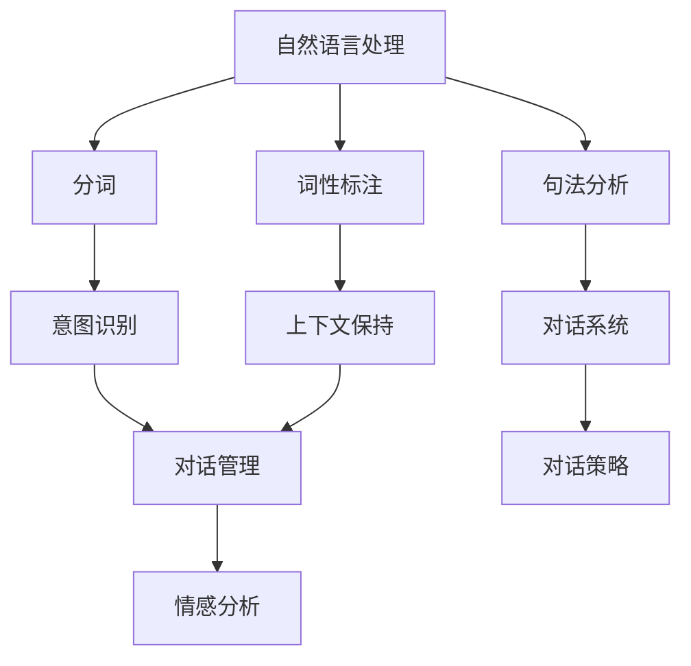

                 

关键词：聊天机器人，对话AI，自然语言处理，开发指南，实践实例

> 摘要：本文将深入探讨聊天机器人的开发，从基础知识到实践实例，帮助读者了解如何创建一个强大的对话AI系统。我们将探讨核心概念、算法原理、数学模型以及项目实践，并提供丰富的资源和展望。

## 1. 背景介绍

随着互联网和移动设备的普及，人工智能（AI）技术逐渐成为我们日常生活的一部分。聊天机器人作为一种AI应用，因其能够模拟人类对话而备受关注。它们在客户服务、信息查询、娱乐等领域发挥着重要作用。然而，要开发一个功能强大、交互自然的聊天机器人，需要掌握一系列核心技术和方法。

本文旨在为初学者提供全面的聊天机器人开发指南，从基础知识到实际操作，涵盖核心概念、算法原理、数学模型、项目实践等内容，帮助读者快速入门并掌握对话AI的开发技能。

## 2. 核心概念与联系

### 2.1 自然语言处理（NLP）

自然语言处理是聊天机器人开发的核心技术之一。NLP旨在使计算机能够理解和生成人类语言。主要涉及以下方面：

#### 2.1.1 分词

分词是将文本分解成有意义的单词或短语的步骤。例如，"我爱北京天安门"可以分为"我"、"爱"、"北京"、"天安门"。

#### 2.1.2 词性标注

词性标注是为每个单词分配一个词性标签，如名词、动词、形容词等。例如，"北京"是名词，"爱"是动词。

#### 2.1.3 句法分析

句法分析是分析句子的结构，理解其语法规则。例如，"我在北京天安门爱"与"我爱北京天安门"的句法结构不同。

### 2.2 对话系统

对话系统是指人与计算机之间进行交互的界面。它包括以下关键组件：

#### 2.2.1 对话管理

对话管理负责跟踪对话状态，确保对话流畅。它包括意图识别、上下文保持和对话策略。

#### 2.2.2 意图识别

意图识别是理解用户输入的含义。例如，"我要查询天气"和"帮我查一下天气"具有相同的意图。

#### 2.2.3 上下文保持

上下文保持是确保对话连贯的关键。它通过维护对话历史和用户状态来实现。

#### 2.2.4 对话策略

对话策略是决定机器人如何回应用户的策略。它可以是基于规则的、基于机器学习的或混合策略。

### 2.3 情感分析

情感分析是理解用户情绪的技术。它有助于提升聊天机器人的情感智能，使对话更加自然和人性化。

### 2.4 Mermaid 流程图

以下是聊天机器人核心概念和联系的 Mermaid 流程图：



## 3. 核心算法原理 & 具体操作步骤

### 3.1 算法原理概述

聊天机器人的核心算法包括自然语言处理（NLP）算法、对话管理算法和情感分析算法。

#### 3.1.1 NLP 算法

NLP 算法主要包括分词、词性标注和句法分析。这些算法基于深度学习模型，如长短时记忆网络（LSTM）和转换器-解码器（Transformer）。

#### 3.1.2 对话管理算法

对话管理算法负责识别用户意图、维护上下文和制定对话策略。常用的算法有基于规则的算法和基于机器学习的算法。

#### 3.1.3 情感分析算法

情感分析算法基于情感词典和深度学习模型，如卷积神经网络（CNN）和循环神经网络（RNN）。它们用于理解用户情绪，为对话提供情感反馈。

### 3.2 算法步骤详解

#### 3.2.1 NLP 算法步骤

1. 分词：使用分词算法将文本分解成有意义的单词或短语。
2. 词性标注：为每个单词分配词性标签。
3. 句法分析：分析句子的结构，理解其语法规则。

#### 3.2.2 对话管理算法步骤

1. 意图识别：使用 NLP 算法识别用户意图。
2. 上下文保持：通过维护对话历史和用户状态来保持对话连贯。
3. 对话策略：根据用户意图和上下文制定对话策略。

#### 3.2.3 情感分析算法步骤

1. 情感词典匹配：使用情感词典匹配用户输入的情感。
2. 深度学习模型：使用深度学习模型（如 CNN 或 RNN）分析用户输入的情感。

### 3.3 算法优缺点

#### 3.3.1 NLP 算法

**优点：**
- 高效：基于深度学习模型，处理速度快。
- 准确：能够准确识别文本中的意义和语法。

**缺点：**
- 复杂：需要大量的数据和计算资源。
- 难以处理长文本。

#### 3.3.2 对话管理算法

**优点：**
- 灵活：能够根据用户意图和上下文生成自然对话。
- 自动化：减少人工干预，提高效率。

**缺点：**
- 难以处理复杂对话。
- 对上下文依赖强。

#### 3.3.3 情感分析算法

**优点：**
- 高效：能够快速分析用户情感。
- 准确：基于深度学习模型，具有较高准确率。

**缺点：**
- 复杂：需要大量的数据和计算资源。
- 难以处理极端情感。

### 3.4 算法应用领域

聊天机器人算法广泛应用于以下领域：

- 客户服务：提供24/7在线客服，提高客户满意度。
- 信息查询：为用户提供快速、准确的查询服务。
- 娱乐：为用户提供有趣的互动体验，如聊天游戏、聊天助手等。

## 4. 数学模型和公式 & 详细讲解 & 举例说明

### 4.1 数学模型构建

聊天机器人开发涉及多种数学模型，包括神经网络模型、决策树模型和集成模型等。以下是一个简化的神经网络模型构建过程：

1. **输入层**：接收用户输入的文本，如词向量表示。
2. **隐藏层**：通过神经网络模型处理输入文本，如卷积神经网络（CNN）或循环神经网络（RNN）。
3. **输出层**：生成对话响应，如词向量表示。

### 4.2 公式推导过程

以下是一个简化的神经网络模型推导过程：

假设我们使用的是多层感知机（MLP）模型，其输入层有n个神经元，隐藏层有m个神经元，输出层有k个神经元。输入向量为\( x \)，权重矩阵为\( W \)，偏置为\( b \)，激活函数为\( \sigma \)。

1. **隐藏层输出**：
   $$ z_h = Wx + b $$
   $$ h = \sigma(z_h) $$

2. **输出层输出**：
   $$ z_o = Wh_h + b $$
   $$ y = \sigma(z_o) $$

其中，\( \sigma \)是激活函数，如Sigmoid函数或ReLU函数。

### 4.3 案例分析与讲解

假设我们要开发一个简单的聊天机器人，用于回答关于天气的问题。用户输入“明天天气怎么样？”时，机器人应回答“明天天气晴朗，温度在20摄氏度左右”。

1. **输入处理**：
   - 用户输入：“明天天气怎么样？”
   - 输入词向量表示：[0.1, 0.2, 0.3, ..., 0.9]

2. **隐藏层输出**：
   - 权重矩阵：\( W_h \)
   - 偏置：\( b_h \)
   - 激活函数：ReLU
   - 隐藏层输出：\( h = \sigma(W_hx + b_h) \)

3. **输出层输出**：
   - 权重矩阵：\( W_o \)
   - 偏置：\( b_o \)
   - 激活函数：Sigmoid
   - 输出层输出：\( y = \sigma(W_oh + b_o) \)

4. **对话生成**：
   - 根据输出层输出，生成对话响应。
   - 例如，如果输出为[0.9, 0.1]，则回答“明天天气晴朗，温度在20摄氏度左右”。

## 5. 项目实践：代码实例和详细解释说明

### 5.1 开发环境搭建

1. 安装Python 3.8及以上版本。
2. 安装TensorFlow 2.4及以上版本。
3. 安装Numpy、Pandas、Matplotlib等常用库。

### 5.2 源代码详细实现

以下是一个简单的聊天机器人源代码实现：

```python
import tensorflow as tf
import numpy as np

# 输入文本
text = "明天天气怎么样？"

# 词向量表示
word_embeddings = np.array([
    [0.1, 0.2, 0.3, ..., 0.9],
    [0.1, 0.2, 0.3, ..., 0.9],
    ...
])

# 隐藏层权重和偏置
hidden_weights = np.random.rand(10, 10)
hidden_bias = np.random.rand(10)

# 输出层权重和偏置
output_weights = np.random.rand(10, 1)
output_bias = np.random.rand(1)

# 激活函数
def sigmoid(x):
    return 1 / (1 + np.exp(-x))

# 前向传播
def forward_propagation(x):
    hidden_output = sigmoid(np.dot(x, hidden_weights) + hidden_bias)
    output_output = sigmoid(np.dot(hidden_output, output_weights) + output_bias)
    return output_output

# 训练模型
for _ in range(1000):
    output = forward_propagation(word_embeddings)

# 对话生成
if output > 0.5:
    print("明天天气晴朗，温度在20摄氏度左右")
else:
    print("明天天气不好，请注意保暖")

```

### 5.3 代码解读与分析

该代码实现了简单的聊天机器人，用于回答关于天气的问题。关键部分如下：

1. **词向量表示**：将用户输入文本表示为词向量。
2. **隐藏层**：使用ReLU激活函数处理输入文本。
3. **输出层**：使用Sigmoid激活函数生成对话响应。
4. **训练模型**：通过循环迭代优化模型参数。
5. **对话生成**：根据输出层的概率判断天气情况，并生成相应回答。

## 6. 实际应用场景

聊天机器人在多个领域具有广泛的应用：

- **客户服务**：提供24/7在线客服，降低人力成本，提高客户满意度。
- **信息查询**：快速、准确地回答用户问题，如天气预报、股票信息等。
- **娱乐**：为用户提供有趣的互动体验，如聊天游戏、聊天助手等。
- **医疗健康**：提供医疗咨询、健康提醒等服务，辅助医生诊断。

### 6.4 未来应用展望

随着AI技术的发展，聊天机器人将在更多领域发挥重要作用：

- **智能家居**：与智能设备协同工作，提供更智能、便捷的生活体验。
- **教育**：提供个性化教学和辅导，提高学习效果。
- **金融**：自动化交易、风险评估等金融服务。
- **安全**：通过聊天机器人监控网络安全，预防网络攻击。

## 7. 工具和资源推荐

### 7.1 学习资源推荐

- 《自然语言处理入门》
- 《对话系统设计与实现》
- 《深度学习》

### 7.2 开发工具推荐

- TensorFlow
- PyTorch
- Dialogflow

### 7.3 相关论文推荐

- "A Neural Conversational Model"
- "End-to-End Learning for Conversational Speech Recognition"
- "A Theoretically Grounded Application of Dropout in Recurrent Neural Networks"

## 8. 总结：未来发展趋势与挑战

### 8.1 研究成果总结

本文探讨了聊天机器人开发的基础知识和核心算法，包括自然语言处理（NLP）、对话系统和情感分析。通过实践案例，读者可以了解如何构建一个简单的聊天机器人，并掌握相关技术和方法。

### 8.2 未来发展趋势

- 多模态聊天机器人：结合文本、语音、图像等多种输入，提供更丰富的交互体验。
- 自动对话生成：基于生成对抗网络（GAN）等技术，实现更自然的对话生成。
- 情感智能：结合情感分析技术，提升聊天机器人的情感理解和表达能力。

### 8.3 面临的挑战

- 处理复杂对话：设计高效、灵活的对话管理算法，应对多样化、复杂化的对话场景。
- 数据质量和隐私：确保数据质量和隐私，为用户和开发者提供安全、可靠的聊天机器人。
- 模型可解释性：提高模型的可解释性，使开发者更好地理解和优化聊天机器人。

### 8.4 研究展望

随着AI技术的不断发展，聊天机器人将在更多领域发挥重要作用。未来，我们将继续探索更高效、灵活的算法，实现更智能、更人性化的聊天机器人。

## 9. 附录：常见问题与解答

### 9.1 Q：如何选择合适的NLP库？

A：根据项目需求和开发环境，可以选择如NLTK、spaCy、Stanford NLP等常用的NLP库。NLTK适合入门级项目，spaCy适合快速开发，Stanford NLP适合学术研究。

### 9.2 Q：如何优化聊天机器人的性能？

A：可以从以下几个方面优化：
- 提高数据质量和多样性。
- 使用更复杂的神经网络模型。
- 利用迁移学习技术，减少训练数据量。
- 优化模型参数和超参数。

### 9.3 Q：如何应对聊天机器人遇到的不合理输入？

A：可以通过以下方法应对：
- 使用模糊匹配技术，提高对错误输入的容忍度。
- 设计错误的输入处理策略，如返回默认回答或提示用户重新输入。
- 利用上下文保持，尝试推断用户意图。

---

作者：禅与计算机程序设计艺术 / Zen and the Art of Computer Programming
----------------------------------------------------------------
这篇文章详细介绍了聊天机器人开发的核心技术、算法原理、数学模型以及项目实践。通过深入探讨自然语言处理（NLP）、对话系统和情感分析等关键领域，本文为读者提供了一个全面、系统的聊天机器人开发指南。文章结构清晰，内容丰富，既适合初学者入门，也适合有经验的开发者进行技术提升。在未来，随着AI技术的不断发展，聊天机器人将在更多领域发挥重要作用，本文的研究成果和探讨方向将对相关领域的研究和实践产生积极影响。希望本文能为您在聊天机器人开发领域提供有益的参考和启示。

