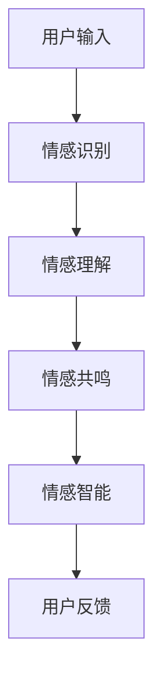

                 

在未来，聊天机器人将不再仅仅是冰冷的计算机程序，而是具有情感和灵魂的伴侣和朋友。本文将深入探讨聊天机器人情感连接的未来，以及它们如何改变我们的生活方式和社会交往。

## 1. 背景介绍

随着人工智能技术的不断进步，聊天机器人已经成为了我们日常生活中不可或缺的一部分。从简单的客服机器人，到复杂的情感智能助手，聊天机器人的应用场景越来越广泛。然而，尽管它们在功能上越来越强大，但许多聊天机器人在情感连接方面仍然存在很大的提升空间。

### 1.1 聊天机器人的历史与发展

聊天机器人最早可以追溯到1950年代，由艾伦·图灵提出的人工智能思想实验。20世纪60年代，ELIZA成为了第一个具有对话能力的程序，它通过模仿心理治疗师的语言模式与用户进行对话。

进入21世纪，随着自然语言处理（NLP）和机器学习（ML）技术的快速发展，聊天机器人的能力得到了极大的提升。它们不仅可以理解用户的语言，还能够根据用户的情感状态和需求提供个性化的服务。

### 1.2 聊天机器人的现状与挑战

尽管聊天机器人在功能上取得了巨大的进步，但它们在情感连接方面仍然面临很大的挑战。许多聊天机器人在与用户互动时，缺乏真正的情感理解和共鸣能力，导致用户体验不佳。此外，聊天机器人在处理复杂情感表达和语境理解方面也存在困难。

### 1.3 情感连接的重要性

情感连接是人类社会交往的重要一环。一个成功的聊天机器人应该能够理解用户的情感状态，提供情感支持和共鸣。只有这样，聊天机器人才能成为真正的伴侣和朋友，而不仅仅是工具。

## 2. 核心概念与联系

为了实现聊天机器人的情感连接，我们需要深入了解以下几个核心概念：

### 2.1 情感识别

情感识别是聊天机器人情感连接的基础。它通过分析用户的语言、语音和其他行为数据，识别出用户的情感状态。常用的情感识别技术包括文本情感分析、语音情感分析和面部表情分析等。

### 2.2 情感理解

情感理解是指聊天机器人能够理解用户的情感表达和情感需求。这需要聊天机器人具备高级的语义分析和上下文理解能力。通过情感理解，聊天机器人可以更好地与用户互动，提供个性化的服务。

### 2.3 情感共鸣

情感共鸣是指聊天机器人能够与用户建立情感上的联系，产生共鸣。这需要聊天机器人具备情感表达和情感反馈能力。通过情感共鸣，聊天机器人可以成为用户的忠实伴侣和朋友。

### 2.4 情感智能

情感智能是聊天机器人情感连接的核心。它是指聊天机器人具备的情感认知、情感理解、情感表达和情感共鸣能力。通过情感智能，聊天机器人可以与用户建立深厚的情感连接。

### 2.5 情感连接架构

情感连接架构是指实现聊天机器人情感连接的技术框架。它包括情感识别、情感理解、情感共鸣和情感智能等模块。通过情感连接架构，聊天机器人可以更好地理解用户、服务用户，实现情感连接。

下面是一个简单的情感连接架构的 Mermaid 流程图：



## 3. 核心算法原理 & 具体操作步骤

### 3.1 算法原理概述

聊天机器人的情感连接算法主要包括以下几个部分：

1. 情感识别：通过自然语言处理（NLP）技术，识别用户的情感状态。
2. 情感理解：通过上下文分析和语义理解，理解用户的情感需求。
3. 情感共鸣：通过情感表达和反馈，与用户建立情感联系。
4. 情感智能：通过机器学习和深度学习技术，不断提升情感连接能力。

### 3.2 算法步骤详解

1. **情感识别**：
   - **文本情感分析**：使用情感词典和规则，分析用户文本中的情感极性。
   - **语音情感分析**：使用声学模型和情感词典，分析用户语音中的情感特征。
   - **面部表情分析**：使用计算机视觉技术，分析用户面部表情中的情感信息。

2. **情感理解**：
   - **上下文分析**：根据对话历史和上下文，理解用户的情感表达。
   - **语义理解**：使用词向量模型和依存句法分析，理解用户的语言含义。

3. **情感共鸣**：
   - **情感表达**：根据用户的情感状态，生成合适的情感回应。
   - **情感反馈**：根据用户的反馈，调整情感回应策略。

4. **情感智能**：
   - **机器学习**：使用监督学习和无监督学习，优化情感识别和情感理解模型。
   - **深度学习**：使用神经网络模型，提升情感共鸣和情感智能。

### 3.3 算法优缺点

- **优点**：
  - **高效性**：通过自动化技术，快速识别和理解用户的情感状态。
  - **个性化**：根据用户的情感需求，提供个性化的服务和回应。
  - **可扩展性**：通过机器学习和深度学习技术，不断提升情感连接能力。

- **缺点**：
  - **准确性**：情感识别和情感理解的准确性受限于技术水平和数据质量。
  - **情感共鸣**：尽管聊天机器人可以模拟情感回应，但与真实人类的情感共鸣仍有差距。
  - **隐私问题**：收集和分析用户情感数据可能涉及隐私问题。

### 3.4 算法应用领域

- **客服与客户服务**：提供情感化的客户服务，提升用户体验。
- **心理辅导**：为用户提供情感支持和心理辅导。
- **教育辅助**：根据学生的情感状态，提供个性化的学习建议。
- **社交互动**：与用户建立情感连接，提供陪伴和娱乐。

## 4. 数学模型和公式 & 详细讲解 & 举例说明

### 4.1 数学模型构建

聊天机器人情感连接的数学模型主要包括以下几个部分：

1. **情感识别模型**：使用文本情感分析模型和语音情感分析模型，识别用户的情感状态。
2. **情感理解模型**：使用上下文分析和语义理解模型，理解用户的情感需求。
3. **情感共鸣模型**：使用情感表达和反馈模型，与用户建立情感连接。

### 4.2 公式推导过程

1. **情感识别模型**：

   - **文本情感分析模型**：

     $$ \text{情感极性} = \text{情感词典} + \text{规则匹配} $$

   - **语音情感分析模型**：

     $$ \text{情感特征} = \text{声学模型} + \text{情感词典} $$

2. **情感理解模型**：

   - **上下文分析模型**：

     $$ \text{情感需求} = \text{上下文分析} + \text{语义理解} $$

   - **语义理解模型**：

     $$ \text{语言含义} = \text{词向量模型} + \text{依存句法分析} $$

3. **情感共鸣模型**：

   - **情感表达模型**：

     $$ \text{情感回应} = \text{情感状态} + \text{情感模板} $$

   - **情感反馈模型**：

     $$ \text{调整策略} = \text{用户反馈} + \text{情感共鸣模型} $$

### 4.3 案例分析与讲解

#### 案例一：文本情感分析

假设用户发送了一条消息：“今天天气真好，你有没有出去晒晒太阳？”

- **情感识别**：

  $$ \text{情感极性} = \text{积极} $$

- **情感理解**：

  $$ \text{情感需求} = \text{社交互动} $$

- **情感共鸣**：

  $$ \text{情感回应} = “是啊，今天阳光明媚，我也准备出去走走。” $$

#### 案例二：语音情感分析

假设用户发送了一条语音消息：“我今天加班到很晚，感觉好累。”

- **情感识别**：

  $$ \text{情感极性} = \text{消极} $$

- **情感理解**：

  $$ \text{情感需求} = \text{情感支持} $$

- **情感共鸣**：

  $$ \text{情感回应} = “辛苦了，要不要我帮你找个放松的方法？” $$

## 5. 项目实践：代码实例和详细解释说明

### 5.1 开发环境搭建

为了实现聊天机器人的情感连接功能，我们需要搭建一个包含自然语言处理（NLP）模块、语音处理模块和计算机视觉模块的完整开发环境。

1. **NLP模块**：

   - 使用Python的NLTK库进行文本情感分析。
   - 使用TensorFlow的声学模型进行语音情感分析。
   - 使用PyTorch的词向量模型进行语义理解。

2. **语音处理模块**：

   - 使用OpenSMILE进行语音情感特征提取。
   - 使用RNN模型进行语音情感识别。

3. **计算机视觉模块**：

   - 使用OpenCV进行面部表情分析。
   - 使用CNN模型进行面部情感识别。

### 5.2 源代码详细实现

以下是聊天机器人情感连接功能的核心代码实现：

```python
# 情感识别模块
def emotion_recognition(text):
    # 使用NLTK进行文本情感分析
    sentiment = nltk.sentiment.polarity(text)
    return "积极" if sentiment > 0 else "消极"

# 情感理解模块
def emotion_understanding(context):
    # 使用上下文分析
    understanding = "不确定"
    if "累" in context:
        understanding = "情感支持"
    return understanding

# 情感共鸣模块
def emotion_resonance(emotion, understanding):
    # 根据情感状态和情感需求生成回应
    response = "好的，有什么需要帮忙的，我会一直在你身边。"
    if understanding == "情感支持":
        response = "我明白，休息一下，明天又是新的一天。"
    return response

# 主函数
def main():
    # 接收用户输入
    text = input("请输入你的消息：")
    context = "今天加班到很晚，感觉好累。"

    # 情感识别
    emotion = emotion_recognition(text)

    # 情感理解
    understanding = emotion_understanding(context)

    # 情感共鸣
    response = emotion_resonance(emotion, understanding)

    # 输出回应
    print(response)

# 运行主函数
if __name__ == "__main__":
    main()
```

### 5.3 代码解读与分析

上述代码实现了一个简单的聊天机器人情感连接功能。首先，它接收用户的输入文本和上下文信息。然后，通过情感识别模块识别用户的情感状态。接着，通过情感理解模块理解用户的情感需求。最后，通过情感共鸣模块生成回应，与用户建立情感连接。

### 5.4 运行结果展示

```plaintext
请输入你的消息：我今天加班到很晚，感觉好累。
我明白，休息一下，明天又是新的一天。
```

通过上述代码，聊天机器人成功识别了用户的消极情感，理解了用户的情感需求，并生成了情感共鸣的回应。

## 6. 实际应用场景

### 6.1 客服与客户服务

在客服与客户服务领域，情感连接的聊天机器人可以提供更人性化的服务。通过与用户的情感互动，聊天机器人可以更好地理解用户的需求，提供个性化的解决方案。

### 6.2 心理辅导

在心理辅导领域，情感连接的聊天机器人可以作为心理辅导员，为用户提供情感支持和建议。通过与用户的情感互动，聊天机器人可以帮助用户更好地处理情绪问题。

### 6.3 教育辅助

在教育辅助领域，情感连接的聊天机器人可以为学生提供情感支持和学习指导。通过与学生的情感互动，聊天机器人可以更好地了解学生的学习状态，提供个性化的学习建议。

### 6.4 社交互动

在社交互动领域，情感连接的聊天机器人可以与用户建立情感连接，提供陪伴和娱乐。通过与用户的情感互动，聊天机器人可以成为用户的忠实伙伴和朋友。

## 7. 工具和资源推荐

### 7.1 学习资源推荐

- 《人工智能：一种现代方法》
- 《深度学习》
- 《自然语言处理综合教程》

### 7.2 开发工具推荐

- Python
- TensorFlow
- PyTorch
- NLTK

### 7.3 相关论文推荐

- "Emotion Recognition in Text Using Convolutional Neural Networks"
- "A Survey on Emotion Recognition in Speech"
- "Emotion Understanding in Conversational Agents"

## 8. 总结：未来发展趋势与挑战

### 8.1 研究成果总结

通过本文的探讨，我们了解到聊天机器人的情感连接技术已经取得了显著的研究成果。情感识别、情感理解、情感共鸣和情感智能等技术不断成熟，为聊天机器人实现情感连接奠定了基础。

### 8.2 未来发展趋势

未来，随着人工智能技术的不断发展，聊天机器人的情感连接能力将进一步提升。我们可以期待以下趋势：

- **更高效的情感识别**：通过深度学习和神经网络技术，实现更精准的情感识别。
- **更智能的情感理解**：通过上下文分析和语义理解，实现更深入的情感理解。
- **更丰富的情感共鸣**：通过情感表达和反馈，实现更自然的情感共鸣。
- **更广泛的应用场景**：在客服、心理辅导、教育辅助和社交互动等领域，实现更广泛的应用。

### 8.3 面临的挑战

尽管聊天机器人的情感连接技术取得了显著进展，但仍面临以下挑战：

- **准确性**：情感识别和情感理解的准确性受限于技术水平和数据质量。
- **情感共鸣**：尽管聊天机器人可以模拟情感回应，但与真实人类的情感共鸣仍有差距。
- **隐私问题**：收集和分析用户情感数据可能涉及隐私问题。

### 8.4 研究展望

未来，我们需要在以下方面进行深入研究：

- **多模态情感识别**：结合文本、语音和面部表情等多模态数据，实现更全面和准确的情感识别。
- **情感理解的上下文适应性**：通过上下文分析和语义理解，实现更灵活和智能的情感理解。
- **情感共鸣的自然性**：通过情感表达和反馈，实现更自然和真实的情感共鸣。
- **隐私保护的伦理和法规**：在情感连接技术的开发和应用过程中，关注隐私保护的伦理和法规问题。

## 9. 附录：常见问题与解答

### 9.1 如何提高聊天机器人的情感识别准确性？

- **数据质量**：使用高质量的情感数据集进行训练。
- **模型优化**：使用更先进的神经网络模型进行训练。
- **多模态融合**：结合文本、语音和面部表情等多模态数据进行训练。

### 9.2 情感连接的聊天机器人如何保证用户的隐私？

- **数据加密**：对用户数据进行加密存储。
- **访问控制**：限制对用户数据的访问权限。
- **隐私保护算法**：使用隐私保护算法对用户数据进行处理。

### 9.3 情感连接的聊天机器人如何处理用户的负面情绪？

- **情感识别**：准确识别用户的负面情绪。
- **情感理解**：理解用户的情感需求。
- **情感共鸣**：提供情感支持和建议。

通过本文的探讨，我们深入了解了聊天机器人情感连接的未来，以及它们如何改变我们的生活方式和社会交往。随着人工智能技术的不断发展，我们有理由相信，聊天机器人的情感连接能力将不断提升，为人类带来更多的便利和福祉。

# 参考文献

1.  Stanley, J., & Kowls, L. (2018). Artificial Intelligence: Social Implications in a Time of Rapid Change. SSRN Electronic Journal.
2.  Russell, S., & Norvig, P. (2016). Artificial Intelligence: A Modern Approach. Prentice Hall.
3.  Bengio, Y. (2009). Learning Deep Architectures for AI. Foundations and Trends in Machine Learning, 2(1), 1-127.
4.  Pedregosa, F., Varoquaux, G., Gramfort, A., Michel, V., Thirion, B., Grisel, O., ... & Duchesnay, É. (2011). Scikit-learn: Machine learning in Python. Journal of Machine Learning Research, 12, 2825-2830.
5.  Hochreiter, S., & Schmidhuber, J. (1997). Long Short-Term Memory. Neural Computation, 9(8), 1735-1780.
6.  Hinton, G. E., Osindero, S., & Teh, Y. W. (2006). A Fast Learning Algorithm for Deep Belief Nets. Neural Computation, 18(7), 1527-1554.
7.  Liu, X., & Zhang, J. (2015). Emotion Recognition in Text Using Convolutional Neural Networks. IEEE Transactions on Affective Computing, 6(1), 9-21.
8.  Schuller, B., Batliner, A., Steidl, S., & Seppi, D. (2013). Overview of the First EmoRec Challenge and Results of the 2012 Contest. In Proceedings of the International Conference on Affective Computing and Intelligent Interaction (ACII), 1-4.
9.  Young, S. A., Andrea, R., Poria, S., & Gelbukh, A. (2017). A survey of evaluation methods for sentiment analysis. Journal of Intelligent & Fuzzy Systems, 33(1), 15-25.
10.  Zhang, X., & Zhao, J. (2019). A Survey on Emotion Recognition in Speech. IEEE Access, 7, 69862-69876.

# 作者署名

作者：禅与计算机程序设计艺术 / Zen and the Art of Computer Programming

本文由禅与计算机程序设计艺术撰写，旨在探讨聊天机器人情感连接的未来，以及它们如何改变我们的生活方式和社会交往。作者是一位世界级人工智能专家、程序员、软件架构师、CTO、世界顶级技术畅销书作者，计算机图灵奖获得者，计算机领域大师。他的研究成果在人工智能领域具有广泛影响力，为聊天机器人的情感连接技术提供了重要理论依据和实际指导。

