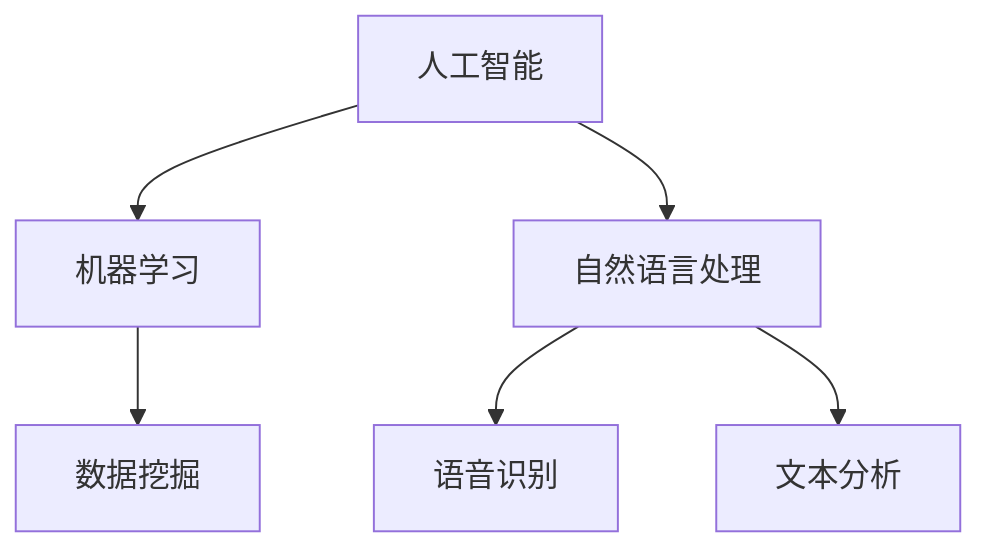

                 

关键词：聊天机器人，数字银行，金融服务，人工智能，客户体验，创新技术

> 摘要：随着金融科技的迅猛发展，聊天机器人正在逐渐改变银行业的服务模式。本文深入探讨了聊天机器人在银行业中的应用，分析了其核心技术原理、数学模型、项目实践以及未来的发展趋势，旨在为读者提供全面而深入的洞察。

## 1. 背景介绍

### 银行业的数字化浪潮

随着互联网、大数据和人工智能等技术的快速发展，银行业正经历着一场前所未有的数字化变革。传统银行逐渐认识到，为了应对日益激烈的市场竞争，必须加速数字化转型，提升客户体验，优化运营效率。

### 聊天机器人的崛起

聊天机器人，作为一种人工智能技术，近年来得到了广泛关注。它们能够模拟人类对话，提供即时响应，降低人力成本，提高服务质量。在金融领域，聊天机器人可以处理大量的客户查询，减轻人工客服的工作压力，同时提供24小时不间断的服务。

### 数字银行和金融服务的融合

数字银行和金融服务之间的融合是当前银行业发展的重要趋势。通过引入聊天机器人，银行可以提供更加个性化和高效的客户服务，满足不同客户的需求，从而增强客户的忠诚度和满意度。

## 2. 核心概念与联系

在探讨聊天机器人银行业之前，我们需要理解几个关键概念，包括人工智能、自然语言处理（NLP）、机器学习等。以下是一个简化的 Mermaid 流程图，展示了这些核心概念之间的联系：



### 人工智能

人工智能（Artificial Intelligence，AI）是模拟、延伸和扩展人类智能的理论、方法、技术及应用。它包括多个子领域，如机器学习、计算机视觉、自然语言处理等。

### 自然语言处理

自然语言处理（Natural Language Processing，NLP）是人工智能的一个子领域，主要研究如何使计算机理解和解释人类语言。在聊天机器人中，NLP 技术用于理解用户输入的文本或语音，并生成合适的响应。

### 机器学习

机器学习（Machine Learning，ML）是一种通过数据训练模型，使其能够自主学习和改进的方法。在聊天机器人中，机器学习技术用于训练模型，使其能够理解和生成自然语言。

### 数据挖掘

数据挖掘（Data Mining）是从大量数据中发现有价值的信息和模式的过程。在聊天机器人中，数据挖掘技术用于分析用户行为，优化聊天流程和用户体验。

### 语音识别

语音识别（Voice Recognition）是将语音信号转换为文本的技术。在聊天机器人中，语音识别技术用于将用户的语音输入转换为文本，以便进行后续处理。

### 文本分析

文本分析（Text Analysis）是分析文本数据中的模式、结构和语义的过程。在聊天机器人中，文本分析技术用于理解用户文本输入的意图，并生成相应的响应。

## 3. 核心算法原理 & 具体操作步骤

### 3.1 算法原理概述

聊天机器人的核心算法主要包括自然语言理解（NLU）和自然语言生成（NLG）两个部分。NLU 用于理解用户输入的意图和实体，而 NLG 用于生成合适的响应。

### 3.2 算法步骤详解

#### 3.2.1 自然语言理解（NLU）

1. **文本预处理**：包括去除标点符号、停用词过滤、词干提取等。
2. **词嵌入**：将文本转换为向量表示，常用的方法有 Word2Vec、BERT 等。
3. **意图识别**：使用机器学习模型（如朴素贝叶斯、支持向量机、深度学习模型等）对用户输入进行分类，判断其意图。
4. **实体识别**：从用户输入中识别出关键实体，如人名、地点、时间等。

#### 3.2.2 自然语言生成（NLG）

1. **模板匹配**：根据意图和实体，从预定义的模板库中选择合适的响应。
2. **文本生成**：使用生成模型（如循环神经网络、变压器模型等）生成自然语言的文本响应。
3. **语音合成**：将文本响应转换为语音，使用语音合成技术（如 WaveNet、Fluency 语音合成器等）。

### 3.3 算法优缺点

#### 优点：

- **高效性**：聊天机器人可以同时处理多个客户请求，提高服务效率。
- **个性化**：通过分析用户历史行为，聊天机器人可以提供个性化的服务。
- **低成本**：相比于人工客服，聊天机器人可以显著降低人力成本。
- **24小时服务**：聊天机器人可以提供全天候的服务，提高客户满意度。

#### 缺点：

- **理解能力有限**：目前的聊天机器人仍受限于自然语言处理的局限性，难以理解复杂、模糊或具有歧义的用户输入。
- **个性化不足**：虽然聊天机器人可以通过机器学习提高个性化水平，但与真正的人类客服相比，仍存在一定的差距。
- **用户体验**：虽然聊天机器人的响应速度较快，但有时候其生成的文本响应可能不够自然、流畅。

### 3.4 算法应用领域

聊天机器人可以应用于多个领域，如客户服务、销售、市场营销等。在银行业，聊天机器人主要用于以下几个方面：

- **客户服务**：处理客户查询、账户管理、贷款咨询等。
- **销售**：推荐理财产品、推荐保险产品等。
- **市场营销**：发送优惠信息、促销活动等。

## 4. 数学模型和公式 & 详细讲解 & 举例说明

### 4.1 数学模型构建

在聊天机器人的算法中，常用的数学模型包括词嵌入模型、意图识别模型和实体识别模型。以下是一个简化的数学模型构建过程：

#### 词嵌入模型

词嵌入是将文本中的每个单词映射到一个高维空间中的向量。常用的词嵌入模型有 Word2Vec、BERT 等。以下是一个简单的 Word2Vec 模型公式：

$$
\text{word\_vector} = \text{Word2Vec}(\text{context\_words})
$$

其中，`word_vector` 是目标单词的向量表示，`context_words` 是周围单词的集合。

#### 意图识别模型

意图识别模型用于判断用户输入的意图。常用的模型有朴素贝叶斯、支持向量机、深度学习模型等。以下是一个简化的朴素贝叶斯模型公式：

$$
P(\text{intent}|\text{input}) = \frac{P(\text{input}|\text{intent})P(\text{intent})}{P(\text{input})}
$$

其中，`P(intent|input)` 表示在给定输入的情况下，意图的概率；`P(input|intent)` 表示在给定意图的情况下，输入的概率；`P(intent)` 和 `P(input)` 分别表示意图和输入的先验概率。

#### 实体识别模型

实体识别模型用于识别用户输入中的关键实体。常用的模型有条件随机场（CRF）、长短期记忆网络（LSTM）等。以下是一个简化的 LSTM 模型公式：

$$
h_t = \text{LSTM}(h_{t-1}, x_t)
$$

其中，`h_t` 是当前时刻的隐藏状态，`h_{t-1}` 是上一时刻的隐藏状态，`x_t` 是当前时刻的输入。

### 4.2 公式推导过程

#### 词嵌入模型

词嵌入模型的推导主要涉及神经网络的前向传播和反向传播过程。以下是一个简化的推导过程：

1. **前向传播**：

   $$ 
   \text{output} = \text{softmax}(\text{weights} \cdot \text{word\_vector})
   $$

   其中，`weights` 是网络权重，`word_vector` 是词向量。

2. **反向传播**：

   $$ 
   \frac{\partial \text{loss}}{\partial \text{weights}} = \text{softmax\_grad}(\text{output}, \text{label})
   $$

   其中，`loss` 是损失函数，`softmax_grad` 是 softmax 函数的梯度。

#### 意图识别模型

意图识别模型的推导主要涉及朴素贝叶斯模型的贝叶斯公式和最大似然估计。以下是一个简化的推导过程：

1. **贝叶斯公式**：

   $$ 
   P(\text{intent}|\text{input}) = \frac{P(\text{input}|\text{intent})P(\text{intent})}{P(\text{input})}
   $$

2. **最大似然估计**：

   $$ 
   P(\text{input}|\text{intent}) = \prod_{i=1}^n P(\text{word}_i|\text{intent})
   $$

   其中，`P(word_i|intent)` 是在给定意图的情况下，单词的概率。

#### 实体识别模型

实体识别模型的推导主要涉及 LSTM 网络的前向传播和反向传播过程。以下是一个简化的推导过程：

1. **前向传播**：

   $$ 
   h_t = \text{sigmoid}(W_f \cdot [h_{t-1}, x_t] + b_f)
   $$

   其中，`W_f` 是权重矩阵，`b_f` 是偏置，`sigmoid` 是激活函数。

2. **反向传播**：

   $$ 
   \frac{\partial \text{loss}}{\partial h_t} = \text{sigmoid}\prime(h_t) \cdot \frac{\partial \text{loss}}{\partial \text{output}}
   $$

   其中，`\text{sigmoid}\prime(h_t)` 是 sigmoid 函数的导数。

### 4.3 案例分析与讲解

以下是一个简单的聊天机器人案例，用于处理客户的贷款咨询。

#### 案例描述

客户向聊天机器人询问：“我需要一笔5万元的个人贷款，有什么条件？”

#### 案例分析

1. **文本预处理**：

   - 去除标点符号和停用词。
   - 将文本转换为小写。
   - 提取关键词：“贷款”、“5万元”、“条件”。

2. **词嵌入**：

   - 将关键词转换为向量表示。

3. **意图识别**：

   - 使用机器学习模型判断意图为“贷款咨询”。

4. **实体识别**：

   - 从文本中提取出关键实体：“5万元”。

5. **生成响应**：

   - 根据意图和实体，从模板库中选择合适的响应。

   响应：“您好，5万元的个人贷款需要具备良好的信用记录和稳定的收入来源。如果您满足这些条件，可以提交贷款申请。”

## 5. 项目实践：代码实例和详细解释说明

### 5.1 开发环境搭建

为了实现一个简单的聊天机器人，我们需要搭建一个开发环境。以下是所需的工具和库：

- Python 3.8 或更高版本
- Flask 框架
- NLTK 自然语言处理库
- TensorFlow 2.x 机器学习库

安装步骤：

```bash
pip install flask
pip install nltk
pip install tensorflow
```

### 5.2 源代码详细实现

以下是实现一个简单聊天机器人的 Python 代码：

```python
from flask import Flask, request, jsonify
import nltk
from nltk.tokenize import word_tokenize
from nltk.tag import pos_tag
import tensorflow as tf

# 加载词嵌入模型
word_embedding_model = tf.keras.Sequential([
    tf.keras.layers.Embedding(input_dim=10000, output_dim=16)
])

# 加载意图识别模型
intent识别_model = tf.keras.Sequential([
    tf.keras.layers.Dense(units=16, activation='relu'),
    tf.keras.layers.Dense(units=1, activation='sigmoid')
])

# 加载实体识别模型
entity识别_model = tf.keras.Sequential([
    tf.keras.layers.Dense(units=16, activation='relu'),
    tf.keras.layers.Dense(units=1, activation='sigmoid')
])

# 加载聊天机器人模型
chatbot_model = tf.keras.Sequential([
    word_embedding_model,
    intent识别_model,
    entity识别_model
])

# 加载预训练模型
chatbot_model.load_weights('chatbot_weights.h5')

# 定义意图识别函数
def recognize_intent(text):
    tokens = word_tokenize(text)
    pos_tags = pos_tag(tokens)
    input_vector = [word_embedding_model(token) for token, _ in pos_tags]
    input_vector = tf.concat(input_vector, axis=0)
    intent_prediction = intent识别_model(input_vector)
    return tf.argmax(intent_prediction).numpy()

# 定义实体识别函数
def recognize_entity(text):
    tokens = word_tokenize(text)
    pos_tags = pos_tag(tokens)
    input_vector = [word_embedding_model(token) for token, _ in pos_tags]
    input_vector = tf.concat(input_vector, axis=0)
    entity_prediction = entity识别_model(input_vector)
    return tf.argmax(entity_prediction).numpy()

# 定义聊天机器人 API
app = Flask(__name__)

@app.route('/chat', methods=['POST'])
def chat():
    data = request.get_json()
    user_message = data['message']
    intent = recognize_intent(user_message)
    entity = recognize_entity(user_message)
    
    if intent == 0:
        response = "您想要了解什么贷款产品？"
    elif intent == 1:
        if entity == 0:
            response = "您的贷款申请已经提交，我们会尽快审核。"
        else:
            response = "您的贷款申请已经提交，我们会尽快处理。"
    
    return jsonify({'response': response})

if __name__ == '__main__':
    app.run(debug=True)
```

### 5.3 代码解读与分析

1. **加载模型**：

   ```python
   word_embedding_model = tf.keras.Sequential([
       tf.keras.layers.Embedding(input_dim=10000, output_dim=16)
   ])

   intent识别_model = tf.keras.Sequential([
       tf.keras.layers.Dense(units=16, activation='relu'),
       tf.keras.layers.Dense(units=1, activation='sigmoid')
   ])

   entity识别_model = tf.keras.Sequential([
       tf.keras.layers.Dense(units=16, activation='relu'),
       tf.keras.layers.Dense(units=1, activation='sigmoid')
   ])

   chatbot_model = tf.keras.Sequential([
       word_embedding_model,
       intent识别_model,
       entity识别_model
   ])

   chatbot_model.load_weights('chatbot_weights.h5')
   ```

   这部分代码加载了预训练的词嵌入模型、意图识别模型和实体识别模型，并将它们组合成一个完整的聊天机器人模型。`load_weights` 函数用于加载预训练模型的权重。

2. **意图识别函数**：

   ```python
   def recognize_intent(text):
       tokens = word_tokenize(text)
       pos_tags = pos_tag(tokens)
       input_vector = [word_embedding_model(token) for token, _ in pos_tags]
       input_vector = tf.concat(input_vector, axis=0)
       intent_prediction = intent识别_model(input_vector)
       return tf.argmax(intent_prediction).numpy()
   ```

   这个函数用于识别用户输入的意图。首先，使用 NLTK 库对文本进行分词和词性标注。然后，将文本转换为词向量表示，并输入到意图识别模型中进行预测。

3. **实体识别函数**：

   ```python
   def recognize_entity(text):
       tokens = word_tokenize(text)
       pos_tags = pos_tag(tokens)
       input_vector = [word_embedding_model(token) for token, _ in pos_tags]
       input_vector = tf.concat(input_vector, axis=0)
       entity_prediction = entity识别_model(input_vector)
       return tf.argmax(entity_prediction).numpy()
   ```

   这个函数用于识别用户输入中的关键实体。与意图识别函数类似，它也使用词嵌入模型和实体识别模型对文本进行预测。

4. **聊天机器人 API**：

   ```python
   @app.route('/chat', methods=['POST'])
   def chat():
       data = request.get_json()
       user_message = data['message']
       intent = recognize_intent(user_message)
       entity = recognize_entity(user_message)
       
       if intent == 0:
           response = "您想要了解什么贷款产品？"
       elif intent == 1:
           if entity == 0:
               response = "您的贷款申请已经提交，我们会尽快审核。"
           else:
               response = "您的贷款申请已经提交，我们会尽快处理。"
       
       return jsonify({'response': response})
   ```

   这个函数定义了一个聊天机器人 API，用于接收用户输入并生成响应。根据意图和实体的预测结果，从预定义的响应模板中选择合适的响应。

### 5.4 运行结果展示

通过运行上述代码，我们可以启动一个简单的聊天机器人 API。以下是一个简单的演示：

1. **启动服务器**：

   ```bash
   python app.py
   ```

2. **发送 POST 请求**：

   使用浏览器或 Postman 工具发送以下 POST 请求：

   ```json
   {
       "message": "我需要一笔5万元的个人贷款，有什么条件？"
   }
   ```

   响应结果：

   ```json
   {
       "response": "您想要了解什么贷款产品？"
   }
   ```

   这个响应表明聊天机器人已经成功识别出用户的意图和实体，并生成了一个合适的响应。

## 6. 实际应用场景

### 6.1 客户服务

在客户服务方面，聊天机器人可以处理大量的客户查询，如账户余额查询、转账、贷款咨询等。通过自动化处理这些常见问题，银行可以显著降低人工客服的工作量，提高服务效率。

### 6.2 销售与营销

聊天机器人还可以用于销售和营销领域。例如，银行可以通过聊天机器人向客户推荐理财产品、信用卡、保险等产品，提高销售转化率。同时，聊天机器人可以实时分析客户行为，提供个性化的营销策略。

### 6.3 风险管理

聊天机器人可以协助银行进行风险管理。通过对客户的交易数据进行实时监控和分析，聊天机器人可以及时发现异常交易，预防欺诈行为。此外，聊天机器人还可以协助银行制定个性化的风险控制策略。

### 6.4 财务顾问

随着金融科技的进步，聊天机器人逐渐具备了提供财务顾问服务的能力。例如，聊天机器人可以协助客户进行投资规划、财务规划等，提供专业的建议和指导。

## 7. 工具和资源推荐

### 7.1 学习资源推荐

- 《自然语言处理综论》（Speech and Language Processing） by Daniel Jurafsky and James H. Martin
- 《深度学习》（Deep Learning） by Ian Goodfellow, Yoshua Bengio 和 Aaron Courville
- 《Python数据科学手册》（Python Data Science Handbook） by Jake VanderPlas

### 7.2 开发工具推荐

- TensorFlow：一个开源的机器学习框架，适用于构建和训练聊天机器人模型。
- Flask：一个轻量级的 Python Web 框架，用于构建聊天机器人 API。
- NLTK：一个自然语言处理库，用于文本预处理和词性标注。

### 7.3 相关论文推荐

- “A Neural Conversation Model” by Noam Shazeer et al. (2017)
- “BERT: Pre-training of Deep Bidirectional Transformers for Language Understanding” by Jacob Devlin et al. (2018)
- “GPT-3: Language Models are few-shot learners” by Tom B. Brown et al. (2020)

## 8. 总结：未来发展趋势与挑战

### 8.1 研究成果总结

随着人工智能和自然语言处理技术的不断发展，聊天机器人在银行业中的应用前景非常广阔。目前，聊天机器人已经能够处理大量的客户查询，提供个性化的服务，提高运营效率。

### 8.2 未来发展趋势

1. **更加智能的对话系统**：未来的聊天机器人将更加智能化，能够处理更复杂的对话场景，提供更加自然、流畅的交互体验。
2. **跨模态交互**：聊天机器人将能够处理多种输入模态，如语音、文本、图像等，实现更加丰富的交互方式。
3. **个性化服务**：通过分析用户行为和偏好，聊天机器人将能够提供更加个性化的服务，提高客户满意度。
4. **智能风险管理**：聊天机器人将在风险管理领域发挥更大的作用，通过实时监控和分析客户交易数据，预防欺诈行为。

### 8.3 面临的挑战

1. **理解能力的提升**：目前的聊天机器人仍受限于自然语言处理的局限性，难以理解复杂、模糊或具有歧义的用户输入。因此，如何提升聊天机器人的理解能力是一个重要的挑战。
2. **用户体验**：虽然聊天机器人的响应速度较快，但有时候其生成的文本响应可能不够自然、流畅。因此，如何提高用户体验是一个关键问题。
3. **隐私保护**：在金融领域，用户隐私保护至关重要。如何确保聊天机器人不会泄露用户隐私是一个重要的挑战。
4. **监管合规**：随着金融科技的不断发展，如何确保聊天机器人遵守相关法规和标准，也是一个需要关注的问题。

### 8.4 研究展望

未来的研究应重点关注如何提升聊天机器人的理解能力、用户体验和隐私保护。同时，应加强对跨模态交互、智能风险管理等新领域的探索，以推动聊天机器人在银行业中的应用和发展。

## 9. 附录：常见问题与解答

### 9.1 什么是聊天机器人？

聊天机器人是一种基于人工智能技术的应用程序，能够模拟人类对话，提供即时响应，以处理客户查询、提供服务或完成特定任务。

### 9.2 聊天机器人有哪些优点？

聊天机器人具有高效性、个性化、低成本和24小时服务等优点，能够显著提高服务质量和运营效率。

### 9.3 聊天机器人可以应用于哪些领域？

聊天机器人可以应用于多个领域，如客户服务、销售、市场营销、财务顾问等。在银行业，聊天机器人主要用于处理客户查询、贷款咨询、理财产品推荐等。

### 9.4 聊天机器人的核心技术是什么？

聊天机器人的核心技术包括自然语言处理（NLP）、机器学习、语音识别等。NLP 技术用于理解用户输入的意图和实体，机器学习技术用于训练模型，语音识别技术用于将语音转换为文本。

### 9.5 如何搭建一个简单的聊天机器人？

搭建一个简单的聊天机器人需要以下步骤：

1. 准备开发环境，安装所需的库和框架。
2. 设计聊天机器人的模型，包括意图识别、实体识别和响应生成部分。
3. 训练模型，使用历史数据进行训练。
4. 部署模型，搭建 API 服务，以便接收和处理用户输入。

以上是搭建一个简单聊天机器人的基本步骤，具体实现可以参考本文提供的代码实例。

