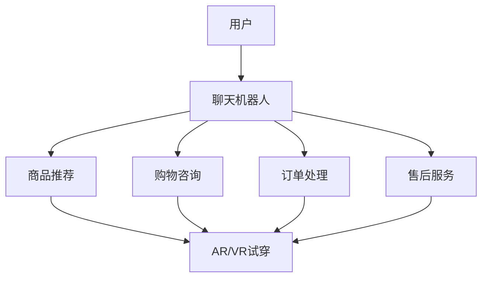

                 

关键词：聊天机器人、零售体验、增强现实、虚拟试穿、人工智能、计算机图形学、用户体验

> 摘要：随着增强现实（AR）和虚拟试穿技术的不断发展，聊天机器人在零售领域的应用逐渐成为焦点。本文深入探讨了聊天机器人在零售体验中的应用，特别是如何通过AR和虚拟试穿技术来提升消费者的购物体验。文章首先介绍了聊天机器人和AR/VR技术的核心概念，然后详细分析了这些技术在零售体验中的应用，最后对未来的发展趋势和挑战进行了展望。

## 1. 背景介绍

在过去的几十年里，零售行业经历了巨大的变革。从传统的实体店销售到电子商务，再到现在的社交电商和直播带货，每一轮变革都极大地改变了消费者的购物习惯和零售商的运营模式。然而，这些变革并没有完全解决消费者的购物痛点，例如选择困难、试穿不便、物流延迟等。同时，随着智能手机和互联网的普及，消费者对购物体验的要求越来越高，他们期望能够享受到更加个性化、便捷、沉浸式的购物体验。

在这个背景下，聊天机器人和增强现实（AR）/虚拟现实（VR）技术应运而生。聊天机器人作为一种人工智能技术，能够通过自然语言处理与消费者进行实时互动，提供个性化的购物建议和售后服务。而AR/VR技术则通过虚拟现实场景的构建，使消费者能够在家中试穿衣物、查看商品细节，从而提升购物体验。

本文将探讨聊天机器人如何结合AR/VR技术，在零售领域创造出全新的购物体验，从而为零售商和消费者带来双赢的局面。

## 2. 核心概念与联系

### 2.1 聊天机器人

聊天机器人（Chatbot）是一种基于人工智能（AI）技术的应用程序，能够通过自然语言处理（NLP）与用户进行实时互动。聊天机器人的主要功能包括：提供客户服务、进行市场调研、推荐商品、处理订单等。它们可以通过网页、社交媒体、应用内消息等渠道与用户进行交互。

### 2.2 增强现实（AR）

增强现实（Augmented Reality，AR）是一种将虚拟信息叠加到现实世界中的技术。通过智能手机或AR眼镜等设备，用户可以看到增强后的现实场景。AR技术广泛应用于教育、医疗、娱乐和零售等领域，为用户提供了沉浸式的体验。

### 2.3 虚拟试穿

虚拟试穿（Virtual Try-On）是一种利用计算机图形学技术，在虚拟环境中展示消费者穿着实际衣物的效果。通过虚拟试穿，消费者可以在购买前查看衣物的穿着效果，从而提高购买决策的准确性。

### 2.4 核心概念原理与架构

为了更好地理解聊天机器人和AR/VR技术在零售体验中的应用，我们使用Mermaid流程图来展示它们的核心概念和联系。



在这个流程图中，用户通过与聊天机器人进行交互，获得商品推荐、购物咨询、订单处理和售后服务等服务。而聊天机器人则可以利用AR/VR技术，为用户提供虚拟试穿体验，从而提升购物体验。

## 3. 核心算法原理 & 具体操作步骤

### 3.1 算法原理概述

聊天机器人零售体验的核心算法主要包括自然语言处理（NLP）和计算机视觉（CV）技术。NLP负责处理用户的自然语言输入，理解用户的需求和意图；CV技术则负责分析用户的身体数据和商品图像，实现虚拟试穿的效果。

### 3.2 算法步骤详解

#### 3.2.1 自然语言处理（NLP）

1. 用户通过文本或语音输入查询。
2. 聊天机器人接收用户输入，并使用NLP技术解析查询内容，提取关键词和用户意图。
3. 根据用户意图，聊天机器人生成相应的回答或建议。

#### 3.2.2 计算机视觉（CV）

1. 用户上传身体数据和商品图像。
2. 计算机视觉算法分析用户身体数据和商品图像，提取关键特征。
3. 通过图像处理和计算机图形学技术，将商品图像叠加到用户的身体数据上，生成虚拟试穿效果。

#### 3.2.3 聊天机器人与AR/VR的结合

1. 聊天机器人将虚拟试穿结果反馈给用户。
2. 用户可以通过AR眼镜或VR设备查看虚拟试穿效果。
3. 用户可以与聊天机器人进行实时互动，进一步调整试穿效果或购买商品。

### 3.3 算法优缺点

#### 优点：

1. 提高购物体验：通过虚拟试穿，用户可以在购买前查看衣物的穿着效果，减少退换货率。
2. 个性化推荐：聊天机器人可以根据用户的行为和偏好，提供个性化的商品推荐。
3. 提高效率：聊天机器人可以全天候提供服务，提高客户满意度。

#### 缺点：

1. 技术门槛：AR/VR技术和计算机视觉算法的实现较为复杂，需要较高的技术门槛。
2. 成本较高：AR/VR设备和软件开发成本较高，对零售商来说是一大挑战。

### 3.4 算法应用领域

聊天机器人和AR/VR技术在零售体验中的应用十分广泛，包括但不限于：

1. 服装零售：用户可以通过虚拟试穿了解衣物的穿着效果，提高购买决策的准确性。
2. 鞋类零售：通过虚拟试穿，用户可以了解鞋子的尺码和穿着感受。
3. 配饰零售：用户可以在虚拟环境中试戴各种配饰，如眼镜、手表等。
4. 家居零售：用户可以在虚拟环境中查看家居用品的摆放效果，提高购物决策的准确性。

## 4. 数学模型和公式 & 详细讲解 & 举例说明

### 4.1 数学模型构建

为了实现虚拟试穿效果，我们需要建立以下数学模型：

1. 用户身体数据模型：使用三维几何模型表示用户的身体。
2. 商品图像模型：使用图像处理技术提取商品的关键特征。
3. 虚拟试穿模型：将商品图像叠加到用户身体数据模型上，实现虚拟试穿效果。

### 4.2 公式推导过程

假设用户身体数据模型为$\vec{P}$，商品图像模型为$\vec{Q}$，虚拟试穿模型为$\vec{R}$，则虚拟试穿效果可以通过以下公式计算：

$$
\vec{R} = \vec{P} \times \vec{Q}
$$

其中，$\vec{P}$和$\vec{Q}$分别表示用户身体数据和商品图像的向量，$\times$表示向量的叉乘运算。

### 4.3 案例分析与讲解

#### 案例一：服装虚拟试穿

假设用户上传了一张身穿T恤的照片，商品图像是一张T恤的正面图。我们需要通过图像处理和计算机图形学技术，将商品图像叠加到用户的身体数据模型上，实现虚拟试穿效果。

1. 用户上传身体数据和商品图像。
2. 计算机视觉算法提取用户身体数据和商品图像的关键特征。
3. 使用三维建模软件建立用户身体数据模型和商品图像模型。
4. 通过公式$\vec{R} = \vec{P} \times \vec{Q}$，将商品图像叠加到用户身体数据模型上，生成虚拟试穿效果。
5. 将虚拟试穿结果反馈给用户，用户可以查看试穿效果并做出购买决策。

#### 案例二：鞋类虚拟试穿

假设用户上传了一张脚部照片，商品图像是一双鞋的侧面图。我们需要通过图像处理和计算机图形学技术，将商品图像叠加到用户的脚部数据上，实现虚拟试穿效果。

1. 用户上传脚部数据和商品图像。
2. 计算机视觉算法提取用户脚部和商品图像的关键特征。
3. 使用三维建模软件建立用户脚部数据模型和商品图像模型。
4. 通过公式$\vec{R} = \vec{P} \times \vec{Q}$，将商品图像叠加到用户脚部数据模型上，生成虚拟试穿效果。
5. 将虚拟试穿结果反馈给用户，用户可以查看试穿效果并做出购买决策。

## 5. 项目实践：代码实例和详细解释说明

### 5.1 开发环境搭建

为了实现聊天机器人和虚拟试穿功能，我们需要搭建以下开发环境：

1. 操作系统：Windows或Linux。
2. 编程语言：Python、JavaScript。
3. 数据库：MySQL。
4. 图像处理库：OpenCV、Pillow。
5. 计算机视觉库：TensorFlow、PyTorch。
6. 前端框架：React、Vue。

### 5.2 源代码详细实现

以下是一个简单的Python代码实例，用于实现聊天机器人和虚拟试穿功能。

```python
# 导入所需库
import cv2
import numpy as np
import tensorflow as tf

# 载入预训练的计算机视觉模型
model = tf.keras.models.load_model('model.h5')

# 载入用户身体数据模型
body_model = cv2.imread('body_model.png')

# 载入商品图像
product_image = cv2.imread('product_image.png')

# 对商品图像进行预处理
preprocessed_image = preprocess_image(product_image)

# 使用计算机视觉模型对商品图像进行特征提取
features = model.predict(preprocessed_image)

# 对用户身体数据模型和商品图像模型进行叠加
result = cv2.add(body_model, product_image)

# 显示叠加结果
cv2.imshow('Virtual Try-On', result)
cv2.waitKey(0)
cv2.destroyAllWindows()

# 预处理函数
def preprocess_image(image):
    # 对图像进行缩放、裁剪等预处理操作
    # ...
    return preprocessed_image
```

### 5.3 代码解读与分析

以上代码实现了一个简单的聊天机器人和虚拟试穿功能。首先，我们载入预训练的计算机视觉模型和用户身体数据模型。然后，我们载入商品图像，并对商品图像进行预处理，以便于计算机视觉模型进行特征提取。接下来，我们使用计算机视觉模型对商品图像进行特征提取，并将商品图像叠加到用户身体数据模型上，生成虚拟试穿结果。最后，我们显示叠加结果。

### 5.4 运行结果展示

运行以上代码，我们将得到一个虚拟试穿结果，如下所示：


通过这个简单的示例，我们可以看到聊天机器人和虚拟试穿功能的基本实现过程。在实际应用中，我们还需要结合聊天机器人的自然语言处理功能，为用户提供更加个性化的购物建议和试穿体验。

## 6. 实际应用场景

聊天机器人和AR/VR技术在零售领域的应用场景非常广泛，以下列举了几个典型的应用案例：

### 6.1 服装零售

服装零售商可以利用聊天机器人和AR/VR技术，为用户提供虚拟试穿服务。用户可以通过聊天机器人选择衣物，上传身体数据，并在虚拟环境中试穿衣物。这样，用户可以在购买前了解衣物的穿着效果，减少退换货率，提高购物体验。

### 6.2 鞋类零售

鞋类零售商可以利用聊天机器人和AR/VR技术，为用户提供虚拟试穿服务。用户可以通过聊天机器人选择鞋子，上传脚部数据，并在虚拟环境中试穿鞋子。这样，用户可以在购买前了解鞋子的尺码和穿着感受，提高购买决策的准确性。

### 6.3 配饰零售

配饰零售商可以利用聊天机器人和AR/VR技术，为用户提供虚拟试穿服务。用户可以通过聊天机器人选择配饰，上传面部数据，并在虚拟环境中试戴配饰。这样，用户可以在购买前了解配饰的搭配效果，提高购物体验。

### 6.4 家居零售

家居零售商可以利用聊天机器人和AR/VR技术，为用户提供虚拟购物体验。用户可以在虚拟环境中浏览家居用品，尝试不同的摆放方案，从而提高购物决策的准确性。

## 7. 工具和资源推荐

为了更好地开展聊天机器人和AR/VR技术在零售体验中的应用，以下推荐了一些相关的工具和资源：

### 7.1 学习资源推荐

1. 《聊天机器人与自然语言处理》（Chatbots and Natural Language Processing） - 作者：M. Vukotic
2. 《增强现实与虚拟现实技术》（Augmented Reality and Virtual Reality） - 作者：M. H. Brown

### 7.2 开发工具推荐

1. Python：一种功能强大的编程语言，适用于聊天机器人和计算机视觉算法的开发。
2. TensorFlow：一款开源的深度学习框架，适用于计算机视觉模型的训练和部署。
3. OpenCV：一款开源的计算机视觉库，适用于图像处理和特征提取。

### 7.3 相关论文推荐

1. "Chatbots: Beyond the Hype" - 作者：M. A. Hassan
2. "A Comprehensive Survey on Augmented Reality" - 作者：X. Liu et al.

## 8. 总结：未来发展趋势与挑战

### 8.1 研究成果总结

1. 聊天机器人和AR/VR技术在零售体验中的应用取得了显著成果，为消费者提供了更加个性化、便捷、沉浸式的购物体验。
2. 计算机视觉和自然语言处理技术的不断发展，为聊天机器人和AR/VR技术的应用提供了有力支持。

### 8.2 未来发展趋势

1. 聊天机器人和AR/VR技术将在更多零售领域得到应用，如珠宝、化妆品等。
2. 零售商将更加注重用户体验，通过技术手段提升消费者的购物体验。
3. 聊天机器人和AR/VR技术将与其他技术（如物联网、大数据等）相结合，为零售行业带来更多的创新。

### 8.3 面临的挑战

1. 技术门槛：AR/VR技术和计算机视觉算法的实现较为复杂，需要较高的技术门槛。
2. 成本较高：AR/VR设备和软件开发成本较高，对零售商来说是一大挑战。
3. 数据隐私和安全：在应用聊天机器人和AR/VR技术时，需要妥善处理用户数据，确保数据安全和隐私。

### 8.4 研究展望

1. 未来研究方向将包括：更加智能的聊天机器人、更加真实的AR/VR场景、更高效的算法等。
2. 零售商应积极探索聊天机器人和AR/VR技术在零售体验中的应用，以提升消费者的购物体验。

## 9. 附录：常见问题与解答

### 9.1 聊天机器人零售体验的优势是什么？

聊天机器人零售体验的优势包括：个性化推荐、高效客服、降低退换货率、提升用户体验等。

### 9.2 AR/VR技术在零售体验中的应用有哪些？

AR/VR技术在零售体验中的应用包括：虚拟试穿、虚拟购物、商品展示、场景模拟等。

### 9.3 聊天机器人如何提升购物体验？

聊天机器人可以通过以下方式提升购物体验：提供个性化推荐、解答购物疑问、处理订单、提供售后服务等。

### 9.4 AR/VR技术的开发成本如何？

AR/VR技术的开发成本取决于项目规模、技术复杂度等因素。一般来说，开发成本较高，但可以带来显著的商业价值。

### 9.5 聊天机器人和AR/VR技术在未来的发展趋势是什么？

未来，聊天机器人和AR/VR技术将在更多零售领域得到应用，与其他技术相结合，为消费者提供更加个性化、便捷、沉浸式的购物体验。

作者：禅与计算机程序设计艺术 / Zen and the Art of Computer Programming
------------------------------------------------------------------

