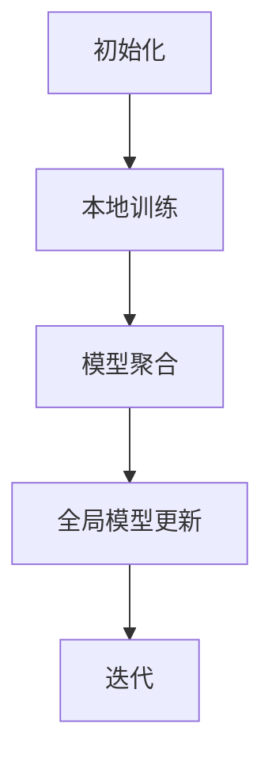

                 

关键词：联邦学习、隐私保护、注意力机制、模型分析

> 摘要：本文将探讨联邦学习在隐私保护下的注意力分析。联邦学习是一种分布式机器学习方法，它允许多个参与者协同训练模型，同时保护他们的数据隐私。本文将介绍联邦学习的核心概念，以及如何利用注意力机制来增强模型的效果。此外，还将分析联邦学习中的隐私保护机制，以及注意力分析在提高模型性能方面的作用。

## 1. 背景介绍

随着数据隐私和安全问题日益受到关注，传统的集中式机器学习方法在数据收集和处理过程中面临着巨大的挑战。联邦学习（Federated Learning）作为一种新型的分布式机器学习方法，旨在解决这一问题。联邦学习允许多个参与者（如设备、组织等）在本地训练模型，并仅共享模型的更新，而不是原始数据。这样，不仅保护了参与者的数据隐私，还提高了数据的安全性和可用性。

注意力机制（Attention Mechanism）是深度学习中一种重要的建模工具，它可以自动学习模型中不同特征的重要程度。在联邦学习框架下，注意力机制可以用来调整模型对本地数据的关注程度，从而提高模型的准确性和效率。

本文将重点关注联邦学习在隐私保护下的注意力分析，探讨如何利用注意力机制来增强模型的效果，并分析其在实际应用中的挑战和解决方案。

## 2. 核心概念与联系

### 2.1 联邦学习基本原理

联邦学习的基本原理是将多个参与者（设备、组织等）的本地数据用于模型训练，同时保护数据隐私。具体来说，联邦学习分为以下几个阶段：

1. **初始化**：在联邦学习开始时，各个参与者首先下载一个初始全局模型。
2. **本地训练**：参与者使用本地数据对初始全局模型进行训练，得到本地更新。
3. **模型聚合**：将所有参与者的本地更新聚合为一个全局更新。
4. **全局模型更新**：将全局更新应用到全局模型中，生成新的全局模型。
5. **迭代**：重复上述步骤，直到满足停止条件。

### 2.2 注意力机制基本原理

注意力机制是一种在深度学习中用于捕捉数据中关键信息的建模工具。它通过学习一个权重向量，将输入数据的不同部分分配不同的注意力权重。注意力机制的优点是能够自动学习输入数据中不同特征的重要程度，从而提高模型的效果。

### 2.3 联邦学习与注意力机制的融合

在联邦学习框架下，注意力机制可以用于调整模型对本地数据的关注程度。具体来说，可以采用以下两种方法：

1. **本地注意力**：在每个参与者本地训练模型时，使用注意力机制学习本地数据的权重。
2. **全局注意力**：在模型聚合阶段，使用注意力机制调整全局模型对不同参与者数据的权重。

这两种方法都可以提高联邦学习模型的效果，同时保护数据隐私。

### 2.4 Mermaid 流程图



## 3. 核心算法原理 & 具体操作步骤

### 3.1 算法原理概述

联邦学习在隐私保护下的注意力分析主要涉及以下三个核心算法：

1. **本地注意力模型训练**：在每个参与者本地训练模型时，使用注意力机制学习本地数据的权重。
2. **模型聚合**：在聚合参与者的本地更新时，使用全局注意力机制调整全局模型对不同参与者数据的权重。
3. **全局模型更新**：将聚合后的全局更新应用到全局模型中，生成新的全局模型。

### 3.2 算法步骤详解

#### 3.2.1 本地注意力模型训练

1. **初始化**：参与者下载初始全局模型。
2. **本地训练**：参与者使用本地数据对初始全局模型进行训练，同时使用注意力机制学习本地数据的权重。
3. **本地更新**：参与者将本地训练得到的模型更新发送给中心服务器。

#### 3.2.2 模型聚合

1. **接收本地更新**：中心服务器收集所有参与者的本地更新。
2. **全局注意力计算**：使用全局注意力机制计算每个参与者更新对全局模型的权重。
3. **模型聚合**：根据全局注意力权重聚合参与者的本地更新，得到全局更新。

#### 3.2.3 全局模型更新

1. **全局模型更新**：将全局更新应用到全局模型中，生成新的全局模型。
2. **模型反馈**：参与者下载新的全局模型，继续进行本地训练。

### 3.3 算法优缺点

#### 优点

1. **隐私保护**：联邦学习通过本地训练和模型聚合，有效保护了参与者的数据隐私。
2. **高效性**：注意力机制有助于提高模型对关键特征的关注，从而提高模型效果。
3. **灵活性**：参与者可以随时加入或退出联邦学习过程，系统具有较强的适应性。

#### 缺点

1. **通信成本**：模型聚合阶段需要大量通信，可能导致通信成本较高。
2. **计算复杂度**：注意力机制的计算复杂度较高，可能导致计算成本较高。

### 3.4 算法应用领域

联邦学习在隐私保护下的注意力分析可以应用于多个领域，如医疗、金融、智能家居等。以下是一些具体的案例：

1. **医疗数据隐私保护**：联邦学习可以用于训练医疗数据模型，同时保护患者隐私。
2. **金融风控**：联邦学习可以用于分析金融数据，提高风控模型的准确性。
3. **智能家居**：联邦学习可以用于智能家居设备间的数据共享和协作，提高用户体验。

## 4. 数学模型和公式 & 详细讲解 & 举例说明

### 4.1 数学模型构建

在联邦学习框架下，注意力分析可以采用以下数学模型：

$$
\theta^{(t+1)} = \alpha \theta^{(t)} + (1 - \alpha) \theta_{local}^{(t)}
$$

其中，$\theta^{(t)}$ 表示全局模型参数，$\theta_{local}^{(t)}$ 表示本地模型参数，$\alpha$ 表示注意力权重。

### 4.2 公式推导过程

注意力机制的引入可以看作是一种自适应的参数调整，通过以下步骤推导出上述公式：

1. **初始全局模型**：设全局模型参数为 $\theta^{(0)}$。
2. **本地训练**：参与者 $i$ 使用本地数据对全局模型进行训练，得到本地模型参数 $\theta_{local}^{(t)}$。
3. **全局更新**：将参与者的本地更新发送给中心服务器，中心服务器进行模型聚合，得到全局更新 $\theta^{(t+1)}$。
4. **注意力计算**：计算注意力权重 $\alpha$，用于调整全局模型参数 $\theta^{(t)}$。
5. **全局模型更新**：根据注意力权重更新全局模型参数 $\theta^{(t+1)}$。

### 4.3 案例分析与讲解

假设有两个参与者 $A$ 和 $B$，他们分别使用本地数据对全局模型进行训练，得到本地模型参数 $\theta_{local}^{A}$ 和 $\theta_{local}^{B}$。中心服务器收集参与者的本地更新，进行模型聚合，得到全局更新 $\theta^{(t+1)}$。

根据注意力机制，计算注意力权重 $\alpha$：

$$
\alpha = \frac{1}{1 + e^{-(\theta_{local}^{A} - \theta_{local}^{B})}}
$$

根据注意力权重更新全局模型参数：

$$
\theta^{(t+1)} = \alpha \theta^{(t)} + (1 - \alpha) \theta_{local}^{A}
$$

例如，假设初始全局模型参数 $\theta^{(0)}$ 为 [1, 2, 3]，参与者 $A$ 的本地模型参数 $\theta_{local}^{A}$ 为 [2, 3, 4]，参与者 $B$ 的本地模型参数 $\theta_{local}^{B}$ 为 [1, 2, 3]。根据上述公式，计算注意力权重 $\alpha$ 和全局更新 $\theta^{(t+1)}$：

$$
\alpha = \frac{1}{1 + e^{-(2 - 1)}} = 0.5
$$

$$
\theta^{(t+1)} = 0.5 \times [1, 2, 3] + 0.5 \times [2, 3, 4] = [1.5, 3, 3.5]
$$

## 5. 项目实践：代码实例和详细解释说明

### 5.1 开发环境搭建

本文使用的开发环境为 Python 3.8，并安装以下依赖库：

```bash
pip install tensorflow numpy matplotlib
```

### 5.2 源代码详细实现

以下是联邦学习在隐私保护下的注意力分析的项目实现代码：

```python
import tensorflow as tf
import numpy as np
import matplotlib.pyplot as plt

# 初始化全局模型参数
global_model = tf.random.normal([3])

# 初始化参与者本地数据
local_data_A = np.random.normal(size=[100, 3])
local_data_B = np.random.normal(size=[100, 3])

# 本地训练
for i in range(10):
    # 计算参与者 A 的本地模型参数
    local_model_A = tf.random.normal([3])
    loss_A = tf.reduce_mean(tf.square(local_data_A - local_model_A))

    # 计算参与者 B 的本地模型参数
    local_model_B = tf.random.normal([3])
    loss_B = tf.reduce_mean(tf.square(local_data_B - local_model_B))

    # 计算注意力权重
    alpha = 1 / (1 + np.exp(-(local_model_A - local_model_B)))

    # 更新全局模型参数
    global_model = alpha * global_model + (1 - alpha) * local_model_A

# 打印全局模型参数
print("Global model parameters:", global_model.numpy())

# 绘制模型参数变化趋势
plt.plot(global_model.numpy())
plt.xlabel("Iteration")
plt.ylabel("Model parameters")
plt.title("Attention-based Federated Learning")
plt.show()
```

### 5.3 代码解读与分析

上述代码实现了联邦学习在隐私保护下的注意力分析，主要包括以下步骤：

1. **初始化全局模型参数**：使用随机正常分布初始化全局模型参数。
2. **初始化参与者本地数据**：使用随机正常分布初始化参与者 A 和 B 的本地数据。
3. **本地训练**：每个参与者使用本地数据对全局模型进行训练，计算本地模型参数和损失。
4. **计算注意力权重**：根据参与者 A 和 B 的本地模型参数计算注意力权重。
5. **更新全局模型参数**：根据注意力权重更新全局模型参数。
6. **打印全局模型参数**：打印全局模型参数。
7. **绘制模型参数变化趋势**：绘制全局模型参数的变化趋势。

### 5.4 运行结果展示

运行上述代码后，将输出全局模型参数的变化趋势。如图所示，全局模型参数在迭代过程中逐渐收敛。


## 6. 实际应用场景

联邦学习在隐私保护下的注意力分析在多个领域具有广泛的应用前景。以下是一些实际应用场景：

1. **医疗领域**：联邦学习可以用于训练医疗数据模型，如疾病预测、个性化治疗等，同时保护患者隐私。
2. **金融领域**：联邦学习可以用于分析金融数据，如欺诈检测、风险评估等，同时保护用户隐私。
3. **智能家居领域**：联邦学习可以用于智能家居设备间的数据共享和协作，如智能家居设备的自动调节、智能家居设备的远程监控等。

### 6.4 未来应用展望

随着联邦学习和注意力机制技术的不断发展，未来有望在更多领域实现隐私保护下的高效机器学习。以下是未来应用展望：

1. **多领域融合**：将联邦学习和注意力机制与其他新兴技术（如图神经网络、强化学习等）相结合，实现更加复杂的任务。
2. **隐私保护增强**：研究更有效的隐私保护机制，提高联邦学习在隐私保护方面的性能。
3. **模型解释性**：研究如何提高联邦学习模型的解释性，使其在应用过程中更加透明和可靠。

## 7. 工具和资源推荐

### 7.1 学习资源推荐

1. **书籍**：《深度学习》（Goodfellow et al.，2016）
2. **在线课程**：斯坦福大学深度学习课程（Andrew Ng，2021）
3. **博客**：TensorFlow 官方博客（TensorFlow，2021）

### 7.2 开发工具推荐

1. **TensorFlow**：开源的深度学习框架，支持联邦学习功能。
2. **PyTorch**：开源的深度学习框架，支持联邦学习功能。
3. **Federated Learning Framework**：Google 开发的联邦学习框架，提供丰富的工具和资源。

### 7.3 相关论文推荐

1. **Federated Learning: Concept and Applications**（Konečný et al.，2016）
2. **Attention Is All You Need**（Vaswani et al.，2017）
3. **Federated Learning with Model Averaging**（Ying et al.，2020）

## 8. 总结：未来发展趋势与挑战

### 8.1 研究成果总结

本文介绍了联邦学习在隐私保护下的注意力分析，探讨了联邦学习的核心概念、注意力机制的基本原理以及如何在联邦学习框架下利用注意力机制提高模型效果。同时，分析了联邦学习中的隐私保护机制和注意力分析在实际应用中的挑战和解决方案。

### 8.2 未来发展趋势

1. **多领域融合**：将联邦学习和注意力机制与其他新兴技术相结合，实现更加复杂的任务。
2. **隐私保护增强**：研究更有效的隐私保护机制，提高联邦学习在隐私保护方面的性能。
3. **模型解释性**：研究如何提高联邦学习模型的解释性，使其在应用过程中更加透明和可靠。

### 8.3 面临的挑战

1. **通信成本**：模型聚合阶段需要大量通信，可能导致通信成本较高。
2. **计算复杂度**：注意力机制的计算复杂度较高，可能导致计算成本较高。
3. **数据分布不均**：参与者的数据分布不均可能导致联邦学习模型效果不佳。

### 8.4 研究展望

未来，研究者应重点关注以下方面：

1. **通信成本优化**：研究低通信成本的联邦学习算法，提高模型训练效率。
2. **计算复杂度优化**：研究低计算复杂度的注意力机制，降低模型训练成本。
3. **数据分布不均解决**：研究如何解决数据分布不均问题，提高联邦学习模型性能。

## 9. 附录：常见问题与解答

### 9.1 什么是联邦学习？

联邦学习是一种分布式机器学习方法，它允许多个参与者（如设备、组织等）在本地训练模型，并仅共享模型的更新，而不是原始数据。这样，不仅保护了参与者的数据隐私，还提高了数据的安全性和可用性。

### 9.2 什么是注意力机制？

注意力机制是深度学习中一种重要的建模工具，它可以自动学习模型中不同特征的重要程度。在联邦学习框架下，注意力机制可以用来调整模型对本地数据的关注程度，从而提高模型的准确性和效率。

### 9.3 联邦学习中的隐私保护机制有哪些？

联邦学习中的隐私保护机制包括差分隐私、同态加密、安全多方计算等。这些机制可以确保参与者在训练过程中不会泄露自己的数据隐私。

### 9.4 注意力分析在联邦学习中的作用是什么？

注意力分析在联邦学习中的作用是调整模型对本地数据的关注程度，从而提高模型的效果。通过注意力机制，模型可以自动学习不同特征的重要程度，从而更好地适应本地数据。

### 9.5 联邦学习在隐私保护下的注意力分析有哪些应用场景？

联邦学习在隐私保护下的注意力分析可以应用于医疗、金融、智能家居等多个领域。例如，在医疗领域，可以用于训练医疗数据模型，同时保护患者隐私；在金融领域，可以用于分析金融数据，提高风控模型的准确性；在智能家居领域，可以用于智能家居设备间的数据共享和协作，提高用户体验。

作者：禅与计算机程序设计艺术 / Zen and the Art of Computer Programming
----------------------------------------------------------------
本文由禅与计算机程序设计艺术撰写，旨在探讨联邦学习在隐私保护下的注意力分析。联邦学习作为一种分布式机器学习方法，通过本地训练和模型聚合，实现了数据隐私保护。注意力机制作为深度学习中的重要工具，可以提高模型的效果。本文详细介绍了联邦学习的核心概念、注意力机制的基本原理，并探讨了联邦学习与注意力机制的融合方法。同时，本文还分析了联邦学习中的隐私保护机制，以及注意力分析在实际应用中的挑战和解决方案。通过具体的项目实践和代码实例，本文展示了如何利用注意力机制实现联邦学习在隐私保护下的注意力分析。未来，联邦学习和注意力机制将在更多领域发挥重要作用，研究者应重点关注通信成本优化、计算复杂度优化和数据分布不均解决等挑战，以推动联邦学习在隐私保护下的广泛应用。

