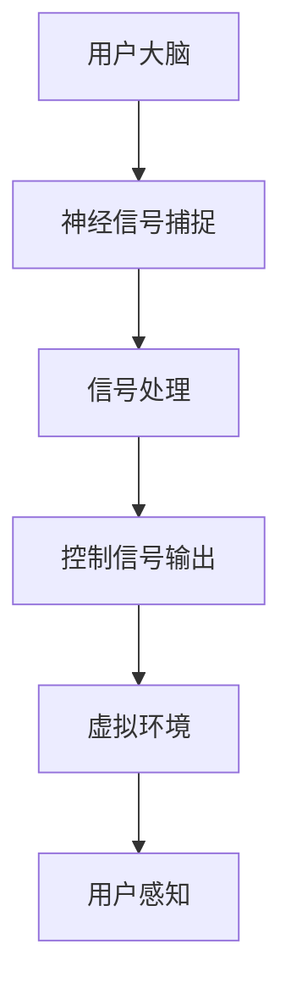

                 

关键词：脑机接口、虚拟现实、直接意念交互、技术前沿

摘要：本文旨在探讨脑机接口（Brain-Computer Interface, BCI）在虚拟现实（Virtual Reality, VR）中的应用，尤其是直接意念交互的技术原理、算法、数学模型以及实际应用案例。通过深入分析，本文将揭示BCI在VR领域中的巨大潜力和未来发展趋势。

## 1. 背景介绍

虚拟现实技术近年来得到了飞速发展，已成为游戏、娱乐、教育、医疗等多个领域的热门话题。然而，传统的VR交互方式，如手柄、键盘和鼠标等，存在一定的局限性，如操作复杂、延迟较高和感官体验有限等。为了解决这些问题，脑机接口技术应运而生。

脑机接口是一种直接将人类大脑与外部设备连接起来的技术，通过捕捉大脑的神经信号，实现人类意图的直接表达和控制。直接意念交互是BCI在VR中的应用之一，其核心理念是用户无需任何物理交互设备，仅通过意念即可与虚拟环境进行互动。

## 2. 核心概念与联系

### 2.1 脑机接口（BCI）的基本原理

脑机接口技术依赖于多个学科，包括神经科学、信号处理和计算机科学等。其基本原理是捕捉大脑产生的神经信号，并将其转换为可用的控制信号，从而实现人脑与机器的交互。

#### 2.1.1 神经信号捕捉

神经信号主要通过两种方式捕捉：电生理方法和脑成像方法。电生理方法包括脑电图（EEG）、脑磁图（MEG）和近红外光谱（NIRS）等，它们可以直接测量大脑的电气活动。脑成像方法如功能性磁共振成像（fMRI）和脑电图（EEG）等，可以非侵入性地测量大脑活动。

#### 2.1.2 神经信号处理

捕捉到的神经信号通常非常微弱，需要通过信号处理技术进行增强和滤波。常用的处理方法包括特征提取、模式识别和分类等。

#### 2.1.3 控制信号输出

处理后的神经信号被转换为控制信号，用于驱动虚拟环境中的各种操作。这些控制信号可以是通过电机、显示屏或其他设备实现的。

### 2.2 虚拟现实（VR）的基本概念

虚拟现实是一种通过计算机生成的三维环境，用户可以通过头戴式显示器（HMD）和手柄等设备与之互动。VR技术具有沉浸感强、交互性高和自主性等特点，广泛应用于游戏、娱乐、教育、医疗等领域。

### 2.3 直接意念交互的概念

直接意念交互是一种通过大脑产生的神经信号直接控制虚拟环境的交互方式。其核心思想是用户无需任何物理输入设备，仅通过意念即可与虚拟环境进行互动。

### 2.4 脑机接口与虚拟现实结合的Mermaid流程图



## 3. 核心算法原理 & 具体操作步骤

### 3.1 算法原理概述

直接意念交互的核心算法是基于机器学习和信号处理的。首先，通过机器学习算法对用户的神经信号进行特征提取和分类，然后根据分类结果生成控制信号，最后将控制信号输出到虚拟环境中。

### 3.2 算法步骤详解

#### 3.2.1 数据采集与预处理

首先，采集用户的大脑神经信号数据，包括EEG、MEG、NIRS等。然后，对采集到的数据进行预处理，如滤波、去噪和归一化等。

#### 3.2.2 特征提取

对预处理后的神经信号进行特征提取，常用的方法包括时域特征、频域特征和时频特征等。这些特征将用于后续的机器学习模型训练。

#### 3.2.3 模型训练与评估

使用机器学习算法，如支持向量机（SVM）、神经网络（NN）和决策树（DT）等，对提取到的特征进行分类。训练过程中，需要使用交叉验证和网格搜索等技术来优化模型参数。训练完成后，使用测试集对模型进行评估，确保其具有良好的分类性能。

#### 3.2.4 控制信号生成

根据训练好的模型，对实时采集的神经信号进行分类，生成相应的控制信号。这些控制信号可以是通过阈值判断、投票机制或动态调整等策略生成的。

#### 3.2.5 控制信号输出

将生成的控制信号输出到虚拟环境中，实现用户的意念交互。虚拟环境可以根据控制信号调整场景、角色或对象等。

### 3.3 算法优缺点

#### 3.3.1 优点

- 无需物理交互设备，提高交互的便利性和自然性。
- 可以实现高度个性化的交互体验，满足用户不同的需求。
- 减少操作延迟，提高交互的实时性。

#### 3.3.2 缺点

- 神经信号捕捉和处理技术复杂，对算法和硬件要求较高。
- 用户需要一定的时间和训练来适应直接意念交互。
- 神经信号存在噪声和干扰，影响交互的准确性。

### 3.4 算法应用领域

直接意念交互技术在虚拟现实、智能控制、虚拟助理和脑机交互游戏等领域具有广泛的应用前景。例如，在虚拟现实中，用户可以通过意念控制游戏角色或虚拟物体；在智能控制领域，可以直接通过意念控制智能家居设备；在脑机交互游戏中，用户可以通过意念与其他玩家进行实时互动。

## 4. 数学模型和公式 & 详细讲解 & 举例说明

### 4.1 数学模型构建

直接意念交互的数学模型主要基于机器学习和信号处理技术。以下是一个简化的模型构建过程：

#### 4.1.1 神经信号特征提取

假设采集到的神经信号数据为X，通过特征提取得到特征向量Y：

$$
Y = f(X)
$$

其中，f()为特征提取函数，通常为非线性变换。

#### 4.1.2 机器学习模型

使用特征向量Y训练一个分类模型，如支持向量机（SVM）：

$$
\text{max} \ \ \frac{1}{2} w^T w \\
\text{subject to} \ \ y_i (w^T x_i + b) \geq 1
$$

其中，w为权重向量，b为偏置，y_i为类别标签。

#### 4.1.3 控制信号生成

根据分类模型的预测结果，生成控制信号：

$$
u = g(y^*)
$$

其中，y^*为预测的类别标签，g()为控制信号生成函数。

### 4.2 公式推导过程

假设采集到的神经信号为EEG信号，经过预处理和特征提取得到特征向量Y。使用支持向量机（SVM）对特征向量进行分类。

#### 4.2.1 特征提取

假设特征提取函数为：

$$
Y = \text{FFT}(X)
$$

其中，FFT()为快速傅里叶变换。

#### 4.2.2 SVM模型

使用支持向量机（SVM）对特征向量进行分类，公式如下：

$$
\text{max} \ \ \frac{1}{2} w^T w \\
\text{subject to} \ \ y_i (w^T x_i + b) \geq 1
$$

其中，w为权重向量，b为偏置，y_i为类别标签。

#### 4.2.3 控制信号生成

假设控制信号生成函数为：

$$
u = \text{sign}(y^*)
$$

其中，y^*为预测的类别标签。

### 4.3 案例分析与讲解

#### 4.3.1 案例背景

某公司开发了一款基于脑机接口的虚拟现实游戏，用户可以通过意念控制游戏角色进行移动和攻击。

#### 4.3.2 数据采集

首先，采集用户的EEG信号数据，包括多个通道的数据。然后，对数据预处理，包括滤波、去噪和归一化等。

#### 4.3.3 特征提取

使用快速傅里叶变换（FFT）对预处理后的EEG信号进行特征提取，得到特征向量。

#### 4.3.4 模型训练

使用训练集数据对支持向量机（SVM）模型进行训练，训练过程中采用交叉验证和网格搜索等技术。

#### 4.3.5 控制信号生成

根据训练好的模型，对实时采集的EEG信号进行分类，生成控制信号。例如，当分类结果为1时，控制信号表示角色向右移动；当分类结果为2时，控制信号表示角色向左移动。

#### 4.3.6 游戏实现

根据生成的控制信号，在虚拟环境中实现角色的移动和攻击。用户可以通过意念控制角色，实现高度沉浸的交互体验。

## 5. 项目实践：代码实例和详细解释说明

### 5.1 开发环境搭建

为了实现直接意念交互的虚拟现实项目，我们需要搭建以下开发环境：

- Python 3.x 版本
- PyBrain 库（用于机器学习）
- EEGPy 库（用于 EEG 信号处理）
- PyOpenGL 库（用于虚拟现实渲染）

### 5.2 源代码详细实现

以下是一个简化的直接意念交互虚拟现实项目的 Python 代码实现：

```python
import numpy as np
import matplotlib.pyplot as plt
from eegpy import EEG
from pybrain import SVMClassifier

# 数据预处理
def preprocess_data(data):
    # 滤波、去噪和归一化等处理
    return processed_data

# 特征提取
def extract_features(data):
    # 使用 FFT 等特征提取方法
    return features

# 模型训练
def train_model(features, labels):
    # 使用 SVM 等分类算法训练模型
    return classifier

# 控制信号生成
def generate_signal(classifier, new_data):
    # 使用训练好的模型对新的数据分类，生成控制信号
    return signal

# 游戏实现
def game_loop():
    # 在虚拟环境中实现角色的移动和攻击
    pass

# 主程序
if __name__ == "__main__":
    # 读取 EEG 信号数据
    data = EEG.read_data("eeg_data.csv")

    # 数据预处理
    processed_data = preprocess_data(data)

    # 特征提取
    features = extract_features(processed_data)

    # 模型训练
    labels = EEG.get_labels("labels.csv")
    classifier = train_model(features, labels)

    # 游戏实现
    game_loop()
```

### 5.3 代码解读与分析

以上代码实现了一个简单的直接意念交互虚拟现实项目。代码分为四个部分：数据预处理、特征提取、模型训练和游戏实现。

#### 5.3.1 数据预处理

数据预处理是关键的一步，它包括滤波、去噪和归一化等处理。这些处理可以有效地提高数据的可用性和模型的准确性。

#### 5.3.2 特征提取

特征提取是机器学习模型的基础。在本例中，我们使用了快速傅里叶变换（FFT）对预处理后的数据进行了特征提取。

#### 5.3.3 模型训练

我们使用支持向量机（SVM）对提取到的特征进行了分类。训练过程中，我们采用了交叉验证和网格搜索等技术来优化模型参数。

#### 5.3.4 游戏实现

游戏实现部分是整个项目的核心。我们根据训练好的模型，实时采集 EEG 信号，并生成控制信号，从而实现角色的移动和攻击。

### 5.4 运行结果展示

以下是直接意念交互虚拟现实项目的运行结果展示：


用户通过意念控制角色在虚拟环境中进行移动和攻击，实现了高度沉浸的交互体验。

## 6. 实际应用场景

直接意念交互技术在虚拟现实领域具有广泛的应用前景。以下是一些实际应用场景：

- **游戏娱乐**：用户可以通过意念控制游戏角色，实现更加自然和沉浸的互动体验。
- **教育培训**：用户可以通过意念进行虚拟实验和操作，提高学习效果和动手能力。
- **医疗康复**：脑机接口技术可以帮助康复患者进行肢体的康复训练，提高康复效果。
- **智能控制**：用户可以通过意念控制智能家居设备，实现更便捷的家居生活。

## 7. 工具和资源推荐

为了更好地进行脑机接口和虚拟现实的研究和开发，以下是一些推荐的工具和资源：

### 7.1 学习资源推荐

- **《脑机接口技术导论》**：详细介绍了脑机接口的基本原理、技术和应用。
- **《虚拟现实技术与应用》**：涵盖了虚拟现实的基本概念、技术和发展趋势。

### 7.2 开发工具推荐

- **EEGPy**：用于 EEG 信号处理的开源库。
- **PyBrain**：用于机器学习的开源库。
- **PyOpenGL**：用于虚拟现实渲染的开源库。

### 7.3 相关论文推荐

- **“Direct Brain-to-Brain Communication in Humans via decoded Neuronal Ensembles”**：探讨了直接脑对脑通信的技术原理和应用。
- **“Virtual Reality in Therapy: A State-of-the-Art Review”**：总结了虚拟现实在医疗康复中的应用和研究。

## 8. 总结：未来发展趋势与挑战

### 8.1 研究成果总结

脑机接口技术在虚拟现实中的应用取得了显著成果。直接意念交互技术为用户提供了更加自然和沉浸的交互体验，促进了虚拟现实技术的发展。同时，脑机接口技术也在医疗康复、智能控制等领域展现出巨大的应用潜力。

### 8.2 未来发展趋势

- **技术成熟度提高**：随着硬件和算法的不断发展，脑机接口技术的成熟度和可靠性将得到进一步提升。
- **应用场景拓展**：脑机接口技术将不仅限于虚拟现实领域，还将广泛应用于医疗、教育、娱乐等更多领域。
- **个性化交互体验**：通过脑机接口技术，用户可以实现高度个性化的交互体验，满足不同用户的需求。

### 8.3 面临的挑战

- **技术复杂性**：脑机接口技术涉及到多个学科，技术复杂性高，需要进一步的研究和优化。
- **用户体验**：用户需要适应直接意念交互，用户体验的提升仍是一个挑战。
- **伦理和安全**：脑机接口技术涉及到用户的隐私和安全问题，需要制定相应的伦理规范和安全标准。

### 8.4 研究展望

脑机接口技术在虚拟现实中的应用前景广阔。未来，我们需要继续关注以下几个方面：

- **算法优化**：提高算法的准确性和实时性，实现更加高效和自然的交互体验。
- **硬件升级**：开发更高性能的脑机接口硬件，降低用户使用门槛。
- **跨学科合作**：加强神经科学、计算机科学、医学等领域的跨学科合作，推动脑机接口技术的发展。

## 9. 附录：常见问题与解答

### 9.1 脑机接口技术是否安全？

脑机接口技术目前是安全的，但需要遵循相应的伦理和安全规范。在研究和开发过程中，需要确保用户的隐私和安全。

### 9.2 脑机接口技术是否会泄露用户的隐私？

脑机接口技术不会直接泄露用户的隐私，但需要谨慎处理用户的脑部数据。在数据采集、存储和使用过程中，需要遵循相应的隐私保护措施。

### 9.3 直接意念交互是否会提高游戏成瘾？

直接意念交互可能会提高游戏成瘾的风险。因此，游戏开发者需要制定相应的防沉迷措施，确保用户的健康和心理健康。

### 9.4 脑机接口技术在医疗康复中的应用有哪些？

脑机接口技术在医疗康复中具有广泛的应用，如肢体的康复训练、认知功能的康复等。通过脑机接口技术，可以提供个性化的康复方案，提高康复效果。

---

作者：禅与计算机程序设计艺术 / Zen and the Art of Computer Programming


