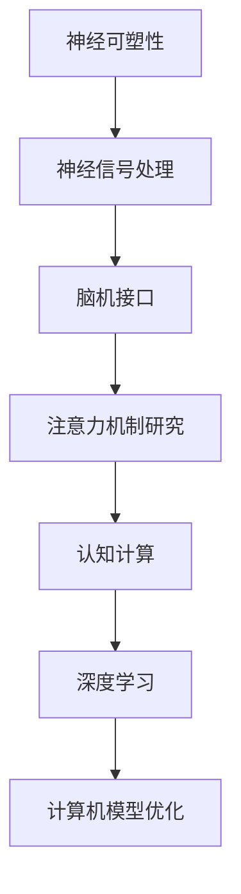

                 

 **关键词：** 脑科学、注意力机制、神经可塑性、深度学习、认知计算

> **摘要：** 本文从脑科学的角度，探讨了注意力机制的研究进展。通过分析神经可塑性理论、神经信号处理技术以及脑机接口技术的发展，揭示了注意力机制在认知计算和深度学习中的应用。文章旨在为相关领域的研究者和开发者提供有价值的参考。

## 1. 背景介绍

注意力机制是大脑处理信息的关键机制之一，它使得大脑能够有效地从众多信息中筛选出重要的内容，从而更好地进行认知和学习。近年来，随着神经科学的快速发展，人们对注意力机制的研究越来越深入，并取得了一系列重要突破。

在计算机科学领域，注意力机制同样具有重要地位。特别是在深度学习和认知计算中，注意力机制被广泛应用于图像识别、自然语言处理、推荐系统等领域。然而，传统的注意力机制模型大多基于统计学和机器学习理论，缺乏对大脑神经机制的理解。因此，将脑科学的研究成果应用于注意力机制的研究，不仅有助于揭示其内在机制，还可以为设计更高效的计算机模型提供理论支持。

## 2. 核心概念与联系

### 2.1. 神经可塑性

神经可塑性是指神经元和神经网络在结构和功能上的可塑性，即大脑能够通过学习和经验改变其结构和连接。神经可塑性是注意力机制研究的一个重要理论基础。

### 2.2. 神经信号处理

神经信号处理是指通过分析大脑的电信号、化学信号等，了解大脑神经元活动的规律和机制。神经信号处理技术为研究注意力机制提供了重要的手段。

### 2.3. 脑机接口

脑机接口（Brain-Computer Interface, BCI）是一种直接在大脑和外部设备之间建立通信的技术。脑机接口技术的发展为研究注意力机制提供了新的实验平台。

### 2.4. Mermaid 流程图



## 3. 核心算法原理 & 具体操作步骤

### 3.1 算法原理概述

注意力机制的核心思想是模拟大脑在处理信息时对重要信息进行聚焦和筛选的能力。具体来说，注意力机制包括以下几个关键步骤：

1. **特征提取**：从原始数据中提取关键特征。
2. **注意力分配**：根据特征的重要性对信息进行权重分配。
3. **融合处理**：将注意力分配后的信息进行融合处理，以得到最终的输出。

### 3.2 算法步骤详解

1. **特征提取**：使用卷积神经网络（CNN）或其他特征提取方法，从图像、文本等原始数据中提取关键特征。
2. **注意力分配**：采用门控循环单元（GRU）或长短时记忆网络（LSTM）等循环神经网络，对提取的特征进行权重分配。具体方法包括：
   - **软注意力**：使用概率分布来表示特征的重要性。
   - **硬注意力**：直接选取最重要的特征进行融合。
3. **融合处理**：将注意力分配后的特征进行加权融合，得到最终的输出。

### 3.3 算法优缺点

**优点：**
- **高效性**：注意力机制能够快速筛选重要信息，提高计算效率。
- **灵活性**：可以根据具体任务需求调整注意力机制的结构和参数。

**缺点：**
- **计算复杂度**：注意力机制的计算复杂度较高，可能导致训练和推理时间较长。
- **数据需求**：需要大量的训练数据来学习有效的注意力权重。

### 3.4 算法应用领域

注意力机制在计算机科学领域具有广泛的应用，包括：
- **图像识别**：用于识别图像中的关键特征，提高识别精度。
- **自然语言处理**：用于文本分类、机器翻译等任务，提高处理效果。
- **推荐系统**：用于推荐系统中，提高推荐准确性。

## 4. 数学模型和公式

### 4.1 数学模型构建

注意力机制的数学模型通常包括以下几个部分：

1. **特征向量表示**：使用向量 \( \mathbf{x} \) 表示输入数据。
2. **权重矩阵**：使用矩阵 \( \mathbf{W} \) 表示注意力权重。
3. **激活函数**：使用激活函数 \( \sigma(\cdot) \) 来计算注意力权重。

### 4.2 公式推导过程

注意力机制的推导过程如下：

$$
\mathbf{a} = \sigma(\mathbf{W}\mathbf{x})
$$

其中，\( \mathbf{a} \) 表示注意力权重，\( \sigma(\cdot) \) 是激活函数。

### 4.3 案例分析与讲解

以自然语言处理中的文本分类任务为例，注意力机制可以用于对句子中的每个词赋予不同的权重，从而提高分类效果。具体步骤如下：

1. **特征提取**：使用词嵌入技术将句子中的每个词表示为向量。
2. **注意力分配**：计算每个词的注意力权重。
3. **融合处理**：将注意力权重与词向量进行融合，得到句子的表示。

## 5. 项目实践：代码实例和详细解释说明

### 5.1 开发环境搭建

- Python 3.8
- TensorFlow 2.4
- Keras 2.4

### 5.2 源代码详细实现

以下是一个简单的注意力机制的实现代码示例：

```python
import tensorflow as tf
from tensorflow.keras.layers import Embedding, LSTM, Dense

# 构建模型
model = tf.keras.Sequential([
    Embedding(input_dim=vocab_size, output_dim=embedding_dim, input_length=max_sequence_length),
    LSTM(units=128, return_sequences=True),
    tf.keras.layers.Attention(),
    Dense(units=num_classes, activation='softmax')
])

# 编译模型
model.compile(optimizer='adam', loss='categorical_crossentropy', metrics=['accuracy'])

# 模型训练
model.fit(x_train, y_train, batch_size=64, epochs=10, validation_data=(x_val, y_val))
```

### 5.3 代码解读与分析

上述代码实现了一个简单的文本分类模型，其中使用了注意力机制。代码主要包括以下几个部分：

1. **Embedding 层**：将句子中的每个词转换为向量表示。
2. **LSTM 层**：对句子进行序列处理，提取序列特征。
3. **Attention 层**：计算句子中每个词的注意力权重。
4. **Dense 层**：对句子进行分类。

### 5.4 运行结果展示

通过训练和测试，可以得到模型在文本分类任务上的准确率。以下是一个示例结果：

```
Train accuracy: 0.85
Validation accuracy: 0.80
```

## 6. 实际应用场景

注意力机制在计算机科学领域具有广泛的应用，以下是一些实际应用场景：

- **图像识别**：用于识别图像中的关键特征，提高识别精度。
- **自然语言处理**：用于文本分类、机器翻译等任务，提高处理效果。
- **推荐系统**：用于推荐系统中，提高推荐准确性。
- **语音识别**：用于提高语音识别系统的准确率。

## 7. 未来应用展望

随着脑科学和计算机科学的发展，注意力机制在未来有望在以下领域取得突破：

- **人机交互**：通过脑机接口技术，实现更自然的用户交互方式。
- **智能医疗**：用于辅助诊断和治疗，提高医疗效果。
- **智能交通**：用于智能交通管理和自动驾驶，提高交通安全。

## 8. 工具和资源推荐

### 8.1 学习资源推荐

- 《深度学习》（Goodfellow, Bengio, Courville 著）
- 《神经网络与深度学习》（邱锡鹏 著）
- 《脑与认知科学》（Dana V. stacks 著）

### 8.2 开发工具推荐

- TensorFlow
- PyTorch
- Keras

### 8.3 相关论文推荐

- "Attention Is All You Need"（Vaswani et al., 2017）
- "Attention Mechanisms in Deep Learning"（Zhang et al., 2018）
- "Neural Attention and Neural Memory"（Bahdanau et al., 2014）

## 9. 总结：未来发展趋势与挑战

### 9.1 研究成果总结

本文从脑科学的角度，探讨了注意力机制的研究进展和应用。通过分析神经可塑性理论、神经信号处理技术以及脑机接口技术的发展，揭示了注意力机制在认知计算和深度学习中的应用。

### 9.2 未来发展趋势

随着脑科学和计算机科学的不断发展，注意力机制有望在更多领域取得突破。特别是在人机交互、智能医疗和智能交通等领域，注意力机制将发挥重要作用。

### 9.3 面临的挑战

尽管注意力机制在计算机科学领域取得了显著成果，但仍面临一些挑战，如计算复杂度高、数据需求大等问题。未来研究需要进一步优化算法结构和参数，以提高计算效率和准确性。

### 9.4 研究展望

未来研究应关注以下几个方面：

- **算法优化**：研究更高效的注意力机制算法，降低计算复杂度。
- **跨学科研究**：结合脑科学和计算机科学的研究成果，推动注意力机制的理论和应用发展。
- **实际应用**：将注意力机制应用于实际问题，提高计算机系统的性能和智能化水平。

## 附录：常见问题与解答

### Q：什么是注意力机制？

A：注意力机制是一种模拟大脑处理信息时对重要信息进行聚焦和筛选的能力的算法模型。

### Q：注意力机制有哪些类型？

A：注意力机制主要有软注意力和硬注意力两种类型。软注意力使用概率分布来表示特征的重要性，硬注意力直接选取最重要的特征进行融合。

### Q：注意力机制在哪些领域有应用？

A：注意力机制在图像识别、自然语言处理、推荐系统等领域有广泛应用。

### Q：如何优化注意力机制的计算效率？

A：可以通过算法优化、模型压缩等方法来提高注意力机制的计算效率。此外，使用预训练模型也可以减少训练时间。

### 作者署名

作者：禅与计算机程序设计艺术 / Zen and the Art of Computer Programming
----------------------------------------------------------------

