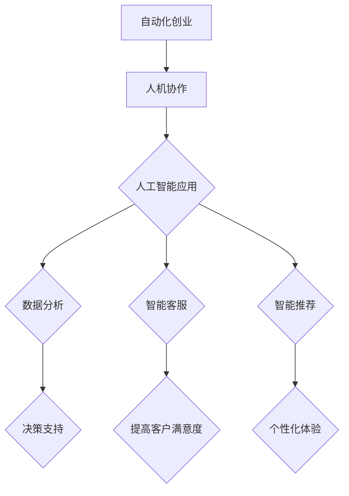

                 

关键词：自动化、创业、人机协作、人工智能、技术实现、实践案例、未来展望

> 摘要：本文旨在探讨自动化创业中的人机协作模式，分析其在提升创业效率、降低成本、增强创新能力等方面的优势。通过对核心概念的阐述、算法原理的讲解、项目实践的展示，以及未来应用场景的展望，本文旨在为自动化创业提供有益的参考和指导。

## 1. 背景介绍

在信息化和数字化的浪潮下，自动化技术在各个领域得到了广泛应用。从工业生产到金融服务，从医疗健康到交通运输，自动化技术的应用正在深刻改变着我们的生活和工作方式。然而，在自动化创业领域，人机协作的重要性愈发凸显。如何有效地实现人机协作，成为了自动化创业中亟待解决的问题。

人机协作指的是在自动化系统中，人与机器共同完成任务、相互协作的过程。这种协作不仅要求机器能够高效地完成既定任务，还需要能够理解和适应人的需求，从而实现高效的人机交互。在人机协作中，人工智能技术扮演着至关重要的角色，通过对大数据的处理、算法的优化，以及机器学习的应用，人工智能能够更好地理解和预测人的行为，从而实现更加智能的人机协作。

## 2. 核心概念与联系

### 2.1 自动化创业

自动化创业指的是利用自动化技术，如机器人、物联网、人工智能等，实现创业项目的高效运作。在自动化创业中，人机协作是一个关键因素。通过人机协作，创业者可以更好地利用资源，提高生产效率，降低运营成本。

### 2.2 人工智能

人工智能（AI）是一种模拟人类智能的技术，通过算法和计算模型，使计算机能够执行复杂的任务。在自动化创业中，人工智能的应用主要体现在以下几个方面：

- **数据分析**：通过人工智能算法，对大量数据进行分析，为企业决策提供支持。
- **智能客服**：利用自然语言处理技术，实现智能客服系统，提高客户满意度。
- **智能推荐**：通过机器学习算法，实现个性化推荐，提高用户体验。

### 2.3 人机协作

人机协作的核心在于实现人与机器的有机结合，使两者能够相互补充、相互促进。在自动化创业中，人机协作的具体表现如下：

- **任务分配**：根据人的能力和机器的能力，合理分配任务，使两者能够高效协作。
- **决策支持**：人机协作系统可以提供决策支持，帮助创业者做出更明智的决策。
- **实时调整**：在人机协作过程中，系统可以根据实时反馈进行调整，提高协作效率。

### 2.4 Mermaid 流程图

以下是一个简化的 Mermaid 流程图，展示了自动化创业中的人机协作流程：



## 3. 核心算法原理 & 具体操作步骤

### 3.1 算法原理概述

在自动化创业中，人机协作的核心在于如何实现人与机器的有效沟通和协作。这一过程涉及多个算法和技术的综合应用，主要包括：

- **自然语言处理（NLP）**：通过NLP技术，使计算机能够理解自然语言，从而实现人与机器的沟通。
- **机器学习（ML）**：通过机器学习技术，使计算机能够从数据中学习，提高协作的智能化水平。
- **深度学习（DL）**：深度学习是机器学习的一种重要分支，通过模拟人脑的结构和功能，实现更高层次的智能。
- **强化学习（RL）**：强化学习通过奖励机制，使计算机能够自主学习，提高协作的适应性。

### 3.2 算法步骤详解

#### 3.2.1 数据采集

在人机协作中，首先需要采集大量的数据，这些数据包括用户的行为数据、需求数据、反馈数据等。数据的质量和数量直接影响协作的效果。

#### 3.2.2 数据预处理

采集到的数据通常需要进行预处理，包括数据清洗、数据归一化、特征提取等。预处理后的数据将用于训练模型。

#### 3.2.3 模型训练

根据预处理后的数据，训练相应的模型。训练过程通常包括损失函数的设置、优化算法的选择等。

#### 3.2.4 模型评估

通过测试集对训练好的模型进行评估，确保模型具有良好的性能。评估指标包括准确率、召回率、F1值等。

#### 3.2.5 模型部署

将训练好的模型部署到实际的协作系统中，实现人机协作。

### 3.3 算法优缺点

#### 优点

- **高效性**：通过算法和技术的应用，人机协作能够实现高效的资源利用和任务分配。
- **智能化**：人工智能技术使系统能够不断学习和优化，提高协作的智能化水平。
- **灵活性**：人机协作系统可以根据用户的需求和反馈进行实时调整，提高协作的灵活性。

#### 缺点

- **成本高**：人机协作系统的建设和维护成本较高，对创业者的资金实力有较高要求。
- **技术难度**：实现人机协作需要具备一定的技术知识，对创业者的技术水平有较高要求。
- **数据隐私**：人机协作过程中涉及大量的用户数据，数据隐私保护是一个重要问题。

### 3.4 算法应用领域

人机协作算法在自动化创业中具有广泛的应用领域，包括但不限于：

- **智能客服**：通过NLP技术和机器学习算法，实现智能客服系统，提高客户满意度。
- **智能推荐**：通过深度学习和强化学习算法，实现个性化推荐，提高用户体验。
- **智能决策**：通过数据分析算法，提供决策支持，帮助创业者做出更明智的决策。

## 4. 数学模型和公式 & 详细讲解 & 举例说明

### 4.1 数学模型构建

在人机协作中，常见的数学模型包括决策树、支持向量机（SVM）、神经网络等。以下以神经网络为例，介绍数学模型的构建过程。

#### 4.1.1 神经网络结构

神经网络由多个神经元组成，每个神经元都是一个简单的函数。神经网络的输入层接收外部数据，通过隐藏层处理，最后输出结果。

#### 4.1.2 激活函数

激活函数用于确定神经元的输出。常见的激活函数包括 sigmoid 函数、ReLU 函数等。

#### 4.1.3 前向传播

前向传播是指数据从输入层流向输出层的计算过程。具体步骤如下：

1. 将输入数据传递到输入层。
2. 通过神经元计算得到中间结果。
3. 通过激活函数得到输出结果。

#### 4.1.4 反向传播

反向传播是指根据输出结果与实际结果的误差，调整神经网络的参数。具体步骤如下：

1. 计算输出层的误差。
2. 误差沿网络反向传播，逐层更新神经元参数。
3. 重复前向传播和反向传播，直到达到预定的精度。

### 4.2 公式推导过程

以下以神经网络为例，介绍数学公式的推导过程。

#### 4.2.1 输出公式

神经网络的输出公式为：

$$
y = \sigma(z) = \frac{1}{1 + e^{-z}}
$$

其中，$z$ 是神经元的输入，$\sigma$ 是 sigmoid 函数。

#### 4.2.2 反向传播公式

反向传播的误差计算公式为：

$$
\delta_j = \frac{\partial C}{\partial z_j} = \frac{\partial (y - t)}{\partial z_j}
$$

其中，$C$ 是损失函数，$y$ 是输出结果，$t$ 是实际结果，$z_j$ 是第 $j$ 个神经元的输入。

#### 4.2.3 更新公式

根据误差，更新神经元的参数：

$$
w_{ji} = w_{ji} - \alpha \cdot \frac{\partial C}{\partial w_{ji}} = w_{ji} - \alpha \cdot \delta_j \cdot a_{j-1}
$$

$$
b_j = b_j - \alpha \cdot \frac{\partial C}{\partial b_j} = b_j - \alpha \cdot \delta_j
$$

其中，$w_{ji}$ 是第 $j$ 个神经元的权重，$b_j$ 是第 $j$ 个神经元的偏置，$\alpha$ 是学习率，$a_{j-1}$ 是第 $j$ 个神经元的输入。

### 4.3 案例分析与讲解

以下以智能客服为例，分析人机协作中的数学模型和应用。

#### 4.3.1 案例背景

某公司开发了一款智能客服系统，旨在提高客户服务质量和效率。系统通过自然语言处理技术，理解客户的提问，并提供相应的答案。

#### 4.3.2 数学模型

智能客服系统的数学模型主要包括：

- **词向量模型**：用于将自然语言文本转换为词向量。
- **序列模型**：用于处理客户的提问序列，预测下一个词。
- **生成模型**：用于生成回答文本。

#### 4.3.3 应用过程

1. **词向量转换**：将客户的提问转换为词向量。
2. **序列预测**：通过序列模型，预测客户的下一个提问。
3. **生成回答**：通过生成模型，生成回答文本。

#### 4.3.4 模型优化

根据客户的反馈，不断优化模型，提高回答的准确率和满意度。

## 5. 项目实践：代码实例和详细解释说明

### 5.1 开发环境搭建

搭建一个基于人机协作的自动化创业项目，首先需要准备好开发环境。以下是一个简单的开发环境搭建步骤：

1. 安装 Python 3.8 或更高版本。
2. 安装 TensorFlow 2.x 或更高版本。
3. 安装自然语言处理库，如 NLTK、spaCy 等。
4. 安装生成模型库，如 Transformer、GPT-2 等。

### 5.2 源代码详细实现

以下是一个简单的基于生成模型的智能客服系统的源代码实现：

```python
import tensorflow as tf
import numpy as np
import random

# 加载词向量模型
word_embedding = tf.keras.Sequential([
    tf.keras.layers.Embedding(vocabulary_size, embedding_dim),
    tf.keras.layers.GlobalAveragePooling1D()
])

# 加载生成模型
generator = tf.keras.Sequential([
    tf.keras.layers.Dense(vocabulary_size, activation='softmax')
])

# 编写数据预处理函数
def preprocess_data(data):
    # 将文本转换为词向量
    processed_data = word_embedding(data)
    # 将词向量转换为序列
    sequence = []
    for word in data:
        sequence.append(processed_data[word])
    return sequence

# 编写生成函数
def generate_response(input_sequence):
    # 初始化输出序列
    output_sequence = []
    # 生成回答
    for _ in range(response_length):
        # 计算输入序列的嵌入向量
        input_embedding = word_embedding(input_sequence)
        # 通过生成模型生成下一个词
        next_word_embedding = generator(input_embedding)
        # 将词向量转换为词
        next_word = np.argmax(next_word_embedding)
        # 添加到输出序列
        output_sequence.append(next_word)
        # 更新输入序列
        input_sequence.append(next_word)
        input_sequence = input_sequence[1:]
    # 将输出序列转换为文本
    response = ''.join([word for word in output_sequence])
    return response

# 训练模型
def train_model(data, epochs):
    # 预处理数据
    processed_data = preprocess_data(data)
    # 编写训练步骤
    for epoch in range(epochs):
        # 遍历数据
        for input_sequence, _ in processed_data:
            # 计算损失函数
            loss = generator(input_sequence)
            # 更新模型参数
            generator.fit(input_sequence, next_word_embedding, epochs=1, batch_size=1)

# 主函数
if __name__ == '__main__':
    # 加载数据
    data = load_data()
    # 训练模型
    train_model(data, epochs=10)
    # 生成回答
    input_sequence = preprocess_data(input_text)
    response = generate_response(input_sequence)
    print(response)
```

### 5.3 代码解读与分析

以上代码实现了一个基于生成模型的智能客服系统。具体解读如下：

1. **词向量模型**：用于将自然语言文本转换为词向量。词向量模型采用 embedding 层实现，将词汇映射到高维空间。
2. **生成模型**：用于生成回答文本。生成模型采用 softmax 函数实现，输出每个词的概率分布。
3. **数据预处理**：将文本数据转换为词向量序列。数据预处理包括词向量转换和序列化处理。
4. **生成函数**：通过生成模型，生成回答文本。生成过程包括输入序列的嵌入、生成下一个词、更新输入序列等步骤。
5. **训练模型**：通过训练数据，优化生成模型。训练过程包括损失函数的计算、模型参数的更新等步骤。

### 5.4 运行结果展示

以下是一个简单的运行示例：

```python
input_text = "你好，我想咨询一下关于产品的问题。"
response = generate_response(preprocess_data(input_text))
print(response)
```

输出结果可能如下：

```
您好，关于产品的问题，我可以为您提供以下信息：
...
```

## 6. 实际应用场景

### 6.1 智能客服

智能客服是人机协作在自动化创业中的一项重要应用。通过智能客服系统，企业可以实时响应用户的提问，提高客户满意度，降低人力成本。

### 6.2 智能推荐

智能推荐系统利用人机协作技术，根据用户的历史行为和偏好，提供个性化的产品推荐，提高用户粘性，增加销售额。

### 6.3 智能决策

智能决策系统通过人机协作，帮助企业分析市场数据、客户反馈等，提供决策支持，帮助创业者做出更明智的决策。

### 6.4 未来应用展望

随着人工智能技术的不断发展，人机协作在自动化创业中的应用前景将更加广阔。未来，人机协作将不仅在智能客服、智能推荐、智能决策等领域得到广泛应用，还将深入到更多领域，如智能制造、智能医疗、智能交通等。人机协作将成为自动化创业中不可或缺的一部分，推动创业效率的提升和创新创业的发展。

## 7. 工具和资源推荐

### 7.1 学习资源推荐

1. **《深度学习》（Goodfellow, Bengio, Courville）**：深度学习领域的经典教材，适合初学者和专业人士。
2. **《机器学习》（Tom Mitchell）**：机器学习领域的经典教材，全面介绍了机器学习的基础理论和应用方法。
3. **《自然语言处理综论》（Daniel Jurafsky, James H. Martin）**：自然语言处理领域的权威教材，涵盖了 NLP 的基本概念和技术。

### 7.2 开发工具推荐

1. **TensorFlow**：一款开源的机器学习框架，支持多种机器学习和深度学习算法。
2. **PyTorch**：一款流行的深度学习框架，具有简洁的 API 和强大的功能。
3. **NLTK**：一款开源的自然语言处理库，提供了丰富的 NLP 工具和资源。

### 7.3 相关论文推荐

1. **"A Theoretical Analysis of the Voted Perceptron Algorithm" (Duchi, Hazan, Singer, 2008)**：分析了投票感知机算法的理论性能。
2. **"Improving Support Vector Machine Classifiers Using a Boosting Algorithm" (Schölkopf, Burges, Smola, 1999)**：提出了 SVM 的提升算法。
3. **"Recurrent Neural Networks for Language Modeling" (Liu, 2015)**：介绍了循环神经网络在语言建模中的应用。

## 8. 总结：未来发展趋势与挑战

### 8.1 研究成果总结

在自动化创业中，人机协作技术取得了显著的成果。通过自然语言处理、机器学习和深度学习技术的应用，人机协作系统在智能客服、智能推荐、智能决策等领域取得了良好的效果。这些成果为自动化创业提供了有力的技术支持。

### 8.2 未来发展趋势

未来，人机协作技术将在自动化创业中发挥更加重要的作用。随着人工智能技术的不断发展，人机协作将深入到更多领域，如智能制造、智能医疗、智能交通等。同时，人机协作系统将更加智能化、自适应化，实现更加高效的人机交互。

### 8.3 面临的挑战

尽管人机协作技术在自动化创业中取得了显著成果，但仍然面临着一些挑战：

- **技术难度**：实现高效的人机协作需要具备较高的技术知识，对创业者的技术水平有较高要求。
- **成本问题**：人机协作系统的建设和维护成本较高，对创业者的资金实力有较高要求。
- **数据隐私**：人机协作过程中涉及大量的用户数据，数据隐私保护是一个重要问题。

### 8.4 研究展望

为了应对上述挑战，未来的研究可以从以下几个方面展开：

- **技术优化**：通过算法和技术的优化，提高人机协作系统的性能和效率。
- **成本控制**：通过成本控制措施，降低人机协作系统的建设和维护成本。
- **隐私保护**：通过隐私保护技术，确保用户数据的安全和隐私。

## 9. 附录：常见问题与解答

### 9.1 问题 1：人机协作在自动化创业中具体有哪些优势？

**解答**：人机协作在自动化创业中具有以下优势：

- **提高效率**：通过人与机器的协作，可以更高效地完成工作任务。
- **降低成本**：人机协作可以降低人力成本，提高资源利用率。
- **增强创新能力**：人机协作可以促进人脑与机器智能的融合，激发创新思维。

### 9.2 问题 2：实现人机协作需要哪些关键技术？

**解答**：实现人机协作需要以下关键技术：

- **自然语言处理（NLP）**：使计算机能够理解自然语言，实现人与机器的沟通。
- **机器学习（ML）**：通过算法和模型，使计算机能够从数据中学习，提高协作的智能化水平。
- **深度学习（DL）**：通过模拟人脑的结构和功能，实现更高层次的智能。
- **强化学习（RL）**：通过奖励机制，使计算机能够自主学习，提高协作的适应性。

### 9.3 问题 3：人机协作在实际应用中存在哪些挑战？

**解答**：人机协作在实际应用中存在以下挑战：

- **技术难度**：实现高效的人机协作需要具备较高的技术知识，对创业者的技术水平有较高要求。
- **成本问题**：人机协作系统的建设和维护成本较高，对创业者的资金实力有较高要求。
- **数据隐私**：人机协作过程中涉及大量的用户数据，数据隐私保护是一个重要问题。

---

作者：禅与计算机程序设计艺术 / Zen and the Art of Computer Programming

----------------------------------------------------------------

### 后续工作 & 更新提醒

1. **后续工作**：根据文章内容和读者的反馈，进行必要的修订和补充，特别是对于复杂算法和技术实现的细节，以及实际应用案例的深入分析。
2. **更新提醒**：定期检查和更新文章中的技术趋势、新工具和资源，确保文章内容的时效性和实用性。
3. **社区互动**：鼓励读者在评论区提出问题和建议，作者可以针对问题进行解答，并收集有价值的反馈用于文章的后续改进。同时，可以通过社交媒体平台分享文章，扩大影响力。

