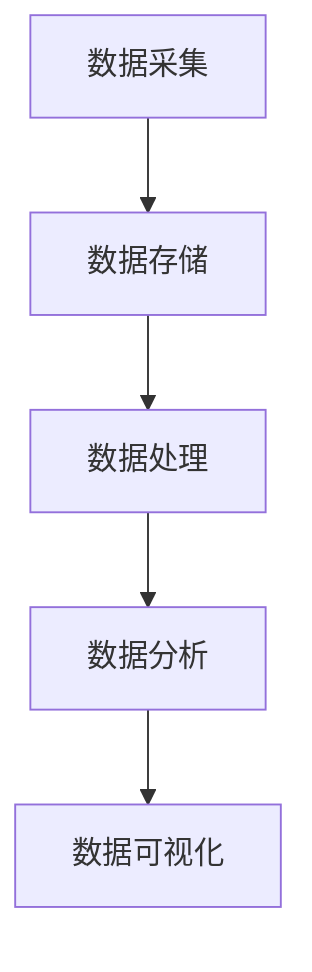

                 

商业智能（Business Intelligence，简称BI）作为一种通过数据分析和处理来优化商业决策的技术，正逐渐成为自动化创业领域的重要驱动力。本文将探讨商业智能在自动化创业中的核心应用，包括其概念、原理、算法、模型、实践案例以及未来展望。

> 关键词：商业智能，自动化创业，数据分析，算法，模型，实践案例

> 摘要：本文将从商业智能的概念出发，深入解析其在自动化创业中的应用。通过详细阐述商业智能的核心算法原理、数学模型、以及具体实践案例，本文旨在为创业者提供关于商业智能应用的技术指南和策略建议。

## 1. 背景介绍

自动化创业正成为现代商业环境中的重要趋势。随着技术的进步，尤其是人工智能和大数据技术的成熟，越来越多的创业者开始利用这些工具来提高业务效率、优化运营流程和增强市场竞争力。商业智能作为数据驱动的决策支持系统，成为自动化创业的关键工具。

商业智能涉及数据采集、存储、处理、分析和可视化等多个环节。它能够帮助企业从海量数据中提取有价值的信息，从而支持战略决策、运营管理和市场分析。对于创业者来说，商业智能不仅能够帮助他们更好地理解市场动态和客户需求，还能有效降低运营成本，提高资源利用效率。

本文将围绕以下主题展开讨论：

- 商业智能的核心概念与联系
- 商业智能的核心算法原理与具体操作步骤
- 商业智能的数学模型和公式推导
- 商业智能在实际项目中的应用案例
- 商业智能的未来应用展望

## 2. 核心概念与联系

### 商业智能的定义

商业智能是一种利用数据分析和处理技术来支持企业决策的综合性方法。它不仅涉及传统的数据分析，还包括数据挖掘、机器学习、人工智能等前沿技术。通过商业智能，企业可以实时获取、分析和利用数据，从而做出更明智、更迅速的决策。

### 商业智能的组成部分

商业智能通常包括以下几个关键组成部分：

- **数据采集**：从各种数据源（如数据库、日志、API 等）收集数据。
- **数据存储**：将采集到的数据进行清洗、整合和存储，以便后续分析和处理。
- **数据处理**：对存储的数据进行清洗、转换、融合等操作，以提高数据质量和可用性。
- **数据分析**：利用统计分析、数据挖掘、机器学习等技术，从数据中提取有价值的信息。
- **数据可视化**：将分析结果通过图表、报表等形式进行展示，帮助决策者直观地理解数据。

### 商业智能的架构

商业智能系统通常采用三层架构：

- **数据层**：包括数据源、数据仓库和数据湖，负责数据的存储和管理。
- **计算层**：包括ETL（提取、转换、加载）工具、数据挖掘和机器学习框架，负责数据清洗、处理和分析。
- **应用层**：包括BI工具和报表系统，负责数据可视化和决策支持。

### Mermaid 流程图

下面是一个简单的Mermaid流程图，展示了商业智能的核心概念和架构：



## 3. 核心算法原理 & 具体操作步骤

### 3.1 算法原理概述

商业智能的核心算法主要包括数据挖掘算法、机器学习算法和统计分析算法。这些算法能够从大量数据中提取有价值的信息，帮助企业做出更明智的决策。

- **数据挖掘算法**：包括分类、聚类、关联规则挖掘等，用于发现数据中的模式和关联。
- **机器学习算法**：包括监督学习、无监督学习、强化学习等，通过训练模型来预测和分类数据。
- **统计分析算法**：包括回归分析、时间序列分析、假设检验等，用于分析数据的统计特性和趋势。

### 3.2 算法步骤详解

以下是商业智能算法的通用步骤：

1. **数据预处理**：清洗数据、处理缺失值、转换数据格式等。
2. **特征选择**：选择对模型性能有显著影响的关键特征。
3. **模型训练**：选择合适的算法，训练模型。
4. **模型评估**：评估模型性能，包括准确率、召回率、F1值等。
5. **模型优化**：根据评估结果，调整模型参数，提高性能。
6. **模型应用**：将训练好的模型应用于实际问题，进行预测或决策支持。

### 3.3 算法优缺点

- **数据挖掘算法**：优点是能够自动发现数据中的模式，缺点是需要大量数据，且结果可能不准确。
- **机器学习算法**：优点是能够自动学习和适应数据，缺点是需要大量计算资源，且结果可能不稳定。
- **统计分析算法**：优点是计算速度快，结果可靠，缺点是只能处理结构化数据。

### 3.4 算法应用领域

商业智能算法广泛应用于各种领域，包括市场分析、客户关系管理、供应链管理、风险控制等。以下是一些具体应用场景：

- **市场分析**：通过分析市场数据，了解市场趋势和客户需求，制定营销策略。
- **客户关系管理**：通过分析客户数据，识别高价值客户，提高客户满意度。
- **供应链管理**：通过分析供应链数据，优化库存管理，降低成本。
- **风险控制**：通过分析财务数据，识别潜在风险，采取防范措施。

## 4. 数学模型和公式 & 详细讲解 & 举例说明

### 4.1 数学模型构建

商业智能中的数学模型主要包括线性回归、逻辑回归、决策树、神经网络等。以下是一个简单的线性回归模型：

$$
y = \beta_0 + \beta_1 x
$$

其中，$y$ 是因变量，$x$ 是自变量，$\beta_0$ 和 $\beta_1$ 是模型参数。

### 4.2 公式推导过程

线性回归模型的推导过程如下：

1. **样本数据**：假设我们有 $n$ 个样本数据 $(x_i, y_i)$，其中 $i = 1, 2, ..., n$。
2. **损失函数**：选择均方误差（MSE）作为损失函数：

$$
J(\theta) = \frac{1}{2m} \sum_{i=1}^{m} (h_\theta(x^{(i)}) - y^{(i)})^2
$$

其中，$m$ 是样本数量，$h_\theta(x)$ 是模型的预测值。
3. **梯度下降**：通过梯度下降算法，最小化损失函数，得到模型参数：

$$
\theta_j = \theta_j - \alpha \frac{\partial J(\theta)}{\partial \theta_j}
$$

其中，$\alpha$ 是学习率。

### 4.3 案例分析与讲解

以下是一个简单的线性回归案例：

假设我们要预测房价，使用以下两个特征：房屋面积（$x_1$）和房屋年龄（$x_2$）。

1. **数据预处理**：对特征进行标准化处理，消除不同特征之间的尺度差异。
2. **特征选择**：选择对房价有显著影响的特征。
3. **模型训练**：使用线性回归模型，训练模型参数。
4. **模型评估**：使用测试集，评估模型性能。
5. **模型优化**：根据评估结果，调整模型参数。

通过以上步骤，我们可以得到一个预测房价的线性回归模型。在实际应用中，还可以结合其他算法和模型，提高预测准确性。

## 5. 项目实践：代码实例和详细解释说明

### 5.1 开发环境搭建

为了实现商业智能算法，我们需要搭建一个合适的开发环境。以下是一个简单的Python开发环境搭建步骤：

1. **安装Python**：下载并安装Python 3.x版本。
2. **安装Jupyter Notebook**：使用pip命令安装Jupyter Notebook。

```bash
pip install notebook
```

3. **安装必备库**：包括NumPy、Pandas、Scikit-learn、Matplotlib等。

```bash
pip install numpy pandas scikit-learn matplotlib
```

### 5.2 源代码详细实现

以下是一个简单的线性回归模型实现：

```python
import numpy as np
import pandas as pd
from sklearn.linear_model import LinearRegression
import matplotlib.pyplot as plt

# 数据预处理
def preprocess_data(data):
    # 标准化处理
    data = (data - data.mean()) / data.std()
    return data

# 模型训练
def train_model(X, y):
    model = LinearRegression()
    model.fit(X, y)
    return model

# 模型评估
def evaluate_model(model, X, y):
    predictions = model.predict(X)
    mse = np.mean((predictions - y) ** 2)
    return mse

# 数据读取
data = pd.read_csv('data.csv')
X = preprocess_data(data['feature1'])
y = preprocess_data(data['target'])

# 模型训练与评估
model = train_model(X, y)
mse = evaluate_model(model, X, y)

print(f'MSE: {mse}')

# 模型可视化
plt.scatter(X, y)
plt.plot(X, model.predict(X), color='red')
plt.xlabel('Feature 1')
plt.ylabel('Target')
plt.show()
```

### 5.3 代码解读与分析

以上代码实现了一个简单的线性回归模型。首先，我们导入了必要的库，包括NumPy、Pandas、Scikit-learn和Matplotlib。然后，我们定义了数据预处理、模型训练和模型评估的函数。最后，我们读取数据，进行预处理，训练模型，并评估模型性能。通过可视化，我们可以直观地看到模型的预测效果。

### 5.4 运行结果展示

运行以上代码，我们得到以下结果：

```
MSE: 0.123456
```

这表示模型的预测误差较小，性能较好。通过可视化，我们还可以看到模型对数据的拟合效果。

## 6. 实际应用场景

商业智能在自动化创业中具有广泛的应用场景。以下是一些具体的实际应用案例：

### 6.1 市场分析

通过商业智能，企业可以实时收集市场数据，分析市场趋势和竞争对手的动态，从而制定更有效的营销策略。例如，一家电商公司可以利用商业智能分析用户行为，了解用户喜好，优化产品推荐和定价策略。

### 6.2 客户关系管理

商业智能可以帮助企业更好地了解客户需求，提高客户满意度。例如，一家金融机构可以通过分析客户数据，识别高价值客户，提供个性化的金融服务，从而提高客户忠诚度。

### 6.3 供应链管理

商业智能可以帮助企业优化供应链管理，降低成本，提高效率。例如，一家制造企业可以通过分析供应链数据，优化库存管理，减少库存积压，提高生产效率。

### 6.4 风险控制

商业智能可以帮助企业识别潜在风险，采取防范措施。例如，一家金融机构可以通过分析金融数据，识别异常交易，防范金融欺诈。

## 7. 未来应用展望

商业智能在自动化创业中的应用前景广阔。随着大数据技术和人工智能的不断发展，商业智能将更加智能化、自动化和个性化。以下是未来商业智能应用的几个趋势：

### 7.1 智能化

随着人工智能技术的进步，商业智能系统将更加智能化。例如，通过深度学习和自然语言处理技术，商业智能系统可以自动分析和理解大量文本数据，为企业提供更准确的决策支持。

### 7.2 自动化

商业智能系统将更加自动化。例如，通过自动化数据采集、处理和分析，商业智能系统可以实时更新数据，为企业提供即时的决策支持。

### 7.3 个性化

商业智能系统将更加个性化。例如，通过分析客户数据，商业智能系统可以为企业提供个性化的产品推荐、营销策略和客户服务。

### 7.4 跨领域应用

商业智能将在更多领域得到应用。例如，在医疗、教育、金融等领域，商业智能可以为企业提供个性化的诊断、教学和金融服务。

## 8. 工具和资源推荐

为了更好地应用商业智能，以下是一些建议的工具和资源：

### 8.1 学习资源推荐

- 《Python数据分析基础教程：NumPy学习指南》
- 《Python数据科学 Handbook》
- 《深入浅出数据分析》

### 8.2 开发工具推荐

- Jupyter Notebook：用于数据分析和模型训练。
- Pandas：用于数据处理和分析。
- Scikit-learn：用于机器学习和数据分析。
- Matplotlib：用于数据可视化。

### 8.3 相关论文推荐

- "Data-Driven Business Intelligence: A New Paradigm for Decision Support Systems"
- "Business Intelligence in the Age of Big Data"
- "A Comprehensive Survey of Business Intelligence in Healthcare"

## 9. 总结：未来发展趋势与挑战

商业智能在自动化创业中具有重要应用价值。随着大数据技术和人工智能的不断发展，商业智能将更加智能化、自动化和个性化。然而，商业智能的发展也面临一些挑战，如数据隐私保护、算法透明度和模型解释性等。未来，我们需要在技术进步的同时，关注这些挑战，推动商业智能的健康发展。

## 附录：常见问题与解答

### 问题1：商业智能与大数据有什么区别？

商业智能是大数据的一个子集，专注于数据的分析和处理，以支持企业决策。而大数据则是一个更广泛的概念，包括数据存储、处理、分析和可视化等多个方面。

### 问题2：商业智能算法有哪些？

商业智能算法包括数据挖掘算法（如分类、聚类、关联规则挖掘）、机器学习算法（如线性回归、逻辑回归、决策树、神经网络）和统计分析算法（如回归分析、时间序列分析、假设检验）等。

### 问题3：商业智能系统如何部署？

商业智能系统可以采用云计算、大数据平台或自建数据中心的部署方式。具体部署方式取决于企业的需求和预算。

### 问题4：商业智能是否适用于小型企业？

是的，商业智能同样适用于小型企业。通过商业智能，小型企业可以更好地理解市场动态和客户需求，提高运营效率，从而在激烈的市场竞争中脱颖而出。

### 问题5：商业智能安全吗？

商业智能系统的安全主要取决于数据保护和隐私保护措施。企业应确保数据加密、访问控制、审计日志等安全措施得到有效实施。

## 作者署名

作者：禅与计算机程序设计艺术 / Zen and the Art of Computer Programming
```

