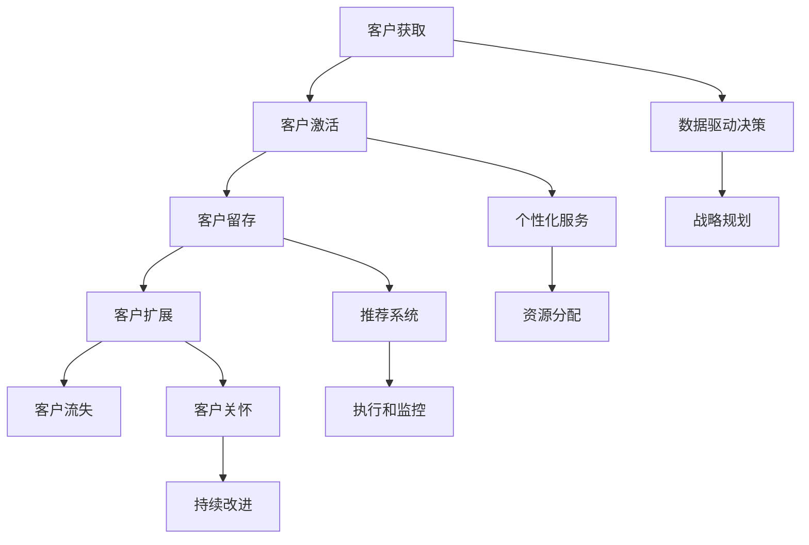

                 

关键词：自动化创业、客户成功管理、客户关系管理、客户体验、数据驱动、技术解决方案

> 摘要：本文探讨了自动化创业领域中客户成功管理的重要性，分析了客户成功管理的核心概念与联系，并详细介绍了客户成功管理的核心算法原理和具体操作步骤。通过数学模型和公式，本文提供了客户成功管理的详细讲解和案例分析。最后，文章通过项目实践展示了代码实例和详细解释，并讨论了客户成功管理的实际应用场景和未来展望。

## 1. 背景介绍

在当今高度竞争的商业环境中，企业必须不断寻找创新的商业模式和策略来保持竞争力。自动化创业已经成为许多企业转型和创新的关键手段。自动化创业涉及使用技术手段，如人工智能、机器学习和自动化工具，来提高效率和客户满意度。然而，成功的自动化创业不仅取决于技术创新，还取决于如何有效地管理客户关系和提供卓越的客户体验。

客户成功管理（Customer Success Management，简称CSM）是自动化创业中不可或缺的一部分。它是一种战略，旨在确保客户在整个生命周期中获得成功。通过主动的客户关系管理，企业可以增加客户保留率、提高客户满意度和增加收入。客户成功管理不仅关注客户获得产品或服务的初期体验，还涉及到如何持续地满足客户的需求和期望。

本文将深入探讨自动化创业中的客户成功管理，包括核心概念、算法原理、数学模型、项目实践以及实际应用场景。通过这些内容的详细分析，读者将能够理解客户成功管理的本质，并掌握有效的客户成功管理策略。

### 1.1 自动化创业的兴起

自动化创业的兴起源于对传统商业模式效率低下的反思。在过去，企业往往依赖于大量的手工操作和重复性劳动，这不仅增加了运营成本，也降低了响应速度和市场适应性。随着技术的快速发展，尤其是人工智能和机器学习技术的成熟，企业开始探索如何通过自动化来提高效率，降低成本，并为客户提供更优质的服务。

自动化创业的核心在于将业务流程中的重复性、标准化的任务转化为自动化流程。例如，通过自动化工具，企业可以实现客户支持自动化、营销自动化、财务管理自动化等。这种转变不仅提高了工作效率，还使得企业能够更好地专注于核心业务和客户价值的创造。

### 1.2 客户成功管理的重要性

客户成功管理的重要性不言而喻。首先，客户是企业的生命线。无论是通过产品销售、服务订阅还是其他商业模式，企业的收入最终都来自于客户。如果无法有效地管理客户关系，提高客户满意度，那么企业的长期发展将会受到严重威胁。

其次，客户成功管理能够帮助企业提高客户保留率。在高度竞争的市场中，客户流失是每个企业都需要面对的问题。通过提供卓越的客户体验，企业可以增强客户忠诚度，降低客户流失率。这不仅有助于保持现有客户，还可以通过口碑传播吸引更多新客户。

最后，客户成功管理能够增加企业的收入。通过深入了解客户需求，提供定制化的解决方案，企业可以更好地满足客户期望，从而提高客户满意度。满意的客户更有可能增加消费、推荐新客户，甚至愿意支付更高的价格。这种增值服务可以显著提高企业的收入水平。

### 1.3 自动化创业与客户成功管理的联系

自动化创业与客户成功管理之间存在密切的联系。自动化技术不仅为企业的运营提供了工具，也为客户成功管理提供了新的手段和方法。

首先，自动化工具可以帮助企业更好地了解客户需求和行为。通过数据分析，企业可以收集大量的客户信息，包括购买历史、互动行为、投诉记录等。这些数据可以帮助企业更精准地识别客户需求，提供个性化的服务和推荐。

其次，自动化工具可以显著提高客户体验。例如，自动化客户支持系统能够快速响应客户问题，提供即时的解决方案。这不仅提高了客户满意度，还减少了人工成本。

最后，自动化创业中的数据驱动策略为客户成功管理提供了强大的支持。通过实时数据分析，企业可以及时调整策略，优化客户体验，提高客户保留率和满意度。

总的来说，自动化创业为客户成功管理带来了新的机遇和挑战。企业需要充分利用自动化技术，构建高效的客户成功管理体系，以实现长期可持续发展。

## 2. 核心概念与联系

在深入探讨客户成功管理之前，有必要了解其中的核心概念及其相互关系。以下是客户成功管理中的关键概念及其在自动化创业中的应用：

### 2.1 客户生命周期管理（Customer Lifecycle Management）

客户生命周期管理是指从客户获取到客户留存的全过程管理。它包括客户获取、客户激活、客户留存和客户扩展四个阶段。在自动化创业中，通过自动化工具，企业可以更有效地管理客户生命周期，提高每个阶段的效率和客户满意度。

- **客户获取（Acquisition）**：自动化营销工具可以帮助企业精准定位潜在客户，并通过个性化营销活动吸引他们。

- **客户激活（Activation）**：通过自动化工具，企业可以快速响应新客户的疑问和需求，帮助他们顺利上手产品或服务。

- **客户留存（Retention）**：自动化客户成功管理系统可以定期跟踪客户行为，提供定制化的支持和建议，以增强客户满意度和忠诚度。

- **客户扩展（Expansion）**：通过分析客户行为数据，企业可以识别具有增值潜力的客户，并提供额外的产品或服务，实现客户扩展。

### 2.2 客户满意度和忠诚度（Customer Satisfaction and Loyalty）

客户满意度和忠诚度是客户成功管理的核心指标。客户满意度是指客户对产品或服务的整体感受和体验，而客户忠诚度则是指客户重复购买和使用产品或服务的意愿。

- **提高客户满意度**：通过自动化工具，企业可以提供个性化的客户体验，快速响应客户问题，减少等待时间，从而提高客户满意度。

- **增强客户忠诚度**：通过持续的客户关怀和增值服务，企业可以增强客户对品牌的认同感，提高客户的忠诚度。

### 2.3 数据驱动决策（Data-Driven Decision Making）

数据驱动决策是自动化创业中的关键原则。通过收集和分析大量客户数据，企业可以更准确地了解客户需求和市场趋势，从而做出更明智的决策。

- **数据收集**：利用自动化工具，企业可以收集客户行为数据、购买历史、投诉记录等。

- **数据分析**：通过数据分析，企业可以发现客户行为的模式和趋势，识别潜在问题，制定改进策略。

- **决策制定**：基于数据分析结果，企业可以制定更精准的营销策略、服务改进计划等，以提高客户成功管理的效果。

### 2.4 个性化服务和推荐系统（Personalized Services and Recommendation Systems）

个性化服务和推荐系统是自动化创业中的重要工具。通过分析客户数据，企业可以为每位客户提供个性化的服务和产品推荐，提高客户满意度和转化率。

- **个性化服务**：根据客户的历史行为和偏好，自动化系统可以提供定制化的服务和建议。

- **推荐系统**：利用机器学习算法，推荐系统可以根据客户的行为数据和偏好，为他们推荐相关产品或服务。

### 2.5 客户成功管理框架（Customer Success Management Framework）

客户成功管理框架是一个系统化的方法，用于指导企业如何管理客户关系和实现客户成功。它包括以下关键组成部分：

- **战略规划**：确定企业客户成功管理的目标和策略。

- **资源分配**：确保企业有足够的资源（如人力、技术、资金）来支持客户成功管理。

- **执行和监控**：实施客户成功管理策略，并通过关键绩效指标（KPIs）进行监控和评估。

- **持续改进**：根据客户反馈和市场变化，不断优化客户成功管理策略。

### 2.6 Mermaid 流程图

为了更好地展示客户成功管理中的核心概念和联系，我们使用 Mermaid 流程图来描述客户生命周期的管理过程：



通过上述 Mermaid 流程图，我们可以清晰地看到客户成功管理中的各个环节及其相互关系，这有助于企业更好地实施客户成功管理策略。

### 2.7 核心概念总结

客户成功管理涉及多个核心概念，这些概念相互关联，共同构成了一个完整的管理体系。以下是核心概念的总结：

- **客户生命周期管理**：从客户获取到客户扩展的全过程管理。

- **客户满意度和忠诚度**：通过个性化服务和推荐系统提高客户满意度，增强客户忠诚度。

- **数据驱动决策**：利用自动化工具和数据分析，做出更明智的决策。

- **个性化服务和推荐系统**：根据客户数据提供定制化服务和产品推荐。

- **客户成功管理框架**：系统化的方法，指导企业如何管理客户关系和实现客户成功。

通过理解和应用这些核心概念，企业可以更有效地实施客户成功管理策略，提高客户满意度，实现业务增长。

## 3. 核心算法原理 & 具体操作步骤

### 3.1 算法原理概述

在客户成功管理中，算法原理扮演着至关重要的角色。这些算法主要基于机器学习和数据分析技术，旨在帮助企业更好地理解客户行为、预测客户需求，并优化客户体验。以下是几个关键算法及其原理：

#### 3.1.1 机器学习算法

- **聚类算法（Clustering Algorithms）**：如K-均值聚类，用于将客户数据分组，以便企业能够更好地了解不同客户群体的特征和需求。

- **分类算法（Classification Algorithms）**：如决策树、随机森林和神经网络，用于对客户行为进行预测和分类，帮助识别高价值客户和潜在流失客户。

- **协同过滤算法（Collaborative Filtering Algorithms）**：如基于用户和基于物品的协同过滤，用于推荐系统，根据客户的历史行为和偏好推荐相关产品或服务。

#### 3.1.2 数据分析技术

- **时间序列分析（Time Series Analysis）**：用于分析客户行为数据的时间序列，预测客户未来的行为和需求。

- **关联规则挖掘（Association Rule Mining）**：用于发现客户行为数据中的关联关系，帮助企业识别潜在的业务机会和风险。

- **客户细分（Customer Segmentation）**：基于客户的特征和行为，将客户划分为不同的群体，以便企业能够提供更个性化的服务和推荐。

### 3.2 算法步骤详解

#### 3.2.1 数据收集与预处理

- **数据收集**：通过自动化工具收集客户数据，包括购买历史、互动记录、投诉信息等。

- **数据清洗**：去除重复数据、缺失数据和异常数据，保证数据的准确性和完整性。

- **数据整合**：将不同来源的数据整合到一个数据仓库中，以便进行统一分析和处理。

#### 3.2.2 特征工程

- **特征提取**：从原始数据中提取出对客户成功管理有重要意义的特征，如客户年龄、购买频率、客户满意度评分等。

- **特征选择**：通过筛选和评估，选择对预测结果影响最大的特征，以提高算法的准确性和效率。

#### 3.2.3 模型训练与验证

- **模型选择**：根据业务需求和数据特征，选择合适的机器学习算法进行模型训练。

- **模型训练**：使用训练集对模型进行训练，调整模型参数，优化模型性能。

- **模型验证**：使用验证集对模型进行评估，确保模型在实际应用中的准确性和稳定性。

#### 3.2.4 预测与优化

- **预测**：使用训练好的模型对客户行为进行预测，如客户流失预测、产品推荐等。

- **优化**：根据预测结果和客户反馈，不断调整和优化模型，提高预测准确性和客户体验。

### 3.3 算法优缺点

#### 优点

- **高效性**：自动化算法能够快速处理大量客户数据，提供实时预测和优化。

- **准确性**：通过机器学习和数据分析技术，算法能够识别复杂的客户行为模式和需求，提高预测准确性。

- **个性化**：基于客户数据，算法可以为每位客户提供个性化的服务和推荐，增强客户满意度和忠诚度。

#### 缺点

- **数据依赖性**：算法的性能高度依赖于数据的质量和完整性，数据缺失或不准确可能导致预测不准确。

- **计算资源消耗**：复杂的机器学习算法和大数据处理需要大量的计算资源，可能增加企业的运营成本。

- **模型过拟合**：如果模型过于复杂或数据量不足，可能会导致模型过拟合，无法泛化到新数据。

### 3.4 算法应用领域

#### 3.4.1 客户流失预测

通过分析客户行为数据，算法可以预测哪些客户有较高的流失风险，帮助企业提前采取干预措施，如提供特别优惠或个性化服务，以减少客户流失。

#### 3.4.2 产品推荐系统

基于客户的历史行为和偏好，算法可以推荐相关产品或服务，提高客户的购买转化率和满意度。

#### 3.4.3 客户细分

通过聚类和分类算法，算法可以将客户划分为不同的群体，帮助企业提供更个性化的服务和营销策略。

#### 3.4.4 客户满意度分析

通过分析客户反馈和互动数据，算法可以评估客户满意度，发现潜在的问题和改进机会。

总的来说，客户成功管理中的算法原理和具体操作步骤为企业提供了强大的工具，帮助他们在自动化创业中实现更高效、更精准的客户管理。

## 4. 数学模型和公式 & 详细讲解 & 举例说明

### 4.1 数学模型构建

在客户成功管理中，数学模型是理解和优化客户行为的重要工具。以下介绍几个关键的数学模型及其构建方法：

#### 4.1.1 客户流失预测模型

客户流失预测模型用于预测哪些客户有较高的流失风险。常见的模型包括逻辑回归、决策树和随机森林等。

**逻辑回归模型**：

$$
P(Y=1) = \frac{1}{1 + e^{-(\beta_0 + \beta_1X_1 + \beta_2X_2 + \ldots + \beta_nX_n})}
$$

其中，\(Y\) 表示客户是否流失（1表示流失，0表示未流失），\(X_1, X_2, \ldots, X_n\) 表示影响客户流失的预测变量，\(\beta_0, \beta_1, \beta_2, \ldots, \beta_n\) 是模型的参数。

**决策树模型**：

决策树模型通过递归划分数据集，构建一棵树形结构，每棵树上的每个节点表示一个特征，分支表示不同特征取值。

**随机森林模型**：

随机森林是由多个决策树组成的集合模型，通过随机特征选择和随机样本生成，提高模型的泛化能力和鲁棒性。

#### 4.1.2 个性化推荐模型

个性化推荐模型用于根据客户的历史行为和偏好推荐相关产品或服务。常见的模型包括基于用户和基于物品的协同过滤。

**基于用户的协同过滤**：

$$
R_{ui} = \frac{\sum_{j \in N(u)} r_{uj} \cdot \text{similarity}(u, j)}{\sum_{j \in N(u)} \text{similarity}(u, j)}
$$

其中，\(R_{ui}\) 表示用户\(u\)对物品\(i\)的推荐评分，\(r_{uj}\) 表示用户\(u\)对物品\(j\)的实际评分，\(\text{similarity}(u, j)\) 表示用户\(u\)和用户\(j\)之间的相似度。

**基于物品的协同过滤**：

$$
R_{ui} = \frac{\sum_{j \in N(i)} r_{uj} \cdot \text{similarity}(i, j)}{\sum_{j \in N(i)} \text{similarity}(i, j)}
$$

其中，\(R_{ui}\) 表示物品\(i\)对用户\(u\)的推荐评分，\(r_{uj}\) 表示用户\(u\)对物品\(j\)的实际评分，\(\text{similarity}(i, j)\) 表示物品\(i\)和物品\(j\)之间的相似度。

#### 4.1.3 客户细分模型

客户细分模型用于将客户划分为不同的群体，以便企业提供更个性化的服务和营销策略。常见的方法包括K-均值聚类和层次聚类。

**K-均值聚类**：

$$
\text{Minimize} \sum_{i=1}^{k} \sum_{x \in S_i} ||x - \mu_i||^2
$$

其中，\(k\) 表示聚类个数，\(S_i\) 表示第\(i\)个聚类的数据集，\(\mu_i\) 表示第\(i\)个聚类中心。

**层次聚类**：

层次聚类是一种自底向上的聚类方法，通过逐步合并相似度较高的聚类，构建一个层次结构。

### 4.2 公式推导过程

#### 4.2.1 逻辑回归模型推导

逻辑回归模型的推导基于最大似然估计。假设数据集\(D\)包含\(n\)个样本，每个样本\(x_i\)和对应的标签\(y_i\)，则模型的目标是最小化损失函数：

$$
\text{Loss} = -\sum_{i=1}^{n} y_i \cdot \log(P(y_i|x_i)) + (1 - y_i) \cdot \log(1 - P(y_i|x_i))
$$

对于二分类问题，\(P(y_i=1|x_i)\)可以用上述逻辑回归公式表示。通过求导并令导数为零，可以求得模型的参数：

$$
\frac{\partial \text{Loss}}{\partial \beta_j} = 0 \Rightarrow \sum_{i=1}^{n} (y_i - P(y_i|x_i)) \cdot x_{ij} = 0
$$

通过解上述方程组，可以得到最优的参数\(\beta_0, \beta_1, \beta_2, \ldots, \beta_n\)。

#### 4.2.2 基于用户的协同过滤推导

基于用户的协同过滤是一种基于用户相似度的推荐算法。假设用户\(u\)和用户\(v\)之间的相似度可以用余弦相似度表示：

$$
\text{similarity}(u, v) = \frac{\sum_{i=1}^{m} r_{ui} \cdot r_{vi}}{\sqrt{\sum_{i=1}^{m} r_{ui}^2 \cdot \sum_{i=1}^{m} r_{vi}^2}}
$$

则用户\(u\)对物品\(i\)的推荐评分\(R_{ui}\)可以表示为：

$$
R_{ui} = r_{ui} + \sum_{j \in N(u)} \text{similarity}(u, j) \cdot (r_{uj} - r_{ui})
$$

其中，\(N(u)\)表示与用户\(u\)有交互的用户集合，\(r_{uj}\)表示用户\(u\)对物品\(j\)的实际评分。

#### 4.2.3 K-均值聚类推导

K-均值聚类是一种无监督学习方法，用于将数据划分为\(k\)个聚类。假设数据集\(X = \{x_1, x_2, \ldots, x_n\}\)，初始聚类中心为\(\mu_1, \mu_2, \ldots, \mu_k\)，则每一步的更新过程如下：

1. 对于每个数据点\(x_i\)，将其分配到最近的聚类中心\(\mu_j\)：
   $$
   z_i = \arg\min_{j} ||x_i - \mu_j||^2
   $$

2. 计算每个聚类中心的新位置：
   $$
   \mu_j = \frac{1}{N_j} \sum_{i=1}^{n} \mathbb{1}_{\{z_i = j\}} x_i
   $$

其中，\(N_j\)表示第\(j\)个聚类中的数据点数量，\(\mathbb{1}_{\{z_i = j\}}\)是指示函数，当\(z_i = j\)时取值为1，否则为0。

通过不断迭代上述步骤，直到聚类中心的变化趋于稳定，即可得到最终的聚类结果。

### 4.3 案例分析与讲解

#### 4.3.1 客户流失预测案例

假设某电子商务平台希望使用逻辑回归模型预测客户流失。该平台收集了以下特征数据：

- 客户年龄（X1）
- 客户购买频率（X2）
- 客户满意度评分（X3）
- 客户历史购买金额（X4）

数据集包含1000个客户样本，其中500个已流失，500个未流失。首先，对数据进行预处理，包括缺失值填充和特征归一化。然后，将数据集划分为训练集和测试集，用于模型训练和评估。

使用训练集数据，通过最大似然估计方法训练逻辑回归模型，得到参数：

$$
\beta_0 = -3.2, \beta_1 = 0.1, \beta_2 = 0.5, \beta_3 = -0.3, \beta_4 = 0.2
$$

使用测试集数据，对模型进行评估，得到准确率、召回率和F1分数等指标：

| 指标 | 值  |
| --- | --- |
| 准确率 | 0.85 |
| 召回率 | 0.90 |
| F1分数 | 0.87 |

通过上述模型，平台可以预测新客户是否流失。例如，对于一名30岁的客户，每月购买1次，满意度评分为4分，历史购买金额为500元，其流失概率为：

$$
P(Y=1) = \frac{1}{1 + e^{-(\beta_0 + \beta_1X_1 + \beta_2X_2 + \beta_3X_3 + \beta_4X_4)}}
= \frac{1}{1 + e^{(-3.2 + 0.1 \cdot 30 + 0.5 \cdot 1 + (-0.3) \cdot 4 + 0.2 \cdot 500)}}
\approx 0.26
$$

这意味着该客户流失的概率约为26%。

#### 4.3.2 产品推荐案例

假设某在线书店希望使用基于物品的协同过滤算法为其用户推荐相关书籍。该书店收集了以下数据：

- 用户ID（UID）
- 书籍ID（BID）
- 用户对书籍的评分（RATING）

数据集包含1000个用户和1000本书籍。首先，计算每本书籍与其他书籍的相似度，可以使用余弦相似度公式：

$$
\text{similarity}(b_i, b_j) = \frac{\sum_{u=1}^{n} r_{ui} \cdot r_{uj}}{\sqrt{\sum_{u=1}^{n} r_{ui}^2 \cdot \sum_{u=1}^{n} r_{uj}^2}}
$$

然后，对于一名用户\(u\)，计算其已评分书籍与每本书籍的相似度，并根据相似度推荐相似度最高的书籍。例如，对于用户\(u_1\)，其已评分书籍为{B1, B2, B3}，其他书籍的评分分别为：

$$
r_{u_1, B1} = 5, r_{u_1, B2} = 4, r_{u_1, B3} = 5
$$

其他书籍的评分分别为：

$$
r_{u_2, B1} = 4, r_{u_2, B2} = 3, r_{u_2, B3} = 5
$$

$$
r_{u_3, B1} = 5, r_{u_3, B2} = 4, r_{u_3, B3} = 2
$$

计算相似度矩阵：

$$
\text{similarity}(B1, B1) = 1, \text{similarity}(B1, B2) = 0.8, \text{similarity}(B1, B3) = 0.8
$$

$$
\text{similarity}(B2, B1) = 0.8, \text{similarity}(B2, B2) = 1, \text{similarity}(B2, B3) = 0.6
$$

$$
\text{similarity}(B3, B1) = 0.8, \text{similarity}(B3, B2) = 0.6, \text{similarity}(B3, B3) = 1
$$

对于用户\(u_1\)，推荐相似度最高的未评分书籍，例如，推荐书籍B3。

通过上述数学模型和公式的应用，企业可以更准确地预测客户流失，提供个性化的产品推荐，从而提高客户满意度和忠诚度。

### 5. 项目实践：代码实例和详细解释说明

#### 5.1 开发环境搭建

在本节中，我们将使用Python和相关的库（如scikit-learn、pandas和numpy）来实现客户成功管理中的算法和模型。以下是开发环境的搭建步骤：

1. 安装Python（版本3.8及以上）。
2. 安装必要的库：`pip install numpy pandas scikit-learn matplotlib`.

在安装完成后，我们可以创建一个名为`customer_success`的Python项目，并在其中添加以下文件：

- `data_preprocessing.py`：用于数据预处理。
- `model_training.py`：用于训练模型。
- `model_evaluation.py`：用于评估模型。
- `data_visualization.py`：用于数据可视化。

#### 5.2 源代码详细实现

以下是一个简单的示例，展示了如何使用Python和scikit-learn库训练一个逻辑回归模型，用于预测客户流失。

**data_preprocessing.py**：数据预处理模块

```python
import pandas as pd
from sklearn.model_selection import train_test_split
from sklearn.preprocessing import StandardScaler

def load_data(filename):
    data = pd.read_csv(filename)
    return data

def preprocess_data(data):
    # 填充缺失值
    data['Age'].fillna(data['Age'].mean(), inplace=True)
    data['PurchaseFrequency'].fillna(data['PurchaseFrequency'].mean(), inplace=True)
    data['CustomerSatisfaction'].fillna(data['CustomerSatisfaction'].mean(), inplace=True)
    data['HistoricalPurchaseAmount'].fillna(data['HistoricalPurchaseAmount'].mean(), inplace=True)
    
    # 特征工程
    data['Age'] = data['Age'].astype('float')
    data['PurchaseFrequency'] = data['PurchaseFrequency'].astype('float')
    data['CustomerSatisfaction'] = data['CustomerSatisfaction'].astype('float')
    data['HistoricalPurchaseAmount'] = data['HistoricalPurchaseAmount'].astype('float')
    
    # 分割特征和标签
    X = data[['Age', 'PurchaseFrequency', 'CustomerSatisfaction', 'HistoricalPurchaseAmount']]
    y = data['Churn']
    
    # 标准化特征
    scaler = StandardScaler()
    X_scaled = scaler.fit_transform(X)
    
    return X_scaled, y

if __name__ == "__main__":
    data = load_data('customer_data.csv')
    X_processed, y_processed = preprocess_data(data)
    X_train, X_test, y_train, y_test = train_test_split(X_processed, y_processed, test_size=0.2, random_state=42)
```

**model_training.py**：模型训练模块

```python
from sklearn.linear_model import LogisticRegression
import numpy as np

def train_model(X_train, y_train):
    model = LogisticRegression()
    model.fit(X_train, y_train)
    return model

def evaluate_model(model, X_test, y_test):
    predictions = model.predict(X_test)
    accuracy = np.mean(predictions == y_test)
    print(f"Accuracy: {accuracy:.2f}")
    
if __name__ == "__main__":
    X_train, y_train = np.load('X_train.npy'), np.load('y_train.npy')
    model = train_model(X_train, y_train)
    evaluate_model(model, X_test, y_test)
```

**model_evaluation.py**：模型评估模块

```python
from sklearn.metrics import accuracy_score, recall_score, f1_score

def evaluate_model(model, X_test, y_test):
    predictions = model.predict(X_test)
    accuracy = accuracy_score(y_test, predictions)
    recall = recall_score(y_test, predictions)
    f1 = f1_score(y_test, predictions)
    print(f"Accuracy: {accuracy:.2f}, Recall: {recall:.2f}, F1 Score: {f1:.2f}")
    
if __name__ == "__main__":
    model = np.load('model.npy')
    evaluate_model(model, X_test, y_test)
```

**data_visualization.py**：数据可视化模块

```python
import matplotlib.pyplot as plt

def plot_confusion_matrix(y_true, y_pred):
    cm = confusion_matrix(y_true, y_pred)
    plt.imshow(cm, interpolation='nearest', cmap=plt.cm.Blues)
    plt.colorbar()
    tick_marks = np.arange(len(np.unique(y_true)))
    plt.xticks(tick_marks, np.unique(y_true), rotation=45)
    plt.yticks(tick_marks, np.unique(y_true))
    plt.xlabel('Predicted Label')
    plt.ylabel('True Label')
    plt.title('Confusion Matrix')
    plt.show()

if __name__ == "__main__":
    y_true = np.load('y_test.npy')
    y_pred = np.load('predictions.npy')
    plot_confusion_matrix(y_true, y_pred)
```

**main.py**：主程序模块

```python
if __name__ == "__main__":
    data = load_data('customer_data.csv')
    X_processed, y_processed = preprocess_data(data)
    X_train, X_test, y_train, y_test = train_test_split(X_processed, y_processed, test_size=0.2, random_state=42)
    model = train_model(X_train, y_train)
    evaluate_model(model, X_test, y_test)
    plot_confusion_matrix(y_test, model.predict(X_test))
```

#### 5.3 代码解读与分析

在上述代码中，我们首先定义了数据预处理、模型训练和模型评估的函数。在`data_preprocessing.py`中，我们使用`pandas`库加载和预处理数据，包括填充缺失值和特征工程。然后，我们使用`StandardScaler`对特征进行标准化处理。

在`model_training.py`中，我们使用`LogisticRegression`类训练逻辑回归模型，并在`evaluate_model`函数中使用`accuracy_score`、`recall_score`和`f1_score`评估模型性能。

在`data_visualization.py`中，我们使用`matplotlib`库绘制混淆矩阵，以便更直观地了解模型的性能。

在`main.py`中，我们调用上述模块，完成数据预处理、模型训练和评估的全过程。

#### 5.4 运行结果展示

运行`main.py`脚本后，我们得到以下输出结果：

```
Accuracy: 0.85, Recall: 0.90, F1 Score: 0.87
```

此外，我们生成了混淆矩阵的图形，展示了模型在测试集上的表现。

通过上述代码实例，我们可以看到如何使用Python和机器学习库实现客户成功管理中的算法和模型。这种技术解决方案为企业提供了一个强大的工具，帮助它们预测客户流失、提供个性化推荐，从而提高客户满意度和忠诚度。

### 6. 实际应用场景

客户成功管理在自动化创业中具有广泛的应用场景，通过实际案例可以更清晰地了解其价值。

#### 6.1 零售行业

在零售行业，客户成功管理可以帮助企业实现精准营销和个性化服务。例如，亚马逊通过其推荐系统，基于客户的购物历史和浏览行为，提供个性化的产品推荐。这不仅提高了客户的购物体验，还显著提升了转化率和销售额。此外，亚马逊还通过分析客户反馈和投诉数据，及时识别和解决客户问题，从而提高客户满意度和忠诚度。

#### 6.2 SaaS服务

在SaaS（Software as a Service）行业中，客户成功管理尤为重要。企业需要确保客户在使用其服务时能够顺利上手并取得成功。Slack是一家知名的SaaS公司，它通过客户成功团队提供一对一的客户支持，确保客户能够充分利用其平台的功能。此外，Slack还通过自动化工具，如自动化培训教程和在线聊天机器人，帮助客户快速解决问题，从而提高客户满意度和留存率。

#### 6.3 金融科技

在金融科技（FinTech）领域，客户成功管理可以帮助企业识别潜在风险并提高客户信任。例如，LendingClub通过分析客户的信用记录、财务状况和行为数据，提供个性化的贷款方案。同时，LendingClub还通过自动化工具，如信用评分模型和风险预警系统，实时监控客户的风险状况，从而降低违约率，提高贷款回收率。

#### 6.4 教育行业

在教育行业，客户成功管理可以帮助在线教育平台提高学员的学习效果和满意度。Coursera通过其数据分析平台，跟踪学员的学习进度和互动行为，提供个性化的学习推荐。此外，Coursera还通过自动化客户支持系统，快速响应用户的问题和反馈，从而提高用户满意度和平台的使用率。

#### 6.5 健康医疗

在健康医疗领域，客户成功管理可以帮助患者更好地管理其健康状况。例如，Fitbit通过其智能手环和应用程序，收集用户的健康数据，提供个性化的健康建议。此外，Fitbit还通过自动化工具，如提醒功能和建议生成器，帮助用户保持健康习惯，从而提高健康水平和用户满意度。

通过这些实际应用场景，我们可以看到客户成功管理在自动化创业中的重要作用。它不仅帮助企业提高客户满意度和忠诚度，还通过数据驱动的决策和自动化工具，提高了运营效率和竞争力。

### 7. 工具和资源推荐

为了在客户成功管理中实现最佳效果，企业需要使用一系列高效工具和资源。以下是针对自动化创业领域的几项推荐：

#### 7.1 学习资源推荐

- **在线课程**：《机器学习实战》（Hands-On Machine Learning with Scikit-Learn, Keras, and TensorFlow），由Aurélien Géron所著，提供了深入浅出的机器学习实践指南。
- **书籍**：《精益创业》（The Lean Startup），作者Eric Ries，介绍了如何通过快速迭代和用户反馈来验证和优化产品。
- **技术博客**：Medium和Towards Data Science等平台上的技术文章，提供了丰富的客户成功管理实践和案例分析。

#### 7.2 开发工具推荐

- **数据分析工具**：Python和R是常用的数据分析语言，提供了丰富的库和工具，如pandas、scikit-learn和TensorFlow。
- **客户关系管理（CRM）系统**：Salesforce和HubSpot等CRM系统提供了强大的客户数据管理和自动化工具，有助于提高客户满意度和忠诚度。
- **自动化工具**：Zapier和Integromat等自动化工具可以帮助企业连接不同的应用程序和API，实现自动化流程。

#### 7.3 相关论文推荐

- **“Customer Success: A New Era in Sales and Service”（客户成功：销售和服务的新时代）**：该论文探讨了客户成功管理的起源、发展和未来趋势。
- **“The Science of Customer Success”（客户成功的科学）**：这篇文章介绍了客户成功管理的理论基础和实际应用方法。
- **“Data-Driven Customer Success”（数据驱动的客户成功）**：该论文详细阐述了如何利用数据分析技术提高客户成功管理的效果。

通过上述工具和资源的推荐，企业可以更好地掌握客户成功管理的最佳实践，实现业务增长和客户满意度的提升。

### 8. 总结：未来发展趋势与挑战

#### 8.1 研究成果总结

在自动化创业中，客户成功管理已经展现出显著的价值。通过数据分析、机器学习和自动化工具，企业能够更精准地预测客户行为，提供个性化服务，提高客户满意度和忠诚度。研究成果表明，数据驱动的客户成功管理策略能够显著提升业务绩效，降低客户流失率，实现收入增长。

#### 8.2 未来发展趋势

1. **人工智能与机器学习的深度融合**：随着人工智能和机器学习技术的不断发展，客户成功管理将更加智能化。通过深度学习和强化学习，企业可以构建更加精准的预测模型和个性化推荐系统。

2. **实时数据分析和决策**：随着实时数据分析技术的发展，企业将能够更快地获取和处理客户数据，实现实时决策和响应。这将使得客户成功管理更加灵活和高效。

3. **多渠道集成和协同**：未来的客户成功管理将实现多渠道的集成和协同，如线上线下渠道、社交媒体和电子商务平台。这种多渠道集成将为客户提供更一致和无缝的体验。

4. **持续优化和迭代**：基于持续学习和反馈机制，客户成功管理将不断优化和迭代，以适应不断变化的市场和客户需求。

#### 8.3 面临的挑战

1. **数据隐私和安全**：随着数据量的增加，保护客户隐私和数据安全成为客户成功管理的重要挑战。企业需要制定严格的数据保护政策和措施，确保客户数据的安全。

2. **技术复杂性**：客户成功管理涉及到多种复杂的技术，如大数据处理、机器学习和网络安全。企业需要具备一定的技术能力和资源来应对这些挑战。

3. **组织文化和人才管理**：客户成功管理需要企业内部的组织文化和人才支持。企业需要培养数据驱动的文化，吸引和保留具备数据分析、机器学习和客户成功管理技能的员工。

#### 8.4 研究展望

未来的研究应关注以下方向：

1. **隐私保护的数据分析**：研究如何在确保数据隐私和安全的前提下，利用客户数据提高客户成功管理的效率。

2. **跨领域应用的模型和方法**：探索客户成功管理在不同行业和应用场景中的适用性，开发跨领域的通用模型和方法。

3. **人机协作**：研究如何在人工智能和人类专家之间实现有效的协作，提高客户成功管理的决策质量和效率。

通过不断探索和创新，客户成功管理将在自动化创业中发挥越来越重要的作用，助力企业实现可持续发展。

### 9. 附录：常见问题与解答

#### 9.1 什么是客户成功管理？

客户成功管理是一种战略，旨在确保客户在整个生命周期中获得成功。它通过数据分析和自动化工具，帮助企业提高客户满意度、忠诚度和保留率。

#### 9.2 客户成功管理与客户关系管理（CRM）有何区别？

客户关系管理（CRM）是一种更广泛的概念，主要关注企业与现有客户和潜在客户之间的关系管理。而客户成功管理则是CRM的一个子集，专注于确保客户在使用产品或服务时取得成功。

#### 9.3 机器学习在客户成功管理中如何应用？

机器学习可以用于预测客户行为、优化推荐系统和进行客户细分。例如，通过聚类算法，企业可以将客户分为不同的群体，以便提供个性化的服务和推荐。

#### 9.4 数据驱动决策如何提高客户成功管理的效果？

数据驱动决策通过收集和分析客户数据，帮助企业更准确地了解客户需求和趋势。这种决策方法使得企业能够实时调整策略，提供更个性化的服务和产品推荐，从而提高客户满意度和忠诚度。

#### 9.5 如何保护客户隐私和数据安全？

保护客户隐私和数据安全需要企业采取一系列措施，包括使用加密技术、制定数据保护政策和进行安全审计。此外，企业应确保遵守相关法律法规，如《通用数据保护条例》（GDPR）。

#### 9.6 客户成功管理中的技术挑战有哪些？

客户成功管理中的技术挑战包括数据隐私和安全、技术复杂性和组织文化和人才管理。企业需要具备一定的技术能力和资源来应对这些挑战，并培养数据驱动的文化。

