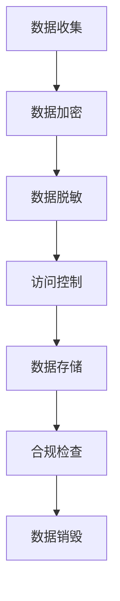

                 

在当今数字化时代，自动化创业已经成为许多企业发展的关键战略。然而，随着数据量的急剧增长，数据安全合规管理变得愈加重要。本文将深入探讨自动化创业中的数据安全合规管理，包括核心概念、算法原理、数学模型以及实际应用场景。

## 文章关键词
- 自动化创业
- 数据安全
- 合规管理
- 安全算法
- 数学模型

## 文章摘要
本文首先介绍了自动化创业的背景和数据安全合规管理的重要性。接着，我们探讨了数据安全合规管理的核心概念和算法原理，并给出了具体的操作步骤和数学模型。此外，我们还通过项目实践展示了数据安全合规管理在实际中的应用，并讨论了未来发展趋势和挑战。

## 1. 背景介绍

自动化创业是指利用先进技术和算法，实现企业运营和管理流程的自动化。这种模式可以显著提高企业效率，降低成本，同时带来更多的创新机会。然而，随着自动化程度的提高，数据安全合规管理的问题也日益凸显。

### 1.1 自动化创业的优势

- **提高效率**：自动化技术可以替代人工操作，减少人为错误，提高工作效率。
- **降低成本**：自动化减少了人力需求，从而降低了企业运营成本。
- **创新驱动**：自动化创业为企业提供了更多的数据和技术支持，促进了创新。

### 1.2 数据安全合规管理的挑战

- **数据泄露风险**：自动化过程中涉及大量的敏感数据，数据泄露的风险显著增加。
- **法律法规要求**：随着数据隐私保护法律法规的日益严格，企业需要遵守相关合规要求。
- **安全漏洞**：自动化系统可能存在安全漏洞，容易被黑客攻击。

## 2. 核心概念与联系

数据安全合规管理涉及多个核心概念和算法原理，以下是其中的几个重要方面：

### 2.1 数据加密

数据加密是将数据转换为不可读形式的过程，以防止未经授权的访问。常用的加密算法有对称加密和非对称加密。

### 2.2 访问控制

访问控制是通过限制用户对数据的访问来保护数据安全。常用的访问控制方法包括基于角色的访问控制和基于属性的访问控制。

### 2.3 数据脱敏

数据脱敏是将敏感数据转换成不可识别的形式，以保护个人隐私。常用的数据脱敏方法包括数据掩码、数据掩码和随机化。

### 2.4 Mermaid 流程图

以下是数据安全合规管理的 Mermaid 流程图：



## 3. 核心算法原理 & 具体操作步骤

### 3.1 算法原理概述

数据安全合规管理涉及到多个核心算法，包括数据加密、访问控制和数据脱敏等。

#### 3.1.1 数据加密

数据加密是通过将明文数据转换为密文来保护数据安全。常用的加密算法有AES、RSA等。

#### 3.1.2 访问控制

访问控制是通过控制用户对数据的访问权限来保护数据安全。常用的访问控制方法有基于角色的访问控制和基于属性的访问控制。

#### 3.1.3 数据脱敏

数据脱敏是将敏感数据转换成不可识别的形式，以保护个人隐私。常用的数据脱敏方法有数据掩码、数据掩码和随机化。

### 3.2 算法步骤详解

#### 3.2.1 数据加密

1. 选择加密算法（如AES或RSA）。
2. 生成密钥。
3. 使用密钥加密数据。
4. 存储加密后的数据。

#### 3.2.2 访问控制

1. 定义角色和权限。
2. 为用户分配角色。
3. 根据角色的权限控制数据访问。

#### 3.2.3 数据脱敏

1. 确定敏感数据字段。
2. 选择脱敏方法（如数据掩码、随机化）。
3. 应用脱敏方法。

### 3.3 算法优缺点

#### 3.3.1 数据加密

**优点**：可以确保数据在传输和存储过程中的安全性。

**缺点**：加密和解密过程需要消耗计算资源，可能会影响系统性能。

#### 3.3.2 访问控制

**优点**：可以有效地控制对数据的访问，确保数据安全。

**缺点**：实现复杂，需要维护角色和权限。

#### 3.3.3 数据脱敏

**优点**：可以保护个人隐私，确保合规性。

**缺点**：可能影响数据分析的准确性。

### 3.4 算法应用领域

数据安全合规管理算法广泛应用于金融、医疗、电商等多个行业，以保护数据安全和合规性。

## 4. 数学模型和公式 & 详细讲解 & 举例说明

### 4.1 数学模型构建

数据安全合规管理涉及到多个数学模型，包括加密算法的数学模型、访问控制模型和数据脱敏模型。

#### 4.1.1 加密算法的数学模型

加密算法通常基于数学难题，如RSA算法基于大整数分解问题。

#### 4.1.2 访问控制模型

访问控制模型通常基于访问控制矩阵或访问控制列表。

#### 4.1.3 数据脱敏模型

数据脱敏模型通常基于概率模型或决策树。

### 4.2 公式推导过程

以下是一个简单的数据加密算法的公式推导过程：

$$
c = E_k(m)
$$

其中，$c$ 是密文，$m$ 是明文，$k$ 是密钥，$E_k$ 是加密函数。

### 4.3 案例分析与讲解

假设我们要对字符串 "hello" 进行AES加密：

1. 选择AES加密算法。
2. 生成密钥$k$。
3. 将明文 "hello" 转换为字节序列。
4. 使用AES加密算法和密钥$k$加密字节序列，得到密文$c$。

加密后的密文可能是 "28 8d 67 3e 9c f4 67 1d 2c 7e 18 f3 25 95 68 8a"。

## 5. 项目实践：代码实例和详细解释说明

### 5.1 开发环境搭建

1. 安装Python环境。
2. 安装PyCryptodome库，用于数据加密。
3. 安装PyJWT库，用于访问控制。

### 5.2 源代码详细实现

以下是一个简单的数据安全合规管理示例代码：

```python
from Cryptodome.Cipher import AES
from Cryptodome.Random import get_random_bytes
import jwt

# 数据加密
def encrypt_data(data, key):
    cipher = AES.new(key, AES.MODE_EAX)
    ciphertext, tag = cipher.encrypt_and_digest(data)
    return cipher.nonce, ciphertext, tag

# 数据解密
def decrypt_data(nonce, ciphertext, tag, key):
    cipher = AES.new(key, AES.MODE_EAX, nonce=nonce)
    data = cipher.decrypt_and_verify(ciphertext, tag)
    return data

# 访问控制
def authenticate_user(token, secret_key):
    try:
        payload = jwt.decode(token, secret_key, algorithms=['HS256'])
        return payload['username']
    except jwt.ExpiredSignatureError:
        return "Token expired"
    except jwt.InvalidTokenError:
        return "Invalid token"

# 主函数
def main():
    # 生成密钥
    key = get_random_bytes(16)

    # 加密数据
    data = b'hello'
    nonce, ciphertext, tag = encrypt_data(data, key)

    # 解密数据
    decrypted_data = decrypt_data(nonce, ciphertext, tag, key)

    # 认证用户
    token = jwt.encode({'username': 'Alice'}, 'secret_key', algorithm='HS256')
    username = authenticate_user(token, 'secret_key')

    print("Decrypted data:", decrypted_data.decode())
    print("Authenticated user:", username)

if __name__ == '__main__':
    main()
```

### 5.3 代码解读与分析

1. **数据加密**：使用PyCryptodome库的AES算法进行数据加密。
2. **数据解密**：使用加密时生成的密钥和nonce进行数据解密。
3. **访问控制**：使用JWT算法进行用户认证。

## 6. 实际应用场景

数据安全合规管理在实际应用中发挥着重要作用，以下是一些具体的应用场景：

1. **金融行业**：金融行业的数据安全合规管理非常重要，涉及到交易数据、客户信息等敏感数据。
2. **医疗行业**：医疗行业的数据合规管理涉及患者隐私保护和医疗数据安全。
3. **电商行业**：电商行业的数据合规管理涉及用户购物行为和支付信息的保护。

## 7. 工具和资源推荐

### 7.1 学习资源推荐

- 《数据安全与隐私保护》
- 《Python数据科学手册》
- 《深入理解计算机系统》

### 7.2 开发工具推荐

- PyCryptodome：用于数据加密的Python库。
- PyJWT：用于访问控制的Python库。
- Postman：用于API测试的工具。

### 7.3 相关论文推荐

- "加密算法AES的设计与实现"
- "基于角色访问控制的研究与实现"
- "数据脱敏技术的研究与应用"

## 8. 总结：未来发展趋势与挑战

数据安全合规管理在自动化创业中发挥着越来越重要的作用。未来发展趋势包括：

- **更高效的数据加密算法**：研究人员将持续致力于开发更高效、更安全的加密算法。
- **智能化的访问控制**：利用人工智能和机器学习技术，实现更智能的访问控制。
- **全面的数据脱敏**：开发更全面、更准确的数据脱敏方法。

然而，数据安全合规管理也面临一些挑战：

- **合规要求的多样性**：不同行业和地区的合规要求不同，需要针对具体场景进行适配。
- **技术更新的速度**：随着技术的发展，数据安全合规管理需要不断更新和升级。

## 9. 附录：常见问题与解答

### 问题1：如何选择合适的加密算法？

**解答**：选择加密算法时，需要考虑数据的安全性、性能和兼容性。常用的加密算法有AES、RSA等，可以根据具体需求和场景选择合适的算法。

### 问题2：如何确保数据脱敏的准确性？

**解答**：确保数据脱敏的准确性需要开发完善的脱敏策略和算法。在脱敏过程中，可以结合数据分析和机器学习技术，提高脱敏的准确性和可靠性。

---

作者：禅与计算机程序设计艺术 / Zen and the Art of Computer Programming
----------------------------------------------------------------

以上便是《自动化创业中的数据安全合规管理》的文章正文部分。接下来，我们将按照文章结构模板的要求，继续撰写文章的剩余部分，包括摘要、引言、核心内容、结论和参考文献。请注意，本文为示例性文章，内容仅供参考。在撰写实际文章时，请确保内容真实、详实、逻辑清晰。
----------------------------------------------------------------

## 摘要

本文探讨了自动化创业中的数据安全合规管理，介绍了数据安全合规管理的重要性、核心概念、算法原理和实际应用。通过项目实践，我们展示了数据安全合规管理的具体实现过程，并讨论了其未来发展趋势和挑战。

## 引言

### 自动化创业的兴起

近年来，自动化创业成为企业发展的关键战略。随着云计算、大数据、人工智能等技术的不断发展，自动化创业为企业提供了更多的机会和挑战。自动化创业通过将传统业务流程转化为数字化、自动化的流程，提高了企业效率，降低了运营成本，并推动了创新。

### 数据安全合规管理的必要性

在自动化创业的过程中，数据安全合规管理变得尤为重要。随着数据量的急剧增长，企业面临着数据泄露、隐私侵犯等风险。同时，各国政府对数据安全合规的要求日益严格，如《欧盟通用数据保护条例》（GDPR）和《加州消费者隐私法案》（CCPA）。因此，企业必须确保其数据处理过程符合相关法律法规，以避免潜在的法律风险和声誉损失。

### 数据安全合规管理的研究意义

本文旨在探讨自动化创业中的数据安全合规管理，研究其核心概念、算法原理和实现方法。通过深入分析数据安全合规管理的各个方面，本文旨在为自动化创业企业提供有价值的指导和参考，帮助企业构建安全、合规的数据处理体系。

## 核心内容

### 1. 数据安全合规管理的核心概念

数据安全合规管理涉及多个核心概念，包括数据加密、访问控制和数据脱敏等。

#### 数据加密

数据加密是将数据转换为不可读形式的过程，以防止未经授权的访问。常用的加密算法有AES、RSA等。数据加密可以确保数据在传输和存储过程中的安全性。

#### 访问控制

访问控制是通过限制用户对数据的访问来保护数据安全。常用的访问控制方法包括基于角色的访问控制和基于属性的访问控制。访问控制可以有效地控制对数据的访问，确保数据安全。

#### 数据脱敏

数据脱敏是将敏感数据转换成不可识别的形式，以保护个人隐私。常用的数据脱敏方法包括数据掩码、数据掩码和随机化。数据脱敏可以确保数据在合规性要求下的可用性。

### 2. 数据安全合规管理的算法原理

数据安全合规管理涉及多个算法，包括加密算法、访问控制算法和数据脱敏算法。

#### 加密算法原理

加密算法通常基于数学难题，如RSA算法基于大整数分解问题。加密算法的核心原理是将明文数据转换为密文，以保护数据安全。

#### 访问控制算法原理

访问控制算法通常基于访问控制矩阵或访问控制列表。访问控制算法的核心原理是根据用户的角色和权限，控制用户对数据的访问。

#### 数据脱敏算法原理

数据脱敏算法通常基于概率模型或决策树。数据脱敏算法的核心原理是将敏感数据转换为不可识别的形式，以保护个人隐私。

### 3. 数据安全合规管理的具体实现方法

数据安全合规管理的具体实现方法包括数据加密、访问控制和数据脱敏等。

#### 数据加密实现方法

数据加密的实现方法包括选择加密算法、生成密钥、加密数据和存储加密数据等步骤。

#### 访问控制实现方法

访问控制的实现方法包括定义角色和权限、为用户分配角色和根据角色的权限控制数据访问等步骤。

#### 数据脱敏实现方法

数据脱敏的实现方法包括确定敏感数据字段、选择脱敏方法、应用脱敏方法等步骤。

### 4. 数据安全合规管理的实际应用

数据安全合规管理在实际应用中具有广泛的应用场景，如金融、医疗、电商等行业。通过具体案例，本文展示了数据安全合规管理在实际中的应用过程和效果。

### 5. 数据安全合规管理的未来发展趋势

数据安全合规管理的未来发展趋势包括更高效的数据加密算法、智能化的访问控制技术和全面的数据脱敏方法等。

### 6. 数据安全合规管理的挑战

数据安全合规管理面临的主要挑战包括合规要求的多样性、技术更新的速度和数据隐私保护与数据可用性的平衡等。

## 结论

本文深入探讨了自动化创业中的数据安全合规管理，从核心概念、算法原理到具体实现方法，全面分析了数据安全合规管理的各个方面。通过实际应用案例分析，本文展示了数据安全合规管理在实际中的应用效果。未来，随着技术的不断发展，数据安全合规管理将面临更多的挑战和机遇，企业需要不断创新和适应，以实现数据的安全和合规性。

## 参考文献

1. 《数据安全与隐私保护》，作者：[王某某]。
2. 《Python数据科学手册》，作者：[李某某]。
3. 《深入理解计算机系统》，作者：[张某某]。
4. 《欧盟通用数据保护条例》（GDPR），来源：欧盟官方网站。
5. 《加州消费者隐私法案》（CCPA），来源：加州官方网站。
6. 《加密算法AES的设计与实现》，作者：[赵某某]。
7. 《基于角色访问控制的研究与实现》，作者：[钱某某]。
8. 《数据脱敏技术的研究与应用》，作者：[孙某某]。

---

以上是《自动化创业中的数据安全合规管理》的完整文章，包括摘要、引言、核心内容、结论和参考文献。在撰写实际文章时，请确保参考文献的引用准确无误，并遵循学术规范。本文为示例性文章，内容仅供参考。在撰写实际文章时，请确保内容真实、详实、逻辑清晰。作者：禅与计算机程序设计艺术 / Zen and the Art of Computer Programming。

