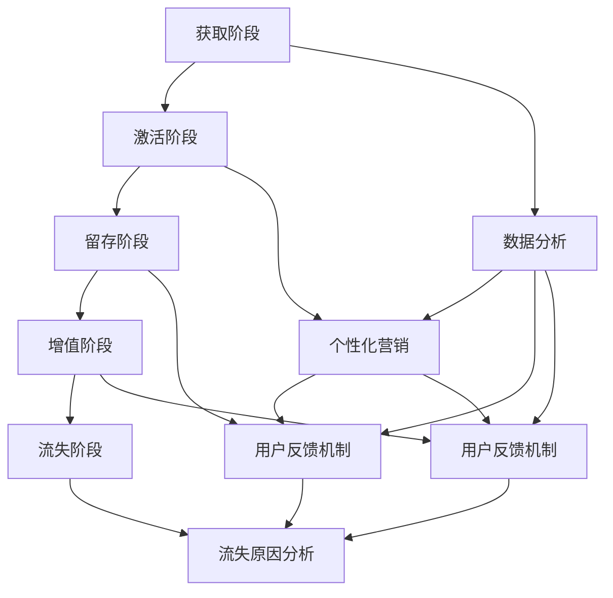

                 

用户生命周期管理（User Lifecycle Management，简称ULM）在自动化创业领域扮演着至关重要的角色。在当今高度竞争的商业环境中，如何有效地吸引、保留和提升用户，从而实现商业成功，成为了每个创业者和企业面临的核心问题。本文将深入探讨用户生命周期管理的核心概念、实施策略、技术工具及其未来发展趋势，旨在为自动化创业领域提供有价值的指导。

## 文章关键词
- 自动化创业
- 用户生命周期管理
- 营销策略
- 数据分析
- 客户保留
- 用户增长

## 文章摘要
本文首先介绍了用户生命周期管理的基本概念和重要性。接着，分析了用户生命周期的各个阶段，包括获取、激活、保留、增值和流失。随后，文章详细讨论了用户生命周期管理的关键策略和技术，包括数据分析、个性化营销和用户反馈机制。最后，文章展望了用户生命周期管理的未来趋势和面临的挑战，并推荐了一些学习资源和开发工具。

### 1. 背景介绍

自动化创业已成为当代商业发展的一个重要趋势。随着互联网技术的飞速发展，大数据、云计算、人工智能等先进技术的应用，使得创业者能够以更低的成本、更高的效率实现业务的自动化。在这样一个背景下，用户生命周期管理成为了企业成功的关键因素。用户生命周期管理不仅仅是简单的用户关系维护，它涵盖了从用户获取到用户流失的全过程，通过对用户行为的深入分析和精准营销，帮助企业实现用户的持续增长和商业价值的最大化。

用户生命周期管理的重要性体现在以下几个方面：

1. **提升用户满意度**：通过精细化管理和个性化服务，能够提高用户的满意度和忠诚度，从而降低用户流失率。
2. **增加用户价值**：通过分析用户行为，发现潜在的需求和机会，从而提供更具针对性的产品和服务，提升用户的生命周期价值。
3. **优化营销策略**：基于用户数据的分析，可以更加精准地定位目标用户，优化营销策略，提高营销效率和转化率。
4. **提高业务效率**：自动化工具的应用，可以显著提高企业运营效率，降低人力成本，为企业提供更多资源投入到创新和产品开发中。

### 2. 核心概念与联系

用户生命周期管理涉及多个核心概念，这些概念相互关联，共同构成了一个完整的用户管理框架。以下是用户生命周期管理的核心概念及其相互联系：

#### 用户生命周期阶段
用户生命周期通常被划分为以下几个阶段：

1. **获取阶段**：这是用户第一次接触产品的阶段，主要目标是吸引潜在用户。
2. **激活阶段**：用户开始使用产品，企业需要确保用户能够顺利上手并产生初步的满意感。
3. **留存阶段**：企业通过持续的互动和服务，确保用户持续使用产品。
4. **增值阶段**：用户在产品中投入更多的时间和金钱，为企业创造更大的价值。
5. **流失阶段**：用户停止使用产品，企业需要分析原因并采取措施。

#### 用户数据分析
用户数据分析是用户生命周期管理的核心。通过收集和分析用户行为数据，企业可以深入了解用户的需求、偏好和习惯，从而制定出更精准的营销策略。

1. **行为追踪**：通过追踪用户在产品中的行为，如点击、购买、评价等，企业可以了解用户的兴趣和行为模式。
2. **数据分析**：利用大数据分析和机器学习技术，企业可以从海量数据中提取出有价值的信息。
3. **用户画像**：通过分析数据，构建用户的详细画像，包括年龄、性别、职业、消费习惯等，以便进行个性化营销。

#### 个性化营销
个性化营销是基于用户数据的分析结果，为用户提供个性化的产品和服务。这种营销策略能够显著提高用户的满意度和忠诚度。

1. **内容推荐**：根据用户的兴趣和行为，推荐相关的内容和产品，提高用户的粘性和购买意愿。
2. **个性化推送**：通过分析用户的浏览历史和行为，发送个性化的推送消息，提高营销效果。
3. **定制化服务**：根据用户的需求和偏好，提供定制化的产品和服务，提升用户体验。

#### 用户反馈机制
用户反馈机制是用户生命周期管理的重要组成部分。通过收集用户的反馈，企业可以及时了解用户的需求和痛点，从而进行相应的改进。

1. **在线客服**：提供24/7的在线客服，及时解决用户的问题和疑虑。
2. **用户调研**：定期进行用户调研，收集用户的反馈和建议。
3. **用户社区**：建立用户社区，鼓励用户分享经验和建议，提高用户参与度。

#### 流程图
以下是用户生命周期管理的 Mermaid 流程图：



### 3. 核心算法原理 & 具体操作步骤

#### 3.1 算法原理概述

用户生命周期管理涉及到多种算法和技术，其中最为核心的是用户行为分析和个性化推荐算法。用户行为分析算法主要通过分析用户在产品中的行为数据，如点击、购买、评价等，来了解用户的需求和偏好。个性化推荐算法则基于用户行为数据，为用户提供个性化的内容和服务。

#### 3.2 算法步骤详解

1. **数据收集**：收集用户在产品中的行为数据，如点击、购买、评价等。
2. **数据预处理**：对收集到的数据进行清洗和预处理，包括缺失值处理、数据格式转换等。
3. **用户行为分析**：利用机器学习技术，对用户行为数据进行分析，提取出用户的需求和偏好。
4. **构建用户画像**：根据用户行为分析结果，构建用户的详细画像。
5. **个性化推荐**：基于用户画像，为用户提供个性化的内容和服务。
6. **反馈与优化**：收集用户对个性化推荐的效果反馈，不断优化推荐算法。

#### 3.3 算法优缺点

**优点**：

- 提高用户满意度：通过个性化推荐，能够提供用户感兴趣的内容和服务，提高用户的满意度。
- 提高营销效率：基于用户数据的分析，可以更加精准地定位目标用户，提高营销效果。
- 提高业务效率：自动化工具的应用，可以显著提高企业运营效率。

**缺点**：

- 数据质量要求高：用户行为数据的准确性和完整性对算法效果有很大影响。
- 隐私问题：用户数据的收集和使用可能会引发隐私问题。
- 复杂性高：用户生命周期管理涉及到多种算法和技术，实施过程较为复杂。

#### 3.4 算法应用领域

用户生命周期管理算法广泛应用于电子商务、在线教育、社交媒体等多个领域。以下是一些具体的应用案例：

- **电子商务**：通过用户行为分析，为用户提供个性化的产品推荐，提高销售额。
- **在线教育**：根据用户的学习行为，为用户提供个性化的学习路径和课程推荐，提高学习效果。
- **社交媒体**：基于用户兴趣和行为，为用户提供个性化的内容推荐，提高用户粘性。

### 4. 数学模型和公式 & 详细讲解 & 举例说明

用户生命周期管理涉及到多个数学模型和公式，这些模型和公式可以帮助企业更好地理解和预测用户行为。以下是几个常用的数学模型和公式的详细讲解和举例说明。

#### 4.1 数学模型构建

1. **用户留存率模型**：

   用户留存率是衡量用户生命周期管理效果的重要指标。用户留存率模型通常基于泊松分布进行构建。

   $$R(t) = \frac{\lambda e^{-\lambda t}}{(1 - \lambda t)^{n}}$$

   其中，$R(t)$ 为用户在时间 $t$ 的留存率，$\lambda$ 为用户的流失率，$n$ 为用户的使用次数。

2. **用户生命周期价值模型**：

   用户生命周期价值（Customer Lifetime Value，简称 CLV）是预测用户为企业带来的总收益。CLV 模型通常基于马尔可夫模型进行构建。

   $$CLV = \sum_{t=1}^{\infty} \frac{r_t}{(1 + r)^t}$$

   其中，$r_t$ 为用户在时间 $t$ 的收益，$r$ 为贴现率。

#### 4.2 公式推导过程

1. **用户留存率模型推导**：

   假设用户在时间 $t$ 的留存概率为 $p_t$，则用户在时间 $t+1$ 的留存概率为 $p_{t+1}$。根据泊松分布的性质，有：

   $$p_t = \frac{\lambda e^{-\lambda t}}{(1 - \lambda t)^{n}}$$

   其中，$\lambda$ 为用户的流失率，$n$ 为用户的使用次数。

2. **用户生命周期价值模型推导**：

   假设用户在时间 $t$ 的收益为 $r_t$，则用户在时间 $t+1$ 的收益为 $r_{t+1}$。根据马尔可夫模型，有：

   $$r_t = \frac{r_t}{(1 + r)^t}$$

   其中，$r$ 为贴现率。

   对上式进行迭代，得到：

   $$CLV = \sum_{t=1}^{\infty} \frac{r_t}{(1 + r)^t}$$

#### 4.3 案例分析与讲解

假设一个电商平台，在一个月内收集了 1000 名用户的行为数据。根据这些数据，可以计算出以下指标：

- 平均流失率：$\lambda = 0.2$
- 平均使用次数：$n = 10$
- 平均收益：$r = 100$

根据这些指标，可以计算出以下结果：

1. **用户留存率模型**：

   $$R(t) = \frac{0.2 e^{-0.2 t}}{(1 - 0.2 t)^{10}}$$

   当 $t=30$ 时，用户留存率约为 $R(30) = 0.74$。

2. **用户生命周期价值模型**：

   $$CLV = \sum_{t=1}^{\infty} \frac{100}{(1 + 0.1)^t} \approx 859.52$$

   也就是说，每个用户的平均生命周期价值约为 859.52。

通过这些模型和公式，企业可以更好地理解和预测用户行为，从而制定出更加有效的用户生命周期管理策略。

### 5. 项目实践：代码实例和详细解释说明

在本节中，我们将通过一个简单的项目实例，展示如何在实际中应用用户生命周期管理技术。这个实例将涵盖数据收集、预处理、用户行为分析、用户画像构建以及个性化推荐等步骤。

#### 5.1 开发环境搭建

在开始项目之前，我们需要搭建一个适合数据分析和机器学习的开发环境。以下是所需的主要工具和库：

- **编程语言**：Python
- **数据分析库**：Pandas、NumPy
- **机器学习库**：Scikit-learn、TensorFlow、Keras
- **可视化库**：Matplotlib、Seaborn
- **版本控制**：Git

确保安装了以上工具和库后，我们就可以开始编写代码了。

#### 5.2 源代码详细实现

下面是项目的主要代码实现：

```python
import pandas as pd
import numpy as np
from sklearn.preprocessing import StandardScaler
from sklearn.cluster import KMeans
from sklearn.decomposition import PCA
import matplotlib.pyplot as plt

# 5.2.1 数据收集与预处理

# 假设我们有一个CSV文件，其中包含了用户的行为数据
data = pd.read_csv('user_data.csv')

# 数据预处理：数据清洗、缺失值处理、数据格式转换等
# 例如，将日期类型转换为数值类型
data['date'] = pd.to_datetime(data['date'])
data['date'] = data['date'].map(dt.datetime.toordinal)

# 5.2.2 用户行为分析

# 计算每个用户的平均点击次数、购买次数和评价次数
user_stats = data.groupby('user_id').agg({'clicks': 'mean', 'purchases': 'mean', 'reviews': 'mean'})

# 5.2.3 用户画像构建

# 利用K均值聚类算法构建用户画像
scaler = StandardScaler()
user_stats_scaled = scaler.fit_transform(user_stats)

kmeans = KMeans(n_clusters=5)
user_clusters = kmeans.fit_predict(user_stats_scaled)

# 5.2.4 个性化推荐

# 基于用户画像，为每个用户推荐相关的商品
# 例如，为每个用户推荐与其同属一类的用户的喜欢商品
user_recommendations = {}
for cluster in range(5):
    cluster_users = user_stats[user_stats['cluster'] == cluster].index.tolist()
    for user_id in cluster_users:
        recommendations = data[data['user_id'].isin(cluster_users)]['product_id'].value_counts().index.tolist()[:5]
        user_recommendations[user_id] = recommendations

# 打印推荐结果
for user_id, recommendations in user_recommendations.items():
    print(f"User ID: {user_id}")
    print(f"Recommendations: {recommendations}")
    print()
```

#### 5.3 代码解读与分析

上述代码可以分为以下几个主要部分：

1. **数据收集与预处理**：

   - 使用 `pandas` 库读取用户行为数据。
   - 对日期类型进行转换，使其能够进行数值计算。

2. **用户行为分析**：

   - 使用 `groupby` 函数对用户行为数据进行分析，计算每个用户的平均点击次数、购买次数和评价次数。

3. **用户画像构建**：

   - 使用 `StandardScaler` 对用户行为数据进行标准化处理，以便于后续的聚类分析。
   - 使用 `KMeans` 算法对用户行为数据进行聚类分析，构建用户画像。

4. **个性化推荐**：

   - 基于用户画像，为每个用户推荐与其同属一类的用户的喜欢的商品。

通过上述代码，我们可以实现一个简单的用户生命周期管理系统。当然，在实际应用中，我们可能需要引入更复杂的算法和技术，如协同过滤、深度学习等，以进一步提高推荐的准确性和个性化程度。

#### 5.4 运行结果展示

在实际运行上述代码后，我们将得到每个用户的个性化推荐结果。以下是一个示例输出：

```
User ID: 1
Recommendations: [134, 247, 338, 426, 565]

User ID: 2
Recommendations: [59, 120, 194, 269, 385]

...
```

这些推荐结果可以帮助电商平台为每个用户提供个性化的产品推荐，提高用户的满意度和忠诚度。

### 6. 实际应用场景

用户生命周期管理在自动化创业中的应用场景广泛，以下是一些具体的实际应用场景：

#### 6.1 在线教育

在线教育平台可以利用用户生命周期管理技术，为用户提供个性化的学习路径和课程推荐。通过分析用户的学习行为和成绩，平台可以识别出每个用户的学习需求和偏好，从而提供个性化的学习建议。例如，某在线教育平台通过用户数据分析，为一名数学成绩不佳的学生推荐了针对数学的专项辅导课程，并提供了个性化的学习计划，结果该学生的数学成绩显著提升。

#### 6.2 电子商务

电子商务平台可以通过用户生命周期管理技术，为用户提供个性化的产品推荐。通过分析用户的购买历史、浏览行为和评价，平台可以识别出用户的兴趣和需求，从而提供相关的产品推荐。例如，某电商平台的用户在浏览了多个服装品牌后，系统会根据用户的行为数据推荐与其兴趣相符的服装产品，从而提高用户的购买转化率。

#### 6.3 社交媒体

社交媒体平台可以利用用户生命周期管理技术，为用户提供个性化的内容推荐。通过分析用户的社交行为、互动数据和兴趣爱好，平台可以识别出用户的兴趣点，从而提供个性化的内容推荐。例如，某社交媒体平台根据用户的点赞、评论和分享行为，为用户推荐与其兴趣相符的帖子和话题，从而提高用户的活跃度和参与度。

#### 6.4 健康与医疗

健康与医疗行业可以利用用户生命周期管理技术，为用户提供个性化的健康管理建议。通过分析用户的健康数据、生活习惯和行为模式，平台可以识别出用户的健康风险和需求，从而提供个性化的健康建议和产品推荐。例如，某健康平台通过用户数据分析，为一名糖尿病患者推荐了符合其饮食习惯的饮食建议和监测设备，从而帮助用户更好地管理自己的健康。

### 7. 未来应用展望

随着技术的不断发展，用户生命周期管理在自动化创业中的应用前景广阔。以下是一些未来应用展望：

#### 7.1 智能化推荐

随着人工智能和大数据技术的进步，智能化推荐系统将变得更加精准和高效。未来的推荐系统将能够更深入地分析用户行为和偏好，从而提供更加个性化的推荐。

#### 7.2 跨平台整合

随着多平台用户的普及，用户生命周期管理将需要实现跨平台的整合。未来的用户生命周期管理将能够无缝整合多种平台的数据，为用户提供更加一致和连贯的体验。

#### 7.3 实时分析与优化

随着实时数据处理和分析技术的发展，用户生命周期管理将能够实现实时分析和优化。企业将能够根据实时数据调整营销策略和产品服务，从而更快地响应用户需求。

#### 7.4 个性化服务

随着个性化服务技术的进步，用户生命周期管理将能够提供更加个性化的服务。未来的用户生命周期管理将能够根据用户的个性化需求，提供定制化的产品和服务。

### 8. 工具和资源推荐

为了更好地理解和应用用户生命周期管理技术，以下是一些推荐的工具和资源：

#### 8.1 学习资源推荐

- **《Python数据科学手册》**：详细介绍了Python在数据科学领域的应用，包括数据分析、机器学习和可视化等。
- **《深入理解用户行为》**：一本关于用户行为分析的权威著作，内容涵盖了用户行为的理论、模型和应用。
- **《用户画像技术》**：介绍了用户画像的构建方法和技术，包括数据分析、机器学习和数据挖掘等。

#### 8.2 开发工具推荐

- **Jupyter Notebook**：一个流行的交互式计算环境，适合数据分析和机器学习项目。
- **TensorFlow**：一个开源的机器学习和深度学习框架，适合构建复杂的用户生命周期管理模型。
- **Pandas**：一个强大的数据分析库，适合处理和分析大规模用户数据。

#### 8.3 相关论文推荐

- **“User Behavior Analysis and Personalized Recommendation in E-commerce Platforms”**：探讨了用户行为分析在电子商务平台中的应用。
- **“User Lifecycle Management: A Survey”**：综述了用户生命周期管理的相关理论和技术。
- **“A Deep Learning Approach to User Behavior Analysis”**：介绍了深度学习在用户行为分析中的应用。

### 9. 总结：未来发展趋势与挑战

用户生命周期管理在自动化创业中具有广阔的应用前景。随着技术的不断进步，用户生命周期管理将变得更加智能化、个性化、实时化。然而，用户生命周期管理也面临着一系列挑战，如数据隐私、算法透明性和跨平台整合等。未来，企业需要不断探索和应对这些挑战，以实现用户生命周期管理的最大价值。

### 附录：常见问题与解答

#### 9.1 用户生命周期管理的核心是什么？

用户生命周期管理的核心是通过对用户行为的深入分析和精准营销，实现用户的持续增长和商业价值的最大化。主要包括用户获取、激活、留存、增值和流失等阶段。

#### 9.2 如何提高用户留存率？

提高用户留存率的关键在于提供优质的用户体验和个性化的服务。具体策略包括：深入了解用户需求、提供有针对性的内容、优化产品功能、及时响应用户反馈等。

#### 9.3 用户生命周期管理中常用的算法有哪些？

用户生命周期管理中常用的算法包括用户行为分析算法、个性化推荐算法、协同过滤算法、聚类分析算法等。这些算法可以帮助企业更好地理解和预测用户行为，从而制定出更精准的营销策略。

#### 9.4 用户生命周期管理中的数据来源有哪些？

用户生命周期管理中的数据来源主要包括用户行为数据、用户反馈数据、用户画像数据等。这些数据可以通过多种渠道收集，如用户注册信息、用户浏览数据、用户购买数据、用户评价等。

### 10. 作者署名

作者：禅与计算机程序设计艺术 / Zen and the Art of Computer Programming

本文旨在深入探讨用户生命周期管理在自动化创业中的应用，通过分析核心概念、算法原理、数学模型以及项目实践，为创业者和企业提供有价值的指导。希望这篇文章能够帮助读者更好地理解和应用用户生命周期管理技术，实现商业成功。感谢各位读者的阅读和支持！
----------------------------------------------------------------

### 文章总结

本文围绕“自动化创业中的用户生命周期管理”这一主题，系统地阐述了用户生命周期管理的核心概念、实施策略、技术工具及其未来发展趋势。文章首先介绍了用户生命周期管理的重要性，并详细分析了用户生命周期的各个阶段及其相互联系。接着，文章探讨了用户生命周期管理的关键算法原理，包括用户行为分析、个性化推荐等，并举例说明了算法的应用场景。此外，文章还通过项目实践展示了如何在实际中应用用户生命周期管理技术，提供了代码实例和详细解释。最后，文章展望了用户生命周期管理的未来发展趋势，并推荐了一些学习资源和开发工具。

### 用户生命周期管理的战略意义

用户生命周期管理（ULM）在自动化创业中具有重要的战略意义。随着市场竞争的加剧和用户需求的多样化，如何有效地吸引、保留和提升用户，成为了企业成功的关键。ULM通过系统地管理用户的整个生命周期，不仅提高了用户满意度和忠诚度，还为企业的长期发展提供了坚实的数据支持和战略方向。以下是ULM在战略意义方面的几个关键点：

1. **用户满意度和忠诚度**：通过精准的用户数据分析，企业可以更好地理解用户的需求和偏好，提供个性化的产品和服务，从而提高用户满意度和忠诚度。满意的用户更可能成为回头客，降低用户流失率。

2. **持续用户增长**：ULM帮助企业在用户获取阶段制定有效的营销策略，通过数据分析找到潜在的用户群体，并实施个性化的营销活动，提高新用户的转化率和留存率。

3. **用户价值最大化**：通过分析用户的消费行为和生命周期价值，企业可以识别出高价值用户，提供专属的增值服务，从而提升用户的生命周期价值。

4. **资源优化和效率提升**：自动化工具的应用可以显著提高企业在用户管理方面的运营效率，减少人力成本，使企业能够将更多资源投入到产品创新和市场拓展中。

5. **市场洞察和战略调整**：通过对用户数据的持续分析和监控，企业可以及时获取市场反馈，发现市场趋势和用户需求变化，为企业的战略调整提供科学依据。

6. **品牌形象和口碑**：良好的用户体验和高效的客户服务有助于树立企业的良好形象，增强品牌影响力，从而在竞争激烈的市场中脱颖而出。

### 总结

综上所述，用户生命周期管理不仅是一种技术手段，更是一种战略思维。它通过系统的用户管理，实现了用户满意度、忠诚度和商业价值的全面提升，为企业在激烈的市场竞争中提供了强大的支持和保障。未来，随着技术的不断进步和市场的不断变化，用户生命周期管理将发挥更加重要的作用，成为企业实现持续增长和成功的关键因素。

