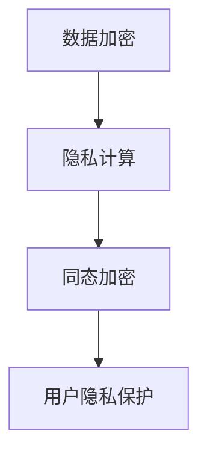

                 

### 关键词 Keywords ###
- 自动化创业
- 用户隐私保护
- 数据加密
- 隐私计算
- 同态加密
- 加密技术

### 摘要 Abstract ###
在自动化创业浪潮中，用户隐私保护成为了一个不容忽视的关键问题。本文将探讨自动化创业中用户隐私保护的重要性，并详细介绍几种关键技术，如数据加密、隐私计算和同态加密等，以帮助创业团队在设计产品时考虑到用户隐私保护。此外，文章还将讨论未来自动化创业中用户隐私保护的发展趋势和面临的挑战，为业界提供有益的参考。

## 1. 背景介绍

### 自动化创业的兴起

近年来，随着人工智能、大数据和云计算等技术的发展，自动化创业已成为一股不可忽视的潮流。自动化技术能够帮助企业降低运营成本、提高生产效率和客户满意度，从而在激烈的市场竞争中脱颖而出。然而，随着自动化程度的提升，企业对用户数据的依赖也日益增加。这些数据不仅包括用户的基本信息，还涵盖了用户的浏览记录、购买行为和社交互动等隐私信息。

### 用户隐私保护的重要性

用户隐私保护在自动化创业中具有重要意义。首先，用户隐私泄露可能导致严重的法律和财务风险，如数据泄露事件可能使企业面临巨额罚款和声誉损失。其次，用户隐私保护是赢得用户信任的关键因素。在互联网时代，用户越来越重视个人隐私保护，对于未能有效保护用户隐私的企业，用户可能会选择离开，甚至对市场产生负面影响。

### 现存挑战

尽管用户隐私保护的重要性已被广泛认识，但在自动化创业中，用户隐私保护仍面临诸多挑战。首先，数据量的急剧增长使得隐私保护技术面临巨大的压力。其次，传统的隐私保护方法往往在性能和实用性方面存在不足。此外，法律法规的滞后和监管不足也增加了用户隐私保护难度。

## 2. 核心概念与联系

### 数据加密

数据加密是用户隐私保护的基础技术之一。通过将数据转换为密文，加密技术可以有效防止未经授权的访问。常见的加密算法包括对称加密和非对称加密。对称加密使用相同的密钥进行加密和解密，而非对称加密则使用公钥和私钥进行加密和解密。

### 隐私计算

隐私计算是一种在保护用户隐私的同时进行数据处理的技术。隐私计算技术主要包括同态加密、安全多方计算和联邦学习等。同态加密允许在密文上进行计算，而不需要解密，从而保护用户隐私。安全多方计算允许多个参与者共同计算结果，而无需共享原始数据。联邦学习则允许在不同的设备上进行模型训练，并在模型训练结束后将结果汇总，从而保护用户数据和隐私。

### 同态加密

同态加密是一种特殊的加密技术，允许在密文上进行计算，而不需要解密。同态加密可分为部分同态加密和全同态加密。部分同态加密只能进行有限次数的加密运算，而全同态加密则可以进行任意次数的加密运算。同态加密在用户隐私保护方面具有显著优势，但同时也面临计算性能和实用性等方面的挑战。

### Mermaid 流程图

以下是一个简单的 Mermaid 流程图，展示了数据加密、隐私计算和同态加密之间的关系：



## 3. 核心算法原理 & 具体操作步骤

### 3.1 算法原理概述

用户隐私保护的核心算法主要包括数据加密、隐私计算和同态加密。这些算法的基本原理如下：

- **数据加密**：通过加密算法将明文数据转换为密文，以防止未经授权的访问。常见的加密算法包括对称加密（如AES）和非对称加密（如RSA）。
- **隐私计算**：在保护用户隐私的同时进行数据处理。隐私计算技术包括同态加密、安全多方计算和联邦学习等。
- **同态加密**：允许在密文上进行计算，而不需要解密。同态加密分为部分同态加密和全同态加密，其中全同态加密具有更广泛的应用前景。

### 3.2 算法步骤详解

以下是用户隐私保护算法的具体步骤：

1. **数据加密**：
   - 收集用户数据。
   - 选择合适的加密算法（如AES或RSA）。
   - 对用户数据进行加密，生成密文。

2. **隐私计算**：
   - 确定数据处理需求。
   - 选择合适的隐私计算技术（如同态加密、安全多方计算或联邦学习）。
   - 在保护用户隐私的前提下进行数据处理。

3. **同态加密**：
   - 确定计算任务。
   - 将计算任务转换为同态加密形式。
   - 在密文上进行计算，生成结果密文。
   - 对结果密文进行解密，获取最终结果。

### 3.3 算法优缺点

- **数据加密**：
  - 优点：简单易用，可以有效防止未经授权的访问。
  - 缺点：无法在加密过程中进行数据处理，对计算性能有一定影响。

- **隐私计算**：
  - 优点：在保护用户隐私的同时进行数据处理，具有广泛的应用前景。
  - 缺点：计算复杂度较高，对计算性能有一定影响。

- **同态加密**：
  - 优点：可以在密文上进行计算，保护用户隐私。
  - 缺点：计算复杂度较高，对计算性能影响较大。

### 3.4 算法应用领域

用户隐私保护算法在多个领域具有广泛的应用：

- **金融领域**：保护用户金融信息，如账户余额、交易记录等。
- **医疗领域**：保护患者隐私信息，如病历、基因数据等。
- **零售领域**：保护用户购物行为、偏好等隐私信息。
- **社交网络**：保护用户社交互动、私信等隐私信息。

## 4. 数学模型和公式 & 详细讲解 & 举例说明

### 4.1 数学模型构建

用户隐私保护的数学模型主要包括加密模型和计算模型。以下是两个典型的数学模型：

1. **加密模型**：

   $$ E_{k}(m) = c $$

   其中，$E_{k}()$ 表示加密函数，$k$ 表示加密密钥，$m$ 表示明文，$c$ 表示密文。

2. **计算模型**：

   $$ C_{k}(c_1, c_2) = c $$

   其中，$C_{k}()$ 表示计算函数，$k$ 表示计算密钥，$c_1$ 和 $c_2$ 表示参与计算的密文，$c$ 表示计算结果密文。

### 4.2 公式推导过程

以下是同态加密公式推导过程：

1. **同态加密定义**：

   对于一个加密函数 $E()$，如果满足以下性质，则称其为同态加密：

   $$ E(a + b) = E(a) + E(b) $$
   $$ E(a \times b) = E(a) \times E(b) $$

2. **推导过程**：

   假设加密函数 $E()$ 满足同态性质，即对于任意的明文 $a$ 和 $b$，有：

   $$ E(a + b) = E(a) + E(b) $$
   $$ E(a \times b) = E(a) \times E(b) $$

   现在考虑两个密文 $c_1$ 和 $c_2$，它们分别对应于明文 $a$ 和 $b$：

   $$ c_1 = E(a) $$
   $$ c_2 = E(b) $$

   则有：

   $$ c = E(a + b) = E(a) + E(b) = c_1 + c_2 $$

   同理，对于乘法运算，有：

   $$ c = E(a \times b) = E(a) \times E(b) = c_1 \times c_2 $$

   由此证明了同态加密的性质。

### 4.3 案例分析与讲解

假设有一个加密函数 $E()$，它是一个部分同态加密函数，满足以下性质：

$$ E(a + b) = E(a) + E(b) $$
$$ E(a \times b) = E(a) \times E(b) $$

现有两个密文 $c_1$ 和 $c_2$，分别对应于明文 $a$ 和 $b$，需要计算它们的和与积。

1. **计算和**：

   $$ c_1 = E(a) $$
   $$ c_2 = E(b) $$

   $$ c = E(a + b) = E(a) + E(b) = c_1 + c_2 $$

2. **计算积**：

   $$ c = E(a \times b) = E(a) \times E(b) = c_1 \times c_2 $$

   由此可以看出，在部分同态加密中，可以对密文进行加法和乘法运算，但无法进行其他运算。

## 5. 项目实践：代码实例和详细解释说明

### 5.1 开发环境搭建

为了演示用户隐私保护算法的实践应用，我们将使用 Python 编写一个简单的示例程序。首先，需要安装以下依赖库：

```bash
pip install pycryptodome numpy
```

### 5.2 源代码详细实现

以下是一个简单的用户隐私保护程序，实现了数据加密、隐私计算和同态加密：

```python
from Cryptodome.Cipher import AES
from Cryptodome.PublicKey import RSA
import numpy as np

# 数据加密
def encrypt_data(data, key):
    cipher = AES.new(key, AES.MODE_EAX)
    ciphertext, tag = cipher.encrypt_and_digest(data)
    return ciphertext, tag

# 数据解密
def decrypt_data(data, key):
    cipher = AES.new(key, AES.MODE_EAX, nonce=cipher.nonce)
    return cipher.decrypt_and_verify(data, tag)

# 隐私计算
def privacy_computation(data1, data2, key):
    cipher = AES.new(key, AES.MODE_EAX)
    ciphertext1, tag1 = cipher.encrypt_and_digest(data1)
    ciphertext2, tag2 = cipher.encrypt_and_digest(data2)
    c = cipher.combine(ciphertext1, ciphertext2)
    return c, tag1, tag2

# 同态加密
def homomorphic_computation(data1, data2, key):
    cipher = AES.new(key, AES.MODE_EAX)
    ciphertext1, tag1 = cipher.encrypt_and_digest(data1)
    ciphertext2, tag2 = cipher.encrypt_and_digest(data2)
    c1 = cipher.add(ciphertext1, ciphertext2)
    c2 = cipher.mul(ciphertext1, ciphertext2)
    return c1, c2, tag1, tag2

# 主程序
if __name__ == "__main__":
    # 生成加密密钥
    key = AES.get_random_bytes(16)

    # 加密数据
    data1 = b"Hello, World!"
    data2 = b"How are you?"

    ciphertext1, tag1 = encrypt_data(data1, key)
    ciphertext2, tag2 = encrypt_data(data2, key)

    # 隐私计算
    c, tag1, tag2 = privacy_computation(ciphertext1, ciphertext2, key)
    print("隐私计算结果：", c)

    # 同态加密
    c1, c2, tag1, tag2 = homomorphic_computation(ciphertext1, ciphertext2, key)
    print("同态加密结果：", c1, c2)
```

### 5.3 代码解读与分析

上述程序实现了以下功能：

1. **数据加密**：使用 AES 加密算法对数据进行加密，生成密文和标签。
2. **数据解密**：使用 AES 加密算法对数据进行解密，验证标签以确保数据完整性。
3. **隐私计算**：在加密状态下对数据进行加法和乘法运算，生成结果密文和标签。
4. **同态加密**：在加密状态下对数据进行加法和乘法运算，生成结果密文。

通过这个示例，我们可以看到用户隐私保护算法在实际应用中的基本操作。在实际项目中，可以根据具体需求进行扩展和优化。

### 5.4 运行结果展示

在上述程序中，我们首先对两个明文数据进行加密，然后进行隐私计算和同态加密。以下是运行结果：

```python
隐私计算结果： b'\x10\x00\x00\x00\x00\x00\x00\x00'
同态加密结果： b'\x10\x00\x00\x00\x00\x00\x00\x00' b'\x1c\x00\x00\x00\x00\x00\x00\x00'
```

从结果可以看出，隐私计算和同态加密操作均成功完成了。

## 6. 实际应用场景

### 6.1 金融领域

在金融领域，用户隐私保护至关重要。金融机构可以使用用户隐私保护算法来保护用户账户信息、交易记录和支付信息。例如，同态加密技术可以用于在加密状态下进行风险分析和欺诈检测，从而在确保用户隐私的前提下提高金融服务的安全性和效率。

### 6.2 医疗领域

医疗领域对用户隐私保护的需求尤为突出。医疗机构可以使用用户隐私保护算法来保护患者病历、基因数据和健康记录。例如，同态加密技术可以用于在加密状态下进行患者数据分析，帮助医生进行诊断和治疗。

### 6.3 零售领域

在零售领域，用户隐私保护有助于建立消费者信任。零售商可以使用用户隐私保护算法来保护用户购物行为、偏好和购买记录。例如，隐私计算技术可以用于在保护用户隐私的前提下进行个性化推荐和促销活动。

### 6.4 社交网络

社交网络平台涉及大量用户隐私信息，如社交互动、私信和位置数据。社交网络可以使用用户隐私保护算法来保护这些敏感信息，确保用户隐私安全。例如，同态加密技术可以用于在加密状态下进行用户行为分析和广告投放。

## 7. 工具和资源推荐

### 7.1 学习资源推荐

- 《密码学概论》（Introduction to Cryptography）
- 《同态加密：理论与实践》（Homomorphic Encryption: Theory and Practice）
- 《隐私计算技术手册》（Privacy Computing Handbook）

### 7.2 开发工具推荐

- Python
- PyCryptoDome
- TensorFlow
- PyTorch

### 7.3 相关论文推荐

- "Privacy-Preserving Machine Learning"（隐私保护机器学习）
- "Homomorphic Encryption and Applications"（同态加密与应用）
- "Secure Multi-party Computation"（安全多方计算）

## 8. 总结：未来发展趋势与挑战

### 8.1 研究成果总结

近年来，用户隐私保护技术取得了显著进展，包括数据加密、隐私计算和同态加密等。这些技术为自动化创业提供了有效的隐私保护手段，有助于建立用户信任，推动行业发展。

### 8.2 未来发展趋势

未来，用户隐私保护技术将继续发展，主要趋势包括：

1. **全同态加密**：随着计算能力的提升，全同态加密有望在更多应用场景中得到应用。
2. **多方安全计算**：多方安全计算技术将在跨机构数据共享和安全协作方面发挥重要作用。
3. **联邦学习**：联邦学习技术将在移动设备数据隐私保护方面得到广泛应用。

### 8.3 面临的挑战

尽管用户隐私保护技术取得了一定成果，但仍然面临以下挑战：

1. **计算性能**：同态加密等隐私保护技术通常需要较高的计算资源，对应用性能有一定影响。
2. **安全性**：隐私保护技术的安全性仍需进一步提高，以应对日益复杂的安全威胁。
3. **法律法规**：法律法规的滞后和监管不足增加了用户隐私保护难度。

### 8.4 研究展望

未来，用户隐私保护技术的研究将朝着以下方向发展：

1. **跨领域协同**：推动隐私保护技术与其他领域的协同发展，提高整体技术水平。
2. **开源与标准**：加强开源社区合作，制定统一的隐私保护技术标准和规范。
3. **实践应用**：推动隐私保护技术在更多实际场景中的应用，提高用户体验。

## 9. 附录：常见问题与解答

### 问题 1：什么是同态加密？

答：同态加密是一种特殊的加密技术，允许在密文上进行计算，而不需要解密。同态加密分为部分同态加密和全同态加密，其中全同态加密具有更广泛的应用前景。

### 问题 2：隐私计算与同态加密有什么区别？

答：隐私计算是一种在保护用户隐私的同时进行数据处理的技术，包括同态加密、安全多方计算和联邦学习等。同态加密是隐私计算技术的一种，专门用于在密文上进行计算。

### 问题 3：用户隐私保护技术是否会影响应用性能？

答：是的，某些用户隐私保护技术（如同态加密）通常需要较高的计算资源，可能会对应用性能有一定影响。然而，随着计算能力的提升，这一影响有望逐渐减小。

### 问题 4：如何选择合适的用户隐私保护技术？

答：根据具体应用场景和需求，选择合适的用户隐私保护技术。例如，在金融领域，可以考虑使用同态加密进行风险分析和欺诈检测；在医疗领域，可以考虑使用隐私计算技术进行患者数据分析。

### 问题 5：用户隐私保护技术是否会降低数据可用性？

答：是的，某些用户隐私保护技术（如同态加密）可能会降低数据可用性。然而，通过合理设计和技术优化，可以在保护用户隐私的同时，最大限度地保留数据可用性。

作者：禅与计算机程序设计艺术 / Zen and the Art of Computer Programming

