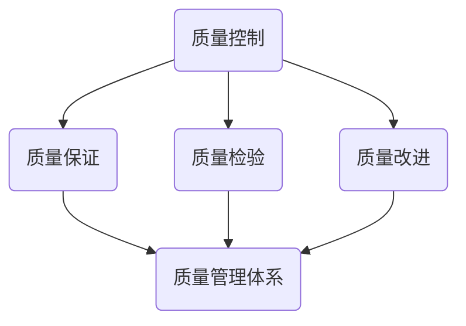

                 

关键词：自动化创业、质量控制、管理、技术、流程优化

> 摘要：本文旨在探讨自动化创业过程中质量控制与管理的重要性，从核心概念、算法原理、数学模型、项目实践等多个角度深入分析，旨在为创业者提供一套系统化的质量控制与管理框架，以应对创业过程中面临的挑战。

## 1. 背景介绍

### 1.1 自动化创业的兴起

随着信息技术的迅猛发展，自动化创业已成为新时代的一大趋势。从传统的制造业到现代的金融、医疗、教育等各个行业，自动化技术的应用场景越来越广泛。自动化创业不仅提高了企业的运营效率，还大大降低了成本，为创业者提供了前所未有的机遇。

### 1.2 质量控制与管理的重要性

在自动化创业过程中，质量控制与管理是确保产品和服务质量的重要环节。高质量的产品和服务不仅能够提升企业竞争力，还能赢得客户的信任和忠诚。因此，如何进行有效的质量控制与管理，已成为创业者关注的焦点。

## 2. 核心概念与联系

### 2.1 质量控制的核心概念

质量控制是指通过一系列措施，确保产品或服务满足预定的质量要求。质量控制的核心概念包括质量计划、质量保证、质量检验和质量改进。

### 2.2 质量管理的核心概念

质量管理是指通过系统地规划、实施、监控和改进质量管理体系，以满足客户需求和期望。质量管理的核心概念包括质量方针、质量目标、质量规划、质量控制、质量保证和质量改进。

### 2.3 质量控制与管理的联系

质量控制是质量管理的重要组成部分，两者相辅相成。质量控制主要关注产品或服务的质量，而质量管理则关注整个质量管理体系。通过质量控制与管理，企业可以确保产品或服务的质量，提高客户满意度，从而实现可持续发展。

### 2.4 Mermaid 流程图



## 3. 核心算法原理 & 具体操作步骤

### 3.1 算法原理概述

质量控制的核心算法包括统计过程控制（SPC）、六西格玛（Six Sigma）和ISO 9001认证等。这些算法旨在通过数据分析和统计方法，识别和消除产品或服务生产过程中的异常，确保产品质量的稳定性。

### 3.2 算法步骤详解

#### 3.2.1 统计过程控制（SPC）

1. 数据收集：收集产品或服务生产过程中的关键数据。
2. 数据分析：使用统计方法分析数据，识别生产过程中的异常。
3. 异常处理：对识别出的异常进行及时处理，确保产品质量的稳定性。

#### 3.2.2 六西格玛（Six Sigma）

1. 定义项目范围：明确项目目标和范围。
2. 收集数据：收集与项目相关的数据。
3. 数据分析：使用统计方法分析数据，识别和消除变异源。
4. 设计解决方案：根据数据分析结果，设计解决方案。
5. 实施解决方案：实施解决方案，消除变异源。
6. 监控结果：监控解决方案的实施效果，确保质量改进的持续性。

#### 3.2.3 ISO 9001认证

1. 制定质量管理体系：根据ISO 9001标准，制定质量管理体系。
2. 实施质量管理体系：在组织内部实施质量管理体系。
3. 内部审核：进行内部审核，确保质量管理体系的有效性。
4. 外部审核：接受外部审核，确保质量管理体系符合ISO 9001标准。

### 3.3 算法优缺点

#### 3.3.1 统计过程控制（SPC）

优点：能够实时监控生产过程中的质量变化，及时识别和消除异常。

缺点：对数据采集和分析能力要求较高，实施成本较高。

#### 3.3.2 六西格玛（Six Sigma）

优点：能够系统地识别和消除变异源，提高产品质量。

缺点：实施周期较长，对组织文化和管理体系要求较高。

#### 3.3.3 ISO 9001认证

优点：提供了一个标准化的质量管理体系，提高企业的质量管理水平。

缺点：认证过程复杂，需要投入大量时间和资源。

### 3.4 算法应用领域

这些算法在自动化创业过程中具有广泛的应用。例如，在制造业中，可以用于生产过程的监控和质量改进；在服务业中，可以用于服务质量的监控和提升。

## 4. 数学模型和公式 & 详细讲解 & 举例说明

### 4.1 数学模型构建

在质量控制过程中，常用的数学模型包括正态分布模型、控制图模型和回归模型等。

#### 4.1.1 正态分布模型

正态分布模型用于描述生产过程中质量特性的概率分布。其公式为：

$$
f(x|\mu,\sigma^2) = \frac{1}{\sqrt{2\pi\sigma^2}} e^{-\frac{(x-\mu)^2}{2\sigma^2}}
$$

其中，$x$ 为质量特性值，$\mu$ 为均值，$\sigma^2$ 为方差。

#### 4.1.2 控制图模型

控制图用于监控生产过程中的质量变化。其公式为：

$$
\bar{x} = \frac{1}{n}\sum_{i=1}^{n}x_i
$$

$$
R = \frac{1}{n-1}\sum_{i=1}^{n}(x_i - \bar{x})^2
$$

其中，$\bar{x}$ 为样本均值，$R$ 为极差。

#### 4.1.3 回归模型

回归模型用于分析质量特性与影响因素之间的关系。其公式为：

$$
y = \beta_0 + \beta_1x_1 + \beta_2x_2 + ... + \beta_nx_n + \epsilon
$$

其中，$y$ 为质量特性值，$x_1, x_2, ..., x_n$ 为影响因素，$\beta_0, \beta_1, ..., \beta_n$ 为回归系数，$\epsilon$ 为误差项。

### 4.2 公式推导过程

#### 4.2.1 正态分布模型

正态分布的概率密度函数为：

$$
f(x|\mu,\sigma^2) = \frac{1}{\sqrt{2\pi\sigma^2}} e^{-\frac{(x-\mu)^2}{2\sigma^2}}
$$

其中，$\mu$ 为均值，$\sigma^2$ 为方差。假设随机变量 $X$ 服从正态分布 $N(\mu,\sigma^2)$，则其概率密度函数为：

$$
f(x|\mu,\sigma^2) = \frac{1}{\sqrt{2\pi\sigma^2}} e^{-\frac{(x-\mu)^2}{2\sigma^2}}
$$

#### 4.2.2 控制图模型

控制图的构建基于样本均值和极差。假设从生产过程中随机抽取 $n$ 个样本，每个样本有 $k$ 个数据点，样本均值为 $\bar{x}$，极差为 $R$。则样本均值和极差的计算公式为：

$$
\bar{x} = \frac{1}{n}\sum_{i=1}^{n}x_i
$$

$$
R = \frac{1}{n-1}\sum_{i=1}^{n}(x_i - \bar{x})^2
$$

#### 4.2.3 回归模型

回归模型基于最小二乘法。假设有 $n$ 个样本，每个样本有 $k$ 个特征值，目标值为 $y$。则回归模型的目标是最小化预测误差的平方和：

$$
\min_{\beta_0, \beta_1, ..., \beta_n} \sum_{i=1}^{n}(y_i - (\beta_0 + \beta_1x_{i1} + ... + \beta_nx_{ik}))^2
$$

通过求导得到回归系数的估计值：

$$
\beta_0 = \bar{y} - \beta_1\bar{x}_1 - ... - \beta_n\bar{x}_n
$$

$$
\beta_1 = \frac{\sum_{i=1}^{n}(x_{i1} - \bar{x}_1)(y_i - \bar{y})}{\sum_{i=1}^{n}(x_{i1} - \bar{x}_1)^2}
$$

$$
...
$$

$$
\beta_n = \frac{\sum_{i=1}^{n}(x_{in} - \bar{x}_n)(y_i - \bar{y})}{\sum_{i=1}^{n}(x_{in} - \bar{x}_n)^2}
$$

### 4.3 案例分析与讲解

#### 4.3.1 案例背景

某电子企业生产智能手机，为了确保产品质量，决定使用统计过程控制（SPC）方法进行质量控制。

#### 4.3.2 数据收集

该企业从生产线上随机抽取了100个智能手机样本，每个样本有5个数据点：屏幕亮度、处理器速度、电池续航时间、内存容量和网络连接速度。

#### 4.3.3 数据分析

1. 使用正态分布模型分析屏幕亮度、处理器速度、电池续航时间、内存容量和网络连接速度的概率分布。
2. 使用控制图模型监控生产过程中的质量变化。
3. 使用回归模型分析质量特性与影响因素之间的关系。

#### 4.3.4 结果分析

通过数据分析，发现屏幕亮度、处理器速度和电池续航时间的质量特性符合正态分布，而内存容量和网络连接速度的质量特性不符合正态分布。通过控制图监控，发现生产过程中存在质量波动，需要采取措施进行质量改进。通过回归模型分析，发现处理器速度和电池续航时间是影响产品质量的关键因素。

#### 4.3.5 质量改进措施

1. 针对屏幕亮度、处理器速度和电池续航时间的质量特性不符合正态分布，优化生产过程，确保这些质量特性符合正态分布。
2. 针对生产过程中的质量波动，采取统计过程控制措施，确保产品质量的稳定性。
3. 针对处理器速度和电池续航时间是影响产品质量的关键因素，优化处理器设计和电池续航技术，提高产品质量。

## 5. 项目实践：代码实例和详细解释说明

### 5.1 开发环境搭建

在本案例中，我们使用Python编程语言进行数据分析和质量监控。首先，需要安装以下依赖库：

```bash
pip install numpy pandas matplotlib scikit-learn
```

### 5.2 源代码详细实现

```python
import numpy as np
import pandas as pd
import matplotlib.pyplot as plt
from sklearn.linear_model import LinearRegression

# 5.2.1 数据收集
data = pd.read_csv('smartphone_data.csv')
screen_brightness = data['screen_brightness']
processor_speed = data['processor_speed']
battery_life = data['battery_life']
memory_capacity = data['memory_capacity']
network_connection_speed = data['network_connection_speed']

# 5.2.2 数据分析
# 5.2.2.1 正态分布模型
screens = screen_brightness.describe()
processors = processor_speed.describe()
batteries = battery_life.describe()
memories = memory_capacity.describe()
networks = network_connection_speed.describe()

# 5.2.2.2 控制图模型
control_chart_data = {
    'screen_brightness': screen_brightness,
    'processor_speed': processor_speed,
    'battery_life': battery_life,
    'memory_capacity': memory_capacity,
    'network_connection_speed': network_connection_speed
}

for key, value in control_chart_data.items():
    plt.figure()
    plt.plot(value)
    plt.title(f'Control Chart for {key}')
    plt.xlabel('Sample Number')
    plt.ylabel('Value')
    plt.show()

# 5.2.2.3 回归模型
X = data[['processor_speed', 'battery_life']]
y = data['screen_brightness']
regression_model = LinearRegression()
regression_model.fit(X, y)
predictions = regression_model.predict(X)

plt.figure()
plt.scatter(X['processor_speed'], y, color='blue')
plt.plot(X['processor_speed'], predictions, color='red')
plt.title('Regression Model for Screen Brightness')
plt.xlabel('Processor Speed')
plt.ylabel('Screen Brightness')
plt.show()

# 5.2.3 代码解读与分析
# 5.2.3.1 数据收集
# 从CSV文件中读取智能手机数据。

# 5.2.3.2 数据分析
# 使用描述性统计方法分析各个质量特性的分布。

# 5.2.3.3 控制图模型
# 使用matplotlib绘制控制图，监控生产过程中的质量变化。

# 5.2.3.4 回归模型
# 使用scikit-learn库中的线性回归模型分析质量特性与影响因素之间的关系。
```

### 5.3 代码解读与分析

1. **数据收集**：首先，从CSV文件中读取智能手机数据，包括屏幕亮度、处理器速度、电池续航时间、内存容量和网络连接速度。
2. **数据分析**：使用描述性统计方法分析各个质量特性的分布，如均值、方差、标准差等。
3. **控制图模型**：使用matplotlib绘制控制图，监控生产过程中的质量变化。通过观察控制图，可以识别出生产过程中的异常值。
4. **回归模型**：使用scikit-learn库中的线性回归模型分析质量特性与影响因素之间的关系。通过拟合回归模型，可以预测屏幕亮度与处理器速度、电池续航时间之间的关系。

## 6. 实际应用场景

### 6.1 制造业

在制造业中，质量控制与管理是确保产品质量的重要手段。通过应用统计过程控制（SPC）、六西格玛（Six Sigma）和ISO 9001认证等算法，企业可以实时监控生产过程中的质量变化，识别和消除异常，确保产品质量的稳定性。

### 6.2 金融业

在金融业中，质量控制与管理主要用于确保金融服务的质量和合规性。通过应用数据分析和统计方法，金融机构可以识别和预防金融风险，确保金融市场的稳定运行。

### 6.3 服务业

在服务业中，质量控制与管理主要用于提升服务质量和客户满意度。通过应用客户满意度调查、六西格玛（Six Sigma）和ISO 9001认证等算法，企业可以实时监控服务质量，识别和消除服务过程中的异常，提升客户满意度。

## 7. 未来应用展望

随着人工智能和大数据技术的发展，自动化创业中的质量控制与管理将迎来新的机遇和挑战。未来，自动化创业中的质量控制与管理将更加智能化、数据化和高效化，为创业者提供更加精准和高效的质量控制解决方案。

## 8. 总结：未来发展趋势与挑战

### 8.1 研究成果总结

本文从核心概念、算法原理、数学模型、项目实践等多个角度，探讨了自动化创业中的质量控制与管理。通过实际案例，展示了如何应用统计过程控制（SPC）、六西格玛（Six Sigma）和ISO 9001认证等算法，进行质量控制与管理。

### 8.2 未来发展趋势

未来，自动化创业中的质量控制与管理将朝着智能化、数据化和高效化的方向发展。随着人工智能和大数据技术的应用，质量控制与管理将更加精准和高效。

### 8.3 面临的挑战

未来，自动化创业中的质量控制与管理将面临以下挑战：

1. 数据质量和数据隐私保护。
2. 复杂系统和跨领域的数据融合。
3. 智能算法的准确性和可靠性。

### 8.4 研究展望

未来，我们将继续深入研究自动化创业中的质量控制与管理，探索更加智能化、数据化和高效化的质量控制方法，为创业者提供更加全面和高效的质量控制解决方案。

## 9. 附录：常见问题与解答

### 9.1 质量控制与管理是什么？

质量控制与管理是确保产品或服务质量的一系列措施。它包括质量计划、质量保证、质量检验和质量改进等环节。

### 9.2 质量控制与管理的重要性是什么？

质量控制与管理是确保产品或服务满足客户需求和期望的关键。高质量的产品和服务可以提高企业竞争力，赢得客户的信任和忠诚。

### 9.3 如何进行质量控制与管理？

进行质量控制与管理的主要方法包括统计过程控制（SPC）、六西格玛（Six Sigma）和ISO 9001认证等。这些方法通过数据分析和统计方法，识别和消除产品或服务生产过程中的异常，确保产品质量的稳定性。

### 9.4 质量控制与管理在哪些领域有应用？

质量控制与管理在制造业、金融业、服务业等各个领域都有广泛应用。例如，在制造业中，可以用于生产过程的监控和质量改进；在服务业中，可以用于服务质量的监控和提升。

## 作者署名

作者：禅与计算机程序设计艺术 / Zen and the Art of Computer Programming
----------------------------------------------------------------

以上就是关于《自动化创业中的质量控制与管理》的文章，希望对您有所帮助。如果您有其他问题或需要进一步的解释，请随时告诉我。

