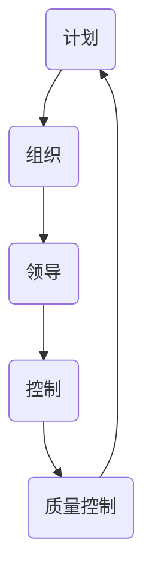

                 

关键词：自动化创业、质量控制、管理、流程优化、技术实践

> 摘要：随着自动化技术在各个行业的广泛应用，创业公司在追求高效和降低成本的同时，质量控制与管理成为了不可或缺的一环。本文将深入探讨自动化创业中的质量控制与管理，分析其重要性、核心概念、算法原理，并通过项目实践和实际应用场景，提供全面的指导与建议。

## 1. 背景介绍

在当今技术快速发展的时代，自动化技术正在成为各个行业的关键驱动力。从智能制造到智慧物流，从金融科技到医疗健康，自动化技术正在改变着传统行业的运作模式，提升效率，降低成本。然而，随着自动化程度的提高，质量控制与管理的问题也日益凸显。

对于创业公司而言，如何在快速发展的过程中确保产品质量、控制成本、提升客户满意度，是摆在面前的重要课题。自动化创业中的质量控制与管理，不仅涉及到技术的先进性，更涉及到管理理念的革新和流程的优化。

本文旨在通过以下内容，帮助创业公司建立有效的质量控制与管理体系：

- **核心概念与联系**：介绍质量控制与管理中的核心概念及其相互关系。
- **核心算法原理**：探讨常用的质量控制算法及其应用。
- **数学模型与公式**：建立质量控制相关的数学模型，并进行公式推导。
- **项目实践**：通过具体项目实践，展示质量控制与管理的实施细节。
- **实际应用场景**：分析质量控制与管理在不同领域的实际应用。
- **未来展望**：探讨质量控制与管理的发展趋势和未来挑战。

## 2. 核心概念与联系

### 2.1 质量控制的核心概念

质量控制是确保产品或服务符合预定标准的过程。其核心概念包括：

- **质量**：质量是指产品或服务的特性满足顾客和法规要求的程度。
- **质量控制**：质量控制是指通过监控和调整过程，确保产品或服务质量的过程。
- **质量保证**：质量保证是通过预防措施和持续改进，确保产品或服务质量的过程。

### 2.2 管理的核心概念

管理是指通过规划、组织、领导和控制等活动，实现组织目标的过程。在质量控制与管理中，管理的核心概念包括：

- **计划**：制定质量目标和策略，规划质量活动的过程。
- **组织**：构建质量团队，分配资源和职责的过程。
- **领导**：通过领导力和团队协作，推动质量目标的实现。
- **控制**：监控质量活动，确保质量目标得到实现的过程。

### 2.3 质量控制与管理的关系

质量控制与管理是相辅相成的两个过程。质量控制关注产品或服务的具体质量，而管理则关注实现质量控制的过程和方法。质量控制是管理的一部分，管理则为质量控制提供框架和支持。

### 2.4 Mermaid 流程图

以下是一个简化的质量控制与管理流程图：



### 2.5 质量控制与管理的重要性

质量控制与管理对于创业公司的重要性体现在以下几个方面：

- **提升产品质量**：确保产品符合预定标准，提升客户满意度。
- **降低成本**：通过预防措施和持续改进，降低质量问题的发生成本。
- **增强竞争力**：高质量的产品和服务是创业公司竞争力的体现。
- **合规性**：遵守相关法规和标准，减少法律风险。

## 3. 核心算法原理 & 具体操作步骤

### 3.1 算法原理概述

在质量控制与管理中，常用的算法包括统计过程控制（SPC）、故障树分析（FTA）、失效模式与影响分析（FMEA）等。

- **统计过程控制（SPC）**：通过监控过程变异，确保过程稳定性和质量。
- **故障树分析（FTA）**：通过分析故障原因和影响，识别和消除潜在问题。
- **失效模式与影响分析（FMEA）**：通过识别潜在失效模式和影响，制定预防措施。

### 3.2 算法步骤详解

#### 3.2.1 统计过程控制（SPC）

1. **确定关键过程指标**：根据产品特性，选择关键过程指标（如尺寸、重量、时间等）。
2. **收集数据**：通过测量工具，收集关键过程指标的数据。
3. **建立控制图**：根据收集的数据，绘制控制图，监控过程变异。
4. **分析控制图**：判断过程是否处于受控状态，识别异常情况。
5. **采取纠正措施**：对于异常情况，采取纠正措施，确保过程稳定。

#### 3.2.2 故障树分析（FTA）

1. **确定故障模式**：识别产品或服务的潜在故障模式。
2. **构建故障树**：根据故障模式，构建故障树，表示故障原因和影响关系。
3. **定性分析**：通过故障树，分析故障发生的可能性及其影响。
4. **定量分析**：使用故障树分析软件，进行定量分析，评估故障发生概率和影响。
5. **制定纠正措施**：根据分析结果，制定纠正措施，降低故障风险。

#### 3.2.3 失效模式与影响分析（FMEA）

1. **确定潜在失效模式**：识别产品或服务的潜在失效模式。
2. **评估失效模式**：评估每个失效模式的发生概率和影响。
3. **制定纠正措施**：根据评估结果，制定纠正措施，降低失效风险。
4. **实施纠正措施**：实施纠正措施，监控效果。
5. **持续改进**：定期更新FMEA，持续改进质量控制与管理。

### 3.3 算法优缺点

- **统计过程控制（SPC）**：优点在于实时监控过程变异，确保过程稳定性；缺点是需要一定的数据收集和分析能力。
- **故障树分析（FTA）**：优点在于能够系统性地分析故障原因和影响，识别潜在问题；缺点在于需要较复杂的技术和工具。
- **失效模式与影响分析（FMEA）**：优点在于能够提前识别潜在失效模式，制定预防措施；缺点在于需要一定的时间和人力资源。

### 3.4 算法应用领域

统计过程控制（SPC）、故障树分析（FTA）和失效模式与影响分析（FMEA）广泛应用于制造业、服务业、医疗健康等领域。例如：

- **制造业**：用于监控生产过程，确保产品质量。
- **服务业**：用于分析服务故障，提高服务质量。
- **医疗健康**：用于识别医疗设备故障，确保患者安全。

## 4. 数学模型和公式 & 详细讲解 & 举例说明

### 4.1 数学模型构建

在质量控制与管理中，常用的数学模型包括统计模型、决策模型和优化模型。

- **统计模型**：用于描述过程变异和故障发生概率，如正态分布模型、泊松分布模型等。
- **决策模型**：用于确定最佳的质量控制策略，如基于成本效益分析的最优检验策略。
- **优化模型**：用于确定最佳的质量控制参数，如最小化质量成本、最大化质量效益。

### 4.2 公式推导过程

以下是一个简单的统计模型推导过程：

假设过程输出 \( X \) 服从正态分布 \( N(\mu, \sigma^2) \)，其中 \( \mu \) 为过程均值，\( \sigma^2 \) 为过程方差。

- **过程均值 \( \mu \)**：
  $$ \mu = \frac{1}{n}\sum_{i=1}^{n}x_i $$
  其中，\( n \) 为样本容量，\( x_i \) 为第 \( i \) 个样本值。

- **过程方差 \( \sigma^2 \)**：
  $$ \sigma^2 = \frac{1}{n-1}\sum_{i=1}^{n}(x_i - \mu)^2 $$
  其中，\( \mu \) 为过程均值，\( x_i \) 为第 \( i \) 个样本值。

### 4.3 案例分析与讲解

#### 4.3.1 统计过程控制（SPC）案例分析

假设某生产线上生产的产品尺寸服从正态分布，过程均值 \( \mu = 100 \) 毫米，过程方差 \( \sigma^2 = 10 \) 毫米。

- **确定控制限**：根据正态分布性质，确定控制限 \( \mu \pm 3\sigma \)。
  $$ \mu - 3\sigma = 100 - 3 \times 10 = 70 $$
  $$ \mu + 3\sigma = 100 + 3 \times 10 = 130 $$
  控制限为 \( 70 \) 毫米至 \( 130 \) 毫米。

- **收集数据**：在生产过程中，收集 \( n \) 个产品尺寸数据。

- **计算过程均值**：
  $$ \bar{x} = \frac{1}{n}\sum_{i=1}^{n}x_i $$

- **计算过程方差**：
  $$ s^2 = \frac{1}{n-1}\sum_{i=1}^{n}(x_i - \bar{x})^2 $$

- **绘制控制图**：根据计算结果，绘制控制图，监控过程变异。

- **分析控制图**：如果所有样本值都在控制限内，说明过程处于受控状态。如果样本值超出控制限，说明过程出现异常，需要采取纠正措施。

#### 4.3.2 故障树分析（FTA）案例分析

假设某医疗设备出现故障，导致患者受伤。构建故障树，分析故障原因。

1. **确定顶事件**：患者受伤。
2. **识别基本事件**：设备故障、操作错误、环境因素等。
3. **构建故障树**：根据基本事件和逻辑关系，构建故障树。

4. **定性分析**：通过故障树，分析故障发生的可能性及其影响。

5. **定量分析**：使用故障树分析软件，进行定量分析，评估故障发生概率和影响。

6. **制定纠正措施**：根据分析结果，制定纠正措施，降低故障风险。

## 5. 项目实践：代码实例和详细解释说明

### 5.1 开发环境搭建

为了实践质量控制与管理，我们选择Python作为编程语言，并使用Jupyter Notebook作为开发环境。以下是在Jupyter Notebook中搭建开发环境的步骤：

1. 安装Python：从官方网站下载Python安装包并安装。
2. 安装Jupyter Notebook：在命令行中运行 `pip install notebook`。
3. 启动Jupyter Notebook：在命令行中运行 `jupyter notebook`，打开Web浏览器并访问本地Jupyter Notebook界面。

### 5.2 源代码详细实现

以下是一个简单的质量控制与管理的Python代码示例：

```python
import numpy as np
import matplotlib.pyplot as plt
from scipy.stats import norm

# 模拟生产过程数据
n_samples = 100
mu = 100
sigma = 10
samples = np.random.normal(mu, sigma, n_samples)

# 计算过程均值
mean = np.mean(samples)

# 计算过程方差
variance = np.var(samples)

# 绘制控制图
fig, ax = plt.subplots()
ax.hist(samples, bins=20, alpha=0.5)
ax.plot([mean - 3 * sigma, mean + 3 * sigma], [0, 1], 'r--')
ax.set_xlabel('尺寸（毫米）')
ax.set_ylabel('频数')
plt.show()

print(f'过程均值：{mean} 毫米')
print(f'过程方差：{variance} 毫米²')
```

### 5.3 代码解读与分析

- **导入模块**：导入numpy、matplotlib和scipy.stats模块，用于数据计算和可视化。
- **模拟生产过程数据**：使用numpy.random.normal函数模拟生产过程中的产品尺寸数据，设定过程均值和过程方差。
- **计算过程均值**：使用numpy.mean函数计算样本均值。
- **计算过程方差**：使用numpy.var函数计算样本方差。
- **绘制控制图**：使用matplotlib.pyplot.subplots函数创建子图，使用hist函数绘制直方图，使用plot函数绘制控制限。

### 5.4 运行结果展示

运行上述代码后，将得到以下结果：

- **控制图**：显示生产过程中产品尺寸的分布情况，以及过程均值和控制限。
- **输出结果**：显示过程均值和过程方差。

通过控制图和输出结果，可以判断生产过程是否处于受控状态。如果过程均值接近100毫米，过程方差较小，说明生产过程稳定，产品质量良好。如果过程均值偏离100毫米，过程方差较大，说明生产过程存在异常，需要采取纠正措施。

## 6. 实际应用场景

质量控制与管理在不同领域的实际应用各有特点。以下列举几个典型应用场景：

### 6.1 制造业

在制造业中，质量控制与管理主要用于生产过程监控和质量检验。通过统计过程控制（SPC）等算法，实时监控生产过程，确保产品质量。例如，汽车制造业通过控制汽车发动机的燃烧效率，确保发动机性能稳定。

### 6.2 服务业

在服务业中，质量控制与管理主要用于服务质量和客户满意度监控。通过故障树分析（FTA）等方法，分析服务故障原因，提升服务质量。例如，酒店行业通过分析客户投诉，识别和解决服务问题，提高客户满意度。

### 6.3 医疗健康

在医疗健康领域，质量控制与管理主要用于医疗器械和药品的质量监控。通过失效模式与影响分析（FMEA）等方法，识别和消除潜在质量风险，确保患者安全。例如，医疗器械制造商通过FMEA分析，确保医疗设备的可靠性和安全性。

### 6.4 金融科技

在金融科技领域，质量控制与管理主要用于金融产品和服务质量控制。通过数据分析和算法模型，实时监控金融风险，确保金融产品的合规性和安全性。例如，互联网金融平台通过算法模型，监控用户交易行为，识别和防范欺诈行为。

## 7. 工具和资源推荐

为了更好地开展质量控制与管理，以下推荐一些常用的工具和资源：

### 7.1 学习资源推荐

- **《质量管理方法与工具》**：一本系统介绍质量控制与管理方法的经典教材。
- **《统计过程控制》**：详细介绍统计过程控制（SPC）理论和实践的书籍。
- **《故障树分析》**：系统介绍故障树分析（FTA）方法和应用。

### 7.2 开发工具推荐

- **Python**：强大的编程语言，支持数据分析和建模。
- **MATLAB**：专业的数据分析工具，适合进行复杂数学计算和可视化。
- **R**：专门用于统计分析和数据可视化的语言。

### 7.3 相关论文推荐

- **“Statistical Process Control for Software Development”**：探讨统计过程控制在软件开发中的应用。
- **“Fault Tree Analysis for Software Systems”**：介绍故障树分析在软件系统质量保证中的应用。
- **“Quality Management in the Age of Automation”**：讨论自动化技术下的质量控制与管理挑战。

## 8. 总结：未来发展趋势与挑战

### 8.1 研究成果总结

本文从质量控制与管理的基本概念、核心算法原理、数学模型和实际应用场景等方面，深入探讨了自动化创业中的质量控制与管理。主要研究成果包括：

- **核心概念与联系**：明确了质量控制与管理中的关键概念及其相互关系。
- **算法原理**：详细介绍了统计过程控制（SPC）、故障树分析（FTA）和失效模式与影响分析（FMEA）等核心算法原理。
- **数学模型**：建立了质量控制相关的数学模型，进行了公式推导和案例分析。
- **项目实践**：通过具体项目实践，展示了质量控制与管理的实施细节。
- **实际应用场景**：分析了质量控制与管理在不同领域的实际应用。

### 8.2 未来发展趋势

随着人工智能和大数据技术的不断发展，未来质量控制与管理将呈现以下发展趋势：

- **智能化**：利用人工智能技术，实现自动化、智能化的质量控制与管理。
- **大数据分析**：通过大数据分析，实时监控质量变化，提前预测和防范质量问题。
- **跨领域应用**：质量控制与管理将在更多领域得到应用，如智慧城市、物联网等。

### 8.3 面临的挑战

未来质量控制与管理将面临以下挑战：

- **数据隐私和安全**：在大数据环境下，如何确保数据隐私和安全，防止数据泄露。
- **算法可靠性**：随着算法模型的复杂化，如何确保算法的可靠性，避免算法错误导致的质量问题。
- **跨领域协同**：如何在不同领域实现质量控制与管理的协同，提高整体质量水平。

### 8.4 研究展望

未来，我们需要进一步研究以下方面：

- **智能化质量控制与管理系统**：开发基于人工智能的质量控制与管理系统，提高自动化程度。
- **跨领域质量控制与管理标准**：制定跨领域质量控制与管理标准，提高质量一致性。
- **数据驱动质量控制与管理**：利用大数据技术，实现数据驱动的质量控制与管理，提高决策效率。

## 9. 附录：常见问题与解答

### 9.1 质量控制与管理的基本概念是什么？

质量控制与管理是确保产品或服务质量符合预定标准的过程。质量控制关注产品或服务的具体质量，而管理则关注实现质量控制的过程和方法。

### 9.2 统计过程控制（SPC）的核心原理是什么？

统计过程控制（SPC）是通过监控过程变异，确保过程稳定性和质量的方法。核心原理包括确定关键过程指标、收集数据、建立控制图、分析控制图和采取纠正措施。

### 9.3 故障树分析（FTA）如何应用？

故障树分析（FTA）是通过分析故障原因和影响，识别和消除潜在问题的方法。应用步骤包括确定顶事件、识别基本事件、构建故障树、定性分析和定量分析。

### 9.4 失效模式与影响分析（FMEA）如何应用？

失效模式与影响分析（FMEA）是通过识别潜在失效模式和影响，制定预防措施的方法。应用步骤包括确定潜在失效模式、评估失效模式、制定纠正措施、实施纠正措施和持续改进。

### 9.5 质量控制与管理在金融科技领域有哪些应用？

在金融科技领域，质量控制与管理主要用于金融产品和服务质量控制。例如，通过数据分析和算法模型，实时监控金融风险，确保金融产品的合规性和安全性。

### 9.6 如何确保质量控制与管理的有效性？

确保质量控制与管理的有效性需要以下几点：

- **明确质量目标和策略**：制定明确的质量目标和策略，指导质量控制与管理活动。
- **建立有效的流程**：建立科学、合理的质量控制与管理流程，确保质量活动有序进行。
- **持续改进**：通过持续改进，不断提升质量控制与管理的能力和水平。
- **培训与激励**：对相关人员进行培训，提高质量控制与管理的能力和意识。

**作者：禅与计算机程序设计艺术 / Zen and the Art of Computer Programming**

