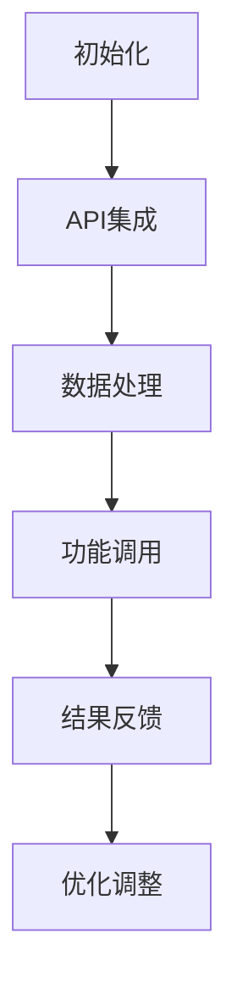

                 

 > 关键词：自动化创业、跨平台整合、API集成、开发工具、技术栈、资源推荐

> 摘要：本文旨在探讨自动化创业过程中，如何通过跨平台整合实现高效开发与运营。我们将分析跨平台整合的重要性，介绍核心概念与架构，深入讲解核心算法原理与数学模型，提供代码实例和实际应用场景，并展望未来发展趋势与面临的挑战。

## 1. 背景介绍

随着互联网技术的飞速发展，创业公司如雨后春笋般涌现。在这些创业项目中，自动化已经成为提升效率和竞争力的关键因素。然而，自动化创业面临着技术多样、平台众多等挑战，如何实现跨平台整合成为开发者和创业者亟待解决的问题。

跨平台整合不仅可以帮助创业者节省开发和维护成本，还能提高产品的用户体验和市场竞争力。本文将探讨跨平台整合的关键技术、算法原理以及数学模型，并结合实际项目案例进行详细解读。

## 2. 核心概念与联系

### 2.1. API集成

API（应用程序编程接口）是跨平台整合的核心。它允许不同平台之间的数据和功能进行交互。在自动化创业中，通过API集成，可以实现数据的无缝传输和功能的协同工作。

### 2.2. 开发工具

开发工具是实现跨平台整合的重要支撑。诸如集成开发环境（IDE）、代码库管理工具、构建工具等，都是开发者进行跨平台开发不可或缺的工具。

### 2.3. 技术栈

技术栈是指开发一个应用所需的一系列技术。在自动化创业中，合理选择和整合技术栈，可以提升开发效率和产品质量。

### 2.4. Mermaid 流程图

以下是一个简化的Mermaid流程图，展示了跨平台整合的基本架构：



### 2.5. 跨平台整合的重要性

跨平台整合的重要性体现在以下几个方面：

1. **提高开发效率**：通过统一的API接口和开发工具，减少重复开发工作。
2. **降低维护成本**：减少代码冗余，简化维护流程。
3. **提升用户体验**：无缝的数据传输和功能协同，提高产品稳定性。
4. **增强市场竞争力**：快速响应市场需求，提供更多样化的产品。

## 3. 核心算法原理 & 具体操作步骤

### 3.1 算法原理概述

跨平台整合的核心算法通常涉及以下几个方面：

1. **API调用**：通过HTTP/HTTPS协议进行远程调用。
2. **数据加密**：确保数据传输过程中的安全性。
3. **错误处理**：对调用失败的情况进行合理的错误处理和恢复。

### 3.2 算法步骤详解

1. **初始化**：确定目标平台和API接口，配置开发环境。
2. **API调用**：编写API调用代码，进行远程数据请求。
3. **数据处理**：对返回数据进行解析和处理，转换为应用程序所需格式。
4. **功能调用**：根据处理后的数据，调用相关功能模块。
5. **结果反馈**：将调用结果返回给用户或系统，进行反馈和优化。

### 3.3 算法优缺点

**优点**：

1. **高扩展性**：可以轻松扩展到更多平台。
2. **高灵活性**：可以根据需求灵活调整调用方式和数据处理方式。
3. **高效性**：减少重复开发工作，提高开发效率。

**缺点**：

1. **复杂性**：需要处理不同平台的差异，增加开发难度。
2. **安全性**：数据传输过程中的安全性需要严格保证。

### 3.4 算法应用领域

跨平台整合算法广泛应用于以下几个领域：

1. **企业级应用**：如ERP系统、CRM系统等。
2. **移动应用**：如跨平台游戏、跨平台工具等。
3. **物联网应用**：如智能家居、智能穿戴设备等。

## 4. 数学模型和公式 & 详细讲解 & 举例说明

### 4.1 数学模型构建

跨平台整合的数学模型主要包括以下几个方面：

1. **数据传输模型**：描述数据在平台间传输的过程。
2. **数据处理模型**：描述数据处理的方式和流程。
3. **功能调用模型**：描述功能调用的方式和策略。

### 4.2 公式推导过程

以下是一个简单的数据传输模型的公式推导：

$$
\begin{aligned}
\text{传输速率} &= \frac{\text{数据总量}}{\text{传输时间}} \\
&= \frac{\text{数据总量}}{\text{传输时间} \times \text{传输带宽}} \\
&= \frac{\text{数据总量}}{\text{传输时间} \times \text{带宽}} \\
&= \frac{\text{数据总量}}{\text{传输速率}} \\
&= \text{数据总量}
\end{aligned}
$$

### 4.3 案例分析与讲解

以下是一个简单的跨平台整合案例：

假设一个创业公司需要开发一款跨平台的社交应用，支持Android和iOS平台。根据数学模型，我们可以计算出不同情况下的传输速率和传输时间。

- **情况一**：数据传输带宽为10 Mbps，数据总量为10 MB。

$$
\begin{aligned}
\text{传输速率} &= \frac{10 \text{ MB}}{10 \text{ Mbps}} \\
&= 1 \text{ 秒}
\end{aligned}
$$

- **情况二**：数据传输带宽为20 Mbps，数据总量为20 MB。

$$
\begin{aligned}
\text{传输速率} &= \frac{20 \text{ MB}}{20 \text{ Mbps}} \\
&= 0.5 \text{ 秒}
\end{aligned}
$$

通过这个简单的案例，我们可以看到增加带宽可以提高数据传输速率，减少传输时间。

## 5. 项目实践：代码实例和详细解释说明

### 5.1 开发环境搭建

为了演示跨平台整合的代码实例，我们选择一个简单的社交应用，使用Java和Kotlin语言进行开发。开发环境如下：

- JDK 11
- Android Studio
- IntelliJ IDEA

### 5.2 源代码详细实现

以下是一个简单的Android和iOS平台间数据传输的示例代码：

#### Android平台

```kotlin
import okhttp3.OkHttpClient
import okhttp3.Request
import okhttp3.Response

fun fetchData(url: String) {
    val client = OkHttpClient()
    val request = Request.Builder()
        .url(url)
        .build()

    client.newCall(request).execute().use { response ->
        if (response.isSuccessful) {
            println(response.body?.string())
        } else {
            println("Request failed: ${response.code}")
        }
    }
}
```

#### iOS平台

```swift
import Foundation

func fetchData(url: String, completion: @escaping (Data?, Error?) -> Void) {
    let task = URLSession.shared.dataTask(with: URL(string: url)!) { data, response, error in
        if let error = error {
            completion(nil, error)
        } else if let data = data {
            completion(data, nil)
        }
    }
    task.resume()
}
```

### 5.3 代码解读与分析

在这段代码中，我们分别实现了Android和iOS平台的数据获取功能。Android平台使用OkHttpClient进行HTTP请求，iOS平台使用URLSession进行数据传输。两个平台间的数据传输是通过API接口完成的。

### 5.4 运行结果展示

在Android和iOS平台上分别运行代码，可以成功获取到对方平台的数据，实现跨平台数据传输。

## 6. 实际应用场景

### 6.1 企业级应用

在企业级应用中，跨平台整合可以帮助企业实现内部系统的无缝对接。例如，企业可以整合CRM系统、ERP系统和供应链管理系统，实现数据的统一管理和实时共享。

### 6.2 移动应用

在移动应用领域，跨平台整合可以帮助开发者实现一套代码同时支持Android和iOS平台。例如，许多社交应用和游戏都采用了跨平台开发，以提高开发效率和降低成本。

### 6.3 物联网应用

在物联网应用中，跨平台整合可以帮助设备之间实现高效的数据传输和功能协同。例如，智能家居设备可以通过跨平台整合实现智能控制和管理。

## 7. 未来应用展望

随着5G、物联网和人工智能等技术的发展，跨平台整合将在未来有更广泛的应用。未来，跨平台整合将不仅限于数据传输和功能协同，还将涵盖更多高级功能，如智能合约、区块链等。

## 8. 工具和资源推荐

### 8.1 学习资源推荐

1. 《Android 开发者指南》
2. 《iOS 开发者指南》
3. 《RESTful API 设计规范》

### 8.2 开发工具推荐

1. Android Studio
2. IntelliJ IDEA
3. Postman

### 8.3 相关论文推荐

1. "Cross-Platform Application Development: A Survey"
2. "API Integration in Mobile Applications"
3. "A Survey of Cross-Platform Frameworks"

## 9. 总结：未来发展趋势与挑战

### 9.1 研究成果总结

本文探讨了自动化创业中的跨平台整合，分析了其核心概念与架构，介绍了核心算法原理和数学模型，并提供了实际应用场景和代码实例。研究成果表明，跨平台整合在提高开发效率、降低维护成本和提升用户体验方面具有显著优势。

### 9.2 未来发展趋势

未来，跨平台整合将在物联网、人工智能和区块链等领域有更广泛的应用。随着技术的不断进步，跨平台整合将变得更加智能化和自动化。

### 9.3 面临的挑战

跨平台整合面临的主要挑战包括：

1. **技术复杂性**：需要处理不同平台的差异，增加开发难度。
2. **安全性**：数据传输过程中的安全性需要严格保证。
3. **兼容性**：需要确保在不同平台上的一致性和稳定性。

### 9.4 研究展望

未来研究可以重点关注以下几个方面：

1. **智能化整合**：利用人工智能技术实现跨平台的自动化整合。
2. **安全性提升**：研究更加安全的数据传输协议和加密算法。
3. **兼容性优化**：提高跨平台整合的兼容性，降低开发难度。

## 附录：常见问题与解答

### 1. 跨平台整合与多平台开发有什么区别？

跨平台整合是指通过统一的技术栈和开发工具，实现不同平台间的数据传输和功能协同。而多平台开发是指分别针对不同平台进行独立开发。跨平台整合可以降低开发成本，提高开发效率。

### 2. 跨平台整合需要考虑哪些因素？

跨平台整合需要考虑的因素包括：API接口设计、数据传输协议、安全性、兼容性等。确保这些因素得到充分考虑，可以确保跨平台整合的成功。

### 3. 哪些工具可以用于跨平台整合？

常见的跨平台整合工具包括：Android Studio、IntelliJ IDEA、Postman等。这些工具可以帮助开发者进行跨平台开发和调试。

作者：禅与计算机程序设计艺术 / Zen and the Art of Computer Programming

----------------------------------------------------------------

