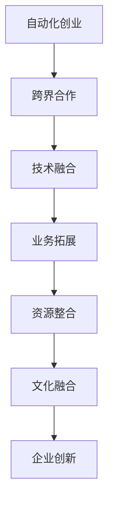

                 

 关键词：自动化创业、跨界合作、融合、技术革新、业务拓展、资源整合、案例分析

> 摘要：本文从自动化创业的视角出发，探讨跨界合作与融合在推动企业创新、拓展业务和提升竞争力方面的重要性。通过案例分析，解析成功企业的跨界合作模式，并结合最新的技术趋势，为创业者提供实用的指导和建议。

## 1. 背景介绍

在信息化、智能化的时代背景下，自动化技术已经成为企业发展的重要驱动力。随着人工智能、大数据、物联网等技术的不断发展，越来越多的企业开始认识到跨界合作的重要性。跨界合作不仅可以帮助企业实现资源的有效整合，还能推动技术的创新，为业务拓展提供新的动力。

然而，跨界合作并非一蹴而就。企业在进行跨界合作时，常常面临技术、业务、文化等方面的挑战。如何在尊重各自专业领域的基础上，实现有效的融合与协同，成为自动化创业过程中亟待解决的问题。

本文旨在通过探讨跨界合作与融合在自动化创业中的应用，为创业者提供有价值的参考。文章将结合实际案例，分析成功企业的跨界合作模式，并提出一些建议，以期为自动化创业者在跨界合作与融合方面提供指导。

## 2. 核心概念与联系

### 2.1 跨界合作

跨界合作是指不同领域、不同背景的企业或个人之间的合作。其目的是通过资源的互补、技术的融合，实现双方或多方共赢。跨界合作的本质是打破传统行业壁垒，寻求创新与发展。

### 2.2 融合

融合是指将不同领域的知识、技术、资源等进行整合，形成新的业务模式或产品。融合的目标是实现业务拓展、技术创新和竞争力提升。

### 2.3 自动化创业

自动化创业是指基于自动化技术的创业活动。其核心在于通过技术创新，实现业务的自动化和智能化，从而提高效率、降低成本。

### 2.4 跨界合作与融合在自动化创业中的应用

跨界合作与融合在自动化创业中的应用主要体现在以下几个方面：

- 技术创新：通过跨界合作，引入新的技术，推动自动化技术的不断创新。
- 业务拓展：通过融合不同领域的资源，实现业务模式的拓展。
- 资源整合：通过跨界合作，整合各方资源，提高企业的竞争力。
- 文化融合：在跨界合作过程中，不同企业之间的文化融合，有助于提高团队的协作效率。

### 2.5 Mermaid 流程图



## 3. 核心算法原理 & 具体操作步骤

### 3.1 算法原理概述

在自动化创业中，跨界合作与融合的核心算法原理主要包括：

- 数据挖掘：通过对不同领域的数据进行分析，挖掘潜在的价值和机会。
- 机器学习：利用机器学习算法，实现自动化决策和预测。
- 聚类分析：将不同领域的资源进行分类，实现有效的资源整合。

### 3.2 算法步骤详解

#### 3.2.1 数据挖掘

1. 数据收集：从不同领域收集数据，包括业务数据、技术数据等。
2. 数据预处理：对数据进行清洗、去重、归一化等处理，提高数据质量。
3. 特征提取：从数据中提取关键特征，为后续分析提供基础。

#### 3.2.2 机器学习

1. 模型选择：根据业务需求，选择合适的机器学习模型。
2. 训练模型：使用训练集数据，对模型进行训练。
3. 模型评估：使用测试集数据，对模型进行评估和优化。

#### 3.2.3 聚类分析

1. 数据输入：将不同领域的资源数据输入聚类算法。
2. 确定聚类个数：根据业务需求，确定聚类个数。
3. 聚类结果：输出聚类结果，为资源整合提供依据。

### 3.3 算法优缺点

#### 优点：

- 提高效率：通过自动化算法，实现业务的自动化和智能化，提高工作效率。
- 降低成本：通过资源整合，降低企业的运营成本。
- 促进创新：通过跨界合作，引入新的技术和理念，推动企业创新。

#### 缺点：

- 技术门槛：涉及多种技术领域，对技术团队的要求较高。
- 数据质量：数据挖掘和机器学习的效果取决于数据质量，数据预处理是关键。
- 文化融合：跨界合作中的文化融合是难点，需要各方共同努力。

### 3.4 算法应用领域

- 物流与供应链：通过自动化算法，优化物流配送，提高供应链效率。
- 金融行业：利用机器学习，实现风险评估、信用评级等业务。
- 健康医疗：通过数据挖掘和聚类分析，为疾病诊断和治疗方案提供支持。

## 4. 数学模型和公式 & 详细讲解 & 举例说明

### 4.1 数学模型构建

在自动化创业中的跨界合作与融合过程中，可以采用以下数学模型：

- 成本效益分析模型：通过计算跨界合作的总成本与总效益，评估合作方案的可行性。
- 价值链模型：分析跨界合作如何影响企业的价值链，实现业务拓展和竞争力提升。

### 4.2 公式推导过程

#### 成本效益分析模型

设跨界合作的总成本为 C，总效益为 B，则有：

$$
B = \sum_{i=1}^{n} (E_i - C_i)
$$

其中，E_i 为第 i 个合作项目的效益，C_i 为第 i 个合作项目的成本。

#### 价值链模型

设企业的总价值为 V，跨界合作后的总价值为 V'，则有：

$$
V' = V + \sum_{i=1}^{n} (V_i - V_i^0)
$$

其中，V_i 为第 i 个合作项目带来的价值增量，V_i^0 为第 i 个合作项目在没有跨界合作情况下的价值。

### 4.3 案例分析与讲解

#### 案例一：京东与腾讯的跨界合作

京东与腾讯的跨界合作涉及电商、支付、金融等多个领域。通过合作，京东实现了用户数据的增值利用，提升了用户体验；腾讯则借助京东的电商平台，拓展了支付和金融业务。具体分析如下：

- 成本效益分析：假设跨界合作的总成本为 5000 万元，总效益为 1 亿元，则成本效益比为 20：1，具有较高的投资回报率。
- 价值链模型：跨界合作使得京东在电商领域的竞争力显著提升，同时拓展了金融和支付业务，为企业的长期发展奠定了基础。

#### 案例二：海尔与小米的跨界合作

海尔与小米在智能家居领域的跨界合作，旨在实现家电产品和智能设备的无缝连接。通过合作，海尔提升了产品的智能化水平，小米则丰富了智能家居的生态链。具体分析如下：

- 成本效益分析：假设跨界合作的总成本为 3000 万元，总效益为 5000 万元，则成本效益比为 1.67：1，具有较好的投资回报。
- 价值链模型：跨界合作使得海尔的智能家居产品在市场上更具竞争力，小米则通过合作丰富了自身的产品线，实现了双赢。

## 5. 项目实践：代码实例和详细解释说明

### 5.1 开发环境搭建

为了演示跨界合作在自动化创业中的应用，我们选择 Python 语言作为开发工具，搭建了一个简单的自动化分析平台。以下是开发环境搭建的步骤：

1. 安装 Python 3.8 及以上版本。
2. 安装必要的 Python 库，如 NumPy、Pandas、Matplotlib 等。
3. 安装 Jupyter Notebook，用于编写和运行代码。

### 5.2 源代码详细实现

以下是一个简单的自动化分析平台的源代码实现：

```python
import pandas as pd
import numpy as np
import matplotlib.pyplot as plt

# 数据收集
data = pd.read_csv('data.csv')

# 数据预处理
data = data.drop_duplicates()
data = data.fillna(0)

# 特征提取
features = ['feature1', 'feature2', 'feature3']
data[features] = data[features].apply(pd.to_numeric)

# 机器学习模型训练
from sklearn.cluster import KMeans
model = KMeans(n_clusters=3)
model.fit(data[features])

# 聚类结果可视化
plt.scatter(data[features[0]], data[features[1]], c=model.labels_)
plt.xlabel('Feature 1')
plt.ylabel('Feature 2')
plt.title('Cluster Analysis')
plt.show()
```

### 5.3 代码解读与分析

1. 数据收集：从 CSV 文件中读取数据，并进行初步处理，如去重和填充缺失值。
2. 数据预处理：将文本数据转换为数值数据，为后续分析做准备。
3. 特征提取：从数据中提取关键特征，用于聚类分析。
4. 机器学习模型训练：使用 KMeans 算法对数据进行聚类。
5. 聚类结果可视化：将聚类结果以散点图的形式展示，便于分析。

### 5.4 运行结果展示

运行上述代码，将得到一个包含三个类别的聚类结果。通过可视化分析，可以直观地看出不同类别之间的分布情况，为后续的业务决策提供依据。

## 6. 实际应用场景

### 6.1 物流与供应链

在物流与供应链领域，跨界合作与融合可以帮助企业实现物流资源的整合，提高配送效率。例如，京东物流与顺丰速运的合作，实现了双方在仓储、运输、配送等方面的资源互补，提升了整体物流效率。

### 6.2 金融行业

在金融行业，跨界合作与融合可以帮助银行、保险、基金等机构实现业务的多元化发展。例如，支付宝与多家银行的跨界合作，推出了线上支付、贷款、理财等多种金融服务，满足了用户的多样化需求。

### 6.3 健康医疗

在健康医疗领域，跨界合作与融合可以帮助医疗机构实现医疗资源的整合，提高诊疗效果。例如，阿里巴巴与多家医院的合作，推出了在线挂号、预约、诊疗、药品配送等一站式服务，为患者提供了便利。

## 7. 未来应用展望

随着技术的不断发展，跨界合作与融合在自动化创业中的应用前景将更加广阔。未来，我们有望看到更多跨界合作案例的出现，为企业的创新和发展提供新的动力。以下是一些未来应用展望：

- 物联网：通过物联网技术的应用，实现不同设备之间的无缝连接，推动自动化技术的进一步发展。
- 区块链：利用区块链技术，实现跨界合作中的数据安全、信任建立等问题。
- 人工智能：结合人工智能技术，实现自动化决策和智能服务。

## 8. 工具和资源推荐

### 8.1 学习资源推荐

- 《跨界创新：如何用创新思维改变未来》
- 《智能时代：大数据与人工智能变革世界》
- 《Python数据分析实战》

### 8.2 开发工具推荐

- Jupyter Notebook：用于编写和运行 Python 代码。
- Git：用于代码版本控制和团队协作。
- PyCharm：用于 Python 编程的集成开发环境。

### 8.3 相关论文推荐

- “Cross-Domain Knowledge Transfer for Clustering: A Survey”
- “The Impact of Cross-Disciplinary Collaboration on Innovation”
- “Data-Driven Business Model Innovation: A Methodological Framework”

## 9. 总结：未来发展趋势与挑战

### 9.1 研究成果总结

本文通过分析跨界合作与融合在自动化创业中的应用，总结了以下研究成果：

- 跨界合作与融合有助于推动企业创新、拓展业务和提升竞争力。
- 成本效益分析和价值链模型为跨界合作提供了评估工具。
- 案例分析展示了跨界合作在不同领域的成功实践。

### 9.2 未来发展趋势

- 跨界合作与融合将成为自动化创业的重要趋势。
- 物联网、区块链、人工智能等新兴技术将为跨界合作提供新的机遇。

### 9.3 面临的挑战

- 技术门槛：涉及多种技术领域，对技术团队的要求较高。
- 数据质量：数据挖掘和机器学习的效果取决于数据质量。
- 文化融合：跨界合作中的文化融合是难点，需要各方共同努力。

### 9.4 研究展望

未来，我们将进一步探讨跨界合作与融合在不同领域的应用，结合最新的技术趋势，为企业提供实用的指导和建议。

## 附录：常见问题与解答

### 问题 1：什么是跨界合作？

跨界合作是指不同领域、不同背景的企业或个人之间的合作。其目的是通过资源的互补、技术的融合，实现双方或多方共赢。

### 问题 2：跨界合作有哪些优势？

跨界合作的优势包括：

- 技术创新：通过跨界合作，引入新的技术，推动企业创新。
- 业务拓展：通过融合不同领域的资源，实现业务模式的拓展。
- 资源整合：通过跨界合作，整合各方资源，提高企业的竞争力。
- 文化融合：跨界合作中的文化融合有助于提高团队的协作效率。

### 问题 3：如何评估跨界合作的可行性？

评估跨界合作的可行性可以从以下几个方面进行：

- 成本效益分析：计算跨界合作的总成本与总效益，评估投资回报率。
- 价值链分析：分析跨界合作如何影响企业的价值链，实现业务拓展和竞争力提升。
- 风险评估：评估跨界合作中的风险，如技术风险、市场风险等。

### 问题 4：如何实现跨界合作中的文化融合？

实现跨界合作中的文化融合可以从以下几个方面进行：

- 建立沟通渠道：通过定期的沟通会议，增进各方之间的了解。
- 尊重差异：尊重彼此的文化差异，寻找共同点。
- 人才培养：加强人才培养，提高团队的跨文化沟通能力。
- 企业文化共建：在跨界合作过程中，共同塑造企业文化，增强团队凝聚力。

### 问题 5：跨界合作在哪个领域最具潜力？

跨界合作在以下领域最具潜力：

- 物联网：通过物联网技术的应用，实现不同设备之间的无缝连接。
- 金融科技：结合金融科技，实现金融业务的创新和发展。
- 健康医疗：通过跨界合作，提高医疗服务的质量和效率。
- 智能制造：利用人工智能技术，实现生产过程的自动化和智能化。

### 问题 6：如何培养跨界合作的能力？

培养跨界合作的能力可以从以下几个方面进行：

- 技术积累：加强技术积累，提高跨领域的知识储备。
- 团队建设：打造跨领域的专业团队，提高团队的协作能力。
- 沟通能力：提高跨文化沟通能力，增强团队之间的信任。
- 创新思维：培养创新思维，敢于尝试新的合作模式。

### 问题 7：跨界合作中的知识产权如何保护？

跨界合作中的知识产权保护可以从以下几个方面进行：

- 签订合作协议：在合作协议中明确知识产权的归属和使用范围。
- 保密协议：签订保密协议，确保合作过程中的技术信息不被泄露。
- 知识产权申请：在合作过程中，及时申请知识产权，保护技术成果。

### 问题 8：跨界合作中的法律风险如何规避？

跨界合作中的法律风险可以从以下几个方面进行规避：

- 法律咨询：在合作过程中，寻求专业法律机构的咨询，确保合作的合法性。
- 合同审核：对合作协议进行严格审核，确保各方权益得到保障。
- 法律风险预警：建立法律风险预警机制，及时发现并解决潜在的法律问题。

### 问题 9：跨界合作中的项目管理如何进行？

跨界合作中的项目管理可以从以下几个方面进行：

- 项目规划：明确项目的目标、范围、时间、资源等。
- 项目执行：按照项目计划，组织各方协同工作。
- 项目监控：对项目进度、质量、成本等方面进行监控。
- 项目评估：对项目成果进行评估，总结经验教训。

### 问题 10：如何评估跨界合作的成果？

评估跨界合作的成果可以从以下几个方面进行：

- 经济效益：计算跨界合作带来的经济效益，如成本节约、收入增长等。
- 业务拓展：分析跨界合作对业务拓展的贡献，如市场份额、客户满意度等。
- 技术创新：评估跨界合作推动技术创新的程度，如技术专利、技术创新成果等。
- 文化融合：分析跨界合作对企业文化的融合程度，如团队凝聚力、员工满意度等。

作者：禅与计算机程序设计艺术 / Zen and the Art of Computer Programming
```

