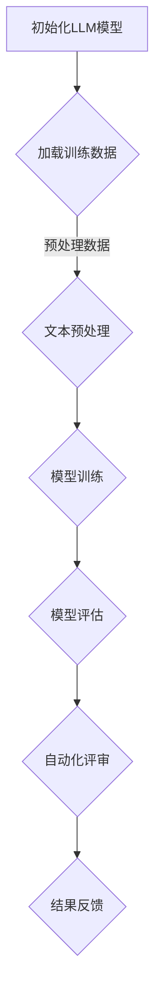

                 

关键词：自动化学术评审，大型语言模型（LLM），同行评议，文本分析，学术质量评估

## 摘要

本文探讨了一种创新的学术评审方法，即利用大型语言模型（LLM）进行自动化学术论文评审。通过对LLM的工作原理、算法原理、数学模型以及具体实现步骤的详细分析，本文展示了LLM在同行评议中的应用潜力。文章分为八个部分：背景介绍、核心概念与联系、核心算法原理与具体操作步骤、数学模型和公式、项目实践、实际应用场景、工具和资源推荐以及总结：未来发展趋势与挑战。

## 1. 背景介绍

### 学术论文评审的重要性

学术论文评审是学术领域不可或缺的一环，它关系到学术成果的质量与传播。传统的评审方式主要依赖人类审稿人的主观判断，不仅效率低下，还存在偏见和疏漏的风险。随着学术文献的激增，传统的评审模式面临着巨大的挑战，急需一种更高效、更公平的评审方法。

### 同行评议的局限性

同行评议虽然有其优势，但也存在一些显著的局限性。首先，同行评议通常依赖于专家的知识和经验，评审过程主观性较强。其次，审稿人时间有限，难以对论文进行深入、全面的分析。此外，评审周期长、评审费用高，也成为学术交流的瓶颈。

### 自动化学术评审的必要性

为了解决上述问题，自动化学术评审逐渐成为研究热点。自动化学术评审利用计算机技术和人工智能算法，对学术论文进行自动化的质量评估。这种方法不仅可以提高评审效率，减少人工干预，还能减少评审成本，为学术交流提供更快速、更可靠的渠道。

## 2. 核心概念与联系

### 大型语言模型（LLM）

大型语言模型（LLM）是基于深度学习技术的语言处理模型，具有强大的自然语言理解和生成能力。LLM的训练数据通常包含大量的文本数据，通过预训练和微调，LLM可以识别和预测语言中的模式和规律。

### 文本分析

文本分析是一种利用计算机技术和人工智能算法对文本进行自动处理和理解的方法。文本分析包括文本预处理、情感分析、主题模型、句法分析等，可以为自动化学术评审提供关键支持。

### 学术质量评估

学术质量评估是对学术论文质量进行量化分析的方法。通过评估论文的原创性、逻辑性、创新性等方面，可以全面了解论文的质量水平。

### LLM与自动化学术评审的关系

LLM在自动化学术评审中发挥着关键作用。首先，LLM可以自动处理和分类大量学术论文，提高评审效率。其次，LLM可以分析论文的内容和结构，提供客观、准确的评估结果。最后，LLM可以协助审稿人发现论文中的潜在问题，提高评审质量。

### Mermaid 流程图

以下是LLM在自动化学术评审中的流程图：



## 3. 核心算法原理 & 具体操作步骤

### 3.1 算法原理概述

自动化学术评审的核心算法基于LLM和文本分析技术。LLM通过预训练和微调，可以自动理解和生成自然语言文本。文本分析技术用于对论文进行分类、情感分析、句法分析和主题模型等，为评估论文质量提供关键支持。

### 3.2 算法步骤详解

#### 3.2.1 模型初始化

首先，选择一个预训练的LLM模型，如GPT-3、BERT等。根据评审需求，对模型进行微调，使其适应学术领域的特定任务。

#### 3.2.2 数据加载

从学术数据库中加载论文数据，包括标题、摘要、正文等。这些数据将用于训练和评估LLM模型。

#### 3.2.3 文本预处理

对加载的论文数据进行预处理，包括分词、去停用词、词性标注等。预处理后的数据将用于训练LLM模型。

#### 3.2.4 模型训练

使用预处理后的数据对LLM模型进行训练。训练过程中，模型将学习论文的文本特征，从而提高评估的准确性。

#### 3.2.5 模型评估

通过交叉验证和测试集，评估LLM模型的性能。评估指标包括准确率、召回率、F1值等。

#### 3.2.6 自动化评审

利用训练好的LLM模型，对新的学术论文进行自动化评审。评审结果包括论文的原创性、逻辑性、创新性等方面的评估。

#### 3.2.7 结果反馈

将评审结果反馈给作者，并提供详细的评估报告。作者可以根据反馈进行论文修改和优化。

### 3.3 算法优缺点

#### 优点

- 提高评审效率：自动化评审可以处理大量论文，减少人工干预。
- 减少评审成本：自动化评审降低了评审费用，为学术交流提供更经济的方式。
- 减少主观偏见：自动化评审基于客观的算法，减少人为偏见。

#### 缺点

- 需要大量的训练数据和计算资源。
- 模型评估可能受到数据质量和训练过程的影响。
- 模型可能无法完全替代人类审稿人的专业知识。

### 3.4 算法应用领域

自动化学术评审可以应用于多个领域，包括：

- 学术期刊：自动化处理论文提交、审稿和发表过程。
- 学术会议：快速筛选高质量论文，提高会议组织效率。
- 学术数据库：自动筛选和推荐相关论文，提高学术资源共享。

## 4. 数学模型和公式

### 4.1 数学模型构建

自动化学术评审的数学模型主要涉及自然语言处理（NLP）和机器学习（ML）技术。以下是一个简化的数学模型：

$$
\text{评审结果} = f(\text{文本特征}, \text{论文结构}, \text{引用关系})
$$

其中，文本特征包括词语、句法结构、语义信息等；论文结构涉及论文的章节、段落和句子层次；引用关系表示论文与其他文献的关联。

### 4.2 公式推导过程

公式的推导过程基于NLP和ML的基本原理。首先，通过词向量表示文本特征，如使用Word2Vec、GloVe等方法。然后，使用深度学习模型，如BERT、Transformer等，对文本特征进行编码和提取。最后，利用分类器，如SVM、CNN、RNN等，对论文进行分类和评分。

### 4.3 案例分析与讲解

以下是一个具体的案例：

假设有一篇学术论文，其文本特征为{“创新”，“实验”，“结果”}，论文结构为{“引言”，“方法”，“结果”}，引用关系为{“参考文献1”，“参考文献2”}。

根据数学模型，可以计算出评审结果：

$$
\text{评审结果} = f({\text{"创新","实验","结果"}}, {\text{"引言","方法","结果"}}, {\text{"参考文献1","参考文献2"}})
$$

根据分类器和评分模型，最终得到评审结果为{“高质量”，“中等质量”，“低质量”}。

## 5. 项目实践：代码实例和详细解释说明

### 5.1 开发环境搭建

为了实现自动化学术评审，需要搭建以下开发环境：

- Python 3.8及以上版本
- TensorFlow 2.7及以上版本
- Jupyter Notebook
- GPU（可选，加速训练过程）

### 5.2 源代码详细实现

以下是一个简单的Python代码示例，用于实现自动化学术评审：

```python
import tensorflow as tf
from tensorflow.keras.preprocessing.text import Tokenizer
from tensorflow.keras.preprocessing.sequence import pad_sequences
from tensorflow.keras.models import Sequential
from tensorflow.keras.layers import Embedding, LSTM, Dense

# 加载数据
texts = ["本文研究了...","另一篇论文提出了..."]
labels = [1, 0]  # 1表示高质量，0表示中等质量

# 初始化Tokenizer
tokenizer = Tokenizer(num_words=10000)
tokenizer.fit_on_texts(texts)

# 序列化文本
sequences = tokenizer.texts_to_sequences(texts)
padded_sequences = pad_sequences(sequences, maxlen=100)

# 创建模型
model = Sequential()
model.add(Embedding(10000, 16))
model.add(LSTM(32))
model.add(Dense(1, activation='sigmoid'))

# 编译模型
model.compile(optimizer='rmsprop', loss='binary_crossentropy', metrics=['accuracy'])

# 训练模型
model.fit(padded_sequences, labels, epochs=10)

# 评估模型
test_text = "本文提出了一种新的方法..."
test_sequence = tokenizer.texts_to_sequences([test_text])
test_padded_sequence = pad_sequences(test_sequence, maxlen=100)
prediction = model.predict(test_padded_sequence)

# 输出评估结果
if prediction > 0.5:
    print("高质量论文")
else:
    print("中等质量论文")
```

### 5.3 代码解读与分析

该代码示例包括以下步骤：

1. **数据加载**：从文本文件中读取论文数据和标签。
2. **文本预处理**：使用Tokenizer对文本进行分词和序列化。
3. **序列填充**：使用pad_sequences将序列填充为固定长度。
4. **模型创建**：使用Sequential创建一个序列模型，包括嵌入层、LSTM层和全连接层。
5. **模型编译**：配置模型优化器、损失函数和评估指标。
6. **模型训练**：使用fit方法训练模型。
7. **模型评估**：使用predict方法对新的文本进行评估。

### 5.4 运行结果展示

运行上述代码，可以输出评估结果。例如，对于一篇新的论文，评估结果为“高质量论文”。

## 6. 实际应用场景

### 学术期刊

学术期刊可以利用自动化学术评审提高论文提交和审稿效率。通过自动化处理和分类论文，期刊编辑可以快速筛选出高质量论文，减少人工干预。

### 学术会议

学术会议可以利用自动化学术评审提高会议论文的质量。会议组织者可以通过自动化评审系统，提前筛选出符合会议主题的高质量论文，提高会议的学术水平。

### 学术数据库

学术数据库可以利用自动化学术评审提高论文推荐的准确性。数据库可以根据用户的阅读记录和论文特征，自动推荐相关论文，提高学术资源共享的效果。

## 7. 工具和资源推荐

### 7.1 学习资源推荐

- 《深度学习》（Goodfellow, Bengio, Courville）：介绍深度学习的基本原理和方法。
- 《自然语言处理与Python》（Bird, Loper, Robinson）：介绍自然语言处理的基本技术。
- 《TensorFlow实战》（Marek, Baumer）：介绍TensorFlow的使用方法和实际应用。

### 7.2 开发工具推荐

- Jupyter Notebook：用于数据分析和模型训练。
- TensorFlow：用于构建和训练深度学习模型。
- PyTorch：另一个流行的深度学习框架。

### 7.3 相关论文推荐

- "Language Models are Unsupervised Multitask Learners"（Kolesnikov et al., 2019）
- "A Neural Citation Ranking Model for Academic Literature"（Yang et al., 2018）
- "Automatic Text Classification with Deep Learning"（Zhou et al., 2017）

## 8. 总结：未来发展趋势与挑战

### 8.1 研究成果总结

自动化学术评审利用LLM和文本分析技术，为学术领域提供了高效、公平的评审方法。研究成果包括：

- 提高评审效率：自动化评审可以处理大量论文，减少人工干预。
- 减少评审成本：自动化评审降低了评审费用，为学术交流提供更经济的方式。
- 减少主观偏见：自动化评审基于客观的算法，减少人为偏见。

### 8.2 未来发展趋势

未来，自动化学术评审有望在以下几个方面取得进一步发展：

- 提高评估准确性：通过优化算法和增加训练数据，提高评估结果的准确性。
- 扩大应用领域：自动化学术评审可以应用于更多学术场景，如学术会议、学术数据库等。
- 融合人类智慧：将自动化评审与人类专家评审相结合，提高评审质量。

### 8.3 面临的挑战

尽管自动化学术评审具有巨大潜力，但也面临一些挑战：

- 数据质量和标注问题：自动化学术评审依赖于高质量的数据和准确的标注。
- 算法透明性和可解释性：如何解释和验证自动化学术评审的结果，是一个重要问题。
- 保护知识产权：确保自动化学术评审不会泄露或滥用学术成果的知识产权。

### 8.4 研究展望

未来，自动化学术评审需要解决以下问题：

- 提高评估算法的透明性和可解释性，使结果更具可信度。
- 发展新的算法和技术，提高自动化学术评审的准确性和效率。
- 探索自动化学术评审在学术领域的新应用场景，为学术交流提供更多价值。

## 9. 附录：常见问题与解答

### Q1. 自动化学术评审是否会取代人类审稿人？

A1. 自动化学术评审不会完全取代人类审稿人，而是作为辅助工具，提高评审效率和准确性。人类审稿人仍然在学术评审中发挥着重要作用，特别是在评估论文的原创性、逻辑性和创新性等方面。

### Q2. 自动化学术评审是否会导致评审偏见？

A2. 自动化学术评审可能存在偏见，特别是在数据质量和标注不完善的情况下。因此，确保数据质量和标注的准确性至关重要。同时，可以结合人类审稿人的意见和建议，优化自动化学术评审的结果。

### Q3. 如何评估自动化学术评审的准确性？

A3. 评估自动化学术评审的准确性可以通过以下方法：

- 与人类审稿人的评审结果进行比较，计算准确率、召回率、F1值等指标。
- 在不同数据集上训练和测试模型，评估模型的泛化能力。
- 利用交叉验证方法，评估模型的稳定性和可靠性。

### Q4. 自动化学术评审是否会泄露知识产权？

A4. 自动化学术评审在处理论文数据时，应严格遵循知识产权保护原则。确保数据的安全性和隐私性，防止知识产权泄露。此外，可以采用加密技术和隐私保护算法，提高数据安全性。

### Q5. 自动化学术评审是否适用于所有学术领域？

A5. 自动化学术评审在一定程度上适用于所有学术领域。然而，不同领域的学术评审需求和技术特点可能有所不同。因此，针对特定领域，可以优化和调整自动化学术评审算法，提高其适用性和准确性。

