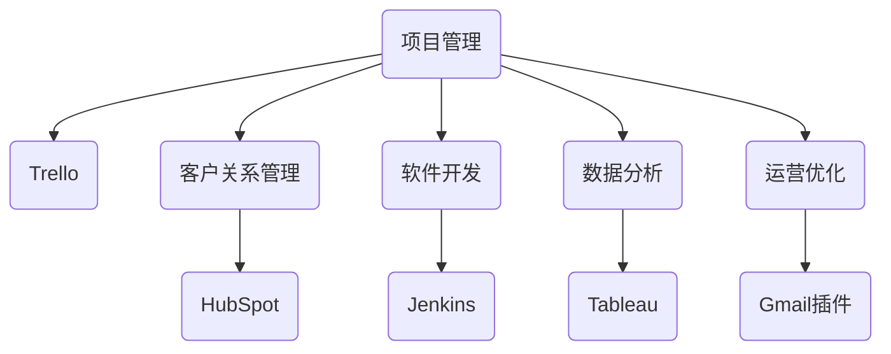

                 

关键词：自动化工具、创业、生产力提升、软件开发、效率优化

> 摘要：本文将探讨自动化工具在创业过程中的重要性，包括其提升生产力和效率的多种方式。通过详细的分析和实例，我们将了解自动化工具如何成为创业者的得力助手，助力他们在竞争激烈的市场中取得成功。

## 1. 背景介绍

随着科技的快速发展，自动化工具逐渐成为各个行业的重要推动力量。在创业领域，自动化工具的出现极大地改变了创业者的工作方式，提高了效率和生产力。创业者在创业初期往往面临着资源有限、时间紧迫的挑战，而自动化工具能够帮助他们在有限的资源下实现高效的运营和管理。

本文将重点讨论以下几个方面：

1. 自动化工具的基本概念及其在创业中的应用。
2. 自动化工具如何提升生产力和效率。
3. 不同类型的自动化工具及其适用场景。
4. 创业者如何利用自动化工具实现业务增长。
5. 自动化工具的未来发展趋势和挑战。

## 2. 核心概念与联系

### 2.1 自动化工具的概念

自动化工具是一种能够通过预设规则和算法自动执行任务的工具或系统。它能够减少人为干预，提高工作效率，降低运营成本。常见的自动化工具包括脚本、集成开发环境（IDE）、自动化测试工具、持续集成和持续部署（CI/CD）工具等。

### 2.2 自动化工具在创业中的应用

在创业过程中，自动化工具的应用场景广泛，包括：

- **项目管理**：自动化工具可以帮助创业者管理团队任务、项目进度和资源分配，如Trello、Asana等。
- **客户关系管理**：自动化工具可以自动化营销和客户服务流程，如HubSpot、Salesforce等。
- **软件开发**：自动化工具可以用于代码审查、编译、测试和部署，如Jenkins、GitLab等。
- **数据分析**：自动化工具可以用于数据处理、报告生成和数据可视化，如Tableau、Python等。
- **运营优化**：自动化工具可以帮助创业者自动化日常运营任务，如邮件发送、日程安排等，如Gmail插件、Google Calendar等。

### 2.3 Mermaid 流程图



## 3. 核心算法原理 & 具体操作步骤

### 3.1 算法原理概述

自动化工具的核心算法原理通常包括以下几个步骤：

1. **任务识别**：通过预定义的规则或用户输入，识别需要自动化的任务。
2. **规则设置**：根据任务需求，设置自动化流程的规则，如执行顺序、条件判断等。
3. **任务执行**：根据规则自动执行任务，如发送邮件、处理数据、编译代码等。
4. **结果验证**：对执行结果进行验证，确保任务完成的质量和效率。

### 3.2 算法步骤详解

1. **任务识别**：自动化工具首先需要识别任务。这可以通过以下几种方式实现：
   - **脚本**：编写脚本来识别特定任务。
   - **集成开发环境**：IDE可以识别开发过程中的任务，如代码编译、测试等。
   - **用户界面**：通过用户界面输入，识别需要自动化的任务。

2. **规则设置**：在任务识别后，设置自动化流程的规则。这包括：
   - **条件判断**：根据任务特点，设置条件判断规则，如“如果A，则执行B”。
   - **执行顺序**：设置任务执行的顺序，确保流程的正确性。

3. **任务执行**：根据设置的规则，自动化工具自动执行任务。这可以包括：
   - **脚本执行**：脚本按照预定的规则执行特定任务。
   - **IDE自动化**：IDE自动执行编译、测试等开发任务。
   - **集成工具**：集成工具自动执行项目构建、部署等任务。

4. **结果验证**：在任务执行后，自动化工具对结果进行验证。这包括：
   - **结果检查**：检查任务执行的结果是否满足预期。
   - **错误处理**：对执行过程中出现的错误进行捕获和处理。

### 3.3 算法优缺点

**优点**：
- 提高工作效率：自动化工具能够自动执行重复性任务，减少人工干预，提高工作效率。
- 降低运营成本：通过自动化减少人力成本，降低运营成本。
- 提高数据准确性：自动化工具能够减少人为错误，提高数据准确性。

**缺点**：
- 初期投入较大：自动化工具的开发和部署需要一定的技术和资源投入。
- 学习成本高：对于新手来说，学习和使用自动化工具可能需要一定时间。

### 3.4 算法应用领域

自动化工具在多个领域都有广泛应用，包括但不限于：

- **软件开发**：自动化测试、持续集成和持续部署。
- **客户关系管理**：自动化营销和客户服务。
- **项目管理**：自动化任务分配和进度跟踪。
- **数据分析**：自动化数据处理和报告生成。
- **运营优化**：自动化日常运营任务，如邮件发送、日程安排等。

## 4. 数学模型和公式 & 详细讲解 & 举例说明

### 4.1 数学模型构建

在自动化工具中，常用的数学模型包括：

1. **决策树**：用于决策和分类任务，如自动化测试中的错误定位。
2. **神经网络**：用于复杂的数据分析和预测任务，如客户关系管理中的客户行为预测。
3. **回归模型**：用于预测任务，如数据分析中的趋势预测。

### 4.2 公式推导过程

以决策树为例，其基本公式为：

$$
y = f(x)
$$

其中，$y$ 表示决策结果，$x$ 表示输入特征。

### 4.3 案例分析与讲解

假设我们需要使用决策树来预测客户是否会在下一个月进行复购。我们可以将客户的购买历史、购买金额等特征作为输入特征，构建决策树模型。

通过训练模型，我们得到如下决策树：

```
是否购买历史：是
    /             \
   复购           不复购
  /               \
购买金额：≥1000  购买金额：<1000
```

根据这个决策树，如果客户的购买历史为“是”，且购买金额≥1000，则预测客户会复购；否则，预测客户不会复购。

## 5. 项目实践：代码实例和详细解释说明

### 5.1 开发环境搭建

为了演示自动化工具在软件开发中的应用，我们选择使用Python编写一个简单的自动化测试脚本。首先，我们需要搭建Python开发环境：

1. 安装Python：在官网下载并安装Python。
2. 配置Python环境：在终端执行 `pip install -r requirements.txt` 命令，安装所需的第三方库。

### 5.2 源代码详细实现

以下是我们的自动化测试脚本：

```python
import unittest
from mymodule import MyModule

class TestMyModule(unittest.TestCase):
    def test_add(self):
        self.assertEqual(MyModule.add(1, 2), 3)

    def test_sub(self):
        self.assertEqual(MyModule.sub(5, 3), 2)

if __name__ == '__main__':
    unittest.main()
```

这个脚本定义了一个测试类 `TestMyModule`，包含两个测试方法 `test_add` 和 `test_sub`，分别测试模块 `mymodule` 中的加法和减法函数。

### 5.3 代码解读与分析

1. **导入模块**：脚本首先导入 `unittest` 模块，用于编写和运行测试用例。

2. **测试类定义**：脚本定义了一个名为 `TestMyModule` 的测试类，继承自 `unittest.TestCase`。

3. **测试方法**：`TestMyModule` 类包含两个测试方法 `test_add` 和 `test_sub`，分别测试模块 `mymodule` 中的加法和减法函数。

4. **断言**：每个测试方法使用 `assertEqual` 方法进行断言，检查测试结果是否与预期一致。

5. **运行测试**：在 `if __name__ == '__main__':` 代码块中，调用 `unittest.main()` 方法运行所有测试用例。

### 5.4 运行结果展示

运行测试脚本后，我们得到以下输出结果：

```
.
----------------------------------------------------------------------
Ran 2 tests in 0.001s

OK
```

输出结果表示测试脚本成功运行，且所有测试用例均通过。

## 6. 实际应用场景

### 6.1 项目管理

在项目管理中，自动化工具可以帮助创业者自动化任务分配、进度跟踪和报告生成。例如，使用Trello或Asana等工具，创业者可以创建任务卡片、设置优先级、跟踪任务进度，并通过自动化规则自动分配任务。

### 6.2 客户关系管理

客户关系管理是创业者成功的关键。自动化工具可以自动化营销、客户服务和销售流程。例如，使用HubSpot或Salesforce等工具，创业者可以自动化邮件发送、客户跟进和销售预测，提高客户满意度和销售转化率。

### 6.3 软件开发

在软件开发过程中，自动化工具可以用于代码审查、编译、测试和部署。例如，使用Jenkins或GitLab等工具，创业者可以自动化代码检查、测试和部署流程，确保软件质量，提高开发效率。

### 6.4 数据分析

数据分析是创业者了解业务状况、制定战略决策的重要手段。自动化工具可以用于数据处理、报告生成和数据可视化。例如，使用Python、R或Tableau等工具，创业者可以自动化数据处理、报告生成和数据可视化，快速了解业务数据，制定相应策略。

### 6.5 运营优化

运营优化是创业者提高业务效率的关键。自动化工具可以用于自动化日常运营任务，如邮件发送、日程安排等。例如，使用Gmail插件或Google Calendar等工具，创业者可以自动化邮件发送、日程提醒等任务，节省时间和精力。

## 7. 工具和资源推荐

### 7.1 学习资源推荐

- **书籍**：《Python自动化运维》、《Python自动化测试》
- **在线课程**：Coursera上的《自动化工具与流程管理》
- **博客和教程**：GitHub上的自动化工具教程、Stack Overflow上的自动化问题解答

### 7.2 开发工具推荐

- **集成开发环境**：Visual Studio Code、PyCharm
- **自动化测试工具**：Selenium、JUnit
- **持续集成工具**：Jenkins、GitLab
- **数据分析工具**：Python、R、Tableau

### 7.3 相关论文推荐

- **《自动化测试策略与实践》**：探讨自动化测试在软件开发中的应用和策略。
- **《自动化工具在项目管理中的应用》**：分析自动化工具在项目管理中的角色和价值。
- **《基于Python的自动化运维技术》**：介绍Python在自动化运维中的应用和实践。

## 8. 总结：未来发展趋势与挑战

### 8.1 研究成果总结

自动化工具在创业过程中已经展现出巨大的价值，包括提升生产力、降低运营成本、提高数据准确性等。随着人工智能和机器学习技术的发展，自动化工具将变得更加智能和高效。

### 8.2 未来发展趋势

- **智能化**：自动化工具将逐渐具备学习和预测能力，能够根据业务数据和用户行为自动调整和优化流程。
- **集成化**：自动化工具将与其他业务系统深度集成，实现无缝连接和协同工作。
- **云化**：自动化工具将更多地迁移到云平台，提供更加灵活和可扩展的服务。

### 8.3 面临的挑战

- **安全性**：自动化工具的普及将带来安全风险，如何确保数据和系统的安全成为重要挑战。
- **数据隐私**：自动化工具涉及大量业务数据，如何保护用户隐私成为关键问题。
- **技术门槛**：自动化工具的开发和使用仍需具备一定的技术背景，如何降低门槛，让更多人受益成为挑战。

### 8.4 研究展望

未来，自动化工具将在创业领域发挥更加重要的作用。研究者应关注智能化、集成化和云化等发展方向，同时注重安全性、数据隐私和技术普及等问题，为创业者的成功提供更加全面的支撑。

## 9. 附录：常见问题与解答

### 9.1 自动化工具如何提高效率？

自动化工具通过预设规则和算法自动执行重复性任务，减少人工干预，从而提高工作效率。

### 9.2 自动化工具是否适用于所有业务场景？

自动化工具适用于大部分业务场景，但在特殊场景下，可能需要定制化开发。

### 9.3 如何选择合适的自动化工具？

选择自动化工具时，应考虑业务需求、技术能力、成本和工具成熟度等因素。

### 9.4 自动化工具是否会影响工作质量？

合理使用自动化工具可以提高工作质量，但不当使用可能导致问题，因此需要培训和规范使用。

## 作者署名

作者：禅与计算机程序设计艺术 / Zen and the Art of Computer Programming

---

以上是本文的完整内容，涵盖了自动化工具在创业过程中的重要性、应用场景、算法原理和实践示例等内容。希望本文能为创业者提供有益的参考和启示。

