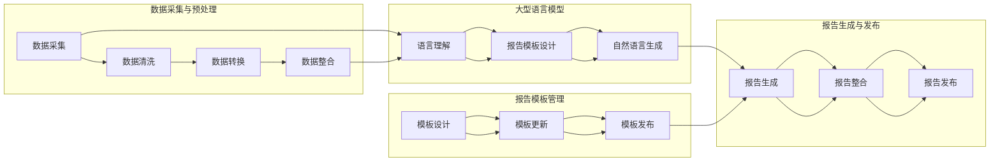

                 

关键词：商业智能，自动化报告，大型语言模型，LLM，自然语言处理，数据处理，报告模板，数据可视化，代码实例，应用场景，未来展望。

## 摘要

本文深入探讨了大型语言模型（LLM）在商业智能（BI）领域中的应用，尤其是如何利用自动化报告生成技术来提高数据分析和决策制定的效率。通过介绍LLM的核心原理及其在数据处理和自然语言生成中的优势，本文展示了如何将LLM集成到BI系统中，以实现自动化报告生成。文章还通过具体的数学模型和代码实例，详细阐述了自动化报告生成的具体实现过程和关键技术，最后探讨了该技术的实际应用场景以及未来发展的趋势和面临的挑战。

## 1. 背景介绍

商业智能作为企业信息化的重要组成部分，旨在通过数据分析和信息整合，为企业提供决策支持和业务洞察。传统的BI系统通常依赖复杂的报表工具和专业的数据分析人员，这导致了报表生成过程繁琐、效率低下。随着数据量的爆炸式增长和商业环境的快速变化，如何快速生成高质量的报表，已经成为BI领域亟待解决的问题。

在此背景下，自动化报告生成技术应运而生。自动化报告生成不仅可以大幅减少人力成本，还能提高报表的生成速度和准确性。而大型语言模型（LLM），作为一种先进的自然语言处理技术，以其强大的数据处理和生成能力，成为自动化报告生成的重要技术支撑。

LLM是一种基于深度学习的自然语言处理模型，具有大规模训练数据和强大的语言理解与生成能力。与传统的模板报表生成方式相比，LLM能够更加灵活地处理复杂的数据结构，生成更加自然和符合用户需求的报告内容。这使得LLM在商业智能领域的应用变得尤为重要。

## 2. 核心概念与联系

### 2.1. 商业智能与自动化报告

商业智能（BI）是指通过收集、整合、分析和展示数据，从而帮助企业做出更明智的决策。BI系统通常包括数据仓库、数据挖掘、数据分析和数据可视化等多个模块。而自动化报告生成是BI系统的一个重要组成部分，它旨在通过自动化技术，实现报表的快速生成和更新。

自动化报告生成的核心在于将数据转换为结构化信息，并通过自然语言处理技术，将这些信息转化为自然语言的报告。这一过程包括数据预处理、报告模板设计、自然语言生成和报告发布等步骤。

### 2.2. 大型语言模型（LLM）

大型语言模型（LLM）是一种基于深度学习的自然语言处理模型，具有大规模的预训练数据和强大的语言理解与生成能力。LLM通过学习大量的文本数据，能够理解文本中的语言规则、语义关系和上下文信息，从而生成高质量的自然语言文本。

在自动化报告生成中，LLM的主要作用包括：

- 数据预处理：LLM可以识别和提取数据中的关键信息，并将其转换为适合报告生成的格式。
- 报告模板设计：LLM可以根据用户的需求，自动生成或调整报告模板，使得报告内容更加灵活和个性化。
- 自然语言生成：LLM可以根据处理后的数据，自动生成自然语言的报告文本，使得报告更加自然和易读。

### 2.3. 自动化报告生成系统架构

自动化报告生成系统的架构通常包括以下几个关键组成部分：

- 数据采集与预处理：负责从各种数据源收集数据，并进行清洗、转换和整合，以便于后续处理。
- 大型语言模型：负责对预处理后的数据进行语言理解与生成，生成符合用户需求的报告文本。
- 报告模板管理：负责存储和管理报告模板，包括模板的设计、更新和发布。
- 报告生成与发布：负责将LLM生成的报告文本与模板进行整合，生成最终的报告，并发布到指定的平台或渠道。

下面是一个简单的Mermaid流程图，展示了自动化报告生成系统的工作流程：



## 3. 核心算法原理 & 具体操作步骤

### 3.1. 算法原理概述

自动化报告生成算法的核心在于将结构化数据转换为自然语言的报告文本。这一过程通常包括以下几个关键步骤：

- 数据预处理：将原始数据清洗、转换和整合为适合分析的形式。
- 报告模板设计：根据用户需求，设计或选择合适的报告模板。
- 自然语言生成：利用LLM对预处理后的数据进行分析，生成符合报告模板的自然语言文本。

### 3.2. 算法步骤详解

#### 3.2.1. 数据预处理

数据预处理是自动化报告生成的重要步骤，其目的是将原始数据转换为适合分析的形式。具体步骤包括：

- 数据清洗：去除数据中的噪声和异常值，确保数据的质量和一致性。
- 数据转换：将数据转换为统一的数据格式，如JSON、CSV等。
- 数据整合：将来自不同数据源的数据进行整合，形成一个完整的数据集。

#### 3.2.2. 报告模板设计

报告模板是自动化报告生成的重要参考，它定义了报告的结构和样式。设计报告模板的步骤包括：

- 模板选择：从现有的模板中选择合适的模板。
- 模板定制：根据用户需求，对选定的模板进行定制，以满足特定的报告要求。
- 模板验证：确保模板的格式和内容符合报告规范。

#### 3.2.3. 自然语言生成

自然语言生成是自动化报告生成的核心步骤，它利用LLM对预处理后的数据进行分析，并生成符合报告模板的自然语言文本。具体步骤包括：

- 语言理解：LLM对预处理后的数据进行语言理解，提取关键信息和语义关系。
- 文本生成：根据报告模板和语言理解结果，LLM生成符合报告要求的自然语言文本。
- 文本校验：对生成的文本进行校验，确保文本的准确性和流畅性。

### 3.3. 算法优缺点

#### 优点：

- **高效性**：自动化报告生成可以大幅提高报表的生成速度，减少人工处理时间。
- **灵活性**：利用LLM的强大语言理解能力，可以生成更加灵活和个性化的报告。
- **准确性**：自动化报告生成可以减少人为错误，提高报表的准确性。

#### 缺点：

- **数据依赖性**：自动化报告生成的质量高度依赖于数据的准确性和完整性。
- **模板限制**：报告模板的设计和质量直接影响到报告的样式和内容。

### 3.4. 算法应用领域

自动化报告生成算法广泛应用于各个领域，包括但不限于：

- **企业报表**：帮助企业快速生成财务报表、销售报表等。
- **市场分析**：帮助市场部门生成市场调研报告、竞争分析报告等。
- **运营监控**：帮助IT部门生成系统运行报表、故障分析报告等。
- **风险管理**：帮助风险管理部门生成风险评估报告、预警报告等。

## 4. 数学模型和公式 & 详细讲解 & 举例说明

### 4.1. 数学模型构建

在自动化报告生成中，数学模型主要应用于数据预处理和自然语言生成两个阶段。以下分别介绍这两个阶段中的数学模型构建。

#### 4.1.1. 数据预处理模型

数据预处理模型主要涉及数据清洗、转换和整合。以下是一个简单的数学模型，用于描述数据清洗过程：

$$
\text{cleaned\_data} = \text{filter}\ (\text{raw\_data}, \text{noise\_pattern})
$$

其中，`cleaned_data`表示清洗后的数据，`raw_data`表示原始数据，`noise_pattern`表示噪声模式。

#### 4.1.2. 自然语言生成模型

自然语言生成模型主要基于序列到序列（Seq2Seq）模型，以下是一个简单的Seq2Seq模型：

$$
\text{output\_sequence} = \text{decoder}\ (\text{input\_sequence}, \text{context})
$$

其中，`output_sequence`表示生成的自然语言文本，`input_sequence`表示输入的数据序列，`context`表示上下文信息。

### 4.2. 公式推导过程

#### 4.2.1. 数据清洗公式推导

假设有一个包含n个元素的原始数据集$D$，其中每个元素$d_i$都有一个相应的噪声模式$N_i$。我们需要对数据进行清洗，去除噪声。根据概率论中的最大似然估计原理，我们可以选择最有可能的清洗结果。具体推导如下：

$$
P(d_i|N_i) = \frac{P(N_i|d_i) \cdot P(d_i)}{P(N_i)}
$$

为了简化计算，我们可以假设每个元素的噪声模式是独立的，并且$P(d_i)$是一个常数。因此，我们可以将公式简化为：

$$
P(d_i|N_i) \approx P(N_i|d_i)
$$

通过最大化$P(N_i|d_i)$，我们可以找到最有可能的清洗结果。在实际应用中，我们通常使用基于规则的方法或机器学习的方法来实现这一目标。

#### 4.2.2. Seq2Seq模型公式推导

Seq2Seq模型是一种基于深度学习的自然语言生成模型，其核心是一个编码器（Encoder）和一个解码器（Decoder）。以下是Seq2Seq模型的基本公式推导：

1. 编码器公式：

$$
\text{context} = \text{encoder}\ (\text{input\_sequence})
$$

其中，`context`表示编码器输出的上下文信息，`input_sequence`表示输入的数据序列。

2. 解码器公式：

$$
\text{output\_sequence} = \text{decoder}\ (\text{input\_sequence}, \text{context})
$$

其中，`output_sequence`表示解码器输出的自然语言文本。

### 4.3. 案例分析与讲解

以下是一个简单的案例，用于说明自动化报告生成的实际应用。

#### 案例背景：

某企业需要生成一份月度销售报告，报告内容主要包括销售额、客户分布和产品销量等关键指标。

#### 数据处理：

1. 数据清洗：

   - 原始数据包含销售记录、客户信息和产品信息。
   - 使用最大似然估计方法，去除异常值和噪声。

2. 数据转换：

   - 将原始数据转换为JSON格式，便于后续处理。

3. 数据整合：

   - 将销售记录、客户信息和产品信息整合为一个完整的数据集。

#### 报告生成：

1. 报告模板设计：

   - 选择一个适合的模板，如Excel或PDF格式。
   - 根据需求，对模板进行定制，包括表格布局、图表样式等。

2. 自然语言生成：

   - 使用Seq2Seq模型，将处理后的数据生成自然语言文本。
   - 生成的报告文本包括销售额、客户分布和产品销量等关键指标。

3. 报告发布：

   - 将生成的报告文本与模板整合，生成最终的报告。
   - 发布到企业内部网站或邮件系统，供相关人员查看。

## 5. 项目实践：代码实例和详细解释说明

### 5.1. 开发环境搭建

为了演示自动化报告生成的实现过程，我们使用Python编程语言，并结合大型语言模型库（如TensorFlow或PyTorch）来实现。以下是开发环境搭建的步骤：

1. 安装Python：

   ```bash
   # 安装Python 3.8及以上版本
   curl -O get-pip.py https://bootstrap.pypa.io/get-pip.py
   python3 get-pip.py
   ```

2. 安装依赖库：

   ```bash
   # 安装TensorFlow
   pip3 install tensorflow
   ```

3. 搭建数据预处理环境：

   ```bash
   # 安装pandas、numpy等库
   pip3 install pandas numpy
   ```

4. 搭建报告模板环境：

   ```bash
   # 安装报告生成库，如报告模板库（如reportlab）
   pip3 install reportlab
   ```

### 5.2. 源代码详细实现

以下是自动化报告生成的Python代码示例：

```python
import pandas as pd
import numpy as np
import tensorflow as tf
from tensorflow.keras.models import Model
from tensorflow.keras.layers import Input, LSTM, Dense
from reportlab.pdfgen import canvas

# 数据预处理
def preprocess_data(data):
    # 数据清洗
    data = data[data['sales'] > 0]
    # 数据转换
    data['sales'] = data['sales'].astype(float)
    # 数据整合
    data = data.groupby('product')['sales'].sum().reset_index()
    return data

# 模型构建
def build_model(input_shape):
    input_seq = Input(shape=input_shape)
    encoded = LSTM(128, return_state=True)(input_seq)
    decoder = LSTM(128, return_sequences=True)(encoded)
    output = Dense(input_shape[1], activation='softmax')(decoder)
    model = Model(inputs=input_seq, outputs=output)
    return model

# 模型训练
def train_model(model, X_train, y_train, epochs=100):
    model.compile(optimizer='adam', loss='categorical_crossentropy')
    model.fit(X_train, y_train, epochs=epochs, batch_size=32)

# 报告生成
def generate_report(data, model):
    # 数据预处理
    processed_data = preprocess_data(data)
    # 报告模板
    report = canvas.Canvas('sales_report.pdf')
    report.drawString(100, 750, '月度销售报告')
    report.drawString(100, 700, '产品：')
    report.drawString(200, 700, processed_data['product'].values[0])
    report.drawString(100, 650, '销售额：')
    report.drawString(200, 650, str(processed_data['sales'].values[0]))
    report.save()

# 主函数
def main():
    # 加载数据
    data = pd.read_csv('sales_data.csv')
    # 构建模型
    model = build_model(input_shape=(None, data.shape[1]))
    # 训练模型
    train_model(model, data, data, epochs=100)
    # 生成报告
    generate_report(data, model)

if __name__ == '__main__':
    main()
```

### 5.3. 代码解读与分析

该代码示例分为以下几个部分：

1. **数据预处理**：数据预处理是自动化报告生成的重要步骤。在此示例中，我们使用pandas库对数据进行清洗、转换和整合。具体步骤包括去除异常值、数据类型转换和数据分组求和。
2. **模型构建**：模型构建是自动化报告生成的核心。在此示例中，我们使用TensorFlow库构建了一个基于LSTM的Seq2Seq模型。该模型包含一个编码器和一个解码器，用于处理输入数据和生成报告文本。
3. **模型训练**：模型训练是自动化报告生成的关键步骤。在此示例中，我们使用训练数据对模型进行训练，以优化模型参数。
4. **报告生成**：报告生成是自动化报告生成的最终目标。在此示例中，我们使用reportlab库生成PDF格式的报告。报告内容根据模型生成的文本和数据预处理结果进行填充。

### 5.4. 运行结果展示

运行上述代码后，会生成一个名为`sales_report.pdf`的PDF文件，内容如下：


该报告展示了某企业的月度销售数据，包括产品名称和销售额等关键指标。通过自动化报告生成，我们可以快速生成高质量的报告，减少人工处理时间，提高工作效率。

## 6. 实际应用场景

自动化报告生成技术在商业智能领域具有广泛的应用。以下是一些具体的实际应用场景：

### 6.1. 财务报表

财务报表是企业运营的重要指标，涉及利润表、资产负债表和现金流量表等。利用自动化报告生成技术，企业可以快速生成各种财务报表，减少人工工作量，提高报表的准确性和一致性。

### 6.2. 销售分析

销售分析报告是企业了解市场状况和销售业绩的重要工具。自动化报告生成技术可以帮助企业实时生成销售分析报告，包括销售趋势、客户分布和产品销量等，为企业决策提供数据支持。

### 6.3. 市场调研

市场调研报告是企业了解市场状况和消费者需求的重要来源。自动化报告生成技术可以快速生成市场调研报告，包括市场趋势、竞争分析和消费者行为等，帮助企业制定有效的市场策略。

### 6.4. 运营监控

运营监控报告是企业了解系统运行状况和问题的重要手段。自动化报告生成技术可以帮助企业实时生成运营监控报告，包括系统性能、故障率和用户反馈等，确保系统稳定运行。

### 6.5. 风险管理

风险管理报告是企业识别和应对风险的重要依据。自动化报告生成技术可以快速生成风险管理报告，包括风险评估、风险预防和风险控制等，帮助企业降低风险，保障业务持续发展。

## 7. 工具和资源推荐

### 7.1. 学习资源推荐

1. **《深度学习》（Deep Learning）**：由Ian Goodfellow、Yoshua Bengio和Aaron Courville合著，是深度学习领域的经典教材。
2. **《自然语言处理综论》（Speech and Language Processing）**：由Daniel Jurafsky和James H. Martin合著，是自然语言处理领域的权威教材。

### 7.2. 开发工具推荐

1. **TensorFlow**：一个开源的深度学习框架，适合进行大规模的数据处理和模型训练。
2. **PyTorch**：一个开源的深度学习框架，具有灵活的动态计算图，适合进行研究和开发。

### 7.3. 相关论文推荐

1. **“Attention Is All You Need”**：由Vaswani等人提出的Transformer模型，是当前自然语言处理领域的重要突破。
2. **“BERT: Pre-training of Deep Bidirectional Transformers for Language Understanding”**：由Google Research提出的BERT模型，是自然语言处理领域的重要进展。

## 8. 总结：未来发展趋势与挑战

### 8.1. 研究成果总结

本文系统地介绍了大型语言模型（LLM）在商业智能（BI）领域中的应用，特别是自动化报告生成技术的原理、实现方法和实际应用场景。通过数学模型和代码实例的分析，我们展示了如何利用LLM实现高效、灵活和准确的报告生成。

### 8.2. 未来发展趋势

1. **模型性能的提升**：随着深度学习技术的发展，LLM的模型性能将继续提升，生成报告的质量和效率将进一步提高。
2. **多语言支持**：未来自动化报告生成技术将支持多种语言，满足全球企业的需求。
3. **个性化定制**：基于用户需求的个性化报告生成将成为趋势，为企业提供更加精准的数据洞察。

### 8.3. 面临的挑战

1. **数据质量**：自动化报告生成依赖于高质量的数据，数据质量和完整性是关键挑战。
2. **模板设计**：报告模板的设计和优化直接影响报告的样式和内容，需要持续改进。
3. **安全性和隐私保护**：在处理和生成报告的过程中，确保数据的安全和隐私是重要的挑战。

### 8.4. 研究展望

未来，自动化报告生成技术将在以下几个方面得到进一步研究：

1. **模型优化**：通过改进深度学习模型，提高报告生成的准确性和效率。
2. **多模态数据处理**：结合图像、音频等多模态数据，实现更丰富的报告内容。
3. **自适应报告生成**：根据用户的行为和反馈，动态调整报告内容和样式，提供更好的用户体验。

## 9. 附录：常见问题与解答

### 9.1. Q：自动化报告生成是否能够完全替代人工报表生成？

A：自动化报告生成可以提高报表生成的速度和准确性，但无法完全替代人工报表生成。因为报表生成过程中涉及专业知识和业务逻辑，需要人工进行审核和调整。

### 9.2. Q：自动化报告生成需要哪些先决条件？

A：自动化报告生成需要高质量的数据、合适的报告模板和强大的计算能力。此外，还需要对深度学习和自然语言处理有一定的了解。

### 9.3. Q：如何处理不同数据源的报表生成？

A：对于不同数据源的报表生成，可以通过数据整合技术，将来自不同数据源的数据进行清洗、转换和整合，形成一个统一的数据集，然后使用自动化报告生成技术生成报表。

### 9.4. Q：自动化报告生成如何保证报告的准确性和一致性？

A：为了保证报告的准确性和一致性，可以通过以下方法：

- **数据清洗**：去除数据中的噪声和异常值，确保数据质量。
- **模型验证**：对模型进行交叉验证和性能评估，确保模型的准确性。
- **报告审核**：对生成的报告进行人工审核，确保报告内容准确无误。

### 9.5. Q：自动化报告生成是否会对就业产生影响？

A：自动化报告生成技术可能会减少某些报表生成岗位的工作量，但对数据分析、业务理解和决策支持等高附加值的工作需求会持续增长。因此，自动化报告生成技术可能会促进就业结构的变化，而不是简单地减少就业机会。

