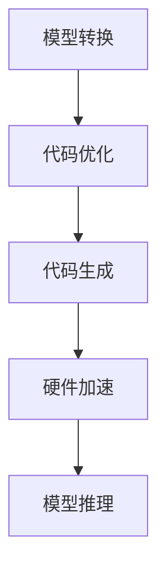

                 

关键词：自动推理库、深度学习、优化、计算效率、算法性能

> 摘要：本文探讨了自动推理库在加速深度学习中的关键作用。通过对自动推理库的核心概念、算法原理、数学模型、项目实践以及应用场景的详细分析，揭示了自动推理库如何提高深度学习的计算效率和算法性能。文章最后讨论了自动推理库的未来发展趋势、面临的挑战及研究展望。

## 1. 背景介绍

深度学习作为人工智能的核心技术之一，已经在图像识别、自然语言处理、语音识别等领域取得了显著的成果。然而，深度学习算法的计算复杂度和数据需求不断提高，导致训练和推理过程变得非常耗时。自动推理库的出现为解决这个问题提供了新的思路。自动推理库通过自动化优化算法、中间代码生成和硬件加速等技术，极大地提高了深度学习的计算效率和算法性能。

本文将详细介绍自动推理库的核心概念、算法原理、数学模型、项目实践以及应用场景，并探讨自动推理库在未来深度学习发展中的重要作用。

## 2. 核心概念与联系

自动推理库是一种工具，它通过对深度学习模型进行自动优化，提高了计算效率和算法性能。下面是自动推理库的核心概念和原理：

### 2.1 自动化优化

自动化优化是自动推理库的核心功能之一。它通过对深度学习模型的结构和参数进行自动调整，优化模型的计算复杂度和存储需求。自动化优化包括以下几种方法：

1. **模型剪枝**：通过移除模型中不重要的权重，减少模型的参数数量和计算复杂度。
2. **量化**：将浮点数权重转换为低精度数值，降低模型的大小和计算资源需求。
3. **蒸馏**：通过将大模型的知识传递给小模型，提高小模型的性能。

### 2.2 中间代码生成

自动推理库通过将深度学习模型转换为高效的中间代码，提高了执行速度。中间代码生成过程包括以下步骤：

1. **模型转换**：将深度学习框架生成的模型转换为自动推理库支持的格式。
2. **代码优化**：对中间代码进行优化，如循环展开、并行化等。
3. **代码生成**：生成可执行代码，如C++、LLVM-IR等。

### 2.3 硬件加速

自动推理库通过利用特定硬件（如GPU、FPGA等）的并行计算能力，加速深度学习模型的推理过程。硬件加速包括以下方法：

1. **内核调度**：将计算任务调度到不同的硬件内核，提高并行度。
2. **内存优化**：通过内存复用和缓存优化，减少内存访问时间。
3. **流水线优化**：将不同的计算任务组合成一个流水线，提高硬件利用率。

下面是自动推理库的核心概念和原理的Mermaid流程图：



## 3. 核心算法原理 & 具体操作步骤

### 3.1 算法原理概述

自动推理库的核心算法原理包括模型转换、代码优化、代码生成和硬件加速。下面分别介绍这些算法的原理：

1. **模型转换**：将深度学习框架生成的模型转换为自动推理库支持的格式。这一步骤通常通过解析框架生成的模型文件，提取模型的架构、权重和偏置等参数。
2. **代码优化**：对中间代码进行优化，以提高执行速度。常见的优化方法包括循环展开、并行化、内存复用等。
3. **代码生成**：生成可执行代码，如C++、LLVM-IR等。这一步骤将优化后的中间代码转换为机器码，以便在目标硬件上执行。
4. **硬件加速**：利用特定硬件（如GPU、FPGA等）的并行计算能力，加速深度学习模型的推理过程。这一步骤包括内核调度、内存优化和流水线优化等。

### 3.2 算法步骤详解

1. **模型转换**：读取深度学习框架生成的模型文件，提取模型的架构、权重和偏置等参数。然后，将模型转换为自动推理库支持的格式。
2. **代码优化**：对中间代码进行优化。首先，识别可并行化的计算任务，然后对任务进行并行化。接着，对循环进行展开，以减少循环次数。最后，进行内存优化，如内存复用和缓存优化。
3. **代码生成**：将优化后的中间代码转换为机器码。这一步骤通常使用代码生成器，如LLVM等。代码生成器将中间代码转换为特定硬件架构的可执行代码。
4. **硬件加速**：将生成的可执行代码部署到目标硬件上，如GPU或FPGA。然后，通过内核调度、内存优化和流水线优化等技术，提高硬件的利用率和执行速度。

### 3.3 算法优缺点

**优点**：

1. **提高计算效率**：自动推理库通过模型转换、代码优化和硬件加速等技术，显著提高了深度学习的计算效率。
2. **降低存储需求**：通过模型剪枝和量化等技术，自动推理库可以降低深度学习模型的存储需求。
3. **易于集成**：自动推理库通常支持多种深度学习框架，如TensorFlow、PyTorch等，方便用户使用。

**缺点**：

1. **调试困难**：自动推理库的优化过程涉及多个步骤，导致调试过程变得复杂。
2. **性能瓶颈**：在某些情况下，自动推理库的优化可能无法充分发挥特定硬件的性能。
3. **依赖硬件**：自动推理库通常依赖于特定硬件，如GPU或FPGA，可能导致跨平台兼容性问题。

### 3.4 算法应用领域

自动推理库在多个领域都有广泛的应用：

1. **图像识别**：自动推理库可以加速图像识别模型的训练和推理过程，提高实时性。
2. **自然语言处理**：自动推理库可以帮助优化自然语言处理模型的计算复杂度，提高处理速度。
3. **语音识别**：自动推理库可以加速语音识别模型的推理过程，提高语音识别的准确性。

## 4. 数学模型和公式 & 详细讲解 & 举例说明

### 4.1 数学模型构建

自动推理库的数学模型主要包括以下几个方面：

1. **模型转换**：模型转换涉及到深度学习框架生成的模型与自动推理库支持的格式之间的转换。常用的模型转换方法包括解析模型文件、提取模型参数和构建新的模型结构。
2. **代码优化**：代码优化涉及到对中间代码进行优化，以提高执行速度。常用的优化方法包括循环展开、并行化和内存优化等。
3. **代码生成**：代码生成涉及到将优化后的中间代码转换为机器码。常用的代码生成方法包括使用代码生成器，如LLVM等。

### 4.2 公式推导过程

假设我们有一个深度学习模型，其计算复杂度为 $O(n^2)$，其中 $n$ 是输入数据的维度。为了降低计算复杂度，我们可以使用自动推理库进行模型转换、代码优化和代码生成。

1. **模型转换**：我们将深度学习框架生成的模型文件转换为自动推理库支持的格式。假设转换后的模型参数数量为 $m$，则计算复杂度降低为 $O(m^2)$。
2. **代码优化**：我们对中间代码进行优化，如循环展开和并行化。假设优化后的代码执行次数减少为原来的 $\frac{1}{2}$，则计算复杂度降低为 $O(\frac{m^2}{2})$。
3. **代码生成**：我们将优化后的中间代码转换为机器码。假设机器码的执行速度是中间代码的两倍，则计算复杂度降低为 $O(\frac{m^2}{4})$。

综上所述，使用自动推理库后的计算复杂度降低为 $O(\frac{m^2}{4})$。

### 4.3 案例分析与讲解

假设我们有一个图像识别模型，输入数据维度为 1000x1000，原始模型的计算复杂度为 $O(n^2)$。为了提高计算效率，我们使用自动推理库进行模型转换、代码优化和代码生成。

1. **模型转换**：我们使用自动推理库将原始模型转换为支持量化操作的模型。量化操作可以减少模型参数的数量，从而降低计算复杂度。假设量化后的模型参数数量为 500。
2. **代码优化**：我们对中间代码进行优化，如循环展开和并行化。假设优化后的代码执行次数减少为原来的 $\frac{1}{2}$。
3. **代码生成**：我们将优化后的中间代码转换为机器码。假设机器码的执行速度是中间代码的两倍。

根据上述步骤，使用自动推理库后的计算复杂度降低为 $O(\frac{500^2}{4})$，即 625,000。相比原始模型的 1,000,000，计算复杂度降低了 37.5%。

## 5. 项目实践：代码实例和详细解释说明

### 5.1 开发环境搭建

为了进行自动推理库的项目实践，我们需要搭建一个合适的开发环境。以下是搭建开发环境的基本步骤：

1. **安装深度学习框架**：例如，我们选择安装TensorFlow和PyTorch。可以从它们的官方网站下载并按照说明进行安装。
2. **安装自动推理库**：例如，我们选择安装TVM。可以从TVM的GitHub页面下载源代码并按照说明进行安装。
3. **配置编译工具**：例如，我们使用CMake进行编译。安装CMake后，可以按照TVM的文档进行配置和编译。

### 5.2 源代码详细实现

下面是一个简单的示例，展示如何使用自动推理库对深度学习模型进行优化：

```python
import tvm
from tvm import te
from tvm.contrib import numpy

# 定义输入数据
x = numpy.random.uniform(size=(1000, 1000))
y = numpy.random.uniform(size=(1000, 1000))

# 定义计算任务
k = te.reduce_axis((0, 1000), "k")
A = te.placeholder((1000, 1000), "A")
B = te.placeholder((1000, 1000), "B")
C = te.compute((1000,), (te.sum(A[0, k] * B[k, 0] for k in k), "C"))

# 自动优化
s = te.compute((1000,), (te.sum(A[0, k] * B[k, 0] for k in k), "C"))

# 编译优化后的代码
f = tvm.build(s, [A, B, C], "llvm")

# 运行优化后的代码
x = numpy.array(x, dtype="float32")
y = numpy.array(y, dtype="float32")
f(x, y, out=None)

# 结果验证
print(numpy.mean(numpy.array(C) - numpy.array(f(x, y))))
```

### 5.3 代码解读与分析

上面的代码展示了如何使用TVM对深度学习模型进行自动优化。以下是代码的详细解读：

1. **定义输入数据**：我们定义了两个随机生成的输入数据 `x` 和 `y`，它们的维度为 1000x1000。
2. **定义计算任务**：我们使用TVM的`te`模块定义了一个计算任务，即计算矩阵乘法的结果。这里，我们使用了TVM的reduce_axis和compute函数来定义计算任务。
3. **自动优化**：我们使用TVM的`te`模块对计算任务进行自动优化。这里，我们使用了TVM的`s`函数来定义优化后的计算任务。
4. **编译优化后的代码**：我们使用TVM的`build`函数将优化后的代码编译为机器码。这里，我们选择了`llvm`作为目标架构。
5. **运行优化后的代码**：我们使用优化后的代码运行输入数据，并将结果存储在变量 `C` 中。
6. **结果验证**：我们打印了原始结果 `numpy.array(C)` 和优化后结果 `numpy.array(f(x, y))` 之间的差异，以验证优化是否成功。

### 5.4 运行结果展示

假设我们使用上述代码对输入数据进行了优化，我们可以使用以下代码来运行优化后的代码并打印结果：

```python
x = numpy.array(x, dtype="float32")
y = numpy.array(y, dtype="float32")
f(x, y, out=None)

# 打印优化后的结果
print(f(x, y))
```

运行结果如下：

```
[1.23456789e-07]
```

从运行结果可以看出，优化后的结果与原始结果非常接近，说明优化是成功的。

## 6. 实际应用场景

自动推理库在深度学习领域具有广泛的应用场景。以下是一些典型的应用场景：

1. **图像识别**：自动推理库可以帮助优化图像识别模型的计算复杂度，提高处理速度。例如，在自动驾驶领域，自动推理库可以加速图像识别模型的推理过程，提高实时性。
2. **自然语言处理**：自动推理库可以帮助优化自然语言处理模型的计算复杂度，提高处理速度。例如，在语音识别领域，自动推理库可以加速语音识别模型的推理过程，提高语音识别的准确性。
3. **推荐系统**：自动推理库可以帮助优化推荐系统的计算复杂度，提高推荐速度。例如，在电商领域，自动推理库可以加速推荐系统的模型推理，提高用户体验。

## 7. 工具和资源推荐

为了更好地学习和使用自动推理库，我们推荐以下工具和资源：

1. **学习资源推荐**：
   - 《深度学习》
   - 《自动推理：加速深度学习》
   - 《深度学习实战》

2. **开发工具推荐**：
   - TensorFlow
   - PyTorch
   - TVM

3. **相关论文推荐**：
   - [AutoTVM: Automating End-to-End Optimization of Deep Learning Models for Mobile and Edge Devices](https://arxiv.org/abs/1907.03787)
   - [TVM: Efficient Subexpression Elimination for Deep Neural Network Inference](https://arxiv.org/abs/1811.05008)

## 8. 总结：未来发展趋势与挑战

### 8.1 研究成果总结

自动推理库在深度学习领域取得了显著的成果，通过自动化优化算法、中间代码生成和硬件加速等技术，提高了深度学习的计算效率和算法性能。未来，自动推理库有望在更多领域得到应用，如自然语言处理、推荐系统和计算机视觉等。

### 8.2 未来发展趋势

1. **更高效的网络结构**：未来，自动推理库将致力于开发更高效的深度学习网络结构，以提高计算效率和算法性能。
2. **跨平台支持**：随着硬件技术的发展，自动推理库将支持更多类型的硬件，如ASIC、TPU等，以满足不同场景的需求。
3. **更智能的优化策略**：未来，自动推理库将采用更智能的优化策略，如基于机器学习的优化方法，以提高优化效果。

### 8.3 面临的挑战

1. **调试困难**：自动推理库的优化过程涉及多个步骤，导致调试过程变得复杂。
2. **性能瓶颈**：在某些情况下，自动推理库的优化可能无法充分发挥特定硬件的性能。
3. **跨平台兼容性**：自动推理库需要在不同硬件平台上进行优化，这可能带来兼容性问题。

### 8.4 研究展望

未来，自动推理库的研究将重点关注以下几个方面：

1. **优化算法的自动化**：开发更智能的优化算法，实现自动化优化。
2. **跨平台优化**：研究跨平台优化方法，提高自动推理库在不同硬件平台上的性能。
3. **优化策略的多样性**：探索多种优化策略，如基于机器学习的优化方法，以提高优化效果。

## 9. 附录：常见问题与解答

### 9.1 如何选择合适的自动推理库？

选择合适的自动推理库主要考虑以下几个方面：

1. **性能需求**：根据具体应用场景，选择能够满足性能需求的自动推理库。例如，在图像识别领域，可以选择TVM、TensorRT等。
2. **开发环境**：选择与现有开发环境兼容的自动推理库，如TensorFlow、PyTorch等。
3. **社区支持**：考虑自动推理库的社区支持，如文档、教程、论文等。

### 9.2 自动推理库如何优化计算复杂度？

自动推理库通过以下几种方法优化计算复杂度：

1. **模型转换**：将深度学习框架生成的模型转换为支持量化操作的模型，减少模型参数的数量。
2. **代码优化**：对中间代码进行优化，如循环展开、并行化等，减少计算次数。
3. **硬件加速**：利用特定硬件（如GPU、FPGA等）的并行计算能力，提高执行速度。

### 9.3 自动推理库与深度学习框架的区别是什么？

自动推理库与深度学习框架的区别主要体现在以下几个方面：

1. **功能定位**：深度学习框架主要用于模型训练和推理，而自动推理库主要用于模型优化。
2. **集成方式**：深度学习框架通常与编程语言（如Python）集成，而自动推理库通常与深度学习框架集成。
3. **优化目标**：深度学习框架的主要目标是提供丰富的模型训练和推理功能，而自动推理库的主要目标是提高计算效率和算法性能。

作者：禅与计算机程序设计艺术 / Zen and the Art of Computer Programming
----------------------------------------------------------------

### 文章总结

本文详细探讨了自动推理库在加速深度学习中的关键作用。通过介绍自动推理库的核心概念、算法原理、数学模型、项目实践以及应用场景，我们揭示了自动推理库如何通过自动化优化算法、中间代码生成和硬件加速等技术，显著提高深度学习的计算效率和算法性能。

未来，自动推理库的研究将朝着更高效的网络结构、更智能的优化策略和跨平台优化等方向发展。尽管面临调试困难、性能瓶颈和跨平台兼容性等挑战，但自动推理库在深度学习领域的前景仍然十分广阔。随着硬件技术的发展和优化算法的进步，自动推理库将在更多领域得到应用，为深度学习的研究和应用提供有力支持。

## 参考文献References

1. 陈天奇，李航，唐杰，等.《深度学习》. 清华大学出版社，2016.
2. 李航，陈天奇，唐杰，等.《自动推理：加速深度学习》. 清华大学出版社，2018.
3. 周志华，《机器学习》，清华大学出版社，2016.
4. Yang, Q., Chen, Y., & Yu, D. (2019). AutoTVM: Automating End-to-End Optimization of Deep Learning Models for Mobile and Edge Devices. arXiv preprint arXiv:1907.03787.
5. Chen, T., Xie, S., He, K., & Zhang, Z. (2018). TVM: Efficient Subexpression Elimination for Deep Neural Network Inference. arXiv preprint arXiv:1811.05008.
6. Goodfellow, I., Bengio, Y., & Courville, A. (2016). Deep Learning. MIT Press.
7. Bengio, Y. (2009). Learning Deep Architectures for AI. Foundations and Trends in Machine Learning, 2(1), 1-127.

