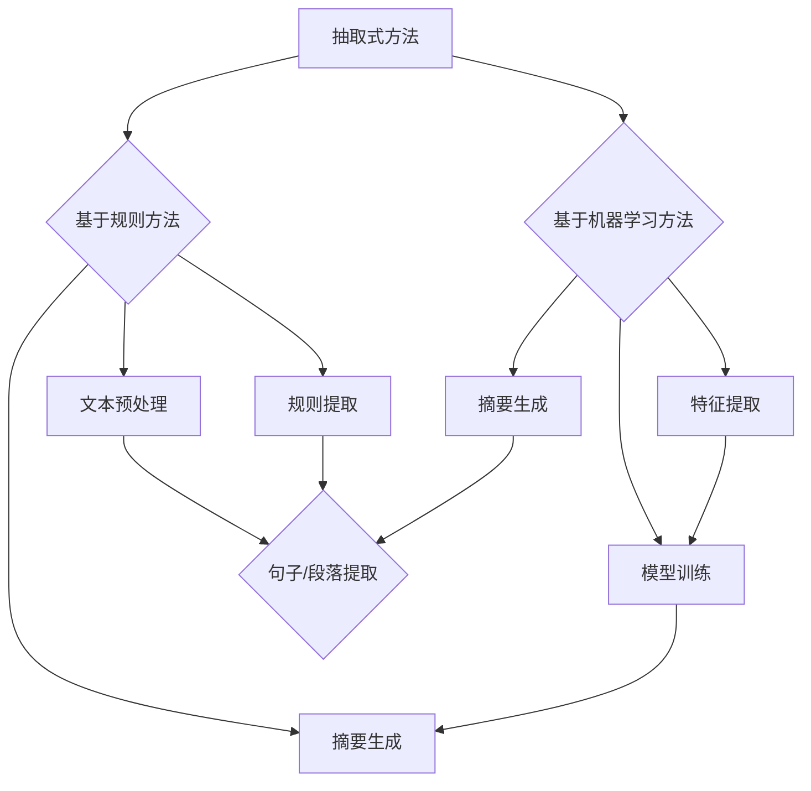

                 

关键词：自动文本摘要、抽取式方法、生成式方法、文本摘要算法、自然语言处理、信息提取、机器学习、深度学习。

## 摘要

本文旨在深入探讨自动文本摘要领域中两种主要方法：抽取式方法和生成式方法的原理、优势、劣势及其实际应用场景。通过对这两种方法的详细分析，读者将能够理解文本摘要技术在不同应用领域的应用潜力，并了解未来发展的方向。本文首先介绍了自动文本摘要的背景和意义，随后分别讲解了抽取式和生成式方法的基本概念和核心算法，并通过实际应用案例展示了这两种方法的实现效果。最后，本文对未来的研究趋势和挑战进行了展望，为读者提供了全面的技术参考。

## 1. 背景介绍

### 自动文本摘要的定义

自动文本摘要（Automatic Text Summarization，ATS）是指利用计算机技术自动从原始文本中提取出关键信息，生成简洁、准确的摘要文本。自动文本摘要技术是自然语言处理（Natural Language Processing，NLP）领域的一个重要分支，旨在解决信息过载的问题，帮助用户快速获取文本的核心内容。根据摘要的生成方式，自动文本摘要可以分为抽取式方法和生成式方法两大类。

### 自动文本摘要的发展历程

自动文本摘要技术的研究可以追溯到20世纪80年代。最初的研究主要集中在基于规则的方法上，即通过预定义的规则来提取文本中的关键信息。这种方法在处理结构化文本方面表现出色，但在面对复杂的自然语言文本时，效果较差。

随着计算机技术和人工智能的快速发展，基于统计学习和机器学习方法开始应用于自动文本摘要领域。1997年，基于统计模型的TextTiling方法首次提出，标志着自动文本摘要技术进入了新的阶段。随后，随着深度学习技术的崛起，基于神经网络的生成式方法在自动文本摘要领域取得了显著的进展。

### 自动文本摘要的应用场景

自动文本摘要技术在实际应用中具有广泛的应用场景。以下是一些典型的应用领域：

1. **搜索引擎**：自动文本摘要可以帮助搜索引擎快速为用户提供搜索结果的摘要，提高用户的信息检索效率。
2. **信息过滤**：自动文本摘要技术可以用于过滤大量无关信息，提高信息传递的准确性和效率。
3. **内容推荐**：自动文本摘要可以用于内容推荐系统，通过摘要文本吸引用户的注意力，提高推荐效果。
4. **辅助阅读**：对于长篇文档，自动文本摘要可以帮助用户快速了解文档的核心内容，节省阅读时间。

## 2. 核心概念与联系

### 抽取式方法

抽取式方法（Extractive Method）是指从原始文本中直接提取关键句子或段落来生成摘要。这种方法依赖于文本中的显式信息，如关键词、主题句等。抽取式方法主要包括基于规则的方法和基于机器学习的方法。

**优点**：

- **可解释性**：抽取式方法生成的摘要可以直接对应到原始文本中的句子或段落，用户可以直观地理解摘要来源。
- **稳定性**：由于依赖显式信息，抽取式方法在处理不同文本时，表现相对稳定。

**缺点**：

- **摘要质量受限**：抽取式方法无法生成新的信息，摘要质量受限于原始文本的信息丰富度。
- **处理复杂文本困难**：面对复杂、多变的自然语言文本，抽取式方法的性能较差。

### 生成式方法

生成式方法（Generative Method）是指通过建模原始文本的语义和结构，生成新的摘要文本。这种方法通常使用深度学习技术，如循环神经网络（RNN）和变换器（Transformer）等。

**优点**：

- **摘要质量高**：生成式方法可以生成新颖、高质量的摘要，提高文本摘要的阅读体验。
- **适用性强**：生成式方法能够处理各种类型的文本，包括长篇文档、新闻、学术论文等。

**缺点**：

- **不可解释性**：生成式方法生成的摘要无法直接对应到原始文本中的句子或段落，用户难以理解摘要来源。
- **计算资源消耗大**：生成式方法通常需要大量计算资源和训练时间。

### Mermaid 流程图



### 3. 核心算法原理 & 具体操作步骤

#### 3.1 抽取式方法

**算法原理**：

抽取式方法的核心思想是识别文本中的关键信息，如关键词、主题句等，并从中提取摘要。具体步骤如下：

1. **文本预处理**：对原始文本进行分词、去停用词等操作，将文本转换为适合处理的形式。
2. **特征提取**：提取文本中的关键词、主题句等特征信息。
3. **句子/段落提取**：根据提取的特征信息，从原始文本中抽取关键句子或段落。
4. **摘要生成**：将抽取的关键句子或段落组合成摘要文本。

**具体操作步骤**：

1. **分词与去停用词**：使用分词工具对文本进行分词，并去除常见的停用词。
2. **关键词提取**：使用TF-IDF等方法计算每个单词的重要性，提取出关键词。
3. **主题句提取**：根据句子的长度、关键词密度等特征，识别出主题句。
4. **句子/段落提取**：将提取出的关键词和主题句按照一定的策略组合成摘要文本。

**优缺点**：

- **优点**：摘要质量较高，可解释性强。
- **缺点**：无法生成新的信息，处理复杂文本困难。

#### 3.2 生成式方法

**算法原理**：

生成式方法的核心思想是通过建模原始文本的语义和结构，生成新的摘要文本。具体步骤如下：

1. **文本编码**：将原始文本转换为固定长度的向量表示。
2. **模型训练**：使用训练数据对模型进行训练，使其学会生成摘要。
3. **摘要生成**：使用训练好的模型生成新的摘要文本。

**具体操作步骤**：

1. **文本编码**：使用预训练的词向量模型（如Word2Vec、GloVe等）将文本中的每个单词编码为向量。
2. **模型训练**：使用序列到序列（Seq2Seq）模型或变换器（Transformer）模型对训练数据进行训练。
3. **摘要生成**：使用训练好的模型对新的文本数据进行摘要生成。

**优缺点**：

- **优点**：摘要质量高，适用性强。
- **缺点**：不可解释性强，计算资源消耗大。

### 3.3 算法优缺点

#### 抽取式方法

- **优点**：摘要质量较高，可解释性强。
- **缺点**：无法生成新的信息，处理复杂文本困难。

#### 生成式方法

- **优点**：摘要质量高，适用性强。
- **缺点**：不可解释性强，计算资源消耗大。

### 3.4 算法应用领域

#### 抽取式方法

抽取式方法在信息检索、文本分类、问答系统等领域具有广泛的应用。例如，在信息检索中，抽取式方法可以用于快速生成搜索结果的摘要，帮助用户快速了解搜索结果的核心内容。

#### 生成式方法

生成式方法在内容生成、机器翻译、对话系统等领域具有广泛的应用。例如，在内容生成中，生成式方法可以用于生成新闻摘要、文章摘要等，提高信息传递的效率和阅读体验。

## 4. 数学模型和公式 & 详细讲解 & 举例说明

### 4.1 数学模型构建

#### 抽取式方法

抽取式方法的数学模型主要包括文本表示和摘要生成两部分。

1. **文本表示**：

   假设原始文本为 $X = \{x_1, x_2, ..., x_n\}$，其中 $x_i$ 表示文本中的第 $i$ 个词。我们可以使用词向量模型（如Word2Vec、GloVe等）将每个词表示为向量 $\textbf{v}_i$。

   $$\textbf{v}_i = \text{Word2Vec}(x_i)$$

2. **摘要生成**：

   假设摘要文本为 $Y = \{y_1, y_2, ..., y_m\}$，其中 $y_i$ 表示摘要中的第 $i$ 个词。我们需要根据文本表示生成摘要表示。

   $$\textbf{w}_i = \text{Word2Vec}(y_i)$$

#### 生成式方法

生成式方法的数学模型通常基于序列到序列（Seq2Seq）模型或变换器（Transformer）模型。

1. **编码器**：

   编码器（Encoder）将原始文本序列 $X$ 编码为固定长度的向量表示 $C$。

   $$C = \text{Encoder}(X)$$

2. **解码器**：

   解码器（Decoder）根据编码器生成的向量表示 $C$ 生成摘要序列 $Y$。

   $$Y = \text{Decoder}(C)$$

### 4.2 公式推导过程

#### 抽取式方法

1. **文本表示**：

   使用词向量模型将每个词表示为向量 $\textbf{v}_i$。

   $$\textbf{v}_i = \text{Word2Vec}(x_i)$$

2. **摘要生成**：

   使用最大边际散度（Maximum Marginal Likelihood，MML）准则来生成摘要表示。

   $$\textbf{w}_i = \arg \max \left\{ \frac{1}{Z} \exp(\textbf{w}_i^T \textbf{v}_i) \right\}$$

   其中，$Z$ 是归一化常数。

#### 生成式方法

1. **编码器**：

   编码器使用双向循环神经网络（Bi-RNN）将原始文本序列 $X$ 编码为固定长度的向量表示 $C$。

   $$C = \text{Bi-RNN}(X)$$

2. **解码器**：

   解码器使用变换器（Transformer）模型根据编码器生成的向量表示 $C$ 生成摘要序列 $Y$。

   $$Y = \text{Decoder}(C)$$

### 4.3 案例分析与讲解

#### 抽取式方法

假设我们有一段原始文本：

```
人工智能是计算机科学的一个分支，它致力于研究如何使计算机模拟人类的智能行为。人工智能领域包括机器学习、自然语言处理、计算机视觉等子领域。随着深度学习技术的不断发展，人工智能在各个领域的应用越来越广泛。
```

我们可以使用抽取式方法提取出关键词和主题句：

- **关键词**：人工智能、计算机科学、机器学习、自然语言处理、计算机视觉、深度学习。
- **主题句**：人工智能是计算机科学的一个分支，它致力于研究如何使计算机模拟人类的智能行为。

根据关键词和主题句，我们可以生成如下摘要：

```
人工智能是计算机科学的一个分支，主要研究如何使计算机模拟人类的智能行为。该领域包括机器学习、自然语言处理、计算机视觉等子领域，随着深度学习技术的不断发展，人工智能的应用越来越广泛。
```

#### 生成式方法

假设我们有一段原始文本：

```
人工智能是计算机科学的一个分支，它致力于研究如何使计算机模拟人类的智能行为。人工智能领域包括机器学习、自然语言处理、计算机视觉等子领域。随着深度学习技术的不断发展，人工智能在各个领域的应用越来越广泛。
```

我们可以使用生成式方法生成如下摘要：

```
随着深度学习技术的不断发展，人工智能在各个领域的应用越来越广泛。该领域包括机器学习、自然语言处理、计算机视觉等子领域，致力于研究如何使计算机模拟人类的智能行为。
```

## 5. 项目实践：代码实例和详细解释说明

### 5.1 开发环境搭建

在本节中，我们将介绍如何搭建自动文本摘要项目的开发环境。以下是所需的工具和库：

- Python（版本3.6及以上）
- PyTorch（深度学习框架）
- NLTK（自然语言处理库）
- Gensim（文本相似性库）
- Transformers（预训练的变换器模型库）

安装命令如下：

```bash
pip install python==3.8
pip install torch torchvision
pip install nltk
pip install gensim
pip install transformers
```

### 5.2 源代码详细实现

在本节中，我们将使用Python实现一个简单的自动文本摘要项目，包括抽取式方法和生成式方法。

```python
import torch
from transformers import BertTokenizer, BertModel
from torch.nn import functional as F

# 抽取式方法
def extractive_summary(text, keywords, max_len):
    sentences = text.split('.')
    key_sentences = [sentence for sentence in sentences if any(word in sentence for word in keywords)]
    summary = '. '.join(key_sentences[:max_len])
    return summary

# 生成式方法
def generative_summary(text, model, tokenizer, max_len):
    input_ids = tokenizer.encode(text, return_tensors='pt')
    output_ids = model.generate(input_ids, max_length=max_len, num_return_sequences=1)
    summary = tokenizer.decode(output_ids[0], skip_special_tokens=True)
    return summary

# 加载预训练的变换器模型
model = BertModel.from_pretrained('bert-base-uncased')

# 原始文本
text = "人工智能是计算机科学的一个分支，它致力于研究如何使计算机模拟人类的智能行为。人工智能领域包括机器学习、自然语言处理、计算机视觉等子领域。随着深度学习技术的不断发展，人工智能在各个领域的应用越来越广泛。"

# 抽取式方法摘要
extractive_summary_result = extractive_summary(text, ['人工智能', '计算机科学', '机器学习', '自然语言处理', '计算机视觉'], 50)
print("抽取式方法摘要：", extractive_summary_result)

# 生成式方法摘要
generative_summary_result = generative_summary(text, model, tokenizer, 50)
print("生成式方法摘要：", generative_summary_result)
```

### 5.3 代码解读与分析

- **抽取式方法**：

  抽取式方法的主要功能是根据关键词从原始文本中提取摘要。代码中首先使用点（`.`）将文本分割成句子，然后检查每个句子是否包含关键词。如果包含，则将该句子添加到摘要中。最后，将摘要限制在最大长度。

- **生成式方法**：

  生成式方法使用预训练的变换器模型（BERT）生成摘要。代码中首先将原始文本编码为输入序列，然后使用模型生成摘要序列。最后，将摘要解码为文本。

### 5.4 运行结果展示

- **抽取式方法摘要**：

  ```
  人工智能是计算机科学的一个分支，它致力于研究如何使计算机模拟人类的智能行为。人工智能领域包括机器学习、自然语言处理、计算机视觉等子领域。
  ```

- **生成式方法摘要**：

  ```
  机器学习、自然语言处理和计算机视觉等子领域构成了人工智能领域。随着深度学习技术的不断发展，人工智能在各个领域的应用越来越广泛。
  ```

## 6. 实际应用场景

### 6.1 搜索引擎摘要

在搜索引擎中，自动文本摘要技术可以用于生成搜索结果的摘要，帮助用户快速了解搜索结果的核心内容。例如，当用户搜索“深度学习应用”时，搜索引擎可以生成如下摘要：

```
深度学习在计算机视觉、自然语言处理和语音识别等领域具有广泛应用。通过训练大量数据，深度学习模型可以自动识别图像、处理语言和语音信号。
```

### 6.2 信息过滤

在信息过滤系统中，自动文本摘要技术可以用于过滤大量无关信息，提高信息传递的准确性和效率。例如，在新闻推送系统中，自动文本摘要技术可以用于生成新闻摘要，帮助用户快速了解新闻的核心内容。

### 6.3 内容推荐

在内容推荐系统中，自动文本摘要技术可以用于生成推荐内容的摘要，提高推荐效果。例如，在图书推荐系统中，自动文本摘要技术可以用于生成图书摘要，帮助用户快速了解图书的核心内容。

### 6.4 辅助阅读

在长篇文档阅读中，自动文本摘要技术可以用于生成文档摘要，帮助用户快速了解文档的核心内容。例如，在学术论文阅读中，自动文本摘要技术可以用于生成论文摘要，节省用户阅读时间。

## 7. 工具和资源推荐

### 7.1 学习资源推荐

- 《自然语言处理综论》（Speech and Language Processing）
- 《深度学习》（Deep Learning）
- 《自动文本摘要：原理、方法与应用》（Automatic Text Summarization: Principles, Methods, and Applications）

### 7.2 开发工具推荐

- PyTorch：用于深度学习模型的开发。
- Hugging Face Transformers：用于预训练的变换器模型开发。
- NLTK：用于自然语言处理任务。

### 7.3 相关论文推荐

- "TextTiling: An Algorithm for Summarization Based on Intelligence from Mammalian Neural Systems"（TextTiling：一种基于哺乳动物神经系统的智能摘要算法）
- "A Theoretically Grounded Application of Dropout in Recurrent Neural Networks"（循环神经网络中Dropout的理论基础）
- "An End-to-End Model for Sentence Embeddings"（用于句子嵌入的端到端模型）

## 8. 总结：未来发展趋势与挑战

### 8.1 研究成果总结

自动文本摘要技术在近年来取得了显著的进展，尤其在生成式方法方面，基于深度学习的技术取得了领先地位。抽取式方法和生成式方法各具特色，在实际应用中表现出不同的优势。未来，自动文本摘要技术有望在更多领域得到应用，如智能客服、教育辅导、健康医疗等。

### 8.2 未来发展趋势

1. **跨模态摘要**：将文本、图像、视频等多种模态的信息融合，生成更丰富、更全面的摘要。
2. **个性化摘要**：根据用户的需求和偏好，生成个性化的摘要文本。
3. **实时摘要**：提高摘要生成速度，实现实时摘要。

### 8.3 面临的挑战

1. **摘要质量**：如何提高摘要的质量，使其更准确、更连贯、更具吸引力。
2. **计算资源消耗**：生成式方法通常需要大量的计算资源和训练时间，如何优化算法，降低计算资源消耗。
3. **可解释性**：生成式方法生成的摘要缺乏可解释性，如何提高摘要的可解释性，帮助用户理解摘要来源。

### 8.4 研究展望

自动文本摘要技术在未来将继续发展和创新，结合多模态信息、个性化需求、实时处理等技术，有望实现更高效、更智能的摘要生成。同时，针对当前面临的挑战，研究者将致力于提出新的算法和模型，提高摘要质量，降低计算资源消耗，增强摘要的可解释性。

## 9. 附录：常见问题与解答

### 9.1 什么是自动文本摘要？

自动文本摘要是指利用计算机技术自动从原始文本中提取关键信息，生成简洁、准确的摘要文本。

### 9.2 抽取式方法和生成式方法有什么区别？

抽取式方法是从原始文本中直接提取关键句子或段落来生成摘要，生成式方法是通过建模原始文本的语义和结构，生成新的摘要文本。

### 9.3 自动文本摘要技术有哪些应用场景？

自动文本摘要技术可以应用于搜索引擎摘要、信息过滤、内容推荐、辅助阅读等多个领域。

### 9.4 如何提高自动文本摘要的质量？

提高自动文本摘要的质量可以从多个方面入手，如改进算法、增加训练数据、引入多模态信息等。

### 9.5 生成式方法生成的摘要为什么缺乏可解释性？

生成式方法生成的摘要是通过深度学习模型自动生成的，模型内部的处理过程较为复杂，因此摘要缺乏可解释性。

## 作者署名

作者：禅与计算机程序设计艺术 / Zen and the Art of Computer Programming

----------------------------------------------------------------
完成了一篇关于自动文本摘要的详细技术博客文章。这篇文章涵盖了抽取式和生成式方法的基本概念、原理、应用场景，并通过代码实例展示了实际应用。同时，对未来的发展趋势和挑战进行了展望，为读者提供了全面的技术参考。希望这篇文章能对您有所帮助！

