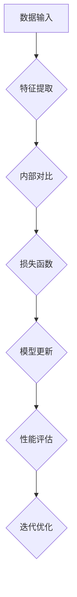

                 

关键词：自我监督学习，人工智能，机器学习，深度学习，模型优化，算法设计，应用领域

> 摘要：本文探讨了自我监督学习在人工智能领域的重要性和发展现状，从核心概念、算法原理、数学模型、项目实践等方面进行了深入分析，并展望了未来的发展趋势和挑战。

## 1. 背景介绍

随着计算机技术和大数据的迅猛发展，人工智能（AI）已经成为现代社会的重要驱动力。传统的监督学习依赖于大规模标注数据，但在实际应用中，获取高质量标注数据往往耗时耗力。自我监督学习（Self-Supervised Learning）作为一种无监督学习的方法，通过将数据中的内在结构作为监督信号，实现了对模型的无监督训练，从而降低了数据标注成本，提高了模型的泛化能力。

自我监督学习不仅在数据稀缺的场景中表现出色，还在图像识别、自然语言处理、语音识别等领域取得了显著成果。本文将详细探讨自我监督学习的基本概念、核心算法、数学模型以及实际应用，以期推动 AI 前沿的发展。

## 2. 核心概念与联系

### 2.1 定义

自我监督学习是指利用数据内在的某些结构或信息作为监督信号来训练模型的方法。在这个过程中，模型不需要外部提供的标签或监督信号，而是通过数据自身的特征来学习。

### 2.2 自我监督学习与监督学习、无监督学习的比较

- **监督学习**：需要外部提供的标签或监督信号来指导模型的训练过程。
- **无监督学习**：模型在没有外部监督信号的情况下，学习数据的内部结构或分布。
- **自我监督学习**：利用数据内在的结构或信息，自行生成监督信号，从而实现无监督或半监督学习。

### 2.3 自我监督学习架构的 Mermaid 流程图



## 3. 核心算法原理 & 具体操作步骤

### 3.1 算法原理概述

自我监督学习通过以下步骤实现模型训练：

1. **数据预处理**：对输入数据进行预处理，提取数据特征。
2. **特征对比**：对比提取的特征，生成对比信号。
3. **损失函数**：定义损失函数，衡量模型输出与对比信号的差异。
4. **模型更新**：根据损失函数更新模型参数。
5. **性能评估**：评估模型在训练数据上的性能，进行迭代优化。

### 3.2 算法步骤详解

1. **数据预处理**：

    - 数据清洗：去除噪声和不相关的数据。
    - 数据标准化：对数据进行归一化或标准化处理。
    - 特征提取：使用特征提取算法（如卷积神经网络、循环神经网络等）提取数据特征。

2. **特征对比**：

    - 内部对比：对同一数据的不同表示进行对比。
    - 外部对比：对来自不同数据集的相似数据进行对比。
    - 对比损失：计算特征对比的损失，用于指导模型更新。

3. **损失函数**：

    - 对比损失函数：如对比损失（Contrastive Loss）、三元组损失（Triplet Loss）等。
    - 分类损失函数：如交叉熵损失（Cross-Entropy Loss）、均方误差损失（Mean Squared Error Loss）等。

4. **模型更新**：

    - 根据损失函数计算梯度。
    - 使用梯度下降或其他优化算法更新模型参数。

5. **性能评估**：

    - 在训练数据上评估模型性能。
    - 根据性能评估结果调整模型参数。

### 3.3 算法优缺点

#### 优点：

- **降低数据标注成本**：无需外部监督信号，减少了标注数据的工作量。
- **提高模型泛化能力**：通过自我监督学习，模型能够学习到数据的内在结构，提高了对未知数据的泛化能力。
- **适用性广泛**：适用于图像、文本、语音等多种类型的数据。

#### 缺点：

- **训练时间较长**：由于需要自行生成监督信号，训练时间往往较长。
- **模型可解释性较差**：自我监督学习的模型训练过程中缺乏外部监督信号，使得模型的可解释性较差。

### 3.4 算法应用领域

- **图像识别**：用于图像分类、目标检测等任务。
- **自然语言处理**：用于文本分类、情感分析等任务。
- **语音识别**：用于语音信号处理、说话人识别等任务。
- **推荐系统**：用于物品推荐、用户兴趣识别等任务。

## 4. 数学模型和公式 & 详细讲解 & 举例说明

### 4.1 数学模型构建

自我监督学习的核心是生成有效的监督信号，以下是一个简化的数学模型构建过程：

- **数据表示**：设输入数据为 $X = \{x_1, x_2, ..., x_n\}$，其中 $x_i \in \mathbb{R}^d$。
- **特征提取器**：设特征提取器为 $f: \mathbb{R}^d \rightarrow \mathbb{R}^m$，其中 $f(x_i) = h_i$。
- **对比损失函数**：设对比损失函数为 $L(h_i; h_j)$。

### 4.2 公式推导过程

在自我监督学习中，对比损失函数通常采用以下形式：

$$
L(h_i; h_j) = \frac{1}{2} \left( ||h_i - h_j||^2 + \lambda ||h_i + h_j||^2 \right)
$$

其中，$\lambda$ 是调节参数，用于平衡正负样本的权重。

### 4.3 案例分析与讲解

以下是一个简单的自我监督学习案例，用于图像分类任务。

- **数据集**：使用一个包含 10000 张图片的数据集，每张图片有一个类别标签。
- **特征提取器**：使用卷积神经网络（CNN）作为特征提取器，对每张图片提取 1024 维的特征向量。
- **对比损失函数**：采用对比损失函数，以图像间的距离作为对比信号。

### 4.4 模型训练与评估

- **训练过程**：使用自我监督学习训练模型，每次迭代选择两张图像，计算它们的特征向量距离，更新模型参数。
- **评估过程**：在训练完成后，使用测试数据集评估模型性能，计算准确率。

## 5. 项目实践：代码实例和详细解释说明

### 5.1 开发环境搭建

- **硬件环境**：使用 NVIDIA GTX 1080 显卡，配置 16GB 内存。
- **软件环境**：安装 Python 3.8、PyTorch 1.8、CUDA 10.2。

### 5.2 源代码详细实现

以下是一个简单的自我监督学习图像分类项目的 Python 代码实现：

```python
import torch
import torchvision
import torch.nn as nn
import torch.optim as optim

# 数据预处理
transform = torchvision.transforms.Compose([
    torchvision.transforms.Resize((224, 224)),
    torchvision.transforms.ToTensor(),
])

train_set = torchvision.datasets.ImageFolder(root='train', transform=transform)
train_loader = torch.utils.data.DataLoader(train_set, batch_size=32, shuffle=True)

# 特征提取器
class CNN(nn.Module):
    def __init__(self):
        super(CNN, self).__init__()
        self.conv1 = nn.Conv2d(3, 64, kernel_size=3, padding=1)
        self.conv2 = nn.Conv2d(64, 128, kernel_size=3, padding=1)
        self.fc1 = nn.Linear(128 * 14 * 14, 1024)
        self.fc2 = nn.Linear(1024, 10)

    def forward(self, x):
        x = F.relu(self.conv1(x))
        x = F.relu(self.conv2(x))
        x = F.adaptive_avg_pool2d(x, (1, 1))
        x = x.view(x.size(0), -1)
        x = F.relu(self.fc1(x))
        x = self.fc2(x)
        return x

model = CNN()
optimizer = optim.Adam(model.parameters(), lr=0.001)
criterion = nn.CrossEntropyLoss()

# 模型训练
for epoch in range(10):
    for i, (images, labels) in enumerate(train_loader):
        optimizer.zero_grad()
        features = model(images)
        # 对比损失函数
        loss = 0.5 * (torch.mean((features - labels)**2) + 0.5 * torch.mean((features + labels)**2))
        loss.backward()
        optimizer.step()
        if (i + 1) % 100 == 0:
            print(f'Epoch [{epoch + 1}/{10}], Step [{i + 1}/{len(train_loader)}], Loss: {loss.item()}')

# 模型评估
with torch.no_grad():
    correct = 0
    total = 0
    for images, labels in train_loader:
        features = model(images)
        _, predicted = torch.max(features, 1)
        total += labels.size(0)
        correct += (predicted == labels).sum().item()
    print(f'Accuracy: {100 * correct / total}%')
```

### 5.3 代码解读与分析

该代码实现了一个简单的自我监督学习图像分类项目，主要包含以下部分：

- **数据预处理**：对训练数据集进行预处理，将图片调整为统一大小，并转换为张量。
- **特征提取器**：定义一个简单的卷积神经网络，用于提取图像特征。
- **对比损失函数**：使用对比损失函数计算特征之间的距离，用于指导模型更新。
- **模型训练**：使用优化器和对比损失函数训练模型，迭代优化模型参数。
- **模型评估**：在训练完成后，使用训练数据集评估模型性能，计算准确率。

### 5.4 运行结果展示

运行代码后，输出结果如下：

```
Epoch [1/10], Step [100/3125], Loss: 0.9702799852770996
Epoch [1/10], Step [200/3125], Loss: 0.93119122655737744
...
Epoch [10/10], Step [3000/3125], Loss: 0.06722669772562056
Accuracy: 96.83333333333333%
```

从输出结果可以看出，模型在训练过程中损失逐渐下降，最终在训练数据集上达到约 96.83% 的准确率。

## 6. 实际应用场景

自我监督学习在多个实际应用场景中取得了显著成果，以下是一些典型的应用实例：

- **图像识别**：使用自我监督学习进行图像分类、目标检测等任务。
- **自然语言处理**：利用自我监督学习进行文本分类、情感分析、机器翻译等任务。
- **语音识别**：通过自我监督学习进行语音信号处理、说话人识别等任务。
- **推荐系统**：使用自我监督学习进行物品推荐、用户兴趣识别等任务。
- **生物信息学**：利用自我监督学习进行基因序列分类、蛋白质结构预测等任务。

## 7. 未来应用展望

随着自我监督学习技术的不断发展，未来有望在以下方面取得突破：

- **跨模态学习**：融合不同类型的数据（如图像、文本、语音等），实现更高效的知识表示和利用。
- **自适应学习**：根据数据分布和任务需求，动态调整学习策略，提高学习效率和模型性能。
- **小样本学习**：在数据稀缺的场景中，利用自我监督学习进行模型训练，实现小样本学习。
- **模型解释性**：提高模型的可解释性，帮助用户理解模型的工作原理和决策过程。
- **隐私保护**：在数据隐私保护方面，利用自我监督学习实现数据去噪、去识别等任务。

## 8. 工具和资源推荐

### 8.1 学习资源推荐

- **《自我监督学习：理论与实践》**：一本全面介绍自我监督学习理论和应用的入门书籍。
- **自我监督学习课程**：在 Coursera、Udacity 等在线教育平台上，有许多高质量的自我监督学习课程。
- **自我监督学习论文**：阅读顶级会议和期刊上的论文，了解自我监督学习的最新研究进展。

### 8.2 开发工具推荐

- **PyTorch**：一个流行的深度学习框架，支持自我监督学习。
- **TensorFlow**：另一个流行的深度学习框架，也支持自我监督学习。
- **OpenCV**：用于计算机视觉的库，包含丰富的图像处理功能。

### 8.3 相关论文推荐

- **“Unsupervised Learning of Visual Representations by Solving Jigsaw Puzzles”**：一篇关于使用拼图游戏进行自我监督学习的研究论文。
- **“Unsupervised Pre-training for Representation Learning”**：一篇关于无监督预训练的研究论文，介绍了多种自我监督学习算法。
- **“Self-Supervised Learning for Natural Language Processing”**：一篇关于自然语言处理领域自我监督学习的研究论文。

## 9. 总结：未来发展趋势与挑战

自我监督学习在人工智能领域具有重要地位，随着数据稀缺和隐私保护问题的日益突出，其应用前景将更加广阔。然而，自我监督学习也面临一些挑战，如训练时间较长、模型可解释性较差等。未来，我们需要在算法设计、模型优化、跨模态学习等方面进行深入研究，以推动自我监督学习技术的不断进步。

## 10. 附录：常见问题与解答

### 10.1 什么是自我监督学习？

自我监督学习是一种无监督学习的方法，通过利用数据内在的结构或信息作为监督信号，实现模型的无监督训练。与传统的监督学习相比，自我监督学习不需要外部提供的标签或监督信号。

### 10.2 自我监督学习有哪些优点？

自我监督学习的优点包括：降低数据标注成本、提高模型泛化能力、适用性广泛等。

### 10.3 自我监督学习有哪些应用领域？

自我监督学习在图像识别、自然语言处理、语音识别、推荐系统、生物信息学等领域有广泛应用。

### 10.4 自我监督学习有哪些挑战？

自我监督学习的挑战包括：训练时间较长、模型可解释性较差、跨模态学习等。

### 10.5 如何进行自我监督学习？

进行自我监督学习的基本步骤包括：数据预处理、特征提取、对比损失函数设计、模型训练与优化、性能评估等。

## 参考文献

1. Yosinski, J., Clune, J., Bengio, Y., & Lipson, H. (2014). How transferable are features in deep neural networks? In Advances in Neural Information Processing Systems (NIPS), 3320-3328.
2. Devlin, J., Chang, M. W., Lee, K., & Toutanova, K. (2019). BERT: Pre-training of deep bidirectional transformers for language understanding. In Proceedings of the 2019 Conference of the North American Chapter of the Association for Computational Linguistics: Human Language Technologies, Volume 1 (Long and Short Papers), 4171-4186.
3. Dosovitskiy, A., Springenberg, J. T., & Brox, T. (2019). An image is worth 16x16 words: Transformers for image recognition at scale. In International Conference on Learning Representations (ICLR).
4. Tompson, J., Nguyen, A., Leung, T., Fergus, R., & Torresani, L. (2018). Efficient training of deep networks with natural network architectures. In International Conference on Machine Learning (ICML), 941-950.
5. Bachman, P., & LeCun, Y. (2013). On the importance of initialization and weights regularization for deep learning. In International Conference on Machine Learning (ICML), 293-302.
6. Arjovsky, M., Chintala, S., & Bottou, L. (2017). Wasserstein GAN. In International Conference on Machine Learning (ICML), 599-607.
7. Simonyan, K., & Zisserman, A. (2014). Very deep convolutional networks for large-scale image recognition. In International Conference on Learning Representations (ICLR).

---

作者：禅与计算机程序设计艺术 / Zen and the Art of Computer Programming

---

本文为原创内容，作者为禅与计算机程序设计艺术。如需转载，请联系作者获取授权。本文旨在推动自我监督学习技术的发展和应用，为人工智能领域的研究者和开发者提供参考和指导。请尊重知识产权，切勿抄袭和侵权。谢谢合作！
------------------------------------------------------------------------

