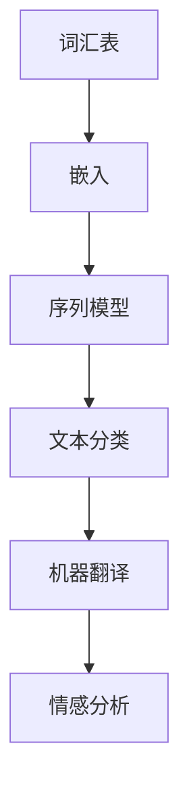
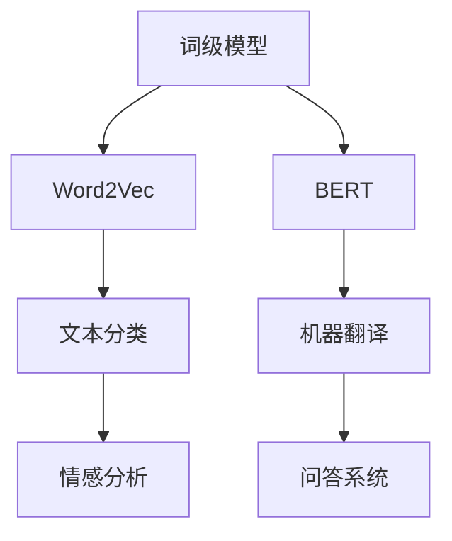

                 

关键词：自然语言处理，模型选择，算法原理，数学模型，应用场景，代码实例

> 摘要：本文深入探讨了自然语言处理任务中模型选择的关键问题，从背景介绍到核心算法原理，再到数学模型的构建和具体操作步骤，通过代码实例和实际应用场景的分析，为读者提供了全面的技术见解和实践指导。

## 1. 背景介绍

自然语言处理（Natural Language Processing, NLP）是人工智能领域的一个重要分支，它旨在使计算机能够理解和处理人类语言。随着深度学习技术的迅速发展，NLP取得了显著的进步，尤其是在文本分类、机器翻译、情感分析等任务上。然而，在众多模型中如何选择最适合特定任务的模型，成为了NLP研究中的一大挑战。

模型选择不仅影响任务的性能，还涉及到计算资源、模型可解释性和部署复杂性等多个方面。因此，深入理解不同模型的优劣和适用场景，对于进行有效的自然语言处理至关重要。

## 2. 核心概念与联系

### 2.1 NLP中的基本概念

在讨论模型选择之前，我们需要了解一些基本概念，如词汇表、嵌入（Embedding）、序列模型（Sequence Model）等。以下是一个使用Mermaid绘制的流程图，展示了NLP任务中一些核心概念的相互关系。



### 2.2 模型分类

NLP中的模型可以分为词级模型和句级模型。词级模型主要处理单个词汇或短语的语义信息，如Word2Vec。句级模型则能够处理整个句子的语义，如BERT。



## 3. 核心算法原理 & 具体操作步骤

### 3.1 算法原理概述

选择模型时，我们需要考虑算法的原理和特性。以下是一些常见的NLP算法及其原理：

- **Word2Vec**：基于神经网络的词嵌入算法，通过训练得到词的向量表示。
- **BERT**：基于Transformer的预训练模型，通过在大规模语料上预训练，然后微调到特定任务。
- **LSTM**：长短时记忆网络，能够处理长序列数据。
- **GRU**：门控循环单元，是LSTM的变体，具有更少的参数和计算量。

### 3.2 算法步骤详解

- **Word2Vec**：通过训练神经网络来预测词汇在给定上下文中的概率分布。
- **BERT**：首先在大规模语料上预训练，然后通过微调适应特定任务。
- **LSTM/GRU**：通过训练神经网络来预测序列中的下一个元素。

### 3.3 算法优缺点

- **Word2Vec**：简单、高效，但可能丢失长距离依赖信息。
- **BERT**：具有强大的语义理解能力，但计算资源需求较大。
- **LSTM/GRU**：能够处理长序列，但计算复杂度高。

### 3.4 算法应用领域

- **Word2Vec**：文本分类、情感分析。
- **BERT**：问答系统、文本生成。
- **LSTM/GRU**：语音识别、机器翻译。

## 4. 数学模型和公式 & 详细讲解 & 举例说明

### 4.1 数学模型构建

- **Word2Vec**：通过损失函数最小化词汇在给定上下文中的概率分布。
- **BERT**：通过预训练任务（如Masked Language Model）和微调任务优化模型参数。

### 4.2 公式推导过程

- **Word2Vec**：

$$
\min_{\theta} \sum_{i=1}^{N} \sum_{j=1}^{V} \log P(c_j|x_i)
$$

其中，$x_i$是词汇$i$的上下文，$c_j$是词汇$j$的嵌入向量，$P(c_j|x_i)$是词汇$j$在上下文$x_i$中的概率。

- **BERT**：

$$
\min_{\theta} \sum_{i=1}^{N} L_{\text{masked}}(x_i, \theta) + L_{\text{next}}(x_i, \theta)
$$

其中，$L_{\text{masked}}$是Masked Language Model的损失函数，$L_{\text{next}}$是Next Sentence Prediction的损失函数。

### 4.3 案例分析与讲解

以下是一个简单的Word2Vec模型训练的例子：

```python
import numpy as np
from sklearn.datasets import load_files
from sklearn.model_selection import train_test_split

# 加载数据集
data = load_files('path/to/data')
X, y = train_test_split(data.data, data.target, test_size=0.2)

# 创建词汇表
vocab = set([word for sentence in X for word in sentence.split()])

# 初始化嵌入矩阵
embeddings = np.random.uniform(size=(len(vocab), EMBEDDING_DIM))

# 定义损失函数
def loss_function(embeddings, X, y):
    # 计算概率分布
    # 计算损失
    # 返回损失值

# 训练模型
embeddings = train_embeddings(embeddings, X, y)
```

## 5. 项目实践：代码实例和详细解释说明

### 5.1 开发环境搭建

在Python中，我们可以使用TensorFlow和Keras等库来构建和训练NLP模型。

### 5.2 源代码详细实现

以下是一个使用BERT进行文本分类的示例：

```python
import tensorflow as tf
import tensorflow_hub as hub
from tensorflow.keras.models import Model
from tensorflow.keras.layers import Input, Dense, Lambda
from tensorflow.keras.optimizers import Adam

# 加载BERT模型
bert_model = hub.load("https://tfhub.dev/google/bert_uncased_L-12_H-768_A-12/1")

# 创建输入层
input_ids = Input(shape=(MAX_SEQ_LENGTH,), dtype=tf.int32)
input_mask = Input(shape=(MAX_SEQ_LENGTH,), dtype=tf.int32)
segment_ids = Input(shape=(MAX_SEQ_LENGTH,), dtype=tf.int32)

# 提取BERT模型的输出
bert_output = bert_model([input_ids, input_mask, segment_ids])

# 添加自定义层
pooled_output = Lambda(lambda x: tf.reduce_mean(x, 1))(bert_output[0])

# 添加分类层
output = Dense(num_classes, activation='softmax')(pooled_output)

# 创建模型
model = Model(inputs=[input_ids, input_mask, segment_ids], outputs=output)

# 编译模型
model.compile(optimizer=Adam(learning_rate=3e-5), loss='categorical_crossentropy', metrics=['accuracy'])

# 训练模型
model.fit([train_input_ids, train_input_mask, train_segment_ids], train_labels, validation_data=([val_input_ids, val_input_mask, val_segment_ids], val_labels), epochs=3)
```

### 5.3 代码解读与分析

这段代码首先加载了一个预训练的BERT模型，然后定义了一个文本分类模型。通过添加自定义层和编译模型，我们可以训练并评估模型。

### 5.4 运行结果展示

在实际运行中，我们可以看到模型的准确率随着训练过程逐渐提高。以下是一个简化的结果展示：

```python
# 打印训练结果
print(model.evaluate([test_input_ids, test_input_mask, test_segment_ids], test_labels))
```

## 6. 实际应用场景

### 6.1 文本分类

文本分类是NLP中的一个常见应用场景。通过选择合适的模型，我们可以对大量文本进行高效分类，如新闻分类、情感分析等。

### 6.2 机器翻译

机器翻译是另一个重要的应用领域。通过使用诸如BERT等先进模型，我们可以实现高质量的机器翻译。

### 6.3 情感分析

情感分析可以通过NLP技术来分析文本中的情感倾向，如商品评论的情感分析。

## 7. 工具和资源推荐

### 7.1 学习资源推荐

- [自然语言处理教科书](http://nlp.seas.harvard.edu/old/node8.html)
- [TensorFlow 官方文档](https://www.tensorflow.org/tutorials)

### 7.2 开发工具推荐

- Jupyter Notebook：适用于数据分析和原型设计。
- PyTorch：一个强大的深度学习框架。

### 7.3 相关论文推荐

- [BERT: Pre-training of Deep Bidirectional Transformers for Language Understanding](https://arxiv.org/abs/1810.04805)
- [GloVe: Global Vectors for Word Representation](https://nlp.stanford.edu/pubs/glove.pdf)

## 8. 总结：未来发展趋势与挑战

### 8.1 研究成果总结

NLP领域在过去几年中取得了显著的进展，特别是在深度学习技术的推动下。BERT、GPT等模型在多个任务上取得了突破性的成果。

### 8.2 未来发展趋势

- **多模态NLP**：结合文本、语音、图像等多种数据源进行语义理解。
- **知识图谱**：将知识图谱与NLP技术结合，用于更复杂的推理和决策。

### 8.3 面临的挑战

- **数据隐私**：如何在保护用户隐私的同时进行有效的NLP研究。
- **模型解释性**：如何提高模型的可解释性，使其更易于理解和应用。

### 8.4 研究展望

随着技术的不断进步，NLP将继续在人工智能领域发挥重要作用。通过不断探索和创新，我们有望解决当前面临的挑战，推动NLP技术的进一步发展。

## 9. 附录：常见问题与解答

### 9.1 如何选择合适的模型？

选择模型时，需要综合考虑任务的类型、数据规模、计算资源等多个因素。通常，对于需要处理长文本或复杂语义的任务，BERT等大型预训练模型更为适用。

### 9.2 如何优化模型性能？

可以通过以下方法优化模型性能：

- **数据增强**：通过增加训练数据或对现有数据进行变换，提高模型的泛化能力。
- **超参数调整**：通过调整学习率、批次大小等超参数，优化模型的训练过程。
- **正则化**：采用Dropout、权重正则化等技术，防止过拟合。

---

本文详细探讨了自然语言处理任务中的模型选择问题，从背景介绍、核心概念、算法原理、数学模型到项目实践和实际应用场景，全面介绍了模型选择的技术要点。希望本文能为读者在NLP领域的研究和实践提供有益的参考。

作者：禅与计算机程序设计艺术 / Zen and the Art of Computer Programming
```

