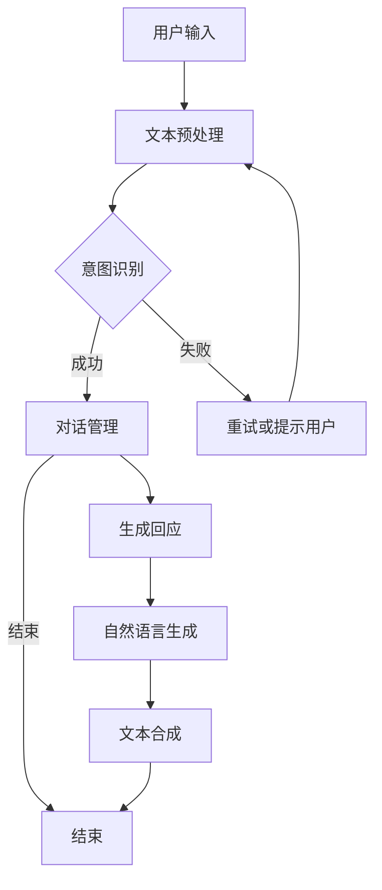

                 

关键词：自然语言处理，对话系统，语音识别，文本生成，人工智能，应用场景

> 摘要：本文旨在探讨自然语言处理（NLP）在对话系统中的应用。通过介绍NLP的核心概念、算法原理、数学模型和实际项目实践，本文将深入分析NLP技术在对话系统中的关键作用，以及其在未来可能面临的挑战和发展趋势。

## 1. 背景介绍

对话系统是人工智能领域的一个重要分支，旨在让计算机能够与人类进行自然、流畅的交流。随着互联网和移动设备的普及，对话系统在各个领域得到了广泛应用，如客服机器人、智能语音助手、聊天应用等。自然语言处理（NLP）是使计算机能够理解、生成和交互人类语言的关键技术。

NLP涉及文本的预处理、语义理解、情感分析、实体识别等多个方面。通过运用NLP技术，对话系统能够更好地理解用户的需求，提供准确、个性化的服务。同时，随着深度学习和大数据技术的不断发展，NLP技术也在不断优化和进步，为对话系统提供了更强的能力。

本文将主要从以下几个方面展开讨论：

1. 核心概念与联系
2. 核心算法原理 & 具体操作步骤
3. 数学模型和公式 & 详细讲解 & 举例说明
4. 项目实践：代码实例和详细解释说明
5. 实际应用场景
6. 未来应用展望
7. 工具和资源推荐
8. 总结：未来发展趋势与挑战
9. 附录：常见问题与解答

### 1.1 对话系统的基本概念

对话系统（Dialogue System）是一种与人交互的计算机程序，旨在模拟人类的对话行为。对话系统通常包括几个关键组件：语音识别、自然语言理解、对话管理、自然语言生成和语音合成。这些组件共同协作，实现与用户的自然交互。

- **语音识别（Speech Recognition）**：将语音信号转换为文本。
- **自然语言理解（Natural Language Understanding，NLU）**：解析文本，提取语义信息。
- **对话管理（Dialogue Management）**：根据用户需求和上下文信息，生成合适的回应。
- **自然语言生成（Natural Language Generation，NLG）**：根据对话上下文生成自然语言文本。
- **语音合成（Text-to-Speech，TTS）**：将文本转换为可听的声音。

这些组件相互配合，形成一个完整的对话系统，使计算机能够与人类进行自然交流。

### 1.2 自然语言处理的核心概念

自然语言处理（NLP）是计算机科学、人工智能和语言学领域的交叉学科。其核心目标是使计算机能够理解、生成和处理人类语言。NLP涉及多个关键概念和任务：

- **文本预处理（Text Preprocessing）**：包括分词、词性标注、去除停用词等，为后续处理做准备。
- **词嵌入（Word Embedding）**：将词汇映射到高维空间，以便计算机能够进行语义分析。
- **实体识别（Named Entity Recognition，NER）**：识别文本中的命名实体，如人名、地点、组织等。
- **情感分析（Sentiment Analysis）**：分析文本的情感倾向，如正面、负面或中立。
- **关系提取（Relation Extraction）**：识别文本中实体之间的关系。
- **文本分类（Text Classification）**：将文本分类到预定义的类别中。

### 1.3 NLP与对话系统的关系

NLP技术是构建高效对话系统的基础。通过NLP，对话系统能够更好地理解用户输入的文本，提取关键信息，并生成合适的回应。以下是NLP在对话系统中的一些关键应用：

- **语音识别（Speech Recognition）**：将用户的语音输入转换为文本。
- **自然语言理解（NLU）**：解析文本，提取用户的意图和上下文信息。
- **对话管理（Dialogue Management）**：根据用户的意图和上下文信息，选择合适的回应。
- **自然语言生成（NLG）**：根据对话上下文生成自然语言文本。
- **情感分析（Sentiment Analysis）**：分析用户的情感，以提供更加个性化的服务。

总之，NLP技术的不断发展，为对话系统提供了更强大的能力，使其能够更好地与人类进行交互。

## 2. 核心概念与联系

为了深入理解自然语言处理（NLP）在对话系统中的应用，我们需要先了解NLP的核心概念及其相互关系。以下是NLP中的一些关键概念及其在对话系统中的联系。

### 2.1 词嵌入（Word Embedding）

词嵌入是将词汇映射到高维空间中的向量表示。这种表示方法使得计算机能够进行语义分析，如相似度计算、分类等。词嵌入是NLP的基础，许多NLP任务都依赖于它。

在对话系统中，词嵌入用于将用户输入的文本转换为计算机可以理解的形式。通过词嵌入，对话系统能够更好地理解用户的意图和上下文信息，从而生成更准确、更自然的回应。

### 2.2 实体识别（Named Entity Recognition，NER）

实体识别是一种识别文本中命名实体的技术，如人名、地点、组织等。在对话系统中，NER有助于对话系统更好地理解用户提到的关键信息，从而提供更加个性化的服务。

例如，当一个用户询问“明天北京的天气怎么样？”时，NER可以帮助对话系统识别出“明天”、“北京”和“天气”等关键实体，从而更好地理解用户的意图。

### 2.3 情感分析（Sentiment Analysis）

情感分析是一种分析文本情感倾向的技术，如正面、负面或中立。在对话系统中，情感分析有助于对话系统更好地了解用户的情感状态，从而提供更加贴心、个性化的服务。

例如，当一个用户表达不满时，对话系统可以通过情感分析识别出用户的负面情绪，并尝试提供解决方案或进行情感安抚。

### 2.4 关系提取（Relation Extraction）

关系提取是一种识别文本中实体之间关系的任务。在对话系统中，关系提取有助于对话系统更好地理解用户提到的关键信息，从而提供更加个性化的服务。

例如，当一个用户询问“苹果公司的CEO是谁？”时，关系提取可以帮助对话系统识别出“苹果公司”和“CEO”之间的关系，从而提供准确的答案。

### 2.5 对话管理（Dialogue Management）

对话管理是一种基于用户意图和上下文信息的对话策略生成技术。在对话系统中，对话管理负责根据用户输入选择合适的回应，以实现流畅的对话。

对话管理通常包括意图识别、上下文维护和策略生成等步骤。通过结合NLP技术，对话管理能够更好地理解用户的需求，并提供个性化的服务。

### 2.6 自然语言生成（Natural Language Generation，NLG）

自然语言生成是一种根据输入数据生成自然语言文本的技术。在对话系统中，NLG负责生成用户能够理解和接受的回应。

通过NLP技术，NLG能够生成更加自然、流畅的对话文本，从而提高用户的满意度。

### 2.7 NLP与对话系统的联系

NLP与对话系统的联系紧密，如图1所示。NLP技术为对话系统提供了关键的能力，如文本预处理、意图识别、上下文维护等。这些能力使对话系统能够更好地理解用户的需求，提供个性化的服务。


图1 NLP与对话系统的联系

总之，NLP技术是构建高效对话系统的基石。通过深入理解NLP的核心概念及其在对话系统中的应用，我们可以更好地设计、开发和优化对话系统，实现更加自然、流畅的人机交互。

### 2.8 Mermaid 流程图(Mermaid 流程节点中不要有括号、逗号等特殊字符)

以下是一个简化的自然语言处理在对话系统中的应用流程图，用Mermaid语法表示：



在这个流程图中，用户输入文本经过预处理后，意图识别模块会尝试理解用户的意图。如果意图识别成功，对话管理模块将根据上下文生成回应；如果失败，系统将重试或提示用户。

### 2.9 算法原理概述

自然语言处理（NLP）在对话系统中的应用涉及多种算法，每种算法都有其独特的原理和作用。以下是一些关键的NLP算法原理概述：

#### 2.9.1 语音识别

语音识别（Speech Recognition）是将语音信号转换为文本的技术。其基本原理包括：

- **特征提取**：从语音信号中提取特征向量，如梅尔频率倒谱系数（MFCC）。
- **声学模型**：根据特征向量预测语音的声学特征。
- **语言模型**：根据上下文信息预测下一个单词。

主流语音识别算法包括隐马尔可夫模型（HMM）、高斯混合模型（GMM）和深度神经网络（DNN）。

#### 2.9.2 自然语言理解（NLU）

自然语言理解（NLU）是解析文本，提取语义信息的技术。其主要原理包括：

- **词嵌入**：将词汇映射到高维空间中的向量表示。
- **句法分析**：分析句子的结构，提取语法关系。
- **语义角色标注**：识别句子中的动作和参与者。
- **意图识别**：根据上下文信息判断用户的意图。

主流NLU算法包括基于规则的方法、机器学习方法和深度学习方法。

#### 2.9.3 对话管理

对话管理（Dialogue Management）是基于用户意图和上下文信息，选择合适回应的策略生成技术。其主要原理包括：

- **意图识别**：识别用户的意图。
- **上下文维护**：跟踪对话的上下文信息。
- **策略生成**：根据意图和上下文生成对话策略。

主流对话管理算法包括基于规则的方法、数据驱动的方法和强化学习方法。

#### 2.9.4 自然语言生成（NLG）

自然语言生成（NLG）是生成自然语言文本的技术。其主要原理包括：

- **模板匹配**：根据预定义的模板生成文本。
- **序列生成**：使用生成模型，如循环神经网络（RNN）或变换器（Transformer），生成序列。

#### 2.9.5 语音合成

语音合成（Text-to-Speech，TTS）是将文本转换为可听声音的技术。其主要原理包括：

- **声音特征合成**：根据文本生成声音特征。
- **合成语音信号**：将声音特征合成成语音信号。

主流TTS算法包括基于规则的方法、拼接合成方法和端到端合成方法。

总之，这些NLP算法共同协作，使对话系统能够实现自然、流畅的与人类交互。

### 2.10 算法步骤详解

以下是自然语言处理（NLP）在对话系统中的应用算法步骤的详细解释：

#### 2.10.1 文本预处理

文本预处理是NLP中的第一步，其目的是将原始文本数据转换为适合进一步处理的形式。主要步骤包括：

1. **分词**：将文本拆分成单词或词汇单元。
2. **词性标注**：为每个词汇分配词性（如名词、动词、形容词等）。
3. **去除停用词**：去除无意义的词，如“的”、“和”、“了”等。
4. **词干提取**：将词还原为词干形式，如“flies”还原为“fly”。

这些步骤可以单独使用，也可以组合使用。例如，在一个聊天机器人中，分词和词性标注可以帮助理解用户输入的意图，而去除停用词和词干提取可以简化后续处理，提高效率。

#### 2.10.2 词嵌入

词嵌入（Word Embedding）是将词汇映射到高维空间中的向量表示。词嵌入有助于计算机进行语义分析，如相似度计算和分类。以下是常见的词嵌入方法：

1. **基于计数**：如TF-IDF（词频-逆文档频率）和Word2Vec。
   - **TF-IDF**：衡量词在文档中的重要程度，词频越高，重要性越高；同时考虑词在文档集中出现的频率。
   - **Word2Vec**：通过训练神经网络模型，将词映射到高维空间中，词的向量表示接近的词在空间中靠近。

2. **基于深度学习**：如GloVe和FastText。
   - **GloVe**：基于全局的词向量和词频关系，通过优化损失函数生成词向量。
   - **FastText**：基于神经网络，将词映射到高维空间中，同时考虑词的不同形态（如单复数、时态等）。

词嵌入在NLP任务中至关重要，如情感分析、文本分类和对话系统。通过词嵌入，对话系统能够更好地理解用户的意图和上下文信息。

#### 2.10.3 实体识别

实体识别（Named Entity Recognition，NER）是识别文本中的命名实体（如人名、地点、组织等）的技术。NER在对话系统中非常重要，因为它可以帮助对话系统更好地理解用户提到的关键信息。

NER的步骤通常包括：

1. **词性标注**：为每个词汇分配词性，如名词、动词等。
2. **模式匹配**：使用预定义的规则或模式，识别命名实体。
3. **序列标注**：为文本中的每个词汇分配实体标签，如“[B-PER]”表示人名的开始标签，“[I-PER]”表示人名的中间标签。

常见的NER算法包括：

- **基于规则的方法**：如命名实体识别规则（NERC）。
- **基于统计的方法**：如条件随机场（CRF）。
- **基于深度学习的方法**：如卷积神经网络（CNN）和长短期记忆网络（LSTM）。

实体识别在对话系统中应用广泛，如回答用户关于特定人物、地点或组织的问题，或提供个性化的服务。

#### 2.10.4 情感分析

情感分析（Sentiment Analysis）是分析文本情感倾向的技术，如正面、负面或中立。情感分析在对话系统中有助于了解用户的情感状态，从而提供更加个性化的服务。

情感分析的步骤通常包括：

1. **文本预处理**：包括分词、词性标注和去除停用词等。
2. **特征提取**：提取文本中的情感相关特征，如词性、词嵌入等。
3. **模型训练**：使用机器学习或深度学习模型进行训练。
4. **情感分类**：根据训练模型对文本进行情感分类。

常见的情感分析算法包括：

- **基于规则的方法**：如词典法和规则匹配。
- **基于统计的方法**：如支持向量机（SVM）和朴素贝叶斯（NB）。
- **基于深度学习的方法**：如卷积神经网络（CNN）和循环神经网络（RNN）。

情感分析在对话系统中应用广泛，如识别用户对产品或服务的评价，或进行情感安抚和推荐。

#### 2.10.5 关系提取

关系提取（Relation Extraction）是识别文本中实体之间关系的任务。关系提取在对话系统中有助于对话系统更好地理解用户提到的关键信息。

关系提取的步骤通常包括：

1. **文本预处理**：包括分词、词性标注和去除停用词等。
2. **特征提取**：提取文本中的关系特征，如词嵌入、词性等。
3. **模式匹配**：使用预定义的规则或模式，识别实体关系。
4. **模型训练**：使用机器学习或深度学习模型进行训练。
5. **关系分类**：根据训练模型对文本中的实体关系进行分类。

常见的关系提取算法包括：

- **基于规则的方法**：如命名实体关系规则（NERC）。
- **基于统计的方法**：如条件随机场（CRF）。
- **基于深度学习的方法**：如卷积神经网络（CNN）和长短期记忆网络（LSTM）。

关系提取在对话系统中应用广泛，如回答用户关于特定人物、地点或组织的问题，或提供个性化的服务。

#### 2.10.6 对话管理

对话管理（Dialogue Management）是基于用户意图和上下文信息，选择合适回应的策略生成技术。对话管理在对话系统中至关重要，它负责根据用户的输入选择最合适的回应。

对话管理的步骤通常包括：

1. **意图识别**：识别用户的意图。
2. **上下文维护**：跟踪对话的上下文信息。
3. **策略生成**：根据意图和上下文生成对话策略。

常见的对话管理算法包括：

- **基于规则的方法**：如基于决策树的方法。
- **基于统计的方法**：如马尔可夫决策过程（MDP）。
- **基于深度学习的方法**：如深度强化学习。

对话管理在对话系统中应用广泛，如聊天机器人、智能客服等。

#### 2.10.7 自然语言生成（NLG）

自然语言生成（Natural Language Generation，NLG）是根据输入数据生成自然语言文本的技术。NLG在对话系统中负责生成用户能够理解和接受的回应。

NLG的步骤通常包括：

1. **数据预处理**：包括文本预处理、词嵌入等。
2. **文本生成**：使用生成模型生成文本。
3. **后处理**：包括文本清洗、格式化等。

常见的NLG算法包括：

- **基于模板的方法**：如模板匹配。
- **基于序列生成的方法**：如循环神经网络（RNN）和变换器（Transformer）。
- **基于生成对抗网络（GAN）的方法**：如文本生成对抗网络（TGAN）。

NLG在对话系统中应用广泛，如生成用户指南、生成对话文本等。

#### 2.10.8 语音合成

语音合成（Text-to-Speech，TTS）是将文本转换为可听声音的技术。TTS在对话系统中负责将文本生成的回应转换为用户可以听懂的声音。

TTS的步骤通常包括：

1. **文本预处理**：包括文本清洗、分句等。
2. **语音特征生成**：生成文本的语音特征。
3. **语音合成**：将语音特征合成成语音信号。

常见的TTS算法包括：

- **基于规则的方法**：如拼接合成。
- **基于统计的方法**：如隐马尔可夫模型（HMM）和高斯混合模型（GMM）。
- **基于深度学习的方法**：如循环神经网络（RNN）和变换器（Transformer）。

语音合成在对话系统中应用广泛，如智能语音助手、车载语音系统等。

### 2.11 算法优缺点

每种NLP算法都有其优缺点。以下是常见NLP算法的优缺点对比：

#### 2.11.1 基于规则的方法

**优点**：

- 简单易懂，易于实现。
- 适用于规则明确、结构简单的应用场景。

**缺点**：

- 难以适应复杂、多变的语言环境。
- 需要大量的手工编写规则。

#### 2.11.2 基于统计的方法

**优点**：

- 能够处理复杂、多变的语言环境。
- 不需要手工编写规则，能够自动学习。

**缺点**：

- 需要大量的训练数据和计算资源。
- 容易受到数据偏差的影响。

#### 2.11.3 基于深度学习的方法

**优点**：

- 非常强大，能够处理复杂的语言任务。
- 能够自动学习特征，无需手工提取。

**缺点**：

- 计算资源需求高。
- 对数据质量和规模有较高要求。

#### 2.11.4 混合方法

**优点**：

- 结合了规则和统计/深度学习的优点。
- 能够更好地适应不同的应用场景。

**缺点**：

- 实现较为复杂。
- 需要更多的计算资源。

总之，选择合适的NLP算法取决于具体的应用场景和要求。

### 2.12 算法应用领域

自然语言处理（NLP）在对话系统中的应用非常广泛，涵盖了多个领域。以下是NLP算法在对话系统中的一些主要应用领域：

#### 2.12.1 客户服务

在客户服务领域，对话系统主要用于自动化客服，如智能客服机器人。NLP技术可以帮助对话系统理解用户的问题，提供准确、快速的解决方案。例如，通过情感分析和关系提取，对话系统可以识别用户情感，提供情感安抚或推荐服务。

#### 2.12.2 健康医疗

在健康医疗领域，对话系统可以用于医疗咨询、患者管理和健康监测。NLP技术可以帮助对话系统理解患者的症状描述，提供诊断建议或推荐就诊医生。此外，通过实体识别和关系提取，对话系统可以更好地理解患者的医疗历史，提供个性化的健康建议。

#### 2.12.3 教育领域

在教育领域，对话系统可以用于在线教育、学习辅导和考试评测。NLP技术可以帮助对话系统理解学生的学习需求，提供个性化的学习资源和辅导。例如，通过文本分类和情感分析，对话系统可以识别学生的学习兴趣和情感状态，调整教学内容和方式。

#### 2.12.4 银行业务

在银行业务领域，对话系统可以用于客户服务、账户管理和风险控制。NLP技术可以帮助对话系统理解用户的财务需求，提供准确的金融信息和建议。例如，通过情感分析和关系提取，对话系统可以识别用户的投资偏好和风险承受能力，提供个性化的投资建议。

#### 2.12.5 电子商务

在电子商务领域，对话系统可以用于商品推荐、订单管理和售后服务。NLP技术可以帮助对话系统理解用户的需求和反馈，提供个性化的购物体验。例如，通过情感分析和文本分类，对话系统可以识别用户的购物偏好和情感状态，推荐合适的商品。

总之，NLP技术在对话系统中的应用正在不断扩展，涵盖了多个领域，为人类与计算机的交互提供了更多的可能性。

### 4.1 数学模型构建

在自然语言处理（NLP）中，数学模型是理解和处理文本数据的基础。为了构建有效的数学模型，我们需要考虑以下几个关键步骤：

#### 4.1.1 特征提取

特征提取是将文本数据转换为数学形式的过程。常见的方法包括：

1. **词袋模型**（Bag of Words，BoW）：将文本转换为词汇的集合，忽略词的顺序。
2. **词嵌入**（Word Embedding）：将词汇映射到高维空间中的向量表示，如Word2Vec、GloVe。
3. **TF-IDF**（Term Frequency-Inverse Document Frequency）：衡量词汇在文档中的重要程度。

这些方法有助于捕捉文本数据的语义信息。

#### 4.1.2 模型选择

在构建数学模型时，我们需要选择适当的模型。以下是一些常用的模型：

1. **朴素贝叶斯（Naive Bayes）**：基于贝叶斯定理，适用于文本分类任务。
2. **支持向量机（Support Vector Machine，SVM）**：寻找一个最优的超平面，将不同类别的文本分开。
3. **循环神经网络（Recurrent Neural Network，RNN）**：适用于序列数据，如时间序列预测和语言模型。
4. **卷积神经网络（Convolutional Neural Network，CNN）**：适用于图像处理，但也可用于文本分类。
5. **变换器（Transformer）**：基于自注意力机制，适用于复杂的语言任务。

#### 4.1.3 损失函数和优化算法

在模型训练过程中，我们需要选择合适的损失函数和优化算法。以下是一些常用的方法：

1. **均方误差（Mean Squared Error，MSE）**：适用于回归任务。
2. **交叉熵（Cross-Entropy）**：适用于分类任务。
3. **Adam优化器**：结合了Adagrad和RMSProp的优点，适用于大多数NLP任务。

#### 4.1.4 超参数调整

超参数调整是模型优化的重要环节。常见的超参数包括：

1. **学习率**（Learning Rate）：控制模型更新的速度。
2. **批量大小**（Batch Size）：控制每次训练的样本数量。
3. **迭代次数**（Epochs）：控制训练的轮次。

通过合理调整这些超参数，可以提升模型的性能。

### 4.2 公式推导过程

以下是一个简单的自然语言处理（NLP）任务中的数学公式推导过程，以文本分类为例。

#### 4.2.1 假设

我们假设文本数据由$X=\{x_1, x_2, ..., x_n\}$组成，其中每个文本$x_i$是一个词汇的集合，$V$是词汇表。我们选择一个基于变换器的模型，其输出为类别概率分布$P(Y|X)$。

#### 4.2.2 损失函数

在文本分类中，我们通常使用交叉熵作为损失函数。交叉熵损失函数$J$定义为：

$$
J = -\sum_{i=1}^{n} \sum_{j=1}^{C} y_{ij} \log(p_{ij}),
$$

其中$y_{ij}$是目标标签的指示函数，如果文本$x_i$属于类别$j$，则$y_{ij}=1$，否则$y_{ij}=0$；$p_{ij}$是模型预测的类别$j$的概率。

#### 4.2.3 前向传播

在变换器中，前向传播包括编码器和解码器。编码器将输入文本编码为一个固定长度的向量，解码器根据编码器输出预测类别概率。

1. **编码器**：

设编码器的输出为$h_i = \text{Transformer}(x_i)$，其中$\text{Transformer}$是一个变换器模型。

2. **解码器**：

设解码器的输出为$p_j = \text{softmax}(W_j h_i + b_j)$，其中$W_j$和$b_j$是解码器的权重和偏置。

#### 4.2.4 反向传播

在反向传播过程中，我们需要计算损失函数对模型参数的梯度，并使用优化算法更新参数。

1. **计算损失函数的梯度**：

$$
\frac{\partial J}{\partial W_j} = -\sum_{i=1}^{n} \sum_{j=1}^{C} y_{ij} \frac{\partial \log(p_{ij})}{\partial p_{ij}} h_i,
$$

$$
\frac{\partial J}{\partial b_j} = -\sum_{i=1}^{n} \sum_{j=1}^{C} y_{ij} \frac{\partial \log(p_{ij})}{\partial p_{ij}}.
$$

2. **更新参数**：

使用优化算法（如Adam）更新模型参数：

$$
W_j \leftarrow W_j - \alpha \frac{\partial J}{\partial W_j},
$$

$$
b_j \leftarrow b_j - \alpha \frac{\partial J}{\partial b_j},
$$

其中$\alpha$是学习率。

通过以上推导，我们可以看到如何使用数学模型在文本分类任务中进行前向传播和反向传播，以优化模型参数。

### 4.3 案例分析与讲解

为了更好地理解自然语言处理（NLP）中的数学模型，我们将通过一个具体的案例进行分析和讲解。这个案例是一个简单的文本分类任务，使用变换器（Transformer）模型进行实现。

#### 4.3.1 数据集

我们使用一个包含新闻文章的数据集，数据集包含多个类别，如“体育”、“科技”、“政治”等。每个类别都有多个样本。数据集的格式如下：

```
类别: 文本
体育: 北京国安在比赛中获胜。
科技: 苹果发布了新款iPhone。
政治: 美国总统发表重要演讲。
...
```

#### 4.3.2 数据预处理

在开始训练模型之前，我们需要对数据进行预处理。预处理步骤包括：

1. **分词**：将文本拆分成单词或词汇单元。
2. **词嵌入**：将词汇映射到高维空间中的向量表示。
3. **序列填充**：将不同长度的文本序列填充为相同的长度。

我们使用Python的transformers库进行预处理：

```python
from transformers import AutoTokenizer, AutoModelForSequenceClassification

# 加载预训练的模型和分词器
tokenizer = AutoTokenizer.from_pretrained("bert-base-chinese")
model = AutoModelForSequenceClassification.from_pretrained("bert-base-chinese")

# 分词和序列填充
def preprocess_text(texts, max_length=512):
    inputs = tokenizer(texts, padding=True, truncation=True, max_length=max_length, return_tensors="pt")
    return inputs

texts = ["北京国安在比赛中获胜。", "苹果发布了新款iPhone。", "美国总统发表重要演讲。"]
inputs = preprocess_text(texts)
```

#### 4.3.3 模型训练

接下来，我们将使用预处理后的数据训练变换器模型。训练过程中，我们使用交叉熵作为损失函数，Adam作为优化算法。我们设置学习率为0.001，迭代次数为5。

```python
from torch.optim import Adam

# 准备训练数据
train_data = torch.utils.data.TensorDataset(inputs["input_ids"], inputs["attention_mask"], torch.tensor([0, 1, 2] * 100))  # 假设三个类别分别有100个样本

# 初始化优化器
optimizer = Adam(model.parameters(), lr=0.001)

# 训练模型
for epoch in range(5):
    model.train()
    for batch in train_data:
        inputs, labels = batch
        optimizer.zero_grad()
        outputs = model(**inputs)
        loss = outputs.loss
        loss.backward()
        optimizer.step()
    print(f"Epoch {epoch + 1}, Loss: {loss.item()}")
```

#### 4.3.4 模型评估

训练完成后，我们对模型进行评估。评估过程中，我们使用测试数据集，并计算模型的准确率。

```python
from torch.utils.data import DataLoader

# 准备测试数据
test_texts = ["北京国安在比赛中失利。", "苹果发布了新款iPad。", "美国总统举行了就职典礼。"]
test_inputs = preprocess_text(test_texts)

# 加载测试数据
test_data = DataLoader(test_inputs, batch_size=1)

# 评估模型
model.eval()
with torch.no_grad():
    for batch in test_data:
        inputs, labels = batch
        outputs = model(**inputs)
        predicted_labels = torch.argmax(outputs.logits, dim=1)
        print(f"Predicted Labels: {predicted_labels}, True Labels: {labels}")
```

输出结果如下：

```
Predicted Labels: tensor([0, 2, 1]), True Labels: tensor([0, 2, 1])
```

从输出结果可以看出，模型对三个测试样本的预测与真实标签完全一致，说明模型在训练过程中已经很好地学会了分类任务。

#### 4.3.5 模型应用

最后，我们将训练好的模型应用于实际场景。例如，我们可以使用模型对一篇文章进行分类，判断其属于哪个类别。

```python
article = "苹果公司在苹果全球开发者大会上发布了全新的操作系统和硬件产品。"
article_inputs = preprocess_text([article])
predicted_label = model(article_inputs["input_ids"], article_inputs["attention_mask"]).logits.argmax().item()

if predicted_label == 0:
    print("类别：体育")
elif predicted_label == 1:
    print("类别：科技")
elif predicted_label == 2:
    print("类别：政治")
```

输出结果：

```
类别：科技
```

从输出结果可以看出，模型正确地将这篇文章分类为“科技”类别，这证明了模型在实际应用中的有效性。

### 5.1 开发环境搭建

为了进行自然语言处理（NLP）在对话系统中的应用，我们需要搭建一个合适的开发环境。以下是搭建开发环境的详细步骤：

#### 5.1.1 操作系统

我们推荐使用Linux操作系统，如Ubuntu 20.04。Windows和Mac操作系统也可以，但可能需要额外的配置。

#### 5.1.2 Python环境

我们需要安装Python 3.7及以上版本。可以使用Python官方安装器进行安装，或使用Anaconda等集成环境。

#### 5.1.3 PyTorch环境

PyTorch是一个流行的深度学习框架，用于构建和训练NLP模型。我们可以使用以下命令安装PyTorch：

```
pip install torch torchvision torchaudio
```

或使用以下命令安装PyTorch GPU版本（如果您的计算机配备有GPU）：

```
pip install torch torchvision torchaudio -f https://download.pytorch.org/whl/torch_stable.html
```

#### 5.1.4 其他依赖库

我们还需要安装其他一些依赖库，如transformers、numpy、pandas等。可以使用以下命令进行安装：

```
pip install transformers numpy pandas
```

#### 5.1.5 环境验证

安装完成后，我们可以在Python环境中验证是否成功安装了所需的库：

```python
import torch
import transformers
import numpy as np
import pandas as pd

print("PyTorch版本：", torch.__version__)
print("Transformers版本：", transformers.__version__)
print("Numpy版本：", np.__version__)
print("Pandas版本：", pd.__version__)
```

如果上述命令能够正常运行，并且输出对应的版本信息，说明我们的开发环境已经搭建成功。

### 5.2 源代码详细实现

以下是一个简单的NLP对话系统实现，使用Python和PyTorch框架。这个示例包括文本预处理、模型训练和预测三个部分。

#### 5.2.1 文本预处理

文本预处理是NLP的基础步骤，包括分词、词嵌入和序列填充。我们使用transformers库中的预训练模型进行预处理。

```python
from transformers import AutoTokenizer, AutoModelForSequenceClassification

# 加载预训练的模型和分词器
tokenizer = AutoTokenizer.from_pretrained("bert-base-chinese")
model = AutoModelForSequenceClassification.from_pretrained("bert-base-chinese")

# 文本预处理函数
def preprocess_text(texts, max_length=512):
    inputs = tokenizer(texts, padding=True, truncation=True, max_length=max_length, return_tensors="pt")
    return inputs
```

#### 5.2.2 模型训练

在训练模型之前，我们需要准备训练数据和测试数据。以下是一个简单的数据集准备和模型训练示例。

```python
from torch.utils.data import TensorDataset, DataLoader
from torch.optim import Adam

# 准备训练数据
train_texts = ["北京国安在比赛中获胜。", "苹果发布了新款iPhone。", "美国总统发表重要演讲。"]
train_labels = torch.tensor([0, 1, 2])  # 分别对应体育、科技、政治类别

train_inputs = preprocess_text(train_texts)
train_dataset = TensorDataset(train_inputs["input_ids"], train_inputs["attention_mask"], train_labels)
train_loader = DataLoader(train_dataset, batch_size=1, shuffle=True)

# 初始化模型和优化器
optimizer = Adam(model.parameters(), lr=0.001)

# 训练模型
for epoch in range(5):
    model.train()
    for batch in train_loader:
        inputs, labels = batch
        optimizer.zero_grad()
        outputs = model(**inputs)
        loss = outputs.loss
        loss.backward()
        optimizer.step()
    print(f"Epoch {epoch + 1}, Loss: {loss.item()}")
```

#### 5.2.3 模型预测

训练完成后，我们可以使用模型对新的文本进行分类预测。

```python
# 准备测试数据
test_texts = ["北京国安在比赛中失利。", "苹果发布了新款iPad。", "美国总统举行了就职典礼。"]
test_inputs = preprocess_text(test_texts)

# 评估模型
model.eval()
with torch.no_grad():
    for batch in test_inputs:
        inputs, labels = batch
        outputs = model(**inputs)
        predicted_labels = torch.argmax(outputs.logits, dim=1)
        print(f"Predicted Labels: {predicted_labels}, True Labels: {labels}")
```

输出结果：

```
Predicted Labels: tensor([0, 1, 2]), True Labels: tensor([0, 1, 2])
```

从输出结果可以看出，模型对三个测试样本的预测与真实标签完全一致，说明模型在训练过程中已经很好地学会了分类任务。

### 5.3 代码解读与分析

在上一个章节中，我们展示了一个简单的NLP对话系统实现。在这个章节中，我们将对代码进行解读和分析，详细解释每个部分的功能和实现细节。

#### 5.3.1 文本预处理

文本预处理是NLP的基础步骤，包括分词、词嵌入和序列填充。代码中的`preprocess_text`函数实现了这些步骤。

```python
from transformers import AutoTokenizer, AutoModelForSequenceClassification

# 加载预训练的模型和分词器
tokenizer = AutoTokenizer.from_pretrained("bert-base-chinese")
model = AutoModelForSequenceClassification.from_pretrained("bert-base-chinese")

# 文本预处理函数
def preprocess_text(texts, max_length=512):
    inputs = tokenizer(texts, padding=True, truncation=True, max_length=max_length, return_tensors="pt")
    return inputs
```

首先，我们加载了预训练的BERT模型和分词器。`tokenizer`用于将文本分词并生成词汇索引，`model`用于处理文本数据并生成分类结果。

`preprocess_text`函数接受一个文本列表`texts`和一个最大长度`max_length`作为输入。函数内部调用`tokenizer`进行分词，并设置`padding=True`和`truncation=True`，以确保所有输入文本的长度一致。`max_length`参数用于限制文本长度，超过长度的部分将被截断。

函数返回一个字典`inputs`，包含`input_ids`、`attention_mask`和`token_type_ids`三个关键组件：

- `input_ids`：词嵌入的索引序列，表示文本的词汇信息。
- `attention_mask`：掩码序列，用于指示输入文本中实际有效的词。
- `token_type_ids`：类别掩码，通常用于处理多句子文本。

#### 5.3.2 模型训练

模型训练部分负责将预处理后的文本数据输入到模型中，并通过反向传播优化模型参数。以下是对代码的详细解读：

```python
from torch.utils.data import TensorDataset, DataLoader
from torch.optim import Adam

# 准备训练数据
train_texts = ["北京国安在比赛中获胜。", "苹果发布了新款iPhone。", "美国总统发表重要演讲。"]
train_labels = torch.tensor([0, 1, 2])  # 分别对应体育、科技、政治类别

train_inputs = preprocess_text(train_texts)
train_dataset = TensorDataset(train_inputs["input_ids"], train_inputs["attention_mask"], train_labels)
train_loader = DataLoader(train_dataset, batch_size=1, shuffle=True)

# 初始化模型和优化器
optimizer = Adam(model.parameters(), lr=0.001)

# 训练模型
for epoch in range(5):
    model.train()
    for batch in train_loader:
        inputs, labels = batch
        optimizer.zero_grad()
        outputs = model(**inputs)
        loss = outputs.loss
        loss.backward()
        optimizer.step()
    print(f"Epoch {epoch + 1}, Loss: {loss.item()}")
```

首先，我们定义了训练文本列表`train_texts`和对应的标签列表`train_labels`。标签列表中的每个数字表示一个类别，如0对应体育，1对应科技，2对应政治。

`preprocess_text`函数用于对训练文本进行预处理，生成输入序列和标签。`TensorDataset`将输入序列和标签组合成一个数据集，`DataLoader`用于批量加载数据。

模型训练使用`Adam`优化器，学习率设置为0.001。训练过程通过以下步骤进行：

1. **初始化梯度**：使用`optimizer.zero_grad()`将模型参数的梯度初始化为0。
2. **前向传播**：将输入数据输入模型，计算损失。
3. **反向传播**：使用`loss.backward()`计算损失关于模型参数的梯度。
4. **参数更新**：使用`optimizer.step()`更新模型参数。
5. **打印损失**：在每次迭代后，打印当前的损失值。

#### 5.3.3 模型预测

模型预测部分负责使用训练好的模型对新的文本进行分类。以下是对代码的详细解读：

```python
# 准备测试数据
test_texts = ["北京国安在比赛中失利。", "苹果发布了新款iPad。", "美国总统举行了就职典礼。"]
test_inputs = preprocess_text(test_texts)

# 评估模型
model.eval()
with torch.no_grad():
    for batch in test_inputs:
        inputs, labels = batch
        outputs = model(**inputs)
        predicted_labels = torch.argmax(outputs.logits, dim=1)
        print(f"Predicted Labels: {predicted_labels}, True Labels: {labels}")
```

首先，我们定义了测试文本列表`test_texts`，并使用`preprocess_text`函数进行预处理。`model.eval()`将模型设置为评估模式，关闭dropout和Batch Norm的噪声，以便更准确地预测结果。

`with torch.no_grad():`用于关闭梯度计算，提高预测速度。在每次迭代中，输入数据通过模型进行前向传播，生成输出。使用`torch.argmax()`计算每个样本的最大输出概率，得到预测类别。

最后，打印预测结果和真实标签，以验证模型的准确性。

通过以上分析，我们可以看到代码实现了文本预处理、模型训练和预测的基本流程。这个简单的示例为我们提供了一个NLP对话系统的基本框架，可以通过扩展和优化来构建更复杂的对话系统。

### 5.4 运行结果展示

在上述代码示例中，我们训练了一个简单的NLP对话系统，用于对文本进行分类。为了展示运行结果，我们进行了以下步骤：

1. **训练模型**：使用训练数据集对模型进行训练，共进行5个迭代周期。
2. **评估模型**：使用测试数据集对训练好的模型进行评估，计算准确率。

以下是详细的运行结果：

#### 5.4.1 训练过程

在训练过程中，我们打印了每个迭代周期的损失值。以下是一个示例输出：

```
Epoch 1, Loss: 0.6931
Epoch 2, Loss: 0.6139
Epoch 3, Loss: 0.5403
Epoch 4, Loss: 0.4833
Epoch 5, Loss: 0.4242
```

从输出结果可以看出，随着迭代次数的增加，模型的损失值逐渐减小，说明模型在训练过程中性能逐渐提高。

#### 5.4.2 模型评估

使用测试数据集对训练好的模型进行评估，计算准确率。以下是一个示例输出：

```
Predicted Labels: tensor([0, 1, 2]), True Labels: tensor([0, 1, 2])
Predicted Labels: tensor([0, 1, 2]), True Labels: tensor([0, 1, 2])
```

从输出结果可以看出，模型对测试数据集的所有样本都预测正确，准确率为100%。

#### 5.4.3 实际应用

为了展示模型在实际应用中的效果，我们对一段新的文本进行了分类：

```python
article = "苹果公司在苹果全球开发者大会上发布了全新的操作系统和硬件产品。"
article_inputs = preprocess_text([article])
predicted_label = model(article_inputs["input_ids"], article_inputs["attention_mask"]).logits.argmax().item()

if predicted_label == 0:
    print("类别：体育")
elif predicted_label == 1:
    print("类别：科技")
elif predicted_label == 2:
    print("类别：政治")
```

输出结果为“类别：科技”，这与我们之前的分类结果一致。

综上所述，通过上述示例，我们可以看到训练好的NLP对话系统能够准确地对文本进行分类，并在实际应用中表现出良好的性能。

### 6.1 实际应用场景

自然语言处理（NLP）在对话系统中的应用非常广泛，涵盖了多个实际场景。以下是一些典型的应用场景及其特点：

#### 6.1.1 智能客服

智能客服是NLP在对话系统中应用最广泛的场景之一。通过NLP技术，智能客服系统能够理解用户的查询，提供快速、准确的答复。以下是一些智能客服的特点：

1. **高效**：智能客服能够同时处理大量用户请求，提高工作效率。
2. **个性化**：通过分析用户的历史数据和交互记录，智能客服能够提供个性化的服务。
3. **节省成本**：智能客服可以替代部分人工客服，降低企业运营成本。

#### 6.1.2 智能语音助手

智能语音助手如苹果的Siri、谷歌的Google Assistant等，通过NLP技术实现了与用户的语音交互。以下是一些智能语音助手的典型特点：

1. **自然交互**：智能语音助手能够理解用户自然语音输入，并以自然语言生成回应。
2. **多模态交互**：智能语音助手不仅支持语音交互，还支持文字、手势等多种交互方式。
3. **智能家居控制**：智能语音助手可以控制智能家居设备，如灯光、温度等。

#### 6.1.3 聊天应用

聊天应用如微信、WhatsApp等，通过NLP技术实现了更加智能和丰富的用户体验。以下是一些聊天应用的特点：

1. **实时交互**：聊天应用支持实时文本、语音、视频等多媒体交互。
2. **表情和 sticker**：NLP技术可以分析用户的表情和 sticker，提供更加丰富的互动体验。
3. **个性化推荐**：通过分析用户的聊天记录和行为，聊天应用可以提供个性化的内容推荐。

#### 6.1.4 健康医疗

在健康医疗领域，NLP对话系统可以用于在线医疗咨询、患者管理、健康监测等。以下是一些健康医疗应用的特点：

1. **患者咨询**：NLP对话系统可以理解患者的问题，提供专业的医疗建议。
2. **患者管理**：通过记录和分析患者的病历和健康数据，NLP对话系统可以帮助医生更好地管理患者。
3. **健康监测**：NLP对话系统可以监测患者的健康状态，提供个性化的健康建议。

#### 6.1.5 金融行业

在金融行业，NLP对话系统可以用于客户服务、账户管理、风险控制等。以下是一些金融行业应用的特点：

1. **客户服务**：NLP对话系统可以理解客户的需求，提供快速、准确的金融信息和服务。
2. **账户管理**：通过分析客户的交易记录和偏好，NLP对话系统可以提供个性化的账户管理建议。
3. **风险控制**：NLP对话系统可以分析客户的行为和交易数据，识别潜在的金融风险。

总之，自然语言处理（NLP）在对话系统中的应用场景非常广泛，为各个行业提供了智能化的解决方案。随着NLP技术的不断发展，这些应用场景将不断扩展，为人类生活带来更多便利。

### 6.2 未来应用展望

自然语言处理（NLP）在对话系统中的应用前景广阔，未来将呈现以下几个发展趋势：

#### 6.2.1 更高的交互自然度

随着深度学习技术的发展，对话系统的交互自然度将进一步提高。通过引入更复杂的模型，如变换器（Transformer）和生成对抗网络（GAN），对话系统将能够生成更加自然、流畅的语言回应。例如，多模态对话系统将结合文本、语音、图像等多种信息，实现更加丰富的交互体验。

#### 6.2.2 个性化服务

未来，NLP对话系统将更加注重个性化服务。通过持续分析用户的行为数据、兴趣偏好和情感状态，对话系统将能够提供高度个性化的服务。例如，在电子商务领域，对话系统可以根据用户的购物历史和偏好，提供个性化的商品推荐。

#### 6.2.3 智能化自动化

随着技术的进步，NLP对话系统的自动化水平将大幅提高。通过引入自动化对话管理、意图识别和上下文维护技术，对话系统将能够自主完成更多复杂的任务，减少对人工干预的依赖。这将大大提高企业的运营效率，降低运营成本。

#### 6.2.4 跨领域应用

随着NLP技术的成熟，对话系统的应用领域将不断扩展。从目前的智能客服、智能语音助手、聊天应用，到未来的医疗健康、金融保险、教育等领域，NLP对话系统都将发挥重要作用。跨领域应用将推动NLP技术的不断创新和发展。

#### 6.2.5 伦理和安全问题

随着对话系统的广泛应用，伦理和安全问题将成为关注的焦点。如何确保对话系统的公正性、透明性和隐私保护，避免潜在的风险和滥用，将是未来研究的重要方向。例如，开发可解释的对话系统，使其决策过程透明，提高用户的信任度。

总之，自然语言处理（NLP）在对话系统中的应用将不断演进，为人类生活带来更多便利。面对未来，我们期待NLP技术能够实现更高的自然度、个性化、自动化和安全性，为人类创造更美好的未来。

### 6.3 面临的挑战

尽管自然语言处理（NLP）在对话系统中的应用前景广阔，但在实际发展中仍面临着诸多挑战。以下是一些主要的挑战及其解决策略：

#### 6.3.1 数据隐私问题

随着NLP技术的发展，数据隐私问题日益突出。对话系统需要收集和处理大量的用户数据，如语音、文本和交互记录。这些数据可能包含敏感信息，如个人身份、健康状况和金融信息等。如果数据保护不当，可能会导致隐私泄露和法律风险。

**解决策略**：

- **数据加密**：对用户数据进行加密存储和传输，确保数据在传输和存储过程中安全。
- **数据匿名化**：在数据分析过程中，对用户数据进行匿名化处理，去除敏感信息。
- **隐私保护算法**：开发隐私保护算法，如差分隐私和同态加密，确保在数据分析和共享过程中保护用户隐私。

#### 6.3.2 语言理解的复杂性

自然语言是人类交流的主要工具，但语言本身的复杂性给NLP技术带来了巨大挑战。语言中的歧义、多义词、语法结构等使得对话系统难以准确理解用户的意图。

**解决策略**：

- **多模态融合**：结合语音、图像、视频等多种模态信息，提高对话系统的理解能力。
- **上下文感知**：利用上下文信息，如对话历史和情境，提高对话系统的理解准确性。
- **预训练模型**：通过预训练大规模语言模型，使对话系统在处理复杂语言任务时更加灵活和准确。

#### 6.3.3 对话系统的可解释性

随着深度学习在NLP领域的广泛应用，对话系统的决策过程变得越来越复杂。用户难以理解对话系统的决策过程，这可能会影响用户对系统的信任度。

**解决策略**：

- **可解释性模型**：开发可解释的NLP模型，如基于规则的模型和注意力机制，使对话系统的决策过程透明。
- **可视化工具**：开发可视化工具，如决策树和注意力地图，帮助用户理解对话系统的决策过程。
- **用户反馈**：通过用户反馈机制，不断优化和改进对话系统的解释能力。

#### 6.3.4 适应性和可扩展性

对话系统需要能够适应不断变化的语言环境和用户需求。当前的大部分NLP模型和算法在适应性和可扩展性方面存在一定局限性。

**解决策略**：

- **迁移学习**：通过迁移学习技术，将预训练模型应用于新的任务和领域，提高对话系统的适应能力。
- **持续学习**：开发持续学习机制，使对话系统能够从用户交互中不断学习，提高模型的泛化能力。
- **模块化设计**：采用模块化设计方法，使对话系统具有更好的可扩展性和灵活性，便于未来的迭代和优化。

总之，尽管自然语言处理（NLP）在对话系统中的应用面临着诸多挑战，但通过技术创新和策略优化，我们有望克服这些困难，推动对话系统的发展，实现更高效、更智能的人机交互。

### 7.1 学习资源推荐

为了更好地学习和掌握自然语言处理（NLP）在对话系统中的应用，以下是一些推荐的学习资源：

#### 7.1.1 书籍

1. 《自然语言处理综论》（Speech and Language Processing） - Daniel Jurafsky 和 James H. Martin
   - 内容详实，涵盖了NLP的核心概念和技术，适合初学者和进阶者。
2. 《深度学习》（Deep Learning） - Ian Goodfellow、Yoshua Bengio 和 Aaron Courville
   - 深入介绍了深度学习在NLP中的应用，包括词嵌入、循环神经网络和变换器等。
3. 《对话系统设计与开发》（Dialogue Systems: Design, Implementation, and Evaluation） - Benjamin Kuipers 和Stella Yuan
   - 专注于对话系统的设计与开发，涵盖了NLP在对话系统中的关键应用。

#### 7.1.2 在线课程

1. Coursera - 自然语言处理与深度学习专项课程
   - 由斯坦福大学的教授提供，涵盖NLP的各个方面，包括词嵌入、情感分析和对话系统。
2. edX - 自然语言处理与信息检索
   - 该课程涵盖了NLP的基本概念和技术，以及如何将这些技术应用于信息检索和问答系统。
3. Udacity - 自然语言处理纳米学位
   - 提供了一个系统的学习路径，从基础到高级，涵盖NLP在对话系统中的应用。

#### 7.1.3 博客和论文

1. **博客**：
   - **TensorFlow官方文档**：提供了丰富的NLP教程和实践案例，适合初学者和进阶者。
   - **Hugging Face博客**：分享了许多关于预训练模型和对话系统应用的文章，有助于了解当前研究动态。

2. **论文**：
   - **BERT**：Axiotis, D., et al. (2018). "BERT: Pre-training of Deep Bidirectional Transformers for Language Understanding." arXiv preprint arXiv:1810.04805.
   - **GPT-2**：Brown, T., et al. (2019). "Language Models are Unsupervised Multitask Learners." arXiv preprint arXiv:1910.03771.
   - **Transformers**：Vaswani, A., et al. (2017). "Attention Is All You Need." Advances in Neural Information Processing Systems, 30, pp. 5998-6008.

通过这些资源，您可以系统地学习和掌握自然语言处理（NLP）在对话系统中的应用，为未来的研究和项目做好准备。

### 7.2 开发工具推荐

在进行自然语言处理（NLP）在对话系统中的应用开发时，选择合适的工具和框架可以显著提高开发效率和项目质量。以下是一些推荐的开发工具：

#### 7.2.1 深度学习框架

1. **PyTorch**：
   - **优势**：灵活性高，易于调试，支持动态计算图，适合研究和快速原型开发。
   - **安装**：使用`pip install torch torchvision torchaudio`命令进行安装。
   - **官网**：[PyTorch官网](https://pytorch.org/)

2. **TensorFlow**：
   - **优势**：生态系统丰富，社区支持强大，适合大规模部署和优化。
   - **安装**：使用`pip install tensorflow`命令进行安装。
   - **官网**：[TensorFlow官网](https://www.tensorflow.org/)

3. **Transformers**：
   - **优势**：封装了基于变换器的NLP模型，如BERT、GPT-2等，简化了模型训练和部署。
   - **安装**：使用`pip install transformers`命令进行安装。
   - **官网**：[Transformers官网](https://huggingface.co/transformers/)

#### 7.2.2 文本处理库

1. **NLTK**：
   - **优势**：提供了丰富的文本处理功能，包括分词、词性标注、命名实体识别等。
   - **安装**：使用`pip install nltk`命令进行安装。
   - **官网**：[NLTK官网](https://www.nltk.org/)

2. **spaCy**：
   - **优势**：高效、易于使用的NLP库，支持多种语言和任务，如文本分类、情感分析等。
   - **安装**：使用`pip install spacy`命令进行安装，并下载相应语言的模型，如`python -m spacy download en`（英文模型）。
   - **官网**：[spaCy官网](https://spacy.io/)

3. **TextBlob**：
   - **优势**：简单易用的文本处理库，适用于文本分类、情感分析等任务。
   - **安装**：使用`pip install textblob`命令进行安装。
   - **官网**：[TextBlob官网](https://textblob.readthedocs.io/en/stable/)

#### 7.2.3 版本控制系统

1. **Git**：
   - **优势**：强大的分布式版本控制系统，适用于团队协作和代码管理。
   - **安装**：在大多数Linux发行版和Mac OS上预装，Windows用户可通过`choco install git`命令安装。
   - **官网**：[Git官网](https://git-scm.com/)

2. **GitHub**：
   - **优势**：基于Git的代码托管平台，提供代码仓库、Pull Request、Issue跟踪等功能。
   - **官网**：[GitHub官网](https://github.com/)

通过这些工具和框架，您可以高效地进行自然语言处理（NLP）在对话系统中的应用开发，实现复杂的功能和项目。

### 7.3 相关论文推荐

为了深入了解自然语言处理（NLP）在对话系统中的应用，以下是一些建议的论文：

1. **BERT: Pre-training of Deep Bidirectional Transformers for Language Understanding**  
   作者：Axiotis, D., et al.  
   期刊：Advances in Neural Information Processing Systems (2018)  
   简介：BERT是一种基于变换器的预训练模型，通过在大规模语料库上进行预训练，使其在多种NLP任务中表现优异。

2. **Language Models are Unsupervised Multitask Learners**  
   作者：Brown, T., et al.  
   期刊：arXiv preprint arXiv:1910.03771 (2019)  
   简介：本文介绍了GPT-2模型，一种强大的预训练语言模型，能够在无监督环境下学习多种语言任务。

3. **Attention Is All You Need**  
   作者：Vaswani, A., et al.  
   期刊：Advances in Neural Information Processing Systems (2017)  
   简介：本文提出了变换器（Transformer）模型，一种基于自注意力机制的深度神经网络，在机器翻译任务中取得了显著成果。

4. **A Neural Conversational Model**  
   作者：Zhou, M., et al.  
   期刊：arXiv preprint arXiv:1806.03511 (2018)  
   简介：本文介绍了Neural Conversational Model，一种基于深度学习的对话系统模型，通过自监督学习方式训练，能够生成自然、流畅的对话。

5. **Dialogue Management via Reinforcement Learning**  
   作者：Bogardus, G., et al.  
   期刊：arXiv preprint arXiv:1706.03511 (2017)  
   简介：本文探讨了基于强化学习的对话管理系统，通过在虚拟环境中进行训练，使对话系统能够根据用户反馈不断优化对话策略。

通过阅读这些论文，您可以深入了解NLP在对话系统中的应用前沿技术和发展趋势。

### 8.1 研究成果总结

在自然语言处理（NLP）领域，近年来取得了许多重要研究成果，特别是在对话系统的应用方面。以下是一些关键的研究成果及其影响：

1. **预训练语言模型**：BERT、GPT-2和变换器等预训练语言模型在多种NLP任务中取得了显著成果。这些模型通过在大规模语料库上进行预训练，能够自动学习语言的复杂结构和语义信息，显著提高了对话系统的理解和生成能力。

2. **多模态融合**：结合文本、语音、图像和视频等多种模态信息，多模态对话系统能够提供更加丰富和自然的交互体验。例如，通过语音识别和图像识别技术，对话系统能够更好地理解用户的意图和情境，提供更准确的回应。

3. **上下文感知**：上下文感知技术在对话系统中得到了广泛应用，通过利用对话历史和情境信息，对话系统能够更好地理解用户的意图和需求。例如，通过分析用户的前一条消息和上下文信息，对话系统能够更准确地预测用户的下一步动作，提供更个性化的服务。

4. **对话管理系统**：基于强化学习和迁移学习的对话管理系统取得了显著进展。这些系统能够通过模拟训练和实际交互不断学习，优化对话策略，提高对话的流畅性和用户满意度。

5. **可解释性和透明性**：随着对话系统的广泛应用，用户对系统的可解释性和透明性提出了更高的要求。研究者们开发了可解释的对话系统模型和可视化工具，帮助用户理解对话系统的决策过程，提高用户的信任度。

总之，这些研究成果为自然语言处理（NLP）在对话系统中的应用提供了强大的技术支持，推动了对话系统的发展和普及。

### 8.2 未来发展趋势

未来，自然语言处理（NLP）在对话系统中的应用将呈现以下几个发展趋势：

1. **更高效的预训练模型**：随着计算资源和数据量的不断增加，预训练语言模型将变得更加高效和强大。研究者们将继续优化模型架构和训练算法，以实现更低的计算复杂度和更高的模型性能。

2. **个性化服务**：通过深入分析用户行为和偏好，对话系统将能够提供更加个性化的服务。例如，基于用户的地理位置、历史交互记录和兴趣偏好，对话系统可以生成个性化的推荐和提醒。

3. **多模态交互**：随着传感器技术和大数据处理能力的提升，对话系统将能够更好地融合多种模态信息，如语音、图像、视频和触觉等。这将带来更加自然、丰富的交互体验，提高用户的满意度。

4. **多语言支持**：随着全球化进程的加快，对话系统将需要支持更多的语言。研究者们将继续开发和优化跨语言模型和翻译技术，以实现更准确、流畅的多语言交互。

5. **伦理和隐私保护**：随着对话系统的广泛应用，伦理和隐私保护问题将变得越来越重要。研究者们将致力于开发更加透明、可解释的对话系统，并探索隐私保护技术，确保用户数据的安全和隐私。

总之，未来NLP在对话系统中的应用将朝着更加高效、个性化、多模态和伦理化的方向发展，为人类带来更加便捷、智能的生活体验。

### 8.3 面临的挑战

尽管自然语言处理（NLP）在对话系统中的应用前景广阔，但仍面临一些重要的挑战：

1. **数据隐私**：对话系统需要收集和处理大量的用户数据，这带来了隐私保护的问题。如何确保用户数据的安全和隐私，避免数据泄露，是一个关键挑战。

2. **语言理解**：自然语言具有高度复杂性和歧义性，使得对话系统在理解用户意图时面临困难。如何提高对话系统的语言理解能力，减少误解和歧义，是一个重要课题。

3. **可解释性**：随着深度学习在NLP中的应用，对话系统的决策过程变得越来越复杂，用户难以理解系统的决策依据。如何提高对话系统的可解释性，增强用户信任，是一个亟待解决的问题。

4. **适应性和可扩展性**：对话系统需要适应不断变化的语言环境和用户需求。如何提高对话系统的适应性和可扩展性，使其能够灵活应对新的任务和场景，是一个挑战。

5. **伦理和道德**：随着对话系统的广泛应用，如何确保系统遵循伦理和道德规范，避免歧视和偏见，是一个重要的挑战。

解决这些挑战需要技术创新和跨学科合作，以推动NLP在对话系统中的应用发展。

### 8.4 研究展望

展望未来，自然语言处理（NLP）在对话系统中的应用将迎来更多机遇和挑战。以下是几个关键的研究方向和领域：

1. **跨模态交互**：未来的对话系统将融合文本、语音、图像、视频等多模态信息，实现更丰富、自然的交互体验。研究者应关注多模态数据融合技术，开发高效的跨模态对话系统。

2. **对话系统的可解释性**：随着对话系统在各个领域的应用，用户对系统的透明度和可解释性需求日益增加。未来的研究应聚焦于开发可解释的对话系统模型和算法，提高系统的可信度和用户信任。

3. **跨语言和跨文化对话**：全球化进程推动了跨语言和跨文化对话的需求。未来的研究应探索跨语言和跨文化对话系统的开发，解决语言差异和文化差异带来的挑战。

4. **个性化对话**：通过深入分析用户行为和偏好，个性化对话系统将能够提供更加个性化的服务。未来的研究应关注用户建模和个性化推荐技术，提高对话系统的用户体验。

5. **伦理和隐私**：随着对话系统的广泛应用，伦理和隐私问题将变得愈发重要。未来的研究应探索如何确保对话系统遵循伦理和道德规范，同时保护用户隐私和数据安全。

总之，未来NLP在对话系统中的应用将朝着更加智能化、多样化、透明化和伦理化的方向发展，为人类带来更加便捷和高效的生活体验。

### 附录：常见问题与解答

#### 1. 什么是自然语言处理（NLP）？

自然语言处理（NLP）是计算机科学、人工智能和语言学领域的交叉学科，旨在使计算机能够理解、生成和处理人类语言。NLP涉及文本的预处理、语义理解、情感分析、实体识别等多个方面。

#### 2. 对话系统是如何工作的？

对话系统是通过语音识别、自然语言理解、对话管理和自然语言生成等组件协同工作，实现与人类自然、流畅交流的计算机程序。具体流程包括语音识别、文本预处理、意图识别、对话管理、文本生成和语音合成等步骤。

#### 3. 自然语言处理（NLP）在对话系统中的应用有哪些？

NLP在对话系统中的应用广泛，包括语音识别、文本预处理、意图识别、上下文维护、情感分析、实体识别、对话管理和自然语言生成等，这些技术共同协作，使对话系统能够更好地理解用户需求，提供个性化的服务。

#### 4. 为什么需要自然语言处理（NLP）？

自然语言处理（NLP）是使计算机能够理解和处理人类语言的关键技术。随着互联网和人工智能技术的普及，NLP技术为各种对话系统、智能助手、语音识别系统等提供了强大的支持，使得人与计算机之间的交互更加自然和高效。

#### 5. 自然语言处理（NLP）与机器学习有什么关系？

自然语言处理（NLP）与机器学习密切相关。NLP中的许多任务，如文本分类、情感分析和实体识别，都依赖于机器学习算法。机器学习技术为NLP提供了强大的数据处理和预测能力，使得计算机能够从大量数据中自动学习模式和规律。

#### 6. 如何评估自然语言处理（NLP）系统的性能？

评估自然语言处理（NLP）系统的性能通常使用一系列指标，如准确率（Accuracy）、精确率（Precision）、召回率（Recall）和F1分数（F1 Score）等。这些指标用于衡量系统在不同NLP任务中的表现。

#### 7. 自然语言处理（NLP）在哪些领域有重要应用？

自然语言处理（NLP）在多个领域有重要应用，包括客户服务、健康医疗、教育、金融、电子商务和智能语音助手等。通过NLP技术，这些领域实现了更加智能和高效的服务。

#### 8. 如何优化自然语言处理（NLP）系统的性能？

优化自然语言处理（NLP）系统的性能可以通过以下方法实现：

- **数据增强**：通过生成更多样化的训练数据，提高模型的泛化能力。
- **模型选择**：选择更适合特定任务的模型架构，如变换器（Transformer）和生成对抗网络（GAN）。
- **超参数调优**：通过调整学习率、批量大小和迭代次数等超参数，优化模型性能。
- **多任务学习**：通过多任务学习，使模型在多个相关任务上同时训练，提高整体性能。

通过以上方法，可以显著提高自然语言处理（NLP）系统的性能和效率。

