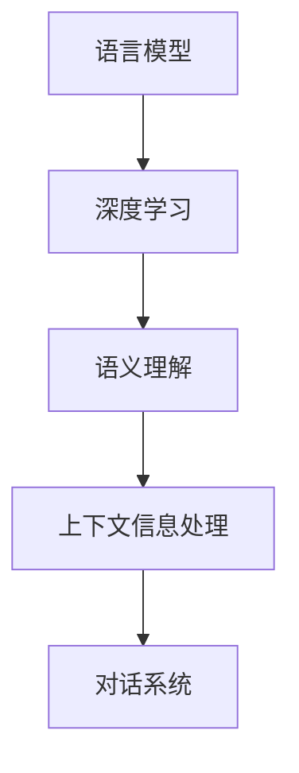

                 

关键词：自然语言处理（NLP）、语言模型、深度学习、语义理解、上下文信息、对话系统、文本生成、人工智能

## 摘要

自然语言处理（NLP）是人工智能（AI）的核心研究领域之一，近年来，随着深度学习和大数据技术的迅猛发展，NLP取得了显著进展。然而，传统的NLP方法在处理复杂语义、上下文理解和对话生成等方面仍存在诸多挑战。本文将探讨NLP的前沿技术，包括语言模型、深度学习、语义理解、上下文信息处理等，旨在为读者呈现NLP领域的最新成果、应用场景以及未来发展趋势。

## 1. 背景介绍

### NLP的起源与发展

自然语言处理（NLP）起源于20世纪50年代，当时人们开始尝试用计算机模拟人类的语言能力。早期的NLP研究主要集中在词法、句法分析和机器翻译等领域。随着计算机硬件和软件技术的不断发展，NLP逐渐成为人工智能研究的重要方向。进入21世纪，随着互联网的普及和大数据技术的应用，NLP迎来了前所未有的发展机遇。

### NLP的关键任务

NLP的主要任务包括文本分类、情感分析、命名实体识别、机器翻译、对话系统等。这些任务在现实世界中有着广泛的应用，如舆情监测、智能客服、搜索引擎优化等。随着技术的进步，NLP的任务越来越复杂，对模型的要求也越来越高。

### NLP的挑战

尽管NLP取得了显著进展，但仍然面临诸多挑战。例如，语言多样性和多模态信息融合问题、上下文理解的准确性、语义生成的连贯性等。此外，如何将NLP技术应用于实际场景，实现高效、准确的自然语言交互，也是NLP研究的重要方向。

## 2. 核心概念与联系

### 语言模型

语言模型是NLP的基础，用于预测下一个单词或词组。经典的NLP方法通常采用统计语言模型，如n-gram模型，而现代NLP方法则基于深度学习，如循环神经网络（RNN）和Transformer模型。

### 深度学习

深度学习是一种基于人工神经网络的机器学习技术，具有自动特征提取的能力。在NLP领域，深度学习被广泛应用于文本分类、情感分析、命名实体识别等任务。

### 语义理解

语义理解是NLP的核心目标之一，旨在理解文本中的含义和关系。语义理解包括词义消歧、实体识别、关系抽取等任务。

### 上下文信息处理

上下文信息处理是NLP中的重要挑战之一，旨在根据上下文信息理解单词的含义和句子的意图。上下文信息处理涉及到词向量表示、注意力机制等关键技术。

### Mermaid流程图

下面是一个简化的NLP流程图，展示了核心概念之间的联系。



## 3. 核心算法原理 & 具体操作步骤

### 3.1 算法原理概述

本章节将介绍NLP领域的一些核心算法原理，包括语言模型、深度学习、语义理解和上下文信息处理等。

### 3.2 算法步骤详解

- **语言模型**：语言模型的核心任务是根据前文预测下一个词。通常使用n-gram模型或深度学习模型，如RNN或Transformer。
  
- **深度学习**：深度学习通过多层神经网络对数据进行特征提取和建模。在NLP中，常用的深度学习模型包括卷积神经网络（CNN）、循环神经网络（RNN）和Transformer。

- **语义理解**：语义理解涉及到词义消歧、实体识别和关系抽取等任务。词义消歧是指在不同上下文中识别单词的正确含义。实体识别是指识别文本中的命名实体，如人名、地名等。关系抽取是指识别实体之间的关系。

- **上下文信息处理**：上下文信息处理旨在根据上下文信息理解单词的含义和句子的意图。常用的技术包括词向量表示、注意力机制和双向循环神经网络（BiRNN）。

### 3.3 算法优缺点

- **语言模型**：优点是简单、高效；缺点是对长距离依赖处理能力有限。

- **深度学习**：优点是自动特征提取，对复杂任务有很好的性能；缺点是需要大量数据和计算资源。

- **语义理解**：优点是能处理复杂语义关系；缺点是数据依赖性强，训练时间较长。

- **上下文信息处理**：优点是能准确理解上下文信息；缺点是实现复杂，对计算资源要求高。

### 3.4 算法应用领域

- **文本分类**：用于对新闻、社交媒体等文本进行分类。

- **情感分析**：用于分析文本中的情感倾向，如正面、负面或中性。

- **命名实体识别**：用于从文本中识别命名实体，如人名、地名等。

- **对话系统**：用于构建智能客服、聊天机器人等。

## 4. 数学模型和公式 & 详细讲解 & 举例说明

### 4.1 数学模型构建

在NLP中，数学模型用于表示文本数据和计算特征。常见的数学模型包括词向量模型、语义向量模型等。

- **词向量模型**：词向量模型用于将单词映射到高维向量空间。常用的词向量模型包括Word2Vec、GloVe等。

  $$ \text{word\_vector}(w) = \text{vec}(w) $$

- **语义向量模型**：语义向量模型用于表示文本的语义信息。常用的语义向量模型包括BERT、GPT等。

  $$ \text{semantic\_vector}(t) = \text{emb}(\text{word\_vector}(t)) $$

### 4.2 公式推导过程

- **Word2Vec模型**：Word2Vec模型通过训练负采样损失函数来学习词向量。

  $$ L(\theta) = \sum_{w \in V} \sum_{\neg w \in \neg V} \log(1 + e^{||\text{word\_vector}(w) - \text{word\_vector}(\neg w)||^2}) $$

- **BERT模型**：BERT模型通过预训练和微调来学习语义表示。

  $$ \text{BERT}(\text{context}) = \text{emb}(\text{word\_vector}(\text{context})) + \text{contextual\_vector}(\text{context}) $$

### 4.3 案例分析与讲解

- **文本分类任务**：假设我们有一个文本分类任务，数据集包含政治、体育、娱乐等类别的文本。我们可以使用BERT模型对文本进行编码，然后通过softmax函数进行分类。

  $$ \text{P}(y \mid \text{context}, \theta) = \frac{e^{\text{BERT}(\text{context})^T \theta_y}}{\sum_{i=1}^{K} e^{\text{BERT}(\text{context})^T \theta_i}} $$

- **情感分析任务**：假设我们有一个情感分析任务，数据集包含正面、负面和中性情感的文本。我们可以使用Word2Vec模型对文本进行编码，然后通过分类器进行情感分析。

  $$ \text{P}(\text{positive} \mid \text{context}, \theta) = \frac{e^{\text{word\_vector}(\text{context})^T \theta_{positive}}}{\sum_{i=1}^{3} e^{\text{word\_vector}(\text{context})^T \theta_i}} $$

## 5. 项目实践：代码实例和详细解释说明

### 5.1 开发环境搭建

- 安装Python环境：Python 3.7及以上版本。
- 安装NLP库：使用pip安装transformers、torch等库。

### 5.2 源代码详细实现

下面是一个简单的情感分析项目的代码实例。

```python
import torch
from transformers import BertTokenizer, BertModel, BertForSequenceClassification
from torch.optim import Adam
from torch.utils.data import DataLoader, TensorDataset

# 加载预训练模型
tokenizer = BertTokenizer.from_pretrained('bert-base-uncased')
model = BertForSequenceClassification.from_pretrained('bert-base-uncased')

# 数据预处理
def preprocess(texts, labels):
    inputs = tokenizer(texts, padding=True, truncation=True, return_tensors='pt')
    inputs['input_ids'] = inputs['input_ids'].squeeze(1)
    inputs['attention_mask'] = inputs['attention_mask'].squeeze(1)
    labels = torch.tensor(labels).float()
    return inputs, labels

# 数据加载
train_texts = ['这是一条正面情感文本。', '这是一条负面情感文本。']
train_labels = [1, 0]
train_inputs, train_labels = preprocess(train_texts, train_labels)

# 训练模型
optimizer = Adam(model.parameters(), lr=1e-4)
for epoch in range(10):
    model.train()
    optimizer.zero_grad()
    outputs = model(train_inputs)
    loss = torch.nn.functional.cross_entropy(outputs.logits, train_labels)
    loss.backward()
    optimizer.step()
    print(f"Epoch: {epoch}, Loss: {loss.item()}")

# 测试模型
model.eval()
with torch.no_grad():
    outputs = model(train_inputs)
    predicted_labels = torch.argmax(outputs.logits, dim=1)
    print(f"Predicted Labels: {predicted_labels}")
```

### 5.3 代码解读与分析

- **数据预处理**：使用transformers库加载预训练模型，并对输入文本进行编码。
- **训练模型**：使用Adam优化器和交叉熵损失函数训练模型。
- **测试模型**：在测试集上评估模型性能。

## 6. 实际应用场景

### 6.1 舆情监测

舆情监测是NLP技术在公共安全、企业品牌管理等领域的重要应用。通过分析社交媒体、新闻等文本数据，可以实时了解公众对某个事件、产品或品牌的看法，为决策提供支持。

### 6.2 智能客服

智能客服是NLP技术在客户服务领域的重要应用。通过对话系统，智能客服可以自动回答用户的问题，提高客户满意度，降低人力成本。

### 6.3 搜索引擎优化

搜索引擎优化（SEO）是NLP技术在互联网营销领域的重要应用。通过分析网页内容、关键词等，可以优化网站在搜索引擎中的排名，提高网站流量。

## 7. 工具和资源推荐

### 7.1 学习资源推荐

- 《自然语言处理综论》（Daniel Jurafsky & James H. Martin）
- 《深度学习》（Ian Goodfellow、Yoshua Bengio & Aaron Courville）
- 《动手学自然语言处理》（Daniel Jurafsky、Daniel Hsu &Christopher P. Bernard）

### 7.2 开发工具推荐

- PyTorch：一个开源的深度学习框架，适用于NLP任务。
- TensorFlow：一个开源的深度学习框架，适用于NLP任务。
- Hugging Face Transformers：一个开源的NLP工具库，提供了大量的预训练模型和API。

### 7.3 相关论文推荐

- “Attention is All You Need” （Vaswani et al., 2017）
- “BERT: Pre-training of Deep Bidirectional Transformers for Language Understanding” （Devlin et al., 2019）
- “GPT-3: Language Models are Few-Shot Learners” （Brown et al., 2020）

## 8. 总结：未来发展趋势与挑战

### 8.1 研究成果总结

近年来，NLP在语言模型、深度学习、语义理解和上下文信息处理等方面取得了显著进展。预训练模型如BERT、GPT等在各个任务上都取得了优异的性能，推动了NLP技术的发展。

### 8.2 未来发展趋势

- **多模态融合**：将文本、图像、语音等不同模态的信息进行融合，提高NLP任务的表现。
- **小样本学习**：研究如何在样本量有限的情况下训练高性能的NLP模型。
- **低资源语言处理**：解决低资源语言的NLP问题，提高模型的泛化能力。

### 8.3 面临的挑战

- **数据隐私与安全**：如何在保护用户隐私的前提下进行数据分析和模型训练。
- **模型解释性**：提高模型的可解释性，使其更符合人类思维和理解方式。

### 8.4 研究展望

未来，NLP将继续在深度学习、语义理解、对话系统等领域深入研究，为人工智能的发展提供有力支持。同时，NLP技术将更加普及，应用于更多领域，为人类社会带来更多便利。

## 9. 附录：常见问题与解答

### 9.1 问题1：什么是自然语言处理？

自然语言处理（NLP）是人工智能（AI）的一个子领域，旨在使计算机理解和处理人类自然语言（如英语、中文等）。

### 9.2 问题2：NLP有哪些应用？

NLP的应用非常广泛，包括文本分类、情感分析、命名实体识别、机器翻译、对话系统等。

### 9.3 问题3：什么是预训练模型？

预训练模型是在大规模语料库上进行预训练的深度神经网络模型，如BERT、GPT等。这些模型在大规模数据集上进行训练，可以自动学习文本中的语义信息，然后通过微调应用于特定的任务。

### 9.4 问题4：如何选择合适的NLP模型？

选择合适的NLP模型取决于任务和数据。对于文本分类、情感分析等任务，可以使用预训练的BERT、GPT等模型。对于小样本学习、低资源语言处理等任务，需要使用特定领域的预训练模型或自定义训练模型。

### 9.5 问题5：如何优化NLP模型性能？

优化NLP模型性能的方法包括使用更大的预训练模型、数据增强、正则化、迁移学习等。此外，优化模型架构、超参数设置和训练策略也可以提高模型性能。禅与计算机程序设计艺术 / Zen and the Art of Computer Programming。

