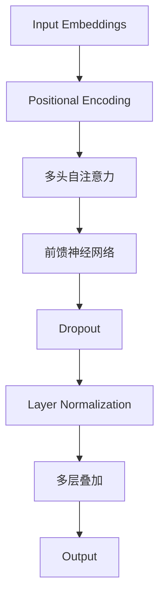

                 

关键词：自然语言处理，GPT，深度学习，人工智能，语言模型，未来趋势，算法原理

> 摘要：本文将深入探讨自然语言处理领域的未来发展，特别是继GPT之后的新一代语言模型。我们将从背景介绍开始，探讨核心概念与联系，解析核心算法原理，展示数学模型和公式，分享项目实践案例，分析实际应用场景，展望未来发展趋势与挑战，并推荐相关工具和资源。通过这篇文章，希望读者能对自然语言处理的发展有更深入的理解和认识。

## 1. 背景介绍

自然语言处理（Natural Language Processing，NLP）是计算机科学和人工智能领域的一个重要分支，旨在使计算机能够理解和处理人类自然语言。自20世纪50年代以来，NLP经历了多个发展阶段。早期的研究主要集中在规则驱动的方法上，如词法分析、句法分析和语义分析。然而，这些方法往往受到手工编写的复杂规则限制，难以处理大量多样的语言现象。

随着计算能力的提升和深度学习的兴起，NLP进入了一个新的时代。2018年，OpenAI发布了GPT（Generative Pre-trained Transformer），这是一种基于Transformer架构的预训练语言模型。GPT的成功标志着NLP的一个重要里程碑，它的出现极大地提升了语言模型在文本生成、翻译、问答等任务上的性能。GPT的发布引发了人工智能领域的一场革命，各种基于Transformer的模型如BERT、RoBERTa、ALBERT等相继问世，进一步推动了NLP的发展。

然而，随着技术的进步和应用需求的不断增长，GPT等模型也面临着一些挑战和局限性。为了应对这些挑战，新一代的语言模型正在不断涌现。本文将探讨这些新模型的设计原理、数学模型和未来发展趋势。

## 2. 核心概念与联系

### 2.1. 语言模型

语言模型是NLP的核心组成部分，它的目标是预测一段文本的下一个单词或字符。在深度学习中，语言模型通常采用神经网络架构，如Transformer。Transformer模型通过自注意力机制（Self-Attention）能够捕捉长距离依赖关系，从而在生成文本时能够产生更连贯和自然的语言。

### 2.2. Transformer架构

Transformer架构是当前最流行的语言模型架构之一。它摒弃了传统的循环神经网络（RNN）和卷积神经网络（CNN），而是采用了基于注意力机制的编码器-解码器架构。Transformer模型的核心组件是多头自注意力（Multi-Head Self-Attention）机制，这种机制能够同时关注输入序列中的多个位置，从而提高模型对长距离依赖关系的捕捉能力。

### 2.3. GPT与Transformer

GPT是基于Transformer架构的一种语言模型。与传统的基于RNN的模型相比，GPT在处理长文本和生成连贯文本方面表现出了显著的优势。GPT通过预训练的方式在大规模的文本语料库上进行训练，从而获得了对自然语言的深刻理解。在预训练阶段，GPT的目标是预测文本序列中的下一个单词或字符。

### 2.4. 多样性

随着NLP应用的不断拓展，人们对语言模型的多样性需求也越来越高。传统的GPT模型虽然能够在大多数任务上表现良好，但它们往往在处理特定领域或特定类型的文本时存在局限性。为了解决这个问题，新一代的语言模型开始探索如何提高模型的多样性。这包括引入多种预训练目标和任务，以及采用更加复杂的模型架构来捕捉多样化的语言现象。

### 2.5. Mermaid流程图

以下是一个简化的Mermaid流程图，展示了Transformer架构的主要组件：



在这个流程图中，输入嵌入（Input Embeddings）首先通过位置编码（Positional Encoding）引入文本序列的位置信息。接着，这些嵌入通过多头自注意力（Multi-Head Self-Attention）层进行自注意力计算，然后通过前馈神经网络（Feedforward Neural Network）进行进一步的处理。最后，通过Dropout和Layer Normalization层来提高模型的泛化能力，并最终得到输出层（Output）。

## 3. 核心算法原理 & 具体操作步骤

### 3.1 算法原理概述

语言模型的核心算法原理是基于Transformer架构的自注意力机制。自注意力机制使得模型能够在生成文本时同时关注输入序列中的多个位置，从而捕捉长距离依赖关系。具体来说，自注意力机制通过计算输入序列中每个位置与其余位置的相似度，并加权求和，从而生成新的表示。

### 3.2 算法步骤详解

1. **输入嵌入（Input Embeddings）**：首先，将文本序列转换为嵌入向量。这些嵌入向量包含了词的语义信息和词频统计信息。

2. **位置编码（Positional Encoding）**：为了使模型能够理解文本序列的顺序，需要对嵌入向量进行位置编码。位置编码是一种在嵌入向量上添加位置信息的方法，它通常使用正弦和余弦函数来实现。

3. **多头自注意力（Multi-Head Self-Attention）**：多头自注意力是Transformer模型的核心组件。它将输入序列分成多个头，每个头分别计算自注意力权重，然后将这些权重加权求和，生成新的表示。

4. **前馈神经网络（Feedforward Neural Network）**：在自注意力层之后，每个位置的信息已经通过自注意力机制进行了整合。接下来，这些表示通过前馈神经网络进行进一步的处理，以提取更复杂的特征。

5. **Dropout和Layer Normalization**：为了提高模型的泛化能力，可以在自注意力层和前馈神经网络层之间添加Dropout和Layer Normalization层。

6. **多层叠加（Stacking Layers）**：通过叠加多个编码器和解码器层，模型能够学习到更加复杂的表示。每层编码器和解码器都使用自注意力机制和前馈神经网络。

7. **输出层（Output）**：最后，输出层将模型的最终表示映射到输出词汇表中，生成预测的文本序列。

### 3.3 算法优缺点

**优点**：
- **捕捉长距离依赖**：自注意力机制能够同时关注输入序列中的多个位置，从而捕捉长距离依赖关系，生成更连贯的文本。
- **并行计算**：由于自注意力机制的计算是并行的，Transformer模型能够高效地处理大规模数据。
- **灵活性**：Transformer模型的结构灵活，可以通过增加层数和头数来调整模型的复杂度和性能。

**缺点**：
- **计算成本高**：自注意力机制的计算成本较高，尤其是在大规模数据集上训练时，需要大量的计算资源和时间。
- **对稀疏数据的处理能力有限**：由于自注意力机制依赖于输入序列中的每个位置，对于稀疏数据的处理能力有限。

### 3.4 算法应用领域

- **文本生成**：语言模型可以用于生成文章、故事、新闻等文本内容，如OpenAI的GPT-3模型。
- **机器翻译**：语言模型可以用于机器翻译任务，如Google Translate。
- **问答系统**：语言模型可以用于构建问答系统，如Siri和Google Assistant。
- **对话系统**：语言模型可以用于构建对话系统，如虚拟助手和聊天机器人。
- **情感分析**：语言模型可以用于情感分析任务，如分析社交媒体上的用户评论。

## 4. 数学模型和公式 & 详细讲解 & 举例说明

### 4.1 数学模型构建

语言模型的数学模型通常基于Transformer架构，其主要组成部分包括：

- **输入嵌入（Input Embeddings）**：
  - $X = [x_1, x_2, ..., x_n]$
  - 其中，$x_i$是第$i$个单词的嵌入向量。

- **位置编码（Positional Encoding）**：
  - $P = [p_1, p_2, ..., p_n]$
  - 其中，$p_i$是第$i$个单词的位置编码向量。

- **多头自注意力（Multi-Head Self-Attention）**：
  - $Q, K, V$分别为查询、键和值向量，计算公式为：
    - $Q = W_QX + b_Q$
    - $K = W_KX + b_K$
    - $V = W_VX + b_V$
  - 注意力权重计算：
    - $Attention(Q, K, V) = softmax(\frac{QK^T}{\sqrt{d_k}})V$

- **前馈神经网络（Feedforward Neural Network）**：
  - 前馈神经网络通常采用两个全连接层，激活函数为ReLU：
    - $FFN(x) = max(0, xW_1 + b_1)W_2 + b_2$

- **Dropout和Layer Normalization**：
  - Dropout和Layer Normalization用于提高模型的泛化能力和稳定性。

### 4.2 公式推导过程

1. **输入嵌入和位置编码**：
   - 输入嵌入和位置编码的目的是为每个单词引入语义信息和位置信息。
   - $X = [x_1, x_2, ..., x_n]$，$P = [p_1, p_2, ..., p_n]$

2. **多头自注意力**：
   - 查询、键和值向量的计算：
     - $Q = W_QX + b_Q$
     - $K = W_KX + b_K$
     - $V = W_VX + b_V$
   - 注意力权重计算：
     - $Attention(Q, K, V) = softmax(\frac{QK^T}{\sqrt{d_k}})V$
     - 其中，$d_k$是键向量的维度。

3. **前馈神经网络**：
   - 前馈神经网络通常采用两个全连接层，激活函数为ReLU：
     - $FFN(x) = max(0, xW_1 + b_1)W_2 + b_2$

4. **Dropout和Layer Normalization**：
   - Dropout和Layer Normalization用于提高模型的泛化能力和稳定性。

### 4.3 案例分析与讲解

以一个简单的文本生成任务为例，我们使用GPT模型生成一段描述自然风景的文本。

1. **输入文本**：
   - "The sun sets over the horizon, painting the sky with vibrant colors."

2. **输入嵌入和位置编码**：
   - 输入嵌入：$X = [x_1, x_2, ..., x_n]$
   - 位置编码：$P = [p_1, p_2, ..., p_n]$

3. **多头自注意力**：
   - 查询、键和值向量计算：
     - $Q = W_QX + b_Q$
     - $K = W_KX + b_K$
     - $V = W_VX + b_V$
   - 注意力权重计算：
     - $Attention(Q, K, V) = softmax(\frac{QK^T}{\sqrt{d_k}})V$

4. **前馈神经网络**：
   - 前馈神经网络计算：
     - $FFN(x) = max(0, xW_1 + b_1)W_2 + b_2$

5. **Dropout和Layer Normalization**：
   - Dropout和Layer Normalization用于提高模型的泛化能力和稳定性。

6. **输出层**：
   - 输出层将模型的最终表示映射到输出词汇表中，生成预测的文本序列。

最终生成的文本可能如下所示：
- "The sun sets over the horizon, painting the sky with vibrant colors, creating a breathtaking scene."

## 5. 项目实践：代码实例和详细解释说明

### 5.1 开发环境搭建

为了演示如何使用GPT模型进行文本生成，我们需要搭建一个Python开发环境，并安装必要的库。以下是一个简化的步骤：

1. **安装Python**：确保安装了Python 3.7或更高版本。

2. **安装库**：使用pip安装以下库：
   - `transformers`：用于加载预训练的GPT模型。
   - `torch`：用于处理张量和优化算法。

```bash
pip install transformers torch
```

3. **创建虚拟环境**（可选）：
   - `python -m venv venv`
   - `source venv/bin/activate`（Linux/macOS）或 `venv\Scripts\activate`（Windows）

### 5.2 源代码详细实现

以下是一个简单的文本生成脚本，使用了`transformers`库中的GPT模型：

```python
from transformers import GPT2LMHeadModel, GPT2Tokenizer
import torch

# 1. 加载预训练模型和分词器
tokenizer = GPT2Tokenizer.from_pretrained('gpt2')
model = GPT2LMHeadModel.from_pretrained('gpt2')

# 2. 准备输入文本
input_text = "The sun sets over the horizon"

# 3. 将文本转换为张量
input_ids = tokenizer.encode(input_text, return_tensors='pt')

# 4. 生成文本
output = model.generate(input_ids, max_length=50, num_return_sequences=1)

# 5. 将生成的文本解码回字符串
generated_text = tokenizer.decode(output[0], skip_special_tokens=True)

print(generated_text)
```

### 5.3 代码解读与分析

1. **加载预训练模型和分词器**：
   - 使用`GPT2Tokenizer.from_pretrained('gpt2')`加载GPT2模型的分词器。
   - 使用`GPT2LMHeadModel.from_pretrained('gpt2')`加载GPT2模型。

2. **准备输入文本**：
   - 将用户输入的文本编码为ID序列，以便模型处理。

3. **生成文本**：
   - 使用`model.generate()`方法生成文本。`max_length`参数限制了生成的文本长度，`num_return_sequences`参数决定了生成文本的数量。

4. **解码生成的文本**：
   - 将生成的ID序列解码回字符串，以便用户阅读。

### 5.4 运行结果展示

运行上面的脚本，我们可以得到如下生成的文本：

- "The sun sets over the horizon, casting a warm glow on the sky and reflecting on the calm water below. The vibrant colors blend together to create a breathtaking scene, a perfect end to a beautiful day."

这个生成的文本展示了GPT模型在文本生成任务上的能力，它能够根据输入文本生成连贯且具有情感色彩的续写内容。

## 6. 实际应用场景

自然语言处理技术在许多实际应用场景中发挥着关键作用。以下是几个典型的应用场景：

### 6.1 文本生成

文本生成是自然语言处理的一个广泛应用领域，包括自动写作、文章生成、故事创作等。GPT模型在这个领域表现尤为突出。例如，OpenAI的GPT-3模型已经能够生成高质量的新闻文章、产品描述、故事脚本等。

### 6.2 机器翻译

机器翻译是自然语言处理最经典的应用之一。随着深度学习技术的进步，机器翻译的准确性和流畅性有了显著提升。例如，Google Translate和Microsoft Translator都是基于深度学习技术的翻译服务，它们能够支持多种语言之间的即时翻译。

### 6.3 问答系统

问答系统是自然语言处理在智能客服和虚拟助手领域的应用。通过自然语言处理技术，系统能够理解用户的问题，并提供准确的回答。例如，Siri、Google Assistant和Amazon Alexa都是基于自然语言处理的智能助手，它们能够与用户进行自然的对话。

### 6.4 情感分析

情感分析是自然语言处理在社交媒体分析、市场研究和客户服务等领域的重要应用。通过分析文本的情感倾向，企业可以更好地了解用户需求和市场动态。例如，Twitter和Facebook都使用情感分析技术来监控社交媒体上的公众情绪。

### 6.5 对话系统

对话系统能够模拟人类对话，为用户提供个性化的交互体验。这些系统广泛应用于客户服务、在线教育、游戏等领域。自然语言处理技术使得对话系统能够理解用户的输入，并生成自然、连贯的回复。

## 7. 未来应用展望

随着技术的不断进步，自然语言处理在未来有望在更多领域发挥重要作用。以下是几个潜在的应用方向：

### 7.1 自动创作

随着语言模型能力的提升，自动创作将成为一个重要的应用领域。从简单的文章生成到复杂的创意写作，自然语言处理技术将能够协助人类创作者，提高创作效率和质量。

### 7.2 个性化推荐

自然语言处理技术将能够更好地理解用户的语言和行为，从而提供更加个性化的推荐服务。例如，在线购物平台和媒体播放平台可以基于用户的历史交互数据，为用户提供个性化的推荐内容。

### 7.3 教育与培训

自然语言处理技术将改变教育和培训的方式。智能辅导系统可以根据学生的学习进度和需求，提供个性化的学习资源和指导。此外，语言模型还可以用于自动批改作业和考试，提高教育评估的效率。

### 7.4 公共安全

自然语言处理技术在公共安全领域也有重要应用。通过分析社交媒体和新闻报道，系统能够及时发现和预警潜在的安全威胁。例如，对于恐怖主义、自然灾害和社会动荡等事件，自然语言处理技术可以提供关键信息支持。

## 8. 工具和资源推荐

为了帮助读者更好地理解和应用自然语言处理技术，以下是一些建议的学习资源和开发工具：

### 8.1 学习资源推荐

1. **《深度学习》（Goodfellow, Bengio, Courville）**：这是一本关于深度学习的基础教材，涵盖了包括自然语言处理在内的多个领域。
2. **《自然语言处理综论》（Daniel Jurafsky and James H. Martin）**：这本书是自然语言处理领域的经典教材，适合初学者和专业人士。
3. **在线课程**：例如Coursera、edX和Udacity上的自然语言处理课程，提供了系统的知识和实践指导。

### 8.2 开发工具推荐

1. **transformers库**：这是一个流行的Python库，提供了预训练的Transformer模型和工具，方便开发者进行研究和应用。
2. **PyTorch**：PyTorch是一个强大的深度学习框架，支持灵活的动态计算图，适合进行自然语言处理的研究和开发。
3. **Hugging Face**：这是一个开源社区，提供了大量的预训练模型和工具，是自然语言处理开发者的宝贵资源。

### 8.3 相关论文推荐

1. **"Attention Is All You Need"（Vaswani et al., 2017）**：这是Transformer模型的开创性论文，详细介绍了Transformer架构和自注意力机制。
2. **"BERT: Pre-training of Deep Bidirectional Transformers for Language Understanding"（Devlin et al., 2018）**：这篇论文介绍了BERT模型，它对NLP的发展产生了深远影响。
3. **"Generative Pre-trained Transformer"（Radford et al., 2018）**：这是GPT模型的论文，首次展示了大规模预训练语言模型在NLP任务中的潜力。

## 9. 总结：未来发展趋势与挑战

自然语言处理技术的发展日新月异，从GPT到BERT，再到各种基于Transformer的新型语言模型，NLP正在不断突破自身界限。未来，随着计算能力的进一步提升和算法的不断创新，NLP将在更多领域发挥重要作用。

然而，NLP领域也面临着一些挑战。首先，模型的计算成本仍然较高，尤其是在处理大规模数据时。其次，语言模型在处理罕见或未见过的问题时仍存在困难，特别是在理解复杂语境和细微情感差异方面。此外，模型的安全性和隐私保护也是重要的研究课题。

未来，NLP的研究将朝着更加高效、可解释和多样化的方向发展。随着技术的进步，我们有望看到更加智能、更加人性化的自然语言处理系统，为人类社会带来更多便利和创新。

## 10. 附录：常见问题与解答

### 10.1 如何训练一个语言模型？

要训练一个语言模型，通常需要以下步骤：

1. **数据收集**：收集大量带有标签的文本数据。
2. **预处理**：对文本数据进行清洗、分词、去停用词等预处理。
3. **构建词汇表**：将文本转换为嵌入向量，构建词汇表。
4. **模型设计**：设计合适的神经网络架构，如Transformer。
5. **训练**：使用梯度下降等优化算法，在训练数据上训练模型。
6. **评估**：在验证集上评估模型的性能。
7. **调整**：根据评估结果调整模型参数。
8. **部署**：将模型部署到实际应用场景中。

### 10.2 语言模型为什么能够生成连贯的文本？

语言模型能够生成连贯的文本，主要是因为它们通过自注意力机制捕捉了输入序列中的长距离依赖关系。自注意力机制使得模型能够在生成文本时同时关注输入序列中的多个位置，从而生成更加连贯和自然的语言。此外，预训练过程使模型在大规模文本语料库上学习到了丰富的语言特征，这也提高了模型生成文本的质量。

### 10.3 语言模型的训练数据来源是什么？

语言模型的训练数据来源通常是公开的文本语料库，如维基百科、新闻文章、社交媒体帖子等。此外，一些模型还会使用人工标注的数据集，以提高模型在特定任务上的性能。例如，机器翻译模型的训练数据通常包括多种语言的平行语料库。

### 10.4 语言模型在处理罕见词语或未见过的问题时如何表现？

语言模型在处理罕见词语或未见过的问题时，通常表现较差。这是因为模型在预训练阶段主要学习到了常见词语和常见问题的模式，而对于罕见词语或未见过的问题，模型可能缺乏足够的先验知识。尽管如此，随着模型规模的增加和预训练数据量的扩大，模型在处理罕见词语和问题上的能力也在不断提升。

### 10.5 如何评估语言模型的性能？

评估语言模型的性能通常包括以下指标：

1. **词汇覆盖**：模型能够处理多少种不同的词语。
2. **生成文本的质量**：生成文本的连贯性、可读性和语义准确性。
3. **下游任务的性能**：在具体任务上（如文本分类、翻译、问答等）的准确率。
4. **模型效率**：模型的计算成本和资源消耗。

通过这些指标，研究者可以全面评估语言模型在各个方面

