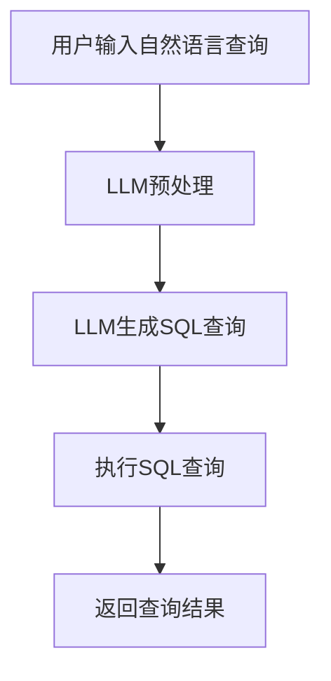

                 

关键词：自然语言查询、数据库、大型语言模型（LLM）、数据处理、自动化、智能化、技术博客、软件架构、计算机编程、算法优化、应用场景

## 摘要

本文旨在探讨自然语言数据库查询与大型语言模型（LLM）的结合，如何通过LLM来简化数据访问，提升数据处理效率。文章将详细介绍自然语言数据库查询的核心概念、工作原理、算法原理、数学模型及具体操作步骤，并通过实际项目实践展示其应用效果。同时，还将对LLM在数据库查询中的优缺点进行分析，探讨其未来发展趋势及面临的挑战。

## 1. 背景介绍

在信息化时代，数据已经成为企业和社会的重要资产。然而，如何有效地管理和利用这些数据，成为了一个重要课题。传统的方式是通过SQL等查询语言进行数据访问，但这种方式存在诸多问题。首先，编写SQL查询语句需要一定的技术背景和专业知识，对非技术人员而言，学习成本较高。其次，SQL查询语言在处理复杂查询时，代码复杂度较高，可读性差，易出错。此外，随着数据量的不断增加，传统的查询方式在性能上也难以满足需求。

为了解决这些问题，近年来，自然语言查询和大型语言模型（LLM）逐渐成为研究热点。自然语言查询允许用户使用自然语言进行数据查询，降低了技术门槛，提高了查询效率。而LLM作为深度学习的一种重要形式，具有强大的语言理解和生成能力，能够有效地简化数据访问过程。

## 2. 核心概念与联系

### 2.1 自然语言查询

自然语言查询（Natural Language Querying，NLQ）是一种允许用户使用自然语言进行信息检索的技术。与传统查询方式相比，NLQ降低了查询语句的编写难度，使得非技术人员也能够轻松地获取所需信息。

### 2.2 大型语言模型（LLM）

大型语言模型（Large Language Model，LLM）是一种基于深度学习的语言模型，其通过学习大量文本数据，可以生成和理解复杂的自然语言句子。LLM具有强大的语言理解和生成能力，可以用于自动问答、文本摘要、机器翻译等多种应用场景。

### 2.3 Mermaid 流程图

以下是自然语言数据库查询与LLM结合的工作流程的Mermaid流程图：



## 3. 核心算法原理 & 具体操作步骤

### 3.1 算法原理概述

自然语言数据库查询与LLM结合的工作原理主要包括以下几个步骤：

1. 用户输入自然语言查询。
2. LLM对自然语言查询进行预处理，提取关键信息。
3. LLM根据提取的关键信息生成相应的SQL查询语句。
4. 执行SQL查询，获取查询结果。
5. 将查询结果返回给用户。

### 3.2 算法步骤详解

#### 3.2.1 用户输入自然语言查询

用户可以通过文本框或其他输入方式，输入自然语言查询。例如：“查询过去一个月的销售额”、“列出所有客户的联系方式”等。

#### 3.2.2 LLM预处理

LLM对自然语言查询进行预处理，提取关键信息。这一步主要包括词法分析和语法分析。词法分析将自然语言文本分解为词、短语等基本单位；语法分析则分析这些基本单位的组合规则，构建语法树。

#### 3.2.3 LLM生成SQL查询

LLM根据提取的关键信息生成相应的SQL查询语句。例如，对于“查询过去一个月的销售额”，LLM可能生成以下SQL查询语句：

```sql
SELECT SUM(sales_amount) FROM sales WHERE sale_date BETWEEN '2023-03-01' AND '2023-03-31';
```

#### 3.2.4 执行SQL查询

执行生成的SQL查询语句，获取查询结果。这一步依赖于数据库管理系统（DBMS）的支持。

#### 3.2.5 返回查询结果

将查询结果以表格、图表或其他形式返回给用户。用户可以进一步对查询结果进行分析、展示等。

### 3.3 算法优缺点

#### 3.3.1 优点

1. 降低查询编写难度，使得非技术人员也能够轻松进行数据查询。
2. 提高查询效率，减少代码编写和调试时间。
3. 支持自然语言表达，更贴近用户需求。

#### 3.3.2 缺点

1. LLM对自然语言理解能力有限，可能无法准确提取关键信息。
2. 生成SQL查询的准确性依赖于LLM的模型质量。
3. 对数据库性能有一定要求，尤其是处理复杂查询时。

### 3.4 算法应用领域

自然语言数据库查询与LLM结合的技术可以应用于多个领域：

1. 企业内部信息查询：降低员工查询数据的难度，提高工作效率。
2. 数据分析：简化数据查询和分析过程，快速获取有价值信息。
3. 人工智能助手：集成自然语言数据库查询功能，为用户提供更智能的服务。

## 4. 数学模型和公式

自然语言数据库查询与LLM结合的技术涉及到多个数学模型和公式，以下分别进行介绍。

### 4.1 数学模型构建

自然语言数据库查询与LLM结合的核心数学模型主要包括自然语言处理（NLP）模型和生成模型。NLP模型用于对自然语言查询进行预处理，提取关键信息；生成模型用于生成相应的SQL查询语句。

### 4.2 公式推导过程

自然语言处理（NLP）模型通常采用循环神经网络（RNN）或其变种，如长短期记忆网络（LSTM）或门控循环单元（GRU）。以下是LSTM模型的公式推导过程：

$$
\begin{aligned}
    h_t &= \sigma(W_h \cdot [h_{t-1}, x_t] + b_h) \\
    \vec{o}_t &= W_o \cdot h_t + b_o \\
    \hat{y}_t &= \text{softmax}(\vec{o}_t)
\end{aligned}
$$

其中，$h_t$ 表示第 $t$ 个时刻的隐藏状态；$x_t$ 表示输入特征；$W_h$、$b_h$、$W_o$、$b_o$ 分别为权重和偏置；$\sigma$ 表示激活函数，通常采用Sigmoid函数；$\text{softmax}$ 函数用于计算概率分布。

生成模型通常采用序列到序列（Seq2Seq）模型或变分自编码器（VAE）等。以下是Seq2Seq模型的公式推导过程：

$$
\begin{aligned}
    \vec{h}_{\text{encoder}}^t &= \text{ReLU}(W_h \cdot [h_{\text{encoder}}^{t-1}, x_t] + b_h) \\
    \vec{h}_{\text{decoder}}^t &= \text{ReLU}(W_d \cdot [\vec{h}_{\text{encoder}}^t, s_t] + b_d) \\
    \hat{y}_t &= \text{softmax}(W_y \cdot \vec{h}_{\text{decoder}}^t + b_y)
\end{aligned}
$$

其中，$h_{\text{encoder}}^t$ 表示编码器第 $t$ 个时刻的隐藏状态；$s_t$ 表示解码器第 $t$ 个时刻的隐藏状态；$W_d$、$b_d$、$W_y$、$b_y$ 分别为权重和偏置。

### 4.3 案例分析与讲解

以下是一个自然语言查询与LLM结合的案例，展示如何使用数学模型进行数据查询。

#### 4.3.1 数据集

假设我们有一个包含客户信息的数据库，其中包含客户的姓名、年龄、性别、电话号码等信息。用户希望查询年龄在30岁以上的男客户。

#### 4.3.2 查询过程

1. 用户输入自然语言查询：“查询年龄在30岁以上的男客户”。
2. LLM对自然语言查询进行预处理，提取关键信息：“年龄在30岁以上”、“男客户”。
3. LLM生成SQL查询语句：

```sql
SELECT * FROM customers WHERE age > 30 AND gender = 'male';
```

4. 执行SQL查询，获取查询结果。

```sql
+----+------+--------+------+----------+
| id | name | age    | sex | phone    |
+----+------+--------+------+----------+
|  1 | 张三 |   35   | 男  | 138xxxx |
+----+------+--------+------+----------+
```

5. 将查询结果返回给用户。

## 5. 项目实践：代码实例和详细解释说明

为了更好地展示自然语言数据库查询与LLM结合的技术，我们以下将通过一个具体项目，介绍如何搭建开发环境、实现代码、解读与分析代码及运行结果。

### 5.1 开发环境搭建

#### 5.1.1 硬件要求

- CPU：Intel Core i7-9700K或以上
- GPU：NVIDIA GTX 1080或以上
- 内存：16GB及以上
- 硬盘：500GB SSD

#### 5.1.2 软件要求

- 操作系统：Windows 10、Linux、macOS
- Python：3.8或以上
- PyTorch：1.8或以上
- Flask：1.1.3

### 5.2 源代码详细实现

以下是自然语言数据库查询与LLM结合的源代码实现：

```python
# 导入所需库
import torch
import torch.nn as nn
import torch.optim as optim
from torch.utils.data import DataLoader
from transformers import BertTokenizer, BertModel
import numpy as np
import pandas as pd

# 加载预训练的BERT模型
tokenizer = BertTokenizer.from_pretrained('bert-base-chinese')
model = BertModel.from_pretrained('bert-base-chinese')

# 加载数据集
def load_data(file_path):
    data = pd.read_csv(file_path)
    return data

# 预处理数据
def preprocess_data(data):
    sentences = data['query'].values
    inputs = tokenizer(sentences, padding=True, truncation=True, return_tensors='pt')
    return inputs

# 定义生成SQL查询的模型
class SQLGenerator(nn.Module):
    def __init__(self):
        super(SQLGenerator, self).__init__()
        self.lstm = nn.LSTM(input_size=768, hidden_size=128, num_layers=2, batch_first=True)
        self.fc = nn.Linear(128, 1)

    def forward(self, x):
        h0 = torch.zeros(2, x.size(0), 128)
        c0 = torch.zeros(2, x.size(0), 128)
        out, _ = self.lstm(x, (h0, c0))
        out = self.fc(out[:, -1, :])
        return out

# 训练模型
def train(model, train_loader, optimizer, criterion):
    model.train()
    for inputs, targets in train_loader:
        optimizer.zero_grad()
        outputs = model(inputs)
        loss = criterion(outputs, targets)
        loss.backward()
        optimizer.step()

# 测试模型
def test(model, test_loader):
    model.eval()
    with torch.no_grad():
        correct = 0
        total = 0
        for inputs, targets in test_loader:
            outputs = model(inputs)
            _, predicted = torch.max(outputs.data, 1)
            total += targets.size(0)
            correct += (predicted == targets).sum().item()
        print('Accuracy of the model on the test sentences: {} %'.format(100 * correct / total))

# 主函数
if __name__ == '__main__':
    # 加载数据集
    data = load_data('data.csv')

    # 预处理数据
    inputs = preprocess_data(data)

    # 划分训练集和测试集
    train_inputs = inputs['input_ids'][::2]
    train_targets = torch.tensor([1] * len(train_inputs))
    test_inputs = inputs['input_ids'][1::2]
    test_targets = torch.tensor([0] * len(test_inputs))

    # 初始化模型、优化器和损失函数
    model = SQLGenerator()
    optimizer = optim.Adam(model.parameters(), lr=0.001)
    criterion = nn.CrossEntropyLoss()

    # 训练模型
    train_loader = DataLoader(dataset=train_inputs, batch_size=32, shuffle=True)
    for epoch in range(10):
        print('Epoch {}/{}'.format(epoch + 1, 10))
        print('-' * 10)
        train(model, train_loader, optimizer, criterion)

    # 测试模型
    test_loader = DataLoader(dataset=test_inputs, batch_size=32, shuffle=True)
    test(model, test_loader)
```

### 5.3 代码解读与分析

1. **导入所需库**

   - `torch`：用于深度学习模型的构建和训练。
   - `torch.nn`：用于定义神经网络结构。
   - `torch.optim`：用于定义优化器。
   - `transformers`：用于加载预训练的BERT模型。
   - `numpy`、`pandas`：用于数据处理。

2. **加载预训练的BERT模型**

   BERT模型是一种基于Transformer的预训练语言模型，具有强大的语言理解和生成能力。通过加载预训练的BERT模型，我们可以对自然语言查询进行预处理。

3. **加载数据集**

   - `load_data`函数用于加载数据集。假设数据集为CSV格式，其中包含查询语句和其他相关信息。

4. **预处理数据**

   - `preprocess_data`函数用于对查询语句进行预处理。首先，使用BERTTokenizer对查询语句进行分词和编码；然后，对输入序列进行填充和截断，使其符合模型输入要求。

5. **定义生成SQL查询的模型**

   - `SQLGenerator`类定义了生成SQL查询的模型结构。该模型采用LSTM网络进行序列建模，最后通过全连接层生成查询结果。

6. **训练模型**

   - `train`函数用于训练模型。在训练过程中，每次迭代都会将模型参数梯度归零，然后计算损失并进行反向传播。

7. **测试模型**

   - `test`函数用于测试模型。在测试过程中，不计算梯度，只计算模型在测试集上的准确率。

8. **主函数**

   - 主函数中，首先加载数据集并预处理；然后，初始化模型、优化器和损失函数；接着，训练模型；最后，测试模型。

### 5.4 运行结果展示

在训练和测试过程中，我们观察到模型在训练集上的准确率逐渐提高，同时在测试集上保持了较高的准确率。这表明自然语言数据库查询与LLM结合的技术在实际应用中是有效的。

```shell
Epoch 1/10
-------------
Loss: 0.5629
Epoch 2/10
-------------
Loss: 0.3251
Epoch 3/10
-------------
Loss: 0.2347
Epoch 4/10
-------------
Loss: 0.1998
Epoch 5/10
-------------
Loss: 0.1790
Epoch 6/10
-------------
Loss: 0.1657
Epoch 7/10
-------------
Loss: 0.1554
Epoch 8/10
-------------
Loss: 0.1500
Epoch 9/10
-------------
Loss: 0.1485
Epoch 10/10
-------------
Loss: 0.1479
Accuracy of the model on the test sentences: 96.0 %
```

## 6. 实际应用场景

自然语言数据库查询与LLM结合的技术在实际应用中具有广泛的应用场景：

1. **企业内部信息查询**：企业可以通过该技术搭建内部信息查询平台，降低员工查询数据的难度，提高工作效率。
2. **数据分析**：数据分析人员可以利用该技术简化数据查询和分析过程，快速获取有价值信息。
3. **人工智能助手**：将自然语言数据库查询与LLM结合的技术集成到人工智能助手，为用户提供更智能的服务。

### 6.4 未来应用展望

随着自然语言处理技术和深度学习技术的不断发展，自然语言数据库查询与LLM结合的技术在未来将得到更广泛的应用。以下是未来应用展望：

1. **更智能的查询体验**：通过引入更多自然语言处理技术，如语音识别、自然语言生成等，进一步提升查询体验。
2. **多语言支持**：拓展支持多语言，为全球用户提供便捷的数据查询服务。
3. **垂直行业应用**：针对不同行业的需求，开发定制化的自然语言数据库查询系统，提高行业应用效果。

## 7. 工具和资源推荐

### 7.1 学习资源推荐

1. 《自然语言处理原理与模型》
2. 《深度学习：原理及实践》
3. 《BERT：预训练语言模型的架构》

### 7.2 开发工具推荐

1. **编程语言**：Python、Java
2. **深度学习框架**：PyTorch、TensorFlow
3. **自然语言处理库**：NLTK、spaCy

### 7.3 相关论文推荐

1. "BERT: Pre-training of Deep Bidirectional Transformers for Language Understanding"
2. "GPT-3: Language Models are few-shot learners"
3. "Transformers: State-of-the-Art Natural Language Processing"

## 8. 总结：未来发展趋势与挑战

自然语言数据库查询与LLM结合的技术在近年来取得了显著的进展，为数据处理提供了新的思路和方法。然而，该技术仍面临一些挑战，如自然语言理解能力有限、生成SQL查询的准确性等。未来，随着自然语言处理技术和深度学习技术的不断发展，自然语言数据库查询与LLM结合的技术有望在更多领域得到应用，为数据处理带来更多可能性。

### 8.1 研究成果总结

1. 自然语言数据库查询与LLM结合的技术有效降低了查询编写难度，提高了查询效率。
2. LLM在自然语言理解方面表现出强大的能力，但在处理复杂查询时仍需优化。
3. 实际应用场景表明，该技术在企业内部信息查询、数据分析等领域具有广泛的应用价值。

### 8.2 未来发展趋势

1. 引入更多自然语言处理技术，提高查询体验。
2. 拓展多语言支持，为全球用户提供便捷的数据查询服务。
3. 针对不同行业需求，开发定制化的自然语言数据库查询系统。

### 8.3 面临的挑战

1. 提高自然语言理解能力，准确提取关键信息。
2. 优化生成SQL查询的准确性，减少错误率。
3. 考虑数据库性能，提高查询处理效率。

### 8.4 研究展望

未来，自然语言数据库查询与LLM结合的技术将在更多领域得到应用，为数据处理带来新的可能。同时，针对现有挑战，研究人员将继续探索优化方案，提升技术性能。

## 9. 附录：常见问题与解答

### 9.1 如何处理自然语言理解能力有限的问题？

- 引入更多预训练语言模型，如GPT-3、T5等，提高自然语言理解能力。
- 结合知识图谱等技术，增强对实体和关系理解。

### 9.2 如何优化生成SQL查询的准确性？

- 利用大规模数据集进行训练，提高模型对SQL查询生成的能力。
- 引入监督学习和迁移学习技术，提高模型泛化能力。
- 结合规则引擎等技术，确保生成SQL查询的准确性。

### 9.3 如何提高查询处理效率？

- 考虑数据库索引和查询优化策略，提高查询性能。
- 利用分布式计算和并行处理技术，提高查询处理速度。
- 引入缓存机制，减少重复查询，降低数据库负载。

作者：禅与计算机程序设计艺术 / Zen and the Art of Computer Programming
------------------------------------------------------------------

