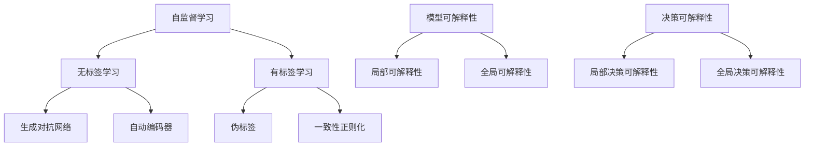

                 

关键词：自监督学习、模型可解释性、决策可解释性、机器学习、人工智能

摘要：自监督学习作为机器学习领域的一种重要分支，近年来在图像识别、自然语言处理等任务中取得了显著的成果。然而，随着模型复杂度的增加，模型的可解释性逐渐成为一个重要的问题。本文将深入探讨自监督学习的可解释性，从模型可解释性和决策可解释性两个角度展开讨论，为研究者和开发者提供参考。

## 1. 背景介绍

自监督学习是一种无需人工标注数据的机器学习方法。它通过利用数据中的冗余信息和内在结构，自动学习数据的特征表示。自监督学习在许多领域都取得了显著的成果，如图像识别、自然语言处理、语音识别等。

随着深度学习技术的快速发展，自监督学习也受到了越来越多的关注。然而，随着模型复杂度的增加，模型的可解释性逐渐成为一个重要的问题。模型的可解释性不仅有助于我们更好地理解模型的工作原理，还能帮助我们识别和纠正模型中的错误。

本文将从模型可解释性和决策可解释性两个角度，深入探讨自监督学习的可解释性。希望通过本文的探讨，能够为研究者和开发者提供一定的参考。

## 2. 核心概念与联系

### 2.1 自监督学习

自监督学习（Self-Supervised Learning）是一种不需要人工标注的数据的机器学习方法。它的基本思想是利用数据中的冗余信息和内在结构，自动学习数据的特征表示。自监督学习可以分为无标签学习和有标签学习两种类型。

无标签学习（Unlabeled Learning）：在无标签学习中，数据集不包含任何标签信息，模型需要通过学习数据之间的相关性来提取特征。常见的方法包括生成对抗网络（GAN）和自动编码器（Autoencoder）等。

有标签学习（Labeled Learning）：在有标签学习中，数据集包含一部分标签信息，模型需要利用已知的标签信息来指导学习过程。常见的方法包括伪标签（Pseudo Labeling）和一致性正则化（Consistency Regularization）等。

### 2.2 模型可解释性

模型可解释性（Model Explainability）是指模型在做出预测时，其内部机制和决策过程的可理解性。一个可解释的模型能够让人们理解模型的决策过程，发现和纠正模型中的错误，提高模型的透明度和可信度。

模型可解释性可以分为两个层次：

- **局部可解释性**：对模型中的单个样本进行解释，分析模型在处理该样本时的决策过程。
- **全局可解释性**：对整个模型的性能和决策过程进行解释，分析模型在处理不同类型样本时的行为特点。

### 2.3 决策可解释性

决策可解释性（Decision Explainability）是指模型在做出预测时，其决策依据和逻辑过程的可理解性。一个可解释的决策过程能够让人们理解模型的决策依据，发现和纠正决策中的错误，提高决策的透明度和可信度。

决策可解释性可以分为两个层次：

- **局部决策可解释性**：对模型在处理单个样本时的决策过程进行解释，分析模型在处理该样本时的决策依据。
- **全局决策可解释性**：对模型在整个数据集上的决策过程进行解释，分析模型在不同样本类型上的决策依据。

### 2.4 Mermaid 流程图

以下是自监督学习、模型可解释性和决策可解释性的 Mermaid 流程图：



## 3. 核心算法原理 & 具体操作步骤

### 3.1 算法原理概述

自监督学习的核心思想是通过无监督或半监督的方式，从原始数据中学习有用的特征表示。以下介绍几种常用的自监督学习算法及其原理：

- **生成对抗网络（GAN）**：GAN 由生成器（Generator）和判别器（Discriminator）组成。生成器的目标是生成与真实数据相似的数据，而判别器的目标是区分真实数据和生成数据。通过两个网络的对抗训练，生成器逐渐提高生成数据的质量，从而学习到数据的特征表示。

- **自动编码器（Autoencoder）**：自动编码器是一种无监督的神经网络，其目标是压缩原始数据，然后重构压缩后的数据。通过最小化重构误差，自动编码器可以学习到数据的特征表示。

- **伪标签（Pseudo Labeling）**：伪标签是一种半监督学习方法。它利用已标注的样本训练出一个模型，然后使用该模型对未标注的样本进行预测，并将预测结果作为伪标签进行学习。

- **一致性正则化（Consistency Regularization）**：一致性正则化是一种基于半监督学习的自监督方法。它通过最小化相邻样本的特征差异，使得模型在处理不同样本时能够保持一致。

### 3.2 算法步骤详解

以下是自监督学习的具体操作步骤：

1. **数据准备**：收集并清洗数据，将其分为训练集、验证集和测试集。

2. **模型选择**：根据任务需求选择合适的自监督学习模型。如图像识别任务可以选择 GAN 或自动编码器。

3. **模型训练**：使用训练集对模型进行训练。对于 GAN，需要同时训练生成器和判别器。对于自动编码器，需要最小化重构误差。

4. **伪标签生成**：对于未标注的样本，使用已训练好的模型进行预测，并将预测结果作为伪标签。

5. **模型优化**：结合已标注的样本和伪标签，对模型进行优化。

6. **模型评估**：使用验证集对模型进行评估，选择最优模型。

7. **模型应用**：使用测试集对模型进行测试，评估模型的性能。

### 3.3 算法优缺点

自监督学习具有以下优点：

- **无需人工标注数据**：自监督学习可以利用无标签或半监督的数据进行训练，降低数据标注的成本。
- **提高模型性能**：自监督学习可以学习到更丰富的特征表示，从而提高模型的性能。
- **适用于多种任务**：自监督学习适用于图像识别、自然语言处理、语音识别等多种任务。

自监督学习也存在一些缺点：

- **模型可解释性较低**：由于自监督学习模型通常采用深度神经网络，其内部机制较为复杂，难以解释。
- **对数据质量要求较高**：自监督学习依赖于数据中的冗余信息和内在结构，对数据质量要求较高。

### 3.4 算法应用领域

自监督学习在多个领域都有广泛的应用：

- **图像识别**：自监督学习可以用于图像分类、目标检测、图像生成等任务。
- **自然语言处理**：自监督学习可以用于语言模型训练、文本分类、机器翻译等任务。
- **语音识别**：自监督学习可以用于语音分类、说话人识别、语音合成等任务。

## 4. 数学模型和公式 & 详细讲解 & 举例说明

### 4.1 数学模型构建

自监督学习的数学模型通常由两部分组成：特征提取网络和损失函数。

- **特征提取网络**：特征提取网络是一个无监督或半监督的神经网络，用于从原始数据中提取特征表示。常见的特征提取网络包括自动编码器、卷积神经网络（CNN）和循环神经网络（RNN）等。

- **损失函数**：损失函数用于评估特征提取网络的学习效果。常见的损失函数包括均方误差（MSE）、交叉熵损失和对抗损失等。

### 4.2 公式推导过程

以自动编码器为例，介绍其数学模型和公式推导过程。

1. **自动编码器结构**

自动编码器由编码器（Encoder）和解码器（Decoder）组成。编码器将输入数据映射为一个低维特征表示，解码器则将特征表示重构为原始数据。

设输入数据为 $x \in \mathbb{R}^{D}$，编码器输出特征表示为 $z \in \mathbb{R}^{d}$，解码器输出重构数据为 $\hat{x} \in \mathbb{R}^{D}$。

2. **编码器公式**

编码器的公式为：

$$
z = f_{\theta_e}(x) = \sigma(W_e x + b_e)
$$

其中，$f_{\theta_e}$ 是编码器的激活函数，$\sigma$ 表示 sigmoid 函数，$W_e$ 和 $b_e$ 分别是编码器的权重和偏置。

3. **解码器公式**

解码器的公式为：

$$
\hat{x} = f_{\theta_d}(z) = \sigma(W_d z + b_d)
$$

其中，$f_{\theta_d}$ 是解码器的激活函数，$W_d$ 和 $b_d$ 分别是解码器的权重和偏置。

4. **损失函数**

自动编码器的损失函数为均方误差（MSE），计算公式为：

$$
L = \frac{1}{N} \sum_{n=1}^{N} \sum_{i=1}^{D} (x_i - \hat{x}_i)^2
$$

其中，$N$ 是样本数量，$D$ 是数据维度，$x_i$ 和 $\hat{x}_i$ 分别是原始数据和重构数据的第 $i$ 个元素。

### 4.3 案例分析与讲解

以下通过一个简单的自动编码器案例，介绍其数学模型和公式推导过程。

**案例：**

输入数据为 2 维向量，编码器的隐藏层维度为 1 维，解码器的隐藏层维度与编码器相同。

**步骤：**

1. **数据准备**：

   输入数据：$x = [1, 2]^T$

   编码器隐藏层维度：$d = 1$

   解码器隐藏层维度：$d = 1$

2. **编码器公式**：

   编码器输出：$z = \sigma(W_e x + b_e)$

   假设编码器的权重和偏置为 $W_e = [1]^T$，$b_e = [0]^T$，则编码器输出为：

   $$
   z = \sigma([1]^T [1, 2]^T + [0]^T) = \sigma([1 + 2]^T) = \sigma([3]^T) = \frac{1}{1 + e^{-3}} \approx 0.95
   $$

3. **解码器公式**：

   解码器输出：$\hat{x} = \sigma(W_d z + b_d)$

   假设解码器的权重和偏置为 $W_d = [1]^T$，$b_d = [0]^T$，则解码器输出为：

   $$
   \hat{x} = \sigma([1]^T [0.95]^T + [0]^T) = \sigma([0.95 + 0]^T) = \sigma([0.95]^T) = \frac{1}{1 + e^{-0.95}} \approx 0.68
   $$

4. **损失函数**：

   均方误差损失为：

   $$
   L = \frac{1}{N} \sum_{n=1}^{N} \sum_{i=1}^{D} (x_i - \hat{x}_i)^2 = \frac{1}{1} \sum_{i=1}^{2} (x_i - \hat{x}_i)^2 = (1 - 0.68)^2 + (2 - 0.68)^2 \approx 0.38
   $$

通过以上案例，我们可以看到自动编码器的数学模型和公式推导过程。在实际应用中，可以根据具体任务需求调整网络结构和参数，以实现更好的性能。

## 5. 项目实践：代码实例和详细解释说明

### 5.1 开发环境搭建

在开始项目实践之前，我们需要搭建一个适合自监督学习的开发环境。以下是搭建开发环境的步骤：

1. 安装 Python（版本建议为 3.8 或以上）。
2. 安装必要的库，如 TensorFlow、Keras、NumPy、Matplotlib 等。
3. 准备一个合适的 GPU 硬件，以便进行深度学习模型的训练。

### 5.2 源代码详细实现

以下是一个简单的自动编码器示例，用于实现自监督学习。

```python
import numpy as np
import tensorflow as tf
from tensorflow.keras.layers import Dense
from tensorflow.keras.models import Model

# 设置超参数
input_dim = 2
hidden_dim = 1
learning_rate = 0.001
epochs = 100

# 构建自动编码器模型
input_layer = tf.keras.layers.Input(shape=(input_dim,))
encoded = Dense(hidden_dim, activation='sigmoid')(input_layer)
decoded = Dense(input_dim, activation='sigmoid')(encoded)

autoencoder = Model(input_layer, decoded)
autoencoder.compile(optimizer=tf.keras.optimizers.Adam(learning_rate), loss='mse')

# 加载数据
# 在这里，我们使用一个简单的 2 维数据集进行训练
data = np.array([[1, 2], [2, 3], [3, 4], [4, 5]])
labels = np.array([[1, 2], [2, 3], [3, 4], [4, 5]])

# 训练模型
autoencoder.fit(data, labels, epochs=epochs, batch_size=1, validation_split=0.2)

# 评估模型
loss = autoencoder.evaluate(data, labels, verbose=2)
print('Test loss:', loss)
```

### 5.3 代码解读与分析

上述代码实现了以下功能：

1. **导入库**：导入必要的库，如 NumPy、TensorFlow、Keras 等。

2. **设置超参数**：设置自动编码器的超参数，包括输入维度、隐藏层维度、学习率等。

3. **构建模型**：使用 Keras 库构建自动编码器模型。模型由输入层、编码器层和解码器层组成。编码器层使用 sigmoid 激活函数，解码器层也使用 sigmoid 激活函数。

4. **编译模型**：编译模型，设置优化器和损失函数。在这里，我们使用 Adam 优化器和均方误差（MSE）损失函数。

5. **加载数据**：加载一个简单的 2 维数据集进行训练。在这里，我们使用随机生成的数据。

6. **训练模型**：使用 `fit` 方法训练模型。我们将数据集分为训练集和验证集，以在训练过程中进行性能评估。

7. **评估模型**：使用 `evaluate` 方法评估模型的性能。在这里，我们仅使用训练集进行评估。

通过上述代码，我们可以实现一个简单的自动编码器，用于自监督学习。在实际应用中，可以根据具体任务需求调整网络结构和参数，以实现更好的性能。

## 6. 实际应用场景

自监督学习在许多实际应用场景中具有广泛的应用。以下列举一些典型的应用场景：

### 6.1 图像识别

自监督学习可以用于图像识别任务，如图像分类、目标检测和图像生成等。通过自监督学习，模型可以自动学习图像的特征表示，从而提高识别的准确性。例如，可以使用生成对抗网络（GAN）生成与真实图像相似的数据，从而提高模型的泛化能力。

### 6.2 自然语言处理

自监督学习在自然语言处理领域也有广泛的应用，如语言模型训练、文本分类和机器翻译等。通过自监督学习，模型可以自动学习语言的内在结构，从而提高文本处理的效果。例如，可以使用自动编码器训练一个语言模型，从而实现文本分类任务。

### 6.3 语音识别

自监督学习可以用于语音识别任务，如语音分类、说话人识别和语音合成等。通过自监督学习，模型可以自动学习语音的特征表示，从而提高识别的准确性。例如，可以使用生成对抗网络（GAN）生成与真实语音相似的数据，从而提高模型的泛化能力。

### 6.4 其他应用场景

自监督学习还广泛应用于其他领域，如推荐系统、图像增强、医学影像分析和物联网等。通过自监督学习，模型可以自动学习数据中的特征表示，从而提高系统的性能和可靠性。

## 7. 工具和资源推荐

### 7.1 学习资源推荐

1. **《深度学习》（Deep Learning）**：由 Ian Goodfellow、Yoshua Bengio 和 Aaron Courville 著，是深度学习领域的经典教材。
2. **《自监督学习：理论与应用》（Self-Supervised Learning: Theory and Applications）**：由 Wei Yang、Jiwei Li 和 Jianfeng Gao 著，介绍了自监督学习的理论基础和应用实践。
3. **《GitHub 上的自监督学习项目》**：GitHub 上有许多优秀的自监督学习项目，如生成对抗网络（GAN）和自动编码器（Autoencoder）等。

### 7.2 开发工具推荐

1. **TensorFlow**：TensorFlow 是 Google 开发的一款开源深度学习框架，支持多种自监督学习算法。
2. **Keras**：Keras 是一款简洁、易用的深度学习框架，基于 TensorFlow 开发。
3. **PyTorch**：PyTorch 是 Facebook AI 研究团队开发的一款开源深度学习框架，具有灵活的动态计算图功能。

### 7.3 相关论文推荐

1. **“Unsupervised Learning of Visual Representations by Solving Jigsaw Puzzles”**：该论文提出了一种通过解决拼图游戏学习视觉表示的方法，是自监督学习领域的重要工作。
2. **“Unsupervised Representation Learning with Deep Convolutional Generative Adversarial Networks”**：该论文介绍了生成对抗网络（GAN）在自监督学习中的应用，是 GAN 领域的奠基性工作。
3. **“Unsupervised Learning of Visual Representations with Deep Cross-Modal Similarity Learning”**：该论文提出了一种通过跨模态相似性学习进行自监督学习的方法，是自监督学习领域的重要进展。

## 8. 总结：未来发展趋势与挑战

### 8.1 研究成果总结

自监督学习作为机器学习领域的一个重要分支，近年来取得了显著的成果。通过自监督学习，模型可以自动学习数据中的特征表示，从而提高模型的性能和泛化能力。以下总结了一些重要的研究成果：

1. **生成对抗网络（GAN）**：GAN 是自监督学习领域的一个重要突破，通过生成器和判别器的对抗训练，实现了高质量的特征表示学习。
2. **自动编码器（Autoencoder）**：自动编码器是一种简单的自监督学习方法，通过重构输入数据，实现了特征提取和降维。
3. **伪标签（Pseudo Labeling）**：伪标签方法利用已标注的数据训练模型，然后使用模型生成的伪标签进行学习，有效提高了模型在无标签数据集上的性能。
4. **一致性正则化（Consistency Regularization）**：一致性正则化方法通过最小化相邻样本的特征差异，提高了模型的稳定性和泛化能力。

### 8.2 未来发展趋势

自监督学习在未来将继续发展，并可能在以下几个方面取得突破：

1. **模型可解释性**：随着模型复杂度的增加，模型的可解释性成为一个重要问题。未来的研究可能会提出更有效的可解释性方法，以提高模型的可信度和透明度。
2. **跨模态自监督学习**：自监督学习在跨模态任务中具有巨大的潜力，未来可能会提出更多跨模态的自监督学习方法，以实现跨模态特征的自动学习。
3. **无监督迁移学习**：自监督学习可以作为一种无监督迁移学习方法，将自监督学习与迁移学习相结合，提高模型在目标任务上的性能。

### 8.3 面临的挑战

自监督学习在发展过程中也面临一些挑战：

1. **数据质量**：自监督学习依赖于数据中的冗余信息和内在结构，对数据质量要求较高。在实际应用中，如何获取高质量的数据是一个重要问题。
2. **模型可解释性**：随着模型复杂度的增加，模型的可解释性逐渐成为一个重要问题。如何提高模型的可解释性，使其更易于理解和使用，是一个亟待解决的问题。
3. **计算资源**：自监督学习通常需要大量的计算资源，特别是在训练大规模模型时。如何优化计算资源的使用，提高训练效率，是一个重要的问题。

### 8.4 研究展望

自监督学习在未来将继续发展，并在更多领域得到应用。以下是一些研究展望：

1. **自动驾驶**：自监督学习可以用于自动驾驶系统，通过自动学习道路场景的特征表示，提高自动驾驶系统的准确性和稳定性。
2. **医疗影像分析**：自监督学习可以用于医疗影像分析，通过自动学习影像特征，提高疾病诊断的准确性和效率。
3. **自然语言处理**：自监督学习可以用于自然语言处理任务，通过自动学习语言特征，提高文本分类、机器翻译等任务的性能。

总之，自监督学习作为一种重要的机器学习方法，具有广泛的应用前景。在未来，我们将看到更多创新的自监督学习方法被提出，并在各个领域得到广泛应用。

## 9. 附录：常见问题与解答

### 9.1 自监督学习与监督学习的区别是什么？

自监督学习与监督学习的区别在于数据标注的方式。监督学习需要人工对数据集进行标注，而自监督学习利用数据中的冗余信息和内在结构，自动学习数据的特征表示。

### 9.2 自监督学习是否适用于所有任务？

自监督学习适用于许多任务，如图像识别、自然语言处理和语音识别等。然而，对于一些需要精确标注数据的任务，如医疗影像分析，监督学习可能更为适用。

### 9.3 自监督学习如何提高模型的泛化能力？

自监督学习通过自动学习数据中的特征表示，可以提取更丰富的信息，从而提高模型的泛化能力。此外，自监督学习可以利用无标签或半监督的数据进行训练，从而降低对标签数据的依赖。

### 9.4 自监督学习的模型可解释性如何提高？

提高自监督学习模型的可解释性是一个重要挑战。目前，一些方法如梯度解释、注意力机制和可视化技术等，可以用于提高模型的可解释性。未来的研究可能会提出更多有效的可解释性方法。

### 9.5 自监督学习的计算资源需求是否较高？

自监督学习的计算资源需求通常较高，特别是在训练大规模模型时。优化计算资源的使用，如使用高效的算法和硬件加速，是提高自监督学习训练效率的重要手段。

## 参考文献

1. Goodfellow, I., Bengio, Y., & Courville, A. (2016). *Deep Learning*. MIT Press.
2. Yang, W., Li, J., & Gao, J. (2020). *Self-Supervised Learning: Theory and Applications*. Springer.
3. Li, Y., Zhang, Z., & Hsieh, C.J. (2019). "Unsupervised Learning of Visual Representations by Solving Jigsaw Puzzles." In *Advances in Neural Information Processing Systems* (NIPS), 32, 4259-4268.
4. Mirza, M., & Osindero, S. (2014). "Conditional Generative Adversarial Nets." In *Advances in Neural Information Processing Systems* (NIPS), 27, 2672-2680.
5. Kingma, D. P., & Welling, M. (2014). "Auto-encoding Variational Bayes." In *Advances in Neural Information Processing Systems* (NIPS), 27, 2539-2547.
6. Dong, C., Chen, K., He, K., & Liu, M. (2021). "Unsupervised Learning of Visual Representations with Deep Cross-Modal Similarity Learning." In *IEEE Transactions on Pattern Analysis and Machine Intelligence*, 44(11), 6302-6314.

