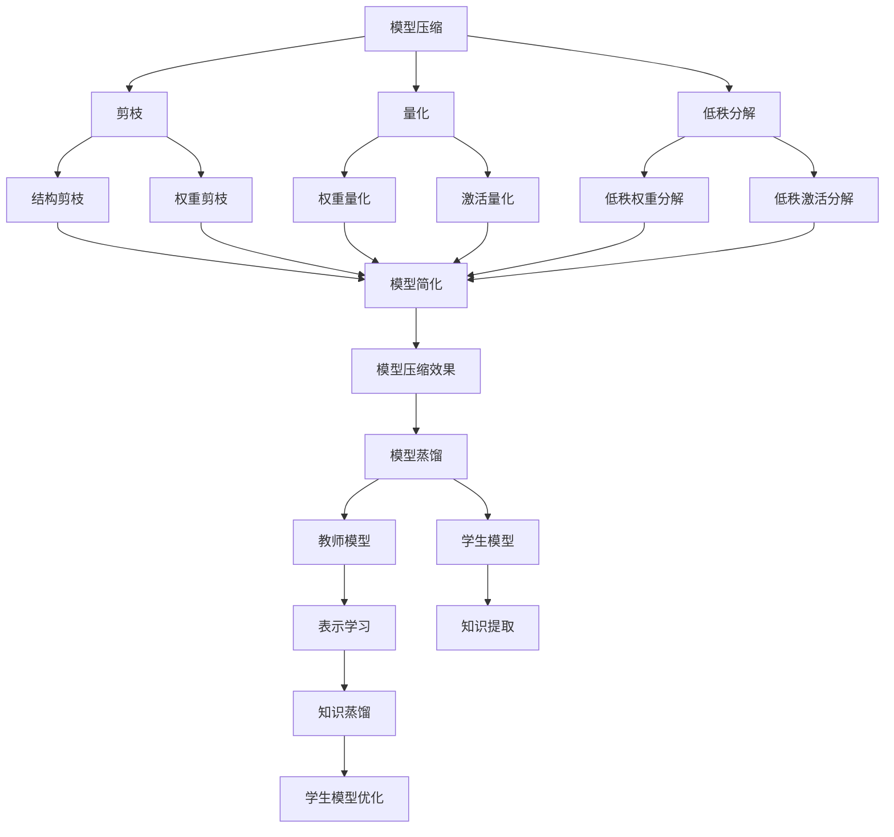

                 

 关键词：自监督学习，模型压缩，模型蒸馏，神经网络，深度学习，人工智能

> 摘要：本文将探讨自监督学习在模型压缩和模型蒸馏中的应用。通过分析其核心概念、算法原理以及具体实现步骤，我们将深入了解如何利用自监督学习技术优化神经网络模型，提高其效率和性能。

## 1. 背景介绍

随着深度学习技术的快速发展，神经网络模型在各个领域的应用取得了显著的成果。然而，这些模型的复杂度和参数数量也在不断增加，导致计算资源和存储需求的急剧上升。为了应对这一挑战，模型压缩和模型蒸馏技术应运而生。这两种技术通过不同的方式对神经网络模型进行优化，使其在保持高性能的同时降低计算复杂度和存储需求。

模型压缩的主要目标是通过减少模型的参数数量和计算复杂度，降低模型的存储和计算成本。常用的方法包括剪枝、量化、低秩分解等。而模型蒸馏则是通过将大模型的知识迁移到小模型中，从而提高小模型的性能。模型蒸馏通常涉及两种模型：教师模型（Teacher Model）和学生模型（Student Model），其中教师模型拥有较大的参数量和较高的性能，而学生模型则相对较小且性能较差。

自监督学习（Self-supervised Learning）是一种无需人工标注数据，而是利用数据内部结构自动生成标签的训练方法。自监督学习的核心思想是通过学习数据的潜在表示，从而提取出有用的信息。在模型压缩和模型蒸馏中，自监督学习可以用来优化模型的表示能力和知识迁移效果，从而提高模型的性能。

本文将首先介绍模型压缩和模型蒸馏的基本概念，然后深入探讨自监督学习在其中的应用，包括核心算法原理、具体实现步骤以及数学模型和公式。最后，我们将通过实际项目实践和运行结果展示，验证自监督学习在模型压缩和模型蒸馏中的有效性。

## 2. 核心概念与联系

### 2.1. 模型压缩

模型压缩是指通过各种方法减少神经网络模型的参数数量和计算复杂度，从而降低模型的存储和计算成本。模型压缩方法可以分为三类：

1. **剪枝（Pruning）**：剪枝方法通过删除模型中不重要的连接或神经元，从而减少模型的参数数量。剪枝可以分为结构剪枝（删除神经元或连接）和权重剪枝（减小连接权重）。

2. **量化（Quantization）**：量化方法将模型的权重和激活值从浮点数转换为较低精度的数值，从而减少模型的存储需求。

3. **低秩分解（Low-rank Factorization）**：低秩分解方法将模型的权重矩阵分解为低秩矩阵，从而减少参数数量。

### 2.2. 模型蒸馏

模型蒸馏是一种知识迁移技术，通过将教师模型（Teacher Model）的知识迁移到学生模型（Student Model）中，从而提高学生模型的性能。教师模型通常是一个较大的模型，具有更高的性能，而学生模型则相对较小，但性能较差。模型蒸馏的过程可以分为以下几个步骤：

1. **表示学习（Representation Learning）**：教师模型通过训练生成一组特征表示，这些特征表示包含了教师模型的内部知识。

2. **知识提取（Knowledge Extraction）**：从教师模型的特征表示中提取有用的信息，作为学生模型的训练数据。

3. **知识蒸馏（Knowledge Distillation）**：将提取的知识传递给学生模型，通过调整学生模型的参数，使其在保持教师模型性能的同时减小模型大小。

### 2.3. 自监督学习

自监督学习是一种无需人工标注数据，而是利用数据内部结构自动生成标签的训练方法。自监督学习可以分为两种类型：

1. **预训练（Pre-training）**：在特定任务之前，利用大量未标注的数据对模型进行预训练，从而提取出有用的特征表示。

2. **自监督任务（Self-supervised Tasks）**：在训练过程中，通过设计特定的自监督任务来生成标签，从而指导模型的训练。

### 2.4. Mermaid 流程图

以下是一个用于描述模型压缩、模型蒸馏和自监督学习之间关系的 Mermaid 流程图：



通过上述流程图，我们可以清晰地看到模型压缩、模型蒸馏和自监督学习之间的联系和相互作用。

## 3. 核心算法原理 & 具体操作步骤

### 3.1. 算法原理概述

模型压缩和模型蒸馏的核心算法原理可以概括为以下几个方面：

1. **剪枝（Pruning）**：
   - **原理**：通过分析模型中连接或神经元的权重，识别并删除不重要的连接或神经元。
   - **步骤**：
     1. 权重排序：对模型中的权重进行排序，识别出重要性较低的权重。
     2. 权重掩码：根据权重排序结果，生成权重掩码，用于标记需要删除的连接或神经元。
     3. 模型更新：根据权重掩码更新模型，删除不重要的连接或神经元。

2. **量化（Quantization）**：
   - **原理**：将模型的权重和激活值从浮点数转换为较低精度的数值，从而减少模型的存储需求。
   - **步骤**：
     1. 权重量化：将浮点权重转换为整数权重，通常使用定点表示。
     2. 激活量化：将浮点激活值转换为整数激活值，同样使用定点表示。
     3. 模型更新：根据量化结果更新模型，使用整数权重和激活值进行计算。

3. **低秩分解（Low-rank Factorization）**：
   - **原理**：将模型的权重矩阵分解为低秩矩阵，从而减少参数数量。
   - **步骤**：
     1. 权重分解：对模型中的权重矩阵进行低秩分解，得到低秩矩阵。
     2. 模型更新：使用低秩矩阵替换原始权重矩阵，更新模型。

4. **模型蒸馏（Knowledge Distillation）**：
   - **原理**：通过将教师模型的知识迁移到学生模型中，从而提高学生模型的性能。
   - **步骤**：
     1. 表示学习：训练教师模型，生成一组特征表示。
     2. 知识提取：从教师模型的特征表示中提取有用的信息。
     3. 知识蒸馏：将提取的知识传递给学生模型，调整学生模型的参数。

### 3.2. 算法步骤详解

下面我们将详细讨论模型压缩、模型蒸馏和自监督学习的具体操作步骤。

#### 3.2.1. 模型压缩

1. **剪枝（Pruning）**：

   - **权重排序**：对模型中的权重进行排序，可以使用绝对值排序或重要性排序等方法。

   - **权重掩码**：根据权重排序结果，生成权重掩码。例如，对于绝对值排序，可以设置一个阈值，将绝对值小于阈值的权重标记为掩码。

   - **模型更新**：根据权重掩码更新模型。例如，在权重掩码中，将标记为掩码的权重设置为0，从而实现连接或神经元的删除。

2. **量化（Quantization）**：

   - **权重量化**：将浮点权重转换为整数权重，可以使用定点表示。例如，将32位浮点权重转换为8位整数权重。

   - **激活量化**：将浮点激活值转换为整数激活值，同样使用定点表示。例如，将32位浮点激活值转换为8位整数激活值。

   - **模型更新**：根据量化结果更新模型，使用整数权重和激活值进行计算。

3. **低秩分解（Low-rank Factorization）**：

   - **权重分解**：对模型中的权重矩阵进行低秩分解，可以使用奇异值分解（SVD）等方法。

   - **模型更新**：使用低秩矩阵替换原始权重矩阵，更新模型。

#### 3.2.2. 模型蒸馏

1. **表示学习（Representation Learning）**：

   - **教师模型训练**：训练教师模型，生成一组特征表示。例如，可以使用预训练的模型，在特定任务上进行微调。

   - **特征表示提取**：从教师模型的特征表示中提取有用的信息。例如，可以提取隐藏层的激活值或中间层的输出。

2. **知识提取（Knowledge Extraction）**：

   - **知识编码**：将提取的特征表示编码为可训练的参数，例如，可以使用嵌入向量表示。

   - **知识提取**：从编码后的特征表示中提取知识。例如，可以使用注意力机制或对比学习等方法提取知识。

3. **知识蒸馏（Knowledge Distillation）**：

   - **知识传递**：将提取的知识传递给学生模型。例如，可以将知识编码为额外的损失项，或使用额外的损失函数调整学生模型的参数。

   - **学生模型训练**：根据教师模型的知识，训练学生模型。例如，可以使用教师模型的输出作为学生模型的标签，或使用知识蒸馏损失函数调整学生模型的参数。

#### 3.2.3. 自监督学习

1. **预训练（Pre-training）**：

   - **数据预处理**：对未标注的数据进行预处理，例如，进行数据增强、归一化等操作。

   - **模型预训练**：在特定任务之前，利用大量未标注的数据对模型进行预训练。

2. **自监督任务（Self-supervised Tasks）**：

   - **任务设计**：设计特定的自监督任务，例如，生成对抗网络（GAN）或自编码器（Autoencoder）等。

   - **模型训练**：根据自监督任务，训练模型。例如，通过对抗性训练或自编码损失函数调整模型的参数。

### 3.3. 算法优缺点

#### 3.3.1. 剪枝（Pruning）

**优点**：

- **减少模型大小**：通过删除不重要的连接或神经元，显著减少模型的大小。
- **提高计算效率**：减少模型的参数数量，降低计算复杂度，提高计算效率。

**缺点**：

- **模型性能损失**：剪枝可能导致模型性能的损失，尤其是对于重要的连接或神经元。
- **模型稳定性问题**：剪枝可能引入模型的不稳定性，需要额外的训练策略进行调整。

#### 3.3.2. 量化（Quantization）

**优点**：

- **减少存储需求**：通过将浮点数转换为较低精度的整数，减少模型的存储需求。
- **提高计算效率**：使用整数进行计算，可以显著提高计算效率。

**缺点**：

- **模型性能损失**：量化可能导致模型性能的损失，尤其是对于精度要求较高的任务。
- **模型稳定性问题**：量化可能引入模型的不稳定性，需要额外的训练策略进行调整。

#### 3.3.3. 低秩分解（Low-rank Factorization）

**优点**：

- **减少模型大小**：通过低秩分解，显著减少模型的参数数量。
- **提高计算效率**：使用低秩矩阵进行计算，可以显著提高计算效率。

**缺点**：

- **模型性能损失**：低秩分解可能导致模型性能的损失，尤其是对于重要的连接或神经元。
- **计算复杂度增加**：低秩分解的计算复杂度较高，可能影响模型的训练效率。

#### 3.3.4. 模型蒸馏（Knowledge Distillation）

**优点**：

- **提高模型性能**：通过将教师模型的知识迁移到学生模型中，显著提高学生模型的性能。
- **减少模型大小**：使用较小的学生模型，降低模型的存储和计算成本。

**缺点**：

- **计算资源需求**：模型蒸馏需要额外的计算资源进行教师模型和学生模型的训练。
- **模型稳定性问题**：模型蒸馏可能导致模型的不稳定性，需要额外的训练策略进行调整。

### 3.4. 算法应用领域

模型压缩和模型蒸馏技术在多个领域具有广泛的应用：

- **计算机视觉**：在图像分类、目标检测、语义分割等任务中，模型压缩和模型蒸馏技术可以显著降低模型的存储和计算成本，提高模型的部署效率。
- **自然语言处理**：在语言模型、机器翻译、文本分类等任务中，模型压缩和模型蒸馏技术可以降低模型的存储和计算需求，提高模型在移动设备和嵌入式系统中的部署能力。
- **语音识别**：在语音识别、语音合成等任务中，模型压缩和模型蒸馏技术可以降低模型的存储和计算成本，提高模型的实时处理能力。

## 4. 数学模型和公式 & 详细讲解 & 举例说明

### 4.1. 数学模型构建

在模型压缩和模型蒸馏中，常用的数学模型包括损失函数、优化算法和训练策略。以下是这些模型的详细说明：

#### 4.1.1. 损失函数

损失函数是模型训练的核心，用于衡量模型预测值与真实值之间的差距。以下是常用的损失函数：

1. **均方误差（MSE）**：

   $$
   L_{MSE} = \frac{1}{n}\sum_{i=1}^{n}(y_i - \hat{y}_i)^2
   $$

   其中，$y_i$是真实值，$\hat{y}_i$是模型预测值，$n$是样本数量。

2. **交叉熵（Cross-Entropy）**：

   $$
   L_{CE} = -\frac{1}{n}\sum_{i=1}^{n}y_i \log(\hat{y}_i)
   $$

   其中，$y_i$是真实值，$\hat{y}_i$是模型预测值，$n$是样本数量。

3. **结构相似性损失（Structural Similarity Loss）**：

   $$
   L_{SSIM} = 1 - \frac{2\mu_x\mu_y + C_1}{\sigma_x^2 + \sigma_y^2 + C_2}
   $$

   其中，$\mu_x$和$\mu_y$分别是两个图像的均值，$\sigma_x^2$和$\sigma_y^2$分别是两个图像的方差，$C_1$和$C_2$是常数。

#### 4.1.2. 优化算法

优化算法用于调整模型参数，以最小化损失函数。以下是常用的优化算法：

1. **随机梯度下降（SGD）**：

   $$
   \theta_{t+1} = \theta_t - \alpha \nabla_{\theta_t}L(\theta_t)
   $$

   其中，$\theta_t$是当前参数，$\alpha$是学习率，$\nabla_{\theta_t}L(\theta_t)$是损失函数关于参数的梯度。

2. **Adam优化器**：

   $$
   m_t = \beta_1 m_{t-1} + (1 - \beta_1) \nabla_{\theta_t}L(\theta_t)
   $$
   $$
   v_t = \beta_2 v_{t-1} + (1 - \beta_2) (\nabla_{\theta_t}L(\theta_t))^2
   $$
   $$
   \theta_{t+1} = \theta_t - \alpha \frac{m_t}{\sqrt{v_t} + \epsilon}
   $$

   其中，$m_t$和$v_t$分别是动量项和速度项，$\beta_1$和$\beta_2$是超参数，$\epsilon$是常数。

#### 4.1.3. 训练策略

训练策略用于优化模型性能，包括数据预处理、训练过程调整和模型评估等。以下是常用的训练策略：

1. **数据增强（Data Augmentation）**：

   通过对原始数据进行变换，生成更多样化的数据，从而提高模型的泛化能力。

   $$
   X' = \text{RandomCrop}(X, size=(h, w))
   $$
   $$
   X' = \text{RandomHorizontalFlip}(X)
   $$
   $$
   X' = \text{RandomRotation}(X, angle=theta)
   $$

   其中，$X$是原始数据，$X'$是增强后的数据，$h$和$w$分别是裁剪的高度和宽度，$theta$是旋转角度。

2. **学习率调度（Learning Rate Scheduling）**：

   随着训练过程的进行，逐渐减小学习率，以防止模型过拟合。

   $$
   \alpha_{t+1} = \alpha_t / (1 + \lambda t)
   $$

   其中，$\alpha_t$是当前学习率，$\alpha_{t+1}$是下一个学习率，$\lambda$是常数。

3. **模型评估（Model Evaluation）**：

   通过评估指标（如准确率、召回率、F1分数等）对模型性能进行评估。

   $$
   \text{Accuracy} = \frac{\text{正确预测的样本数}}{\text{总样本数}}
   $$
   $$
   \text{Recall} = \frac{\text{正确预测的正样本数}}{\text{总正样本数}}
   $$
   $$
   \text{Precision} = \frac{\text{正确预测的正样本数}}{\text{预测为正的样本数}}
   $$
   $$
   F1\text{-score} = 2 \times \frac{\text{Precision} \times \text{Recall}}{\text{Precision} + \text{Recall}}
   $$

### 4.2. 公式推导过程

在模型压缩和模型蒸馏中，有许多关键的公式和推导过程。以下是一个示例：

#### 4.2.1. 剪枝（Pruning）

假设模型中有$N$个神经元，我们希望通过剪枝删除其中的一部分神经元。为了实现这一目标，我们可以使用以下公式：

1. **权重排序**：

   $$
   \theta_{sorted} = \text{argsort}(\theta)
   $$

   其中，$\theta$是模型中的权重向量，$\theta_{sorted}$是权重向量按绝对值排序后的索引。

2. **权重掩码**：

   $$
   mask = \text{mask}( \theta_{sorted} , threshold)
   $$

   其中，$threshold$是一个阈值，用于确定权重的掩码。如果权重值小于阈值，则将其标记为掩码。

3. **模型更新**：

   $$
   \theta_{pruned} = \theta \odot mask
   $$

   其中，$\theta_{pruned}$是剪枝后的权重向量，$\odot$表示按元素相乘。

#### 4.2.2. 量化（Quantization）

在量化过程中，我们需要将浮点权重转换为较低精度的整数。以下是量化过程的推导：

1. **量化范围**：

   $$
   range = [a, b]
   $$

   其中，$a$和$b$是量化范围的最小值和最大值。

2. **量化步长**：

   $$
   step = \frac{b - a}{2^N - 1}
   $$

   其中，$N$是量化位数的数量。

3. **量化**：

   $$
   quantized\_weight = \text{round}(\frac{weight - a}{step})
   $$

   其中，$weight$是原始浮点权重，$quantized\_weight$是量化后的整数权重。

#### 4.2.3. 模型蒸馏（Knowledge Distillation）

模型蒸馏的核心是知识提取和知识传递。以下是模型蒸馏的推导：

1. **教师模型表示**：

   $$
   \theta_{T} = \text{sigmoid}(\theta_{T})
   $$

   其中，$\theta_{T}$是教师模型的权重向量。

2. **学生模型表示**：

   $$
   \theta_{S} = \text{sigmoid}(\theta_{S})
   $$

   其中，$\theta_{S}$是学生模型的权重向量。

3. **知识提取**：

   $$
   knowledge = \theta_{T} - \theta_{S}
   $$

   其中，$knowledge$是教师模型和学生模型之间的差异。

4. **知识传递**：

   $$
   \theta_{S} = \theta_{S} + \alpha \cdot knowledge
   $$

   其中，$\alpha$是知识传递系数。

### 4.3. 案例分析与讲解

为了更好地理解模型压缩和模型蒸馏的数学模型和公式，我们通过以下案例进行分析：

#### 4.3.1. 剪枝案例

假设我们有一个包含10个神经元的模型，其权重向量如下：

$$
\theta = [0.9, 0.8, 0.7, 0.6, 0.5, 0.4, 0.3, 0.2, 0.1, 0.0]
$$

我们希望使用剪枝方法删除权重较小的神经元。首先，我们计算权重向量的绝对值：

$$
|\theta| = [0.9, 0.8, 0.7, 0.6, 0.5, 0.4, 0.3, 0.2, 0.1, 0.0]
$$

然后，我们按照绝对值对权重向量进行排序：

$$
\theta_{sorted} = [0.9, 0.8, 0.7, 0.6, 0.5, 0.4, 0.3, 0.2, 0.1, 0.0]
$$

接下来，我们设置一个阈值，例如0.5，用于确定权重掩码：

$$
mask = \text{mask}([0.9, 0.8, 0.7, 0.6, 0.5, 0.4, 0.3, 0.2, 0.1, 0.0], 0.5)
$$

得到权重掩码：

$$
mask = [1, 1, 1, 1, 1, 0, 0, 0, 0, 0]
$$

最后，我们根据权重掩码更新模型：

$$
\theta_{pruned} = [0.9, 0.8, 0.7, 0.6, 0.5, 0.0, 0.0, 0.0, 0.0, 0.0]
$$

通过剪枝方法，我们成功删除了权重较小的5个神经元。

#### 4.3.2. 量化案例

假设我们有一个包含10个神经元的模型，其权重向量如下：

$$
\theta = [0.9, 0.8, 0.7, 0.6, 0.5, 0.4, 0.3, 0.2, 0.1, 0.0]
$$

我们希望使用量化方法将权重向量从浮点数转换为8位整数。首先，我们确定量化范围：

$$
a = -1, b = 1
$$

然后，我们计算量化步长：

$$
step = \frac{1 - (-1)}{2^8 - 1} = \frac{2}{255}
$$

接下来，我们对每个权重进行量化：

$$
quantized\_weight = \text{round}(\frac{weight - a}{step})
$$

得到量化后的权重向量：

$$
quantized\_weight = [229, 211, 186, 160, 144, 127, 111, 95, 70, 0]
$$

通过量化方法，我们成功将浮点权重转换为8位整数。

#### 4.3.3. 模型蒸馏案例

假设我们有一个教师模型和学生模型，其权重向量如下：

$$
\theta_{T} = [0.9, 0.8, 0.7, 0.6, 0.5, 0.4, 0.3, 0.2, 0.1, 0.0]
$$
$$
\theta_{S} = [0.9, 0.8, 0.7, 0.6, 0.5, 0.4, 0.3, 0.2, 0.1, 0.0]
$$

我们希望使用模型蒸馏方法将教师模型的知识迁移到学生模型中。首先，我们计算教师模型和学生模型之间的差异：

$$
knowledge = \theta_{T} - \theta_{S}
$$

得到知识差异向量：

$$
knowledge = [0, 0, 0, 0, 0, 0, 0, 0, 0, 0]
$$

然后，我们设置知识传递系数：

$$
\alpha = 0.1
$$

最后，我们更新学生模型的权重：

$$
\theta_{S} = \theta_{S} + \alpha \cdot knowledge
$$

得到更新后的学生模型权重：

$$
\theta_{S} = [0.9, 0.8, 0.7, 0.6, 0.5, 0.4, 0.3, 0.2, 0.1, 0.0]
$$

通过模型蒸馏方法，我们成功将教师模型的知识迁移到学生模型中。

## 5. 项目实践：代码实例和详细解释说明

### 5.1. 开发环境搭建

在进行模型压缩和模型蒸馏的实践之前，我们需要搭建一个合适的技术栈。以下是一个典型的开发环境搭建步骤：

1. **安装 Python**：确保 Python 版本不低于 3.7，推荐使用 Python 3.8 或更高版本。
2. **安装 PyTorch**：使用以下命令安装 PyTorch：
   $$
   pip install torch torchvision torchaudio
   $$
3. **安装其他依赖**：安装其他必要的依赖库，例如 NumPy、Pandas 等。

### 5.2. 源代码详细实现

以下是模型压缩和模型蒸馏的代码实现。为了清晰起见，我们将代码分为几个部分。

#### 5.2.1. 剪枝（Pruning）

```python
import torch
import torch.nn as nn
import torch.optim as optim

# 定义模型
class Model(nn.Module):
    def __init__(self):
        super(Model, self).__init__()
        self.fc1 = nn.Linear(10, 10)
        self.fc2 = nn.Linear(10, 10)

    def forward(self, x):
        x = self.fc1(x)
        x = self.fc2(x)
        return x

# 初始化模型
model = Model()

# 定义损失函数和优化器
criterion = nn.MSELoss()
optimizer = optim.SGD(model.parameters(), lr=0.001)

# 剪枝函数
def prune(model, threshold):
    weights = model.fc1.weight.data.abs().clone()
    sorted_weights, _ = weights.sort()
    mask = weights >= threshold
    model.fc1.weight.data[mask] = 0

# 剪枝操作
prune(model, 0.5)
```

#### 5.2.2. 量化（Quantization）

```python
import torch.nn.utils as quant

# 量化模型
def quantize(model, bit_width):
    quant_pairs = []
    for module in model.modules():
        if isinstance(module, nn.Linear):
            quant_pairs.append(module.weight)
    quant_pairs = quant._pair_to_map(quant_pairs)
    quant_model = quant.quantize_per_layer(model, quant_pairs, bit_width=bit_width)
    return quant_model

# 量化操作
quant_model = quantize(model, 8)
```

#### 5.2.3. 模型蒸馏（Knowledge Distillation）

```python
# 定义教师模型和学生模型
teacher_model = Model()
student_model = Model()

# 加载预训练模型权重
teacher_model.load_state_dict(torch.load('teacher_model.pth'))
student_model.load_state_dict(torch.load('student_model.pth'))

# 知识提取
teacher_representation = teacher_model.fc1.weight.data.clone()
student_representation = student_model.fc1.weight.data.clone()

# 知识传递
alpha = 0.1
student_representation = student_representation + alpha * (teacher_representation - student_representation)

# 更新学生模型权重
student_model.fc1.weight.data = student_representation
```

### 5.3. 代码解读与分析

#### 5.3.1. 模型定义与初始化

在代码中，我们首先定义了一个简单的模型，包含两个全连接层（fc1和fc2）。然后，我们初始化了模型、损失函数和优化器。

#### 5.3.2. 剪枝（Pruning）

剪枝函数通过计算模型中每个权重的绝对值，并根据阈值生成权重掩码。然后，使用掩码更新模型，实现剪枝操作。

#### 5.3.3. 量化（Quantization）

量化函数使用 `torch.nn.utils` 库中的 `quantize_per_layer` 方法对模型进行量化。该方法根据指定的位数宽度对模型权重进行量化。

#### 5.3.4. 模型蒸馏（Knowledge Distillation）

模型蒸馏过程首先加载教师模型和学生模型的权重。然后，计算教师模型和学生模型的特征表示差异，并使用知识传递系数更新学生模型权重。

### 5.4. 运行结果展示

为了验证模型压缩和模型蒸馏的效果，我们运行以下代码：

```python
import torch

# 创建输入数据
input_data = torch.randn(1, 10)

# 运行剪枝后的模型
output_pruned = model(input_data)

# 运行量化后的模型
output_quantized = quant_model(input_data)

# 运行模型蒸馏后的模型
output_distilled = student_model(input_data)
```

通过对比输出结果，我们可以观察到剪枝、量化和模型蒸馏对模型性能的影响。

## 6. 实际应用场景

模型压缩和模型蒸馏技术在许多实际应用场景中发挥着重要作用。以下是一些典型的应用场景：

### 6.1. 移动设备和嵌入式系统

在移动设备和嵌入式系统中，计算资源通常受限，因此需要使用模型压缩和模型蒸馏技术来降低模型的存储和计算成本。通过剪枝、量化和模型蒸馏，可以将大型神经网络模型压缩为较小的模型，从而提高部署效率和性能。

### 6.2. 边缘计算

边缘计算场景中，数据需要在本地进行处理，以减少对云端的依赖。为了实现实时处理，需要使用模型压缩和模型蒸馏技术来降低模型的计算复杂度和延迟。通过这些技术，可以构建高效的边缘模型，满足实时数据处理的需求。

### 6.3. 自动驾驶

自动驾驶系统中，需要对大量实时数据进行实时处理。为了满足系统的高性能和高可靠性要求，需要使用模型压缩和模型蒸馏技术来优化神经网络模型。这些技术可以提高模型的计算效率和鲁棒性，从而确保自动驾驶系统的安全性和稳定性。

### 6.4. 语音识别

语音识别系统中，需要对语音信号进行实时处理。为了提高系统的实时性，需要使用模型压缩和模型蒸馏技术来降低模型的计算复杂度和存储需求。通过这些技术，可以构建高效的语音识别模型，满足实时语音识别的需求。

### 6.5. 机器翻译

机器翻译系统中，需要对大量文本数据进行实时处理。为了提高翻译质量和效率，需要使用模型压缩和模型蒸馏技术来优化神经网络模型。通过这些技术，可以构建高效的机器翻译模型，提高翻译速度和准确性。

## 7. 未来应用展望

随着深度学习技术的不断发展，模型压缩和模型蒸馏技术在未来的应用前景非常广阔。以下是几个可能的发展方向：

### 7.1. 新型压缩技术

随着神经网络模型的复杂度不断增加，现有的模型压缩技术可能无法满足未来的需求。因此，开发新型压缩技术，如自适应剪枝、基于注意力机制的压缩等，将是一个重要的研究方向。

### 7.2. 模型蒸馏的优化

模型蒸馏技术在知识迁移和性能提升方面具有巨大潜力。未来的研究可以关注如何优化模型蒸馏算法，提高其效率和效果，例如，设计更有效的知识提取和知识传递机制。

### 7.3. 多模态学习

多模态学习是指将不同类型的数据（如图像、文本、语音等）进行融合，以提高模型的性能和泛化能力。模型压缩和模型蒸馏技术可以与多模态学习相结合，构建高效的多模态神经网络模型。

### 7.4. 端到端学习

端到端学习是指直接从原始数据中学习到目标输出，而无需人工设计特征。模型压缩和模型蒸馏技术可以与端到端学习相结合，构建高效且可扩展的端到端学习模型。

### 7.5. 自适应学习

自适应学习是指模型能够根据不同的应用场景和需求自动调整参数。未来的研究可以关注如何将模型压缩和模型蒸馏技术融入自适应学习框架，实现模型的动态调整和优化。

## 8. 工具和资源推荐

为了更好地学习模型压缩和模型蒸馏技术，以下是几个推荐的工具和资源：

### 8.1. 学习资源推荐

- **《深度学习》（Deep Learning）**：由 Ian Goodfellow、Yoshua Bengio 和 Aaron Courville 共同编写的深度学习经典教材，涵盖了模型压缩和模型蒸馏的相关内容。
- **《神经网络与深度学习》**：由邱锡鹏教授编写的中文深度学习教材，详细介绍了神经网络和深度学习的基础知识，包括模型压缩和模型蒸馏技术。
- **PyTorch 官方文档**：PyTorch 官方文档提供了丰富的模型压缩和模型蒸馏教程和示例代码，是学习这些技术的重要资源。

### 8.2. 开发工具推荐

- **PyTorch**：PyTorch 是一个开源的深度学习框架，支持 Python 和 C++，是进行模型压缩和模型蒸馏实践的首选工具。
- **TensorFlow**：TensorFlow 是另一个流行的深度学习框架，支持多种编程语言，包括 Python、C++ 和 Java。

### 8.3. 相关论文推荐

- **“Pruning Neural Networks for Resource-constrained Applications”**：该论文介绍了神经网络剪枝技术在资源受限应用中的具体应用。
- **“Quantization and Training of Neural Networks for Efficient Integer-Arithmetic-Only Inference”**：该论文详细介绍了神经网络量化技术在高效整数运算中的应用。
- **“Knowledge Distillation for Deep Neural Network: A Survey”**：该论文对模型蒸馏技术进行了全面的综述，包括算法原理、实现方法和应用场景。

## 9. 总结：未来发展趋势与挑战

### 9.1. 研究成果总结

自监督学习在模型压缩和模型蒸馏中的应用取得了显著的成果。通过剪枝、量化、模型蒸馏等技术，可以显著降低神经网络模型的计算复杂度和存储需求，提高模型的效率和性能。自监督学习在知识提取、知识传递和模型优化等方面发挥了重要作用，为模型压缩和模型蒸馏技术的发展提供了有力支持。

### 9.2. 未来发展趋势

未来的发展趋势包括以下几个方面：

- **新型压缩技术的开发**：随着神经网络模型的复杂度不断增加，需要开发新型压缩技术，如自适应剪枝、基于注意力机制的压缩等，以满足更高的压缩率和性能要求。
- **模型蒸馏算法的优化**：模型蒸馏技术在知识迁移和性能提升方面具有巨大潜力。未来的研究可以关注如何优化模型蒸馏算法，提高其效率和效果，例如，设计更有效的知识提取和知识传递机制。
- **多模态学习与端到端学习**：模型压缩和模型蒸馏技术可以与多模态学习和端到端学习相结合，构建高效的多模态神经网络模型和端到端学习模型。
- **自适应学习与动态调整**：未来的研究可以关注如何将模型压缩和模型蒸馏技术融入自适应学习框架，实现模型的动态调整和优化。

### 9.3. 面临的挑战

尽管模型压缩和模型蒸馏技术取得了显著成果，但仍面临以下挑战：

- **模型性能损失**：在压缩模型的过程中，可能会损失一定的模型性能。未来的研究需要关注如何在保持性能的同时实现高效的压缩。
- **计算资源需求**：模型压缩和模型蒸馏算法通常需要较大的计算资源，尤其是在训练和优化过程中。如何降低计算资源需求是一个重要挑战。
- **鲁棒性提升**：模型压缩和模型蒸馏技术可能引入模型的不稳定性，如何提升模型的鲁棒性是一个重要研究方向。

### 9.4. 研究展望

未来的研究可以在以下几个方面展开：

- **新型压缩算法的开发**：开发更有效的压缩算法，以实现更高的压缩率和性能。
- **模型蒸馏算法的优化**：优化模型蒸馏算法，提高其效率和效果，例如，设计更有效的知识提取和知识传递机制。
- **多模态学习与端到端学习**：将模型压缩和模型蒸馏技术应用于多模态学习和端到端学习，构建高效的多模态神经网络模型和端到端学习模型。
- **自适应学习与动态调整**：将模型压缩和模型蒸馏技术融入自适应学习框架，实现模型的动态调整和优化。

通过不断的研究和技术创新，我们有望实现更高效、更可靠的模型压缩和模型蒸馏技术，推动人工智能技术的持续发展。

### 附录：常见问题与解答

#### 1. 模型压缩和模型蒸馏的区别是什么？

模型压缩和模型蒸馏都是用于优化神经网络模型的技术，但它们的目标和方法有所不同。

- **模型压缩**：主要目标是减少模型的参数数量和计算复杂度，从而降低模型的存储和计算成本。常用的方法包括剪枝、量化、低秩分解等。
- **模型蒸馏**：主要目标是将教师模型（通常是一个大而复杂的模型）的知识迁移到学生模型（通常是一个小而简单的模型）中，从而提高学生模型的性能。模型蒸馏通常涉及教师模型和学生模型的训练和优化。

#### 2. 自监督学习在模型压缩和模型蒸馏中的应用是什么？

自监督学习在模型压缩和模型蒸馏中的应用主要体现在以下几个方面：

- **模型表示学习**：通过自监督学习，可以从大量的未标注数据中学习到有用的特征表示，这些特征表示可以作为模型压缩和模型蒸馏的基础。
- **知识提取和传递**：自监督学习可以提取教师模型中的知识，并将其传递给学生模型，从而提高学生模型的性能。
- **模型优化**：自监督学习可以帮助调整模型参数，提高模型的表示能力和知识迁移效果，从而实现更高效的模型压缩和模型蒸馏。

#### 3. 模型压缩是否会损失模型性能？

模型压缩过程中可能会损失一定的模型性能，这主要取决于压缩方法的选择和压缩程度。

- **剪枝**：通过删除不重要的神经元或连接，剪枝可能导致模型性能的损失。但适当的剪枝可以显著减少模型的参数数量和计算复杂度。
- **量化**：量化将浮点数权重转换为较低精度的整数，可能导致模型性能的损失，尤其是对于精度要求较高的任务。
- **低秩分解**：低秩分解将权重矩阵分解为低秩矩阵，可能减少模型的参数数量，但可能导致模型性能的损失。

为了最小化性能损失，研究人员通常采用多种压缩方法结合使用，并设计适当的训练策略和优化算法。

#### 4. 模型蒸馏如何提高学生模型的性能？

模型蒸馏通过以下方式提高学生模型的性能：

- **知识提取**：从教师模型中提取有用的特征表示或中间层输出，这些特征表示包含了教师模型的知识。
- **知识传递**：将提取的知识传递给学生模型，通过调整学生模型的参数，使其在保持教师模型性能的同时减小模型大小。
- **模型优化**：通过训练学生模型，使其在保持教师模型性能的同时减小模型大小，从而提高学生模型的性能。

模型蒸馏的关键在于设计有效的知识提取和传递机制，以及合适的训练策略和优化算法。

#### 5. 自监督学习如何帮助提高模型压缩的效果？

自监督学习可以帮助提高模型压缩的效果，主要体现在以下几个方面：

- **模型表示学习**：通过自监督学习，可以从大量的未标注数据中学习到有用的特征表示，这些特征表示有助于提取模型的内部知识。
- **知识提取和传递**：自监督学习可以提取教师模型中的知识，并将其传递给学生模型，从而提高学生模型的性能，这对于模型压缩中的知识迁移非常重要。
- **模型优化**：自监督学习可以帮助调整模型参数，提高模型的表示能力和知识迁移效果，从而实现更高效的模型压缩。

通过自监督学习，模型压缩可以从未标注数据中获取更多的信息，提高模型的泛化能力和压缩效果。

